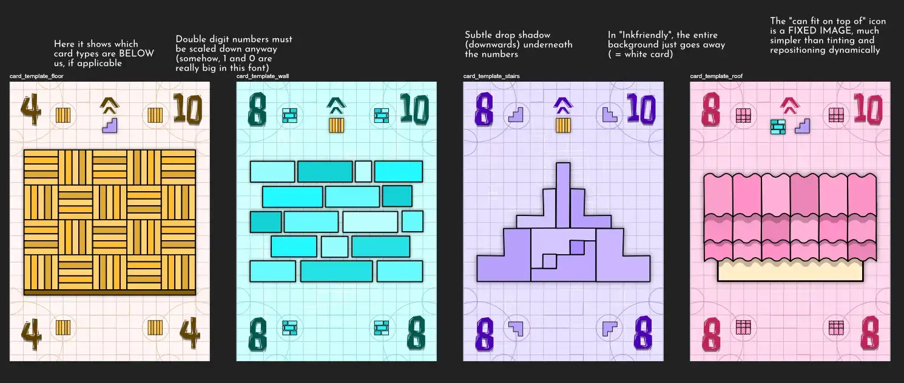
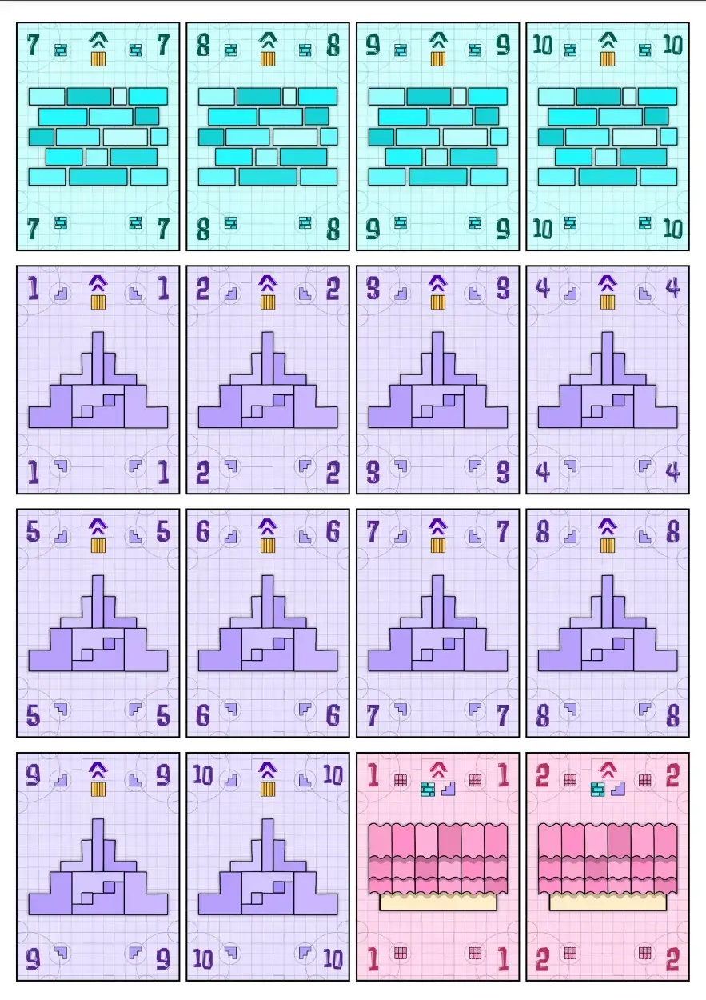

Welcome to the devlog for my game called [Bidding Blocks](https://pandaqi.com/bidding-blocks/). 

It will be a short one, as the game was developed rather quickly and considered more of a "mini game" in-between bigger game projects. Nevertheless, the game turned out more than good enough, otherwise you would've never even known of its existence ;)

## What's the idea?

### The original idea

Over time, I usually stumble upon small card games, getting some inspiration here and there for new fun mechanics.

That's how I stumbled upon Tichu, which is a game about bidding how much you'll score ... but it "staggers" your bids. You get half your cards first, _then_ you may bid if you want, then you get the _other half of your cards_. The earlier your bid---with less information/certainty---the more you get for it.

I thought this was a very neat idea. I also thought doing it only once, halfway, was needlessly restrictive and convoluted.

Instead, I aimed to make a game with the following core idea.

* You get your cards _one at a time_.
* At any point, after receiving your card, you may _bid how many rounds you will win_.
* The earlier you bid, the more you'll score. (But if you bid wrong, of course, you score nothing.)

How do we turn that into a specific game? I expanded the idea a bit.

* When you make your bid, you write it down on a piece of paper: `BID / CARDS IN HAND`
  * BID = a number that states how many rounds you expect to win with your cards.
  * CARDS IN HAND = how many cards you had in your hand when you made the bid.
* The slash here is a great way to write it down, because **your final score is found by dividing the two**.
  * If you matched your bid, you get 100 points.
  * Then _divide it_ by that second number => If you bid while holding 5 cards, for example, you get 100 / 5 = 20 points in the end.
  * This is a very natural way to reward players for bidding _early_, so their score is divided by a much smaller number.
* The game itself would be a standard trick-taking game.

### Making it better

This, however, was a bit too simplistic.

* It's _really hard_ to know exactly how many tricks you'll win if you've only seen a few of your cards. Too hard, in fact.
* First Solution: "If you're _one off_ (e.g. you bid 6 but win 5), you still score 50 points."
* Second Solution: I need to add many ways to the game to adapt _on the fly_ to what's happening or which cards you're receiving.

With standard trick-taking, you're quite restricted in what you can do, and your _entire hand_ matters a lot. You just can't make any meaningful guesses about how well you will do when you've only seen a few cards. And if you're unlucky, you'll just keep getting bad hands where you win basically nothing and have no control over how the game plays out.

### Tricks with a Twist

That's why I introduced a slightly different way to play the rounds/tricks.

* Starting from the Dealer, everyone plays one card at a time.
* Your card must fit _on top of_ the previous card. (Hence "Bidding Blocks = a pun on Building Blocks". I'll explain more in a second.)
* If you can't (or don't want to) play a card, the round ends.
* The final card played wins the round.

In other words, rounds can be cut short quickly, or they can go around the table a few times. Players have the choice to continue or not, depending on their bid and their strategy. 

But high numbers aren't necessarily "better". You can't really be "unlucky" with your hand. Because what does it _mean_ to "fit on top of the previous card"?

* The suits are ordered: floors > walls / stairs > roof.
* You can either play a _higher number of the same suit_ ...
* Or you can simply play _a higher suit_.

Every round is like you're building a house together. First place the floors, then the walls, then the roof.

This gives plenty of ways to play a specific hand of cards and reach that bid you made. This _encourages_ players to be very risky and bid very early, because you _can_ make anything work if you play well.

While testing this version, I was quite satisfied. One annoyance, however, was left.

You can still be very unlucky with your cards and feel too restricted to have fun. If you only have floors and low numbers, you often can't go higher and have to cut a round short.

In some older games of mine, for example, I solved this by _inverting_ the numbers or rules in certain situations. This only fits slightly more complicated games, though, because it requires more brain power from the players. It also doesn't fit this game especially because you don't start building a house from roof to floor :p

Instead, I decided that the current Dealer can pick one of _two_ ways to play this round.

* The always-higher method that I just explained.
* Or **simultaneous**: everyone simultaneously plays a hand card, facedown. Once revealed, whoever played the highest number of the _type_ that the Dealer played, wins.

This creates more guesswork. This creates a situation where you _know_ your left neighbor must have a higher card than you, but if you make the round simultaneous, you can get lucky and win anyway.

I also simply like simultaneous turns in any game, because it makes the game faster and keeps players more active at all times.

With that decided, I considered the rules final.

## Let's make that!

### Generation

Generating the code for these cards is absolutely nothing special. Loop through all suits, loop through all numbers, save each combo as a card.

Moving on!

### Drawing

I wanted the cards to really show what they were. Instead of showing the _number_ again, such as your standard playing cards do, I wanted to show a _wall_ or a _roof_ in the center.

The actual number of the card would just go into the corners, including a simplified silhouette of the suit.

The biggest change from a standard deck, really, is that cards _show_ what they go "on top of". Why ask players to remember it? Just show that card X can always go on suit Y or Z on the card itself.

After some sketches, we get this:

The game is simple; the cards stay simple. I also don't want to stray too far from a standard deck of cards, so people can just use _that_ if they want.

### Simulation

This game was simple enough to add an interactive example to my rulebook, which also allows me to do a simulation. (Ask the computer to play 10,000 random turns and check if all the averages and overall balance checks out.)

In this case, the results were ...

* **Average challenges per game: ~10**. This is fine. It seems to scale pretty closely with the _number of cards_ players start with (which is, as you guessed, 10).
* **Average turns per player, per game: ~9**. (It can happen that you're out of cards and thus skipped in a few of the final rounds. Without that mechanic, this should of course be 10: the number of cards in your hand. I just wanted to check if it wasn't too far off, which would mean players are sitting around doing nothing with their lack of cards for a while.)
* **Average challenge length: ~4**. This means that, on average, 4 cards are played before someone gives up and the challenge is over. (Simultaneous rounds, where everyone just plays at the same time, are not counted here. Because, well, they're obviously always equal in length to the number of players.)

After considering these numbers and the fact that I'd like to support 5 players too, I decided to lower the number of starting cards to 8.

* The material still has 10 numbers in 4 suits ( = 40 cards). But with 5 players, you now have to deal 5 * 8 = 40 cards too!
* We don't need the full set of numbers in every game as much as other card games do. Because we have that second rule about cards that may be played. (Walls fit on floors, roofs fit on walls, no matter the number.)
* The average challenges per game drops down to ~8.5, which is still more than enough "meat" to the game.
* The average challenge length is now ~3.6, which is on the low side. But I always have to remember that this is a computer doing _random, stupid moves_ with no intention behind them. Also, there's a hard limit on challenge length to prevent the simulation crashing my computer because it tries to do 1 challenge with 40 cards :p

All in all, this seemed fair and balanced. Looking at the interactive examples, games are certainly not too short, you can always participate in challenges in some way (if you want; no matter your starting cards), and players have a good chance of hitting their bid exactly.

I called that a finished game.

Here's an image of the final material.

## Conclusion

I guess I learned a lot from all my previous card games. These rules came to me quite easily, the fixes for any problems were also implemented before I even created the paper prototype, and then it just worked!

The bidding mechanic as you receive cards makes that particular phase more interesting, asking the players interesting questions after _every single card received_. It also combats unlucky hands or low cards.

The fact you score 100 points for matching your bid---no matter how high or low---helps here too.

And the two ways to play rounds provide ample opportunity to wrangle your hand into a situation where you match your bid perfectly. Even if you bid extremely early or others are making weird moves.

This game was intended as a small little card game to take with you on holiday or whatever. A side project good enough to make. And that's all it is---it doesn't even have expansions! A rarity for me.

Until the next devlog,

Pandaqi