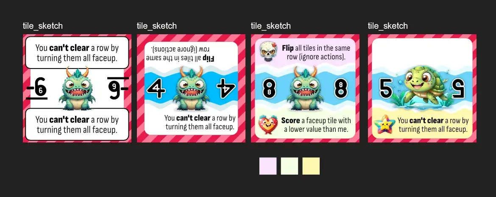
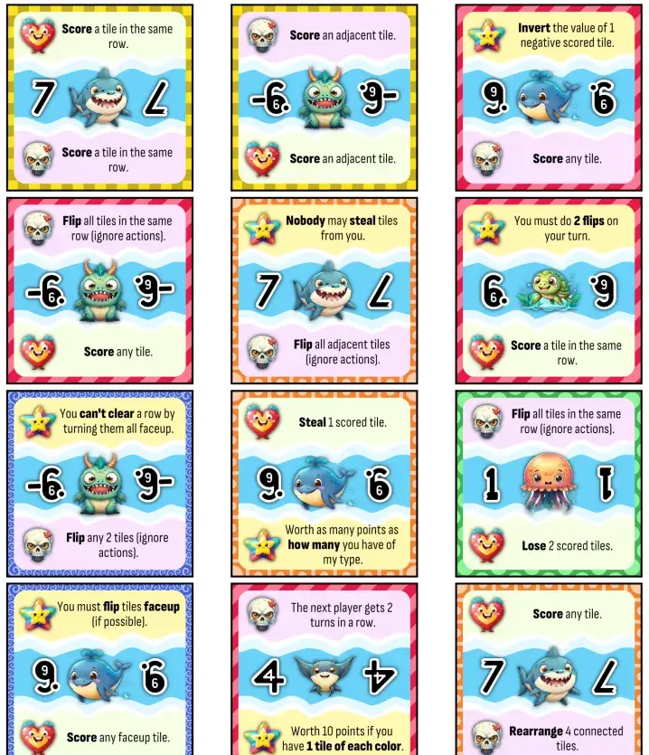
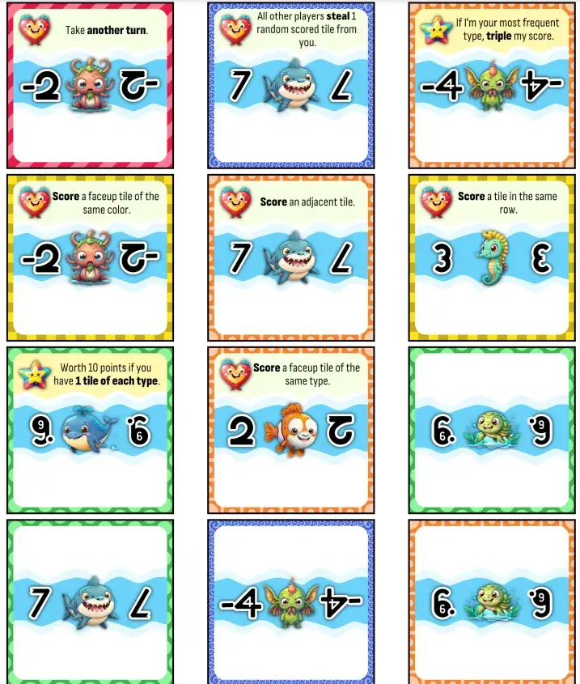

Welcome to the devlog for [Captain Flip](https://pandaqi.com/captain-flip/).

In this article, I'll briefly explain the development process behind this game. The original idea, what problems I encountered, why I made certain decisions, and so forth.

## What's the idea?

I have currently ranked my game ideas based on how "small" and "fast" they are to make. After years of making games, this has turned out to be the most useful ranking. Whenever I am ready to start the next project, I simply pick the game at the top of this list. (Which will be, roughly, the smallest and simplest idea I have.)

This was a relatively recent idea that quickly shot to the top of that list.

I asked myselF: "could I make a game in which your only action is just to _flip a tile_?"

I wrote down a few quick ideas for rulesets, but none really felt like a game with any depth. 

* If it's just about memorizing the best tiles, then it's just your basic memory game.
* If I want the tile to have varying powers or values (to different players), then we need _more rules_ to make that happen. (For example, I considered making the tiles _soldiers_ and you created your best army to defend yourself by flipping the tiles you did or didn't want.)
* If it's so important to know or reveal what's on tiles, then after a few turns, the entire board will simply be faceup and the whole idea useless!

It took a while before I found a clean, simple "game loop" for this game.

* Tiles have a POINT VALUE and one or two actions: HEART or SKULL.
* A heart action triggers when you flip a tile _faceup_ (it is "born").
* A skull action triggers when you flip a tile _facedown_ (it "dies").
* Scoring a tile means placing it before you and scoring its points at the end of the game.

Because of the different actions, players have reasons to flip tiles both ways. Moreover, the heart action (which you have to do from _memory_) is always more powerful than the skull one. So it becomes only _partially_ a memory game.

But the decoupling of the tile itself and "scoring" also was a Eureka moment. 

If you simply scored tiles by flipping them, then you could remember the best tiles and then just ... grab those. Not that interesting. Person with best memory (or attention span) wins :p (And if you played the game a few times, you'd also know all the tiles in the game by heart and it would be even more boring.)

Instead, flipping a tile just means taking its _action_, not necessarily scoring it. Scoring is simply the most common action, but it always has specific conditions. For example, "score an adjacent tile" or "score a tile in the same row".

The thing that finished the idea to me---which meant I could start this devlog and start prototyping---was one final rule: "you can only score facedown tiles".

This turned the gameplay into something like this:
* Find which tiles you want.
* Make sure they are facedown on your turn.
* So you can flip the right tile to score them.

Despite the extremely simple and consistent ruleset, this already leads to a tough challenge and lots of variation in strategy. At least, that's what I imagined.

Let's create a paper prototype and see.

## Lessons from the Prototype

### Preparing the material

When creating a paper prototype, I obviously have to make decision about what material to include.
* What are the min/max point values of tiles? How often do they occur?
* What are the actions and how do I represent them?
* Etcetera

I've learned to just come up with any random "rule" (that sounds sensible) to follow here. It's the very first prototype---an educated guess is the best we can do.

So, in this case, I decided to ...
* Include both positive and negative point values in equal measures (also including 0 tiles)
* Add 4 tiles for values below 4: 2 with both actions, 1 with only HEART, 1 with only SKULL.
* Add 2 tiles for larger values (4, 5, 6): all with both actions
* Mostly add skull actions that give _information_. (As that gives you a clear idea of what to do on your turn.)
* Which means the heart actions are for _scoring_ and "bigger impact" actions. (So you're rewarded for remembering them and using them at the right time.)

Hopefully this gives an idea of how I determine which tiles to hastily create and cut out for such prototypes. (I notice I usually don't talk about this and just say "I made an educated guess as to what material I needed", which isn't really helpful.)

I started with a grid of 5x5 tiles, with the main diagonals faceup (the rest facedown), and the rules explained above.

Also, yes, this means I ended up with slightly more tiles than I needed in a single game. But I prefer that anyway, as it means even the base game has variety and slight uncertainty about what is or isn't included.

Finally, while I usually don't like text on tiles and would prefer to use icons, that just feels too hard for this game. I want the actions to be so simple that I can write those one-liners on the tiles, otherwise you need to _also remember_ what exact action each icon stands for. (And including some expansions I want to add, the number of possible actions could be quite high.) 

So, yeah, actions should be simple enough to write them out on the tiles. And the final tiles will be quite a bit _larger_ than usual. (Which is also fine, because even with large tiles the number of pages to print would be at most 4 or 5. That's how small and simple this game would be.)

### Playing it

The biggest flaws usually jump out before even finishing that first game.

* Too many actions => It's overwhelming and doesn't actually help, as sometimes you just want to flip a tile facedown without taking an action anyway.
  * **Solution?** It's fine if more tiles have only 1 action or even 0 actions. 
* Bigger point differences => it feels a bit "meh" to put a lot of effort into scoring a 4 instead of a 3. Especially if bad luck or guessing gives you a -6 right away next turn.
  * **Solution?** Add like 66% positive numbers, 33% negative. Also make the numbers larger, ranging until 9.
  * This is a general lesson I keep relearning :p Make sure most of your game goes in a positive direction, otherwise you have no momentum and the average benefit of playing a turn is ... 0.
* Gathering information (about what tiles are where) is too slow => a skull action like "flip one tile without taking its action" is just too little. Also, it clearly gives away your intentions and gives others an advantage.
  * **Solution?** Add more information actions, which are also more powerful. Instead of "flip 1 tile (without action)" do something like "flip all adjacent tiles (without action)". This makes more happen per turn, both allowing more strategy and obscuring your intentions better.

Also, the game also works with a smaller grid of 4x4, which might be nice for first-time players or kids. But it's a bit too limited for a more serious game.

I also realized it might be nice to have an action for a tile which triggers **when scored** (or "when inside your score pile"). This would be a star icon or something. I will keep a limit of _two actions_ per tile, though. Adding 3 actions on any tile would be completely overwhelming.

The biggest issue is when the game **ends**. 

* You can only score using those "score actions"
* Which means the (base) game becomes pointless once all those actions are gone.
* But ... how do you know? Half the tiles are facedown!

{}
This is less of an issue with an expansion I envisioned, where you can also score by creating 3-in-a-row of matching tiles. But I really want to keep that out of the base game, to keep it simple.
{}

Ending when the deck runs out is too volatile. Maybe all the score tiles arrived really late, ending the game just before it really gets interesting.

Saying "once there is consensus that all score tiles are gone, stop" is reaaaally vague.

No, I felt that the actual solution would be to think the other way. Provide a second way, that is always possible, to clear the field. So the game simply ends once the entire field is gone.

This rule ended up being:

> Any time an entire row or column is _faceup_, remove it from the board (and refill with tiles from the deck, if possible).

Playtesting showed that this isn't something that happens very easily ... until the board is small during the end game. Which is what we want.

## Creating the final material

### Theme & Graphics

When I wrote down the initial idea, I somehow added the theme of "fruit". With the game being called "Captain Flip", and my stupid instinct to make _every_ game about food, I decided this wasn't a great idea.

Instead, we needed something sea-related. I researched _sea cryptids_ (like mythological sea monsters), thinking it'd be a great theme if I could get drawings of them that were more simple and cute. 

However ...

* I didn't find enough that I'd consider recognizable to most people. (To anyone else, many of those monsters would just look like ... mostly identical monsters.)
* All of them being monsters, there was no reason or rhyme behind some being loads of _negative points_ and the others being _positive points_.

So without really thinking about it, I shifted to simply "sea creatures". I can create 10 recognizable ones. There are some that people will deem harmless, and others that are scary. It all just makes a lot more intuitive sense.

I still very much wanted this to be a kids/family game, though, so I ...

* Let image AI generate these animals, but adding modifiers to make them cute and colorful.
* Did the same for the few icons in this game.
* Manually drew the colors and patterns around the tiles. (So I can make them as bold, consistent and recognizable as possible.)

The end result is something like this. (As usual, this is an image of the process, starting with a barebones tiles and trying to find a better one.)

### Fonts

Sometimes, searching fonts can take hours. Sometimes, it can take a minute.

This time I was lucky to be in the second category. I knew I wanted a _condensed_ font for the body, so the action text(s) wouldn't take as much space on the tile. As usual, I also require my body font to have _italic_ and **bold** styles. This narrowed the selection down so much that I could easily pick from the few remaining options.

For the header, I searched on keywords like "flip", "mirror", "double", "sea", etcetera. Eventually, searching "double font" led me to discover a whole new category of fonts: those where each letter displays itself _twice_. They are doubled.

Firstly, this is interesting and new to me. Secondly, this quickly led me to a font that illustrates the game (by each letter being two times itself) but also has a few letter shapes that resemble sea objects (like the "t" being an anchor).

The fonts paired well together---we're done. (You can already see them in the image above.)

### Generation

Initially, I just randomly assigned actions. It's always good to start with the simplest (most "naive") approach, because sometimes that just works and you're done. This time, it didn't.

* We need tighter control over how many tiles have 0, 1, or 2 actions.
* We want to ensure each action appears at least X times. (Completely random draw might, however unlikely, cause some important actions to just ... not appear at all.)

As usual, the solution is simply to write the generation code in two steps.

* First we create a list of all the actions. This list starts empty, then we add each action its _minimum_ number of times, and then we fill the remaining space with random draws.
* _Then_ we assign actions to tiles by randomly drawing from that list we pregenerated.

What else do we need to generate for each tile? The _type_ and _color_. Those are two different things. 

* The _type_ is the type of fish (e.g. jellyfish) and how much points its worth (always the same). This also uses a pregenerated list, in which types with values closer to 0 appear more.
* The _color_ is the color/pattern around the edge. This is only used in the main expansion where you can match-three based on color. This is simply _distributed fairly_: we divide the number of tiles by the number of colors, round up, then create a list where each color appears that number of times. Drawing from that list, all colors should appear equally often in the entire set.

The colors are simply chosen from a list of "most contrasting colors". I saved several such lists some time ago, and using a random one for each project has made life so much easier. I can be certain the colors are easily distinguishable and readable by anyone, just by reading the first X colors I need from such a list. The downside, of course, is that all colors are the same across projects. But does it really matter if each game of mine has a slightly different shade of red?

### The final material

It took me about half a day to prepare the data/generators, create all the graphics, and write the drawing code. The next day, I fixed any issues and polished it to get the final generated material.

I think it looks quite colorful and suitable for children too, without being too busy or complicated. Which is especially good because it's a memory game. I like it.

The percentages of 2-action, 1-action and 0-action tiles are just guesses right now. But after making this many games, such educated guesses are usually already in the right ballpark.

I guess what I like the most is that the full game is only 4 pages to print and cut. That includes the expansions and lots of variety/replayability. Some of my recent games have forgotten the requirement to keep material minimalist, and I felt that in the hours spent preparing and/or cutting prototypes :p

## Playtest

@TODO: Write playtest notes, then write conclusion