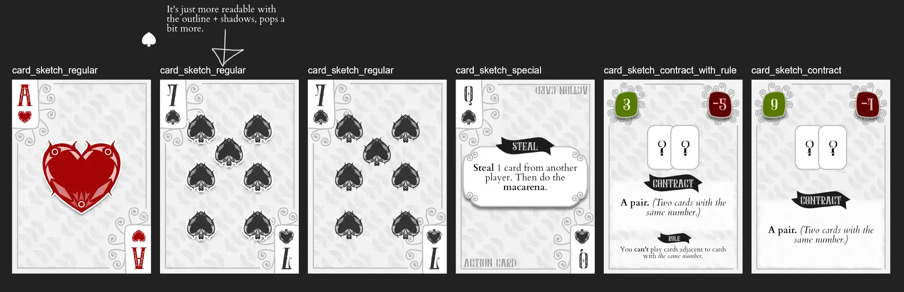

Welcome to the devlog for my game [Noble Flood](https://pandaqi.com/chiptales/bet/noble-flood/). In this article, I keep track of the entire process, discuss any problems I found and how I solved them, and why I did certain things. Hopefully it's interesting or instructive to read!

## What's the idea?

This game was born from two ideas clashing in my head at the same time.

Firstly, my disappointment with poker (and similar games). Many people ignore the bluffing aspect (or just can’t do it), or they insist on house-ruling away what makes poker work in the first place. 

This mostly turns my poker games into "get lucky with your cards". And I am _never_ lucky in games, always getting the absolute worst poker hands ;)

Secondly, I was making my general list of game mechanics and game genres (for [categorization of the Pandaqi website](https://pandaqi.com/tools/categorizer/)). In doing so, I came across a few mechanics I had never even considered before. 

One of them was "contracts": players choose which simple "mission" or "contract" they will fulfill this round. For example, "play 3 Hearts" or "play 3 numbers in a row".

To me, contracts solved the issue of unlucky hands. You could simply pick the contract that best suited your hand each round. And because everyone does so, you also naturally get information about what _they_ might be holding in their hand. 

For example, if they pick the contract to play loads of Hearts, well, they probably have loads of Hearts right? At the same time, this _still_ retains some of the bluffing, because a player might go for a contract they'll never fulfill just to throw you off.

So that was the core idea:

* A card game (perhaps playable with a standard deck too)
* Where you choose contracts at the start of each round which you think you'll most likely fulfill. (And those contracts are just variations on the well-known poker hands.)
* If you succeed, score plus points. If not, score minus points.

{}
Many people struggle to remember what scores what in Poker. That's another reason they "house rule" things away, or just don't want to play it. This is ALSO solved by contracts, because they're a constant reminder spelling out what you'll score for something, right in front of you.
{}

## But wait!

You might think: _"But if you know your hand, and you can pick your contract yourself, how could you ever fail one?"_ 

Now we get to the crux of the idea.

* Players play these cards to a _shared row_ (or _shared map_).
* And just like in poker, a part of that map is facedown at first and only revealed over time.

When starting out, this was the part with the most uncertainty for me. Because I'd never really seen this combination of rules before and wasn't sure if it would work.

* On the Dealer's turn, they turn a new facedown card faceup.
* On your turn, you **must** play a card to the map.
  * Its suit must match an adjacent card.
  * OR its number must be at most 1 away from an adjacent card.
* If you can't, reveal and discard a hand card.

To me, this felt like really solid rules.

* Fulfilling a contract relies on what others have and play. (So you must really pay attention to what contracts they pick, to see what their cards might be.) => You _can_ bluff or guess, but there's actual information to go on now.
* At the same time, the order in which you play your own cards can determine your success (or the failure of others).
* And if you can't play anything---which is always boring and slows down the game---you must _reveal_ and lose a card, giving others more information and still progressing.
* You can still get slightly lucky or not---play risky or not---with the several facedown cards that are slowly revealed.

So let's make that!

## Creating the simulation

Even though it's a bit more work than usual, I still wanted to add interactive examples in the rulebook for this game. Which meant I could do a _simulation_ as well---play thousands of random turns/rounds---and check how well the game fares.

For example, I can check how often the Dealer wins (see if they have an advantage), check if certain contracts are just impossible to complete in practice, etcetera.

This is "random play", which means the computer will do stupid moves and not really help themselves fulfill the contract, so I do need to take the results with a grain of salt.

Instead, I added a bit of custom code that ignores the game state and brute-force calculates something else for me.

* Given the current layout of the board ...
* Try _all_ contracts and see how many succeed
* Which should give us a _general_ idea of how likely, on average, a contract is to be achievable.
* (And I can actually use this probability to get the perfect score value between 1 and 10.)

Before we run the simulation, let's ask ourselves: what are we actually looking for?

* **Contracts with a success probability of (almost) 1 or 0.** These are so easy they're a certainty, or so hard they're impossible.
* **The chance of having to discard a card or being able to play one.**
  * If you only have 1 or 2 possible moves on average, it's not actually a game, as you don't actually have a choice.
  * If you never have to discard a card, it's too easy to place stuff and you can't strategically help/hinder yourself or other players.

### The original rules

In the first version of the rules, 

* Players get 4 cards + the map starts with 4 facedown cards.
* You can play a card if its suit matches a neighbor OR its number is within distance 1 of all its neighbors.
* Contracts followed poker rules: a flush is 5 cards, so is a straight, etcera.

What do we see?

* Average **number of possible moves** is 10.
* The **average discarded cards per round** is 0.1 => So, a player only needs to discard a card _once every 10 rounds_.
* Some contracts (such as "pair") are 100% successful.
* Many other contracts (such as "royal flush", most flushes/straights actually) are 0% successful.

I want to bring down the number of possible moves, by bringing up how often you must discard.

Additionally, we need to fix those contracts. Fortunately, the initial fix was easy, because I'd made a mistake in my code :p

I'd written _all_ flushes, straights, etcetera to have to be **adjacent** to each other. So, a straight would mean 5 numbers in order exist ... and they're also _adjacent_ (like a path through the map). Obviously, this is very hard to get on the table.

I removed this requirement on the basic straights and such. I created _new contracts_ that kept the requirement, but lowered the number of cards needed (to only 3 or 4 numbers). This still made them hard, but far from impossible. 

{}
The same for Royal Flush: reducing its length to 3 cards gave you a ~15% chance of fulfilling it, which is nice.
{}

To **lower possible moves**, we change the rule to say "either match a suit OR match numbers with all neighbors".

Finally, I reduced the hand size (and starting cards) from 4 to 3. 

In a typical game, 4 cards means we have 4 (starting cards) + 4*4 = 20 cards on the table. Of course, with that many cards, the probability that some number appears twice ( = pair) is 100%, and that it appears thrice ( = trio) is pretty high too.

Reducing this number changed the probabilities such that barely any contracts are 100% or 0% anymore.

{}
Oh, a subtle change I forgot to mention has to do with the rows. At first, row meant EITHER row or column. (This value was filled in randomly when generating the card.) This made all those contracts too hard, so I switched rows to just mean you're allowed to check both ROWS (horizontal) and COLUMNS (vertical) on the board. Much better, simpler text too.
{}

### The second version

With our changes,

* Average **possible moves** is ~6
* **Cards discarded** (per round) is ~1. Still not very high, but at least we get 1 discard per round.

I'd like to be a little more strict still, so I tried also requiring matching _all suits_ around the card. (So, the full rule is now simply: "You may play a card if its suit OR number matches all its neighbors.")

I had expected this to be TOO strict, but it's actually fine.

* Average **possible moves** is ~4
* **Cards discarded** (per round) is ~2

Remember this is random play. If you actually do smart moves, you're more able to play cards and fulfill contracts.

### The Third Version

As usual with iteration, we are now looking at more and more specific parts of the game.

Below are the specific problematic contracts that I want to solve.

These contracts are **too easy** or even a certainty.
* **One Suit**: a card of the given suit appears.
  * _Solution?_ Add a number that it has to be too. ("A SPADES card with number 3, 6, or 9.")
* **Four Suit (Any):** four cards of the same suit appear. 
  * _Solution?_ Add an adjacency requirement. ("Four cards of the same suit appear, adjacent to each other.")
* **Pair (Any):** as stated, some numbers are bound to repeat.
* **Pair Adjacent (Any):**: and because you can place cards if the _number_ matches, the chance of repeated numbers being adjacent is equally near 100%.
* **Pair Double (Any)**: _two_ pairs are on the board. Same story.
* **Row Suit (Any)**: any suit appears three times in the same row or column.
* **Trio (Any)**: a trio of cards with the same number.

As you see, those "any" contracts are often too freeform (until we get to higher numbers and straights), even with an adjacency requirement.

I had to decide whether to remove them or change them. (There is no use to keeping the pair contracts, for example, as they are literally a _certainty_ with 3 players or more.)

I decided to keep them and change them. Namely, I _added suits_. Of course, because it's a pair, we can't say "of the same suit" (as each instance of a number has a different suit!) Instead, we need to give options or say which suit is NOT allowed.

* **Pair (Any)** would become **Pair Suit (Any)**: a number appears twice in the suits X and Y.
* **Trio (Any)** would become **Trio Suit (Any)**: a number appears thrice, but not in the suit Z.

You get the idea.

These contracts are **too hard**, nearly impossible (though they're all POSSIBLE):
* **Four Number:** all four cards of a _specific_ number appear.
* **Trio Double:** there are two _specific_ trios of cards.
* **Variety Row:** One row contains all suits in the game.
* **Variety Number:** All possible numbers in the game appear.

The first two are simply too rare. What's the chance of that _exact, specific number_ appearing at such high rates?

We can solve this by allowing more options---making it an "either or" rule.

* ORIGINAL: "There's a trio of 3s and a trio of 7s".
* NEW: "Two of these numbers appear three times: 3, 5, 7, or 10."

The other two are simply a result of our very strict placement rules. The name says it all: this reduced the variety in the game and the rows.

To solve this I considered a **tiny new rule**.

> The Leader calls out one suit at the start of a round. This is a "wildcard" for placement.

For example, if you want to place a SPADES card but the neighbors are SPADES and HEARTS, you can still do so if one of those types is a wildcard and thus represents whatever you want.

If this didn't work, I'd rewrite the variety contracts to be slightly easier.

_Did it work?_ Well, yeah, those contracts are now useful again. But now the game has become too easy once more! 

And thus I made one final change to this wildcard picking: it can be either a suit OR a number. Different contracts/hands will lead players to pick one or the other. Both can be useful depending on circumstances.

If we can just get players to NOT pick wildcard suits 100% of the time, the numbers balance themselves more and this change actually makes the probabilities of contracts look nicer overall ( = more spread out).

{}
All these tweaks did make the simulation slower, as contracts now have slightly more complicated things to check. Not necessarily for humans, but surely for a computer. That's why I "only" did 500 test games during _development_, which still means about 3500 rounds.
{}

### The final version

And that's how, after a lot of iteration (rule tweaking and looking at numbers, mostly), we get the final set of rules. One where all contracts have at least ~10% chance of succeeding and at most ~90%. 

* The supported player count is 2--6. (On a total deck of ~80 cards.)
* The number of available contracts is 2 * (the number of players).
* You start with 3 facedown cards; each player gets 3 hand cards.
* The Dealer calls out a wildcard SUIT or NUMBER at the very start of the round (so even before picking contracts). This is a wildcard for _placement_ only.
* (I have about 10 more contracts than originally, because of new ideas and revelations.)

With all that done, the stats are ...

* **Average valid moves?** 8.
* **Average num discards per round?** 1.
* **Average number of rounds per game?** 9. (The average number of turns within such a round, per player, is consistently 3 of course.)
* **Easiest Contract?** Variety Suit, which means all possible suits have been played, at 90% chance.
  * The contract One Number ( = "this number must appear") is surprisingly not the easiest, at 85% chance.
  * The contract Full House (any pair + any trio), interestingly enough, has third place.
* **Hardest Contract?** Trio Double (two trios need to appear from a set of 4 numeric options) at 10% chance.
  * All other contracts are nicely spread out in-between, with almost none of them having similar probabilities to each other.
* **Average number of points (per contract)**: 5.5. (It's almost exactly the middle of 1 and 10, which means contracts are indeed as balanced and spread out as I thought looking at the raw numbers.)
* **Average score?** 11. Average _winning_ score is 21. (This is also nice, because despite it being penalized for failing contracts---which happens frequently---the scoring clearly still gives players more positive than negative rewards on average.)

The number of unique contracts in the base game is 42. This might be a bit high, but it's not too bad.

It's also interesting to note that these stats come from 5000 games simulated (instead of 500). Even at 500, there was random fluctuation that made me think something was wrong with my code.

For example, it would sometimes happen that the contract "pair_any" would be LESS likely to succeed than "pair_adjacent_any". 

Which makes no sense! It's _harder_ for two matching numbers to be adjacent, than for them to exist in the first place (anywhere on the map). The number of the second contract, on average, should always be _at most_ as high as the first one. Because it's a tougher version of it.

All such fluctations, though, went away by just increasing the number of games simulated. Then you see the numbers fall in line as they (intuitively) should.

That means this was simply random chance. By accident, the second contract was chosen less often, but happened to succeed more than usual, which skewed the numbers. With 5000, 10000, even more games, it's so incredibly rare to have these exceptions that they basically never occur and you can trust the numbers more.

With these numbers---and a pretty powerful, configurable simulation that I've coded---I could confidently move ahead and create the game.

{}
It can happen, though rare, that the simulation reveals a game idea of mine just DOESN'T WORK. It's impossible without completely throwing out the core mechanic or some essential requirement. In that case, I obviously drop the project once tweaking yields no improvement.
{}

## Let's make that!

### Sketching some designs

I wanted to keep this very simple, mostly white/light gray backgrounds with little color. This would make it easier to play using another deck, because the design of this game doesn't get in the way and is very "neutral". (Also, it saves ink and I like simplicity in general.)

So, one evening, I sketched these general designs.

You'll see, at the final material, that I still ended up tweaking this a lot and making a few different choices. But the general idea was there---good enough for me to continue.

### Generating the Cards

Generating X cards (numbers 1 to 10, probably) in 4 suits is of course very easy: just two loops through all the options.

Generating the contracts happens in two steps. 

* The first is equally easy: we step through my entire list of possible contracts and create a card for each.
* The second one is _much harder_. Many of the contracts are "dynamic", which means I need to fill in random (but balanced) values on the spot. For example, a contract template might say: "A pair of Xs or Ys". Then I need to _replace_ X and Y by actual (unique) numbers when creating the final card.

Fortunately, I have quite some experience with the second method now, and I settled on the following process.

* When creating the card, loop through all "dynamic options" and pick random replacements for them.
* (As we do, remove the things we picked from the original options, so we get no duplicates.)
* Save the values we picked in a seperate list (`dynamicDetails`)
* **Don't** actually replace the string with the final one just yet.

Because now we have the perfect structure for both our _simulation_ and our _drawing_.

* When simulating the game, I can grab that list of `dynamicDetails` to check whether a contract is true. (For example, let's take "a pair of Xs and Ys" again. I would check if the number `details[0]` appears 2 times or more OR the number `details[1]` appears 2 times or more.)
* When drawing the card, I can use the details to **dynamically draw an icon** that illustrates exactly what the contract does.
* (When writing the contract text on the card, _that's_ when I finally replace the template string with the final values, optionally sorted or modified in whatever way I still need.)

As usual, though, generating the entire list of `Card` objects (with the right settings) is the "easier" part of creating the game.

The absolute hardest part comes now ...

### Dynamically drawing contract icons

Each contract has, at the top, a _visualization_ of what you're looking for. This looks better, this is often much easier/faster to understand, and I wanted to try it.

Because the contracts are almost 100% dynamic, though, I couldn't just _draw_ these icons beforehand and place them on the right card. They needed to be _drawn on the spot_, using the exact details given by this `Card` object.

As such, I had to invent a completely unique (but succinct/practical) syntax for defining _how_ each contract should draw itself.

* In my list of contracts, each contract can fill in a `drawDetails` property.
* This property expects a list of `DrawGroup` objects. 
* Each `DrawGroup` represents any number of cards that belong together. 
  * For example, a pair would contain 2 identical cards in its group.
  * In code, this would be `new DrawGroup().addCard({ number: -1 }, 2)` (see below)
* And a "card" is just a combination of **suit** and **number** (and a few less important properties for one or two rare contracts).

After inputting this for each contract, I wrote a function to _read_ this and turn it into the right image.

* It calculates the right size + spacing to display all the different `DrawGroup`s on the card. (In a way that's centered and looks good.)
  * If we need to display more cards/groups, we obviously need to make them smaller to fit the space.
* Then it draws each individual group, by drawing overlapping cards showing the right properties.
  * They're just rectangles, though a bit of shadow does wonders in making it look better.

How are cards defined? How does it know what to draw?

* The `number` property represents the _index_ of the value it needs to show from `dynamicDetails`.
  * For example, "a pair of Xs and Ys" means we first draw two cards with number `0` (the X) and then two cards with number `1` (the Y). 
  * If **no number** was set, it doesn't draw one => numbers are irrelevant for this contract.
  * If the **number is `-1`**, it draws an icon that means "any number, but they must be the same".
* Exactly the same thing for **suits**.
* For special properties---such as "they must be adjacent"---it places the correct icon between/around the set of cards.

This is how I was able to dynamically generate an image that shows _exactly_ what the contract wants to match, using the _specific_ numbers and suits also in the text.

It's also very _fast_. I was afraid that dynamically drawing _hundreds of cards_ inside _fifty unique images_ for ~50 contracts would be too slow to be practical. But because it's all very consistent, and the cards are just rectangles with sometimes an icon/text, it's actually not bad at all.

This was usable for ~95% of the cards. The others (more "weird" cards) just get a manually drawn image.

## Playtesting & Polishing

@TODO: Write down playtest results + conclusion