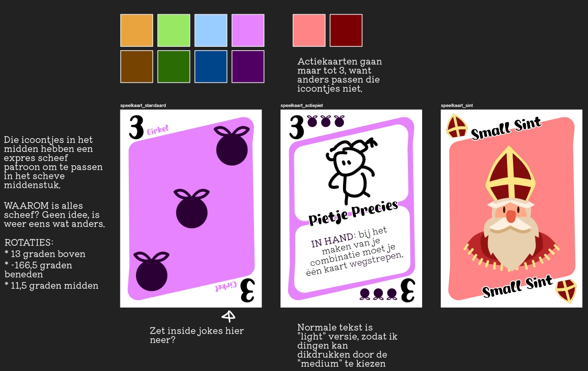

Welkom bij het "dagboek" over de ontwikkeling van mijn spel [Pietenpoker](https://pandaqi.com/chiptales/bet/pietenpoker/). Dit artikel zal behoorlijk kort zijn, want het is een erg simpel spel en eigenlijk origineel niet bedoeld om uit te geven. Desondanks hoop ik dat het interessant is en goed weergeeft hoe zoiets tot stand komt!

## Wat is het idee?

Wij doen thuis vrijwel elk jaar surprises rondom Sinterklaas. Dit jaar trok ik als lootje iemand die al maandenlang wil pokeren en daar ineens helemaal weg van was. 

Dus ik dacht: wat nou als ik een grappige, onzinnige variant op Poker maak die ze dan eventjes kan spelen als surprise?

Nu heb ik dit natuurlijk eerder gedaan. Ik maak vrijwel altijd een creatief project als surprise, want ja, dat is nou eenmaal wat ik de hele dag door doe.

En daarvan heb ik natuurlijk het een en ander geleerd.

* Het mag niet te lang duren => dan wordt de rest onrustig of verveeld
* Het moet niet te ingewikkeld zijn => niks is stommer dan urenlang aan je surprise werken en dat die ander met zuchten en kreunen uiteindelijk het hele ding maar overslaat.
* Het moet thematisch passen, zowel bij de avond als de persoon. => wederom, niets slaat een gezellige Sinterklaasavond dood als een surprise die veel te serieus is of juist zo generiek dat het in de afgelopen vijf minuten in elkaar is geflanst

Dus het idee werd al snel: **kan ik een zwaar versimpelde versie van Poker bedenken, waarbij ik gekke speciale krachten kan toevoegen?** (Die eventueel alleen door die persoon mogen worden gebruikt.)

## Hoe versimpel je poker?

### Stap 1: Minder materiaal

Ik ben sowieso heel erg van minimalisme, zeker als mensen zelf spellen moeten printen en knippen.

Dus eerste missie: verminder de hoeveelheid materiaal. 

Een gemiddelde poker set heeft een deck kaarten, fiches voor de big/small blind, en een _hele hoop fiches_ om mee te bieden en je "geld" weer te geven.

Dat kan natuurlijk niet! Mijn spel heeft maar één soort materiaal: een stapel kaarten. Dat betekent dat deze kaarten dus ook, op een of andere manier, gebruikt kunnen worden om je inzet/winst aan te geven.

Toen mijn hoofd hier tijdens het avondeten over nadacht, was de oplossing plots overduidelijk.

* Aan het begin van elke ronde krijgen spelers _veel kaarten_ in hun hand. (In plaats van "slechts twee" zoals bij poker.)
* Waarom? Omdat je deze kaarten _ook gebruikt om in te zetten_.
* Als je mee wilt gaan (of overbieden), moet je dit dus doen met je handkaarten.

Waarom werkt dit zo goed? Omdat dit betekent dat _hoe meer je inzet, hoe kleiner de kans dat je wint_. Hoe hoger jij gaat bieden, hoe meer kaarten er uit jouw hand gaan. Dus hoe minder kans dat jij een hoge combinatie scoort als de ronde voorbij is.

Na jaren van spellen maken heb ik geleerd dat zoiets eigenlijk de kern van elk spel is. Je wilt één simpele regel die zichzelf balanceert. Eén regel die automatisch een touwtje trekken betekent tussen twee dingen die een speler allebei wil.

Ongeacht welke kaarten je krijgt, of je nu achter staat of niet, je zal mee kunnen bieden en bluffen. Maar elke beurt is extra spannend omdat je moet afwegen of hoger bieden niet je kansen op winst juist verprutst.

### Stap 2: Simpelere combinaties

Het tweede probleem met poker is dat je al die combinaties hebt, en in welke volgorde ze scoren, en niemand onthoudt dat. 

{}
Nou ja, beter gezegd: mensen _willen_ het niet hoeven onthouden. Een spel moet geen huiswerk zijn. Het is echt niet zo heel lastig, maar zelfs dan vind ik het een goed idee om dingen te versimpelen.
{}

Om deze versie korter en simpeler te maken, bracht ik het terug naar slechts **twee combinaties**:

* Ofwel kaarten van dezelfde soort/kleur
* Ofwel kaarten met hetzelfde getal

Deze dingen zijn veruit het makkelijkst uit te leggen en meteen te zien. Ook maakt dit de volgorde overduidelijk: meer kaarten is beter, hoger getal is beter.

Natuurlijk, het spelmakershart in mij protesteert dat dit veel te weinig variatie is en dat ik ook straatjes enzo moet toestaan. Maar mijn _ervaring_ vertelt mij dat zelfs dit misschien al te veel is en twijfelt of het niet één combinatie moet zijn :p

Voor nu blijft het bij twee. Als ik maar één combinatie neem dan wordt het spel té rechtlijnig en is geluk met je kaarten té belangrijk.

### Stap 3: Kortere rondes

Misschien ligt het aan mij, maar elke keer als ik poker speelde gebeurde het volgende.

* De eerste drie kaarten worden gelegd. Mensen gaan wild met bieden, 50% van de tijd. De andere helft van de tijd doet niemand iets.
* De vierde kaart komt, niemand doet meer iets.
* De vijfde kaart komt, niemand doet meer iets.

Als ik dit probeer op te schudden, door veel meer te bluffen en gewaagd te bieden, dan legt iedereen gewoon hun kaarten weg. Beetje saai, ja. Een spel is natuurlijk leuker als men meer _speelt_, ja. Maar zelfs dan ... zijn pokerrondes gewoon niet gestructureerd op een manier die samengaat met mijn surprisespel.

Versimpelen en inkorten dus!

Omdat speler veel kaarten in de hand hebben, kunnen de kaarten op tafel zwaar ingekort: **we leggen slechts 3 kaarten open op tafel, één voor één**.

Zo. Nu heb ik letterlijk alle regels van Pietenpoker uitgelegd. Het is een zwaar versimpelde versie die toch hetzelfde idee heeft en daadwerkelijk wat strategie en interessante keuzes heeft.

## Maar niks is de eerste keer perfect

Ik schrijf deze regels op, ga door met mijn leven, en kom een week later (op mijn vrije zondag) terug.

Wat zie ik? Ik vind het idee nog steeds 99% solide, maar ...

* Eigenlijk wil ik het idee van een **surprise pakken** integreren in het spel. Ofwel, je kan dit spel ook _over de hele avond spelen_ in plaats van zo'n typisch dobbelspel om surprises te kiezen.
* Is het interessanter om te zeggen dat echt **alle kaarten** hetzelfde getal/soort moeten zijn? Dus als jij een hoop 4'en hebt, maar één 5 (de vreemde eend in de bijt), dan telt het nog niet? Dit zou het nog spannender maken, maar dan moet ik iets toevoegen om je kaarten beter te kunnen veranderen.
* Nu gebruiken we jouw gewonnen kaarten (uit volgende rondes) **helemaal niet**. 
  * Enerzijds was dit precies mijn bedoeling: wie rijk is heeft geen enkele voorsprong op iemand die nog niet één ronde won. 
  * Anderzijds moedigt dit "dom spelen" aan: aangezien je toch elke ronde nieuwe kaarten krijgt die je kan inzetten, kan dit aanzetten tot willekeurig inzetten of juist laf spelen, want je hebt niks te verliezen.

Ik schrijf een paar verschillende oplossingen op, totdat ik de juiste te pakken heb.

### Surprise-icoontje

Als je een langere avond op de planning hebt staan, kan je _elk spel_ natuurlijk gebruiken voor surprises kiezen. Je speelt gewoon een potje Pietenpoker en zegt: "Wie wint kiest de volgende surprise."

Dit spel heeft het voordeel dat het ook nog eens in korte rondes gaat. Dus je kan zelfs zeggen: "Wie de _ronde_ wint kiest de volgende surprise."

Dus eigenlijk werkt dit spel al hartstikke goed. Maar ik wilde het ietsje meer expliciet maken. Ik merk dat velen iets te gehecht zijn aan het idee dat "de spelregels zijn de spelregels en we mogen er niet van afwijken". Die durven niet de gedachte te krijgen om zelf zo'n simpele regel toe te voegen over surprises pakken.

Om daarbij te helpen, bouw ik graag deze suggestie in het spel zelf. 

In dit geval: een aantal kaarten hebben een **surprise icoontje**. Als je zo'n kaart wint in een ronde---dus hij is ingezet door iemand en jij wint alle inzet---pak je de volgende surprise. (Of het volgende pakje. Of eten. Of wat dan ook.)

### Pietje Precies

Dit is een _uitbreiding/variant_. De enige regel die verandert is dus dat **alle** kaarten in je combinatie gebruikt moeten worden, anders telt hij niet.

Enerzijds kan je dit al controleren, want jouw "verkeerde kaarten" kan je kwijtraken door ermee te _bieden_. Maar dat is alleen je eigen hand. Wat als de 3 kaarten open op tafel allemaal andere kleuren en getallen zijn? Dan zou niemand iets kunnen scoren!

Dus we voegen een (veelvoorkomende) actiekaart toe: **Pietje Precies**. Als je deze speelt, mag je één kaart "wegstrepen" (bij het checken van je combinatie).

In mijn ogen is deze variant nu de "betere versie" van het spel. Maar het is ook ietsje ingewikkelder---vanwege die extra kaart en regel---dus ik houd het basisspel zoals het is en maak dit optioneel.

Onthoudt: dit was origineel een spel om even kort te spelen op een surprise avond, dus _simpeler, simpeler, simpeler_.

### De Biedregel

De regel die ik hiervoor bedacht is ijzersterk ... maar ik twijfelde constant of deze in het basisspel moest.

Dit is de regel die toestaat dat je jouw winst (uit vorige rondes) alsnog kunt gebruiken.

> Elke keer als je een kaart inzet, _mag_ je ook een (tweede) kaart uit je vorige winst toevoegen. Deze kaart moet hetzelfde getal of dezelfde kleur hebben.

Oftewel, stel jij zet een Rode 5 in uit je hand. De vorige ronde had je een Rode 3 gewonnen: die mag je nu erbij inzetten.

Dit geeft mensen met een grote winst een _kleine beloning daarvoor_: je hebt goed gespeeld, dus je hebt iets meer biedkracht.

Maar je kan niet vrijuit alles inzetten. Je moet _iets_ matchen bij een kaart uit je hand, wat ervoor zorgt dat het niet uit de hand loopt.

En bovendien loop je daarmee extra risico. Want als je nu verliest, kan je dus _achteruit_ gaan in punten.

Dit voelde als de simpelste regel die perfect deze balans opmaakt.

Maar moet die in het basisspel? Moet ik dit willen uitleggen aan een groep van 8 mensen die even kort dit spelletje gaan spelen? Nee, ik dacht het niet.

Dit is ook een variant/uitbreiding, maar ik raad hem wel aan op de spelpagina.

{}
Een andere kleine opmerking is natuurlijk dat je nooit je laatste kaart kan inzetten. Want dan kan je letterlijk geen combinatie maken aan het einde. Maar je biedt wel heel hoog, dus anderen moeten wel volgen als ze mee willen blijven doen. Dat is een nare uitzondering in dit systeem die ik gewoon moet verbieden.

Een andere manier om dit enigszins in te perken is zoiets als "de Sint mag nooit OPHOGEN, alleen meegaan". Maar dat is niet zó een goede oplossing dat ik het in het basisspel wil stoppen.
{}

### Actiekaarten

In al dit geweld was ik enigszins vergeten dat het een surprise moest zijn voor één specifiek persoon, niet gewoon een goed spel voor gezelschappen.

Dus ik voegde mijn idee voor "actiekaarten" toe. Vrijwel alle actiekaarten in dit spel zijn een knipoog of referentie naar iets dat deze persoon bezighoudt. Maar ik ben niet zo iemand die dan heel kneuterig foto's van die persoon erop gaat photoshoppen, of té gedetailleerd of genant wordt. Ik houd het algemeen en blijf consistent binnen de surprise/het thema. Dat had ik ook gedaan als ik niet van plan was dit spel ook op mijn website te zetten.

Oftewel, het zijn subtiele knipogen en je kan het spel prima spelen zonder te begrijpen waar ze vandaan komen.

Hoe werken de actiekaarten? Nou, ja, ook op de absoluut simpelste manier die ik ken.

* De actie staat erop geschreven.
* Standaard gaat de actie in als je de kaart **inzet** (bij een bod)
* Als het anders is, staat het op de kaart. ("Als onderdeel van een combinatie, dan ...")

Pietje Precies is, in zekere zin, gewoon één van de actiekaarten. Alle andere die ik bedacht zijn simpele hulpmiddeltjes om dingen te veranderen of plannetjes van anderen net wat in de soep te gooien. (Is ... is dat de uitdrukking? Ik heb het idee dat ik nu twee gezegdes door elkaar haal.)

Denk aan het verwisselen van de tafelkaarten. Denk aan het inzien van andermans kaarten of het verbieden van bepaalde combinaties.

Het voordeel van dit soort dingen is dat ik heel makkelijk de actie _op de kaart_ kan zetten. Dus je _hoeft dit niet van te voren uit te leggen_. Als iemand een actiekaart heeft, kan diegene hem gewoon in vijf seconden lezen en gebruiken.

### Finishing Touches

Wanneer ik de spelregels definitief (volledig, concreet, foutloos) opschrijf, en zelfs al begin aan _plaatjes_ voor de spelregels, vind ik altijd de laatste paar foutjes of verbeteringen.

**Versimpeling:** in eerste instantie nam ik de Poker-structuur van bieden over. Je blijft maar doorgaan totdat iedereen het eens is. (= Het bod van alle actieve spelers is gelijk.) Dit kan simpeler!

* Je gaat simpelweg één keer rond de tafel. (Begin bij Sint, met de klok mee.)
* Als je mee wilt blijven doen, moet je minstens even hoog inzetten als het huidige hoogste bod.

Dit is veel sneller en makkelijker uit te leggen. Je raakt niet steeds superveel tijd kwijt met wachten totdat iedereen heeft "geklopt". Je hoeft in de spelregels niet een moeilijke constructie met fases of "herhaal dit tot X" te doen.

Tegelijkertijd raken we weinig kwijt. Het enige wat dus niet kan is een soort heen-en-weer met bieden. Hoewel dit heel soms gebeurt en wel grappig kan zijn, vind ik het niet nodig dit te behouden. (Desnoods kan een actiekaart van de uitbreiding zoiets terugbrengen)

In plaats daarvan komt een ander soort tactiek. Je krijgt maar één kans om te bieden per ronde. Dus ... ga je het flink ophogen om de spelers _na jou_ te ontmoedigen of niet?

En _nog_ een voordeel is dat het "overbieden" voorkomt. Het voorkomt dat iedereen gewoon al hun kaarten (behalve eentje) biedt, misschien al in ronde één, en zo het spel een beetje voor zichzelf verpest. Omdat je biedt met de kaarten die je hebt, kan het zijn dat het "net verkeerd uitkomt", waardoor je maar blijft overbieden, en die cyclus willen we gewoon echt niet hebben.

**Materiaalvermindering:** omdat je elke ronde begint met veel kaarten in de hand, heeft het spel een massale hoeveelheid kaarten nodig als ik echt grote groepen wil ondersteunen. Dit wil ik graag ... maar de meeste groepen zullen kleiner zijn en dus niet zoveel nodig hebben. Ik besloot dus om het basismateriaal voor maximaal 5 spelers te houden. Als je met meer speelt, print je dit simpelweg _twee keer_. (En hebt iets minder kaarten in de hand, want anders wordt de tafel sowieso iets te vol.)

**Wat als gelijkspel?** Het kan natuurlijk zijn dat je een puur gelijkspel hebt. Twee mensen hebben _exact_ dezelfde combinatie. Wat dan? Ik koos de simpelste regel: dan wint niemand. 

Waarom?

* Omdat het niet simpeler kan dan dat.
* Om spelers aan te moedigen riskanter in te zetten (of handkaarten te managen), om zoiets te voorkomen.
* Omdat deze spelopzet dit _kan doen_ zonder problemen! In het echte poker moet er altijd één winnaar zijn. Hier hoeft dat niet, dus waarom dan een moeilijkere regel hiervoor verzinnen?
* Dit zorgt dat kaarten sneller terugvloeien in de stapel. (Als niemand wint, gaan alle kaarten van die ronde gewoon terug om te worden hergebruikt.) Dit vermindert weer het benodigde materiaal.

Dit gebeurt altijd. Je denkt dat je absoluut zo simpel en minimalistisch bent als mogelijk, maar dan vind je even later alsnog nieuwe manieren. Dus ik doe eigenlijk expres alles in losse stappen bij projecten, om mezelf tijd te geven dit soort dingen in te zien.

{}
Daarmee bedoel ik: ik schrijf eerst een vage schets van de regels -> een dag of twee later maak ik die concreet en zet ik die over naar mijn website -> een dag of twee later maak ik plaatjes voor spelregels. Dit kan prima in één stap, op dezelfde dag. Maar met mijn opzet, ben ik elke keer weer even weg geweest, waardoor ik ineens nieuwe dingen zie als ik terugkom.
{}

## Ontwerpen

Nu waren de spelregels volledig af. Ik vond het eigenlijk een van mijn sterkste ideeën, al had ik natuurlijk geen idee of het in de praktijk ook werkte. Ik begon op tijd, maar had nog steeds niet genoeg tijd om het spel uitvoerig te testen (tegen mezelf) voordat het Sinterklaasavond was. Dus dan maak ik het maar helemaal af en vertrouw op mijn ervaring :p

Omdat het spel zo'n Sinterklaasthema heeft, en zeker ook gericht is op jonge kinderen en meer een gezellig party spel is, moest het thema eigenlijk wel heel kleurrijk zijn. Fel, duidelijk, geen ruis of te veel details, grote olijke letters.

### Lettertypes

Ik had toevallig onlangs een bundel Sinterklaasverhalen afgemaakt. Een aantal lettertypes die ik daarvoor had uitgezocht, maar het uiteindelijk niet waren geworden, besloot ik maar hiervoor te gebruiken!

Ik was vooral op zoek naar lekker dikke en overduidelijke _cijfers_ (voor leesbaarheid kaarten), en verder een beetje speels. Dit werd het lettertype **Howdy Lemon**.

Aangezien er nauwelijks lange tekst voorkomt in dit project (als in, paragrafen aan tekst in plaats van één kort woord of getal), heb ik het lettertype daarvoor een beetje losjes gekozen. Gewoon iets simpels en leesbaars, maar wel nog een _beetje_ zacht en kinderlijk. Dit werd het lettertype **Kiwi Maru**.

{}
Na al die jaren heb ik sowieso een folder genaamd "FONTS TO USE". Daarin gooi ik alle lettertypes die ik sowieso voor IETS wil gebruiken, maar nu nog nergens kwijt kan. Voor de meeste projecten vind ik daar binnen een paar minuten wel iets bruikbaars. Eens in de zoveel tijd ben ik ook een halve dag kwijt met actief lettertypes uit deze folder toewijzen aan ideeën, om te voorkomen dat deze té groot wordt en een gigantische chaos.
{}

### Kaarten

Aangezien het hele spel bestaat uit dezelfde _kaarten_, hoefde ik eigenlijk maar één basisontwerp te maken.

Ook zijn deze kaarten vergelijkbaar met speelkaarten. Ik nam het typische uiterlijk over van "cijfer in de hoeken, maar ook uitgedrukt in icoontjes in het midden". Wél koos ik voor deze veranderingen.

* De nummers lopen maar van 1 t/m 6. (Bij grotere verschillen speelt geluk met je kaarten een veel te grote rol. Natuurlijk kan je niet winnen van iemand die een paar 9's in diens hand krijgt als je alleen maar 1'en hebt.) 
* Ook zijn deze niet perse gelijk verdeeld en zijn kaarten dus niet "uniek". (Er kunnen best meerdere kaarten met precies hetzelfde getal en soort zijn.) Lage kaarten komen veel vaker voor. Het is een soort "omgekeerde" relatie: de 1 komt 50% van de tijd voor, de 2 25%, de 3 15%, tot we iets sjoemelen om richting de 6 precies op 100% te komen :p
* De vier "soorten" kaarten zijn echt vier verschillende kleuren en weergegeven door compleet andere pakjes. (In tegenstelling tot 2 rood, 2 zwart.)
* De speciale actiekaarten halen de icoontjes in het midden weg (ze staan alleen langs de rand). Waarom? Zodat er een unieke illustratie kan zijn die de actie weergeeft, plus natuurlijk de tekst die hem uitlegt.

### Hoe ziet dat eruit?

Hieronder mijn schetsen voor hoe dit er ongeveer uit moet zien. 

Zodra ik dit heb gedaan, zet ik dit even later om in _code_, zodat mijn website ter plekke alles op de juiste plek zet en een PDF maakt met alle kaarten. Er verandert altijd nog wel het een en ander hier, maar meestal geen grote dingen.

Misschien interessant om te melden: bij spellen waarvan ik verwacht dat vooral (veel, nieuwe) families het zullen printen---niet per se "bordspelliefhebbers"---gebruik ik altijd extra veel witruimte en simpele ontwerpen. Dat scheelt inkt én ik voorkom dat ik ga leunen op icoontjes of gewoontes die mensen alleen hebben als ze wat ervaring met bordspellen hebben.

{}
Natuurlijk is er altijd de "inkfriendly" versie die je kan downloaden van mijn website, die werkelijk alles weghaalt dat niet cruciaal is en de rest grijstinten maakt. Maar dat is voor velen te "lelijk" of "droog", en zolang spellen maar een paar A4-tjes zijn maakt het echt niet zoveel uit.
{}

## De Simulatie

Ik maak vaak een "interactief voorbeeld" voor mijn spelregels. Dan druk je op de knop, hij bedenkt ter plekke een willekeurige ronde en laat zien hoe die dan verloopt (spelers doen X, dan Y, en dan wint Z). Het mooie daarvan is dat ik met één simpele knop hiermee ook het spel kan _simuleren_. Ik vraag de computer 100,000 potjes te spelen en mij wat gemiddeldes terug te geven.

Dit levert vrijwel altijd een paar cruciale inzichten en verbeteringen op.

* **De Getal/Kleur Balans:** in eerste instantie was het _twee keer zo waarschijnlijk_ dat de winnende combinatie kleuren gebruikte. Want er zijn maar 4 kleuren, en 6 getallen. En bij gelijkspel wint het hoogste getal, dus je hoeft maar net een kleur te hebben met een 6 en je zit al goed.
  * **Oplossing?** Die laatste regel gaat weg. Bij gelijkspel winnen getallen altijd van kleuren. Dat bracht hun winkans (gemiddeld genomen) ongeveer 50/50.
* **Wat als 1 iemand overblijft?**: in de originele regels ging je dan alsnog door met onthullen. Maar dat is zinloze, verspilde tijd. Bovendien kan iemand dan lekker alles inzetten, want ze winnen het toch allemaal zelf terug. Dat was een "exploit" die de gemiddeldes van de simulatie behoorlijk verpestte.
  * **Oplossing?** Simpel: als nog maar één iemand speelt, eindigt de ronde meteen.
* **Skin in the game:** Ik noemde meerdere keren het probleem dat mensen nu steeds _nieuwe kaarten krijgen_, en daardoor eigenlijk vrij nonchalant alles kunnen inzetten want ze verliezen niks. Dit kwam ook in de simulatie terug. Steeds opnieuw ging een ronde naar het idiote eindpunt waarbij spelers alles hadden ingezet (behalve 1 kaart, want die laatste mocht je dus niet inzetten volgens mijn regels). 
  * **Oplossing?** Ik programmeerde een handjevol andere regels totdat ik de oplossing vond bij een stukje dat ik eigenlijk steeds had genegeerd.
  * Namelijk, "Aan het begin van de ronde deelt de Sint iedereen 6 kaarten."
  * Ik testte eerste de regel dat de Sint die kaarten _uit zijn eigen winst_ moest pakken. Dus dat de Sint in ieder geval een hele goede reden had om slim te spelen, want diens handkaarten gingen uit diens eigen score.
  * Maar ... toen besefte ik dat we dit natuurlijk voor _alle_ spelers kunnen doen: "Elke ronde trek je 3 kaarten uit je eigen winst, en krijgt er 3 van de stapel."

Toen ik dit programmeerde loste het _zoveel problemen op_. Ik hoef geen regeltje meer te hebben zoals "je laatste kaart mag je niet inzetten"---het mag best nu, maar niemand zal het doen want het kost je alles. Ik hoef niet veel materiaal te hebben. De Sint hoeft niet verplicht het eerste bod uit te brengen.

De regels bleven eigenlijk even moeilijk. (Een paar regels gingen weg; deze ene iets lastigere regel kwam terug.) Maar nu heeft iedereen elke ronde iets te verliezen als ze niet zo goed spelen.

Het probleem van "wat doen we met all-in" is ook verdwenen. Want als je all-in gaat, bereik je niets anders dan je eigen ondergang. Je verliest sowieso die paar kaarten die je uit eigen score hebt ingezet.

{}
Ook is het fijn dat alle getallen nu lekker uitkomen: 3 onthullingen, 3 kaarten van jezelf, 3 kaarten van stapel. Dit lijkt misschien onzinnig, maar zoiets helpt enorm met het _onthouden_ van de regels. _Juist_ voor mensen die een mindere rekenknobbel hebben.
{}

Na het finetunen van de hoeveelheid kaarten, kwam de simulatie uit op fijne gemiddeldes. Natuurlijk zal dit anders zijn met een specifiek potje, en met spelers die _intelligente zetten_ doen (hoop je dan) in plaats van computers die willekeurig aanpappen.

Maar dit waren de eindresultaten.

* **Aantal Kaarten:** 50. (Ik wilde het expres in de buurt van een standaard deck kaarten houden. Maar iets eronder, want het moet niet uit de hand lopen als je het dubbel print voor grote groepen / de uitbreidingen toevoegt.)
* **Gemiddelde aantal rondes (per potje):** 6.7. (Een mooie lengte voor een volledig spel, denk ik.)
* **Gemiddelde grootte van winnende combo**: 3 kaarten. (Als dit te laag was, dan zou het te moeilijk zijn om iets goeds te krijgen, wat saai en statisch is.)
* **Verdeling winst via kleur / via getal**: een indrukwekkende 49%/51%, veel dichterbij 50/50 ga je niet komen :p
* **Gemiddelde winnende score:** 45. (Een mooie hoge score om trots op te zijn, maar niets dat compleet uit de hand is gelopen.)

Zoals gezegd, deze gemiddeldes geven aan dat het spel gebalanceerd is en nergens vastloopt of uit de hand loopt. De echte waardes, als echte mensen wat potjes spelen, kunnen behoorlijk anders uitvallen.

Maar dit zijn goede getallen, dus ik vind het goed. (Je hebt geen idee hoe wild de uitslagen van zo'n simulatie soms kunnen zijn _voordat_ ik het finetunen doe of overduidelijke gaten in de regels dicht. Dan krijg je ineens potjes die gemiddeld 100 beurten duren of iets.)

Ook realiseerde ik nu pas ... dat het hele probleem van "zonder kaarten komen te zitten" sowieso niet zo erg is, want je _combineert_ je handkaarten met die van de tafel (de "Pakjeskamer"). Dus als je alles inzet, scoor je alsnog de hoogste combinatie van de _tafel_---hoewel dat nog steeds meestal niet slim is, is het een logische en nuttige invulling van de regels.

## Het resultaat

Nou, zo maakte ik het spel dus af. En zo werd het uiteindelijk die avond gespeeld.

Hoe ging dat?

@TODO: Vertel specifieke verloop, resultaten, veranderingen/lessen

## Conclusie

Uiteindelijk is dit spel behoorlijk rap tot stand gekomen. Mede vanwege die deadline natuurlijk, maar ook omdat ik al behoorlijk wat spellen heb gemaakt en dan kies je (godzijdank) onbewust de juiste dingen overal.

Dat allereerste idee---je krijgt al je kaarten aan het begin, maar moet kiezen welke je inzet en welke je houdt voor combinaties aan het einde---gaf eigenlijk de doorslag. Dat bevestigde dat ik dit idee gewoon moest proberen en dat er wel iets inzat.

Het enige "nadeel" hiervan, zoals eerder gezegd, is dat je niks te "verliezen" hebt. Het is verleidelijk om gewoon te blijven inzetten, al ga je nooit winnen, want ja, de enige kaarten die je kwijtraakt zijn _nieuwe kaarten die je voor deze ronde hebt gekregen_.

Die extra biedregel verlicht dit, maar niet helemaal. Dit is simpelweg een gevalletje "als spelers niet slim willen spelen, dan gaan ze niet slim spelen". Een bordspel---in tegenstelling tot een computerspel---kan je niet _dwingen_ iets wel of niet te doen. Dus als iemand blind blijft inzetten, en daardoor uiteindelijk 50 punten achter staat op de rest, tja ... geen (simpele) regel kan daar tegenop.

Ik denk dat al die andere veranderingen ook hele simpele maar logische verbeteringen werden voor het geheel.

En zo kwam een versimpelde, kindvriendelijke, feestelijke versie van Poker tot stand.

Tot de volgende keer, hoewel ik niet weet of ik ooit weer in het Nederlands een bordspel maak en zo'n dagboek schrijf,

Pandaqi

