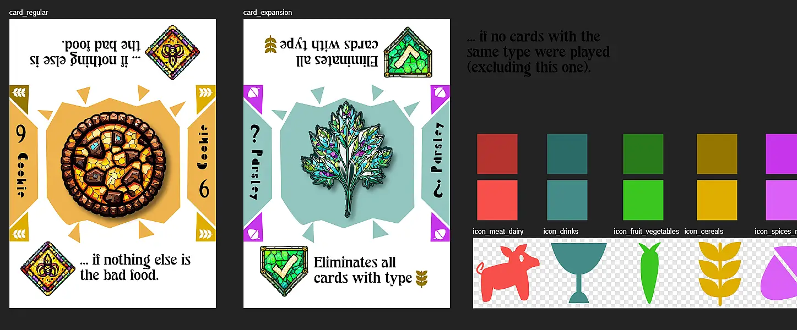
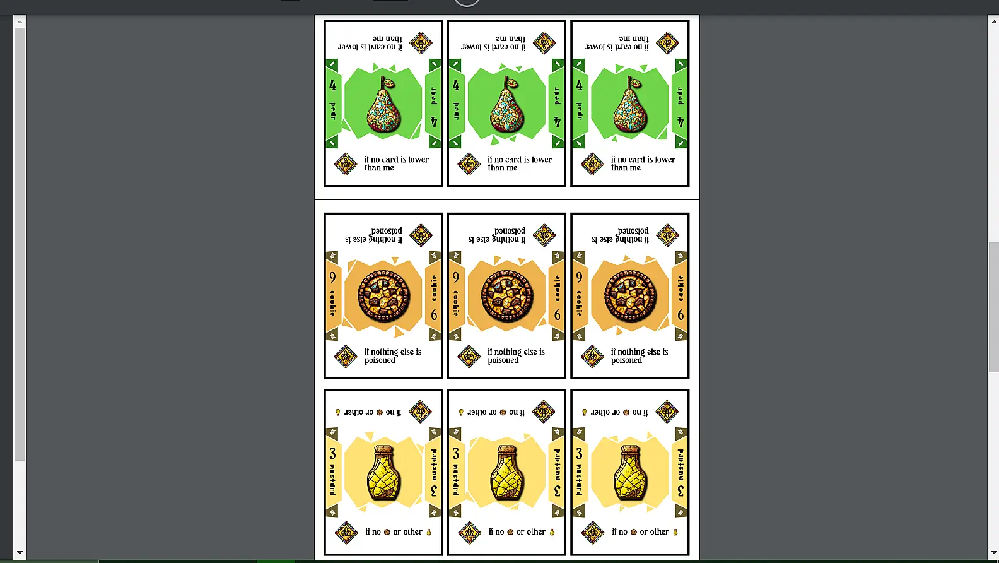

Welcome to the devlog for my game [Cookie Smasher](https://pandaqi.com/cookie-smasher). I'll (briefly) explain the design process for the game. Where did the idea come from? How did I develop it? What interesting problems did I have to solve?

## What's the idea?

I was working on my Wildebyte books, which are novels about somebody who gets stuck _inside_ video games. (So they must learn the rules, play as a character, and figure out a way to beat it.)

I wanted to order those books based on game complexity: the simplest games first, then leave very complex games for the _final_ installments of the series.

One of _the_ simplest games is of course "Cookie Clicker". All you do is click a cookie and a number goes up. That's it.

Obviously, my brain immediately considered ways to "expand" this idea. How could we turn "click on something" into something a _little_ more engaging?

Well, by providing some things you want to click, and some things you **don't** want to click. This introduces choice. This introduces an element of skill: figure out which things you need to click to get the most points (or not die).

Continuing this chain of thought, that idea reminded me of the board game Halli Galli. In it,

* On your turn, you reveal the top card from your deck. (Which shows 1--5 fruit icons.)
* If there are exactly _five_ icons of the same fruit showing (in total, across all open cards), you must be the first to smash the bell in the center.
* Otherwise, continue with the next player.

You see where this is going. The idea of Cookie Smasher happened when those two concepts were ... smashed together.

This was the original idea:

* Everybody plays a card from their hand.
* They are revealed simultaneously.
* Based on the rules of the cards played, you can calculate that exactly one of the cards is "the bad one"
* The first player to figure this out and smash the right card, wins the round!

This seemed like a fun (party?) game, with almost no extra rules or setup necessary.

I merely had to answer the following questions: 

* **What's the theme?**
* **How do those "rules" for finding that one card actually work?**

## Theme

At first, I considered a theme of _squashing bugs_. I'd seen this recently in a mobile game. (You are presented a random collection of bugs on the screen, and you must squash the nasty ones by tapping them with your finger. Of course, the game decides which ones are nasty and which aren't.)

This, however, didn't feel great. Is "killing insects for fun" really a theme I'm going with? Seems unnecessarily violent and cruel. On top of that, 

* It's already been done numerous times. 
* It works much better as a video game (as bugs crawl/fly around), not as a static card game.

Fortunately, not long after, a better theme came to me. One in which the cards weren't beings you squashed or killed, one that didn't paint the players as the bad guys.

{}
Another theme might be that you reveal _people_ and one of them is the _criminal_. Tapping that card would mean catching that criminal. This is fine, but runs the risk of feeling uncomfortable to some, especially if the people clearly have certain properties such as skin color. If I do that, I'd probably keep the people more "fantasy", and their rules something like "they are the criminal if 3+ other cards show _hats_".
{}

I picked a theme I thought was a better general fit.

> The cards show **food**. You are the chef cooks of the king/president/something important. It's your job to pick out the **poisoned food** before it reaches your king!

It makes sense. Based on simple rules, one food type would turn out to be "the bad food". Slam it with your hand, win the round, and prevent the king from being poisoned once more. Players are the _good_ guys!

## Rules

### Overall

I needed a simple but watertight system that _always_ leads to clear "bad food". And, if possible, exactly **one** such card.

At the same time, I wanted the game to have a lot of diversity through different food types. Each food should have its own unique _rule_. Depending on which types you include, the game plays differently.

As such, the "overall rules" needed to be really short, and the actual work would be done by the unique rules _per food type_.

I decided to give every food type its own (consistent) number. This allowed me to use the following system:

* Each food type has a rule that can be true or false. Only those that are _true_ can be the "bad food".
* If **multiple** cards are true, the cards with a higher **number** are the "bad food".
* If **none** of the cards are true, the card played by previous round's winner is the "bad food".

This always leads to at least one card to tap. 

Furthermore, with those _numbers_ I can balance the cards. Food that has a very rare rule---it's unlikely to occur---can get a much _higher_ number. So when it does occur, it will win any tiebreaker with other types.

### Required & Categories

While considering the actual rules, the diversity of cards turned into an annoyance. If players could assemble _any_ deck ... how could I ever make rules depend on other cards? I can't say "This card is the bad food if there is no Cookie played", because cookies might not have been included _at all_!

What's the solution to that?

* Add one or two **required** types for each game. (You must use that, but can build any deck around it. This allows me to base actions on that type, because I'm certain it's in the game.)
* Divide cards into broader **categories**. (Such as "meat" and "drinks". And then I tell players to assemble a deck with a nice mix of categories.)

I ... noticed I had done quite a lot of food-based projects lately :p I saw myself writing down another list of the same food, searching for styles and icons for the same food.

As such, I decided to really lean into the _medieval food_ theme. It's the king's food---it should be food for a banquet, food you won't find in many other games.

The categories became ...

* Meat
* Fish
* Dairy
* Spices
* Fruit
* Vegetables

The title of the game somewhat forced me to make **cookies** the required food ;)

And what does the required food do? It must have a rule that always makes sense. A very strong and simple rule that forms the backbone of the game. I decided: "The cookie is **bad food** if **nothing else is**."

Extremely simple. At the same time, it provides a natural fallback in case all other rules are false, and it's _different_ (in terms of mechanics) than any other rule.

Let's talk about that now.

### The Food Rules

Now I could invent rules for food cards. Because this is a _fast-paced game_ about _fast thinking_, the rules need to be really simple.

As such, I leaned on the usual suspect in card games: the context. Which specific cards were played, and in what order. This is the simple thing players directly control, but also what changes round to round.

* How many cards of each type were played?
* What did your neighbors play?
* What numbers are present?
* Is type X present?
* Were any duplicate cards played?
* Etcetera

I basically wrote down all variations of these. For example,

* Bad food if no cookies are played
* Bad food if all cards played are cookies. (Rare, so high number.)
* Bad food if both your neighbors played a cookie.
* Bad food if exactly one cookie is played

This generated a list of around 50 options. That's too much. I removed things too rare (or too likely, though those rules were ironically very rare). I removed rules too complicated to explain.

This leaves roughly 20 different food cards, which seems more than enough to make this game infinitely replayable.

## Designing the game

I had doubts about whether to add the rules text _on_ the cards or not. It makes the cards larger and more complicated (to scan with your eyes in an instant).

I decided to do it anyway. Why?

* If you don't have the rules perfectly memorized, the game is basically impossible and not fun for you. A reminder on the cards, which you can quickly read, is crucial to keep everyone in the game.
* You also don't want rules disputes halfway a round (or after any round), forcing people to read the rulebook again.
* This game is so light on rules, that adding them on the cards basically removes the entire need for the rulebook. Which is always a nice thing.

This means I simply want regular size cards, with a clear icon at the top, and then the rule (one sentence max!) below it.

## A few months later

This project was put on the backburner for a while as I finished many other projects. Also because my initial tests with the "medieval food theme and style" were ... challenging.

In the meantime, I made _even more food-related games_ and planned a few projects in which that medieval/fantasy look and style would fit much better.

Additionally, it was really hard to get simple and interesting icons/illustrations with this theme. I asked AI to help me out, it didn't understand anything I asked. I tried to do it myself, but I was stumped on how to illustrate the difference between "boar" and "lamb" meat, or the difference between spice A and spice B. It just felt awkward and forced.

_Additionally_, I considered doing a simplified version of it (maybe a kids version, maybe just an introductory version for those new to these kinds of games), which turned into a separate game that I thought was a _better_ idea to start with.

So, yeah, lots of issues, changes and surprises for me. But now I'm back and I'll tell you how the project is continuing.

## Bodyguard / Tribeguard

Now I'm making _two_ games around a similar core set of rules/ideas :p

For a while, these games had working titles "Cookie Smasher I" and "Cookie Smasher II". But this second game will probably be called "Bodyguard".

Why? As I mentioned, a different theme to try would be that of "eliminating the criminal" or more generally "prevent the assassination of your king".

As I thought about that, an idea popped up.

* We already have cards played in a circle.
* What if cards showed a person facing one way ...
* ... and they'd "attack" in that direction.
* Other cards would mess with that attack (blocking it, moving it to somewhere else, etcetera) in surprising ways.
* Once revealed, you'd have to quickly figure out if the king was being attacked or not. (By following the circle, applying the different "powers" of cards, and seeing where you end up.)

{}
An earlier version tried to be much simpler than this. I tried to make this idea work with just _shapes_ and _colors_, but it just wouldn't happen. You can't get any varied or challenging gameplay without text---and with only basic shapes---when the whole game relies on rapid thinking and applying surprising rules to surprising situations.
{}

This felt more immediate, simpler. There's a smaller chance of being completely overwhelmed by information or how much calculation you need to do. For example, the three most important cards in the whole game are just ...

* Attacker: attacks in the direction they face
* Bodyguard: disarms the first attacker they see
* Emperor: does nothing; needs to be protected

I might be wrong on this---this version might end up harder to play/learn---but it felt like my initial rules would work really well.

**I ended up creating an entirely different game out of this.** Go read that other [devlog](https://pandaqi.com/blog/boardgames/bodyguard) if you're interested in how this continued.

Suffice it to say that I worked on defining this other idea and working out the kinks, before I returned to Cookie Smasher. Because I'd "split" the idea into two distinct parts, it was easier to see the correct style and direction for both games.

## Back to Cookie Smasher

With this _other_ idea well-defined, it was easier for me to nail the theme and rules for the original game.

I realized that I could _combine_ all the different styles I'd tried, and it actually meant a nice middle ground (most of the time).

I tried mosaic, I tried stained glass, I tried medieval illustrations. On their own, they were too unrecognizable or too inconsistent. When combined, however, the specificity seems to help find good illustrations.

With "Bodyguard", I was able to apply these rules to a theme of people and creatures. That meant I allowed myself to, yes, go back to making this game about medieval food. The shattered glass/mosaic style is really distinct and makes the icons look way different than anything else. 

### Picking weird food

Additionally, I try to hone in on unique (royal, medieval) food you wouldn't typically find in other games.

* For example, whenever I make a list of food for a game, tomatoes are one of the first things I include. A common, recognizable fruit with a distinct color. But they didn't have that in medieval Europe! Tomatoes and potatoes only came in the age of colonialism as they found America.
* Similarly, they ate a lot of "cereals", but didn't have the wide range of bread/grain-related products we have today. As such, this game now has cards such as "barley" and "porridge" :p
* At the same time, this lack of diversity in diet was challenging. In some categories, it was quite hard to get enough different food types, and I had to pull some things from the (very) late middle ages into this game.
* Even then, the visual difference between "cup of tea", "cup of coffee", "beer", "ale" and so forth is minimal. So I had to purposely steer the AI towards very specific imagery that would be _different_---with varying degrees of success.

I decided to draw the category icons myself. Generating them was both a bit senseless (it's not faster than doing it myself) _and_ probably led to images with way too much detail and color to use as simple flat icons.

### Improving rules and ideas

As I worked on the game, I realized I wanted a second type of card that would also be fun: a card that is never poisoned itself, but _changes_ the cards around it. An "action card" if you will. To clearly signal this, they show a different icon (a green checkmark for "this food is always healthy") and no number. 

This might be an **expansion**, though. Right now, each food category (there are 5) has **ten** possible foods. That's obviously way too many cards to put in a starter deck and you really don't want that. So the game will be broken into pieces, and if people really enjoy it and want more, they simply download the next PDF and include those cards as well.

Another issue was that many cards are very _similar_, perhaps the _inverse_ of each other. For example,

* "POISONED ... if adjacent to a Cookie"
* "POISONED ... if NOT adjacent to a Cookie"

The programmer within me immediately wants to optimize that. Turn it into _one_ type that randomly decides to add "NOT" or to pick between the slight variations.

I decided not to do this, however. Players mostly identify cards (and remember what they did) through their major illustration(s), not by reading the action text every single time to see if anything changed. The game becomes way more annoying to play if the same "Bread" card can suddenly have two or even three variations of text on it.

No, that's just bad. Let's keep the text identical for every food type. If you see a bread icon, you know what it does, and that never changes (not even a tiny bit). 

This means that those "50 cards" aren't as impressive as you might think: they're really only ~20 different rules or ideas, but with all those variations.

To give one final example, 

* "POISONED ... if no cards have the same category"
* "POISONED ... if all cards have the same category"
* "POISONED ... if there are no cards with the same category as this one"

To help generate this list, I gave every category a general "goal" or "approach" for their actions.

* MEAT = About raw strength, calculation, hard (specific) rules
* DRINKS = About adjacency / neighbors / placement
* FRUIT & VEGS = About comparing different cards
* CEREALS = About "all or nothing" (they are true when everything has some property or nothing does)
* SPICES = Any weird, leftover, crazy rules

As long as you create a deck of cards that has all the different food types, you'll have a nice variety of possible powers and actions.

### The "final" design

See my first sketch for both card designs (and category icons+colors) below. 

{}
Finally, finally, after all those years, I've made a card game where the cards can just have a _white_ background with a splash of color, instead of an abundance of colors because it feels empty otherwise :p I call it growth as a designer.
{}

The background box will be randomly generated. My generator can just draw a rectangle, then mess it up (randomly), and smartly place triangles at the edges to get this "shattered glass / mosaic" look. The _color_ of this box is unique to the food type ( = the illustration on top of it), to make sure these match as well as possible.

The color of the _category_ icons is simply always the same. That's the whole point: to instantly see to which category a food belongs.

Assigning numbers to food is a bit of a guessing game right now, so I just gave it my best shot. (Cards that are more _rare_ should have a _higher_ number. So that, when they do happen, they win any tiebreakers against other cards. But, well, it's hard to determine exactly what the probability of each rule triggering is, before the game is even finished :p)

And now we've reached the point again where I just have to _make_ this and write the code for the generator + polish the rules. Usually, I'd skip ahead to playtesting, but this time I actually have some interesting notes and problems to mention from this process.

## Writing the generator

### Huge Assets, Huge Settings

Years ago, when I first started randomly generating board game stuff, I'd apparently set the resolution to ~200 DPI. I don't know why, but that is incorrect and leads to blurry results if you look closely!

So I set my PDF Builder to the right value for print (300 DPI) ... and then realized all my assets needed to be the right resolution as well.

{}
For those worried that I only realize this now: I'm writing this devlog _waaay_ before this game is released. So this issue has been fixed long ago. If you generate something on the website now, you are sure to get the highest possible resolution, and the premade PDFs have also been at that level for a while now.

Still ... not sure why on earth I set it to the wrong resolution back then and never checked.
{}

So I did that, no issue. But then ... my generator became much slower! It now had to work with multiple _huge_ images, which simply takes much longer (and more processing power). In fact, my old broken laptop sometimes just gave up (at random), and refused to create the material.

Now that assets were really high resolution, I needed to be smart about loading and using them.

At the same time, I had _another_ problem. This game has 50 card types. I obviously want to give players choice and customization (so they don't need to print/cut/use all of them), but adding 50 checkboxes on the web page isn't ideal :p

Then I realized I could solve both issues in one fell swoop.

**I can aggregate the types into _sets_.** Each set would have 10 cards that play well together. Each set would be slightly more difficult than the previous. This way, you can still pick the cards you like _and_ you can pick your difficulty.

Now, on the web page, I merely have to give _one setting_ which has those 5 options.

_What does this have to do with loading images?_ I can combine cards from the same set into _one_ spritesheet! This way, I only need to load that one specific image (with 10 types), instead of multiple huge images (with 50 types).

(I can still add a sixth option called "random" that randomly picks types and has to load everything. If somebody consciously chooses that, they're probably prepared to wait a few seconds longer.)

This process also made it easy to space out images that were a bit similar. (For example, a cup of tea looks a lot like a cup of coffee, especially in a fast and frantic game like this.) I shuffled things around a bit until such images were always in different _sets_.

### Why interactive examples are so useful

Then I made the interactive examples (as part of the rulebook) ... and it revealed an issue that I had completely missed. Probably because I invented the game and the "rules" or "logic" of it all made sense in my head.

There are several cards with a power related to other cards (or the whole round). Most notably, the Cookie: it is poisoned if nothing else is.

If one such card exists, it's fine. You simply evaluate it last. (First you check all other food, then you know if anything's poisoned, so then you check the Cookie.)

If multiple such cards exist, however, you simply _don't know_ the right order.

For example, at the moment the "Pepper" action says: "if there are multiple poisoned foods".

In other words, that card is true if at least 2 other cards are poisoned.

But what if we have a Pepper _and_ two Cookies? 

* If nothing is poisoned, then the two Cookies will become poisoned.
* But now we have two poisoned foods, so the Pepper should become poisoned.
* But now _something_ is Poisoned, so the Cookie should be undone!
* ... endless cycle ensues ...

This is only the starter pack. Later packs have those "safe cards" that simply do an action, such as "raises the number of its neighbors by X". When should you execute that!?

We need some simple rule for _order of operations_.

* At first, I thought about using the numbers. (Evaluate cards from low to high.) But ... different foods might share the same number, so that doesn't work.
* Then I thought about giving _unique numbers_ only to the problematic cards. But ... every food is inside the deck _multiple times_, so you might still have duplicate numbers! (Additionally, it'd mean some cards get a number like "17" which isn't great.)
* Then I considered clockwise order. You evaluate cards, starting from the previous round's winner, clockwise. This might _seem_ a good solution, but it's the opposite. It means cards that apply to "all cards" suddenly only apply to "all cards so far" (in the circle), which makes the game infinitely more complex to reason about.
  * For example, say you play Cookie / Pork / Cookie. 
  * The first Cookie is poisoned. (So far, we've seen no poisoned card, because well we've seen no card!)
  * The Pork is poisoned. (Pork is poisoned if exactly 1 of them is played.)
  * The second Cookie is thus _not_ poisoned, because now we've seen poisoned cards.
  * Which means the same card suddenly evaluates entirely differently based on how far along they are in the circle.
  * This is _so hard_ to quickly deduce.

{}
It might be a variant, though. Evaluating cards in clockwise order. Because if you can handle the mental gymnastics, it _is_ a nice rule.
{}

### The solution

I thought and thought ... until I found my answer.

We already need a rule (in the current rulebook) that says: "If multiple cards are poisoned and have the highest number, they are all valid"

We can _replace_ it by a different rule (keeping the rulebook equally short) that actually solves this issue.

> If multiple cards with the same number are played, only the _first one_ (closest to previous winner, clockwise) checks if it's poisoned.

Essentially, we're making cards unique. It can never happen that multiple cards are poisoned simultaneously, because there is only _one_ card with the _highest number_ (of them all) that will trigger.

At the same time, we're not limiting ourselves or making things more complicated. All those other cards _still matter_.

For example, the "Chocolate" card is poisoned if _all_ cards are Chocolate. So yes, it still matters what the other cards are. But when it comes to evaluating / smashing that poisoned food, you win by smashing the very _first_ Chocolate card played.

Initially, I only planned to code the _starter_ set of cards (for the playful examples). But the process of putting the cards into logical code is _so valuable_ for finding flaws and oversights, that I decided to just implement them all. (And who knows, maybe a digital version/app of the game will one day arrive.)

After _all that work_ (implementing 50 rules in code), I was able to click that button and get a random example. 

* "These cards were played" + images of cards with their number and power
* "These ones are true" + images of the true cards
* "Smash this card" + image of the one with the highest number (of the true ones)

This was actually a bit of a scary moment, because I was afraid the game was _waaaaay_ too hard, especially once you get past the starter cards. 

Fortunately, that wasn't the case. The game feels perfectly balanced in terms of difficulty. The starter cards are clearly the easiest and fastest, while later cards make things more challenging.

This is especially true thanks to our new rule. Because it tells you to only evaluate the _first_ one (if there are multiple of the same number), you can often quickly cut down the number of things to track (in your head). With the starter cards, after a few tries, I could always find the answer within five seconds.

Crucially, though, this wasn't constant. I got better over time. Some arrangements of cards are just harder than others and had me stumped for a bit. (Another benefit of these examples: the computer has no problem logically deducing the right card, so I can always check if I was correct while testing.)

My only issues come down to ...

* Some cards being _too_ rare.
* Some cards being a little _too_ convoluted.
* Some cards being extremely similar. (In fact, I accidentally coded two cards in the exact same way, because I'd misunderstood my own description. It turned out one of them checked for neighbors based on _type_ and the other checked for neighbors based on _food_.)
* Maybe I want the "safe food" to appear right from the start, as they are a really powerful/fun addition.

But that's just more testing and minor tweaking.

I'll give two specific examples and then we continue.

* The original Mint action was "if nothing is poisoned AND there are no Cookies" (number = 8, type = Spice)
* This is _a lot of text_. 
* It's also very rare and not that interesting. (It's basically a slight superset of what Cookie already does.)
* All that while having a really high number!
* So I switched it for a power I should've added from the start, but only invented now: something that is _always poisoned_. Can't get any simpler. Ideal for the starter set.
* And I gave it a really low number. (So that more "interesting" cards can supersede it when played in the same round.)

In that same starter set ...

* The Coffee action was "if a group of 3(+) cards of the same type is played in a row" (number = 6)
* This is rare, but not exceedingly so. (Notice it says _type_, not that the food on the cards needs to be identical.)
* Which means the number felt too low. I bumped it to 8.
* The wording is also needlessly long and confusing. ("Row? What's a row in a circle?")
* After many rewrites, I changed it to "if 3(+) cards of the same type are in sequence". I was hoping for something shorter, but this is the best balance between concise and precise that I can find.

### Simulations!

After manually tweaking and rewriting some things for about an hour ... I realized I had a much more powerful tool at my disposal.

Having implemented the game (in code) and all its powers, I can simply _simulate a round thousands of times_ and track the statistics. This way, I can see the probability of a card being the poisoned food, and check if it's reasonably balanced.

The first time I did this, for example, the Bread card ("true if all other food is poisoned") turned out to be waaaay too rare. (Only true 9 times out of 1000 rounds. Only 13 times out of 10000 rounds. Yeah, not great.)

Balancing cards to _roughly_ be equally probable within their set was a new challenge and actually revealed a lot to me about game design. (Both in general and in terms of this game.) Some powers became simpler, others slightly more complicated---but now I actually have _data_ and _proof_ to back up these changes :p

When I say "roughly", I mean that almost all cards are within a multiple of two of each other. So, at its worst, a card is ~2 times as likely to be the poisoned food than another. Yes, if you were to play 500 rounds, you'd notice this consistent discrepancy. But in practice, this gap is just acceptable variance/noise/randomness.

I had the most trouble balancing the latest sets. Their powers are so specific or wild, that they barely triggered. (3000 out of 10000 rounds had _no_ poisoned food.)

Once everything was somewhat balanced _within their own set_, I went even further and made it a two-step simulation.

* First it creates a _random set_ (it picks 10 cards at random out of all) => it does so 1000 times
* And then it simulates that specific set for a 1000 rounds

{}
I tried bigger numbers, but I didn't feel like waiting 30 seconds to get a result each time. There's some noticeable random fluctuation with "only" 1000 iterations, but it's not too different from doing it 10,000 times or even 100,000.
{}

Fortunately, this revealed to me that we were fine! Even with completely random decks, most types are within an acceptable range. (The best one is at most 2 times as likely to be poisoned as the worst one.) The only outliers are ones that I purposely made extremely easy or hard (for the first and last set).

### The Spice is too Spicy

This Spice category was the biggest troublemaker, both for the simulation and the game in general.

Why? This category contained the "wild" powers. Those that do nothing with number/type/food but some _other_ weird thing you can check.

For example, "true if played by the winner of the previous round".

While this is a nice idea in theory,

* It can't really be simulated. (Even if I rewrote the simulation to play entire _games_, not just _rounds_, this would just be random. Because it would play randomly and all players would win equally often. This isn't true in reality.)
* It's really hard to track.
* It needs a nasty exception for the first round, as then there's obviously no previous winner yet!

The later sets have the spiciest Spice cards, which is a big reason why they were hard to balance and often found _no_ poisoned food at all.

And so I made the tough decision to completely make Spice cards a little more ... normal. (Still clearly the wildest category, just not "near impossible to simulate or think about".)

I _still_ need some form of a "start player" to determine the order of the cards, so I added two rules about the "king" instead.

* For the first round, pick any king.
* The winner of a round becomes the new king.

It's more thematic, concise, and less confusing than "start player" or "last round's winner". (Because turns are simultaneously there is no start player in the traditional sense.)

### My final "set bible"

In the end, I realized (and followed) a simple set of requirements that would automatically lead to balanced sets.

* All cards have different numbers. If there must be a duplicate, make it the 5 or 6.
* Include one "fallback". This is ...
  * Either a card that's almost always true, with a really low number (usually 1)
  * Or a card that is a fallback in case (almost) nothing is true, with a really high number (usually 9)
* Stick to the general theme of each food category: it automatically leads to variety and powers _not_ getting in each other's way.

The middle cards tend to be the most probable. They have a power that's reasonably frequent, but also a number that's reasonably high (to win over others). That's why a duplicate for those is the best bet.

Additionally, if you don't add some fallback, more than 1/3 of the rounds will _not_ have a poisoned food (in the later sets). That's too much. It's more interesting if _most of the time_ one food wins, hence the fallbacks.

With all _that_ done, I decided I was done with all the card powers. 

Because simulating completely _random_ decks (a million times) had the following results:

* As a reminder, the expected win percentage (for any card in a set, if ideally distributed) is ~9%. 
  * There are 11 options (each card + "none wins"), so 100% / 11 = 9.1% 
* The _actual_ mean win percentage (from the simulation) is 9.9%.
* The standard deviation was only 3%.
  * This is calculated by taking the square root of the mSE (Mean Squared Error). 
* The _best_ elements consistently won 15% of the time. (This was also true for "None": there was _no_ poisoned food.)
* The _worst_ elements consistently won 6% of the time.
* Almost all elements were somewhere in between, pretty close to ideal average.

There were only two outliers: porridge (3%) and cream (3%). The first heavily depends on Safe Food being included and the second on Cookie being included, which my random simulation does not check at all, so those outliers are fine.

I think that's a very balanced game.

{}
Hey, few days later, I couldn't help myself and improved the simulation to properly resolve dependencies. As expected, porridge and cream are perfectly balanced now. The only outlier is the "pear" with clearly the lowest probability, but that's to be expected. 

Its power is "true if no cards lower than me". But that means ... that all cards are _higher_ and will thus override it if true. Its such a simple and useful power, especially for the starter set, that I don't want to change it.
{}

## Polishing & Testing

Below is a screenshot of the final PDFs that my website now generates. 

As a reminder, this is completely generated by my website. In fact, many cards have a _range_ of options and they pick one at random while drawing themselves. (For example, there's a card that's true if "TYPE" occurs the most. That value for TYPE can be _any_ type and is randomly filled in during generation.)

This means that, when you press the button, you truly get a slightly different game than anybody else. (It also means that I am able to create these high-resolution assets despite my laptop crashing and burning whenever it has to do anything graphically intense!)

I print those, cut the cards, and test the game with others.

How did that go?

@TODO

