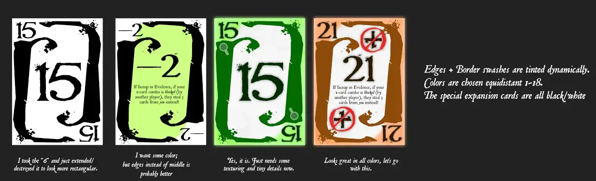

Welcome to the devlog for the game [Death by Digits](https://pandaqi.com/death-by-digits/). In this article, I'll talk about the process behind developing the game, problems I solved, why I made certain decisions, and hopefully more interesting or instructive bits.

## What's the idea?

I've wanted to make a simple "murder detective/deduction system" for a while now. Something with simple numbers and you have to guess which numbers are "missing". But on my first few attempts, I just couldn't find a good angle.

Until I stumbled upon the game Trio / Nana.

It has a simple system for being the first to find 3 sets, where a set is all 3 cards of the same number. How? By asking other players to show you their lowest or highest card, and having a shared (unknown) pool of cards in the center. By asking the right questions, and remembering what's where, you can "ask" the right people to show the right card, and thus produce 3 of the same number and score a set. (There are some more tiny rules, but that's the gist of it.)

This finally sparked a breakthrough in how to approach my "Murder Numbers" game. (That was the working title.)

That same evening, I wrote down the following idea.

* You have a deck of numbers (3 per number). This is distributed over the players.
* But 3 of them are taken apart: this is the Murder you need to solve.
* And some of them are placed facedown in the center of the table. (Unknown information that currently no player has.)

At the end of your turn, you may decide to _guess_ the Murder numbers. If you're correct, you win the game! If not, the game continues but without you.

So far, so standard.

The trick, of course, is to provide a simple gameplay loop where you can _figure out which numbers are missing_ (strategically, controllably) without _giving away this information to the rest_. That's where that original Trio spark comes in.

* On your turn, you can GUESS or PLAY A COMBO.
* When guessing, you may only guess someone's _highest_ or _lowest_ number. (If they have it, you get it. If not, you get a random different card.)
* When playing a combo, you play 1, 2 or 3 cards faceup to the shared Evidence in the center.
  * Played 1 card? If that card is the lowest or highest of _all players_, you get to steal 3 cards.
  * Played 2 cards? If those cards combined lead to some number X (probably the middle number of the deck), you may look at 2 Evidence cards.
  * Played 3 cards? If it's three of a kind (a "set"), you may look at 1 of the Murder Cards!

That was the simple core from which I created a paper prototype and tested the game.

Why did I _think_ this would work?

* Because you may only guess someone's highest or lowest card, you're less likely to run into the "memory game problem": you ask for a card and get it, next turn the other player just asks for the same card back, and nobody actually gains anything. You can ask for someone's highest card ... but if you're smart, it's not _your_ highest card, so they can't get it back.
* There's a nice balance between getting information, collecting combos of cards, and having to give away information (by playing that combo to shared Evidence)
* The shared evidence in the center only _grows_, which means the game is bound to reveal more information as time goes on, and it's bound to reach a conclusion in ~15--20 minutes.

## Iterating on the Idea

For the most part, I was right! This is a working game that already has a bit of depth. But it's far from "great".

* You can _run out of cards_. What then? I had no rule for it.
* Guessing is now secret. (The other gives you a card in return, but only you know what it is.) This creates too much vagueness and randomness.
* We run into the usual problem where the highest/lowest cards (in a number-card-game) are the most useful and powerful, and starting with them is just a big advantage. (If you have a "1", for example, you can just play it to Evidence and steal 3 cards for free. Because it _has_ to be the lowest in the game!)
* I'd like to be able to _flip_ cards in Evidence, or maybe take some of them into your hand. (Also to alleviate the "run out of cards" problem.)

After trying some new solutions, I settled on the following. (This is the entire ruleset of the game!)

* Guessing => the other responds "yes" or "no" _publicly_. So all other players know if you were correct in your guess; they still don't know for sure which card you received.
* Played 1 card? Anybody who has the same number, _may_ show it and stop you from stealing.
  * This means every number is equally valuable here, instead of just a highest/lowest focus.
  * It also gives an interesting choice: it _might_ be more strategical to just let the other player steal, just so that you don't have to give away that you have that number.
* Played 2 cards? You _take_ 2 Evidence cards into your hand. 
  * This is more powerful; a suitable reward for making a somewhat difficult combo. It also replenishes your hand and removes information from other players. 
  * Another interesting choice: it _might_ be more strategical to _not_ play a card to Evidence, because another player might then grab it later and use it for a 3-card combo.
* Your combo did _nothing_? Flip one Evidence card (faceup <-> facedown)
  * I considered "take 1 Evidence card", but the entire idea of the shared evidence is that it's mostly permanent public information. Making it so easy to just grab cards would make the game too messy and random.
* Out of cards? Draw 3 cards from Evidence.

The actions in this game are basically split between "lose cards, gain info" and "lose info, gain cards". Actually running out of cards is hard to do and requires a consistent strategy. So if you do, I don't want you to be out of the game or very restricted in your options. Quite the opposite: you're rewarded by drawing 3 new cards from Evidence.

In the end, this ruleset was completely born out of the necessity of "not making highest/lowest/middle numbers _overpowered_". Give all numbers some pros and cons, some ways to lose or get them in equal measure.

* Guessing? Having the highest/lowest numbers is a **disadvantage**, as others will guess those more readily. (They are most publicly guessed and tossed around. So **middle numbers** are far safer to have here.)
* Playing a 1-card combo? Having such numbers is **neutral** or **slightly advantageous**. (Any number can allow you to steal. Though people will be less likely to reveal they have an extreme number to stop you from stealing, because of the guessing action. So **middle numbers** are perhaps more likely to be blocked.)
* Playing a 2-card combo? Having such numbers is an **advantage**, as they make it easier to create a combo that sums to a middle number. (Which is also why other players will try to steal them from you more.)
* Playing a 3-card combo? Having such such numbers is **neutral** or **slightly advantageous**. (Any set has the same reward and difficulty. But **middle numbers** are perhaps harder to acquire.)
* Over time, more and more of the extreme numbers disappear ( = they are faceup in Evidence), turning middle numbers into extreme numbers naturally. And because you can now _add_ and _grab_ from Evidence directly (in several ways), that's how you can control your middle numbers.
  * In a sense, after testing the game against myself, I realized we _want_ the extreme numbers (highest/lowest) to have slightly more focus. Because it's such a simple trick to deduce information. If you know someone's lowest card was a 4, then you know for sure that they don't have 1,2, or 3, which is a _wealth_ of useful information. Just by asking one good question! 
  * At the same time, you can bluff or send others into the wrong direction with your guesses, such as guessing for a number from someone else _that you have yourself_.

Although the "flip one card" (when your combo does nothing) is nice, I did realize that I could leave it out. The game worked fine without it, and there were other interesting ways to fill the "what if my combo is useless?" situation. As such, that became a variant/expansion where you can pick how that rule plays it.

I also briefly considered the following: when playing a 1-card, you steal 3 cards if it's the highest/lowest number _in possession_ of all other players. In other words, there must be a player with that exact number, and nobody has anything higher/lower. This provided the right balance in action strength, _however_, this meant players had to explicitly give away a lot of information (without lying), which ruined it again.

Similarly, one might consider the _inverse_ to make middle numbers extra powerful here: "Ask the other players if this card is lower/higher than their entire hand. If _nobody_ says yes, steal 3 cards." (In other words, you played a card that is middle of the pack for all players, no exceptions.) This would be fine for _later in the game_. But at the start, you are basically assured that all middle numbers will allow you to steal. Which is just too powerful and messy, and makes the game silly at the start.

The _Trio_ game solves this issue with an extra rule: "If you uncover a set of the middle number (7, in their case), you win instantly." I considered this, but felt it wasn't fun. What would even be the thematic idea behind this? You didn't actually solve the murder or deduce anything, you just stumbled into the 3 cards of the right number and stopped the game dead.

_Finally_, that rule of "if you guessed wrong, they give a random card" felt like it was hurting the game.
* I did this to ensure you always had momentum. Even if you guessed wrong, at least 1 card changed hands and you'd get new information.
* But it also means that any random guess would at least "break even" for you. This reduces strategy and encourages doing "whatever" and sowing chaos.
* It also weakened middle numbers, because even if you had no extreme card (and nobody even came close to guessing), you were _still_ losing cards.
* So I decided to just simplify the rules: if you guessed right, you get the card, otherwise nothing happens.

Playing against myself, this felt like the final ruleset. But of course: I know all the numbers when playing against myself, so that's no true test!

I made some simple designs, created the final cards, and then I could test with others.

{}
The recurrence of the number 3 across the rules is nice and cohesive. Also, notice the current gameplay has a nice pattern (1-3, 2-2, 3-1) that makes it easier to remember. 
* 1 card = steal 3
* 2 cards = grab 2
* 3 cards = look at 1
{}

## Creating the cards

I didn't have the time/energy to create really pretty cards. (I also don't feel like doing that for a very simple number-based card game. I try to go all out on more thematic and involved games.)

So it's just a nice font, some simple texture and "detective-themed elements", and that's that.

Generating the list of cards (in code) was also straightforward: just include numbers 1 to 18, 3 times each :p

I did some sketches until I found something I liked, then completely forgot the project for a month (I spontaneously decided to do some other big projects), then came back and finished it.

There's ... really not much to say here. Nothing special, nothing challenging, no big issues despite some typos by me.

As you see in the sketch, the base of the card is just three simple layers: 

* A tinted texture with a _gap_ in the middle. (That white slanted card-shape.)
* A very faint texture with coffee stains and fingerprints.
* Those two weird hooks => I landed on these elements by simply fooling around and manipulating the shapes of the font I'd chosen until I got ... this.

Then I place the numbers, I place some icons I drew by hand (for all 20+ numbers ... yeah, not a very fun morning), and that's it.

## Conclusion

Woah, what's this? A devlog that does NOT end up with 10,000 words full of retries, new versions, and other problems? I might be evolving!

All jokes aside, this was just a quick side-project. I literally ditched it for a month to finish my actual big projects and meet deadlines, but had no trouble coming back and finishing it in a few hours afterwards. The game works, the cards ended up looking better than I expected, and I'm quite satisfied with another thing that other people can play and enjoy!

Until the next devlog,

Pandaqi