Welcome to the devlog for the [Easter Eggventures](https://pandaqi.com/easter-eggventures/) games! In this article I track my process for creating the games, from start to finish, and discuss any interesting problems or ideas I encountered. Hopefully it's fun to read!

## What's the idea?

I tend to create a few holiday-themed games each year. Partially because it sets a nice deadline that keeps me productive, partially because holidays are _the_ moments when families get together and play a board game together. (Mine does so as well, which means I somewhat abuse this moment to playtest my games :p)

Anyway, at the end of 2023 I wrote down some ideas for an Easter-themed game. I didn't particularly like any of the ideas. 

So I left it alone for a few months, until I only had ~1 month left until Easter arrived. I opened the file again, read through my jumbled notes, and immediately realized ways to improve everything.

By the end of the night, I suddenly had _five game ideas_ which seemed promising.

I couldn't pick one of them. I had no clue which was "the best" or "most promising". Additionally, I figured it wouldn't hurt to make multiple small games to play during Easter for years to come!

So, I just started making _all of them_.

I _was_ smart enough to sort them based on complexity. (How risky was the idea? How much material would be needed? How many illustrations or complex code to generate it? Etcetera.)

So, with 1 month to go, I spent my evenings quickly moving the ideas into production and playable prototypes. (During the day I usually work on bigger projects that should actually make me some money, such as my Wildebyte Arcades novels.)

It also means I didn't have much time to carefully track progress (for this diary/devlog), which is why it's a bit shorter and has all the games of this project at once.

## General Research

The general theme of this game is pretty much set in stone. Spring time, Easter, bright colors and happy things. I saw no reason to do radically different visual styles for the games, so I decided to research one style for _all of them_.

A very common activity during Easter is to paint the eggs. They can be quite pretty if you apply some nice patterns and colors. This will also be crucial to helping players differentiate between many different eggs that, well, have the same _egg shape_.

So I needed ...
* A bright, contrasting color scheme of at least 6 colors. (Most games will have ~6 different egg types, as far as I can tell thus far.)
* Tight control on how the eggs were drawn, as they needed clear patterns for differentiation. (This meant no AI generated stuff, but just handdrawn everything.)
* Extra visual help in the _background_ for further differentiation between eggs. I decided to simply _extend_ the pattern we already have on the egg into the background pattern, albeit slightly modified to make it more of a "background".
* It should be somewhat cartoony, but not too much. Enough contrast, of course, but otherwise soft colors and no striking perspectives or dramatic lighting :p
* And a playful, thick font to go along with that.

I already made some games before with distinct patterns in the design (such as Sixpack), so I could mostly borrow ideas from those and draw all of this myself.

Picking the font(s) was _hard_, though.

* Most playful fonts are unreadable or take way too much space.
* If they _are_ readable, they only come in one style. (So no **bold** or _italics_, which I need for the main body font.)
* Perhaps unsurprisingly, if you do find a perfect font, it has a high price attached (for commercial use, at least).

I barely have money for food. I can't spend it on fonts, unfortunately. So I even considered making _my own_ perfect font, inspired by what I'd found, but I didn't have the time.

In the end, I found one font that was clearly playful and "handwritten", yet legible at all sizes. It was even usable as both the body font (for paragraphs) and the header font (for numbers, labels, headings).

That's the main font for now, but it might change if I _do_ end up creating my own tailored Easter font.

Below is a hasty screenshot I made of some mockups at night.

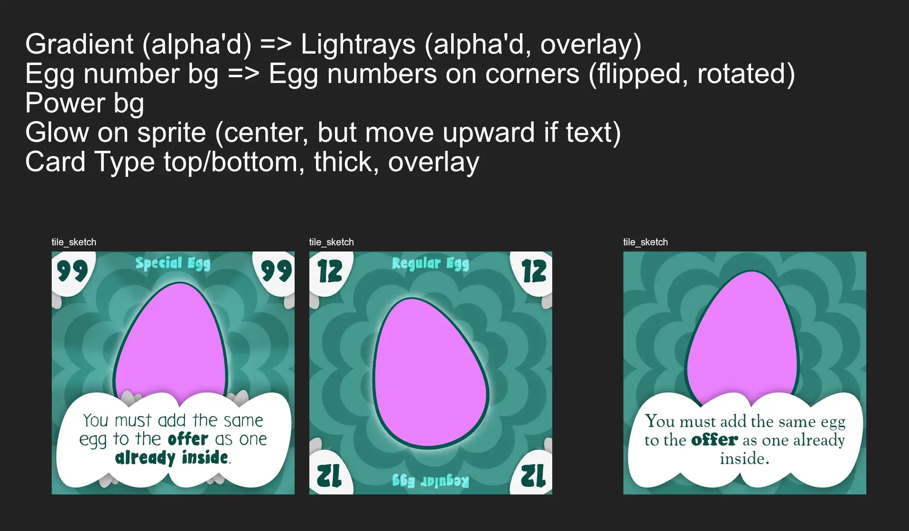

{}
Ignore the text, it's just a list of things I had to change in the drawing code for this design to work. At the time, I kept being forced to work in different locations and on different devices, so I used screenshots like these and moved them around as reminders and to-do lists.
{}

Finally, I realized all my games were tile-based and even had similar kinds of tiles in some places. That allowed me to think about sharing code and instructions anyway between the projects, but I didn't actually do that until later on. I first need to see---in practice---what each game actually needs, before I can pull parts of that into some "shared library" that draws default tiles and eggs.

## Bunny Bidding

This one started as my simplest ideas, but I was less sure once I finished most of the projects.

What was the idea?
* Everyone has a "secret egg". Only that egg scores you points, so you're only interested in getting that one.
* Each round, you must add 1 tile to the offer on the tile.
* And you must place 1 tile as your "bid" on this offer.
* Once done, the bids are revealed, and highest gets all the eggs from the offer.

That was basically the entire idea. 

I knew this was probably too simplistic to work right away. You had no information about the other's hands, you could be really (un)lucky with your tiles, many offers would just be uninteresting to you because you score nothing for them, etcetera.

But it felt _close_ to a finished game. Just a few smart tweaks and implementation details away. So I started with this one.

### Making it better

As I solidified the rules and material needed, I wrote down a bunch of _variants_ and _expansions_. As often happens, one or two of those are good enough to say "let's pull that into the base game by default".

In this case, I made these tweaks.
* At the start, you actually **reveal** your entire hand. 
* You may add tiles facedown (both offer and bid), but if you do, the _other one_ must be faceup.
* The **lowest bid** becomes start player next round.

By revealing the tiles in play (this round), players at least have information and can strategize. They might see that you have two eggs of the type they want, so it's likely you'll add one to the offer, so they try to bid high. 

The second rule, however, means that some of those tiles are added _facedown_. So you don't have perfect information and must predict how others will act. (At first, all those tiles were facedown, but that was too little information again. Now you have the interesting choice of "what do I hide? My offer or my bid?")

The third rule stems from the realization that start player is severely disadvantaged. If you go first, there are obviously no faceup tiles (offer or bids) yet! You have no idea how the round will play out! As such, it should be a _penalty_ for whomever bid lowest. Urging all players to find a perfect middleground where they don't waste their best card on an offer they don't want, but also don't become start player.

This version of the game actually adds strategy and depth.

### Expansions

When I wrote down the initial idea, players actually received an entire **role card**. That card would give you your secret egg, but also a unique power and handicap.

I decided to split that into separate tiles/modules, so it could become an expansion _and_ you had more variability. (Because now _any_ combination of Goal Egg, Power and Handicap can occur.)

But it was always something that would enhance the game, in my eyes. 

* Give players one special power only they can use. This is just a slight manipulation of the offer, or the bids, or how much info they have.
* But also give them one clear restriction at all times. This requires them to make more surprising or risky moves.

As always, I want to be minimalist and consistent, so even your Power/Handicap are just tiles (of the same size and design). You can add those to the offer as well. To get rid of the handicap, or to entice others to grab the offer.

This is also why there aren't that many powers/handicaps. I am always tempted to add way too many ideas, but I have learned to keep it smaller and focus only on "the best ones".

The other expansion is the "expected one": special eggs. Ones that provide different scoring rules or one-time powers. At first, I had no clue how to actually use those. But a good night's sleep suddenly gave me a list that was too long and even forced me to cut some :p

In general, the idea of special actions is that they override or change _one_ particular rule of the game. For example, 

* You normally have to play one card faceup? Well, here's an action that allows you to just play them all facedown if you want!
* You normally have to add to the offer and place a bid? Well, here's an action that allows you to skip that if you want!

Once you can get your mind-set there, you can usually find 10 or 20 simple actions that clearly provide some benefit. Because they give a free pass on one restriction that otherwise holds during the entire game.

### Generating the Material

The only tricky thing here is that all tiles need _unique numbers_. Because each tile serves both as an egg _and_ a number for bidding. (And I know from experience how annoying it is to spend an entire paragraph talking about what to do if there are _ties_ or _duplicate numbers_. I'd really rather not.)

Moreover, the game must be playable both with and without each expansion.

Fortunately, I realized the games don't need to be in perfect sequence. It's fine if we miss the number "33" or "68".

So, in the end, 
* I declare an _interval_ for special eggs. (At the moment, their numbers are always _multiples of 4_.)
* It creates a list with all numbers from 1 up to 100
* For regular eggs, it _removes_ all the special egg numbers. (So anything divisible by 4.)
* For special eggs, it obviously _keeps_ those and removes all else.

Then it just randomly assigns numbers to all the tiles we have.

This means the numbers will be unique regardless of what material you include. 

It also means that it's not "spread fairly". For example, the Red egg might by pure chance get only low numbers, and the Blue egg only numbers that are very close to each other. (The likelihood of any ridiculous distribution is exceedingly low, though.)

This might cause one "secret egg" to be easier to attain than others. If Blue only has high numbers, for example, then people will generally use it for _bidding_ instead of adding it to the _offer_. Making it harder to collect.

Is this a _real_ issue, though? I didn't think so. There's enough other things going on, enough randomness, and many special eggs play with bidding (such as inverting it so that lowest number wins). You'd need to play this game to death to use consistently use any imbalance to your advantage.

I decided that this would be fine.

### Finishing the Game

Within a day, I had the code for _generating_ the tiles (with unique numbers and in the right quantities and all) and _drawing_ them. I had the config/data with all possible powers, actions, etcetera. I had the rules completely covered. I had my sketch for what tiles should look like.

Honestly, the most time and effort was spent on actually creating all the illustrations and graphics that the game needs. That took waaaay longer than any other part. (Which is another reason why I'll probably share the main egg illustrations and patterns across _all_ games.)

A few nights in a row, I had to draw a lot and further finetune the AI generated parts, just praying this would all come together before Easter.

Until we arrived at the final material.

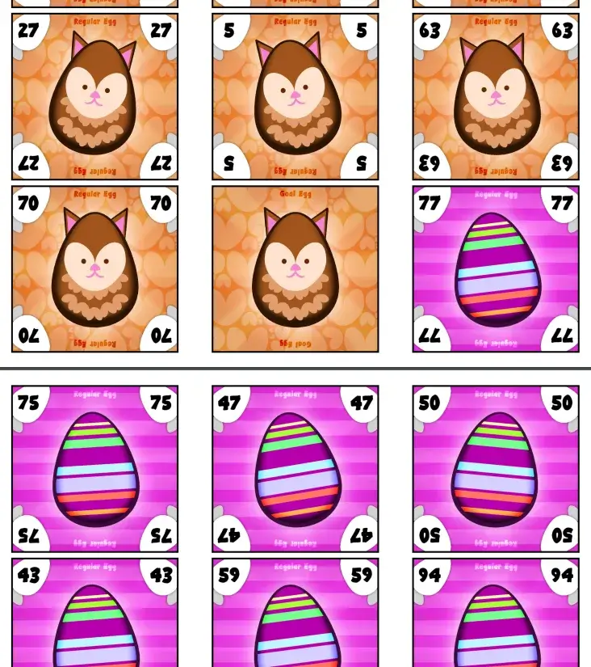

### Playtesting

Because this game was finished so early, and more Easter games were coming anyway, I was able to playtest this way in advance.

And that's a good thing, because this is the first game in a while where the first version just _did not land at all_. Yes, it was playable. The game was easy to explain and finished in 30 minutes. At some points, there were strategic decisions to be made.

But overall you just felt like you were doing nothing and watching other players---who were luckier with their tile numbers---win everything.

I identified the following issues.

* **Scoring:** having just 1 Goal Egg is too few. Luckily, I predicted this and already printed multiple per type. But because the other types don't impact you negatively in any way ... you never have any reason _not_ to just outright win an auction with your higher number.
* **Numbers:** the numbers on cards are _only_ used for bidding. There is no other use. And in bidding, the highest always wins. So, again, the game is just about "who gets lucky with the highest cards" and nothing else.
* **Turns:** on your turn, you are way too restricted in what you can actually do or influence. Holding 3 cards is too few. Where they must go---one auction, one bid, one nothing---is too fixed.
* **Winning:** winning a round is too powerful now, while losing means you actually don't get anything of any kind. Even the start player---the most disadvantaged position---is determined by lowest bid and thus inherently never the winner.

At the third try, I found myself wanting to end the game sooner just because of how bad it was. 

So, how do we solve this?

* **Scoring:** each player receives 2 Goal Eggs. They score +5, all others score -1. This gives more opportunities to score, while discouraging winning rounds you don't need. (In the playtesting, it happened several times that a player won a few rounds which had _no card_ that scored them points, just because they felt like it. To the frustration of all other players. A game's rules should just not allow such a situation.)
* **Numbers**: 
  * Firstly, we need a way to trigger a _reverse auction_. After some trial and error, the best candidate is: "For every player who bids the same egg type as the most common egg in the offer, the auction reverses." This makes lower numbers just as valuable, as the auction is quite likely to be reversed.
  * Secondly, we need a _second_ way in which numbers can be used. Eventually, I settled on: "if you play the highest number in the current offer, you may play another card on your turn (to offer or bid)."
* **Turns**:
  * Firstly, let's increase the hand limit to 4.
  * Secondly, the rules changes above already make turns more varied and interesting. (That _should_ be the mark of a good rule: it improves everything a little.)
  * Thirdly, displaying all those 4 cards to everyone (at the start of the round) is just _too much information_. All you really do is check who has the highest number, or if someone has so many eggs of your secret type they'll probably play one, but otherwise it's _meh_.
* **Winning**: 
  * I simplified the rule to just say "winner starts the next round".
  * I also moved the default for playing cards to be _faceup_. To discourage playing facedown further, the rule is: "any bids played facedown go to the hand of the lowest bidder" 

This makes the rules a bit more complicated. But it's already much, much better. Now it's actually a game, in which any tile can be used for good or bad, and you have choices on your turn.

After a lot of consideration, however, I decided to remove one more of the core rules: revealing your tiles at the start of the round.

As stated, it was just overwhelming. Too many tiles revealed to be useful or to be remembered. It also causes this awkward pause with "has everyone seen enough?" "no! no! wait!" (repeat x5).

Additionally, it makes the luck factor _worse_. You're entirely dependent on the 4 tiles you happen to get from the deck each turn. In several of my playtests, this just meant I didn't win anything because my numbers kept being low when others had high ones.

Instead, let's just distribute _the entire deck_ from the start, and forego the revealing. 

* As you're highly encouraged to play faceup, you'll have most of the information you need anyway.
* Because the deck is entirely dealt from the start, you _know_ if a number is still present or not. You know if _you_ have the highest remaining number, for example, or the lowest---or that it must be someone else.
* And, the biggest advantage, is that you can now plan ahead and strategize multiple rounds ahead. You can save the eggs you want to score yourself for that _one round_ in which you win it all with that really high tile of yours. Even if all your tiles suck, this _still_ allows you to play to the fullest.

This also had another (unexpected) consequence. If the deck is entirely dealt, then we obviously can't draw 2 deck tiles to start the offer in each round! There's nothing to draw from! Instead, those 2 tiles need to come from _somewhere_ ... and the winner seems the best option again. 

* Being forced to play 2 tiles can be a bad thing (your hand emptying far more quickly), but also a good thing (you can shape the offer and the other player's strategies).
* It also discourages winning "too often". So if you are "lucky" with lots of extreme numbers on your tiles, you must actually strategically get rid of some of them, or you'll be out of tiles too quickly.

For aaallll the reasons mentioned, these changes make the game 1000x better. An actual game, you might say. Because I was able to also _remove_ core rules, the additions don't actually make the rules explanation that much longer or more complicated. Only about one paragraph.

It's always disappointing, initially, when a game prototype feels completely broken upon playing it with others. But I also know, from experience, that this will just show the many ways in which it can be _much better_. Although I do this work a bit begrudgingly, I do also know these modifications end up turning a meh game into something really, really strong. Which is, you know, the thing we want as game developers.

{}
Also, there are way more lessons in failures. For example, this one showed me that you can't put numbers on randomly drawn cards and have higher numbers just be _better_ than lower ones all the time. Provide a way to reverse it, or give the numbers 2 or 3 different use cases, otherwise you just added a huge dosis of "just be lucky" into your game.
{}

## Egghunt Esports

### It starts with constraints

When it comes to egg hunting, I noticed many of my ideas were halted due to the same issues.

* We need a "pawn" of some sort to track where you are on the board/map/area. But a print-n-play game can't give you pawns, and moving a tiny piece of paper over a bigger piece of paper just isn't a great experience.
* Similarly, you might be able to "see through" (thin) paper. This ruins the entire game if you can just _see_ which eggs are where.
* Just randomly placing a grid of eggs and telling players to search/collect them isn't interesting. The _challenge_ (and _fun_) from real egg hunts come from the varied, real, physical environment.

As such, this idea came to life when I finally realized how to solve all of those.

* We don't need a pawn _on the map_! We can use two pawns to the sides. One points at a _row_, another at a _column_. The tile where they intersect is your "current tile".
* We can simply place _another tile_ on top of the hidden eggs. So each cell has a facedown egg and then, say, a tile showing a shrub on top. This makes it impossible to see through anything.
* And now that we have that obstacle tile (showing shrubs, trees, rocks, whatever) over each egg, we can use that to give the game more depth.

### How does that become a game?

So you place your map: eggs with obstacles on top.

Now each player gets 3 actions on their turn. The possible actions are:
* Move a pawn.
* Search your current tile (to see what egg is underneath)
* Collect your current tile (to actually get it)

_Why multiple actions?_ Because your current location is given by two pawns, moving only one step per turn is just too slow. You usually want two actions for moving somewhere new. Additionally, this gives some more freedom and variety to your turns, and allows more special abilities on the obstacles later.

_Why split search and collect?_ If eggs are always good---they always give you points---then actually searching would be useless. You would _always_ search _everything_, on every turn, because whatever you get will be good.

So there need to be good eggs and bad eggs. Some give lots of points, some give negative points. (In fact, the negative ones should be _really negative_ to scare players away from randomly grabbing everything and ruining the game.)

And if that is the case ... you need a way to _know_ what you get and to strategically _prevent_ getting the bad ones. Hence the split. You can spend actions merely _looking_ at what's where (and hopefully memorizing that correctly), or collect them immediately (at the risk of getting something bad). It's now a strategic choice based on information.

But this, again, also opens the gates for other interesting wrinkles. I love my games with _loads of interaction_, and currently the game had none (besides perhaps collecting an egg that another player wanted to collect next turn).

So I invented the following rule:

> If you _search_ a tile, you must also show the egg to any other player who has a pawn pointing at that row/column.

It seemed intuitive. If you're egg hunting, and somebody next to you lifts a rock to find an egg underneath, then you'll surely see it too :p

But it's also the simplest rule I found that gives both interaction and depth. Now you can position strategically to see a lot of eggs on other player's turns. (And similarly, you want to plan your path in a way that you _don't_ have to share that information with anyone else.)

And what is an egg hunt, if not looking in the right places and positioning yourself strategically? :p

These are just the core rules. The different obstacles that hide eggs will have their own rules that spice up the game. For example, a tree might say "if you collect this egg, it must be the only action on your turn". Simple, small ways to give the game even more depth.

### The Objective Problem

One final issue remained. When does the game **end**?

Because many eggs will be bad, I can't say it will end when "all eggs have been collected". Because players won't _want_ to collect any more eggs at a certain point.

I also can't say it will end when "all locations have been _searched_", as there's no way to track and remember that easily, and it might end the game far too prematurely.

This issue stumped me for a while (which meant I already started doing work on the third game in the meantime).

Until I realized I was being stupid (as usual). I had _assumed_ from the beginning that collected eggs would be _revealed_. That they'd be shared information, proudly displayed upon collecting them.

But ... if you simply keep your collected eggs a _secret_, then nobody knows how many good or bad eggs are left! Players will keep hunting for the final few eggs because they can't be sure what they are.

Unless ... they simply search before collecting, and see that only bad eggs remain. Then the game deadlocks still :/

Ugh. This was only half a solution, we needed something else.

Usually, when that happens, I also look at all other issues or improvements for the game. Because I want to introduce rules or ideas that solve _multiple things_ at once.

So, another issue with the end game is that so few eggs might be left that you simply _know_ other players will reach them before you ... and you can't do anything about it. You're moving aimlessly for a few turns before the game finally does end.

I thought back to real-life egg hunts. So many times, kids just decided "this is enough for me" and stopped looking, even if technically a few eggs remained out there.

What if we added that as an option?

> At any time, you may leave the arena. Remove your pawns and take no more turns. The game also ends once everyone has left.

This will ensure the game never drags on too long. But there's also no clear _benefit_ to leaving early now, as that is a risky decision while the rest keep playing.

So we needed a final addition: "Once a player has left, the Check/Search action becomes unavailable."

You need to make sure you know which eggs you want before somebody leaves. Once that happened, the game speeds up as you can only try to collect what you think are good eggs, or leave yourself as well.

{}
Of course, a rogue player might ruin the fun by just insta-leaving. So I also added the stipulation that you can't leave before you have 3 eggs.
{}

### The Numbers Problem

As I coded the generator for the material, I had to make a few more decisions.

_What will the point values be?_ My first instinct was to have 6--8 different egg types that have a _fixed_ point value. So a blue egg is always "4 points" and a red egg always "-2".

This seemed fine, until I had a few other ideas.

* This game would benefit from having to grab eggs **in order**. So, each red egg would have a unique number (from 1 to 10), and you couldn't collect egg 4 if you already had egg 7 (for example). You can only grab higher numbers.
  * This further discourages players from collecting without checking first, and is a simple but challenging idea in general.
* I wanted to add **special eggs** with specific rules for how much they're worth. For example, I could say "worth +2 points for each Red egg you have". However, this might be very unbalanced or just not interesting if eggs have fixed values. If Red eggs are always -2, for example, getting a +2 for each is literally useless :p 
  * I don't want to restrict the game that much and spent much time preventing such stupid quirks. (And probably missing a few of them anyway, as I'm an imperfect person with very limited playtesting resources.)

So what do we do? Each egg type has the same _range of numbers_. Something like: -8, -4, -2, 1, 2, 3, 4, 5.

This means we only need one big number per egg to accomplish all our goals and possible expansions/special rules.

### Let's Make That

I ... made what I just explained I'd make. So there's nothing special to mention here anymore. (It helps that this game is very small and streamlined, usually a few things go wrong while going from idea to final product.)

The final material looks as follows:

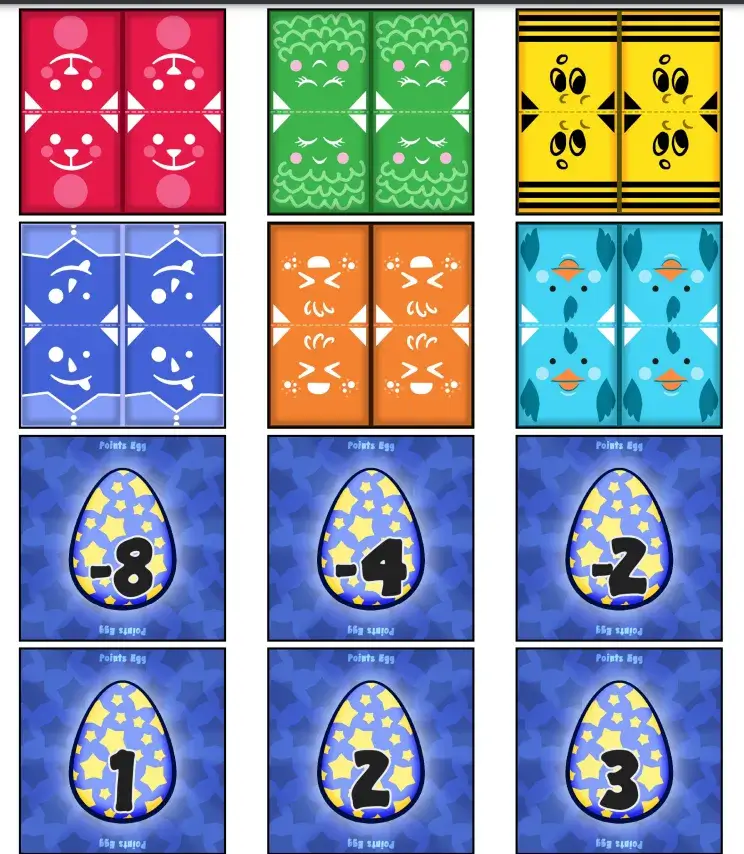

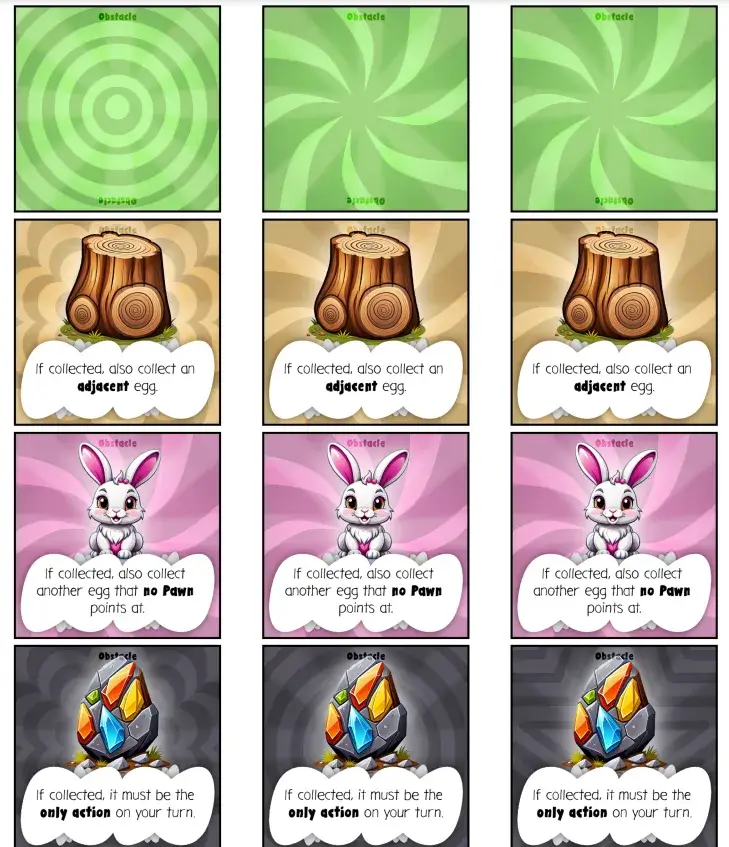

### Playtesting & Polishing

This game just ... **works**?

Right from the bat, the game played well, people had fun, and all my initial choices turned out to be fine.

I merely made the following changes to polish the game.

* Slightly more "empty tiles" in the base game => it's pretty overwhelming if you start your first game and there are _loads_ of tiles with special actions staring at you. (After playing 1 or 2 rounds, though, it stops being overwhelming and it's fine.)
* Tighten up some of the tile actions => for example, the "if collected, take another turn" was too powerful. I reduced that to only get 2 extra actions.
* The initial rule stated the game ended as soon as "all eggs were gone OR all players had left". Obviously, though, the final player can just stick around forever and annoy everyone and delay the end. So, instead, "the game ends immediately as soon as only 1 player is left".
* There are slightly too many eggs now, with the negative numbers too aggressive, which means too many of them are _out of the game_ (not used this time) which ruins some of the strategy and tension.
  * So I reduced the number of unique eggs to only 5 (from 6).
  * And added one number to the sequence, which now ensures _almost all_ eggs are used in a standard base game.
  * And I reduced the negative numbers slightly. Because as the testing showed, somehow stumbling upon a "-8" is pretty hard to swallow when the positive numbers only reach up to "5".

Besides that, however, I see no more improvements or obvious flaws. At the first playtest, one player literally entered the room _after_ the rules explanation and picked up the game by simply watching the turns of the others. They joined in and had fun all the same.

The mechanics of _searching_ vs _collecting_ (searching is more broad; collecting targets only one tile but you actually get it) are well balanced. It seems I hit on the perfect tug of war between those two elements.

Similarly, the _special powers_ of obstacles can't be discounted. I imagined they were a nice way to "spice it up slightly", but they turned out to be another great addition that makes the game more interesting at all times.

And lastly, that simple rule of _collect eggs in numeric order_ also did more heavy lifting than I initially imagined. Because of that, you can find _great eggs_ ... and still not grab them. Because you made the mistake of grabbing a higher number earlier, or because you don't _want_ such a higher number so early in the game, etcetera. Without that, stumbling upon a great egg will just always be followed up with collecting it (if you planned your turn somewhat smartly).

As such, the entire ruleset of the game is as simple as possible, but all the elements combine to create a balanced and interesting game from start to finish. I'm happy with that.

As such, this game is now DONE!

## Reggverse Riddles

The idea behind this game was: "what if we do a REVERSE egg hunt?"

What would that look like?

My first answer is the one most people would probably give. It's also the idea that ended up being probably the most complex to figure out and generate, which is why you'll hear about it _later_ in this devlog.

Instead, this game was the _second_ way to approach it.

What's that? Imagine that the eggs aren't hidden yet. Instead, the eggs only show up according to a certain _rule_ about their location. (In my notes, this was first called "The Rule-Based Version".)

* Tiles show rules such as "Next to a tree" or "Not in row 1".
* You can play these tiles next to egg types, basically creating a chain of requirements that state where you can find the egg (... at this particular moment).
* You end each turn by collecting whatever is on your current spot, based on those rules.

So the general flow of the game is to figure out the best way to manipulate the rules to score loads of eggs at the end of your turn. ("Oh! Look at that! The Blue and Red eggs _also_ appear to be here!")

Over time, you collect tokens following these rules, until the storage of eggs is empty and the player with the most egg tokens wins.

I deemed this a rather "simple" idea, because I only needed ...
* Loads of small tokens of eggs (which I'd already drawn and put into the system anyway)
* Obstacle tiles to make up the map (which I'd already made for the previous game)
* Tiles that spell out a simple rule (from my list of options) + a possible movement.

_A possible movement?_ Yes, of course we also need a way to change what your "current tile" is. So I kept it all simple and minimalist ... and put that on the tiles as well. This means tiles will just say "move to an adjacent tile" or "take two steps" and you can do that on your turn instead.

{}
This entire project could be summed up as "making simple tiles do double or triple duty in many different ways".
{}

Although I did decide to go with more of a _fantasy_ theme here. To change it up and because I felt it fit better with "riddles" and stuff.

### Coming up with "rules"

When I wanted to create my list of possible rules cards, I noticed I really didn't have many options or ideas.

An obvious rule is "(not) next to SOME TILE TYPE". But ... what else?

Furthermore, you don't have much _control_ over this. The map is set in stone when you do the random setup at the start. You can walk over it, but not actually swap or change the tiles themselves.

After sleeping on this, my brain came up with the following solution:

* Somehow, eggs can also be placed _on the tiles_.
* Now we can have rules like "next to a blue egg" or "on a tile with at least 2 eggs"

This gives more variety in rules and slightly more strategic control. The question was: _how_ does placing eggs on tiles work?

I didn't want to add a third action. The game is nice and simple with the same core action ("play 1 tile") the entire game.

So, instead, I attached it to the movement action. After moving, you may take any one egg token and drop it on your final destination. This is a very simple rule, but it suddenly opens up endless opportunities in the game.

* By taking this token from the supply (instead of the board) you can make the game end faster. (And vice versa to make it take longer to finish.)
* You can use this to prepare a nice reward for yourself, but also to _remove_ an egg token you think somebody else relies on to score optimally on their turn.
* While, as stated, giving more variety in rules.

This is why I immediately promoted this idea to the base game.

### Movement Options

At first, I wanted to provide a vast array of possible movement instructions.

* Some written ("go left until you hit the first Tree")
* Some arrows ("> > ^")
* Some a grid (where it highlights which square(s) are valid destinations)
* Etcetera

But I realized I was making this needlessly hard and stopped myself in time. This will just be lots of work + busier cards, and for what? We can achieve almost all possible movement instructions with just _one_ type: the grid. It's also nice to put on the tiles, as it's an entirely visual representation of what you can do. 

(If possible, always reduce the amount of text. People don't want to read. And even if they do, reading is usually more exhausting than looking at good iconography or visualizations.)

So, in the end, my generator simply picks 1 or 2 random "destinations" for each tile. Then, when drawing the tile, it creates a grid and _highlights_ those tiles. All you need to do is match the tile orientation with the board and it literally tells you exactly how you can move.

Because tiles fulfill a double function, however, I needed to keep even this grid _simple_. Because it can take up only half the tile; the other half will contain the _rule_. (Which is randomly picked from a list of options. Variable values, such as "%TILETYPE%", are filled in on the spot with the actual icons of the tiles.)

### Reducing material further

At first, I thought I needed to include an extra tile type _per egg_. Namely, one that would function as the "storage" for its egg tokens (and the start of its row of rules).

Then I realized ... if we already have a _pile of tokens_, then we don't need another tile! The tokens already indicate to what egg type these rules belong. And when the pile runs out ... the egg type is out of the game anyway, so the rules can be removed too.

After adding my new rules twist---dropping eggs on the map itself---this, however, posed a new issue. Or so I thought. Because you can place a new egg token at the end of each _movement turn_, piles could run out quite fast. 

I already started brainstorming convoluted rules about when the game ended, or adding that extra tile type anyway, until I realized this was an opportunity to simplify the game further.

> The game ends when all **egg piles** have run out, not necessarily when their tokens run out (they might still be on the board).

> Both placing and grabbing a token can be done from _either_ a pile or a tile ( = the board.)

Now you have almost full control over how fast piles run out and from where you get your egg tokens. This means players will be _discouraged_ to draw from the pile if they think they're not in first place (and want the game to last longer), which I assume will be the case most of the time. (It's highly unlikely that _all_ players constantly think that _they_ are winning this game :p)

With 3+ egg types, each with 10 tokens, this doesn't actually end the game too quickly. In fact, 10 tokens per type might be a little too much.

Now, I wanted to show the "process" of finding the tile layouts for this game again. But my process was rather quick and pretty much straight towards the end product, so, well, here is a screenshot of "sketches" of the different tile types.

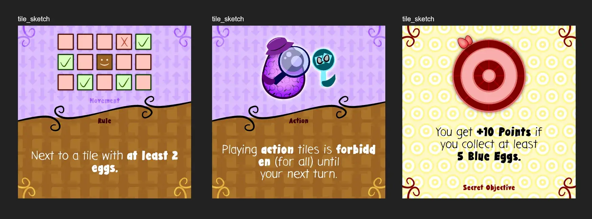

### Let's Make That

Again, a good preparation meant I "just" had to create all the images, put them in the right place, and ask the code to place them where needed.

This yielded the following final material.

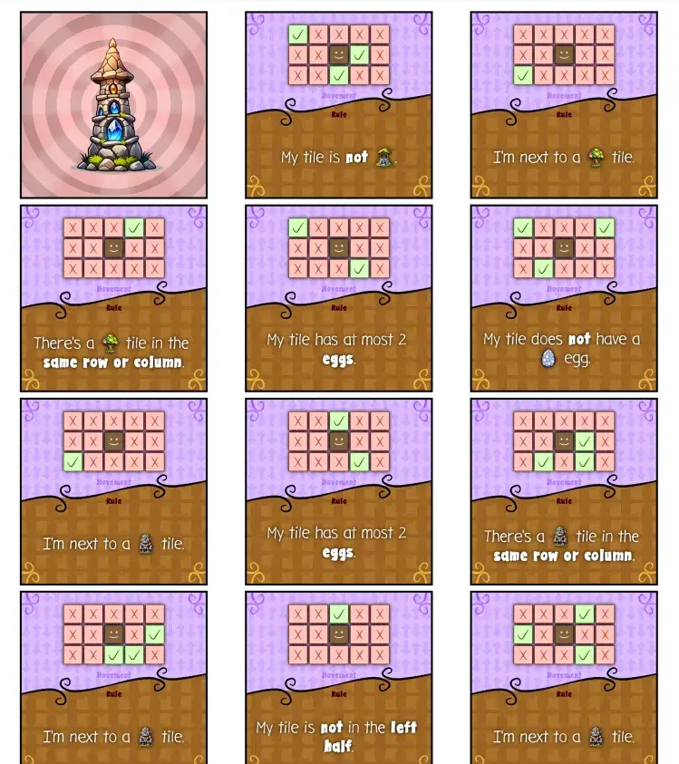

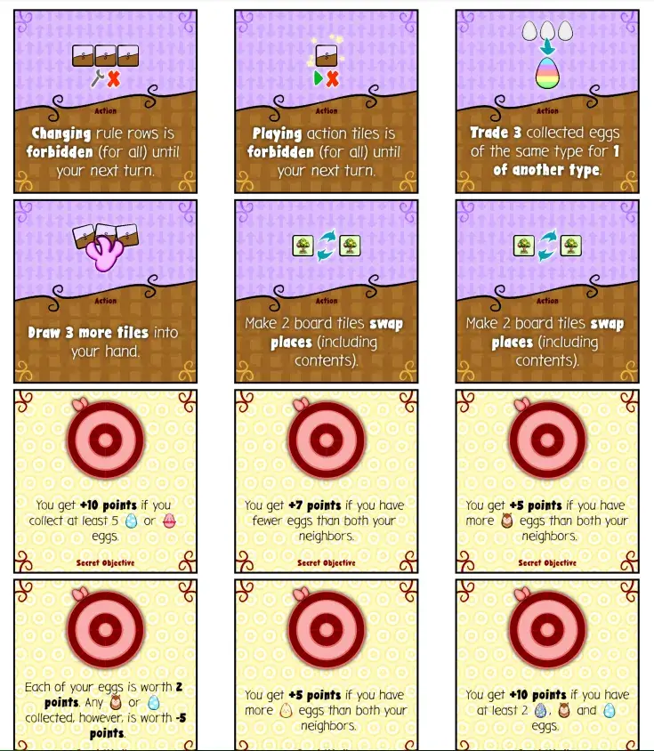

In the top right of the first image, you can see an image of a map tile. Those are really nothing special: we just need _some type_ to be assigned to each tile, nothing more. 

I do want to mention that these are screenshots, from a terrible laptop screen, at a rather small size. I often fear that tiles won't be readable or text too small when I design these games. I'm reminded of that fear when I take these screenshots and worry if my readers will be able to see it clearly. 

But when printed, the tiles from this game are extremely easy to read. Then the colors come out right and the resolution is high enough.

The material, of course, also includes a bunch of eggs. But that's true for many of these games and isn't that interesting to show.

{}
Pretty annoying to cut out, though. An entire page of tiny eggs for four games in a row :p I could've added them once and just reused them, but I like having _all_ material for a game in one place instead of having to take elements from other games if I want to play.
{}

### Playtesting & Polishing

As usual (when I lack the time to paper prototype the games myself first), the game just **didn't really work** at first. That first testing game is always a bit ... rough.

Fortunately, though, I've learned to identify the pain points quickly and introduced some new rules that brought the idea to a much better state.

**Issue #1:** the first one seems obvious in hindsight. This change made all the difference: **when you play a tile, you do BOTH the movement and add the rule**. 

Doing only one of them made your turn feel slow and inconsequential. Even worse, if you scored well the previous round ( = your location led to many eggs), then you have no reason to move. So players would just stay where they are and that's that---which is close to _not playing the game at all_.

Instead, if you have to do both the movement and add the rule, your turns becomee way more tactical, interesting and dynamic. You _have_ to think ahead and you _have_ to be smart about it, because you literally can't stay in the same place. 

This is literally just rewriting one paragraph in the rules.

**Issue #2:** still, this means you can find a good spot and other people will just move to it to profit. Which causes people to spread out, creating an empty and boring map instead. Also, with multiple pawns on a tile, it becomes hard to see what the actual tile is.

What to do?

* Disallow sharing a tile. 
* Reduce the map size to 4x4. (Players tighter together, cards such as "there's a tree in this row" are less overpowered.)
* Which means the movement grid also shrinks to 3x3. (Because 5x3 is useless if the map isn't that wide :p)

**Issue #3:** Directionality. The first few test games, we had constant discussions about "is the bottom half of the map the same for ALL players or not? Is it from _your perspective_ or matching the _orientation of the tiles_?"

After trying a few different things, the best solution as simply to say: **it's always from your perspective**.

* When moving, orient the grid from your perspective. (So, just, hold the tile normally and use that.)
* When tiles say "row" or "column", simply apply those terms from your perspective.
* Etcetera

Not only is this the simplest, most intuitive ruling, it also makes the game more interesting. Because an egg might be there for _you_, but not if _another player_ stood at your spot.

**Issue #4:** there are a few rules that don't really make sense or help the game.

* The rules about "X is in the same row or column" are too overpowered. This changes to "horizontal row" or "vertical column", not both.
* The rules about _eggs_ are silly if that egg type _isn't even in the game_.
* If we DO forbid multiple pawns on the same tile, all those rules must obviously go.

**Issue #5:** I'm still not sure about the "drop an egg wherever you land". Yes, it's a simple rule that helps the game, it is more than fine. But I feel like we can do something _slightly more_. We need _slightly more_ variation in how turns play out, such as ways to modify the map and/or only certain egg types must be checked at the end of your turn.

After taking a short break and then trying to "finalize" this game, I finally found something.

> You can't collect eggs that already lay on your current tile.

Why do I like this?
* It makes that decision of what egg to drop (or pick) even more important and strategical.
* It ensures that you will never be able to score _all_, and a "good" turn scores perhaps half of the eggs. (Which means the eggs don't drain as quickly and it's not as common for someone to have an amazing turn, making it more, well, amazing when it happens.)
* It allows me to just **include all eggs** every game. Because you won't score all of them every time, only a few, this isn't overwhelming or gives a huge bonus anymore. It means that all the rules about "(not) next to egg X" can stay and be useful, because we're now sure those egg types are actually there.

This does not allow modifying the _map_ in any way, but because you're moving _every turn_ anyway, this felt too unimportant to add to the core rules of the game. Instead, some action tiles allow modifying the map and that's it.

With these changes, the game is _slightly_ more complicated. (Three tiny extra rules. Though the core loop is simplified because you don't have to choose anymore, it's just always "play 1 tile and do both the things it says".) 

But it is much, much better. Now every part has a clear purpose and adds to the strategy or options. Everyone will do something every turn, and you must always be active in trying to find the next way to score as many eggs as possible.

At the same time, the changes---including all eggs, sharing space is forbidden, not scoring any eggs that are physically on your tile---it all makes it _harder_ to score. It allows the game to be slightly longer---instead of being over before you really got going---while making a _great_ turn feel more rare. More amazing and rewarding.

That's good enough for me, let's continue.

## Quizhide Queaster

This was the original idea I had for my "Easter game", months before, which I thought was "meh". Or, rather, I thought it had great potential but I just wasn't finding it.

Fortunately, after making these other games _and_ after giving myself time to think about it more, I was able to push through the issues and find the simple, working core of this idea.

### The original idea

The idea was to actually simulate an egg hunt. 

* Split into two teams, one Hiders and one Seekers.
* The table has a map of random "room tiles"
* Hiders must place facedown eggs on empty slots in the rooms (while the Seekers close their eyes/leave the room)
* During the game, Hiders use "clue cards" (with vague illustrations like Dixit) to hint Seekers where they should look for their next egg.

This is still the core idea in the final version. It's just that, well, this isn't much of a game :p We need some extra twists and ideas to make it functional.

* Why wouldn't the Hiders just place all the good eggs in one group at the entrance?
* Why would individual clues matter at all, if each egg is worth the same regardless of who finds it?
* There's no clear way for Clue Cards to point to a specific _slot_ within a room. (So even if you send somebody to the right one, they might randomly pick a different egg from that same room.)
* Can I give the Hiders something more to do?

The original idea had some "barebones ideas" to solve some of this.

**Spoiling:** Maybe eggs can _spoil_. So at the end of each round, Hiders must remove all the eggs they know have spoiled, and during the game they must send players to the most "in danger" eggs first.

You can probably see why I wasn't happy with this. It requires Hiders to _remember_ (accurately) what a number on an egg is, and do this upkeep every round, for no huge benefit. (Also, with small egg tokens, we really don't have space to put much information on them.)

**Random Start:** Players pick their starting location _after_ the Hiders have done their thing. This means they can't easily put the "good eggs" all on the tiles where players start and win the game in a few turns.

But they _can_ still do it. There are certainly rooms that come off more as an entrance. Even if their starting point is wrong, if Hiders decide to group all the good eggs together, they can still lead players to that group and win easily. (Players will also see what's happening if _everything_ they collect in an area is completely good or bad.)

It just wasn't great.

### The better version

This improved version relies on a few simple tweaks.

* Eggs are covered up with furniture / obstacles. 
  * This allows the furniture to be part of the clue (and point to a specific slot). 
  * It also prevents seeing _through_ the egg if you just printed this game on thin paper.
  * (And expansions might do something with the obstacle, such as "you need 2 people to search underneath this heavy sofa")
* Each player receives a random "Score Card" at the start. It tells them how much each egg scores _for them_. 
  * This means Hiders need to actually send different players to different eggs, while accurately remembering where everything is. 
  * Additionally, this prevents having to write a point value _on the egg_. Which is nice, because small tokens with even smaller numbers isn't great material to play with.
  * Players still pick their own starting location and score card _after_ hiding. So there is absolutely no way for Hiders to game the system apart from blatantly cheating.

With those tweaks, we do increase the amount of "unique material". But in return, we get ...

* A game that actually works
* Simpler material. (The eggs are literally just the illustration of an egg, nothing else.)
* Confidence to actually make this rather ambitious idea. (I'll need to find a way to consistently generate Clue Cards and Room Interiors with AI, and if not, do all that by hand. And we need _a lot_ of those for the game to have depth. So yes, I'd say this is ambitious.)

### Generating Score Cards

At first I thought I'd do all possible options. So,

* Egg 1 = 1, other eggs 0
* Egg 1 = 1, Egg 2 = -1, other eggs 0
* Etcetera

However, with 6 eggs, and both positive and negative values, that's _a lot of options_. Too many, one might say.

I also wanted more variety. Some score cards would be balanced (some +1 eggs, some -1 eggs), some would have huge risk-reward (one +4 egg, the rest 0 or negative). It's one of those easy ways to add more variety and depth to a game, without asking the players to read any more rules or understand anything else. Just tweak numbers they'll be reading from a card anyways.

So, what algorithm did I come up with?

* Track a counter for all egg types (in the game), starting at 0.
* Do a random number of iterations.
* Each iteration, do one egg +1, and a different egg -1.

This way, all score cards will be "equally good" (because each iteration adds zero effectively), while allowing maximum variety among them.

(I do have checks if they aren't just all zeroes or negative. If so, we just continue iterating until that's not true anymore.)

Below is the playtest version of these cards, to give an idea.

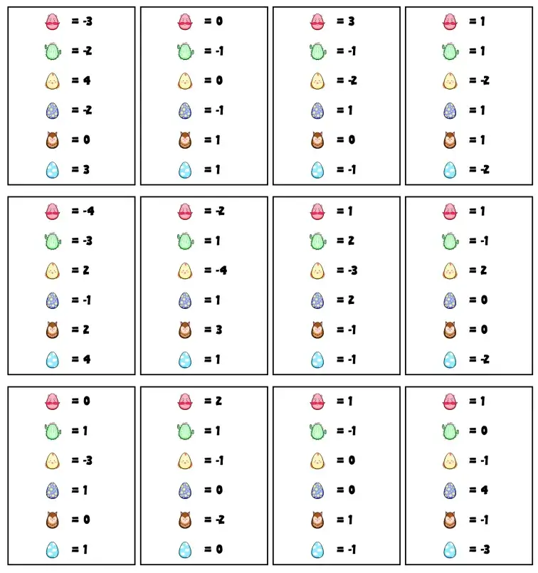

### Finalizing the tiles

As stated, I initially wanted to mark "slots" on the tiles where hiders would need to place eggs. So, for example, a couch would have a clear "couch icon", so you needed to place a couch there with an egg underneath.

Now I realize this just isn't necessary and removes the point of having separate furniture. If I just reuse the same icon for "this is a hiding slot", and allow players to use any furniture they want, the map will be _more different_ every time you play. (Reducing the chance of just "learning" which illustration belongs to which room/slot if you play the game multiple times.)

What did I end up doing?

* As I placed the rooms into a neat spritesheet (in my graphics software) ...
* I picked one or two locations per image. (Usually the biggest or most highlighted piece of furniture inside it)
* And placed a dot there, so I could read the coordinates. In my code, I saved those relative coordinates with each room.
* So it can, on the fly, draw the "this is a hiding slot" icon at the right places.

_Relative coordinates_? As always, I want everything to be resizable. You can print this game with tiny tiles or with huge ones. If I save the exact absolute coordinates, it'll only work for that one size. Instead, the code knows something like `(0.25, 0.25)`, which means 25% off the left and 25% off the top.

As for the obstacles, I just cut out some good ones from the remaining room images. A pot plant, a couch, a table, stuff like that. We need some variety here, but not an enormous amount of it.

UPDATE! Actually, no. I saved the absolute coordinates anyway, because it's much easier to type. I simply _convert_ them to relative coordinates by dividing it by `1024x1024` (the base size of all these sprites).

Below is the final material for this (a screenshot of one page of the PDF).

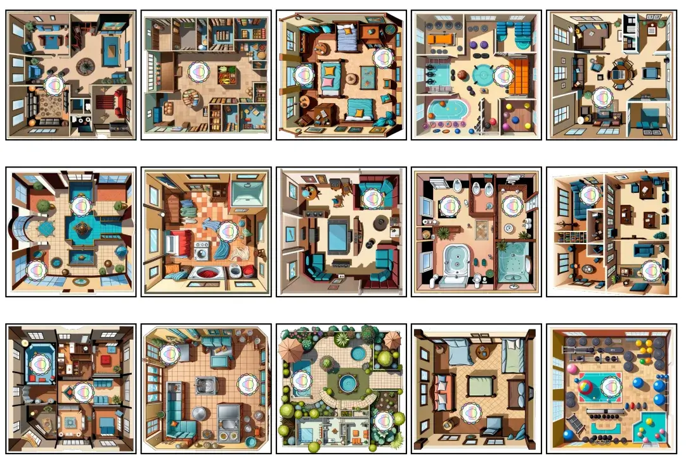

### Finalizing the game

As for the clue cards, I ended up with over 200 generated "surrealist, dreamy images". That's way too much. I whittled it down to 88 of them (on an 11x8 spritesheet). Even then, I split both the rooms and clue cards into two parts. One half is the base game, the other half is the expansion.

If I didn't do it, my laptop would simply crash trying to load the files. 

Actually drawing all the material and putting it in a PDF is cheap and easy. But my old laptop has some sort of limit on how much image memory it can load, and this game, with all its high-resolution assets, has hit it.

I did figure out that this does not happen in Firefox, though. So for now I just use _that_ to generate this game.

{}
It seems as if it's just a bug in all Chromium browsers. If you try to decode too many images, instead of the browser just waiting with the later images until the first ones are done---as it should---Chrome just ... errors. For some reason, the developers don't think this is a priority. This bug has been opened many years ago and hasn't been fixed.

Firefox can generate the material for this game in almost no time. Chrome takes 30 seconds to decide it will just error and do nothing. How is that not a bug you want to fix quickly? :p I can work around this by wrapping all image decoding calls in a long chain of "try, try again, try again, try again", but that is ugly, slow, and shouldn't be necessary.
{}

Below is a screenshot of the first few clue cards in the material PDF. I decided to make them a bit smaller than I'd usually make cards (at this chosen material size), because otherwise the amount of printing and cutting for this game would get out of hand!

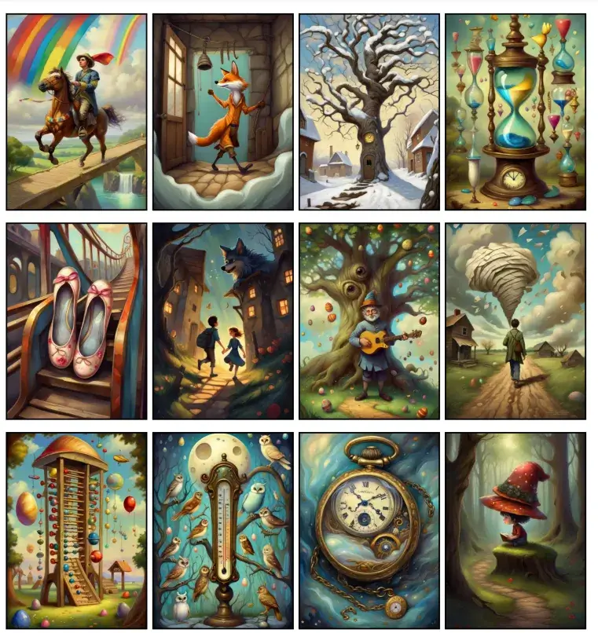

### Playtesting & Polishing

So I tested the game ... and it was, erm, _hard_. For the Hider in particular, but the Seekers were also a bit too limited.

As always, we first need to make sure the game is actually easy enough that it's still fun to play (and not homework).

**Solution #1: Smaller Board.** A 5x5 board is just too much. A 4x4 grid is way more feasible: just too large to be easy, but remembering ~15 eggs is "doable".

**Solution #2: Refresher.** Even then, if you forget what eggs are where ... then you've forgotten and the game stops being very useful with a Hider who gives random hints. As such, playtesting showed that after 3 Clue Cards was a natural moment to allow a "refresher". 

I tested allowing the Hider to look at any X eggs. I tested allowing them to look at 1 or 2 full columns/rows. The last option proved most useful.

* Allowing them to look at any egg gives away their possible next hints too much. (Oh, they looked for a long time at the egg in the kitchen, must be something important.)
* A refresher of only 2 or 3 eggs isn't that useful, so 2 full columns/rows seemed the best balance.

**Solution #3: More Cards and More Freedom.** I gave the Hider 4 cards in their hand, instead of 3. Then, testing showed the Hider often wanted to give extra hints based on _how_ they gave the Clue Card. Maybe they rotated it or put it on top of another card. This was creative and useful, so I allowed it: you can give the card any way you want.

**Solution #4: Reduce the number of types.** The original number of unique egg types was 6. This meant that almost every Score Card had 1 or 2 eggs that scored 0 points, which means finding those ... was a bit of an anti-climax. It also meant the Hider had more trouble remembering what to do and where to send players.

I lowered it to 5 and 4, then settled on 5. With only 4 types, there's too _little_ variation between players and too _little_ challenge. At least, as far as I can see now.

This had the added benefit of allowing text on score cards to be larger, making them more readable at a glance or when the Hider sits far away.

**Improvement: Time Pressure.** Now you can technically just walk around forever and be _so_ conservative that you never search for an egg. (Not likely in practice, as players really _want_ to be finding eggs.) So I hijacked my new rule to also say: "Once every 3 Clue Cards, you _must_ have searched once."

**Simplification: One End Trigger.** The original rules said "the game ends when all eggs are gone or all players have left". One of my recommended variants adds more pressure by adding a _third_ rule with "the game also ends as soon as all players have received 6 Clues".

That is just too much. I highly prefer games with a single end trigger. And this one wasn't even needed: Players leave when the Hider says there are no good eggs for them anymore, so they automatically leave when all eggs are gone!

(These tweaks may seem minor, but they make a huge difference. When teaching the game, being able to say "the game ends when X" instead of "the game ends when X or Y or Z" is way simpler. Similarly, the option to play competitively---instead of cooperatively---was moved to a variant at the end of the rules too.)

Overall, the issue was that I did _too much_. And that's not really an issue, because it's easier to discard the bad stuff or simplify what you have, then to add more when you have too little. In this case:

* With a lower cap on the game length and board size, the number of Clue Cards and Rooms needed in the base game is reduced.
* Similarly, ith a smaller board size and fewer egg types, the number of egg tokens needed is greatly reduced. (And the number of Obstacles to cover them up)
  * This is great anyway, because if we have too many different eggs, too many of them will _not_ be included in any given game. Which means there's huge variation in how often each egg type appears, which makes some players simply more "valuable" than others, and that's not nice.
* And the variation on Score Cards can be more limited too. (I allowed at most +4/-4 now, which proved to be too much in playtesting. Making one egg _so_ good or bad just isn't great.)
* And finally, I made the Room Tiles even _bigger_. There's just so much detail there---and that is so important for using and understanding clues---that making them too small goes against the very core of the game.

With all these tweaks, the game is simpler and much better.

It's also a bit basic and bland. But I know that's just my gamerbrain speaking, which wants incredible depth and variety from EVERY GAME. No matter how small, no matter if that's not the intention.

It's a fine game. It will surely be simple to understand and play for families and groups. The cards and rooms look great.

And that's why I ended up putting this as the _first_ game of the project, as it's the simplest and most suited to the actual original purpose. (Even if the material you need to print is slightly higher than I'd like. Then again, it's only 9 pages for a full-blown professional-looking game for 2--8 players.)

And so I consider this game done! Though it is the most likely one to get visual upgrades, tweaks and perhaps expansions when I do a general update to the Easter Eggventures later.

## Chicken Colorout

Ah, so this is the _second game_ asking the question of: "what if we do a REVERSE egg hunt?"

(The first was Reggverse Riddles mentioned earlier. The idea that took the question in a less expected direction, which also made it easier to make.)

### Ideas & Issues

My initial idea was what you're probably thinking right now. A game where players _start_ with a bunch of eggs, and must _end_ by getting rid of all of them. (They must have placed/hidden them before the game ends.)

How do we turn that into a game, though?

* The game ends as soon as one player lost all their eggs.
* Your score depends on _how many eggs_ you were able to hide, but also _how well they're hidden_.
* Somehow, it must be _hard_ to place your eggs somewhere. Turns can't just be "oh place an egg in the best slot you can find"

I really struggled with this, though. I had to get rid of some major issues before I could see the way through.

* How do we "remember" which eggs belong to whom? 
  * The best way is just to assign players _colors_ and give them only eggs in that color. This does remove the possibility, however, of having a wide variety of eggs (per player, from the start) that score differently.
  * Another option is to score hidden eggs "immediately". (You placed an egg there? Grab 5 victory points.) But this requires a bunch of those victory point tokens and I hate extra material.
* How do we make placing an egg hard, but not impossible? 
  * It's easy for the game to "lock up" when nobody can place eggs (or at least severely slow down). 
  * But if I allow placing eggs _anywhere_, then people can literally calculate the best spot and start player wins :p
* How do we ensure there's enough _space_ for everyone to get rid of their eggs, without creating some HUGE board or exceptions for specific player counts?
  * Solution? Don't fix the size/shape of the board. Allow an "explore" action to look for new hiding places = "draw new tiles from the deck and add them to the map"
* It feels intuitive to add a _pawn_ to show your current location. But if there are already restrictions on where you can hide eggs ... it feels silly to add another layer of "well yeah, but you first have to waste a turn _moving there_!"
  * Solution? Either make pawns an expansion or add some other rules that reduce the annoyance with this. (If an expansion, the base game would just allow hiding an egg on any tile, which is far simpler to explain for a first game.)
* How is this different from the multitude of games about placing works, or buildings, or towns, or whatever on the board?
    * The difference should probably come from the extra stipulation about "how well they're hidden". If we really lean into that, it should be thematic and lead to different types of rules than usually in such games.
    * Also, generally the goal is not to "get rid of all you have (from the start)". That should play a big part too.

### An attempt at rules

In the end, I decided _not_ to go with "each player has only one color". Instead, you get a random selection of eggs from the start.

Why? Because the easiest and most interesting "limitations" for whether you may place an egg somewhere ... would be based on its type. It's simple to say "This slot may only contain blue eggs", which only works if any player can have any number of blue eggs :p It's less simple to invent other rules around players only having eggs in one color.

How does this fit with the rest of the game? 
* In the base game, the player who gets rid of their eggs first is simply the winner! (No need to track who placed an egg or score them.)
* In expansions, you _immediately_ score the egg placed. For each point, you may grab any egg from the storage, including "victory points eggs". As expected, only that type will actually determine your final score in the end.
  * This keeps material consistent. 
  * It's also just an interesting rule, because you can choose to take _more eggs_ hoping that this gives more opportunities in future turns, while delaying the end of the game.

The second breakthrough was adding a **Seeker**. One pawn that represents a kid seeking the eggs. It starts in the center but can be moved/rotated on your turn.

Why?

* To fuse it with the "explore action". By moving the Seeker _off the board_, you explore the area and add a new tile underneath their feet.
* To add a simple restriction at all times: you can't hide eggs on tiles that the Seeker can see.
* To really lean into the theme behind this game.
* To have some clear center piece on the board at all times, instead of just a pile of eggs.
* To allow defining what "well-hidden" means.

As stated, the expansion adds "scoring" the eggs based on how well you hide them. Now that we have a Seeker, we can say:

> You get as many points as the distance in tiles between your egg and the Seeker.

It makes intuitive sense. It means the score constantly changes, but in a way anyone can influence. It's very simple to calculate, as opposed to rules like "+1 point for every egg on an adjacent tile".

### Creating the slot requirements

So, we need a list of random "requirements" that an egg slot can have. Very simple rules about what you can or can't place there.

The first question is: will these be written (in English text) on the tile or communicated with symbols?

I decided on **symbols**.

* I dislike text on tiles in general.
* The text would need to be really small, especially if certain tiles have _multiple_ slots. At some point, it just becomes illegible noise.
* To make the game easy to play, we'd want a small, consistent list of possible "rules" anyway. Something that you can remember after playing the game for 10 minutes, and which allows you to quickly scan the playing field and know what everything means.
* In an expansion, some tiles have special rules about _scoring_. Those rules are a better candidate for _text_. (They only appear once, on some tiles, and are supposed to be more dynamic or "special".)

Okay, so slots will mostly just show one _icon_. What are the best candidates?

* An actual egg type (or multiple) => you must play that type of egg.
* A hand with a plus => you must play the type of egg you have the _most_.
* A tile with a plus => you must play the type of egg that appears the _most_ on the board.
* A skull => play any egg that hasn't been played yet this round, but take no action
* A rainbow => each egg played to this tile must be a different type.
* A rainbow + arrow => each egg played to this tile must be a type that does NOT exist on the neighbor to which the arrow points.
* A pawn + arrow => you can only play eggs here if there's a pawn on the neighbor to which the arrow points.
  * The rules will clarify that the Seeker is also a Pawn, so this works in both base game and expansion.

All of them can have a _red cross_ in front of it which inverts it. So,
* You must NOT play this type of egg.
* You must NOT play the type of egg you have the most.
* You must NOT play the type of egg that appears the most on the board.
* A skull => play any egg that HAS already been played this round, but take no action
* Each egg played to this tile must be the SAME type.
* Each egg played to this tile must be a type that DOES exist (on the neighbor to which the arrow points).
* You can only play eggs here if there is NO pawn (on the neighbor to which the arrow points)

That final variant with the arrows is most complex, but also most interesting. By having the slots depend on their neighbors, each game is randomized much more, and actions like "teleport map tiles to a different location" are actually useful.

The skull is a tempting offer (you will _usually_ be able to play something there, if all else fails). But it'll be hard to determine if it's worth losing that action. At least, that's what I hope.

Besides these main types, I don't see any more restrictions to add. Anything further than this feels too convoluted or unbalanced to me. Like,

> "You must play pairs of eggs of the type shown to this slot, at the same time"

Perhaps not _too_ complicated, but this is a no-brainer. Being able to play 2 eggs in one turn is just always better than hiding 1. So whoever is lucky enough to use these tiles the most will likely win.

At that point, it feels like _reaching_ for rules and ideas, instead of implementing the things players will expect and understand immediately.

### Inventing Egg Actions

The current rule is simply: "if you hide an egg, execute its action"

The special starting tile (which is always the center of the board during setup) lists all eggs and their power, so you don't need to remember or look it up. These powers should be extremely useful (but simple/short) ideas that actually make the game a game.

Without them, it's a _puzzle_, but mostly not a game yet. With them, hiding eggs is how you indirectly do a diverse set of actions in the game that shape whether you win or lose.

To find ideas for this, I simply ask myself what I would _want_ to be able to do. What kinds of actions would be extremely useful to trigger during a game like this? What limitations did I just invent in the rules ... that I would want to _break_ with specil actions?

I managed to come up with 5 things, and made the 6th egg a wildcard that can be any of them.

* **Teleport**/orient the Seeker in any way. => annoy others or free a tile for your own use
* **Clear** up to 2 tiles of all eggs. => remove eggs that are bothering you and making placement impossible
* **Swap** up to 3 egg tokens with another player. => make sure you have better egg tokens that can fit in more slots
* **Hide** another egg (but don't take its action). => faster egg hiding, balanced by its cost
  * The major danger with "take another turn" types of actions is that players might chain them together into one huge turn that ends the game too early and with everyone having a sour taste in their mouth. So the "don't take its action" is mostly to prevent re-using this egg type to hide _loads_ of eggs on one turn.
* **Rearrange** up to 4 map tiles that hold no eggs. => change the requirements on slots that depend on neighbors
* **Take** any other action.

### Special Score Values

This one was the hardest. How can I invent dynamic rules---that depend on the players, the gameplay, how well they play---that add or subtract a few points to the value you get for each egg? It obviously needs to be balanced. They should typically never exceed a bonus or penalty of, say, 4. But it should also be usable enough that the bonus isn't just "0" most of the time.

Here's the general direction I came up with.

* The state of the tile itself => how many eggs, how many pawns, slots (and how filled they are), which egg types
  * Example: "Added Score = the number of eggs on me"
* The state of neighbors => their value, or any of the things I listed above
  * Example: "Added Score = the number of different egg types on my neighbors"
* The state of the current player => their egg tokens remaining, their pawn, their score
  * Example: "Added Score = +2 if the type played is the type you have the most"
* The state of the entire game => the eggs on the entire board, the size of the board
  * Example: "Added Score = the number of tiles on the map divided by 5, rounded down"

In the code, I simply expand this to all the specific options I listed and how they'd be phrased. That gives us a _lot_ of special tile rules that can appear, all of which are different, which is what we want.

### Moving towards a finished game

I decided to move half of the slot requirements to the expansions anyway. Once I saw it in action---7 different types, which can be normal or inverted---I immediately knew it was too much.

Similarly, these special score rules on tiles are only relevant if you play that _score expansion_. So let's not put them on the base game tiles. I'm fine with asking people to print a few more papers of tiles _if they want_, to keep the base game _way_ simpler, cleaner and less intimidating.

As usual, I just can't see how difficult or playable this game is until I actually play it. So I decided to stop tinkering here and just finish the generator for the base game. Once we've playtested that a few times, I'll actually know if the requirements are too easy/too hard.

When it came time to actually design the tiles, though, I realized I did _not_ want to do another "generic fantasy grassy tile with some trees or rocks". Sure, AI can generate that, and it would look ... fine. But I want to do something smarter and more unique.

Especially because we need a lot of space for the slot requirements and/or special score value of the tile. My technique from Quizhide, manually marking the best locations on fixed tiles, just won't work. 

* I don't know how much space these things will take up!
* It would require manually creating fixed tiles, which ruins any variety we can get from random generation.
* As stated, creating 40 slight variations on "garden with some plants" and putting them in a spritesheet isn't great.
* I would like players to be able to easily read most slots and their requirements, which means they can't all be rotated the same way.

So ... I decided to just go the other direction. Instead of realistic, detailed environment tiles, this game has a way more abstract and minimalist tile system.

* The center of the tile contains a simple recognizable image (a tree, a house, a rock, whatever)
* The four edges around it can contain slots and requirements. They are rotated to match their direction, so players will always have at least 25%-50% of tiles they can read immediately.
* If the tile has a special scoring rule, it also appears in one of those 4 sides. (Including some background image to clearly signal what it is.)

And when I actually sketches this to see how it would work specifically ... I realized I was being stupid.

Tiles will be oriented randomly anyway. All our requirements use _icons_ anyway, which are recognizable from any side.

Moreover, we just don't have space on the tile to include _multiple_ requirements. The only way to get the space is to remove any illustrations or other elements from the tile, but then it'd be hard to differentiate between the slots: does this requirement belong to _that_ slot or _that_ slot?

So I became a little less ambitious and resigned myself to doing just _one_ requirement per tile, but a tile can have any number of slots.

And that's the issue.

* The requirement itself has a varying width.
* But the number of _slots_ on a tile can be anything from 1 to 6
* And then a tile can _also_ have a text (but often won't)

I tried several fixed layouts, but none of them would suit _all_ possible tiles that could exist (not even close). This showed me that I needed to approach it in a different way. I had to stop thinking about the tiles as a fixed image where I could just "plug in" some random requirements and slots.

I needed to randomly generate the _layout_ as well.

To do so, we'll need to subdivide the tile into a grid. In my sketches, I used a 5x5 grid, but the beauty of this method is that we can change this any time. (If, for example, I find the tokens too small and want them bigger on all tiles.)

The generator then ...

* Looks at the slot requirement and how many squares it needs. (Each icon needs 1 square.) It reserves that space, in a straight line, at random.
* Checks whether the tile needs text. If so, it reserves a space of 3x2 (a good size that will fit all possible paragraphs) for that.
* Finally, it does a _random walk_ through the tile to place the eggs.
  * It obviously can't start in or go through squares we already assigned.
  * Because it's a random walk, all the slots will be _together_, which looks much better and more intuitive.
* (If we have enough space left, randomly add decorations inside of one or two squares.)

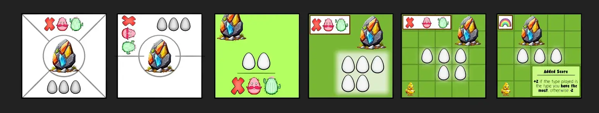

If this generation went well, we now simply have a grid where each square remembers exactly what should be inside. To draw it, we just loop through all the squares and listen to that.

This _should_ create tiles that are very dynamic (visually), while ensuring nothing gets in each other's way and everything has its own space on the tile.

{}
I also decided to do this because I didn't want the slot icons to be too close to each other. In case people print on a slightly different kind of paper, or they don't want to cut out the actual eggs (only their square token boundaries). With this new system, slots are inside their own square, so they'll always be far enough apart that any token size should be placeable.
{}

The actual grid lines might show faintly on the final tile, or not at all. Depends on what looks better.

### The Final Material

As usual, I took a few hours in the morning and _made_ all the things I explained above. That usually means powering through a lot of data, code and organization.

In the end, the final material looks as you can see below.

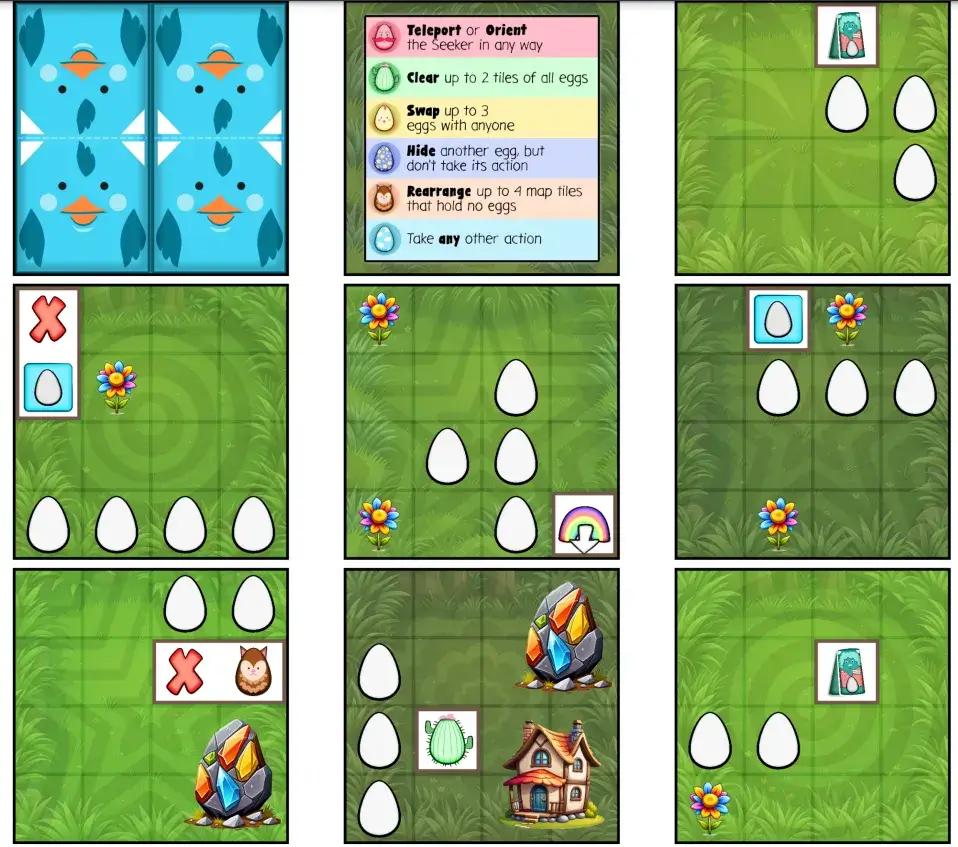

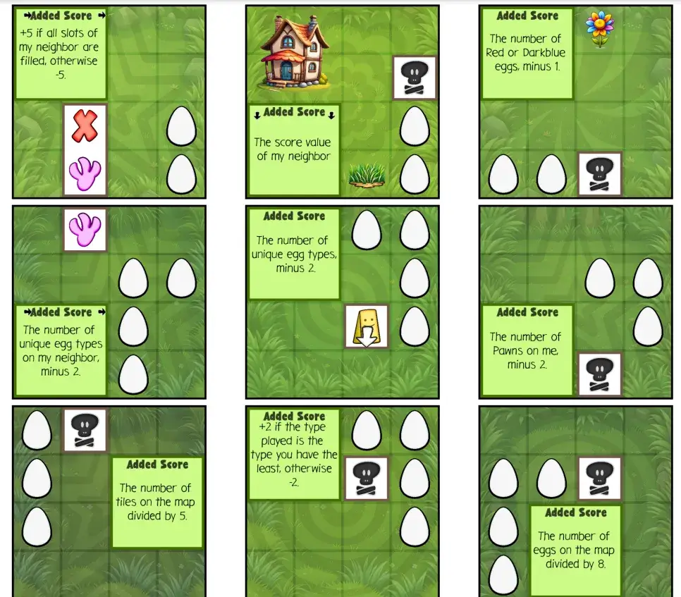

As you can see, with our dynamic grid approach we get endless _variety_ on the tiles, without ever running into issues. The tiles aren't overcrowded, nothing overlaps, simple symbols explain the restrictions on what you can or can't place.

Even with the expansion, this approach prevented any issues. So I'm happy I pursued it, even though it was a bit strange and required writing a lot of logic for that grid.

Also, you can see on the first image that I invented one more requirement (which I added to the base game): Seeker. The Seeker pawn symbol means that you can "place any egg here of a type the Seeker can currently see". This felt like a really simple rule that connected all elements of the game. I also wanted more restrictions that decided _egg types_ instead of just _you can or can't place here_. Because the first type is more interesting. (It's the difference between "oh, I can only play red and blue here because that's all the Seeker ees" and "oh, I can place ANYTHING here because this condition is met!")

You'll also notice these look slightly more raw/less polished than my final tile sketches. Again, I was very sick at this time and left optional visual polishing for later.

### Playtesting & Polishing

Alright, this game mostly worked but needed a few crucial tweaks.

**Issue #1: Egg Actions.** The fact that 1 egg allows you to "take any other action" is just too overpowered. I kinda saw that coming, but wanted to "try-and-see-what-happens" anyway.

However, if we simply give this egg no action, we obviously create the same problem in the opposite direction. Then this one egg becomes the one nobody wants to have, because it's underpowered.

So I needed to find a unique _replacement_ action. During playtesting, players consistently mentioned only one thing they disliked: being stuck with an unfortunate combo of eggs and map, which meant being unable to do anything for several turns. They felt like there should be some way to buy, replace, modify your eggs OR a much more direct way to modify the board.

As such, I saw the following options for the new action:

* Swap 2 eggs of yours with eggs on the board (ignoring all restrictions).
* Look at the top 5 tiles in the deck and add 2 to the map. (Or _replace_ 2 on the map.)

The first one turned out more useful, especially for the base game. It allows you to get rid of some terrible eggs that currently fit nowhere---exactly what some players wanted sometimes. (The other idea was moved to one of the "alternative starting tiles" in the expansion.)

Other actions were also slightly modified.

* "Teleport and orient the Seeker in any way." => "Teleport OR Orient the Seeker in any way."
* "Clear up to 2 tiles of all eggs." => "Clear 1 tile of all eggs"
* "Swap 3 eggs with anyone else." => "Swap 2 eggs with anyone else"
* "Rearrange 4 map tiles that hold no eggs." => "Rearrange 3 map tiles without eggs; Pawns move with them." 
* "Hide another egg; don't take its action." => "Hide another egg on the same tile; don't take its action"

As you can see, these are just small tweaks based on how powerful the actions turned out to be. For example, clearing 2 tiles with one such egg just means the board is constantly emptied, reducing the need to explore and add different tiles. Which isn't fun.

**Issue #2: Map Space.** My original map started at 3x3, which turned out to be too large. (Way too many options at the start, meaning players already lost half their eggs before the game really kicks off.) I reduced it to 2x2.

Similarly, the tiles have a little _too many_ egg spaces right now. They can have between 2 and 4 spaces, which means the average tile has 3 spaces. Playing with 3 or 4 players, that means you might just end the game with _only_ a 3x3 board.

Instead, the code changed to ...

* Allow 1-egg tiles if it makes sense for the action. (An action such as "each egg on this tile must be different" doesn't make sense if there's only one spot, for example.)
* "Weight" the probability of each number to slightly favor lower numbers.
* Also weight probabilities to create more tiles with an arrow, depending on their neighbor.

It's a small change, barely noticeable on the outside, but it makes the entire game much tighter. You're forced to explore more and you can't just drop 4 eggs on a favorable tile with ease.

Finally, the best way to keep the map small and contained is of course to impose a **maximum size**. The map can be at most 5x5.

**Issue #3: Move Seeker OR Place Egg is too slow.** This turns out to be a recurring problem. I try to give players tough decisions by making the core of the game an "OR": you either do A or you do B, never both. But in this game, like with Reggverse Riddles for example, this just means you feel _too_ constrained and _too_ limited in what you can do.

So, the rule changed to allow both. Both are optional, though. (Conversely, the egg actions were "optional" before, but now they're required too.)

Why? Because this helps balance the new rule.

* On your turn, you move the Seeker (optional) and then place an egg (optional).
* Movement: either move the Seeker in a straight line OR rotate them. (As usual, going off board means a new tile is added.)
* Placement: if you did **not** move the Seeker, take the special action of the egg you placed.

So you _can_ move the Seeker and place an egg, but you won't get the egg's action. Playtesting has shown those to be valuable enough to make you think twice. 

Similarly, the testing showed that _moving_ and _rotating_ should really be separate actions. Being allowed to do both, rather freely, is just too powerful and means you can never predict where the Seeker will end up. (They just zoom around the board all the time.)

With all these tiny tweaks (to rules, tiles and generating code) the game is _much better_. Turns are more useful and dynamic, actions are balanced, the map is tight enough to force smart moves and have players get in each other's way, my playtesters are enthusiastic---I'm calling this game done.

## The "Other" Game

More Easter games were planned. Not board games, but video games. I had figured out my own streamlined system to connect smartphones to a computer, so everyone could play by just logging in their smartphone. (Like the Jackbox games, if you know them.) Most importantly, I had found a way to do this all for basically free on my own server. Which I'm using anyway, to host all my websites and especially the game studio website.

Obviously, I wanted to use and refine that system! A very simple game about finding eggs seemed a great start. 

* The computer would just randomly hide eggs in a randomly generated map.
* And each player would move around + find eggs using their smartphone.

However ...

This isn't actually a game :p

The _fun_ and _challenge_ from the egg hunt, in the real world, comes from ...

* The complexity of the real world. Even in one garden or one home, there are near _infinite_ ways to hide eggs. You can get creative with it. You can make them easy to find, but hard to reach.
* The one _hiding_ them is also important. Usually, you try to "get into their head" to predict where they might have dropped eggs.

All of that falls away if it's just randomly hidden eggs on a tiny, limited computer screen. Because the screen is shared---it's for all players, and everything must be visible at all times---we are severely limited in how small everything can be and how many hiding spaces there are. Because the screen is flat and I'd need to employ a very barebones physics system (to make sure it's playable by all), I can't do anything fancy to simulate the complexity of the real world.

What I described above would just be a walking simulator where the luckiest player (spawning closest to the eggs) wins.

So I thought, and thought, and thought about ways to spice it up. And, sure, I found some!

* Make searching a seperate, costly action. So you can run around quickly, but need to collect "flashlight" powerups (or whatever) and press a button if you actually want to search. If you do, you stand still and can only rotate your flashlight around you. (Which is the only way to see the eggs and collect them.)
* Eggs are hidden following a secret "rule", such as "all blue eggs are behind a tree or a rock". Over time, you can figure out that rule and be smarter and smarter about how you search.
* The map also has "enemies" walking around. If they touch you, you lose all eggs collected so far. (They only become permanent if you visit some "home base" with them.)
* Divide the players into teams. The Hiders first _hide_ the eggs (using the map on their phone; the shared computer screen obviously reveals nothing). Then the Seekers go search.

All of this would work, probably in some combination and after some finetuning.

But it's also way more complicated than the original idea. It would take far more of my time and stop this from being a nice "first testing game" of my new and unproven system. Easter being less than 2 weeks away, I decided **not to pursue this**. I knew I'd just overwork myself, get frustrated, end up with something half-baked when Easter came, and it's just not great.

I'll probably try this some other time, like Easter next year or the one after that. Hopefully, that system of mine has already been battle-tested by then, and I'll have figured out the formula to making virtual egg hunts fun by then.

## Conclusion

Sooo ... what started as "can't I make a simple game for next Easter", turned into _five_ Easter games. (And as you know now, this could've been more, if I had just a little more inspiration left for the digital games.)

I ended up re-ordering the games. After making them, playtesting and polishing I realized some games were actually much harder to grasp than I imagined, and some were much easier. The "number of rules" or "amount of material" actually isn't a great indicator of a game's complexity. 

For example, Bunny Bidding is now one of the harder games because of the tiny exceptions and extra rules I had to add. As I state on its page, the rules are very "exact"---almost mathematical---which just won't suit some people who aren't good with numbers. At the same time, Chicken Colorout was moved before it because of how consistently simple the core mechanic is---the fact there are 5 unique requirements for tiles doesn't actually make the game much harder to learn.

The final "recommended order of simplicity" might still change, but I think it's as solid as can be now.

All of these games were made in just under 3 weeks. Sometimes, I'd work on two ideas side-by-side, mostly because I wasn't motivated to do some part of one idea, so I changed it up by already starting on the next. But most of the time, they were made one after another.

All this time, I was also very sick. Some pretty tough virus went around our household (and our entire town, apparently) that kept me barely able to work for exactly those 3 weeks.

This has caused me to take some shortcuts. Use a slightly less pretty or balanced approach to things, just to get them done more quickly with a head that's about to explode. I was worried this would turn all the games into shoddy attempts, but it actually worked out well. Taking those shortcuts also revealed ways to simplify the game, or just that my original thinking was needlessly complicated.

Still, my _todo_ document contains a few notes per game about improvements. About half of them are about graphics, the other half about tiny rules tweaks to test or how well the material is generated. (Also, I removed a few ideas for expansions because of the time constraint.)

In the end, all these games are pretty good. They are totally different, while being able to carry the same theme (Easter / egg hunt), also visually. They are simple to explain and can be played with a family, but each has one or two twists that give it way more depth than just "look for the eggs and hope you get lucky".

As stated, I'll probably revisit the project next year. I'll try to do one or two digital games, and implement that list of "polishing todos" that's left. This ended up being such a big project that it feels weird to just drop it all at once come Easter, so I already planned to drop it ... "again" the year after that. 

(I'll probably "keep back" the one or two least polished games to release them a year later. Yes, this might be a weird strategy, but I have to somehow refrain myself from releasing too much at once. I keep overwhelming people with new stuff otherwise, and I also overwhelm myself with work by moving the goal posts all the time. If _five entire games_ doesn't warrant a two-part release, then I don't know what does. Before you know it my brain has decided that _every_ release has to be 3+ games, and that's just insanity :p)

As always, you can play the games (for free) on my game studio website. They're all collected under the banner of "Easter Eggventures", which is just an overview page that links to the individual games. Creating that page already at the start was actually super useful: it forced me to write a one-sentence explanation of each game and sort them based on complexity. This helped structure the rest of those 3 weeks of work very well.

That's it for this devlog. 

Until the next devlog, keep playing,

Pandaqi