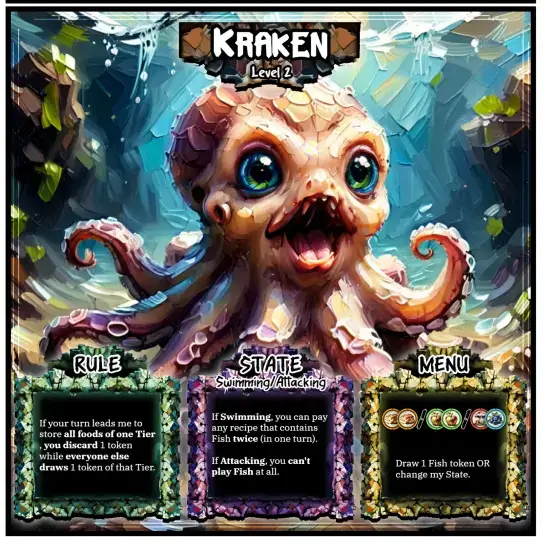
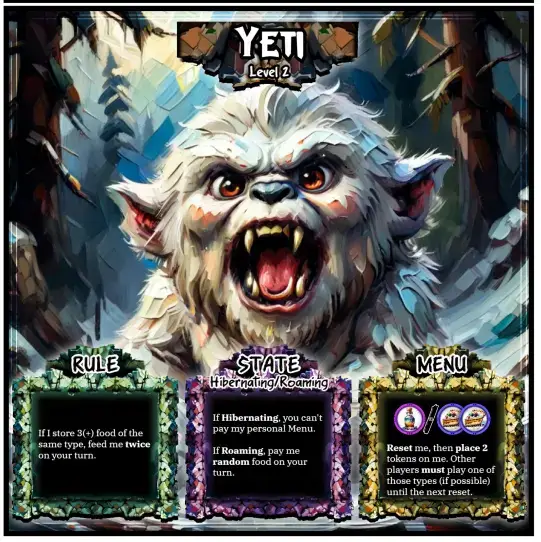
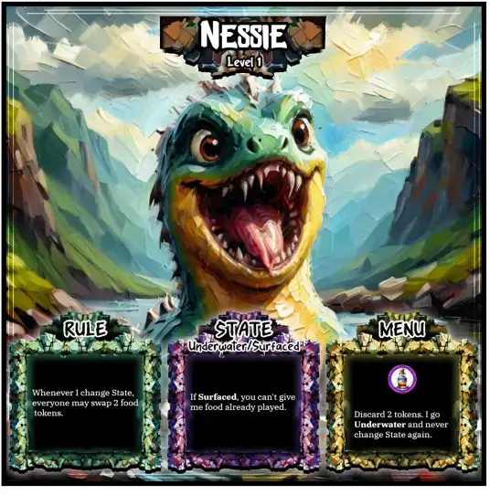

Welcome to the devlog for my game [Feed the Beast](https://pandaqi.com/feed-the-beast)! In this article, I keep track of the entire process from start to finish, talking about interesting problems and how I solved them, and anything else that's relevant. Hopefully it's interesting or instructive!

## What's the idea?

When planning the next few books for my book series (_Wildebyte Arcades_), one of the games I wanted to "parody" was Pokémon or Monster Hunter Games (yes, that's a subgenre) in general.

My mind was filled with thoughts on _how_ to turn that into an interesting story as I went to bad. That's probably why I woke up with the following game idea:

> Players start with random food tokens. There's a beast in the center. Each turn, all you do is _feed the beast_ (one of your food tokens). The first one to get rid of all their food wins.

This felt like a really simple, intuitive core loop of the game. Each round, place one food on top of the beast's mouth, this _triggers some consequence or something_, and the first to get rid of everything wins.

{}
In this vision, the food tokens are of course small chips, while the beast is a _much_ larger illustrated tile.
{}

This idea is, of course, way too vague and unpolished. Now I needed to turn this into an actual _game_. Based on my experience making 50+ games before this one, I immediately added these "requirements".

* Your **starting hand** ( = the food you end up starting with) should not allow some players to just be "lucky" (and win). That is, all food must be equally valuable, just in different ways or when used differently.
  * So, **no** "poison food" (ALWAYS BAD) or "this food always lets you play 2 tokens per turn" (ALWAYS GOOD)
* We need to create **variation** in how much food players have, otherwise the first player obviously wins every game :p There are two ways to do so.
  * BEFORE = Some rules that restrict which food you're allowed to play (or when you may play food at all)
  * AFTER = After playing a certain food item, there's an action/consequence (such as "play ANOTHER token this turn")

## How to make food equally valuable?

### Solution 1: Unique Beasts

The game should come with a set of (~10?) unique monsters, which all have slightly different rules or preferences. One game, carrots might be slightly more useful, while the other beast gives slightly better actions to meat. 

Most importantly, this should be _discovered_ while playing (and finding the optimal strategy), not clearly stated. I should invent rules that clearly make each beast distinct, without writing something obvious like "you may play 2 carrots at once!" (which clearly makes starting with carrots an easier game for you).

### Solution 2: Recipe Cards

On top/below the monster should be a recipe card. This one actually states _what the monster eats_ and _what you get in return_.

Most importantly,

* A huge part of the game has to do with _switching_ the recipe cards for others. (Maybe the beast _currently_ doesn't eat carrots, but you can take some action to swap for a recipe card that _does_ allow it.)
* This changes how food works per game/round even more.
* By writing this on the recipe, players don't need to remember anything. (Such as "a carrot always gives you action X")

Also, I want to support _multi-food recipes_. Not sure if I'll use them, but it would simply mean you must play a specific _set_ of tokens to get a certain reward. The biggest reward here is getting rid of multiple tokens in a round, so the reward should be small.

### Solution 3: Balanced Actions

As alluded to a few paragraphs earlier, the **actions** you get from playing food should be balanced. They shouldn't be 100% good or 100% bad. It's a bit of give-and-take, a bit of risk-and-reward.

For example, "you may play 2 carrots at once" is definitely 100% good. We can change that to something like: "You may play 2 carrots at once, but if you do, skip your next turn." Now it's an _interesting choice_ that some players might take (when it's a wise decision) and others might not.

### Solution 4: Progressive Food Tokens

This is the one about which I'm most uncertain. It feels perhaps more like an expansion.

Anyway, the idea is that food tokens are clearly separated into a "hierarchy". Players only start with tier 1 food (randomly distributed). But tier 2 and tier 3 foods most be _acquired_ during the game, while they give you much stronger actions in return.

This way, the game becomes more about using the food you start with to get _better food_ (which you choose yourself) as quickly as possible. Everyone starts roughly on equal footing, then diversifies _by choice_ into different tier 2 and tier 3 foods.

Playtesting will have to reveal if this is a good idea for the base game or not.

## How to create as much variation as possible?

This is the reason why I insist on dealing _randomized food_ at the start, and refuse to change that rule :p

* It makes setup incredibly easy. ("Grab food tokens, deal each player 10, done.")
* Right from the start, players are forced to play in varied ways and take varied actions, simply because their tokens _are_ their actions. And everyone has different ones.

Because I won't budge on this one, however, we need "support" this variation with some smart rules around it.

We've already taken care of the "BEFORE" part. Recipe cards + beast rules determine which foods you're even _allowed_ to play. 

I had an additional idea for a "sleep mechanic": the beast regularly falls asleep, which changes what you may play or how playing a food works. But this also feels more like an expansion or a unique mechanic only used for 1 beast.

Now we need to take care of the "AFTER" part. What kind of _simple actions_ could we attach to playing a specific food token? What rules or properties of the game could we _tweak_ to create strategy and variation?

* Recipe (switch, reveal next ones from deck, ...)
* Tokens (swap food tokens with new ones, steal from others, get more, get something from the _next tier_, ...)
* Play (take another turn, play another specific token, skip a turn, change turn direction, ...)
* Force (force another player to do X, or forbid them from doing Y, ...)
* State (change something about the beast's state---such as that "sleep" mechanic---from now on)

Because you can't decide which food you start with, you _should_ always have a say in when or how you use them. As such,

* Actions should be balanced and usually provide a CHOICE even after taking it. (Example: "Steal a token from another player" still allows you to pick WHICH other player and WHICH token.)
* You should, on average, have a few possible moves. Instead of being forced to do the one thing you can do, or being unable to do ANYTHING and wait until others change things.

That second bullet point was one of my final two "gripes" with the idea. The final issues that reared their ugly heads.

* **Issue 1:** if you can only play food from the recipe card ... but only changing food _allows_ you to take the action "switch the recipe card" ... then once you can't play anything, you're stuck doing nothing forever! Placement is too restrictive and obstructing now.
* **Issue 2:** if food always does the same thing, the game has no sense of progression or dynamics. Only "state" actions change something permanently for all players now.

Let's solve those.

## How to always keep momentum and options

After brainstorming some options, it became clear to me that there should _always be the option to pay the "wrong food"_. At any time, if you can't pay something the beast wants, you can _choose_ to pay the wrong thing.

This ensures you can always play. This ensures the game always moves forward, no matter what crazy expansions/actions/whatever I imagine. This ensures recipes and food tallies will constantly shift and change the dynamics.

But, of course, this needs a balancing factor. You still need to be punished (or at least not rewarded too much) for playing the wrong thing.

> Every beast has a unique "wrong food" action. When you give them something they don't want, they grow angry and take it out on you.

This should usually be a slight punishment just for you. But in expansions, I might create situations in which you can punish your neighbors too or the whole group.

For example: 

* (SELF) "Wrong Food? Draw 1 extra food token."
* (ALL) "Wrong Food? You draw 3 extra food tokens, everyone else draws 1."

This approach also gives an incentive for other players to actually _help_ you. Depending on circumstances, they might **not** want you to run out of "valid food", because they don't want the bad stuff to occur.

{}
Very powerful, negative or "take that" actions are really fun ... but not in the base game. When people play the game for the first time, they don't understand it well enough to properly use or defend against such actions. Which either makes them worthless OR makes players annoyed at how many minus points/bad stuff they're getting all the time.
{}

## How to make the game progress and give actions consequences

As said, the "state" actions already help here. Each beast should have a unique rule about a "state" it can be on (turned on or off by giving food).

But we have something even more powerful! **The food played thus far.**

I felt like we needed one simple "core rule" that depended on this. Because recipes are so important, I decided to make it this one.

> Once the beast holds 10 food, the current player switches the recipe card for a new one. Also remove all the food from the beast. (This has the benefit of keeping play organized and the number of tokens small.)

Besides that, the actions (or unique rule twists) should often depend on the specific food played thus far.

For example,

* "Swap as many tokens as (# on beast) divided by 3."
* "You can't play type X if the beast already holds 3 of them."
* "If the beast doesn't have this food yet, play a second token (without taking its action)"

The game shouldn't overdo this. As you can see, it makes actions slightly more complex, or their text longer at least. But using this ~30% of the time should make earlier choices have a real impact on later possibilities.

Now I felt like I had everything. I'd considered many options, streamlined the rules, gone over the typical "issues" with games (like this), and hastily did a very rough playtest with some pieces of paper. It won't be perfect, but it's good enough to get started on the rest of the project.

## So, what do we need?

We need ~10 different types of food: 5 Tier 1, 3 Tier 2, 2 Tier 3. (Or some slightly different distribution; this is easy to change after making and testing the game.) These are just small tokens with an icon + a color, nothing more. 

{}
We _certainly_ don't want to add any extra symbols, text, or whatever to these. Would be a complete mess and overwhelming.
{}

We need ~20 Recipe Cards. These will hold ~3 recipes that simply have a token on the left -> action reward on the right.

We need ~10 beasts. The majority of its tile will be a detailed illustration of the beast. On it, in big legible text, should be these properties.

* **State:** what it means to change state on this monster. (Sleep/Wake? Angry/Calm? Smart/Dumb? + the corresponding rules change of course.)
* **Rule:** its permanent rule, tweak, unique mechanic, whatever.
* **Permanent Recipe:** a token -> reward you can _always_ pay, just printed on the monster. This kind of consistency will be nice and really make the beast unique. This will **always be a tier 2/3 food**, otherwise we undo all our work to make all hands equally valuable!
* (**Reminder:** if this fits, just an overview of the game rules. Or even an empty space to store tokens.)

During setup, you only deal out basic foods. The others can be bought over time using those basic foods. (When "swapping" a food token with one from storage, it should always be the same tier, I guess.)

Lastly, I envisioned a few expansions or variants.

* Beasts that change other core properties. Such as how much food they can store: "With this beast, you switch recipe card after 7 tokens already."
* A fail condition: if the players mess up too much, or work against each other too much, they _all lose_ (and the monster wins).
* "Princesses to save". This whole idea started with that cliché/trope of a monster guarding some princess in a tower that needs to be saved (the princess, not the tower). I wanted to parody that. How?
  * I'd add an extra deck of cards with all sorts of people who might be in that tower (boys, girls, princes, ogres, dwarfs, a mirror, whatever)
  * After paying a specific cost, or achieving something that takes effort, you **save** one of these locked up people!
  * You get the card and whatever curse/ability/rule it has.

Especially the last one feels like a great addition to the game. Something that might even move to base game if it's as nice as I think it is (and doesn't add too many rules/setup). But let's not get ahead of ourselves and make the base game first.

## Let's make that!

### Generator

First, we need to generate our material in code: a list of objects with the right properties. (For example, I'd create a `Tile` object that remembers which food token it's supposed to be.)

Because, once we have this list, it's very easy and clean to just feed it into the next system that actually _draws_ them all and lays them out in a nice grid (in a PDF).

For the most part, this is nothing special.

* Loop through my list of possible food and create each token X times.
* Loop through my list of possible beasts and create 1 of each. (The actions and rules of a beast are manually designed by me and attached to their data, so no more generation is needed.)
* (EXPANSION: Loop through my list of possible "locked up victims" and create X of each.)

### Recipe Cards

When it comes to **Recipe Cards**, however, more work is needed.

If we just pick random recipes, we might end up with 40 cards that ask the exact same thing, and other food tokens that never even appear :p Or the expensive Tier 3 foods appear way too often, locking the game.

So we need to draw random tokens and rewards for each card ... but also balance those numbers.

Here's what I did to ensure balanced **food tokens**.

* Define a percentage for Tier 2 and Tier 3 foods. Before doing anything, it predetermines a list of random recipes where these foods will appear. (For example, if the game has 50 recipe cards, and Tier 2 appears 10% of the time, then it will already pick the 5 exact recipe cards where a Tier 2 food will appear.)
* Loop through all cards, add the predetermined foods, fill up the gaps (which is _most of the cards_) with Tier 1 foods.
* When drawing a new food, however, use my "Balanced Picker" code (that's already in my website).

The "Balanced Picker" allows defining a maximum "difference" between types. Whenever you request a new type, it picks from the _least occurring_ types so far. (For example, we've already had 5 fish, and only 1 apple, and the max difference we allow is 3. Then the next thing we pick will be an apple for sure.) With enough retries---enough cards---this will create a random but fair distribution over all possible types.

Crucially, each "tier" has its own picker. Because Tier 2 foods _should_ be more scarce than Tier 1 foods, so we don't _want_ them to match frequencies.

As for the **actions**, we need a different approach. Because the _cost_ (expressed in food tokens) determines the _possible actions_ we can attach to it. A Tier 2 food should have a stronger action than a Tier 1.

As such,

* I created a list of all possible actions.
* Then assigned their "cost" or "value". (This is more future-proof than assigning their exact tier. For example, if I do add multi-food recipes, we can now say: BREAD (1) + BREAD(1) = an action of roughly value 2.)
* When we pick an action, we collect _all_ options that match the value of the food tokens. Then we pick randomly from that, though different actions can have different probabilities if I want.
* (And we forbid this option entirely so it's not considered again later down the line on the same card. We don't want 2 identical actions on one card.)

### About multi-food recipes

I decided to code support for this anyway, as I was coding the above.

The implementation is rather simple.

* Whenever we draw a recipe, we call the `createMultiFoodRecipe` function and give it our highest _tier_ (and the list of balanced pickers)
* If multi-food is not enabled, we just return the first food and are done.
* If a probability check doesn't succeed (as in, multi-food only appears ~20% of the time), we return the first food and are done.
* Otherwise, 
  * Keep adding extra food from our current tier _or_ those below it. (Never of higher tiers, as that makes the value balloon until no action is strong enough to be worth the cost :p)
  * Until we've reached our maximum size (3 food per recipe) OR we've hit that maximum value (above which no action exists anyway).
  * Return the result

This doesn't "guarantee" anything. A deck might have only 5% multi-food or as much as 30%. But by picking them this way, they are never worthless or too overpowered, so any frequency of multi-food recipes works fine. In practice, this means that once in a while a card has 1 of them, which is an interesting opportunity to get a strong action for relatively cheap---and that's it.

I'll make it a setting you can turn on/off when generating your own material.

### Drawing the cards

Now this was the real meat of the work. We have 4 different types of material (a rare occurrence, especially for me) and they are all heavily illustrated.

* The recipe cards have 3--4 recipes on them, which means they must be nicely sized, aligned, centered, including their food icons + action text.
* The beasts, similarly, have 3--4 rectangles overlaying the main illustration that include all their details.

As usual, I sketched possible looks in my design software first, to get 90% of the way there. Once I was satisfied with that, I tried to transfer that to _code_ to generate these on the fly. (Which usually reveals a few things that need to change, or opportunities for improvement, but otherwise is mostly a 1-to-1 copy.)

Below are those first sketches, which even included different fonts and such. As I explain below, I really struggled this time (oh and my laptop crashed twice) which is why the sketches are far from "finished".

My biggest issue here, actually, was that generative AI made illustrations that were too ... detailed? Too aggressive? They are pretty and work fine, especially because I steered the AI in the right direction (in terms of style, tone, color, etcetera). But ... I can't help but feel a more simpler, cartoony, heavily stylized look would fit this game better.

For now, I continued with what AI gave me. (As it's "only" ~2 hours of work to generate > edit > prepare all the illustrations.) But I'm very tempted to create a second set of images that is completely hand-drawn and far more stylized than this. We'll see.

{}
I also had a bit of a struggle with fonts. I wanted a "rough, grunge" font to simulate the theme of beasts and danger. But many of them are nigh UNREADABLE. And if they _are_ readable, that's because they're actually very clean and not rough at all. It took me a while to find fonts that were clearly rough and chaotic, while being thick and legible at all sizes.
{}

### Design leads to gameplay changes

As you can see in the sketches, I also realized we really only have space for 3 "properties" (or "boxes") per beast. Add more of them and the layout become cramped, you obscure the illustration, there's no good place to store the food tokens, etcetera.

That's why I decided to make **FURY** (what happens when paying wrong wood) and **FAIL** (a fail condition that, if triggered, makes the monster win) were optional and only occurred on some monsters. Being optional and of "lesser importance", I could also make these sections take up less space visually.

This meant I needed a "default rule" for when you pay the wrong food (for all basic monsters that have no special FURY). After trying a few things, the most sensible one was ...

> _Either draw 1 food token (Tier 1, from supply) OR skip your next turn._

This still gives you a choice---always nice---and between things that are similar but not the same. But both of them are surely a _penalty_, to prevent rewarding players too much for just playing random wrong food.

I had also created a list of "beasts" to include in the game (based on famous monsters and mythology). But when I asked AI to generate that, and turned them into complete cards, I noticed there was a subset of beasts that looked "somewhat human" (such as vampires, mermaids/sirens, etcetera) ... which just felt _really weird_. A game called "feed the beast", about sacrificing lambs and what not to some monster, feels _really weird_ when that monster looks almost like a regular human being (just scarier, more horror-y).

So I modified the list to only include actual _beasts_ and clear _inhuman monsters_. (This is also a reason why it feels like I should just create stylized images myself.)

Finally, the word "Recipe" is not really correct (it's a set of recipes of which you choose one). The word "Menu" is better (and shorter! always nice!), which is why they are now "Menu Cards".

## The Details of the Beast

This was the final step before I could playtest a "mostly final" game with others. I needed to actually provide the detailed actions and properties for beasts.

Without playing the game with others (yet), it can be hard to imagine what would be interesting twists that are easy to understand for new players. 

That's why I rank the beasts (from level 1 to level 5), so new players can simply pick a "level 1" beast which has the simplest properties of them all. Additionally, I can make sure level 1 beasts _help_ the players more (to make decisions, to understand the game, etcetera).

In practice, this means something like this.

* The easiest monsters have simple one-liners for all these properties. (No multiple sentences, no conditionals, etcetera.)
* Their rules give a regular benefit or easy way out, such as "whenever I reset, everyone gets a higher Tier food token for free"
* Which is offset by another rule that restricts part of the game, such as "when my state is X, I don't reset"

Only giving benefits quickly proved to make the game, well, too easy and not so much of a game. Only restrictions is obviously the other extreme. Combining RULE + STATE + MENU to give a few bonuses, but also a few restrictions, makes the beasts balanced (as far as I can tell now).

And it's always easier to think of more complex mechanics than easy ones, so I had no trouble inventing more difficult monsters ... and moving many of them to the optional expansion monsters ;)

As stated earlier, the AI illustrations (and the inherent nature of certain "monsters") can be a bit aggressive, which is why I purposely moved all the "cute" or "less terrifying" monsters to the base set. These should be safe to play with kids (both in terms of visuals and complexity).

At this point, I also coded support for "EITHER OR"-recipes: you have multiple options and only have to pay one of them. And I coded support for the REWARD to be an image instead of just text, which is useful when the reward is simply "Get 1 Fish Token" or something.

These are small details that don't take that much work in the end---though it's boring work having to rewrite parts of code you've just written, I'll admit---but give much more freedom when implementing cool ideas for the game.

And indeed, once I'd programmed the "OR" recipes, and the possibility of multiple rewards (which could be text OR food icons), and automatic resizing so it always fit within the bounds (no matter how small/large the recipe was) ... I used all of these features extensively when designing the beasts!

{}
There's one beast that is all about the NUMBER of tokens on them. If above or below a certain level, you must/can't play stuff. If they ever reach X tokens, they instantly win (and everyone else loses). As such, their personal Menu has an easy way to drastically change the number of tokens in the game---in both ways. You either pay a lot of tokens to get only 1 in return OR you pay only 1 to get a lot in return.

I could only invent this _because_ I knew the system could easily display multiple sets of icon options, both on the cost and the reward. In the data it's literally just a list containing lists of the specific food types.
{}

The _final_ change I made was the addition of a _token_ to track the beast's state. Even though it won't change that often and it's easy to remember this _single thing_ during the game, I still like including a token that you can _flip_ whenever state changes. To prevent _having_ to remember it and to prevent any discussions about it.

I generated a SUN and MOON icon (which I think is the most inutitive, easy representation of a system with 2 opposing states), put them on a unique token, and also placed them on the "State" rectangle by default to reinforce this.

(Though you'll notice, in the code, that this was a last-minute addition. It's not coded cleanly, just as one-off exception somewhere.)

## Simulation

### The first attempt

At first, I didn't want to to a simulation. I thought all the different rules and possible rewards (on the changing menu cards) would be way too much work to code. (And in such a simulation, the players just do "random moves", which can skew the results a lot compared to "smart human players".)

But in the end, previous simulations had always yielded great insight and prevented lots of issues before even printing the game. So I did it anyway!

After a few hours of non-stop coding, the simulation could play random games (with random turns), following the game's rules and the rewards for paying recipes (or the penalty for paying the wrong food, of course). And it could track statistics about all of that.

This revealed the game, as is, **did not work at all**.

* The probability of being able to pay "good food" was only ~35%. (So on 2/3 of your turns, you couldn't even follow any of the recipes and had to take the penalty.)
* This meant that the game took waaay too long and mostly consisted of skipping turns. (At this point, the penalty for paying the wrong food was "skip a turn" OR "draw 1 more basic food").
* The most powerful actions---especially those on the beast cards---are always expensive, but the average number of tokens upgraded (to higher tiers) per game was only ... 0.5. In practice, this meant the higher tiers weren't used at all and only the same basic actions were repeated over and over each game.

Through all of this, the major bottleneck was the _number of food tokens_. It constantly ran out, making it impossible to draw/swap/upgrade tokens, and ruining the numbers even more. As such, I basically doubled the frequency of each token, as that turned out to bring the times the supply ran out (over thousands of games) to just a handful.

### The second attempt

I tried many different changes.

First, two solutions that were "meh".

* Reduce the variety in food. (Which makes it more likely you can pay something, because you're more likely to have 1 out of 3 possible food types than 1 out of 5.) => This helped, but ruined the game in other ways, as there was too little variety between players/recipes.
* Start with some upgraded tokens / make upgrading incredibly cheap. => This helped too, but not as much as needed. The issue was that the core of the game didn't generate enough upgrades automatically, so something at the core needed changing.

Now the actual solutions.

First of all, this game has always had a few core actions: change menu, play a second token, change state, force another player to do X. These directly modify the core rules of the game and are the simplest ways to create strategy.

When I checked their values/probabilities, however, I noticed some of these were quite expensive (you needed Tier 2 foods to use them) or had a low probability. 

As such, the first change that helped considerably was to **make all core actions usable with only a Tier 1 token**. These actions appear the most and are the cheapest. This ensure you _can_ often do one of them, and the action you get in return is certainly something _impactful_.

Secondly, I needed a change in the core rules. We were skipping turns far too often. And the other "penalty" for wrong food---just drawing another token---meant games could go on for 300 rounds because nobody actually made progress. 

(At some point, I started cutting off games above 100 rounds, to speed up the simulation. But this showed that nearly 40% of all simulated games were "endless games" in the first version. Which, erm, isn't great.)

I changed the rules to something that made more sense, now that I'd seen the data.

* If you pay the wrong food, you **downgrade** a token OR draw a new Tier 1 token.
* If you pay the right food, you **upgrade** a token for free.

This made a huge difference, as expected.

* The probability of paying the right food is ~90%. (As such, probability of paying wrong food is ~10%.)
* The number of tokens upgraded per game now averaged ~30. (In a 4 player game, that means everyone will get roughly 8 upgrades, which is nice.)
* The number of tokens downgraded per game averaged ~1. (A bit on the low side, but alright.)

To nudge these numbers even more, I decided to remove the choice. You downgrade _and_ draw a new tier 1 token. This seems harsh, but the simulation shows this is better. Upgrading is now so easy/common, that downgrading should also be.

Some other interesting stats are ...

* Probabillity of paying the beast's special menu = 15%
* Number of Beast Resets per game = 2.5
* Number of Menu card switches per game = 4.0

Most of these numbers are still slightly off, but now at least the _base game_ (the "core") is very favorable to players. 

* You can usually pay good food and usually get nice rewards in return
* Games usually have a nice duration (~30 rounds; 7 or 8 turns in a 4 player game.)

And if the core works, it gives a lot of freedom to play around with the specific _actions_ (costs/rewards) to make them harder and more strict until I think the numbers are right. So let's do that.

### The third attempt

I mentioned introducing the possibility of multi-food recipes. These obviously make it harder to pay the right food: you're less likely to have A _and_ B than just one of them.

As such, I decided to turn this on by default, introducing loads of 2-ingredient recipes (and a few 3-ingredient ones). This already brought the probability of paying the right food to ~80%, which is a much more balanced number. 

{}
In my experience, after making so many games, you usually want the probability of "doing good" or "moving forward" to be around 70%, perhaps a little higher or lower depending on the game. This ensures that, on average, you're always moving forward and getting rewarded more than you're punished. But the game isn't too easy or too smooth sailing :p
{}

Then we move to the actions. With the game now being relatively "easy" (when it comes to paying food), I could introduce some harsher actions, and make them more likely.

* Forcing other players to play token X (or _not_ play token X), or forcing other players to skip a turn.
* When upgrading/downgrading/stealing/swapping tokens, do more of them.
* More harsh restrictions on playing another token.

Remember that the core actions of the game (such as switching menu card) are already frequent and doable with a Tier 1 food.

Generally, however, we had _too many actions_. Not all were equally fun or usable, while skewing the results by having the computer players pick _those_ instead of possibly more useful actions. (And random generation struggles to have them all appear as often as wanted, as there are so many actions and only so few spots to fill on Menu cards.)

* I removed any that I deemed too specific or too hard to explain/execute.
* I modified the existing ones to have harsher restrictions, depending on the game state.

This mainly resulted in the following changes.

* All "swapping" actions were combined into just one. Now that upgrading is so easy, and a higher-tier is a wildcard for lower-tier foods, swapping is the least useful set of actions in the game.
* All "play another" actions were expanded to provide way more different restrictions based on state of play. This is the actual core of the game and this is what should be modified all the time.
* Many actions appeared twice and one version would just be the "dumbed-down" or "less strategic" version of the other. As expected, only the _more_ strategic (and interesting) version remained.

Because the menu is "only" changed about 5 times per game, having too many different actions means games are quickly unbalanced. One game, the action to change the beast's state might NEVER appear. In another, it's almost the only action you have!

As such, even though I really liked many of my action ideas, most of them were removed (or reduced to appearing only ONCE at most).

The biggest lesson here, I guess, was learning how to _cut_ ideas in games with a random deck or randomized options. Because having too many options, even if they all make sense/are balanced, still makes each game "too different".

In the end, the actions were reduced to only the basics and that's that. Most special actions are set to only appear _once_, and the total number of menu cards was _halved_ (because you only see ~6 of them in a single game anyway) It made the game better, at least on average.

### The final polishing

When I made the interactive example (for in the rulebook, which visualizes a turn for the user), it revealed one final bug ... that was pretty crucial, unfortunately.

Long story short: when paying the wrong food, you didn't actually pay it. (You just received the penalty, but kept the wrong token in your hand.) Obviously, this is what made a percentage of the games take 150 rounds :p

When I fixed that, all games had a reasonable length without exceptions ... but it had also become a little too easy to win again.

In the end, I found a good balance with the following changes.

* When playing good food, you get a _choice_: you either take the reward OR you upgrade one token.
* I removed the upgrade _actions_ from the cards, except for a single one that is expensive (and appears only once).

All these changes meant your chance of playing good food was still high (~85%), but that's obviously more balanced than nearly 100%.

It also meant that the number of beast resets, menu switches and state changes per game were all ~5 on average. This is reasonable, given an average game takes 25--30 rounds. It means all these things happen at nice intervals during the game.

Most importantly, of course, all these simulations are _random play_. With intelligent players, who think ahead and try to block others, all of these percentages obviously shift for the better. For example, human players have an open market and can intelligently choose their next menu card to suit them (or oppose other players). This makes a huge difference in player's likelihood of playing correct/wrong food.

The simulation, as always, simply shows the most egregious mistakes, on average. Writing the code and iterating took roughly a day, but it completely fixed any oversights or wild imbalances in the game ... before even subjecting other humans to it :p

## Playtesting & Polishing

Pfew. As usual, a tiny idea that took longer to make than expected because of all possible issues and iterations. Still a very simple game, and now I have the final material with which to test and polish it further!

@TODO: write down playtesting results + conclusion