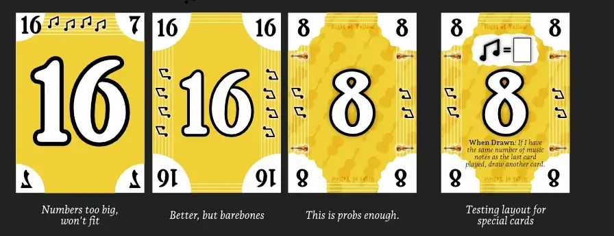

Welcome to the devlog for the game [Fiddlefoo](https://pandaqi.com/fiddlefoo/). In this article, I'll talk about the process behind developing the game, problems I solved, why I made certain decisions, and hopefully more interesting or instructive bits.

## What's the idea?

A while ago I stumbled upon a game called **Cabanga!** The premise is very simple yet very effective.

* There are four colors.
* Each color has two cards on the table (one left, one right)
* On your turn, you must place a card on the pile of its color, either left or right.
* This creates a _number range_. For example, the card on the left might be 5, and the one on the right might be 10. 
* _Anyone who has a card of the same color, in that range, discards it._ (And for each discarded card, you must draw a new one.)
  * For example, you played that Red 5.
  * Then another player has a Red 7---which is between 5 and 10---and may yell _Cabanga!_ and discard it.
* The game ends when a person is out of cards. Those who have cards get minus points.

As expected, it's a game about trying to create the _smallest_ possible range (or one you expect others won't punish you for). Simple rules, but a lot of emergent strategy the more you play it. (For example, it can be wise to play a "riskier" card now, just to draw out certain cards from other players. With those cards out of their hand, _they_ might be forced to make an even worse play.)

When I played it, I immediately had a few thoughts.

* Everyone forgets the extra rule of "If you play the same color as the previous player, draw a card", constantly. 
  * I can absolutely see why they added it. Such a simple way to make choices harder and sometimes make a good number bad anyway, because the previous player played the same color. But it's also a loose exception that players just _keep forgetting all the time_.
* You don't get the cards others throw away; instead, you discard those and draw equally many new ones. This means the game has quite a high number of cards. (Which makes gameplay quite different depending on player count. With only 3 players, it's very unlikely somebody has a Cabanga, just because _so many_ cards are stuck in the draw/discard piles.)
* Can we expand the idea to be a little more dynamic and varied? I don't like games with such a rigid set of piles or card placement. _Can we turn the idea into a shared map?_
* Can we expand the idea to be a little less reliant on luck or just getting a good hand? 
  * In some games, certain colors barely showed up. This meant you had absolutely no way to reduce the damage, and you had to just accept a terrible move at some point. 
  * On the other hand, if a color shows up _a lot_, then people will likely have numbers _in order_ and there's almost zero chance of "Cabanga"s. 
* Cards also show "diamonds". In Cabanga!, these are merely your negative points if you end a round with that. _Can we reuse them for other mechanics?_ (If we're going to add an extra element to a card, I really want to get the most use out of it as possible.)

And so "Fiddlefoo" was born. (I just wanted some word that was fun to shout and had the right vibe.)

I transformed the idea as follows.

* Cards are placed in a shared map in the center of the table. In other words, on your turn you simply play a new card adjacent to what's already there.
  * Besides a unique number, my cards also show those "diamonds" (or some other icon based on the theme I'll eventually choose) in the range of 0--4.
* You _must_, however, play a card in the same row/column as another of the same color. That's how you create that "range" between 2 numbers.
* Then we get that core mechanic: anybody who has a number within that range, throws it at you. 
  * You actually get these cards; there's no large draw/discard pile.
* Then we get the twists:
  * If the _distance_ between the cards is greater than X (probably 3 or 4), others do NOT give you any cards.
  * Instead of handing numbers within the range, you may also discard cards whose _number of diamonds_ is equal to that _distance_ instead.

Why did I _think_ this would be a good idea?

* Now we build a map over time (progress, momentum, a sense of ownership to a game) and the choice of where to place your card is strategic and interesting. 
* The amount of material needed is far lower, and we can still support player counts of 2--6.
* If you have terrible cards, you can still find ways to reduce the penalty if you place them right. (Plan ahead to make sure you can create a large distance when you play the card.)
* Similarly, you can get rid of those terrible cards thanks to the _diamond rule_. But it's a choice, one that you and other players can influence and manipulate.

## Let's test that!

I had some paper prototype cards left on my desk from testing another game. (That was "Death by Digits"; will probably come out around the same time.) All I had to do was add a fourth card of every number + write the 4 symbols (for the different colors) on them, then extend the numbers to range from 1--16. (Which was just a random guess, to be honest.)

Then I played the current rules and, as usual, discovered they were terrible.

**Problem #1:** 4x16 cards is still too much. Especially on low player counts, you'll have _most_ cards out of the game, and very little chance of "Fiddlefoo"s.
* Lowering that number isn't great. You _need_ a good distance between numbers to allow larger gaps.
* Lowering the number of unique colors also didn't work. Three colors made the map lopsided and uninteresting.
* So, instead, I decided to just make the colors _asymmetric_: some have more numbers than others. (For example, 3x16 + 1x6 = 54 cards, which is a standard deck and always a good target.)

**Problem #2:** What if you match _multiple_ cards of the same color (in the same row/column)? 
* My first idea was to just say "pick one of the ranges". But that's not a meaningful choice, as you'll always pick the smaller one.
* I tried to say "it's just not allowed", but that made placement less interesting. (You already have few options, and by disallowing multiple, the map will mostly be built in one long column instead of a somewhat square map.)
* The best solution was simply: "if you have multiple possible ranges, you must pick the largest one". (With less material, we reduce our chance of Fiddlefoos. So this rule is simple _and_ stacks the cards against the player, making every play more risky.)

**Problem #3:** We need some replacement for that rule I mentioned that everyone's forgetting. Something that makes turns _less boring/straightforward_ when you happen to have the exact number below/above another one. (Which would create a 0 range and no penalty for you, so always the best move.)
* The diamond rule, though, already helps here. Even if you place a 6 to match a 7, there might still be X cards between them, which means anyone can give you a card with X diamonds.
* But a simple rule that establishes the same thing---and more---is that "cards of the same color cannot be adjacent". This forces those cards to be spread out, is very easy to check and remember, and is always possible. No more "Red 6 next to Red 7, hey, nothing happens, easy turn!"

**Problem #4:** The diamond rule is currently a bit too powerful, though. Because there are only a few options for distance/#diamonds, you're more likely to be able to give away loads of cards on another player's turn.
* So, instead, let's change the rule to what I wanted to do anyway: "If you give away based on the diamond rule, you may only give away 1 card this turn."
* Also, let's make it **optional**. You're not required to give cards away. It is _usually_ good---because you win when out of cards---but sometimes you want to keep those cards to make your future turns easier.

**Problem #5:** Although we have little material, and most of it is in the hands of players, we can't give players _all_ cards. That was extremely overwhelming when I tried it. (There's also no way to fairly subdivide the deck over any player count.)
* Instead, let's say players begin with 7 or 8 cards. The rest becomes a draw pile.
* But then we needed a way to actually _draw_ cards. I had a few loose ends left, so this was a way to tie them off.
  * If your card placement is invalid (adjacent to same color, for example), draw a card. => This means you can _always_ play, but just get penalized if it's invalid, which should be very rare.
  * If you meet the distance requirement (your biggest gap is more than 3 cards apart), nobody else gives you anything, but you draw a card. => Drawing a new card is _usually_ less bad than letting other players throw theirs at you. But now it's a choice you can make strategically: do I risk getting loads of cards from other players, or pick the option where I get exactly 1 card for sure? 
  * (Also, the draw pile can be empty, in which case this penalty falls away and I'm absolutely fine with that.)

With these changes, the game flowed much better when I tested it against myself.

Always possible placements on the map, with different reasons for why they were interesting. On every turn, the _other players_ also remain active and involved, checking if they can lose some cards. And if so, _which ones_ they want to lose.

The simple rules about distance, diamonds, and not allowing adjacency (of same color) ended up solving another problem I had with the first prototype. 

As opposed to Cabanga!, players simply get the cards that others throw at them. It makes rules simpler and more intuitive, so I wanted to stick to that. The issue, though, is that this means the player now (guaranteed) has a few numbers close to numbers already on the board. So those numbers would be incredibly easy to play, right?

For example: you played a range of 1 and 5. Others gave you their 2 and 3. Now you have two numbers _really close_ to ones already on the map, so a few safe turns in the future.

Well, not so fast!
* You can't play adjacent, so _other_ players will have to help you out by building cards around that 1 or 5. Otherwise, you can't connect with them anyway.
* Others might have given you cards based on the _diamond_ rule, which might be completely different numbers or colors.
* You might want to _wait_ to get more distance for when you play those "safe" cards. But the longer you wait, of course, the more volatile/different the board gets.

I found, at least when testing it myself, that everything was neatly balanced. No numbers were inherently better or worse. There were always interesting choices, even on other player's turns. And my simplifications/streamlining of _Cabanga!_ had few drawbacks because of other changes I made.

Now there's nothing more to do than just make those cards and test with others!

## Let's make that!

Fiddlefoo brings to mind images of the _fiddle_ of course, of music and dancing. So that became the theme of this game.

* I found some nice fonts that are related to music/dancing. (There are fonts that more clearly have that theme, with their letters changed into instruments and stuff. But those are completely unreadable in such a context :p)
* The "diamonds" on the cards became music notes.
* The remaining decoration became common music symbols and textures, such as the lines from sheet music.

Besides that, all cards are just a big COLOR and NUMBER. (And, to aid the colorblind, a unique SYMBOL matching the color too.)

Very easy code to generate, very easy code to draw. Not much to say there.

As I developed further, I did start thinking about some variants or expansions.

* That "weird color" (with fewer cards) could be a _wildcard_. That would be _very_ interesting in this particular game.
  * In other words, this doesn't add new material---it merely recontextualizes the base material you already have.
* Perhaps some cards with special actions when played. This gives another interesting decision: the number on the card could create a _terrible_ range for you, but you want the action!
* Such actions would allow anything that currently isn't possible. (Swapping cards, discarding cards some other way, looking at other player's cards, moving card positions on the map, playing on top of an existing card, etcetera.)
* Perhaps a cooperative version? 
  * Next to the board, you're creating a faceup pile for each color.
  * Instead of "throw away cards at another player", you'd discard those cards to those piles. However, they must be added to _in numerical order_.
  * You win the game if, when all players have emptied their hand, each faceup pile holds between X and Y "music notes".

But I don't want to overcomplicate simple card games that _just work_. So I stopped myself here and thought that was enough.

You can see some general early sketches below.

After all this time, I'm quite good at finding fonts, and I also have a big library/backlog of "pretty fonts to use for a project of type X or Y". This quickly led me to a nice and readable serif font for longer text (such as actions on cards), and a classical-music-like font for the numbers and headings. I especially liked that this heading font was very _thick_, which always helps make things more readable and approachable in general.

(Nothing worse than trying to play a board game and people get demotivated right from the start because the _text on the cards is sooooo darn tiny_.)

I copied the colors of the _Cabanga!_ game, though with slight modifications. I added the musical instruments to add an extra way to identify cards. (Just color is not enough, especially to colorblind people of course.) I also added a written text of the card ("Two of Yellow") because ... I felt like it, but let's say it was a very informed choice to make it even easier to identify cards.

As stated, this was just a very tiny, quick, side-project. (I made it in side-by-side with the other game that will probably release on the same day: Death by Digits.)

This means that I ended up with a final, simple card design rather quickly. And I just ... made that? There were no big challenges, or problems, or interesting things to talk about.

Really, I'm trying to find _anything_ else to mention here, make the devlog a bit more interesting or meaty, but ... that's just it.

The game looks pretty good, it's simple and minimal but works, and I don't know what else to say.

### Simulation

Oh, I do have one final thing to say. When simulating the game (through the interactive example in the rulebook), these were the results.

* **Average #turns per game is ~18.5**. (This was 22 at first, when I'd forgotten to code that cards thrown at you actually, you know, _switch hands_.)
* **Percentage turns where cards are given is ~92%**. This means that _most_ turns will allow someone to give at least one card away, but not all of them. That's a good balance. (This was only 75% at first, when I still had that bug I just mentioned.)
  * This is interesting, because it means that actually _giving the cards_ somehow makes you more likely to give them away later too, but _also_ makes the game _shorter_.
  * Anyway, it's all good news for game balance.
* **Average #cards given is 2.8**. So, in a turn where somebody receives cards, they receive 3 on average. This feels a bit high, but then again, my simulation plays _randomly_ and players just give away _everything they can_. In a real game, you'll likely play smarter (creating smaller ranges) and not give away everything (to save a good card for your own next turn)
* **Percentage of "safe" turns (distance > 3) is 5%.** This is, again, on the low side. But these computer players aren't trying to do achieve this special case at all, so then you're unlikely to manage it. Even so, 1 in 20 turns being "safe", means that even in random play it will happen once in an average game.

There's some very basic intelligence in those computer players, such as "if you can give away LOADS of cards based on NUMBER, do that, instead of giving 1 based on distance". But it's extremely rudimentary and really doesn't influence these statistics much.

On the interactive example, I "pre-play" 10--20 moves, just to get more varied situations and make the board look more interesting. The simulation starts, as it should, with the 2x2 starting board and every player 8 cards. 

{}
I simply have a single variable I can set to `true` or `false` to turn the interactive example into a simulation (play 10,000 games; give no feedback or visuals of course). Otherwise, it's usually all exactly the same code.
{}

## Conclusion

Another game done! Hopefully one that brings some people joy and that accomplished some of my original vision. (Which was to bring the original idea of _Cabanga!_, which is quite good, into different dimensions and game design directions. Add some extra strategy and variety, and make the game a little "meatier".)

I'm trying to alternate between bigger projects and smaller ones. This summer, however, I ended up making a lot of _video games_ again. And let me tell you: making video games is haaaaard. It's just such an incredible pile of work, in 20 different disciplines, that even tiny games (which I made) feel like huge undertakings. 

As such, I didn't feel ready to tackle a bigger board game when I was done with Fiddlefoo. I'll probably work on more of my "tiniest ideas" (mostly simple card games or tile games with number) the coming weeks.

Until the next devlog,

Pandaqi