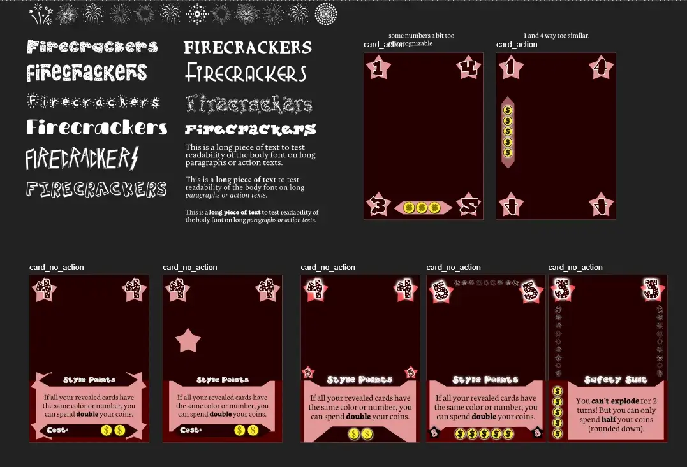
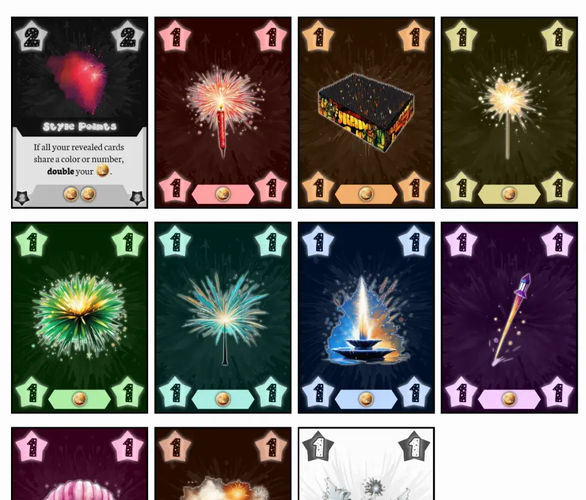
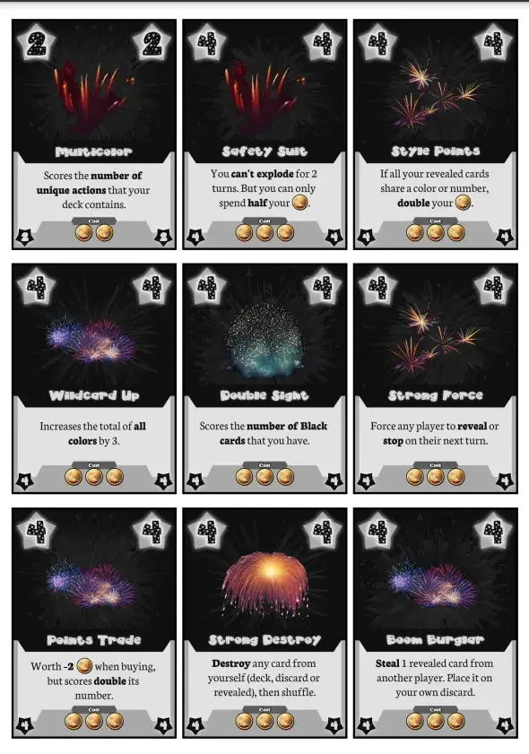
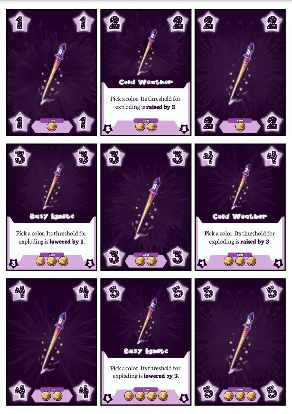

Welcome to the devlog for [Firecrackers](https://pandaqi.com/firecrackers/).

In this article I'll (briefly) explain the process behind developing this game, the problems I faced and how I solved them, and hopefully more interesting stuff.

## What's the idea?
I have the nasty habit of coming up with holiday-related games right before the actual holiday happens. Somehow, my brain thinks "hey, New Year's Eve is coming up", and decides to invent some game/story idea related to it. 

Which gives me only one or two weeks to actually _make_ that whole thing, so we can play it with the family on that day.

This game popped into my head in one sentence: **a deck-building push-your-luck game**.

I'd never seen the two genres smashed together before. (Then again, I've obviously only played a tiny fraction of all games in existence.) It seemed promising, though. 

* Each player starts with the same tiny deck of cards.
* Each round, you take turns making a decision: REVEAL or STOP.
* REVEAL means you reveal the next card from your deck. If its color now has a number above 10, you _explode_ and are out of the round.
* STOP means you're done for the round. The number of cards you revealed are your "money" with which you can buy new cards (for your deck) from the shop.
* This continues until the game ends (the shop is empty, probably), at which point you score your final deck.

Why did I like this idea?
* It's really, really simple.
* It also fits larger groups or families: all you need is a deck of cards and this very simple explanation.
* Pushing your luck is clearly rewarded: each new card revealed means an extra coin to spend when buying better cards.
* It has extremely high interaction, which I always like. (You're not just doing your own thing and exploding on your own---you're constantly influenced by the cards that other players buy and reveal.)
* Because it's a deck-building game as well, there's actually a lot of strategy and gameplay in an otherwise luck-based genre. (You can design your deck to prevent exploding, perhaps based on how OTHERS are designing their decks. Decisions from the first round keep having consequences until the final round.)

So I decided to make the game, even though time was short.

## Improving gameplay
### Scoring
Initially, I wanted to give cards _two_ numbers:
* A big number on the corners, ranging from 1-9. (When a card is revealed, you sum all these numbers in the same color. If above 10, you explode.)
* A smaller number below it: how much the card _scores_ at the end.

Then I realized I was being stupid.
- We can just reuse the **big** number for scoring too!
- This creates a nice risk/reward mechanic. Higher number cards give you a larger chance of exploding, but also score more at the end.

Furthermore, having the numbers range from 1-9 is obviously too big a difference. Especially with more players (say, 4+), this would make exploding way too easy. 

(Somebody reveals an 8, you reveal a 3, done. The same repeats for the next two players. Before anybody has done anything, the round is over and everybody exploded :p)

Numbers ranging from 1 to 4 seem more reasonable. 

A game like this, however, also needs a good set of fun special/action cards. So let's think about deck composition for a second.

### Starting deck
First of all, we don't just need **more cards** for more players, we need more different **types**.

For example, with 3 players, you only want ~3 colors in the game. This allows revealing a few cards in a round before anybody risks exploding.

But if you have 6 players, 3 colors is obviously not enough. 

(Remember, you only explode if the total sum is above 10 _in the color of the card you just revealed_. Thus, more different colors gives more chances to evade each other and keep numbers per color low.)

The obvious solution? **Include 1 unique set of cards per player.**

Secondly, where do action cards come in? I always like staying simple and minimalist, which means I'm tempted to merge action cards and colored cards into _one_. Each set of cards 
* Has the same color/symbol
* Has some cards that do nothing special
* And some cards with a special action

Because the action isn't on the _entire_ set, it shouldn't be overwhelming. (You're not stopping the game every turn because somebody has ANOTHER action.) 

Because the game has only _one_ type of card, we need no special rules for any of this. (They have numbers, so they score and explode just the same. They're also worth a single coin when buying.) We just say "if the card has an action, execute it".

This should work for the most part, but it's still not enough. In games like these, everybody usually starts with the same tiny deck (for fairness and simplicity). So the biggest question becomes ...

> How do we ensure there's a chance of exploding, even when everybody only has the same 4 or 5 cards?

It feels like we need one pure _action_ suit with some special actions that make this possible. I decided to make this the **black** suit, where all cards have number **0**, but they all have an action. (The number 0 obviously means they'll never explode, but also never score points.)

Thus, our final setup becomes ...
* Include the black cards.
* Include 1 set per player.
* Deal each player the "starting set".
* Put all other cards into the shop.

As we continue, I'll try to find an answer for that big question about the starting set.

### The shop
This should be quite straightforward.
* All cards are _faceup_. (Their cost when buying is clearly on the card.)
* But they're sorted by _action_ and you can only buy the top card. (Which means you know what you're buying, but the specific number/color on top changes over time.)

Initially, I wrote a second rule to balance shop size with game length.

> For each stack of cards, include as many as the number of players (at most).

In other words, if there are 7 "green cards with action X", but you only have 4 players, then only add 4 to the stack.

With our rules above, however, we already make the deck grow/shrink with player count. So I'm not sure this rule is needed.

We _do_ need a specific distribution per type at this point. Like, how _many_ cards should there be in a set? How many "1"s? How many "2"s?

It feels like the number 10 should be a constant in this game. (You already explode when above 10. The maximum player count might also be 10.) So let's keep that as our target.

At this point, my head flipflopped between different thoughts. (We need more 1s than 4s, right? But ... that's boring and too safe. The other way around? Nah, if we have too many 4s, you still explode too early. Aaaah I don't know.)

Which means it's time for a **simulation!**

## Simulating
In this case, simulation just means something very simple.
* I write a simple script that can take turns in this game. (I create X random decks, then take turns drawing the top card, and check how quickly you explode.)
* My target is 2 coins => Players, on average, should be able to reveal 2 cards without exploding.
* I try different distributions for sets and the deck, until we reach this target.
* (The simulation repeats itself thousands of times to get averages and statistics.)

I need that code anyway for the playful examples in my rulebooks, so it has become a no-brainer to try a simulation for suitable games. It's just the same code, but with all parts that actually draw cards / explain what happens _disabled_.

So, what are the results?

It basically shows we have two options.
* Cards range 1-4, and the explosion happens at 8(+).
* Cards range 1-5, and the explosion happens at 10(+).

Both of these have an average `cardsUntilExplosion` of roughly `2.15`. (The simulation also varies player count and deck size, to encompass as many different situations as possible.)

I picked the second one. It simply allows a little more variability, luck, diversity. Additionally, 10 is an easier number to remember/use for most people.

The best card distribution was also the simplest one! All numbers appear equally often: 1x2, 2x2, 3x3, 4x2, 5x2

I also tracked two other statistics: `didntExplode` and `explodedOnFirstCard`. Both are undesirable: the first means somebody safely went through their WHOLE deck, while the second means you had no choice and just weren't able to do anything.

With these settings, both of these are 3% on average. That's extremely acceptable. (It means that if a player explodes/stops, it only happens in those undesirable circumstances 3 out of 100 times.)

### Starting Set
This is all for "during the game". 

But now, finally, we have the tools to simulate this as well. To determine the last piece of the puzzle. 

What's your starting deck? It should be ...
* Simple (a small deck with perhaps only 1 or 2 actions)
* Mostly equal among players
* Possible to explode in the first round, though not too soon.

I first wanted to say "add 1 random card per color", but that would mean you basically have the _entire_ deck of cards already in player's hands on high player counts. The whole shop and buy element is completely gone :p

Instead, the rules became.
* Pick 3 starting colors. Grab their cards with _no_ action.
* Give every player 1 random card from each starting color.
* Then give each player 2 black cards.

A starting deck of ~5 cards is common in deck-building games, and it seems reasonable here.

I simulated many alternatives (4 starting colors, 2 starting colors with 2 cards each, etcetera), but this one was by far the best.

Because I learned that the **black cards can be used to balanced the game!**

It's the only "special" suit where I can play with the frequency and the numbers on the cards. Doing so made me end up at the following situation.
* There are 20 black cards.
* Half have the number 2, the other half the number 4.

With these settings, our average `cardsUntilExplosion` is _still_ around `2.15` at the start of the game! The probability of exploding on your first card (in the first round) went up _slightly_, to 5%, but that's still acceptable.

Additionally, this allows us to add a wide range of actions to the black cards. The actions aren't needed to balance the starter decks anymore. (And as you saw, I invented too many actions anyway, so we need a place to integrate a lot of them.)

My simulation now proves that, with this deck composition and starter deck, the game is very balanced and playable. Both at the start and mid-game. It's extremely rare you die before doing anything, or after safely going through your whole deck.

{}
The rules do have an exception for 7+ players. I can't invent 1 rule and expect it to work at such high player counts, so it was needed. The best deck distribution then, according to my simulation, is: 4 unique colors, 1 black card. At those player counts, this has nearly identical statistics as the other one.
{}

I'm not sure if I'll program special actions as well. (A lot of work to confirm basically nothing, as actions are something that must be _intelligently used_ during the game, so a random simulation wouldn't be accurate.)

## Special Actions
Now it was time to brainstorm a bunch of special actions. Especially a simple one that all players can receive in their _starting deck_ which makes exploding more likely those first few rounds.

Below is just a list of the first things I came up with. It's probably already too much to fit in the game, and some are more useful than others, so the list will shrink as we finish the game.
* A wildcard color => something like "Adds +2 to ALL colors."
* Extra Score => "Scores double its number at the end of the game."
* More value => "Worth 2 / 3 coins when buying."
* No value? => "Worth 0 / -1 coins when buying."
* Force => "Force the next player to reveal"
* Skip => "Force the next player to skip their turn"
* Strong Force / Skip => "Force ANY player to reveal/skip their next turn."
* Remove => "Destroy any card from your discard pile" (**destroy** = they're permanently gone from the game)
* Strong Remove => "Destroy any card from your deck or discard, then shuffle."
* Remove Other => "Destroy a revealed card from another player."
* Return => "Move 1 / 2 cards from your discard pile back to your draw pile, then shuffle."
* Undo => "Move 1 / 2 revealed cards back into your draw pile, then shuffle."
* Safe Draw => "Once this round, you may look at your card before revealing, and decide to stop instead."
* Delayed Explosion => "If this card made you explode, you stay alive, but must reveal another card."
* Auto Explosion => "From now on, any card played in this color will instantly explode."
	* Or something more subtle like "The explosion threshold for this color is now 6 instead of 10."
* Buddy Explosion => "If you explode, so does every neighbor who hasn't already stopped."
* (Perhaps a card that shows 2 colors, and you decide which one it is upon playing?)
* Stick it out => "If you're the last player alive, you get ANY card from the shop (for free)."
* Risky Rocket => "From now on, if you choose to reveal, you must reveal 2 cards."
* Cleanup => "Move all revealed cards from a player to their discard pile."
* (I might also add some cards that are pretty much always negative for you. The only reason you'd add such a card to your deck is because of its OTHER properties, such as color and number.)

Hopefully you can see the ideas here. At first glance, many of these actions might seem overly simplistic or without strategy. I've learned that that's usually what you want, as it allows players to just play the game and _discover_ all that an action can do.

For example, take the "Skip" action. Why would you force another player to skip? Doesn't that just help them _not explode_? Well, yeah, but it also ...
* Means they might have 1 fewer coin for buying.
* Means they do not reveal that high blue card---which you know they have---which would ruin you.
* Means you might get a chance to buy before them.
* Etcetera

In my quick testing, I can see interesting pros and cons to all these actions.

### Action distribution
In the shop, cards are grouped by _action_, not number. As such, actions shouldn't be fixed to numbers---it's more interesting if the same action is spread across multiple numbers.

Hence, I used the following approach when assigning actions to cards.
* Each pack has two predefined actions
* For each number, _half_ the cards are assigned an action (and the other half are left empty).
* It _alternates_ between those two options to make sure they both appear roughly equally often.

Very simple, very fast, but it leads to the type of deck that is most interesting and useful.

### Card cost
With all of that in place, calculating the _cost_ of a card is straightforward.
* Each number has an assigned cost. (There are only the numbers 1-5, so I just assigned these by hand. They are ascending: a 1 card costs 1 coin, while a 5 card costs 3 coins.)
* Each action has an assigned cost.
* The final cost of a card is simply **numberCost + actionCost**. (Both of these _can_ be zero or negative, in rare situations. Such as an action that's usually terrible for yourself.)

## Let's make that!
We know exactly which cards we need and what should be on them. We have enough actions to assign to each "pack". All that's left to do is to actually _make_ that, which starts by designing a card template and finding a graphical style.

{}
The actions aren't assigned completely randomly, of course. I did try to create sensible "pairs": each pack has two actions that are opposites or related in some way.
{}

### Fonts
I usually start with fonts. A huge part of any project has text of some kind (such as the rulebook, the numbers and action text on cards, etcetera). Finding the right font immediately helps the project get off the ground _and_ informs the visual style you need to match.

(I find it easier to find good fonts and then draw the card around it, then to find fonts that match _after the fact_.)

Below is an image of different fonts (both for headings / numbers and for the body text) I'm trying out, as well as some sketches for card layouts to see how they look.

In the end, the font Neuton was ideal for the body.
* Readable (a nice thick serif font)
* Has style variations (_italic_ and **bold**, always useful)
* And looks slightly playful and crooked, which fits the theme and my other font.

Of all potential header fonts, I chose one called "2Peas 4th of July". Which is a questionable name, but that doesn't matter :p 
* It actually had _clearly legible numbers_. (And some other "special characters" such as, you know, a question mark.)
* It is thick, readable, fitting, playful, without overdoing it.
* Its 5 is already special (a bit slanted), which is fitting, because the 5 is the highest number in this game!

(I feel like such a design needs a lot of glow/light effects, but in the sketches so far I can't really make it work ... without destroying legibility at least ...)

There's another font that is equally fitting, but has a completely different style. I might switch to that font in the end, once I can see the _final_ cards and graphics. (Or I might even give people the option to choose on the game page ... that's surely never been done before, choosing your own font for a card game :p)
### Firework Types
The main illustration for each type should be a unique (and easily identifiable) type of firework.

This actually proved more difficult than I thought.

When you search for different kinds of fireworks, you find only different kinds of _effects_. The different ways in which a rocket can explode and color the sky. Which are pretty, and I recognize many of them, but they're also very _similar_ and certainly not everything fireworks has to offer.

I needed types that were more clearly distinct. As such, I had to search a little longer, and find the translations for fireworks I knew from my childhood, but only by their Dutch name.

In the end, I was able to find 10 kinds of firework that were clearly different, with a large chunk of them being _ground fireworks_ or "fireworks-lite". (Stuff people don't really consider dangerous, such as sparkles.)

All those pretty effects? I used them all for the Black cards. They all have different actions and are "special" anyway, so it's fine to use varying illustrations of effects that are "slightly visually different". 

{}
Maybe I'm just not knowledgeable/passionate enough about fireworks, but I really don't see any major difference between many of these effects. I prefer legibility and easy reading of my card layout over pretty sparkly images :p
{}

I also matched the effect to the color, though many fireworks obviously come in multiple colors. (Only some fireworks have a clear color connected to their appearance, such as Red for Firecrackers.)

### Graphics
As usual, I ask AI to try its best, and do whatever's left manually. This time, I'd researched two styles or approaches that seemed to made sense.
* I found several painters from long ago who mostly painted _night scenes_ and used lots of _pretty lights and colors_ in those.
* I thought _long exposure_ (or "double exposure") photography might be a good influence. (I mean, that's what many people use sparkles for! To draw letters and symbols in the air while their mother takes a long exposure photograph ... and then hope for the best.)

With those two modifiers added to the prompts, I asked it to generate my fireworks.

This, erm, went _badly_.

Most firework types have names of _flowers_ and _animals_. Guess what? When you ask the AI for those types, you just get the actual thing and not the firework! Similarly, asking for fireworks pretty much guarantees that it gives glitters and sparks, instead of the actual _product_.

(Which is way more useful and distinct.)

That's why I eventually had to try several different hybrid approaches.
* Some illustrations are generated directly. (For example, a _firecracker_ is common enough that it knows what to do.)
* Some are almost entirely drawn or composited by me.
* And others use "image to image": I input a picture of the actual fireworks and ask it to _modify_ the image in the styles I just described. After some tweaking and more editing, that was able to fill all the holes left behind.

### The final template
I ended up with too many illustrations for the number of sets. So I did the following.
* Each specific set has _one_ type and one type only. (The whole point of the illustration is to make the card type instantly recognizable, even in bad lighting, even to colorblind players, etcetera.)
* But the _black cards_---which are all different and all have different actions---randomly select from a large array of leftover options. (Mostly pretty colorful fireworks that have the name of a flower :p)

The colored cards received a _glow_ around their illustration, because such lighting effects just looked a little better in a game full of sparkles and firework. They also receive a (faded) fireworks explosion behind it, just to add a little more background and texture.

The black cards do not have this glow. The illustrations that can appear simply looked better _without_ it, so I decided to allow this inconsistency. Most people won't notice, not even if you told them.

Finally, I put it all together in my generator. 

I had to tweak the _colors_ quite a bit to end up with good contrast.
* The background has to be _really dark_ (for consistency and to make the fireworks really pop)
* While the foreground (with action text or number) has to be _really light_ (for legibility)

Such a stark contrast usually doesn't look that polished, which is why I introduced a third "mid" color. It's used for the stars, some sections of the action text background, etcetera. With these three layers, the cards were consistently legible and good-looking.

Below is a quick screenshot of the 1-cards of all sets.

### No wait, coins are confusing
The coins I'd generated looked fine, but they were _bright yellow_ (as golden coins tend to be). This made them hard to read against the mid and light backgrounds.

The solution is a simple thick black outline around them.

But that wasn't enough, because then I remembered a confusion people had with another game (not mine, from somebody else) some time ago.

In that game, just like this one, the "value" of a card was different when _buying_ and when _using to buy_.

In this game,
* The coins on the card show its **cost**.
* When buying, each card you revealed is **1 coin**. (No matter how many coins it shows, it's just not relevant here.)

I wanted to make sure this distinction was obvious. That's why I added a little rectangle above the coins with the text "Cost". Hopefully, this serves as a reminder that this is the _cost of buying this card_, and nothing else. 

(Also, small details like these always make the cards look a little less barebones and hence more ... professional. Even if they were added as an afterthought, out of necessity.)

## Playtesting & Finishing
Below is an image of the final PDF I used for printing, cutting and then testing the game.

When New Year's Eve came around, I was able to test the game with the whole family---quite a large group of people, though they default to teaming up when testing my games---and see if it's as good as I imagined.

The results?

**Yes, it is!** Never before has a test game been this flawless and fitting. Quick teach (even with a large, busy group), about 60 minutes of constant fun and engaging play, and then pretty close end scoring.

Doing this many playtests has given me a great sense for "rules that might be _just_ too much". As such, the day before I re-read my rules and decided to simplify it even further. These simplifications turned out to be the perfect changes.

* **Old Rule:** "First player to explode becomes the new Firemaster. If nobody explodes, the last player alive does."
  * **New Rule:** "Last player alive becomes Firemaster." (I don't know why this rule was initially more complicated. Guess it was a leftover from brainstorming.)
* **Old Rule:** "The last player alive may destroy ( = permanently remove) one card from their deck."
  * **New Rule**: this is just gone. (Due to how this game is structured, removing cards from your deck simply isn't useful or desired in most cases anyway.)
* **Old Rule:** "To create the shop, create faceup piles of cards grouped by _action_."
  * **New Rule**: "Create one pile with all non-action cards, then piles grouped by _color_." (Doing it per action results in waaaay too many piles and setup. It's also simply more fun when your choices are limited and semi-random.)

I also added a clarification. Many people thought that, when a card action changed their worth (e.g. "this card is worth -2 points at the end"), it was _added_ to their number. But no, it overrides/replaces it.

Finally, some slight balancing.
* As stated, _destroying_ cards from your deck CAN be useful (and is a staple in deck building games), but only like 25% of the time. As such, any action that destroys became _optional_. (Being forced to do it just feels dissatisfying.)
* There are some cards that give a huge penalty NOW, but are worth a lot of points at the END. They were perhaps slightly too powerful, so I reduced their worth slightly.
* Similarly, some other slight tweaks to the cost or precise numbers on cards.

All of this made the rules for the game _really_ simple, yet my playtesting so far didn't reveal any cards that were clearly too strong or too weak. Which means ...

## Conclusion

This game is done!

As I write this (literally January 1st), the release is still a year anyway, but I'm confident calling it my best game of the last year. Not because it does something groundbreaking or has huge depth, but just because it's so _easy_ to explain, get going, and have fun with any group of people.

(As always, if I do realize improvements and/or get more testing done, I can always tweak some more actions and values. Heck, I have an entire year before this game releases!)

That's it for this game.

Until the next devlog, keep playing,

Pandaqi.