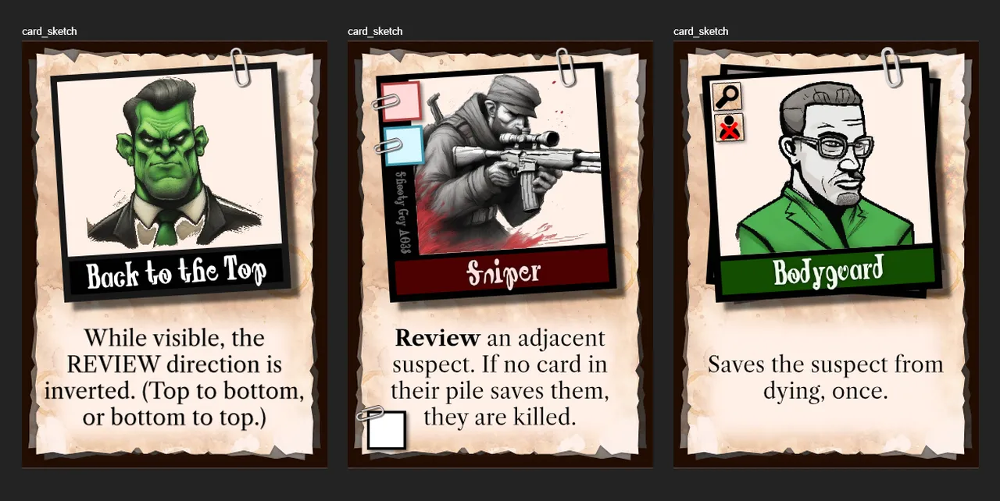
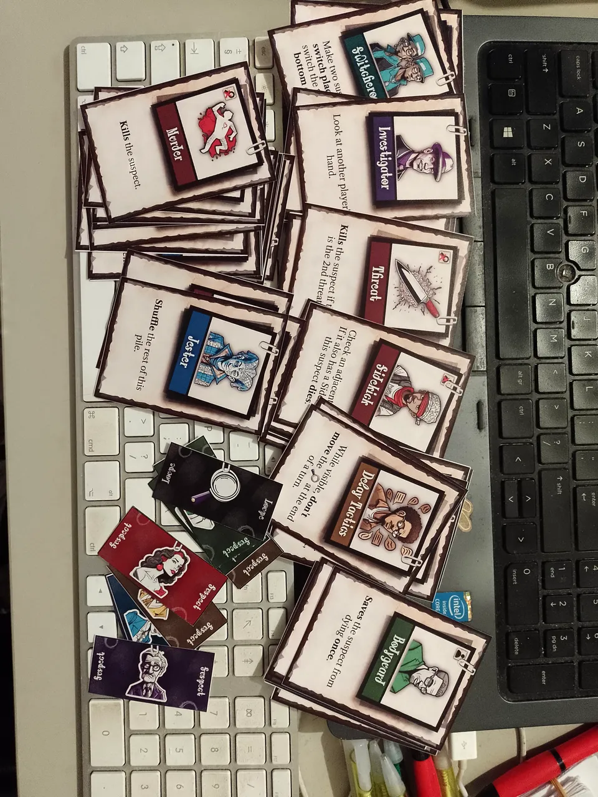

Welcome to the devlog for [Hasty Accusations](https://pandaqi.com/hasty-accusations/).

In this article, I'll try to explain the process behind creating the game, showing the problems I faced, why I made certain decisions, and so forth.

## What's the idea?
This idea originated in a time when I'd read and watched quite some murder mysteries. 

(I watched a series as a sort of mini-vacation for myself, mentioned how good it was to somebody else, and then we watched the next seasons _together_, and that's how your brain is suddenly filled with murder mysteries for months.)

In fact, I wrote down _three_ ideas for detective-like games. This was "Hasty Accusations II". (The others seemed more complex or more uncertain, which is why I left them for later.)

I remember getting the idea just as I was climbing into bed. Which happens so often that I have a notebook beside my bed for writing down all those ideas.

This one appeared basically fully-formed. (I even drew what the table would look like during play, which matches the final version quite accurately.)

* On the table are X "suspects".
* Each player secretly receives one of those suspects to "protect".
* Each turn, you simply place secret cards on a pile next to the suspects. (Their "evidence pile".)
* After each round, the _biggest_ pile is revealed and executed.
* If there's a Murder card in there, this suspect is killed.
* This continues until only _one_ suspect remains, and the player who had them wins.

I can't remember why, but during that period I had a lot of ideas that revolved around "building piles of secret cards" (which would reveal/explode/trigger at some later moment). 

It's just a really strong mechanic, because it makes turns extremely simple, but forces you to plan ahead, memorize, and predict the moves of others all the time.

You'll notice I speak about this project as if it's far in the past. That's because it is: the original idea was conceived more than a year before I actually created it. Because it appeared so fully-formed, I also didn't keep a devlog at that time, because, well, there wasn't a process of solving issues.

All I remember is that there was a "traitor" idea at the start, which I moved to a variant/expansion to simplify things. 

From now on, though, the devlog will be written in tandem with the project. (I usually write the next part in the evening, after having worked on the project during the day.)

## Coming back: my issues with the idea
### Player elimination usually isn't great
My first issue with the idea is the hard player elimination. Your suspect is the first one killed? Tough luck, wait 15 minutes before the next game starts and you can participate again.

I also wanted to allow using more or fewer suspects than there are players.

This came together in one rule change.
* Each suspect is in the material 3 times.
* One is used on the table.
* The remaining 2 cards (for each suspect) are shuffled together and dealt

This means each player has _two_ suspects. This provides more variety in moves and strategy, and keeps them in the game longer.

And if you want to add/remove suspects (for a shorter/longer game), now you have the material to do so.

### What to do besides Murder?
The "Murder" card is the obvious first one in the game. Probably the one that should appear most often.

But then what? What will all the other cards do?

I noticed there were three distinct types of actions.
* Killing => something that either kills or protects from a kill
* Piles => something that messes with the evidence piles and/or how they're reviewed
* Action => other miscellaneous actions to help or hinder

For each of these, I created a list of 12 ideas. 

Why? So I could put them into 3 "sets". 

I've learned that this is usually the best way to do it. It reduces the material people need to print for their first game as well as the decisions they need to make. (First game? Just print and cut the Starter Set and you're done! Want more? Add other sets.)

Each set has 4 cards from each category (4xKilling, 4xPiles, 4xAction) to get 12 in total. They don't appear equally often, though. As stated, the Murder card is so important that it should probably appear way more often.

Moreover, I sorted these actions based on difficulty (simplest ones first, of course), but also based on how well they combine.

For example, you don't want 4 cards that _kill_ in one set, and 4 cards that _protect_ in another set. No, you'd rather have 2 killing cards and 2 protecting cards in the same set.

Following that logic, most sets globally have the same distribution of action types, just with different specifics and consequences.

Another example: there are several powerful cards that give you information. ("Look at another player's hand", or "Look at another player's suspect"). Adding them all to the same set would make it way too easy to know everything about everyone, and it would lack variety in the possible actions. So I spread them across the three sets.

The actions themselves aren't that groundbreaking. As usual, it's a simple matter of asking yourself ...

* What are all the rules or limitations in the game?
* For each of them, invent actions that _break_ or _subvert_ those.

For example, the current rule is that you "review" a pile by revealing cards from top to bottom. How to subvert that? 
* Go bottom to top.
* A card that forces you to stop when encountered.
* A card that, while visible, prevents a review from triggering.
* Etcetera

After making so many games, I usually end up with _too many_ ideas this way and have to cut them down to the most impactful ones. (There are always actions that sound really interesting and clever, but in reality only do something 5% of the time. With pain in my heart, I usually throw those into the bin.)

In general, I always pick these actions for the _starter set_ (or your "first games").
* Actions with big, clear, immediate consequences. (You don't know the game well enough to see far ahead, or to see subtle shifts in strategy.)
* Actions that add randomness. (Randomness is the thing that helps new players win a game or overcome a few terrible moves. The people who usually _hate_ randomness are those with a lot of experience in a game, not newcomers.)

### More information and action during a round
My final gripe with the idea came from _too much secrecy_. 

Currently, during a round everybody plays _facedown_ cards. All the time. There is no information, no action, nothing revealed. 

That _all_ happens during the review phase.

This feels too boring and restricting. There should be _some_ way to take actions during the round.

I came up with the following solution.
* There's a spyglass moving over the suspects. (This was already in the game. Whenever the spyglass has reached the end, you do a REVIEW phase, then return the spyglass to the first suspect. That's how a "round" is delineated.)
* When you play a card to the current SPYGLASS pile, you must **play it openly**!
* And thus immediately execute the action on it.

This means there is always one pile---which you can somewhat predict in advance---that both gives information and allows actions during a round.

It does introduce another issue, though. What if a card doesn't have an action that's relevant during a round? (Say, an action that only matters during REVIEW?)

For that, I introduced two properties on cards.
* SPYGLASS: When shown, you must play this card at the spyglass. When _crossed out_ (with a big red cross), you CAN'T play this card at the spyglass.
* SUSPECT: Same idea. It either forces you to play the card at a suspect of yours, or forbids you from doing so.

This way, I don't need to add silly rules like "If a card doesn't have an action that's relevant now, you don't need to execute it" or "You can't play this card at the spyglass" on _every single card involved_.

These two icons, when applied to the right cards, _remove_ the possibility of confusion or void actions.

* That "stop" card that stops evaluation? Give it an "X spyglass" and nobody can play it faceup anyway.
* The "mover" card that allows moving the spyglass? Give it a "spyglass" so it's always played and executed immediately.

The "suspect" icon is used less, but still vital for some cards. By forcing you to play them at your own suspect, others might be able to deduce your secret suspects!

Now we have everything we need: the Rules (without any gaps) and everything needed on Cards.

## Let's make that
Usually, I'd create a paper prototype and test the game against myself a few times. I did not do so for this game.
* The material to "quickly create" was too complex and unwieldy.
* The whole game revolves around _not knowing_ what's inside the piles or what the suspects of other players are. Playing against myself, I can't emulate that at all.

I've built quite a system behind the scenes that allows me to rapidly create entire, finished games. So I decided to just _make it_, generate a set of cards, then test that with others.

### Graphics
First question: art style and card template. For this theme, I "obviously" wanted a dark, gritty, detective, noir style.

I researched works, artists, styles, etcetera that fit the bill as much as possible. 

I found a few images that were entirely black but with only _one_ color showing. (As if only that part of the world had invented color.) This seemed really interesting and something to try myself.

For each action type, I assigned colors.
* Killing: bad = red, good = green
* Piles: piles = blue, review = yellow/orange
* Actions: information = purple, spyglass = lightblue, misc = pink

Then I asked AI to generate illustrations in that gritty dark style, but with a streak of one color.

This didn't go very well.

I was able to _kind of_ get where I wanted, but never consistently. The more I asked for gritty / dark / noir style, the more the characters just looked ... angry? It often looked _good_, but not _fun_. And this is a pretty light board game that should be _fun_.

I tried 5 entirely different approaches before settling on the two best options.
* A combination of cartoon caricatures and pencil sketches seemed to work, although it's not exactly the style I wanted.
* A more cartoony approach (asking for outlines and playful art) was more what I wanted, but very inconsistent. So I could take those images as inspiration but ultimately draw them myself.

At this point, I was generating a few different images every day, but hadn't settled on any style yet. Instead, let's continue with something else for now.
### Card Template
Initially, I wanted _black_ cards. Then I realized that would destroy everyone's printer, and look _too_ dark and gloomy as well, so I discarded that.

Furthermore, the actions on card sometimes required quite some text. (At least, compared to my previous card designs.)

This meant I didn't have the _space_ for lots of decoration around the text, or some ornate "box" around it. The text should probably just be on a flat background, given as much real estate on the card as possible.

(Same for the font. I could've gone with an old-time, grungy typewriter font to really fit the theme ... but that would just be annoyingly hard to read.)

That's why I decided on the following layout.
* The background is a stack of grungy, "classified document" papers (with fingerprints, coffee stains, etcetera)
* The illustration is a _photo_ clipped onto it with a paperclip. (With the title of the card written on that photo, as if it's a headshot with a note.)
* The text is below that, with a subtle white rectangle behind it to make it even more readable.

I struggled the most with placing the two special icons (spyglass yes/no, suspect yes/no). I tried to be cute about it and also add those through paperclips, but it just looked messy and took too much space. There was no great place to put it, at least not without potentially obscuring some part of the card.

So, after a few attempts I simply placed them in the corner of the photograph inside simple textures (with that same grungy paper texture). For such icons, simplicity is key, so I'm fine with the basic version you see in the sketches below.

### Creating the set distribution
I initially wrote this code in 5 minutes, thinking it was that easy. Until I looked at the results, imagined using that to play a game, and realized I was completely wrong.

This was actually quite hard to balance.

You see, this whole game is structured around suspects _regularly being killed off_ (and you trying to _save them_). If the final deck has too few murder cards, the game stops working. If it has too few cards to save yourself, the game stops working. If it has too _many_ murder cards ... you guessed it, the game stops working.

To make matters worse, different cards have a different "murder factor". The base _Murder_ card, obviously, insta-kills a suspect. But then you have the _Threat_ which takes _2 threats_ to turn into a kill. How to balance that?

Well, I thought the answer was in the word "murder factor" (which I, for some reason, named `murderQuotient` in my code)

* Each murder-related card has this quotient based on a guesstimate. (The base murder card is `1.0`, the Threat is `0.5`, etcetera.)
* The same for each protection-related card. (The Bodyguard card literally protects against 1 murder, so its number would be `1.0`.)

I manually set my desired quotient, based on (play)testing. For example, I say "the set should contain between `8.0` and `10.0` in total". (This seems reasonable, as it's slightly higher than the maximum player count, and thus on average leads to a murder each round.)

When generating, 
* I start by picking random cards to meet this threshold.
* (Then remove all those cards from the possible set, to make sure I don't exceed the threshold.)
* And fill whatever is left randomly. 
* (Though cards are weighted, so some are more probable than others.)

This not only created a better distribution, it also revealed some flaws in the current set designs.

For example, the second set had only _one_ card that could kill (with low probability), while it had _four_ cards that were quite good at protection (near `1.0`).

I'll give two examples of changes that I made.

Dying Breath:
* Old Power: "If killed, also review the pile with the LEAST cards." => this doesn't kill, but only triggers _when killed_, which is just very weak and a waste of an action.
* New Power: "Kills this suspect. Then also review the pile with the LEAST cards." => this actually kills and potentially creates a double kill, hence why this has a murderQuotient of `1.5`

Rebel:
* Old Power: "Don't move the loupe at the end of your turn." => I already made a comment that this was quite weak and boring. Then I realized it was identical to an earlier power that said "No review phase ever happens"! If the loupe never moves, then _no review happens_, duh.
* New Power: "Pick 1 card from every pile and stick it anywhere inside another pile." => This actually synergizes with the rest of the set.

_Synergizes?_ The rest of this set has two themes.
* "Reverse": cards that allow playing cards to the _bottom_ of piles, cards that allow reviewing piles _starting from the bottom_, etcetera.
* "Buildup": cards that don't kill immediately, but they _stay in the pile_ (after review), building poison/protection over time.

The Rebel was the odd one out, doing nothing useful and not following these themes. With this power change, I actually added a crucial power to make the "Buildup" work. 

Without it, there was _no way_ to combat a buildup of Poison inside a pile. If a pile had 3 Poison, well, that suspect would _die_ and you can't stop it.

With the rebel, you can _move_ those cards around if needed. In fact, the most common use I can see is that you move around _killing cards_, which is why I gave the Rebel a high "murderQuotient" too.

As for the _probabilities_ of cards ... I just can't know. I invent each of these cards because I deem them useful, fun, interesting and varied. Hence, I can't read through the list of powers and know "this one is obviously 4 times as useful, so make it 4 times as likely to appear!"

This can only be learned through playtesting. I need to play the game a lot, see which cards should appear more or less often, and tweak these probabilities as we go.

For now we have a deck that's roughly the size of a standard card deck, with card frequencies that seem reasonable and balanced, so let's move on.

### The final cards
I ended up using the more cartoony style, with thick outlines and semi-detailed illustrations. It ...
* Fit the card template best
* Provided the most consistent results, especially considering the types of icons/characters I needed for this particular game.
* Is a style that allows large parts to be edited / manually drawn by _me_ more easily.

## Playtesting 
Alright, I tested the game and can report basically the same results from any playtest I do. **The game works, but only after a few crucial tweaks!**

### Only one suspect
As usual, playing the game _in practice_ (with other players) revealed something that somehow slipped my mind when it was all just an idea: **If you have multiple suspects, then you can already be certain you'll win the game ... when there are still multiple suspects left.**

In the very first test game, I had suspects A, B and C. Guess what? The final three suspects remaining were A, B and C. So from that point---halfway through the game---I already knew I'd win and basically had nothing to do.

The obvious solution is: **each player receives 1 suspect** (and the number of suspects in total is quite large).

The reason I didn't do this in the first place, is because I don't want anybody to be out of the game after the very first round (just due to bad luck / nothing they could do about it).

But after seeing the game in practice, the actual solution is much simpler: **the first round is "safe"**. No review takes place after the very first round, as an exception.

This allows giving players just one suspect, while guaranteeing they're in the game at least 2 rounds, and thus able to defend themselves.

In practice, this means I remove the "doubled" suspects, and move the expansion suspects to the base game. This means you can field as many suspects as you like, no matter your player count / difficulty, and it all stays just one sheet of material.

### The "traitor" idea
It also means the **traitor expansion** (which relied on receiving multiple suspects, one of which would be the "traitor" card) needed changing.

Fortunately, with the new rules the solution presents itself!
* Mix 1 or 2 traitor cards into the deck of suspects.
* They win if _all other players lose_. (In other words, the final suspect(s) remaining aren't the secret suspects of anyone.)

In fact, this simplifies this variant to such an extent that I can just add this to the base material.

### A bit too aggressive and secret
The number of aggressive cards (mostly in the base game) is just a little too high. 

This is a simple tweak to probabilities in the generator, propping up more of the special actions that add more spice and strategy to the game.

Similarly, there's just a little too much secrecy (about what players play or hold in their hands) to do meaningful actions sometimes. So I tweaked some of the actions to help with gathering more information (if you think you need that).

### Edge cases ( + fewer restrictions)
One edge case (mostly due to having more than 1 suspect of your own) was that you **couldn't play any card**! If all your cards are forbidden on specific suspects, then it's likely you simply can't play a card near the end of the game.

First of all, I can loosen the restrictions. Seeing the game in practice showed me that some special types really don't need a restriction like "cannot play on your suspect". 

(In fact, this part of the rules is what I'd call "just a little too much". It's the thing most players forget about or don't understand immediately, and it takes the rules from "extremely simple and fast" to slightly harder to teach.)

Secondly, I'll add a rule that says "can't play a card? Discard your whole hand and draw equally many new cards from the deck."

(This is more useful than just saying "draw one more card", and definitely better than "you may ignore the restrictions" or "skip your turn".)

### Suspect Powers
This was my final idea right from the start: give the suspects special powers (which trigger when reviewed, or when they die, etcetera). But it kept being pushed back during development, because I just wasn't sure about it.

Now that I've seen the game in action, I know ...
* Yes, they'll add a lot as an expansion.
* They'd also give you more reason (besides "I don't like their face/color!") to pick specific suspects for your games, as it actually matters.
* But only if we use special powers that trigger infrequently and publicly: when they DIE or when you PLAY to them. (Other powers would be annoying to track if they happen too often. Secret powers---such as ones that only trigger if they are YOUR secret suspect---are obviously hard to safeguard against cheating or forgetfulness.)

I also knew I didn't want to put _text_ on the suspects, nor did I want to generate unique material to print + cut just for this expansion.

As such, I decided to place an _icon_ (illustrating the power) on the suspect cards by default. You'll just ignore it in the base game, but use it in this variant.

The rulebook clarifies what the icon means, but it should be pretty self-evident just from looking at it.

This feels like the most efficient and least intrusive way to bring that extra spice to the game to those who seek it. (Wanting to trigger a special power, or NOT have it trigger, is now an extra consideration for your strategy. And all that while keeping the rules simple: play one card, move the loupe forward.)

@TODO: IMAGE OF THAT? (the extra icons on suspect cards)

## Playtesting: round 2
Yes, these changes improve the game! But it still feels ... lacking to me.

It was hard to pinpoint the problem here, or why I was feeling this way. It just felt like I didn't achieve the full potential of the simple core mechanic, and too much of the game was still secret (and thus quite random).

Additionally, those extra icons (must play on loupe/can't play on loupe) _really_ trip people up when they play the game the first time.

I asked myself: is there a way to ...
* Give way more information about what people have in their hands or played? (And thus what's inside each pile?)
* And allow some ways to "break out of" the core mechanic to save yourself. (Now there are often times when you _know_ you'll die but you just can't do anything about it, because you get no more turns or just don't have the right cards.)

The more I tried different variations, the more I thought about it, the more I realized that minor tweaks weren't going to cut it. In fact, we probably need to do **the exact opposite** of what we've been doing so far!

* **Cards can be played open or closed.**
	* This usually reveals whenever a murder card is played. Because this is now public knowledge, it actually adds tension _and_ people can strategize how to prevent it if needed.)
	* Playing open gives away the card, but allows you to execute it.
	* Playing closed obviously hides the truth, but does not allow execution.
* **Cards are grabbed from an open market.** (There are 4 open cards on the table. When refilling your hand, choose from those, then refill the market from the deck.)
	* This allows you to pick cards you can actually use.
	* But it also means everybody else knows when you've picked a Murder card (for example).
* **You may play any number of cards.**
	* For each card played **openly**, move the loupe one step forward or backward.
	* However, your hand only refills (back to 4) when a Review is triggered. (So playing a lot of cards early means you're out of options later.) => Because we have an open market, this refill happens in clockwise turns instead of "just grab cards simultaneously from the deck" as usual.
	* _Why?_ Because controlling the loupe is way too crucial to the game to put on a few special cards. Also because playing multiple cards is often more useful and more interesting. 
	* (For example, one game I held 3 Bodyguards in my hand, and I was still eliminated that same round. Why? Because I could only play 1 card, and my suspect was murdered twice. I knew that. I knew I was losing and felt helpless instead of beaten by a smart opponent.)
	* If you don't play anything (e.g. because you _can't_), discard your hand and the loupe moves forward by 1.
* We remove the four icons and replace it with a single one: "Only triggers during review" (not when played). This would be added to the strongest cards, such as the Murder card.
* **Eliminated suspects stay in the row.** They're simply turned facedown and you can't place there anymore.
	* _Why?_ Removing suspects as they die simplifies the game and speeds up the loupe. This, however, means the time between two reviews is often too short to actually _do anything_. (Especially the final round or two is lightning quick and the winner is basically already decided.)
	* By keeping the suspects around, players can play multiple cards, or get multiple turns, before the next review phase happens.
	* I also thought about keeping eliminated players in the game, but I saw no simple rule that wouldn't ruin the balance.

You may play a card facedown, but doing so means you get no more turns until the next Review phase.

I guess the biggest lesson learned is that **too much secrecy basically renders the game moot.** If you don't know what others have in their hand ... and you don't know what's in the piles (beside, perhaps, a few cards played faceup) ... then what on earth are you supposed to base your strategy on?

I'd hoped that the game would encourage _tracking_ who played what card, and using that to deduce what it was or who their secret suspect was. In reality, however, this is _way too hard_ (again because of too much secrecy) and hence _not fun to do_. 

With the old rules, the game is "fun" due to the tension of being eliminated or successfully defending yourself. But this tension mostly exists because _you don't know anything_, which makes moves mostly random and strategy nearly nonexistent. 

With these new rules, the game should be fun in more ways and for more reasons. More freedom, more control, more knowledge, automatic failsafes for exceptions.

Is that actually true?

## Playtest 3: The Final Battle
@TODO: do this, write results, etcetera

## Conclusion
Pfew, this game is perhaps the most complex I've made so far in terms of code and machinery behind the scenes. Complex drawing code, complex generation code, loads of images, two completely different material types (suspect / hand card), and so forth.

But I knew this from the start. I purposely pick a more advanced game idea once in a while, to keep challenging myself and not get stuck in "make very similar tiny games fast" forever.

So I gave it that time and ended with an extremely simple yet solid game! It's very unique in its core mechanic. (Of the loupe and review structure.) The ability to be eliminated or murder other people's secret roles ... always brings a nice atmosphere to any game. The visual style came together quite well and playtesting mostly revealed ways to simplify the game, rather than add nasty exceptions.

It's nothing exceptional---and I'm always a bit saddened when a simple, pure idea clashes with reality and extra necessary rules---but I like this one.

That's it for the devlog.

Until the next devlog, keep playing,

Pandaqi