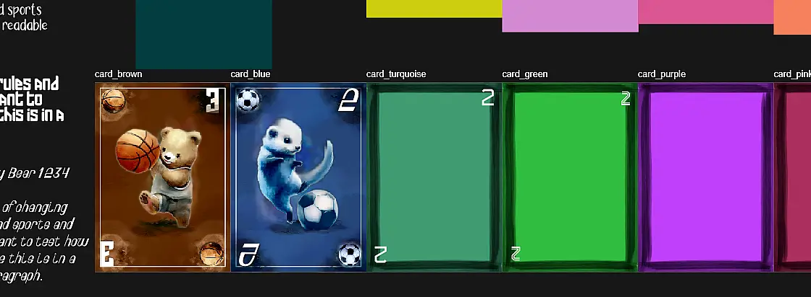
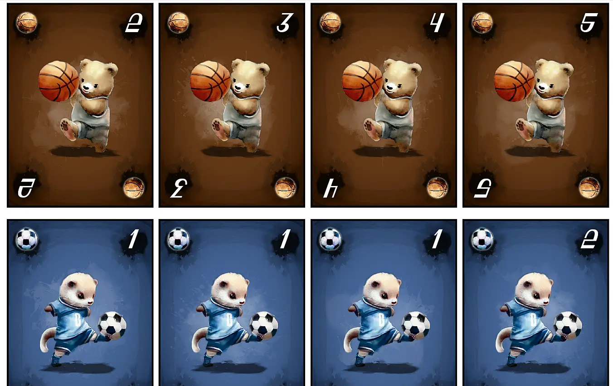

Welcome to the devlog for my game [Hold my Bear!](https://pandaqi.com/hold-my-bear). In this article, I'll briefly discuss how I made the game, the challenges along the way, how I solved those, and hopefully some interesting lessons or stories from development.

## What's the idea?

This idea happened when two separate thoughts came together.

* I was explaining to somebody what I learned from making 20+ boardgames: "start with the _game loop_, the mechanic you repeat over and over in the game". I gave some random examples (made up on the spot), such as "on your turn, grab a card, play a card" and "on your turn, steal one card from another player" Many _good and simple_ games can be reduced to "here are 2 or 3 options, pick one to do on your turn".
* I considered a pun on "Hold my Beer" :p

Suddenly, I heard myself saying: "Or, I don't know, a game in which you either play a card _or_ give away a card."

This connected with the pun in my head to form the idea: "What if you had a game in which there were cards you _didn't want to hold_ (at certain moments), so you'd give them away to others for the time being?"

I created a Word document. I wrote down "Hold my bear" and "a game in which bears are sometimes good and sometimes bad" and "on your turn, either do a valid move, or give away one card to another player".

These three puzzle pieces seemed to have potential. But how do we get there? How do we create a simple ruleset in which you can't always do a valid move, and bears aren't always good or bad?

I think I wrote down like 5 completely different iterations of rules before finding one that was both _simple_ and fulfilled my requirements.

## The Unbearable Games

The idea was as follows: _Welcome to the Unbearable Games! You can win the match by playing better cards ... or by changing the sport being played altogether! That's not cheating, that's just smart strategy!_

The rules were ...

* You are playing sports. The cards in the center of the table represent the current "match" being played.
* Each card has a **sport** (its "suit", represented by an animal) and a **number**
* On your turn, you either **do a valid move** (that replaces the match being played) or **give away a card**.
* A valid move is one of two things.
  * You play more animals of a **different sport**. (Example: currently there are two tigers, then you can play 3+ of any other animal.)
  * Or you play higher numbers in the **same sport**. (Example: currently there is a Tiger/1, then you can play a Tiger/2.)

Pretty simple, I thought. It also solves many issues with these kinds of "trump" or "race to the top" games.

* In many of such games, there is a clear hierarchy of cards. Some are simply higher on the chain, so if you are lucky enough to start with those cards, you'll probably win the game.
* Or, if such a hierarchy lacks, you can get "stuck". Nobody can really do anything anymore, because everything is equally valuable.

With these rules, however, you will almost always be able to continue. Higher numbers are still more valuable, but they can _still_ be overruled by somebody who just has a bigger set of a different animal. I wrote down a bunch of example turns/situations with these rules, and they always allowed for games to last at least a couple of minutes.

Even better, if you _can't_ do a move, you're not automatically out of the game or anything. You just give away one card and continue. This means the cards in your hand are also dynamic and your strategy can be readjusted on the fly.

The remaining question, of course, is **how do bears factor into this?**

## The bear necessities

Long ago, I learned the creative approach of "diverge, then converge". In other words, first I write down _everything_ I can think of (both ideas and potential problems), and then I look at the list and whittle it down to a few simple rules to solve all. (You'll see this time and time again in my other devlogs.)

As such, I saw a sequence of problems like this.

* I'd like a "trump" suit, that's always nice in card games like this.
* Is there a wildcard?
* Are there any restrictions on which cards you can give away or receive? Feel like there should be.
* WHAT DO BEARS DO?!

Which instantly revealed that this _was_ the solution!

> **Bears are both trump and wildcard.**

In other words,

* Playing more bears than the current match is always a valid move. (Ignoring any other rules.)
* On your turn, you can call bears any type you want.

This automatically means that bears are _powerful_ and a way to overrule a match that's otherwise hard to beat. It also means that bears are all the same type, any type, so beating a match full of _bears_ is very hard to do!

{}
Say you play 2 tigers and 3 bears. This means there are now **five** animals of the same type on the table. Pretty hard for somebody to play **six** of another type, so they'll have to somehow find a match with a higher total number.
{}

But now comes the "restriction" part.

> **You cannot win with a bear in your hand, nor play cards that share a number with a bear in your hand**

With great power comes great responsibility. You can't "get lucky" with the draw and receive a lot of bears, because this makes it way harder to actually play cards or win. You'll have to give away bears, or receive bears from others (which you might or might not like), as the game continues.

They're a hot commodity, but having them is either _great_ or _terrible_ at different moments.

This isn't completely done or watertight, but it's 90% of the way there and enough to actually start the game's development.

{}
Now all the other cards are pretty much the same and feel weak/boring compared to bears. I'd like some expansion with animals that have specific actions, or one or two extra rules, or just something to spice it up here and there. But that's all for later.
{}

## The design

What do we need?

* A card design
* A font for numbers on the card. (Another font for readable text, but not sure if I want any text on cards.)
* A color scheme for ~5 different animals. (Of which the first color needs to be a dark brown, for the bear. Also something you don't usually see.)
* Icons for their different sports
* And pretty illustrations for each.

This is why I like simple card games: simple material and not a mountain of work on the graphical side.

If you follow my devlogs/projects, you know I don't like doing the same thing multiple times. So, for this game, for no other reason than to challenge myself and have variety, I picked the following "style".

* Cards have pretty dark (but rich) colors. (Usually I go for bright, colorful, cartoony.)
* Icons, decoration, illustrations are a pretty calm and serene _watercolor_ style.
* I don't want thick borders on the card edges. (There needs to be _some_ texture, of course, but the cards should look like they extend all the way to the edges. I initially created a box around it with watercolor brush, but it just looked like that: a constricting box that reduced space and nothing else.)

The hardest part was getting a good _font_ and general _illustration style_.

### Fonts

The game is themed around sports, but not overtly so. As such, I needed a font that has a "sports vibe", but not one of those typical screamy/blocky/superthick fonts used in most sports graphics. I needed a font that had a hint of fantasy and flair, but also one with clearly readable numbers at any size.

{}
Truly the bane of my existence: you find a very pretty font, readable enough, and then ... they just went _crazy_ on the numbers and did something that makes them near recognizable!
{}

To make matters worse, the other icons are all _square_. (For example, the bear has a basketball icon, which, you know, is a ball. Equally wide as it is tall.) Numbers, on the other hand, are naturally _taller_ than they are wide.

It looked really odd together. I could center the numbers or try other tricks, but it just never worked. No, I needed a font with numbers that were (somehow) almost _square_.

That's how I ended up with "Sloval", which is slanted, and thus almost square by default. (It also looks unique and fun.)

For short bits of text (such as on the card), I picked "Ciscopic". But that's nearly a handwritten font, which makes it unsuitable (or just "tiring to read") on larger pieces of text. So in all other places, such as the rules or the web page, I used a very basic readable font called "Merriweather".

You can see these in action in the image from the section below.

### Illustrations

For the illustrations, my first step was to ask generative AI to help me out. Fantasy (generic?) didn't really fit. Freeform generation with lack of direction produced inconsistent results. That's why I ended up on a more specific style (watercolor), with additional keywords to make it slightly more cartoony and paintery, instead of ultrarealistic or like a photograph.

{}
Initially, I received these paintings of animals with very deep shadows, high contrast, and a very realistic face. I wanted something more calm, with more muted colors, and a little simpler. Not only do I prefer that style in general, it just looks better and is easier to visually parse in a card game.
{}

Initially, I also allowed backgrounds or other elements, hoping this would help the illustration "blend in" with the rest of the card. This proved a bad idea, however, It was near impossible to find a middle ground that allowed the illustration ( + background/decoration/more watercolor splotches) to blend in with the rest of the card _and_ look good on its own.

I also initially asked for illustrations in a specific color. If an animal was supposed to go on a green card, for example, I'd ask it for a green image. I seem unable to clarify to the AI, however, that I don't want EVERYTHING green. Just hints of green. A little green. I can't make it work.

But maybe that's a good thing, because it taught me to think a little longer about my style and what I wanted. I realized that most of these animals should wear _sports jerseys_. I could simply try to get _that_ in a certain color, while allowing the rest to look realistically.

See the image below. The ferret playing soccer is nice, but it's _entirely_ blue, which looks unrealistic and not as good as it could be. The bear, who simply has natural colors, looks much better.

{}
This is an older screenshot where you can also see my process for finding fonts, colors, and a potential border. The white rectangle is just for my own placement; it will be removed in the final cards. The white background behind icons (in the corners) was a nasty middle ground that didn't allow enough contrast either way, which is why I eventually darkened this.
{}

Similarly, some images I tried were just too "out there" for AI to understand. I initially asked for a fish playing soccer. Well ... it just gave me a fish ... with a soccer ball in the other corner of the image. No matter how much or how often I tried, nothing close to that image happened. So I learned to pick smarter animal/sport combos that could be reasonably illustrated.

After some more experimentation, I was able to consistently get good-looking illustrations in roughly the same style.

### Combining it all

Okay, so now I had a general style for illustrations/icons, a general card layout, and fonts.

The last step---which can often be the hardest---is to bring it all together.

* I generated some watercolor splats and randomness. Then I positioned this on the card to create _texture_ and _variation_. It's most notable behind numbers/icons, but there are many more layers.
* I added a _lighter_ variation of this behind the illustrations. This brings it more to the forefront, like a highlight, while also adding a smooth transition into the rest of the background. (A standard one didn't look great: the shape of this really has to fit the illustration like a glove. So each illustration has its own unique light background.)
* I added _shadows_ underneath the illustration, with the same watercolory texture and brushes. This shadow can be quite deep (high contrast), as it adds some much needed 3D to the whole thing.
* The numbers and icons also received _shadows_ (and other subtle effects like glow) to make them pop more.
* And finally, a lot of manual work for the fine details. It takes a while to understand how you subtly erase the edges of a drawing or brush stroke to make it blend seamlessly. (Hardness = 0%, Opacity = near 100%, Brush Size = _very large_.) Sometimes I needed to redo part of an AI image, or recolor, or paint something that was cut off.

Note that all of this is in my illustration software. I still need to transfer this to my _website_, so I can generate the cards through _code_. (This means some effects need to be baked in, while others can be done on the fly by any modern browser.)

For a simple card game like this, that may seem overkill. Why not create one fixed set of cards and put that into a PDF myself? Well, because even now it is _much_ faster (especially long-term) to generate it.

Think about it. The computer can just place the right icon + image + number + color by repeating the same bit of code in a loop. If I have to make adjustments, I change _one_ value in my code config and the next generation is completely updated.

Still faster and more flexible than doing it the traditional way, keeping all the designs in my illustrator software.

With all that done, we get a final look at the card design.

## Gameplay

### Paper prototype

With the general game idea in place, I created a quick paper prototype to play against myself. (I should really do this sooner, but I generally try to go with the flow and work on whatever I feel like working on at this moment. This means projects sometimes happen a bit out of order.)

The good news is that the idea works as well as I thought!

The bad news, as always, is that I stumbled upon some oversights or practical issues that needed simple rules to solve them.

**Forced start**: One test game, it was probably the best move for everyone to give away cards (and some couldn't even do a valid move). This meant ... that a whole round passed with the starting match still on the table, which belonged to nobody. This is both boring and confusing. So I added the rule that the first play _must_ do a valid move.

**Card Max**: I realized that playing _more cards_ was obviously always better. As such, you could just throw down all your cards at the start and hope nobody could top that :p (Not a great move, but a move that was _allowed_ by the current rules.) After some testing, I added a maximum of **5 cards** for a match. This was high enough to allow crazy antics, but never so high that the game is ruined.

**Deck Distributions**: in a similar way, I discovered that for 3--5 player games (the most common player counts by far) you want a deck of 5 animals: 4 regular ones, and of course _the bear_. The game scales flawlessly to higher player counts if you just add more decks. As such, on the website I'll probably set the default to "5 animals", but you can choose to add more if you want.

As for the numbers, I went with my gut and chose the following: 8 cards per animal, with numbers 3x1, 2x2, 1x3, 1x4, 1x5.

As usual, lower numbers occur more frequently, while the highest numbers appear only once. This ... actually seemed alright in every test game I played. I see no reason to change this now. (Over time or after playtesting with others, I can always tweak these numbers in my material generator within 5 seconds, so it's not an issue.)

The total number of cards for a regular game is now 40, which is a nice low number (for a card game, which you need to print yourself).

**Giving away cards**: giving away _one_ card often felt too inconsequential. It also encourages players to be very defensive/static: don't play new matches, just give away a card on your turn and keep your "good cards" for later. As such, I bumped it up to **give away two cards** (if you can't or don't want to play a valid move). 

Now it really matters, but it also means it's often wiser to just play a valid move.

As usual with games, you want high risk/high reward. If a game feels a bit dull or meandering, you usually want to bump up numbers and make actions much more extreme. (At the same time, I just love unpredictability and huge actions in games, so maybe it's just me. Over the years, I've actually grown of the opinion the _fairness_ in games is overrated.)

### What if you're out of cards?

Ah, the big question I wrote at the top of the rulebook but forgot to actually answer. 

I tried a few different things.

FIRST TRY: You also win if you're the first player out of cards. **Bad** because it merely encourages playing 5 random cards each turn and rewards players who simply have a luckier deck at the start.

SECOND TRY: If you're out of cards (at the start of your turn), all other players give you one card. **Okay, but not great.** It's in line with the rest of the rules (giving away that one card to another player) and it's a simple rule to keep everyone in the game. At the same time ... receiving one card _never_ actually made you able to do something on your turn, especially because you then had to give two of them away anyway!

THIRD TRY: If you're out of cards, steal 5 cards from other players (however you want). **I like it.** Five cards is enough to do something meaningful in the game again. Because you may take them however you want, you can weaken players that seem too far ahead (or use that strategically in some way), and it doesn't depend on player count. 

Mostly, though, this rewards _active_ play again. Players who are more active and take more risks will be out of their cards sooner. Stealing 5 cards is a good compensation/safety net to keep everyone in the game and reward aggressive play.

It also adds to the strategy. You have to play differently based on which player you predict might be out of cards next round. 

In my test games, about 50% of games ended when all or most players were out of cards, and this stealing/timing of being out of cards was really important. The other 50% of the time, somebody just managed to play a really good match and nobody could beat it, even with (many) cards in hand.

It's always a good sign if I start to develop strategies and "play better against myself" within a few paper prototype rounds. It means the game has depth, skill, and something to learn with each new round. (Although it still remains an extremely simple party game that probably won't reveal many secrets after 10+ rounds.)

### More information

My one remaining issue with the rules was the lack of _knowledge_. Everybody receives their hand of secret cards ... and you have no way to know what cards people actually have.

Sure, this issue is already slightly mitigated.

* When you give away a card, you obviously know the other player _has that card now_.
* Based on what people play (or don't play), you can infer some general things (such as that they might have no bears or lots of animals of the same type)
* As the game progresses, and cards leave the game (they only leave, never come back/replace), you can deduce what is left.

But it's all minor, subtle stuff. For the most part, you have no clue what people have or can do, which isn't great.

The solution? **When giving away cards, you do so publicly**. (This used to be "secret", your typical face-down card shoved towards another player.)

Now _everybody_ knows these two cards are in the hands of the recipient. And also _everybody_ knows you wanted to get rid of them, which says something about your hand.

### Expansions?

I created more animals than I need, and I want to use those colors/images. Also, it felt like it might be nice to attach some _actions_ or _powers_ to animals for an expansion.

To keep the base game simple, those cards will never have any text or action on them.

The expansion will use completely _new_ animals and a new deck. (You can then shuffle them into the base game in the proportion you like. If you think the powers make the game too long, for example, you can just add **one** expansion animal into the base game.)

When would such powers be relevant?

* They trigger when played as part of a new match. (Example: you put down 2 Tigers and 1 Turtle. The turtle says "take one card from this match back into your hand". So you take a tiger back and end your turn.)
* They are "always true". (Example: "the Giraffe can never be combined with other animals in a match, not even bears".)
* They trigger when given away/received. (Example: "when you give away a Dog, draw one card from the current match into your hand.")

The first one is the easiest to execute for players, so I'd prefer that. 

The second one is slightly harder (because it is "always true" you need to "always pay attention to it"), but gives many more fun possibilities. 

The third is a bit chaotic and will probably not appear as much. (Because it happens to cards given away/received, it's "hidden" or "secret". You just have to trust the other players see it and follow the rules correctly. Another player might do a genius move ... but all other players have no clue, which dampens the effect!)

So ... yeah, I made those cards :p Not much to add here. Their actions are pretty basic and simple to explain, such as the examples I gave above.

## Playtesting

Playtesting revealed only one major "nasty" issue. The old rule said ...

> You can't win while holding a bear. If you do, though, reveal you have a bear and continue playing.

The issue is that this _can_ lead to a stalemate. You can't win (because you have a bear), but nobody can (or wants to) trump you ... so nobody ever does a move again!

Additionally, winning while holding a bear should be _discouraged_ with some penalty.

After a few tries, the rule changed to ...

> If you do, replace the current match with that bear from your hand. The first player after you who _can_ play a valid move, must do so.

The match is sure to change. You lose that bear. Anybody else is sure to continue playing.

Besides that, the game just works! (Which I'd already kind-of confirmed through lots of playing against myself, and then the playful examples on my website that give me random situations that could arise.)

It takes exactly one game for most to "wrap their head around" what is and isn't a valid match. That's fine. It's very different from other card games and it has a very logical (almost mathematical) approach to gameplay.

After that, they understood the concept and were able to do more and more smart plays.

As I tested the game again and again, I noticed that all my tricks/ideas for self-balancing the game actually worked. Any time I thought a part of the game might become boring / unbalanced / end in a stalemate ... the rules actually resolved it automatically and there was no issue.

I also had doubts whether giving away two cards was a high enough penalty (for not doing a valid move), but that also wasn't an issue. Yes, at the very first turn, giving away two cards is nothing for you. But as soon as you reach the halfway point of a game, having to give away two cards is suddenly a big deal and perfectly balanced.

Similarly, I had doubts whether starting with loads of bears (a "lucky hand") was just too strong. But again, playing the game again and again, showed that you could start with _no_ bears and still win.

The "four rules" for bears (of which two are _good_ and two are _bad_) balance the card by itself. Players were constantly giving away bears, or playing suboptimal moves just to get rid of them, because they were blocking their hand at that time. At te same time, players sometimes begged to _not_ receive a card because they knew it'd be a bear they didn't want.

As a reminder, these are the 4 bear rules

* GOOD 1: More bears is always a valid move.
* GOOD 2: Bears are a wildcard; anything you want.
* BAD 1: You can't play the same number as a bear in your hand.
* BAD 2: You can't win with a bear.

Those moments are nice: when you invent rules to balance a game on purpose, and they actually work in practice!

Because this is such a fast and fun little game, I was able to playtest it quite a bit more than I usually can. This made me pretty certain that the game is balanced, fun, and fair in all situations. (Well, as fair as card games with randomly drawn cards can be.)

Also, it's just fun to hear people say "that's a nice cycling match you have there, but we're going to play volleyball with power 10. Oh, and a stray dodgeball dog running around. He's part of the team."

## Conclusion

I like minimalist, simple, fast card games like this. The two tricks that underpin it (bears are everything at once, play a valid move or give away cards) make up 95% of the rules. But despite their simplicity and rigidity, they allow lots of variance and depth to a simple card game.

Also, despite my lack of experience with these watercolor-paintery-like styles, I think the cards turned out quite well. They definitely look different than anything I made before. They challenged me and forced me to try some new things.

Development of this game was really, really fast and (mostly) smooth. (Really, the only hiccup was the card design and the fact my old laptop kept crashing once I added the full-size high-resolution illustrations to things :p)

I hope others give this game a try, I'm sure they'll find it easy and fun with any group.

Keep playing, 

Pandaqi