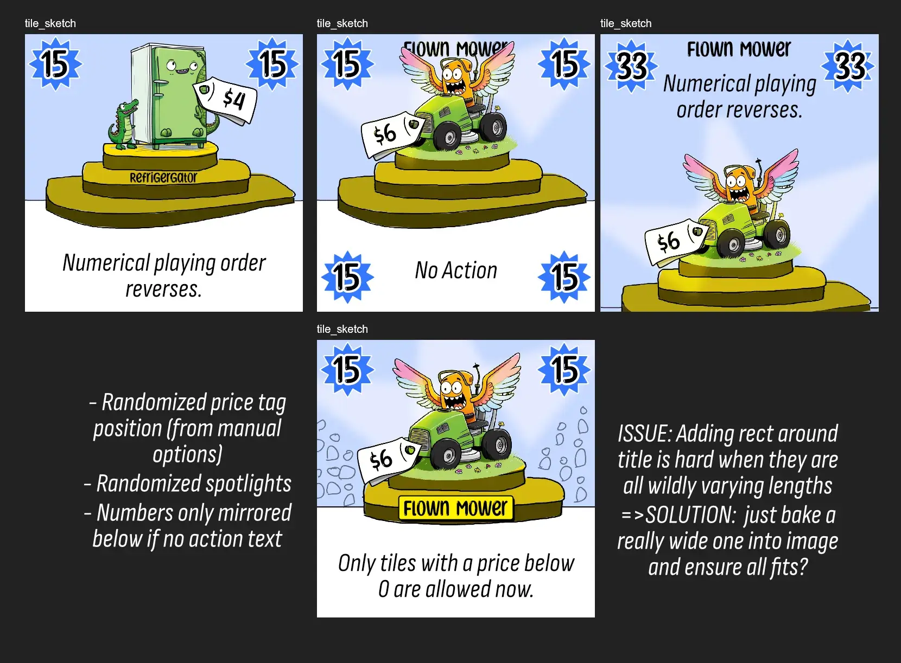
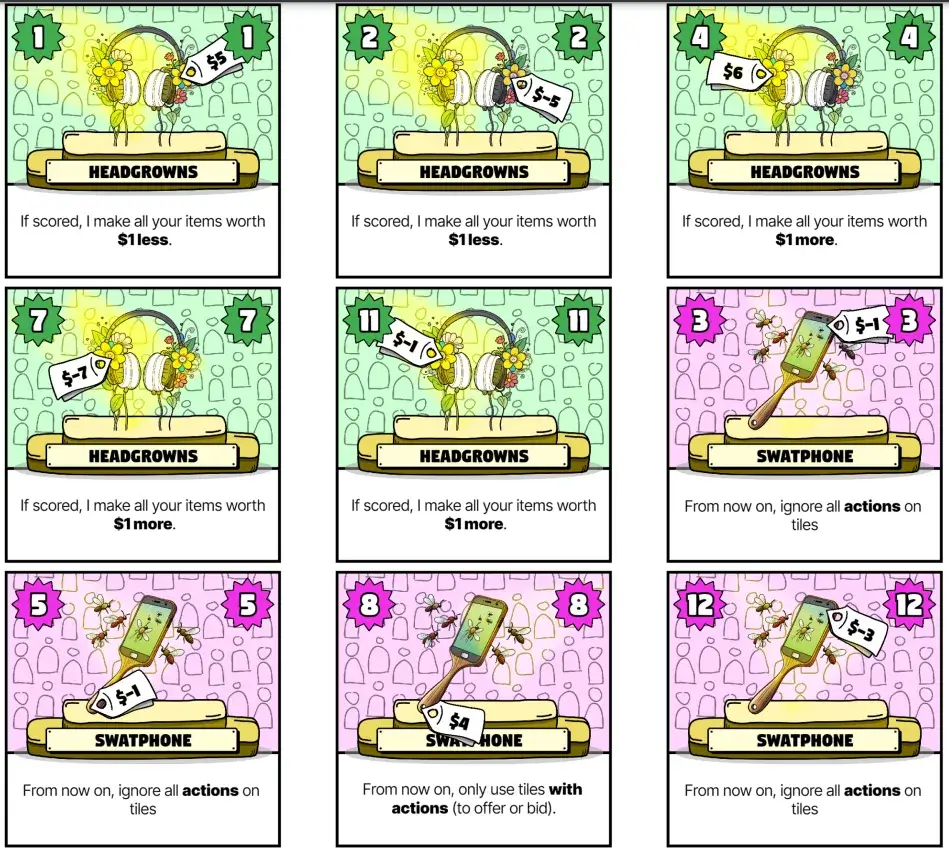
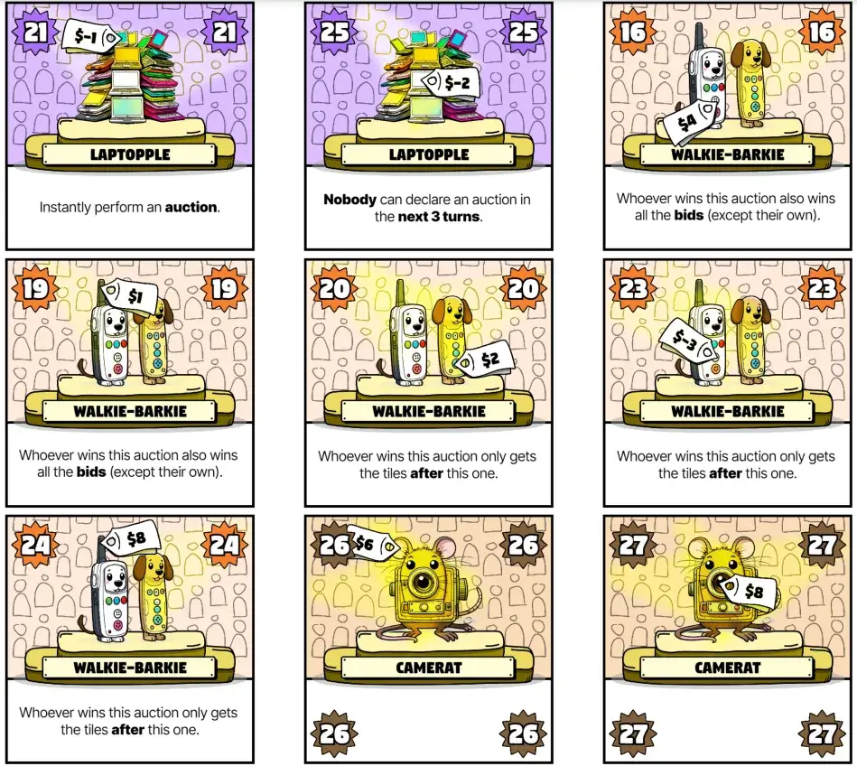

Welcome to the devlog for [I Bid You Not](https://pandaqi.com/i-bid-you-not/)

In this article, I'll briefly explain the development process behind this game. The original idea, what problems I encountered, why I made certain decisions, and so forth.

## What's the idea?

All I remember is playing / watching / reading the rules of some _auction_ board games. A few days later, my brain came up with an idea that sounded simple but promising.

Each turn, you either **add a card** (to the current offering) or **declare an auction**.

Cards are numbered. You can only add cards with a higher number than the previous. In a sense, adding to the offering means you want to sweeten the deal _before_ an auction might be called.

When you declare an auction, everybody bids using a hand card. The highest number wins and scores everything inside the current offer.

Then you play again, until the deck is empty and all cards scored.

_But wait!_ This is a bit too simplistic. It mostly comes down to getting lucky with cards now and guessing when/how others use their best cards.

So my head added a few wrinkles.
* The winner can _pass_ on the offer. To pay for the privilege, they add another card and lose one scored card.
* Now the _second best_ bidder gets the same offer---and can also pass if they want.
* This continues until somebody accepts (where the final player, who bid the lowest, is forced to accept)

Why did I think this was going to work? Well, because it adds variety and strategy.
* You can bid high, then pass and add a terrible card to the offer (with lots of minus points).
* You can bid low and _still_ win it, if the other players decide to pass.
* There's a way to offload bad cards and to keep good cards, reducing some of the luck factor.

The final wrinkle is very much an expected one: not all cards are created equal. Many have actions or special powers, such as "this round, the lowest bidder wins the auction" or "from now on, cards must be _lower_ than the previous when played to the offer".

As I've stated before, I mostly sort my ideas based on how small and simple they are, and you can see how this one was at the top of the list. All it requires is ~60 uniquely numbered cards and the rules explanation I already gave.

{}
Funnily enough, my original notes did not specifically say that your card needs to have a higher number when adding to the offer. So I can't be sure, but I'm _pretty sure_ that was my intention and I just forgot to write it down. Because without that, the whole idea of building the offer and numbering the cards becomes a bit pointless.
{}

## The Paper Prototype

So I grabbed a sheet of A4 paper, folded it, wrote some numbers + scores + basic actions on them, then cut it out and played against myself. 

{}
The actions are written using shorthands, of course. Such as "REVERSE" when numerical order is reversed. I'm not writing the entire action by hand on every tile :p
{}

### Keep some empty tiles

As usual, this showed that having an action on every tile is too much. There should be types that simply never have an action, and the middle numbers are most useful for that. 

_Why?_ I want to put actions on tiles that are also useful in other ways, such as for bidding. This asks a question of the players of "what's the BEST use of this tile?" The middle tiles are least useful like that, so adding an action on those would just mean you default to using the action most of the time. Which is boring.

### How to distribute actions?

Secondly, the number of useful actions I can come up with far exceeds the number of types. So saying "this type ALWAYS has this action" won't work. Adding actions randomly, however, makes the game messy and defeats the purpose of having types/illustrations on the tiles in the first place.

So we go for the second best option: each type has _two_ actions that are very much related. (For example, "from now on, all must play their HIGHEST tile" and "from now on, all must play their LOWEST tile".) These are placed 50/50 on the tiles.

Pairing actions like this both helps with figuring out useful actions, and allows us to have loads of variety ... without making the game messy or too big. The base game and expansions can just have ~8 unique tile types, which is a nice non-overwhelming number :p

### Balancing prices

Similarly, I originally planned to give each type a fixed "price". So, for example, the Smartphone was always worth 3 dollars. This runs into the same issue, though: not enough variety. Some types would have to _always_ be a negative price, restricting how they're used.

It's more dynamic if prices are randomly distributed, with about 66% being positive, and 33% being negative. (Yes, negative price makes no sense thematically. Just assume it means "losing money on this product" or something. I'm too tired to change it now.)

Besides that, it's really hard to test this game by myself. Not knowing what others will do and how they secretly bid is a _huge_ part of the game. It _works_, that's what I can tell, so let's just jump in and quickly make that so I can playtest it with others.

{}
There's a gap here of about a month in which I was very sick and forgot about the game. That's why this devlog is quite a bit shorter and more summarized :p
{}

### The recurring issue of order

The recurring issue in games like these is that _higher numbers are better_. So if you get lucky with your starting hand, having some of the highest numbers, you'll just ... win.

Of course, the initial design already combats this.

* Bids are simultaneous, so your high number might be timed wrong and still outbid.
* You can skip winning, so rounds are still won by lower numbers.
* Higher numbers are _also_ useful inside the offer, so they might be used elsewhere and lower numbers can win a bid.
* There are a few actions to _reverse_ order.

However, one action that "reverses the auction" isn't enough. Especially when you add the expansions, these cards will only be like 4% of the deck. Being able to reverse the auction only once every 25 rounds isn't great.

So what do we do?

I could add this action more often. But even then you might just decide not to include those types (I want you to be able to play with _any_ deck configuration). And repeating this action so often would make the game overwhelming, as then almost _every_ tile has an action.

No, we need some _built-in_ way to reverse the auction. That has always been the only true solution to these problems, in the many similar games I designed before.

In the end, the rule for this became: 

> If **no bid** is higher than the highest offer card, or lower than the lowest offer card, the auction **inverts**: sort players from _lowest bid_ to _highest bid_.

This is simple, but also extremely dynamic and entirely within your control as players. If the offer is very small (with numbers close to each other), the likelihood of inversion is near 0. If the offer has a large spread of numbers, it's much greater. But even _that_ you can control---so if you don't want inversion, for example, push to keep numbers close and declare an auction quickly.

At least, that's the vision. We'll see how well it holds up under more playtesting scrutiny.

## Creating the tiles

At some point, I decided I wanted a wacky, cartoony, simple art style. I thought it'd help with generating weird mashups of products, because I wanted each product to be the visualization of some "pun" related to an electronic device.

This also meant the rest of the tile had to match. I thought about things related to _products_ and _selling_ and _marketing_, and eventually ended up with the following idea:

* The numbers are placed inside those many-pointy-stars that they use all the time on sales and advertisements. (Such a star usually contains a big "50% OFF!" or something)
* There's a wonky podium in the center, with the product sitting on top.
* Random spotlights are distributed around it (by my code), lighting it up like it's some big presentation.
* And the "price" value of the tile is literally a price tag attached to the illustration. 
  * I manually selected "good locations" for this per type. Then, in the code, it just picks one at random and places the price tag at a semi-random rotation.
  * Actually _randomly selecting_ the location of the price tag would be terrible, as it has a high chance of simply not touching the product at all, or obscuring an important part.

All of this has simple, black, not-perfectly-straight borders around it. As if it's all a cartoony sketch somebody did. (In which case the trick is always to make it just _clean enough_ that it's not messy or annoying.)

{}
Never trust the colors on those sketches. They're usually made late at night, as the last todo item of the day, which means my screen has a blue light filter on and I can't judge colors. In this case, also don't trust the fonts, they were placeholders from a previous game.
{}

The biggest challenge was having this much layout going on and _also_ keeping enough space for any action/power text on it. Some of them are pretty long and I can't find a way to shorten it, so it all has to fit. A simple, tight font helps with this.

In the sketches, you can see I grow/shrink the size of that podium, move it around, etcetera to find a solution.

## The Final Material

Thanks to a relatively simple art style and minimal material requirements, the jump from idea and sketch to final material happened extremely quickly. Nothing special to mention there.

So, here are screenshots of the final material.

Including both expansions, this comes down to 8 pages to print and cut. That's pretty much the maximum amount I've established over the years, so that's fine. (Base game 4 or 5 pages, expansions should add only 1 or 2 each.)

Numbers are semi-randomly chosen. Each has a base value that's nicely spread out, but from then on it just finds higher and higher numbers (that aren't taken yet) with some random spacing between them. I've never done that before, and I don't know if the game actually needed it, but it was something to try. (I call it the "stagger" algorithm in the code.)

When a tile has no action, the numbers are simply duplicated at the bottom. This usually works, in my experience, and looks better than completely removing/changing the bottom part on actionless tiles---that would make tiles look very inconsistent.

My biggest concern are the actual actions and where they're placed. I'm sure some of the actions should be swapped between base game and expansions, and perhaps some actions work much better when they're on _high_ numbers instead of _low_ (or vice versa). But I can't know that until I've tested the game.

So ... let's do that.

## Playtesting & Polishing

@TODO: Write notes from playtesting, make changes, write conclusion