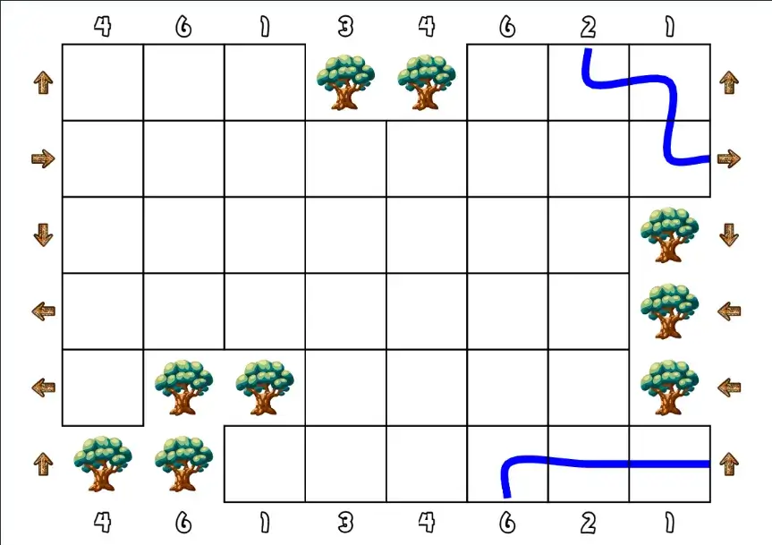
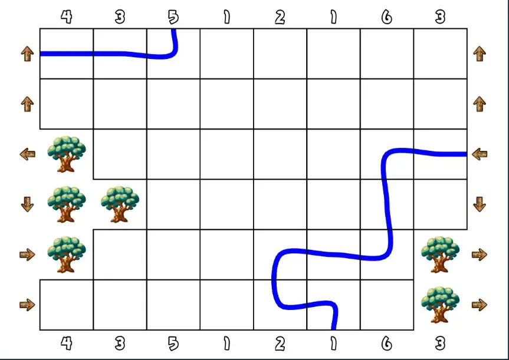
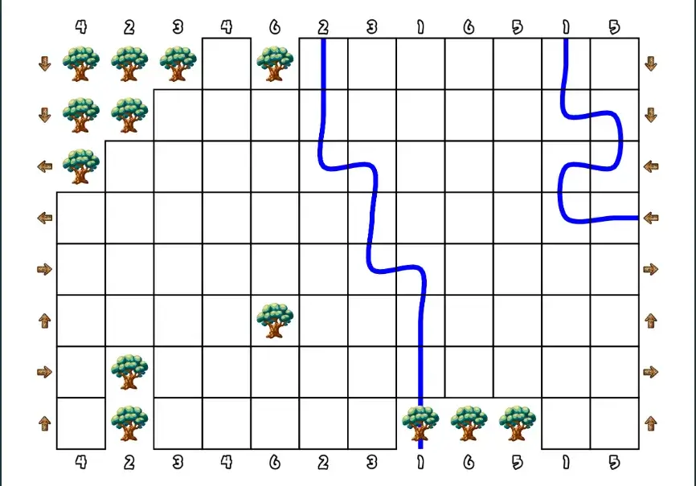
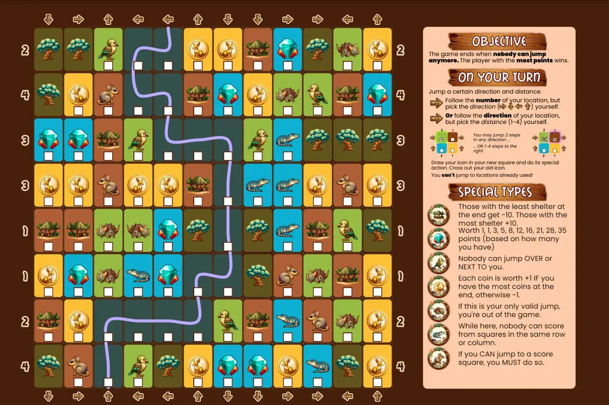
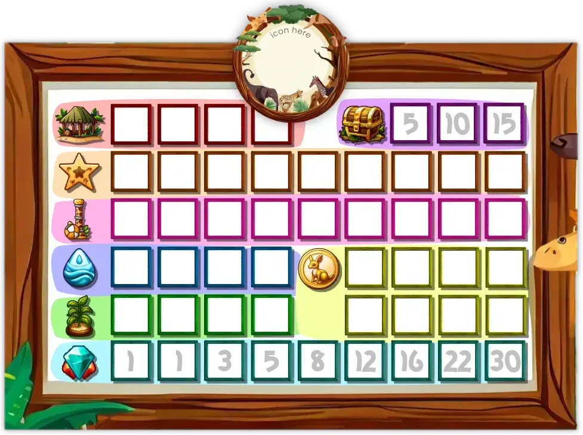
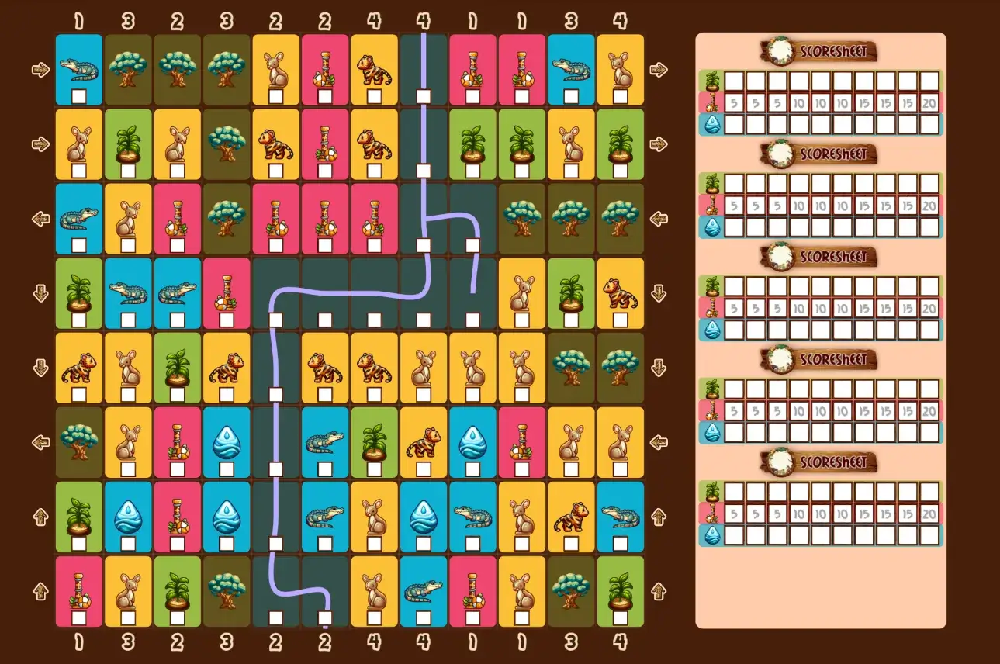

Welcome to the devlog for my game [Kangaruse](https://pandaqi.com/kangaruse). I'll (briefly) explain the design process for the game. Where did the idea come from? How did I develop it? What interesting problems did I have to solve?

## What's the idea?

Well, I woke up one morning with a pressing thought / idea.

> What if everyone was kangaroos and you played a game by jumping to the squares that scored you the most points?

Of course, that's not enough for a game, so I ran to my laptop and worked it out a little further.

* **Objective**: score the most points.
* **Turn**: jump to a new square ( + do whatever action belongs to it).
* **Catch**: once visited, the square is "used" and can't be visited again.
* **End of game**: when nobody can do a valid jump anymore.

I loved this idea because it was extremely _simple_ and _thematic_. Every turn, you perform the same simple jump action. The board automatically "fills up" (removing possibilities, drawing closer to the ending) and you just have to find the path that scores you the most points in the end.

Once I wrote it down, it quickly shot up in my planning (or list of "which game do I want to make first").

## The jump mechanic

One major question remained, though. **How do you jump?**

I wrote down many possibilities.

* Jump anywhere.
* Jump to anywhere within a certain radius. (So, any tile 2 or 3 squares away.)
* There's a list of jumps next to the board. (Like "3 squares north" or "5 squares west".) Each turn, you pick one and cross it out.
* Each _player_ has such a list (only for themselves).
* The tile _itself_ has options for your next jump.
* Roll the dice to determine how far you may go, but you choose the direction yourself.
* Etcetera.

But I rejected all of them. For example, the "list of jumps" seems _fine_, but ...

* It doesn't scale with _any_ player count. (Which means you can only play a certain board with a certain player count, otherwise this list of options is too long or too short. Not nice.)
* It takes up a lot of space on the paper.
* There will often be an "obvious best move", if you search long enough. It would make the game way longer and less interesting.

Instead, I found that you really have **two choices**:

* The distance of travel ( = how many squares)
* The direction of travel ( = north, east, south, west)

And when you have two choices, a useful technique (that many boardgames use) is to say the following.

> One of them is restricted, the other has free choice.

For example, maybe the game gives you "5 squares", but you may determine in which direction. Alternatively, the game might give you "move north", but you may determine the number of squares.

This is a nice blend between having a choice and being restricted (which forces you to think ahead and make tough choices).

How do we apply this to a piece of paper? 

* Each **column** shows a number (at the edges)
* Each **row** shows a direction (at the edges)

Then the rule for jumping can simply become ...

> Pick the number of your column, then choose any direction. **Or** pick the direction of your row, then choose any number of squares.

Below is a first sketch of this idea.

Hopefully you can see why I was enthusiastic about this idea. It's such a simple rule that immediately adds so much depth. You have a lot of options---while at the same time clearly ruling out a lot of options.

And as soon as you move to a new square, one of these two properties change, making sure you never get stuck.

The actual jumping, **in practice**, simply means ...

* Cross out your kangaroo at its current location.
* Draw it again at the new location.

## How to score points?

### First try

The obvious first idea is to add squares that show numbers! (As the sketch above already shows; see the squares with the star symbol.)

That's fine, but ...

* Not that interesting or diverse. I mean, you'd obviously start at the area with the highest numbers, then jump to the highest number you can find. No real interaction, not enough depth.
* Where do we draw the kangaroo? Now the type/text takes up the whole square. Making the number tiny or pushing it against the edge would be really ugly.

### A better idea

Instead, I like to move the actual point values _off the board_. Keep the main playing area clean and simple.

What does that mean? For example,

* Instead of this, we add some icon to the square, say a treasure chest.
* Then, in the rules, we say "each treasure chest is worth +3 points"

That's very simple, but we can add many more mechanics this way without cluttering the board. For example,

* Add an icon of a coin
* The rules say "your coins score +1 point, but only if you have the _most coins_ of all players"

It's way more dynamic and allows more interesting resources to collect. At the same time, it frees up space to draw our kangaroos.

At the same time, this is a slightly "indirect" mechanic. It takes an extra step to score points, instead of just "land on a +3 square, you get +3 instantly". In my experience, this might trip up some new players, so I'll probably move this to an expansion or higher difficulty level.

### Two options

Even so, we have two options. 

* Either make the icon big, then add a smaller area to draw the kangaroo.
* Or make the drawing area big, then add small icons near the corners.

I can't be sure right now, but the second option seems better. Asking players to draw their personal player icon in a _very small space_, the whole game, seems like asking for trouble. It's easy to make the board unreadable, or completely lose where you are, or draw something unrecognizable.

Nevertheless, I can simply code support for both and see what happens.

_What's that third option?_ Yeah, let's talk about that now.

### Track score during or after?

Now there's one final issue. We can count score **during** the game or **after** finishing the game.

Whenever you jump, you _cross out_ your previous icon. (To make sure it's clear you're not standing there anymore.)

But ... if score is counted at the end of the game, how will you know what all your squares were? You've crossed out your icons at all your previous locations!

If I want to support counting _afterwards_ (when the game is done), I need some extra way to mark a square as "used" (without crossing out your original symbol).

After jumping, you merely cross out this bottom-left section, but your icon stays intact. To me, this feels like the cleanest option.

* One large symbol in one corner.
* An empty space in another corner (to mark being used)
* And the rest of the cell is entirely available for drawing your player icon.

{}
Of course, an alternative is to say "when crossing out your icon, don't be too eager: keep it recognizable". But that's just really vague and, in my experience, will lead to chaos once people start to get into the game and forget to do this.
{}

Still, I also want to support counting _during_ the game. For that I'd need some extra section or piece of paper to track things as they happen.

I like my One Paper Games to _really_ be playable with just one paper. As such, I don't want to ask players to "write your score on another paper" or "keep track on another paper".

So that was the final requirement: provide a mode that allows tracking score on the same paper. (Some setting that, when turned on, reserves a part of the paper for writing score.)

All of these things will just be **settings** players can pick themselves. (Although, to prevent overwhelming new people, I'll hide some of them to only be used by _me_ while developing.)

## Generating random boards

### Art style

Finding fonts was 1 minute of work.

* I've always liked the **Poppins** font and thought it had a bouncy or playful quality to it (without losing legibility or looking childish). But I never used it before in a project! So that became my main font.
* Then I searched for jumpy / bouncy / wildlife fonts and quickly found the header font (which is **Mail Ray Stuff**).

I like the combo, it feels suitable, let's go.

Because this game needs so much space for _drawing_ your kangaroo, colors aren't that relevant. Most of the paper will be empty whitespace anyway.

As for the icons/illustrations, I wanted something related to ...

* Wildlife / Nature / Jungle (yes, I know kangaroos don't live in the jungle, I'm just listing general design vibes here)
* Jumpy / Bouncy / Active / In motion
* The minimal whitespace layout of the paper, which means the icons should probably be _simple_ and have clear _outline_.

In general, if you enable colors and decorations, I just want the paper to _look_ like a nature reserve or a savanna in which you're hopping around. Not some abstract grid on a paper!

In the end, I noticed that ...

* The AI responded really well to "safari" and "wildlife themed"
* This allowed me to generate many images that fit the theme and fit together
* But, as usual, the AI sometimes got things wrong, requiring me to edit or repaint bits here and there.
* Additionally, I manually created a _simplified_ (grayscale) version of each cell. (It's not too much work, while an AI understands none of that.)

### Funky Grids & Rivers

After creating many games with basic rectangular grids, I wanted to try something new. (Just like I did with Hand Pies, a few months ago.)

In this case, I thought to hit two birds with one stone by **cutting chunks out of the grid**. Why?

* To create a more organic (or visually interesting) edge to the game board.
* To limit movement options a bit further (depending on where you end up)

The idea is simple.

* First, I create the "perfect" grid. A rectangle, all cells represented.
* Then I pick a cell on the edge and **randomly "grow" it** for a few steps.
  * Pick a random neighbor, add it to the group.
  * Repeat a few times, picking unused neighbors each time. 
* Then I **cut** this whole group of cells from the board!

It's like taking a few "bites" out of the game board. Because I do so in _groups_ (not just one random square each time), the result will still be connected and coherent.

I decided to display a tree in all those "hole cells", to make the board look more like nature, but also to clearly communicate that you can't jump on or over these squares.

Similarly, I know that these games can quickly become _overwhelming_ when I try to fill the whole grid. I needed a good chunk of empty squares anyway, so why not make thematic use of them? 

I added **rivers**! 

These are random paths that run from one edge to another. (That's literally the algorithm. Start on an edge, pick random neighbors, until we pick a neighbor that's part of a different edge. Of course, there are some safeguards, such as one that prevents rivers from getting longer than 10 tiles.) 

Any cell with a river can **not** receive a special type anymore. In practice, this means 5--10 (connected) tiles have no special action.

### Balancing

The trick with random generation, as always, is balance. 

We don't want to accidentally add a "go north" arrow to every row and no other direction whatsoever :p

The solution is quite straightforward.

* Count the number of rows, divide by four: that's the amount every _direction_ should be in our set of options.
* Count the number of columns, divide by "the max number I want to display" (probably 6): that's the number of times every _number_ should be in our set of options.

With these two lists already prepared, I can just draw randomly until I've attached a direction to every row and a number to every column.

Secondly, we need balance in the actual _types_ displayed. This, however, depends on the types themselves.

Take my coin example from before. It only scores +1 per coin _if you have the most coins_. This means we need _a looot of coins_. As such, those should probably have a higher probability (or "minimum required")

Conversely, if we add a really powerful square (like "if you stand here, your jump can _wrap around_ the board"), we don't want to add it too often.

Similarly, if I add a section to the board to "track score while playing", the content will also depend on the types included. So we can't work on this until we _know_ our list of cell types and what they do.

Besides that? This is a really simple game, so not much more is needed!

Let's dive into the different special squares now. (And once we have those, we can place them on the board and we're almost at a finished game!)

## Square Types

As always, I start by writing down _everything_ I can think of. Usually, this creates a list of 20+ ideas, of which more than half turns out to be rubbish.

Still, writing that initial list is important to help _realize_ why those first ideas are rubbish.

For example, my initial list of special actions had _no interaction_. They said things like ...

* If you arrive here, immediately jump again
* If you jump from here, you're allowed to jump over trees.

Which is ... fine. But with rules like these, the game just turns into a solo puzzle with only indirect interaction. (Others might visit a square you wanted to visit before you.)

You can plan your whole route ahead of time and the likelihood of anything messing it up---requiring a change of plans---is slim.

Instead, rules like these are much more interesting.

* While here, score squares in the same _row_ or _column_ can't be used.
* Upon arrival, destroy two adjacent (unused) squares.
* Starting from here, you may not jump over other players.
* While here, _all_ player must obey the direction and number of this cell.

With rules like that, you constantly _change_ the map. You are influenced by other players, and you influence them a few turns later.

The game becomes a tug of war between "do I need to take some special actions to obstruct others/shield myself?" and "do I go for the points now?"

And, in my eyes, every good game is a tug of war---both inside your own head and against your opponents.

That gave me a list of ~16 actions. 

Adding the expansion allowed another ~5 actions. That expansion is all about different score squares and collecting them, which always means you can now add actions to play with those new rules. (Such as: "You're not allowed to jump from here to a score square".)

I'm not sure how well they all work. This is purely based on experience, trying to think ahead, and imagining what kinds of actions are interesting. Actually _testing_ the game will have to reveal the ones to keep and the ones to ditch.

I did, definitively, decide to make the special squares **animals** (which are unique or mostly correlated to _Australia_, you know, with the whole kangaroo theme).

Abstract icons didn't fit the theme. Besides, I've done that a million times and wanted something different.

Using objects or plants was difficult, because it blended too much with the decoration and the general map. It's also hard to make these _recognizable_ or attach "intuitive" actions to them.

With animals, however,

* They are recognizable and speak more to our imagination.
* They fit in: the board is designed like nature, the animals walk around as the main characters.
* People associate things with animals by default. For example, crocodiles are _dangerous_. So, the crocodile receives a very _bad_ or _impactful_ special action. This helps people remember the rules.

I don't really have an image to show for this, as all of this is "rule work". So let's quickly continue with some more "map work", so I can finally share pictures of the latest versions of the game!

## Nicer Maps

### Holes

My initial attempt at these wasn't ideal yet.

For example, holes were grown from random edge cells, which frequently caused all the holes (or trees) to be _one big clump_ in the same corner. I also noticed I'd like a few of these holes in the _middle_ of the grid, not just at the edge.

How to fix that? I created a function that returns the cells of the grid categorized by their _edge_. (So, a list of all top cells, all right cells, all inside cells, etcetera.)

Then the holes algorithm simply picks a random cell from a _new_ list every time. This ensures that we cycle through all 5 possible positions (the four edges, and not on an edge) for the first five holes, creating a nice spread.

### Rivers 

Similar story here. Completely randomized rivers are, as you expect, hard to control. Sometimes they look great, sometimes they make the board near unplayable.

As such, I changed the algorithm to ...

* One river is placed that _crosses the whole map_. (One edge to opposite edge.)
* After which one or two smaller rivers _branch off_ of this main river.

A river across the map simply looked the best and made the board most playable. (Otherwise you might have a river, for example, that curls in on itself, completely making one corner of the board mean nothing.)

Branching off also looks more natural (and efficient in terms of space) than starting new rivers each time.

### Balancing (as always)

After many games, I've learned to use the following structure.

* Repeat this loop until we have a good board ...
  * Generate a board
  * Evaluate it
* Display that board.

At this point, it's time to do the **evaluate** part!

This _checks_ things that could be bad, and if found throws the whole board away to try again. Most of the time, you want these checks to happen before / while generating the board. For example, I'm already smart about the placement of the river and the holes, to prevent throwing away 1000 boards before finding one.

But some things just can't be (easily) handled that way. So I evaluate them afterwards. For this game, the evaluator ...

* Checks if the **score squares** are evenly distributed. (It counts how many are in each quadrant of the board. If any of those numbers are too far apart, it's a bad board.)
* Checks if the **starting positions** are evenly distributed. (It counts the closest distance between two of them, which must be at least 3 squares.)
* The **mistletoebird** wraps around the board. This only makes sense if it's positioned close to the edge. As such, the evaluator checks the closest edge for all these birds (if included), and discards any board with a useless one.
  * This might seem harsh, but in reality the likelihood of being 4+ spaces from an edge is _very low_. This just ensures no board has truly useless squares, which is an overall improvement. 
* Checks if **holes** are evenly distributed. (Holes might accidentally clump into one _huge_ hole, which is both ugly and breaks the game a bit. So I do a "flood fill" of the board---which tries to create the largest group possible of the same type---and then check for the _largest_ clump of holes.)
* Checks if there are **no unreachable locations** (a section completely walled off by trees). 
  * It simply uses the same flood fill algorithm as with holes, but inverted: now it combines all cells that are NOT a hole. 
  * If this leads to _one_ large group---great! Everything is connected!
  * If this leads to multiple groups---discard, there are unreachable parts.

{}
Fun fact, I forgot to shuffle ( = randomize) my array of types, which is why I was stumped for 30 minutes as to why my score squares seemed to always appear at the END, all at the SAME TIME.
{}

### Decoration

As said, I want it to look like more than a grid of squares printed on a paper. Nothing too fancy, but just some decoration and general feel that you're in some natural/wildlife area.

Firstly, the entire background became dark brown, and the side bar a very light brown.

Then, the grid was too harsh. I softened and softened it ... until it's barely visible in the final version. Instead, tiles are a rounded rectangle with a color specific to what it contains. (For example, if an animal is mostly yellow/beige, I'll set the color of their cells to that.)

Initially, I randomized the location and size of these rectangles slightly (to get a more natural or organic look), but that just looked ... messy and incoherent instead. So I scrapped that.

This approach, however, made trees and rivers look very similar to other squares. As mentioned before, I actually _want_ them to look different and "break up" the board. (Otherwise it becomes this overwhelming, homogenous blob of special squares.) So, I made their background much darker.

Secondly, I made the commands at the edges (number and direction) _bigger_ and inverted their colors. 

First, it showed a white number with a black outline. Now that the background is dark brown---near black---this is useless and the outline falls away. Inverted, the number becomes much bigger and easier to read. I added a similar colored outline around the arrows.

The sidebar received _headers_ ("objective", "how to play", "special types") which are just some text on a wooden plank/wooden texture. These, again, break up what would otherwise be an overwhelming wall of text. (And they just look nice and thematic.)

With these changes ... I actually decided not to do any more "decoration". It's already heavily decorated and illustrated at this point. The board is quite full, and I surely have the tendency to ruin my own decisions by adding _too much_, so I left it at that. (Which, to be clear, breaks my heart because I have all these beautiful safari-themed images and patterns generated by the AI!)

## Scoring

Only one issue remained. I had made a scoresheet for _all_ scorable types---one image for everything---which you could optionally include on the board.

Yes, it's pretty and colorful, but everything else is a disadvantage :p

Only 3 of these fit on the board. Which was annoying, because the game should be playable with up to 5.

{}
I blindly wrote the number 8 when I started the project, but 8 players around one crowded paper is just insanity. It went down to 6, but my experience with previous games still taught me that was too much. Too many different scribbles on the board, too much waiting for your turn, etcetera. The game settled on a maximum player count of 5.
{}

Additionally, it was a bit overwhelming. There are **eight** possibilities, each with their own scoring rules. 

Lastly, playtesting quickly revealed that only having _one_ score square in the base game (the star) was just too simple and constricting. These should be the lifeblood of the game---scoring is the way in which you actually _win_, any other squares just mess with your jump---so there should be at least a couple of them in every game!

So why am I making my life so difficult? 

### Idea 1: two groups

First, I decided to split the score cells into **two groups**. 

Whenever a board is generated, it just picks _one_ of them (and forbids all the others). This allows me to provide a much smaller scoresheet, of which 6 easily fit in the sidebar.

How do we create such groups?

* **Coins**, **Gems**, **Toys** and **Shelter** need a lot of squares for their rule to work. These should be in _different_ groups, for balance.
* Food and Water need each other, so they go together. Now we already have one group: Food, Water, Coins, Gems.
* The other four go into the other group.

This, however, proved less than optimal. First of all, I didn't like that this heavily restricted the types of boards that could appear. And only because I couldn't fit optional _scoresheets_ otherwise!

Secondly, it didn't actually save that much space. We're still drawing elements on score sheets that _aren't on the board_.

Which means there's only one option left ...

### Idea 2: randomly generate the scoresheet

Create the icon + squares + decoration _from code_. This is, unfortunately, more work and I can't make it look as good. (Some effects are really easy in design/vector software, while impossible or really hard when drawing to a web canvas.)

But after lots of thinking and experimenting, it's just the better option. Only scoring that's _relevant_ is displayed, and any combination of score squares _can appear_ on any board. 

It fits the maximum of 5 players inside the sidebar. (Barely, though. Fortunately, testing already revealed that a maximum of 3 unique score types was a good fit, so I'd already added that. With 4 or more, it still wouldn't fit!)

All these changes also ... allowed me to **remove the expansion**. There's no point to it anymore. Score squares can simply appear at random. (And special animals that would require 2+ score squares to work can, therefore, also appear at random!)

## Playtesting & Finishing

I also created simplified versions of all the animals. I think the illustrations are beautiful and like the richness, but some people have trouble with a board that's detailed like that. Just like I always provide an "inkfriendly" version (mostly grayscale, no backgrounds, ...), I'm trying to provide a simplified/abstract version as well (especially in more strategic/calculating games like this).

Then it's a matter of setting sensible probabilities and restrictions on all types. 

{}
A very powerful special type shouldn't appear loads of times. Types that I think are easiest to understand or most fun to play with should have a higher probability.

Most importantly, types that mess with the core rules (such as the platypus that says "jump any way you want from this square!") should have a LOW probability. That's another lesson I've learned: keep exceptions to the core rules _exceptions_. Don't add so many that the game basically becomes three different games.
{}

Then the boards are finished and I can do final ("official") playtesting with others.

With the rules decided upon, I create the images and interactive example for the rulebook. 

In such a simple game like this, the interactive example is simply an image that shows: "you are here, all your valid jumps are this and this". Because, well, jumping is all you do, and it's the only rule that might take more than two seconds to understand.

With all of _that_ done, I create the final marketing materials (header, icon, page style) and the game is done!

When it comes to playtesting, not much more needs to be said. The game works. Despite some minor issues with balance and generation (there's _always_ more tweaks to be made to probabilities, points, random generation, etcetera) ... it all just works wonderfully.

A very simple game. Easy to pick up and play anywhere, with anyone, in little time. Boards are quite pretty and distinct---if I may say so myself---without looking childish or going overboard. Being able to explain rules (or score points) _on the paper itself_ is also a great addition that I'll surely try to turn into a tradition for all my one paper games.

So that's it for this game!

Until the next devlog,

Pandaqi