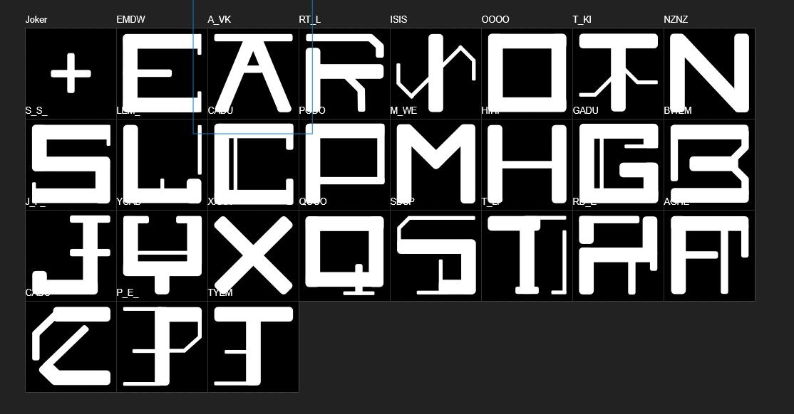
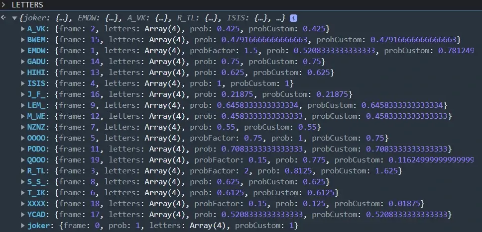
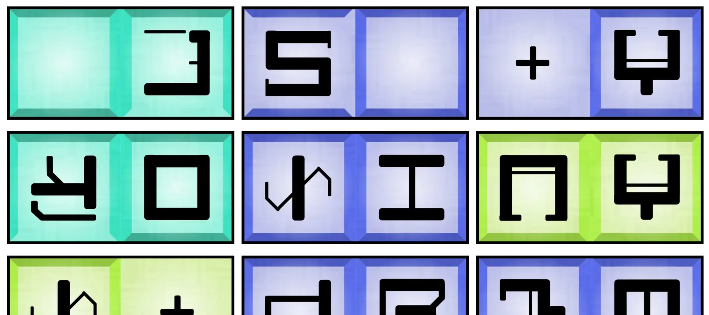
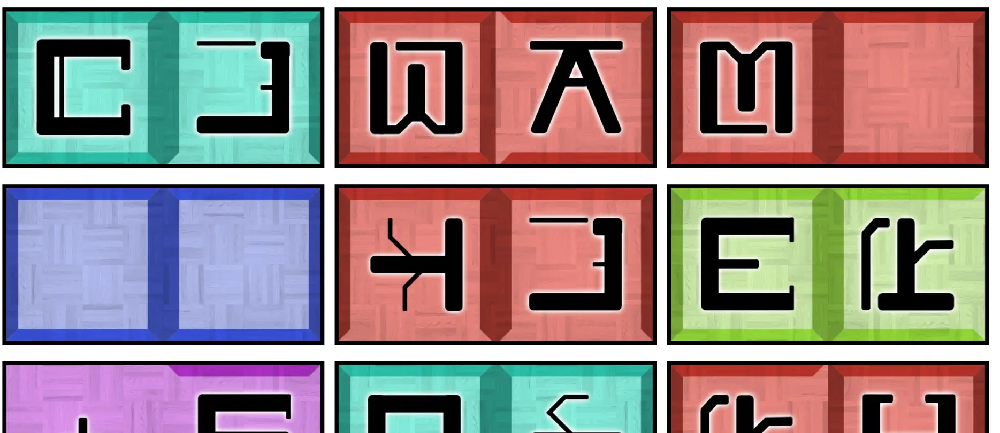
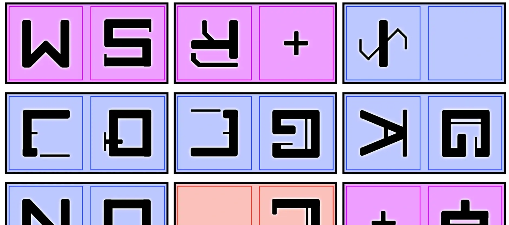
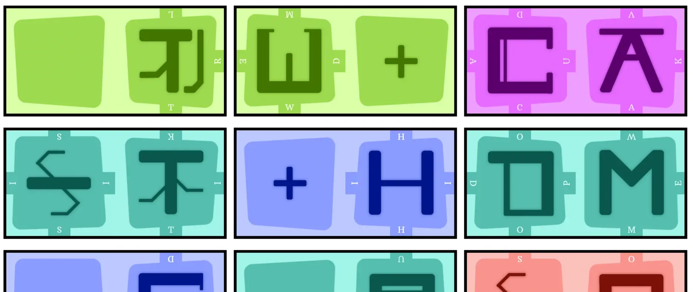
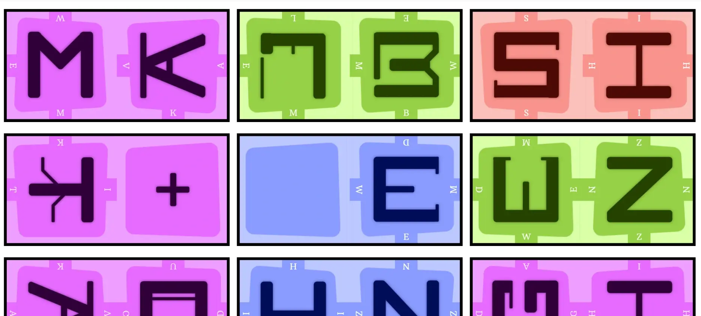
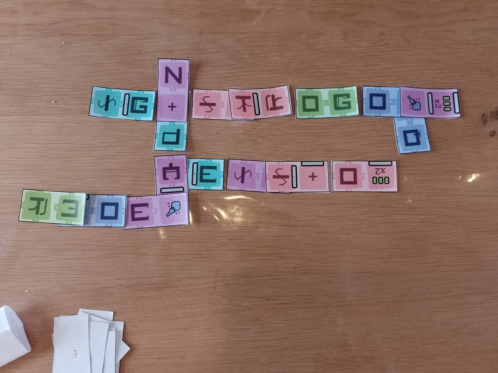
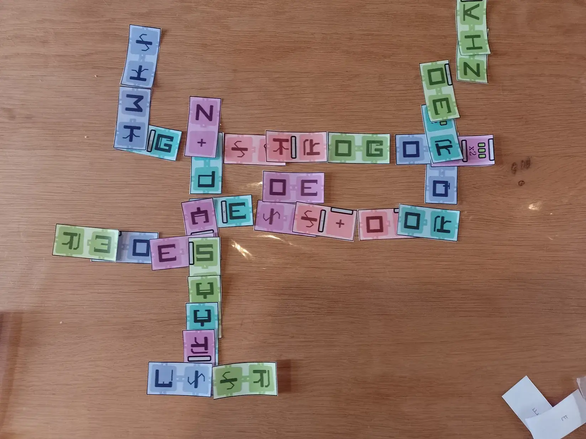

Welcome to my devlog for the game [Keebble Domino](/keebble-games/spell/keebble-domino/). As expected, it's a part of the [Keebble Games](/keebble-games/) project.

When thinking about how to make an improved Scrabble-like game, I got three ideas at the same time. The original version of Keebble was the easiest one to make. This was the hardest one to make, which is why I made it last.

Why?

Because ... I had to invent my own **ambigram font**.

## What's that?!

An ambigram is string of text that is still readable (or maybe spells a different word) when viewed in a different way. The most popular one is "upside down": when you flip the text upside down, it still spells the same word.

Obviously, this requires very precise design of the letters. Because they must clearly look like a certain letter, even when upside-down, or viewed from the side.

Why am I explaining this? Why do we need this?

## The original idea

Because this was my idea for Keebble Domino:

* Players hold dominos in their hands. (Cards with two letters on them, one at the top and one at the bottom.)
* You play a Scrabble-like game using that. Connect new dominos to the board to form new words!

A simple idea, right? But here's the issue: **reading direction**.

In regular Scrabble (and Keebble) words are placed in one direction. Left to right, top to bottom. Many times players have asked if they can write some word in reverse---the answer is obviously always no :p

But if we stick to that rule, this whole game falls apart. You can only place each domino exactly _one way_. Which means we've just made a worse (much harder) version of regular Scrabble. Any other orientation? It's invalid, because the letters would be oriented in the wrong reading direction.

The solution? Ambigrams. Letters that still work when _rotated_ or _viewed upside down_.

This way ...

* You can orient most dominos any way you like
* There aren't any players who have to view the board "upside down" the whole game. (And who will use that as an excuse when they lose at the end :p)

That's why I needed to create special letters. I also knew this was the crucial part to get right, so I worked on this before working more on the rules. (And I was right: designing these symbols automatically showed me which rules would work, and which were just impossible this way.)

## How does that work?

### Finding combinations

At first, I tried lowercase letters. They are prettier. The general marketing for the Keebble games uses the _lowercase_ letters of that font. I thought I'd be able to get away with more, as you can give lowercase letters all sorts of decoration and extra lines.

Yes, I could make each letter mean _four different letters_. (Depending on the direction from which you looked at it.) But they were _very hard to see_. This game becomes a chore if it takes 5 seconds to recognize what letter you're looking at.

So I switched to uppercase letters. These are more regular and consistent. (The whole idea is that they all have the same blocky form.)

I realized our alphabet already has a lot of symmetry and reused symbols. For example ...

* The **O** ... remains an O from all directions. (Same for **X**.)
* The **M** and **N** turn into **W** and **V** when upside-down.
* The **A** upside-down will be a **V**
* If you soften the vertical bar, you can get four letters out of this: **D**, **U**, **C**, **A**
* The **I**, **J** and **L** are already almost identical in most fonts---which, frankly, actually caused issues

I could get maybe 10--15 symbols rather well using this technique. Easy to decipher, easy to draw.

### Not everything fits

But I had to concede from there on. Some symbols just don't fit with any other, or one other letter (at most). The **K** caused me a lot of trouble, for example.

At first, I wanted to make every letter mean something _from all directions_. This objective changed. I decided to allow letters that had "nothing sides". When viewed from that direction, they didn't look like any letter, and meant nothing.

These sides would simply be a "wall" or "full stop", like the other Keebble variants. When encountered, this square would just be empty and any word would stop there.

I also grabbed a frequency chart ( = how often each letter appears in the English alphabet). For the first 15 letters, I wanted at least _one_ symbol where that letter is absolutely clear. Like, one symbol where that letter is the "main one" that is the first one you recognize. The uncommon letters often only appear as part of something else, never the main thing.

{}
I had no idea that "R" was the third most common letter. It was also an annoying surprise, because that letter is _hard_ to combine with anything else.
{}

{}
Also, the Scrabble letter values are interesting. If you look at the percentages, the letter E appears `~11%` and Q appears `~0.2%` of the time. In other words, if E is worth 1 point, shouldn't Q be worth `11/0.2 = 55` points? :p I have a hunch they just thought "Q is the rarest letter, 10 is a nice round number, let's make it 10 points" and scaled everything based on that. And it works: I use that scale because I think it's perfect for these word games. But I'm not sure where it comes from.
{}

### Probabilities

Lastly, some letters should be way more prominent than others. I had to design symbols in such a way that common vowels and consonants appeared regularly in combinations. (Symbols that're only 4 _very rare_ letters will be very annoying to receive. It's better to combine 1 or 2 rare letters with 1 or 2 common ones.)

This, again, led to an imperfect compromise. Some uncommon letters just combine really well and are therefore overrepresented.

After a few days of "drawing as many combinations of letters as I can imagine" in the evening (after my regular work was done), I had a solid set of symbols.

Even with these symbols, I need to set some probability for picking each of them (when generating material). Because they're still not created equally: the XXXX (... just an X on all 4 sides) should be very rare, while symbols with vowels should appear a lot on dominoes.

In the other Keebble variants, I used a simple trick for this:

* I have a table with the Scrabble point values of the letters
* The probability of picking that letter is `1.0 / value`. (In other words: higher value = lower probability)

I did the same thing here, but averaging the probabilities of the four letters in the symbol. Sides that mean nothing get some other, fixed probability.

{}
I took this image a few weeks later, when the code was done. "probCustom" is a custom scalar to change the probability calculated using the trick above. For most letters, it is great! But for some I wasn't happy with it, hence reducing their probability by some hand-picked factor.
{}

Finally, I moved the most "hard to read" symbols to an optional module/expansion. If you want, you can enable them. They do add more variety and allow more letter combinations. But they also make the board look a lot more ... messy. So it's optional and off by default.

## Rules

As usual, I wrote a script to randomly generate my material for the game. Once I had a set of domino cards, I tested the idea.

As expected, it was _really_ hard to find words. Regular Scrabble can already be pretty difficult. Now you _had_ to find something where pairs of two letters fit perfectly.

As such, the first step was to actually make the game feasible. 

### How do you read the board?

Now comes a vital rule.

> At the start of the game, players should sit on one clear side of the board: top, bottom, left or right.

Why? Because letters mean _whatever they look like from your angle_. If you sit to the left, you view all letters from the left. They might say completely different things for you than for the player sitting opposite you.

As mentioned, this solves the issue of "having to look at the board upside down". It also makes the game more varied and unique for each player. 

But there's a downside: you can't "benefit" from other player's placing words. (Unless multiple players sit on the same side, which is absolutely fine.) They might play "house" ... but it only looks like house to them. To you it might look like 5 random letters.

I suspect this makes the game even harder. But I'll have to test this---see it in action---to make any judgments.

### Overlapping dominoes

I remembered a game called "Marrakech" which I adore. In it, you place little tapestries (shaped like a domino) _on top of other player's tapestries_. While playing, the board slowly turns into this pile of tapestries in different colors, and you're always trying to make most of that pile show your color at the top. (Look it up. Try it out. Really simple, really competitive and interactive, really colorful.)

Anyway, I could allow the same thing here.

> You're allowed to place one part of a domino _on top of_ an existing domino. (You may **not** cover an entire domino with a new one.)

This gives way more freedom. You can remove a letter that's in your way. You can place dominos much more freely.

That exception---don't overlap a domino entirely---prevents just "undoing" someone else's turn. Without it, you can just throw your dominos exactly on top of existing ones and basically erase all of that. That's never fun in a game. (It's also an important exception present in that Marrakech game.)

### Faster gameplay

In the original Scrabble, it feels terrible to do nothing on your turn. But you often can't do much more than stupid low value words. What happens? Players keep _thinking_ for 10 minutes, because they just _do not want_ to swap tiles or pass their turn.

This slows down the game immensely. It's boring for everyone else. You literally can't do anything, because you're not sure if you can place a word until it's actually your turn.

I wanted to prevent this. (And simplify the rules, so stuff like passing or swapping doesn't need to be explained.)

As such, I simplified it to

> On your turn, you place as many dominoes as you like. You score points for all new valid words, but you get negative points for all new combinations that are _not_ valid words.

Hopefully, this allows more satisfying (and quicker) turns. You're able to score "big words" and take a -5 or -10 due to some non-existing words for granted.

Of course, this pollutes the board. Over time, there'll be bunches of letters that mean nothing. (Especially combined with the issue of "the board means something different depending on the side where you sit")

Can we mitigate this?

* The "full stop" letters (sides that mean nothing) will add some extra space.
* We can enhance this by adding empty squares/full stops _on purpose_ into the dominoes.
* Overlapping can remove ugly bunches.
* Again, we can enhance this on purpose by adding a way to **remove dominoes** from the board

Slowly, the idea of "special dominoes" appeared. Just like Scrabble has special cells with "triple word value" and stuff, we can add special types to the dominoes. You use such a cell if your domino _overlaps_ it. This means these cells would start empty by default, adding that necessary space.

But we can take that much further (as I always tend to do :p). You might have ...

* A destroyer powerup => if you overlap that, you immediately remove one domino from the board
* A wildcard => this can be any letter, from any direction
* A powerup that _exempts_ you from those negative points (for words that don't exist)
* Conversely, a powerup that _forces_ you to only place valid word(s) in the same turn

Normally, I'd move this to an expansion. But I feel like these will be crucial to making this game function.

### Maximum board size

Scrabble is 15x15. My other Keebble variants use a folded paper, making them 8x8. I like the smaller size more (although it can be slightly _too_ small, if players play in annoying ways). It's faster, it's more interactive, you hit interesting limits (or opportunities) more quickly.

As such, I think 10x10 is the magic number. At any time, the entire clump of dominoes can be _at most_ 10 cells wide (vertically or horizontally).

There's a chance players forget this or miscount, but I think it's low enough for this to work. Ten is an easy number. Only 5 domino cards. This won't take too much space on a table.

### What is a "straight line"?

Again, regular Scrabble has this easy rule that letters must be in a straight line. (All letters placed must be in the same row or the same column.) 

But if we use that for this game, our options might shrink too much. Another thing I'm uncertain about and have to test.

Alternative rules might be:

* You can change direction on empty squares. (Allowing zig-zagging or "L"-shaped turns if wanted.)
* You're allowed _one_ tile or _one_ distance outside of your line
* Ignore this entirely, but simply state that all your dominos need to be connected. (This makes it impossible to place dominoes at two sides of an existing stretch of letters. But it's a simple rule to explain and use.)

### Scoring: keeping track

I still don't like that you have to grab an extra paper (or _something_) to track score for Scrabble. It's not the end of the world---of course not---but ideally a game is self-contained. I view this as an _opportunity_ to do something more unique.

For this game, I decided to **keep track of score using those same domino cards**. When you score points, draw cards from the pile to your own "score pile".

This makes the game fully playable using just _one deck_ of _one type of card_. Simple and nice.

It has some consequences:

* If players get bigger scores, the draw pile runs out more quickly, ending the game more quickly. (Conversely, streaks of low-scoring words make the game much longer.)
* I can nudge players toward being more proactive and aggressive this way. If you _don't_ create a new valid word on your turn, you must draw from your score pile. (A simple rule that does two things: penalty for not doing something, but you get more word cards and will likely be able to do something next turn.)
* I can use it for special actions. Like "steal": at the end of your turn, draw your new word cards from another player's score pile, instead of the draw pile!

I love highly interactive, social, dynamic games. (Otherwise, to me, board games are just a puzzle you play in isolation. It has to _matter_ that there are other players doing stuff, every second of the game.)

So yes, these changes might put some people off this game. They are quite aggressive, competitive, "take-that". But I like that and will always go for it.

### Scoring: letter values

But _how do you actually score?_ Yes, I realized this quite late. If each letter is actually _multiple letters_ ... we'd need to print a point value for each one.

This is a mess. It'd make each domino too crowded and too overwhelming.

We want one value for all. This could be ...

* A fixed value per symbol. (Which I decide, based on the letters combined.)
* Each letter is simply worth 1

I like the first one more. But it has the same challenge: that extra number needs to be oriented _some way_. And no, I'm not going to also make an ambigram version of all _numbers_ :p

So it has to be the second. I think that's fair for a game like this. There's no real challenge to using a "Q" (or some other hard letter), because that same "Q" also has 2 or 3 other symbols that might be very easy to place.

Each letter is just 1 point. This also keeps down the scores, which works well with the rule above. (You don't want players drawing 20 dominoes off the deck after each turn. Just 4 or 5 is fine.)

What do dominoes look like now?

* One symbol at the top (3-4 letters) or empty space with a special type
* One symbol at the bottom (3-4 letters) or empty space with a special type

Simple enough.

### Replayable?

Our last issue. Once you generate/download your material and print it ... the pairs of letters are obviously fixed.

Does this make the game boring to replay? After a number of games, you'll know the words you can easily play, the ones you can't, what dominos others will be holding.

I don't think this is a real issue. There are still infinitely many ways the cards can be shuffled, dealt, and combined. We have overlap, special cells, and more dynamic rules, so I think we're fine.

The **real issue** is: _how many cards should there be?_ 

If we also use the cards for _scoring_, that means it has to scale with player count, right? Or with _player ability_, even?

Again, my weird ideas make this harder than it is in other games. We have _no_ measurement of how quickly the board fills up. Because dominoes can overlap and be destroyed! If you want, you can play the whole game just on a 5x5 grid, overlapping each other constantly.

So I think we have a different objective. Make the deck large enough to be meaningful, but small enough that the game ends before it stops being fun (or overwhelming). Restrict the material based on what I think is "doable" for people to print at home.

I can fit 24 dominoes on one page to print (3 columns, 8 rows). I want at most 5 pages to print, so 120 dominoes.

Assuming you'll play 2 dominoes on average (on your turn) and score 4 points on average, we get "6 dominoes used per player per turn". For 4 players, this means 24 dominoes used per round. This means you can play 5 rounds.

That's ... a bit on the short end. I feel Scrabble games tend to go towards 6-8 turns per player, which feels like a sweet spot. Yeah, I think my extra rules and special cells will be crucial to making the game work.

With them, there'll be negative points, stealing, redrawing from your own score pile---many ways in which dominoes are recycled.

Aaaaargh so many unknowns, risks, things to consider. Yeah, let's just make and test what we have.

## About the generation

### Better content

I added many small tweaks to make "random" generation a little less "random", so I can ensure that every material PDF you create will be fun and playable.

For example, I ...

* Add every possible symbol at least once. (Otherwise, uncommon ones like the Q or X might be left out _completely_.)
* Control the number of special cells in a similar way. (I pick how many I want, between a range of numbers, at the start and place them immediately. So, if I determine "these 120 dominoes need 20 special cells", I immediately place those 20 at random dominoes and then I'm done with special cells.)
* Rotate the symbols randomly. (Otherwise the whole idea of my ambigram letters stops being useful ... )
* Keep track of some statistics to balance it.

The main statistic is of course "how often does a letter occur?" versus "how often _should_ it occur?" (The second part dictated by the frequency table for letters in English words.)

Most of the time, no letter is more than 5% away from what it should be. That's fine, I guess, but not great. Because sometimes a letter might go absolutely crazy and there's no check on that :p 

For example, 

* The "O" tends to become the most frequent letter by far, shooting 10-20% above what it should be. Probably because it's the only symbol that's an O on _all four sides_.
* The "E" tends to fall away. It should be _very_ prominent, but it's just ... somewhat prominent.
* The "S" has a very powerful combo with "I" => both very common letters, so if one appears way too often, the other does so as well.

I wasn't sure how to _solve_ the issue, though.

I tried "dynamic probabilities": after each letter added, it updates the frequencies and checks how far away they are. Letters that have been chosen too often get a penalty to their probability, and letters that have been chosen too few times get a bonus. This seems a neat idea---it doesn't work at all in practice. (Probably works better if you have way more "random draws".)

Eventually, I opted to manually fix this. Symbols now have a "custom probability" that multiplies their probability by some factor before doing the random draw. The "O" received some low number like `0.25` to bring it down a lot. The same idea applied to all other troublesome letters.

With that, it's now highly unlikely the distribution gets wonky. 

### Better visuals

I struggled surprisingly much with making the dominoes _look good_. 

* Just placing the symbols on a white background looked _very_ barebones and amateurish
* I needed some way to communicate the "empty/meaningless" sides
* Dominoes usually look nice because they're made of wood and have their symbols engraved. 

As such, I sought to replicate this. I tried to add a wood texture of some sort to the background. I tried to create a 3D effect by adding ramps around the letters. (And if a side meant nothing, there would be no ramp.)

The ramp part was quite clear: it was very easy to see if a letter should mean something for you or not. But otherwise, it just felt ... dirty? That wood texture made me feel like I had specks of dust on my screen covering the dominoes. Which you obviously never want :p

Okay, let's try a variation. If I set the wood texture to _multiply_, I can make it more visible (clearly showing it's wood) without destroying contrast. Let's also add some glow/shadow around the letters to make them stand out more.

It's ... fine, I guess. But it just didn't feel great. The Keebble games have a more colorful, joyful, _round_ look to them. This felt like an entirely different---and too serious---game.

Nearing despair, I decided to at least create that "barebones" version as a fallback. If all else fails, or visitors agree that the dominoes look messy, they can choose to pick this version. Again, it's ... fine, but certainly not pretty to look at.

Then I decided to create that more soft, round, "playful" design. One that also allowed me to put the correct letter on the side of the domino, because I felt like that would be a nice option to have anyway. Finally, I changed the symbols so I could "tint" them (change their color on the fly). 

That's always a big reason why designs stand out as "amateur" or "boring": because the colors used are pure black and white and do not vary. The fact that my symbols are a bit abstract and "minimal" also doesn't help. It made the previous designs look like aliens were trying to communicate with us :p

And yes, with those changes, the dominoes were finally something I wanted to look at!

## Interactive example

These Keebble games were the first time I introduced my invention of "interactive rules". As such, I'm still learning how to do them well, refining systems, experimenting.

This game was---by far---the hardest to give an interactive example. The idea is that readers get a button at the start of the rules. A big button that's hard to miss.

When clicked, it generates a random turn/example/game situation. You can click it as many times as you want or need, and it will generate a practical application of the rules for you.

But this game? You are ...

* Placing dominoes
* On a complex board (other dominoes, maybe overlap, must be connected)
* And score for both valid and invalid words

Using only _text_ wouldn't do. I had to dynamically generate images for the board/dominoes.

I wrote that code. It generated a board, placed random dominoes (to start with), then even more random dominoes (from your hand, on your turn), and scored it. (It could detect all the new words formed and such.)

Pretty nice ... and then I realized I was doing it the wrong way around.

There's no easy way to ensure new dominoes _can_ be placed and will form _meaningful words_. Not when you generate the example like this.

Instead, I had to turn it around. The reverse/backward trick that is surprisingly often the solution with random generation.

* I've prepared a list of 20 simple words (like CAT, HOUSE, ...)
* When generating the board state, it places those words in the squares. (As if dominoes and rules don't exist.)
  * It "hinges" itself on common letters. 
  * If I want to place CAT, I search all squares that already have a C, A or T 
  * I try to place it at those positions (if it fits)
* When done, it cuts them into dominoes (basically grouping the letters in pairs)
* Then it _removes_ some of those dominoes.
* You guessed it: these are the "player's hand".
* When done, all I need to do is ...
  * Print the board state
  * Show the player hand
  * Pretend they just placed those dominoes
  * Print the new board state with valid words everywhere
  * Score that

This was completely new territory for me. And I was frustrated about how long it took, so this resulted in the ugliest piece of code I've written in a long time :p But it works, it's clean and robust enough, and now the rules have _great_ interactive examples.

I'll have to rethink what exactly I want to accomplish with the interactive rules. What my limits or guidelines are. Because examples like these are so complex that I'm basically halfway building a video game instead of a rulebook for a board game.

## I am stupid

All this time, I saw the "sides of a symbol that means nothing" as a problem. They'd add noise to the game. Each symbol should mean something from _all sides_, right?

But it's actually a feature. I can just say ... **each side that means nothing is a wildcard**.

A simple rule. One that helps the players even more, in this game that's already hard enough. It makes those symbols worth just as much as others. And I don't have to compromise legibility to push an extra letter into that symbol :p

Somehow, you only see those things when you work on other parts of the project, or step away for a few days. If I hadn't worked on the code (interactive example, material generation, etcetera) I probably would've seen this as a "big issue with the game I can't fix" until I released it.

Similarly, the interactive example showed me that it's nice to have a few empty spaces: parts of dominoes that have _nothing_ (not even a wildcard). It makes the board a bit simpler to read. It can be crucial to getting a better score. (As you don't accidentally create more negative words with that other part of the domino.)

So there's now a ~7.5% chance that part of a domino remains completely empty. 

This always happens. You start a project, find all these big issues and work hard to find solutions ... only to realize that most of them weren't issues and the solution was just to _stop overthinking_. But you can only realize that once you've actually _done_ the project and can look back on the progress.

Anyway, it's now completely ready for final playtesting.

{}
Also, I kept calling it "jokers" in my rules and code. Until I realized that's the Dutch word for it and the English word---more common and well-known---is "wildcard". Glad I caught that mistake in time, as a quick search reveals that most games do not call these things jokers, and most people don't know them by that word. Wildcard is much better and more generally known.
{}

## Playtesting

We can be short about this. **The game works!**

I was able to test different configurations, with and without expansions, and all of that works flawlessly.

* It's very quick to explain and play. Once people see the dominoes, they immediately see that they are different letters from different angles, and the game basically explains itself.
* The games usually take 30 minutes, sometimes 40-45 minutes if people like to think a longer time about their words. My calculations of optimal deck size weren't for nothing!
* Playing valid words (in a straight line) is certainly _challenging_, but never _impossible_. (Especially because you _are_ allowed to play invalid words. The very first word of the game is the hardest, then, as the board grows, it becomes easier to find opportunities.)
* The amount of empty/joker squares seems balanced. And they are as important as I guessed for the balance of the game.
* Scores were often quite close, even for those who usually struggle playing Scrabble.
* The game looks awesome and inviting on the table, even when printed on cheap paper.
* The expansions really add a lot, without needing many rules or changes. (I slightly tweaked the probabilities, to allow for _just_ a bit more walls and special cells. Otherwise, this balances itself. The "empty cells" from the base game are replaced by special cells that do the same thing.)

During the first test game, there were some considerations for rule changes. But that always happens: because you are unfamiliar/unskilled with this game, you have trouble finding a good turn or understanding some rules. That's why I always wait with changing rules (or writing down proposed changes) until we've played one game. If the issue persists after that, _then_ I'd take it seriously.

{}
As I said, the very first word of the game is hard, because you have to rely entirely on your own hand. So everyone at the table said something like: "maybe the first word doesn't have to be a straight line?" But a few turns later, people agreed this wouldn't be a great change, and that it's perfectly possible to play all words straight.
{}

I think this might be my best game yet. Absolutely unique, but balanced in every area, and always challenging and fun. I have nothing more to add, except for a few pictures I made of a 2-player test game. (I always forget to make pictures/videos of all the playtests. I really have to do it more consistently.) Also, these games were played in _Dutch_, in case you wonder what on earth the words are. That's one downside of such games that cannot be solved: the letter frequency should ideally depend on the language used. Oh well.

Until the next devlog,

Pandaqi

