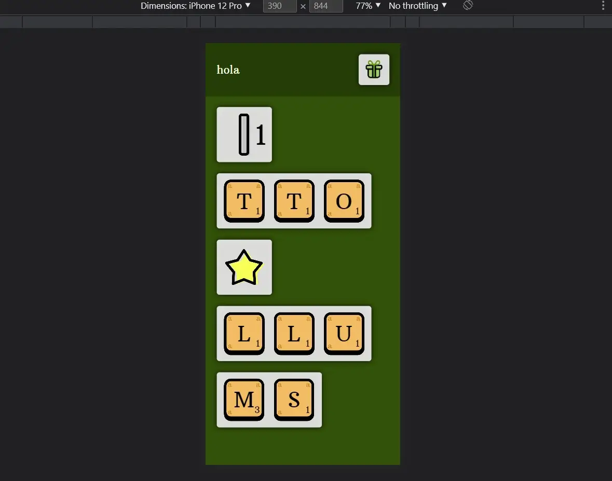
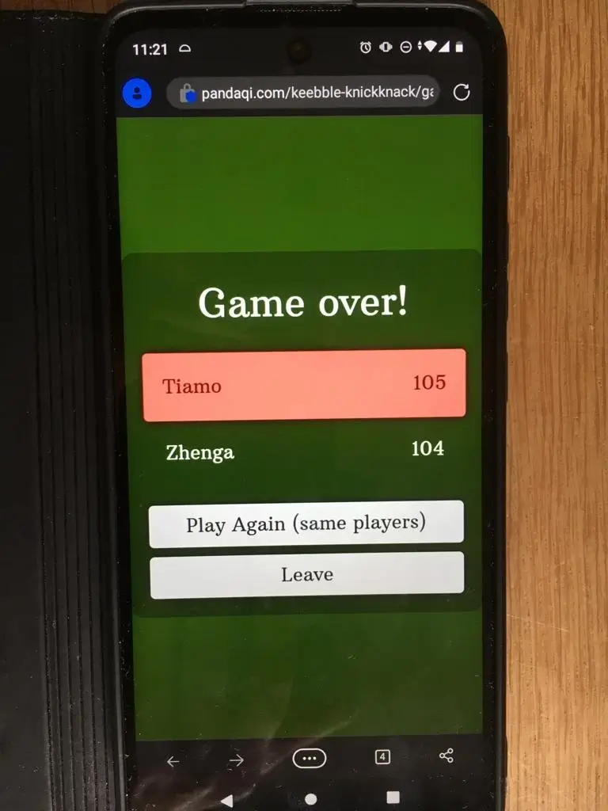
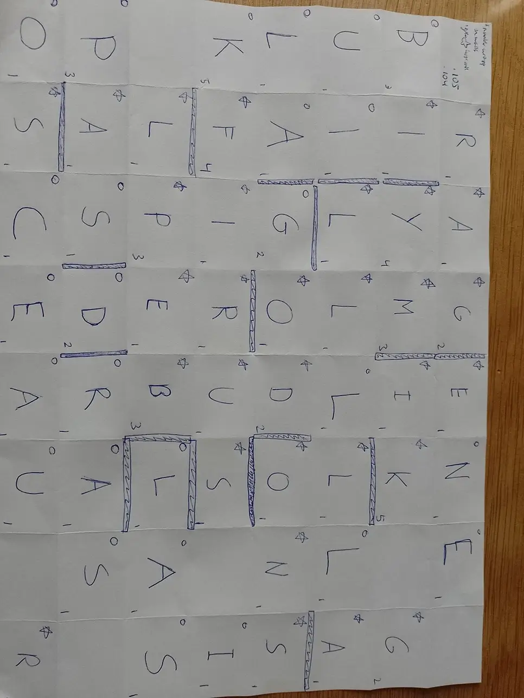

Welcome to my devlog for the game [Keebble Knickknack](/keebble-games/spell/keebble-knickknack/). As expected, it's part of the [Keebble Games](/keebble-games/) project.

When thinking about how to make an improved Scrabble-like game, I got three ideas at the same time. The original version of Keebble was the easiest one to make. This idea was the second easiest to make.

The original version is a _One Paper Game_. This means you only need a (blank) paper and a pen to play the full game!

This version is a _Hybrid Game_. You still need that paper, but now you also need its website (on a phone or tablet) as you play. As "hybrid" suggests, the game is a mix between a traditional board game and a digital game.

## What's the idea?

It's still basically Scrabble. You place letters on the board and try to score the most points by creating valid words.

What changes? The game interface (on my website) decides **what you can do on your turn**

That was the original idea for this version:

* Each round, show options on the device
* On your turn, you pick one of them ( = tap it) and execute it
* When the round is over (or options exhausted), it regenerates a new set of random options

An "option" could be to place a specific letter. Or to place a "double word" bonus. Or to become the "start player" next round.

This means a big chunk of work is already done, because we can copy rules/code/images from Keebble.

* The "random starting board" generator can be reused.
* The icons for "double word" and such can be reused.
* The fonts, color scheme, etcetera obviously stays the same.

## Expanding the idea

### Keeping score

When writing down the rules, something was nagging me. In Keebble, I had to reserve squares on the board for writing down the letters you had. (And maybe your score, although most people default to using a separate paper/notepad/notes app for that.)

This takes up space. It removes precious squares that I'd like to use in the game itself. It's also messy: if you play well, and the game takes a long time, this square becomes rather full and messy.

I _really_ wanted to remove this need for "reserved squares" (or extra papers).

The answer was obvious: **my game interface handles all that!**

It's not too difficult to add code that ...

* Allows tracking score
* Allows tracking what letters people have "in their hand" (although I probably won't use that in this game, more on that soon)
* Allows tracking special status effects (like: "the letter E is worth an extra point")
* Allows tracking how many letters have been used, so the interface can decide when the game is over.
* In fact, it can easily track whose turn it is right now, if you enter player names in the right order.

Players don't have to worry about it! The interface handles it all.

Nice. This idea suddenly feels simpler and stronger for it.

### Making words

Because the options are random and simple, it's highly unlikely that you can write a word immediately. You only get one "E", or two "A's", or something like that on your turn.

As such, I immediately ignored the idea of "play a valid word on your turn". (And all the rules associated with it, such as connecting with the existing board or placing all letters on the same line.)

Instead, **you can place letters anywhere!** As long as the square is empty, you can place the letter there.

So what does a turn look like?

* You choose the option "Two letters: K and F". 
* You tap it (and it disappears from the interface)
* You place the K in an empty cell
* You place the F in another empty cell at the other side of the board

Now the crucial part: if you've **created a new valid word, score it!** (If not, your turn is over.)

Simple, effective, more than enough strategy and freedom. 

Because this means letters are _shared_. You might be building towards a word ("HOUSE"), but once "HOUS" is on the board another player quickly grabs an "E" and finishes the word! Scoring all the points!

Of course, we need to invent some rules for that.

### Sharing letters

When placing a letter, players must _mark_ it as theirs. At the start of the game, you simply invent your own symbol or icon. (A heart, a square, a smiley, whatever.) After adding a letter, you draw the icon in the top-left corner.

Why? To allow scoring to be more balanced and fair in the long run.

* When you create a word, you score _all_ the letters and any bonuses.
* But every letter you used that belongs to someone else, also scores points for _them_. 

When inventing this rule, I immediately had a doubt. If you score full points for your letter anytime somebody else uses it ... isn't this too powerful? Wouldn't it mean that _most_ of your points (in any game) are decided by the _other_ players? Whether they use your letters or not?

But then I realized that this, too, can be influenced. If you only choose easy letters, or place them well, they are more likely to be used by other players. (But their point value will be low, which might mean you _do_ want to go for more difficult letters.)

I think it's actually balanced. Playtesting will answer this question. 

To make it slightly less powerful, notice that "bonuses" (such as "letter E is worth +1") only apply to the one creating the word. This ensures the scoring leans toward the active player, rewarding them more.

## Creating the interface

The rules are one page, if that. I already explained all the rules in this devlog so far, that's how simple they are.

The complexity (and real work) is within the interface. That's why I wanted to start work on that as soon as possible. 

### Options

There's quite some variety with the options. It's, unfortunately, not as simple as just showing a few images in a grid.

* Options can be repeated. (You might get _one_ letter, or _two_ letters, or _place two of these things_.)
* Some options have one image, others have a variable image. (For example, a letter needs a sprite for the background + a randomly chosen letter drawn on top.)

I decided to do the following.

* The option is a _flexbox_ that can contain any number of elements.
* The type of each element is set as a _background image_.
* This allows the content of that flex item to automatically overlay that image.
* (Additionally, it allows me to use _one_ image for all the sprites. It's the CSS sprite trick, look it up. This is faster to download and display.)

The only downside is that items must be a fixed size. But that's fine. If I pick a good base size, it should look fine on all devices.

### Powerups

These are similarly complicated (visually). For example, the powerup "the letter E is worth 2 more points" requires showing both the letter and the point value. Both of which are variable! They can be anything!

I decided to use the exact same tactic as with the options. (But now the images and text are quite a bit smaller.)

The active powerups are displayed in a row at the top, like a main menu.

### The rest

Below the powerups are the buttons to open any other "window". And yes, we need to put the rest (like tracking score) into its own window/popup. There's no space to put it all on the screen at once---you shouldn't even want to consider that.

These popups are just absolutely positioned `
` elements that fill the whole page. They are `display:none` by default. When opened, they become `display:block`.

Nothing fancy. But that works flawlessly on all devices, in all my games so far.

### The workflow

Now the interface just goes through these steps:

* "Want to add another player?"
* If yes, show an input field, register the extra player name
* If no, start the game

Starting the game just means ...

* Show the main interface. 
* Fill the other windows with the right player names (and buttons), but hide them immediately.
* Check the settings to see what we should load. These settings are passed to the interface from my main game page. (Like: Which options exist in this game?)
* Randomly pick options and display them!

There are many details that I always leave out. For example, options don't have the same probability of being picked. Just like letters don't have the same probabilities. (You don't want the "Q" to appear in 50% of the options :p) Over the years, I've learned loads of safeguards and tiny tricks needed to make random generation more balanced and usable.

If you really want to know this, you can read the source code ... but I recommend just creating games yourself and stumbling into these problems yourself. It's the best way to actually discover and learn.

### Lots of finetuning

The problem with random generation is that it's ... random :p We usually want _controlled_ randomness. Because the game needs to be playable, no matter what the interface generates. The options need to be useful or fun at all times.

For example, the option "remove an existing letter" ... is pretty useless if no letters have been added yet, isn't it?

Similarly, "remove all powerups" is useless if there are no powerups. The powerup "change the value of some letter" is boring if that letter doesn't appear a lot in the next few turns.

Usually, I need at least 10--20 of these tiny rules and exceptions to make random generation actually _good_. I started calling it "massaging the system" a long time ago :p

### What does it look like?

Below is a quick screenshot of the interface. In Mobile Mode, on my laptop. Because I imagine most people will use it that way, instead of placing a full PC on the table :p

## Finishing

### Picking a name

It just sounded fun. I like the word "Knickknack". It's not common, but also not _too_ rare. It flows nicely with Keebble. Thus: Keebble Knickknack.

### Picking colors

The original game has three clear colors: Purple (main), Green (secondary), Blue (background).

I have three ideas for Keebble games. Which obviously means: each one uses the same three colors, but in a different order.

Which means the colors for this one are: Blue (main), Purple (secondary), Green (background)

{}
And the colors for the last variant are: Green (main), Blue (secondary), Purple (background)
{}

### That's it?

It feels like I'm missing something. But I think the game is done now. It obviously helps to already have a working base game that you can mostly copy.

Which means it's time for playtesting.

## Player count

No, wait. While doing that final 1% for the website, rules and interface ... I realized my player count was still at some random number I set at the start of the project: 2--8.

I _want_ to support large groups. I come from a large family myself, so it's not uncommon that you have 6 or 7 people to accommodate for a game.

But it just didn't work here. For larger groups, you'd have to fold the paper further. This requires explanation in the rules and extra settings on the website. (And more time, while folding already _isn't_ people's favorite part about these games.)

Additionally, you'd need to input _all those names_ in the interface. It has to _show all of them_ when you update score or backpacks. It felt messy, it felt like we didn't have enough space. And in a game where you want to be fast and pick the first option ... having to wait on 6 other players to pick the options you wanted isn't fun---at all.

I scaled the player count down to 2--5. This allowed me to remove some settings and keep rules as tight as possible. Other games of mine are better suited to large groups. (Such as the party games I made lately, like [That's Amorphe](https://pandaqi.com/thats-amorphe) and [That's Amorphe: Pictures](https://pandaqi.com/thats-amorphe-pictures).)

Let's keep it that way. Lowering player count is the right choice here.

## Playtesting

I am on a roll! I've tested the game in different variations, and it just ... works. Like most games I've developed this year!

While testing, I've developed a habit of writing down _everything_. Any obstacle during play, any idea, anything players mention, no matter how small or insignificant.

With this game, my final list of notes had only a few bullet points and could fit on my hand.

### My notes

* BUG: The "walls" option displayed the wrong number at the intermediate screen. (You'd tap the option "walls x3", and it'd say you only get to place 1 wall.)
* RULE: The "become start player next round"-option is obviously useless in the final round. For there _is_ no next round. Don't make it appear then! (Well, it's obvious _now_, once we actually played the game.)
* TWEAK: make the "free points" appear a little more frequently, and with slightly higher numbers. (It often only appeared once or twice in games. And often the value would be so low that players didn't even consider it. Only after "house ruling" it to be worth more did this option become a great part of the game.)
* TWEAK: the last round felt one round _too late_, sometimes. The board was already too full to do something meaningful that last turn. At other times, it was perfect. So I'll just trigger the end condition _ever so slightly_ earlier.
* DESIGN: I forgot to add whitespace around the gameover screen (left/right). You'll see that in the picture below.
* IMPROVEMENT: When playing with backpacks, it only saves the _letters_ currently. But that means you probably forget their _values_ once it comes time to place them. I've updated the interface to also display letter scores in your backpack.

### The only remaining issue

The only rules "issue" I had? The fact that letter options are just more useful (generally) than any other option.

If the phone displays an option with 2 or 3 letters, you almost _always_ want to pick that. Even if you can't make a word, getting letters on the board _will_ score you points over time.

It's not that bad, which is why I wondered if a fix was needed. It's certainly not always the best option. You have to decide if you want to grab _start player_ so you can pick the best options first, next round. When placing "worthless" letters, you still need to place them strategically, or nobody (including you) will ever use them and score you points.

Looking at all the games I've played, the base game is very well balanced as it is.

* Letter options are always useful, but never overpowered or the only useful thing.
* I'm glad I added walls to the base game. They are a _great_ tool to break up messes of letters and maybe even score lots of points from it (if you're smart). They're also very intuitive to explain, use and draw.
* The start player is a coveted option ... without scoring you any points. A nice tension during the whole game.
* The free points are sometimes literally the best you can do. At other times, they're a nice bonus for an unlucky player or round.

The expansions add new elements that players asked for (without me prompting them) while playing the base game. Such as the ability to remove existing letters from the board, or save letters for later. 

The game can be started and explained in less than a minute, even for those who never played Scrabble or Keebble.

So, do I really want to potentially upset that balance to fix an issue that's not a big issue? I decided that _if_ I make a change, it has to be something minor, and only one or two sentences in the "letter option" part of the rulebook.

### The solution

The ideal candidate? A special type of letter. After some trial and error, I've found that the symbols `!` (exclamation mark) and `?` (question mark) looked the best among the other letters. They also have clear meaning, which I can exploit to make the rules more intuitive.

* An exclamation mark means you must overwrite one of your existing letters with a new one (from this option)
* A question mark is a wildcard. (It can be any letter you want. It does have a random score assigned to it.)

Here's the real trick, though. I only add exclamation marks on big letter options (3+ letters, the obvious "best ones"), and I only add a question mark on small letter options (the rest). On medium-sized options, they can still appear, but rarely.

In other words, this balances the options. Not in a way that means "it doesn't matter what you choose, everything is identical"---which you don't want---but in a way that adds strategy and choice. 

Do I accept the loss of some of my letters? Do I want that wildcard enough to pick only a 1-letter option? Sometimes overwriting your old letters is _terrible_, at other times it actually helps you achieve something otherwise impossible.

I'm happy with this. I wasn't able to do many more plays with this new rule, but none of them gave me any reason to doubt this addition.

### Pictures of a playtest

The first playtest for this game was actually very funny. It was a 2 player game (me against my little sister). The first half of the game, I was in the lead _significantly_. The second half, my sister fought back, until we ended the game ... with exactly **one point difference** :p

If I hadn't been able to squeeze two extra points from my very last turn, by placing a strategic wall that formed a new word, I would have lost. Here's a picture of the game over screen on my phone:

Yeah, I had no idea which obscure button combination takes screenshots on my phone, so my sister just took a picture with her own phone of my phone xD It works, I guess? She did quip that this felt like what older people do who don't understand technology. Like using Google to search for Google.

Also, here's the actual final paper for that game (I believe). As always, we played in Dutch.

## Conclusion

Anyway, the game works. It's very solid, simple, easy to play and use, and more challenging and tactical than I imagined at first.

Another success! The Keebble games are certainly going strong. That's all I have for this game.

Until the next devlog,

Pandaqi.

{}
I do still consider adding the correct letter values for other languages beside English. We're Dutch, so we played our test games in Dutch. Even though it's similar to English, there are some letters that appear a lot ... which just aren't that useful in Dutch. I'll just have to spend a free day hunting for the Scrabble values for as many languages as I can think of, and incorporate that into the Keebble system :p
{}