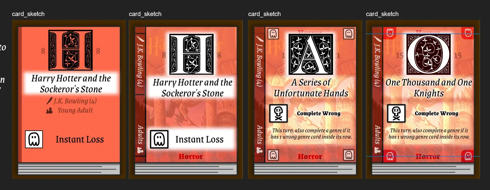
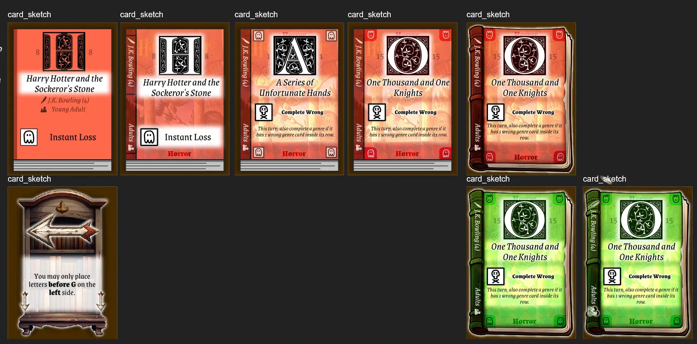
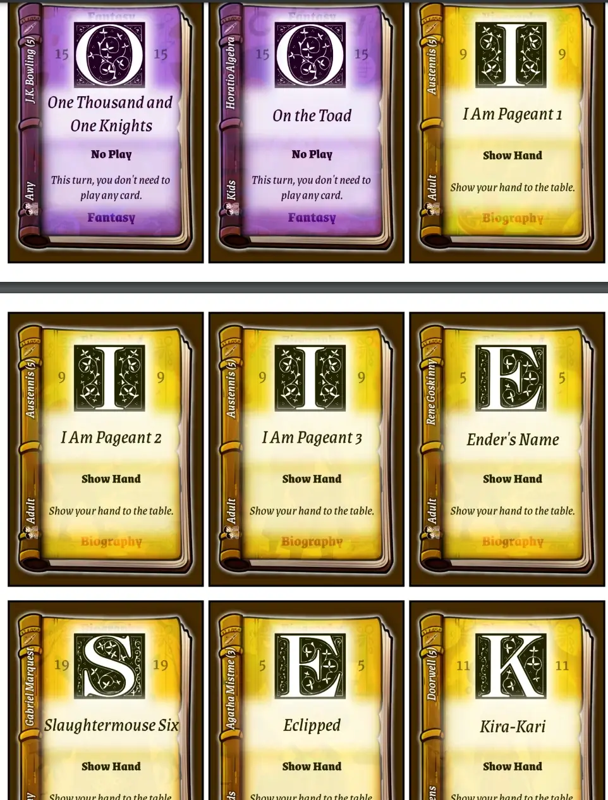
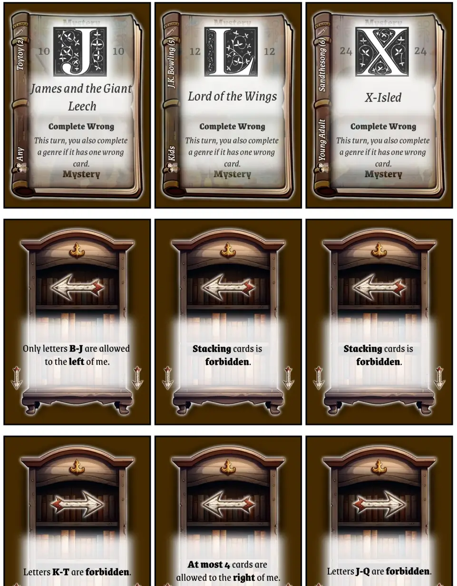

Welcome to the devlog for [Librarians](https://pandaqi.com/librarians/)! In this article, I will briefly explain how I made the game, which problems I encountered, how I solved them, and hopefully other interesting stuff. 

And yes, for once, I did keep it kind of _brief_. Partially because I was simply too busy to write into the devlog at some points, so the creation of the game takes a few "jumps" here and there.

## What's the idea?
I was inspired by games like ... **The Game**. Yes, that's the title, and it's quite a famous little card game.

In that game,
* You have the cards 2 to 99.
* There are 4 piles on the table: two are _ascending_ and two are _descending_.
* On your turn, you must play 2 cards from your hand on the correct pile.
* The goal is to be able to play _all_ the cards. (It's a cooperative game.)

As expected, you can't communicate about your cards. You must vaguely hint each other about what you have, then try to play 2 cards that won't make it impossible for another player to play stuff.

But there's a trick that makes this _possible_ to win: if you have a card exactly 10 apart from the current top card (of a pile), you may play that too! So, for example, you can play a 13 on a 23 (if that pile is ascending).

My mind (probably, subconsciously) started thinking about ways to twist this idea into something new.

That's how I came up with this rough idea sketch:
* You are placing books in a library. They have a TITLE and GENRE.
* Their rows must be sorted _alphabetically_. (A row is a "bookshelf".)
* Their columns must be sorted by _genre_.
* You can have at most 4 shelves.
* Each turn, you must play 2 cards from your hand following the rules above.

Above it, I wrote the comment "this might work beautifully already, or this might be way too simplistic and completely broken" :p

I knew it needed something more. It needed that "trick" from The Game: a simple rule that makes it _possible_ to win the game without communication and with the randomness of the draw.

My initial idea was as follows: 

> "Each time you complete a genre (a full column of 4 books), you get a special power to immediately use."

The special powers would be unique to the genre and things like "move 2 cards to a different location" or "the next player doesn't need to follow the alphabetical order".

So I rapidly created a paper prototype to test the idea.

## Paper Prototype
I made an educated guess for the material.
* 3 entire alphabets (A-Z)
* 6 genres, each occurs 4 times per alphabet.
* The 2 leftover cards are "wildcards" ( = any genre you want)

This comes to 26 * 3 = 78 cards, which feels like an upper limit of what I can ask people to print and cut themselves. (I also just like to keep games minimal. I originally wrote down we needed 100 cards, probably still inspired by The Game, but that just feels way too much now.)

How did it go? Well, my comment was correct. 

**With the original rules, the game is entirely broken.**

Fortunately, I can just switch rules all the time well prototyping the game against myself, and I was able to steer the game towards a better one. 

What was wrong and what did I try?

### The Faults in our Game Design
The original rules aren't really a game :p They're more a ruleset to follow, like a computer executing an algorithm.

You are lucky with your cards? There is an obvious best place to play a card, namely the one that completes genres, and you win without effort.

You're unlucky? Well, nothing to do about that. Literally. Remember that a card needs to fit both criteria (row = alphabetical, column = genre) or it can't be played. With 6 genres and 26 letters, this can easily happen early in the game at no fault of your own.

What do we need to change this?
* Less strictness in placement
* More variety to what you can do or aim for

We also needed some clarification about what "alphabetical order" means, because the special powers (and weird situations) in this game can make that hard. I defined it as.

> The letter comes AFTER the tile immediately before it, and BEFORE the tile immediately after it. (Ties = same letter are allowed.)

So it doesn't matter if a row has some messed up order like "A F C J", all that matters is that final "J": whatever card you place after it must be a J or later in the alphabet.

{}
Also, this is when I decided to add _numbers_ underneath the letters as well, just for people who struggle to quickly place something in the alphabet.
{}

### Tried and failed
First and foremost, I removed the genre restriction. You get that bonus for completing a column, but it's not _required_. This was an essential change to make _any_ game possible.

**Columns must also be alphabetical:** this _can_ be done, but it's _really hard_. So this won't be in the base game, but I can make it a variant.

**You can place a card ON another card if it's the mirror letter:** A and Z are mirrors, B and Y are mirrors, C and X are mirrors, etcetera. This revealed that placing cards ON other cards is sometimes really fun/useful, but ... this mirror rule wasn't it. Too hard to calculate. Messes up the alphabetical order too much.

**You can place a card ON another card, but they can't be used for bonuses anymore:** So you can place on top of others to save yourself, but that card can never be used to complete a genre. This was ... somewhat okay, but it's such a horrible restriction that you basically never _want_ to do this.

### Better ideas
**You start the game with "shelf cards".** As setup, you place 4 Shelf Cards underneath each other. Why? 
* This is a constant reminder about how many shelves you have. 
* I can show the direction with arrows on the cards. (So no matter your position around the table, everyone knows what the direction for A-Z is.)
* When the board gets destroyed (there are gaps), these cards help remember where each row is.
* This also opens the door to a special power that adds / removes entire shelves.
* And it opens the door to a "special restriction" on the Shelf Cards. This randomizes the game even further (through which Shelf Cards you chose). They should be really easy and short, like "Letters A-F are forbidden" or "Only Blue and Red cards on the Left"

**You complete a genre with any 4-in-a-row.** The game really opened up once I allowed horizontal and diagonal 4-in-a-rows as well. (Especially the diagonal ones. Because shelves need to be sorted, they are often _offset_ from one another, making this a more fun and usable way to create sequences.)

**Upon completion, the cards go away and your power can be used later.**
* Initially, you had to use the power _immediately_. But while testing, this led to many situations where the power just wasn't helpful _at that specific moment_. It was also confusing if you completed multiple genres in the same round, stacking powers to execute _now_.
* Instead, any completion makes the 4 cards go away (leaving gaps, which can be good or bad).
* Your turn instantly ends.
* But 1 of the cards is given to any player to use for its power at some later point. (So you can save powers for when you really need them. Especially useful if you want to get that perfect score in the end and play ALL cards.)

**Powers aren't necessarily good.** I chucked in one "bad power" (with a simple X icon) in the paper prototype and immediately liked it. Creating a 4-in-a-row with this one instantly _lost_ you the game, which created another interesting dynamic basically for free. (You are really wary about where you place those cards.)

**Yes, 5 or 6 genres seems about right.** Obviously, there are more book genres than that, and there are more special power ideas than that. Which is why I did the usual trick of "you can swap out genres for other genres _in the same color_".
* For example, the RED color might have 3 or 4 options for "destructive" powers. (You lose the game; You lose a Book Shelf; The Hand Limit permanently lowers by 1; Etcetera)
* You decide, when you play a game, which genre to include per color.
* Which leads to even more variability and new challenges each game.

**The "stack cards on top of others" needs a smart rule.** It's such an obvious rule that makes the game better. It just can't be applied 100% freely, because that makes the game very easy. Sure, we can do that for the _base game_, but not beyond that.
* So I considered adding it as a special power when completing a genre ... but then it'd only be possible a few times per game, _if_ you included that specific pack.
* I considered adding it as a restriction on the Book Shelf cards ... but then again, the mechanic would basically be thrown into a dark corner.
* In the end, a solid _core rule_ did the job. Once you get further into the game, the idea of "balancing the shelf" is added.

Balancing the shelf?

> "The difference in stacked cards between the two sides (left and right) of a Book Shelf card can never be greater than 1."

In other words, you can only place a letter on the same letter if the two sides have a similar number of such stacks. Thematically, you can't put all the heavy books on one side and none on the other, or the shelf topples :p

(As usual, when completing a genre, only the cards used for matching go away. Any cards potentially underneath those stay.)

## Let's make that

### Gathering all the data

So, as usual with me, this "tiny simple game idea" ballooned into something bigger. The game itself is still simple, just like the rules. But the amount of work I have to do behind the scenes---creating lists of authors, book titles, genres, connecting them with 20+ different actions, etcetera---is huge.

So I decided not to try and force my way through it, but just do a little bit every evening for a week. This brought us to the finish line just the same, but with less stress and more creativity.

{}
I needed 50+ author names and book titles, all of them puns based on existing famous titles. If you try to do that in one sitting, you go insane :p
{}

I learned a few things here.

**Lesson 1:** I re-ordered my ideas for actions to have the base game make the most sense. For example, the original distribution meant you had an action "add shelf" (add another bookshelf) ... but not the action "remove shelf" (remove one of the outer bookshelves). That's a mismatch that makes the game less balanced, and we certainly don't want that for your "first game" or the "recommended base material". So I lined up actions that belong together to all be in the base set.

This also helped to find something for the final remaining action spots. I had about ~4 actions left "TODO", but now that I realized most actions come in pairs (add/remove shelf, increase/decrease hand limit, etcetera) I could just look at what I already have and find the opposite or the "balancing" action for that.

**Lesson 2:** I need a lot of consistency per color. Otherwise, I can't allow picking "any pack" per color, because the game would be unbalanced or stop working. More specifically,
* The letters that can be used per color are fixed. (Just a list of 6 possible letters I manually input per color.)
* The authors that can be used are similarly fixed. (For the "author" expansion, I need to know exactly how much books from each author are in every game. If an author is randomly picked upon generation, this obviously can't work.)
* Which automatically determines our "book series": only colors that have a certain author appear multiple times, can turn their books into a "series". In fact, they _must_, for the "series" expansion to work.

In the end, the "genres" I assigned aren't really genres. They're a weird mix of genres, categories, and general story structures. But I preferred picking things that are well-known and make intuitive sense (combined with their action/game mechanics), over being technically correct about what's a genre.

In the end, there's a file called `dict.ts` that has aaaalll these lists and dictionaries of data for the game, and it's a _very long file_. But it was needed for the current version of the idea, so let's say the effort was worth it. (Let's hope at least a few people recognize the famous author names through the puns and laugh about it.)

### Finding a visual style

The biggest challenge was probably to find a layout that could fit all this data, without being overwhelming or cluttered. One that allowed you to immediately see the letter you had to use for alphabetical sorting and the genre of that card.

Before I even started sketching, therefore, I already decided that the first letter (of the title) would be shown as this huge, decorated, "drop cap" at the top. It's probably the most important element of each card, so let's make it big and important.

The color/genre of the card could then obviously be displayed through _color_ of the entire book.

I struggled with placing the metadata (author, age, action) until I realized that the _binder_ of the book provides a nice vertical column to the left by default. I made it bigger and gave it a dark background, so it could now fit this data (rotated).

The action of the card, though, was too important to place there. (It also didn't fit :p) That is placed below the main title, with icon + action name. There is even space for the short explanation of the action (so you don't need to remember or learn rules), but I think that will be an optional thing, as I'm not sure that much text on cards is wanted.

And to finish it all off, I added a _slight_ book cover in the background and added a white blurry rectangle behind everything to give it a more solid background (for easier legibility).

See the sketches below.

This, however, is still very rudimentary. The book itself is just a bunch of rectangles drawn in my vector software. The idea was always to have it be an actual _illustration_ of an old-timey, weathered book.

So a few days later, I created such illustrations (base using AI, then my own manual modifications). This made it considerably harder to "recolor" the book. I ended up drawing a shape to fit perfectly over the book cover, and _tinting_ that in my code. (So, for a red book, it will draw that shape on top of everything, but now it's entirely _red_.) By setting the blend mode to _multiply_, this color is now projected onto the book and recolors everything nicely.

I replaced some icons with more detailed illustrations too, did some final polishing, and ended up with my final templates for the cards this way:

In the sketches, you can see I just quickly copied a Harry Potter cover to lightly display behind everything. (A solid color usually makes something like amateurish and a bit too stark. Especially if everything around it---such as the entire book---is way more detailed and textured. That's why I want to add a book cover to the background, to break it up a little.)

For the final game, I won't use real covers of course. I generated some genre-stereotype book covers using AI, put them in a list, and randomly pick from those. (I usually didn't even have to specify anything. Ask for a "romance novel" and you get a guy with a ludicrous sixpack and a pretty girl in a dress clinging to him. Which is like 95% of romance book covers.)

Those icons for the genre or action are obviously placeholders. I'll draw those manually, matching the style of the rest somewhat, later this week.

### Final Material

As stated, this was supposed to be my next "smallest game". It's not. Though the final material is only 60--70 cards (if you just grab the base pack and play with that), the work going on behind the scenes to generate, draw and polish all that is _huge_.

As such, this project took about two weeks longer than predicted and generating the final material is a tough job for my old, broken laptop. But in the end, I managed to make it work. (If you ever wonder why the amount of material in a game of mine seems a little too low, the answer is probably: otherwise my own laptop couldn't even generate the game.)

**This is Tiamo from the future:** Actually, I was too tired and too busy with other projects, so I basically dropped this project for a full year. Even though it was 99% done. I procrastinated until my self-assigned deadline came up. Only _then_ did I finally do the final bits, fix the final issues, and get it done. 

It isn't all bad though. In the mean time, I massively improved the infrastructure behind my Pandaqi website. I just re-read the paragraph above, and, well, the game generates _much quicker_ now and can handle _much more complex drawing_. I also added a "masking effect" that I needed for this specific design in the mean time. All the reasons I _dropped_ this project before had vanished by now. 

In a sense, let's just say that I "patiently waited 1 year" until the time was right to finish this project :p

So, let's now continue where we left off.

Below are two images of the final material. 

Or, at least, a _near final_ version. Because of my broken hardware, I need to do all my drawing work on a separate tablet, which takes a while to boot and switch to. Which means I couldn't add the genre/action icons yet ... because I'm on my laptop (where I do all my writing work, like right now) ... but it was too late to switch ... and I couldn't work on the project tomorrow ... and it was all a mess.

So I just wanted to have this screenshot in the devlog before I'd forget again. 

{}
I'm quite a hyperactive person. If I don't do something _now_ there's an almost guarantee I'll completely forget a task ever existed for another year. Or that I can't sleep because as soon as I step into bed, I suddenly REMEMBER that I forgot this REALLY IMPORTANT THING :p
{}

So. That's done. Cross it off the list.

## Conclusion

Okay, so, this project had a really weird, winding, non-optimal road. I still think the core idea is really solid. It just got out of hand---I learned from that mistake now, I promise!---which made it a drag to properly 100% finish the thing. Which also, probably, made the game look a bit less nice and accessible than it should be.

But this is one of those cases where I decided I was done with it and good enough was good enough. If I couldn't find a shred of motivation to move this project from 95%-100% _for an entire year_, then forcing myself to do even more is just a bad idea.

As such, I also didn't playtest the game with others anymore. That's also not ideal, I know, I hate the fact that I don't have the resources to properly test any of my games. 

But as I said: I couldn't stand to look at this game anymore. Too many tiny issues, too many details that went wrong, too much code behind the scenes, too much _meh_.

For example, when I returned to the project, I had to track down bugs for _hours_. Because I'd written the code to draw the cards, but hadn't actually, you know, tested any of it before I left the project! So now there were random numbers everywhere, things simply in the wrong place, things simply not being drawn at all, some configuration values with a name I didn't recognize anymore, etcetera.

I'm pretty sure that fixing those bugs would've just taken me 5 minutes if I'd done so back then, straight after writing the code. But being away from the project, in this case, just added confusion and ignorance about what I'd done before. And that created a pile of annoying work that _had_ to be done ... but didn't actually allow creativity or make the game better at this stage.

In the end, the game is _done_ and it _works_ and it looks _kinda good_. I'll have to be content with that!

I wrote down a simple "future to-do" for a potential "kids version". Or, rather, just one that's even more streamlined, with much simpler graphics and no text on cards. Nothing generated by AI; just my own clean icons, a simple book cover in a certain color, and that's that.

I don't know if I'll make that. Surely not any time soon. But I feel like _that_ version---the Librarians core, but with a better execution when my life isn't such a mess---would be a great game.

We'll see what journey the Librarians idea will take.

Until the next devlog,

Pandaqi