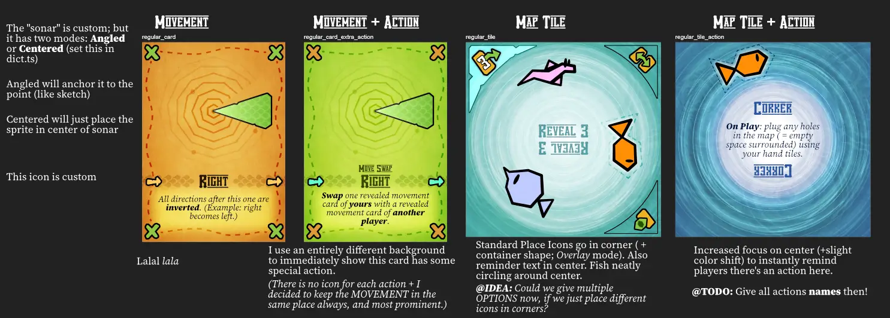
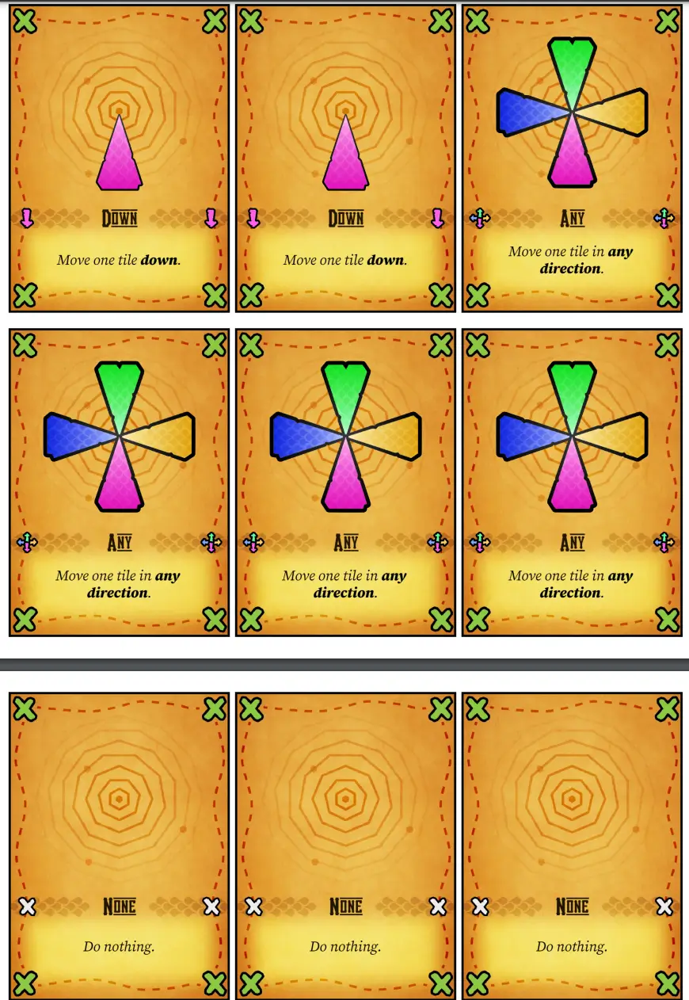
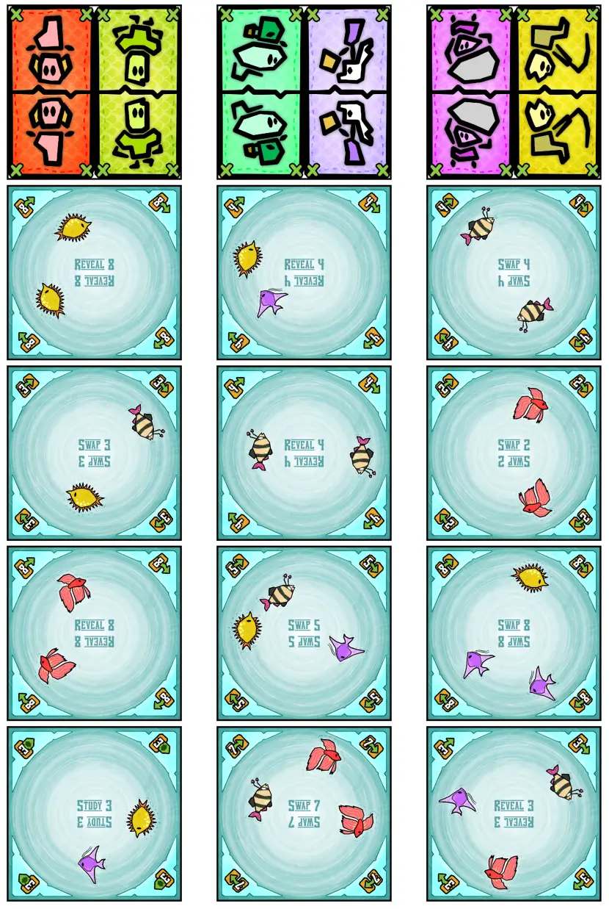

Welcome to the devlog for my game called [Mapped Out](https://pandaqi.com/mapped-out/). 

It will probably be rather short, because I was so swamped with work that I didn't write this devlog _while_ making the game. (Usually, I write down my thoughts as I develop a project, because it helps me keep things straight and solve problems. At worst, I write the devlog one or two days later, perhaps on the weekend. In fact, this was the first time in _years_ that I wrote the devlog this late.) 

I might miss a few details, but hopefully the general process and any interesting bits are still present!

## What's the idea?

### The original spark

For the longest time, this project/idea was called "Predetermined Journeys". Not a catching name, but it was the best description I had of the idea.

* At the start, players receive a _fixed journey_: some cards saying "go left", "go right", and so forth.
* At the end of the game, they will be forced to move their pawn following these instructions.
* As such, during the game, it's their job to _change the map_ to make their route _as valuable as possible_.

I basically turned the most common type of board game ("here's a fixed board, move your pawn over it strategically") on its head ("here's a fixed route, design the board strategically").

Sounded promising, right? Well, I thought so too. But that doesn't mean we have an actual _game_ just yet.

### Finding the objective

The first step is finding the objective. When does the game end and what determines the winner?

* **When does the game end?** Perhaps your journey starts "hidden", but you can reveal more cards over time. Once everyone knows their entire journey, the game ends.
* **How do you score?** At the end of the game, when you follow your "fixed journey", you keep track of all the tiles you visit. Simply sum their score values for your final score. Highest score wins.

If possible, I always want my games---or at least the base game---to be _textless_. I want them to be playable for as many people as possible, including young kids, which means I try to avoid using any text or even numbers.

As such, I discarded my original plan to give the different map tiles different "powers" or "score actions". Instead,

* The map tiles contain _fishes_.
* As you walk your path, you simply count how often you encounter every fish.
* The type you have the _most_ determines your score. (Example: you walk past 3 Red fish and 5 Blue. Then your final score is 5.)

This allows the map tiles to look very simple and only have one or two clear icons. It makes calculating score at the end of the game (and during the game) much easier. While still providing _some_ extra strategy here, because only your "best" type counts.

### How to manage your journey?

Now for the second problem: if your journey starts hidden, how do you reveal it? How do you gradually get to know more about where your journey will take you?

At first, I simply used a two-step approach to every turn.

* Reveal 1 journey card (or "movement card" as I called them now) of choice.
* Then add 1 tile to the map.

Simple, but not strategic. Because it's basically _always_ the best choice to just reveal your next movement card. Knowing that your 6th move is to the right is _useless_ if you don't know the moves before it.

Additionally, although the entire idea is that the journey is "decided for you" ... it's not fun if it's COMPLETELY fixed. While testing, this just felt like you were too powerless to do anything, either for yourself or against your opponents.

I decided to kill two birds with one stone.

* On your turn, you simply **play 1 map tile**. (I'll figure out "placement rules" in a second.)
* Every map tile shows an **action icon** with a **number**, to execute now. I saw three types:
  * REVEAL: Reveal the card at the position indicated.
  * STUDY: Secretly look at as many movement cards as indicated.
  * SWAP: Swap the card at the position indicated with another.

Every turn is incredibly simple now: just play 1 map tile from your hand, do what it says.

But it constantly gives you ways to get information about your route or modify it slightly. Because of that number---which fixes the cards you may actually see/reveal/move---it's not too powerful and it's still mostly a "fixed route".

_But didn't you just say you don't want numbers?_ It couldn't be helped. I need some way to restrict which cards to reveal/swap/manipulate, and unless I want to force people to print double-sided or add way more material, this is easiest. But this is exactly why I removed the numbers _where I could_---if I hadn't, then we'd now already have _multiple locations_ with numbers on them meaning different things. Minimalism is my ideal; because in practice, you _juuuust_ fail to reach it every time.

### How to build the map?

I took the simplest approach here.

I didn't want to add extra rules like "paths on the tiles must match" or "you can't create holes" or whatever. I've done that in countless other games; it fit there, I don't want it here. This game is about those fixed routes, _not_ some complex map-building rules.

That's where the ocean/fish theme came from!

I realized I didn't need _any_ placement rules if all the tiles were just open water with fishes. You could connect/rotate them any way you like, and the map still works. No extra rules needed!

### Expansions?

If you know me or my games, you know I'm all about that juicy _player interaction_. There's none of it so far.

First, I made one tweak to the _base game_ to add a bit of interaction. When you do a tile action (REVEAL / STUDY / SWAP) ... you may do it on ANY card! You may also work against an opponent by swapping _their_ cards, or get more information about them by revealing a card of _theirs_.

Secondly, I moved the interactive rules---which were actually the original rules---to an expansion.

* Instead of moving your entire route at once (at the end), you move one step at a time.
* This means players can _bump into each other_ while moving; if they do, you may bump the other pawns to an adjacent tile.
* It also means that it's too hard to keep score as you go. Instead, I needed something tangible for keeping score. What's the easiest thing to do? _When you arrive on a new tile, you may grab that tile and add it to your "score pile"_
* Of course, if left unchecked, this creates loads of holes in the map. Which is why I combined it with this other rule.
  * If you take a tile this way (to score it), you must replace it with a tile from your hand.
  * If you have no tiles in your hand anymore, you simply can't score anything more.

This change requires no extra material. But now it's very important to know the paths other people will take, because they might take away tiles you wanted or bump into you. Additionally, you can only grab a _part_ of your path to score, so which ones do you pick? 

At the moment, players had 10 movement cards and only 4 map tiles in their hand. So you'd move 10 times, but could only pick 4 of those tiles to score.

That seemed a little ... out of whack. Indeed, the game felt more balanced (in terms of playtime, complexity, everything) if players had **8 movement cards** and **5 map tiles in their hand**.

With a shorter journey, the game is a little tighter and there's less unknowns/randomness for you. With more map tiles, you can score _five_ tiles along your path, which is just about the right number to get useful combos or be strategic with scoring.

Yes, as usual, I think this is _the better game_. I also think that this is 2x more difficult to explain and play with new players, and I'd rather people play and enjoy this game with ease (and then try the expansion later), than most people turning it down because I made the base game too complicated.

Then, finally, if we can change the map ... then we should also have ways to change the movement cards. I added a second tiny expansion with a few more exotic movement cards, with special actions that trigger when revealed. Simple stuff such as rearranging, removing a movement card, moving your pawn one tile already, etcetera.

These tiny expansions don't add huge depth or changes to the game. But they're quick to make, will allow the game to be replayable far more often (with more variation), and allow _me_ to get all my ideas out without feeling guilty of cutting too much.

(Despite doing this for years, and _knowing_ it's better to keep the base game simple and move stuff to expansions, I still often feel guilty about simplifying the game. As stated, most of my games are actually at their best---and "as intended"---when you enable the first expansion for it too.)

## Let's make that!

### Generation

After all this time, I have simple standard algorithms for distributing stuff fairly over all material.

That is, I can easily set "I want 50% of tiles to have 1 fish, 25% to have 2 fishes, etcetera" and generate everything according to that distribution (with randomness). 

This means the game has _different_ material any time somebody presses the button to generate that. But I'm also certain that any version of the game will be _balanced and playable_.

Most of this code was written in 10 minutes. I only had to pause at assigning those _numbers_ to the map tile actions.

* SWAP/REVEAL should have numbers 1--8. (The max number of movement cards.)
* STUDY should have numbers 1--3.

How to ensure all numbers appear? How to ensure they appear _equally often_?

In the end, the solution that worked was quite simple.

* As I create the cards, I simply keep a counter. (It starts at 0, and goes `+1` after every card.)
* Then I assign the current counter value _modulo 8_ to SWAP/REVEAL cards. (Modulo means "division with remainder". So 10 modulo 8 is 2. 8 modulo 8 is 0. In coding, this is usually written using the percent operator: `10 % 8`)
* And I assign the current counter value _modulo 3_ to STUDY cards.

Because of the modulo, we just cycle through all numbers again and again, while keeping it within the bounds we need. This means everything is used roughly equally often. (It doesn't need to be perfect. Just not _too imperfect_.)

{}
All these lists of properties I create during generation are SHUFFLED, i.e. randomized, before assigning them to cards. This means there are no inherent patterns in how the material is generated; the combination of properties for every card is completely random. But because I generate these lists beforehand, using those distributions, I know that OVERALL the material is fair and balanced.
{}

### Drawing

In the base game, material is very simple. 

* Each map tile has one action + fish. I already explained why I chose the water theme: this allows every tile to just be _open water_ and playable however you like.
* Each movement card just has that movement: a big arrow pointing some way.

In the expansions, I had to juggle things a bit to get a clean layout. Map tiles now also needed extra text for a special action (optionally), and the same with movement cards. I am not a big fan of adding _two sets of text_ to any material, certainly not square tiles. As such, I decided that

* The actions on map tiles _only get an icon_ ( + that number). There's no extra text to remind you or explain them.
* The base movement cards _only get their illustration_ (no text to say "Move 1 tile to the right").
* But in the expansions, whenever a tile/card has a special action, _that's_ when it's written on the material itself (instead of in the rulebook).

This entire game is themed around exploring some unknown oceans, perhaps finding undiscovered species of fish. It should have a loose, natural, adventure-exploration style based on _maps_ and _charts_.

That's how I ended up with a more adventurous and painterly style, with lots of textures and details, such as grid lines and the look of worn-out old maps. I would like to pretend this is some very skillful process, but really, I'm just smashing things together (AI-generated random maps, random scribbles and brushes by me, etcetera) that I think will look good until ... it does look good.

After some sketches, this is where we ended up.

### Final Material

I ended up making a few changes when sketching, and then a few more changes when turning that into the final code for the material.

The base game has two more movement cards besides just left/right/up/down: ANY and NONE.
* These are incredibly simple and make the base game more varied (more ways to move!).
* But they're also _easier_. (ANY means you have more leeway in how you execute your journey, NONE is a filler that reduces complexity of your route)

The _special actions_ (on movement cards) only appear on those basic cards.
* It was too complicated to have movement cards with some weird movement (like "jump/teleport") and _also_ an action.
* This became painfully apparent when I realized I'd need to fit _two pieces of text on the card_. (I don't know how that slipped my mind while doing the sketches.) That's way too overcrowded. As such, special actions only appear on the simplest and most obvious movement cards (left/right/up/down) that need no further explanation.

I decided to just repeat the same icon in the corners of the tiles. Yes, giving you multiple options might be a nice idea. But it'd only be for an expansion (too many rules for base game), and in expansions the tiles already have special powers, so we get the same overcrowding issue again.
* I also made them a bit bigger and more obvious.
* And I repeated what they do in _words_ in the center of the tile. I've found this to be very helpful to many players: find a way to show _both_ the simple icon and a written version of what it does. (Not always possible, of course.)
* I did the same thing a lot in my Luck Legends games: many of those cards have a number (6), but also the _written version_ of that number ("Six") in small print to the side. Because sometimes fonts make it hard to recognize one specific digit.

As the sketch screenshot also states, I purposely changed the overall color of special cards/tiles to make sure players don't forget they're special. (Special cards are green instead of brown/orange; Special Tiles are dark blue instead of a lighter turquoise.)

I also had to sneakily shrink the fish a bit to make them fit on special tiles :p But that's fine. They're still large enough to recognize easily.

Finally, I'd set the original _amount of material_ based on the first version of the rules. In that version, your route was far longer, which required way more movement cards and tiles. In the final version, with reduced numbers and simpler gameplay, this was an idiotic amount of material. So I reduced the material as far as possible, while keeping large player counts an option.

Below is a screenshot of the final material (base game, just a subset of all cards/tiles).

This game looks very different from anything I made before, and I quite like that actually. Placing the fishes in a circle around the center, and putting the game on the ocean, was one of the better early decisions I made.

{}
When it came time to create the final Rules pdf, I discovered I hadn't updated my core gameplay section from an older version! It still had a few rules about "placement" of tiles (openings must match, no holes, blabla). Well, I could remove all of those, because making the tiles open water allows all tiles to be placed any way you like.
{}

### Finishing

Only once I'd basically finished the game ... did I realize there are obviously other ways to execute this core idea. That often happens. You're so locked into your very _first_ association/idea that you focus on it too much.

For example, why does your "predetermined journey" have to be a set of cards with arrows?

Why can't it be a _shape_ you have to walk? Maybe a literal _map_ with X's that indicate what you need to visit? 

Or maybe just a list of cities that match cities that appear on the board? Order wouldn't matter, only that you visit all cities in _your predetermined journey_.

The core idea of this game is very strong and could probably have lead to very different games. I might make the others one day, but I realized this too late to work on them now. (I like to work on similar games, with the same core mechanic or idea, in tandem. As shown by my many "game collections" such as The Domino Diaries or the Swiftsmash Saga.)

The fact that this happens, though, is also a very good sign. It means this game was successful enough to warrant thinking about more games like this. 

If it doesn't happen, and my brain is just like "well let's never do THAT again", it's not so much a good sign.

## Conclusion

It's interesting. I think most creative people can relate: whenever you have a new idea, it _always_ feels like "the best idea ever, oh my god, this will be amazing, what a good idea".

Then you actually make it, and 99% of the time ... those ideas are just _fine_? Not bad, also not "the best idea ever". This game is pretty fun to play. Easy to learn, not much material or time needed, and it's truly a challenge to score well with your "predetermined journey". There's nothing really wrong with it and it's good I made it.

At the same time, it's not a masterpiece :p It's just a fine game. It's okay. 

More and more, I realize I have to just accept that this is the case for most ideas. Especially when you make as much stuff as I do, most of it's just going to be "fine". Most ideas are going to introduce _problems_ and _downsides_ once you actually start making them, in practice, and that will taint them.

This is one of those games. Deep inside my heart, I probably expected it do be a masterpiece again ("such a unique and fresh idea, giving players a fixed route but a changing map, wow this will bring WORLD PEACE!"), but it ended up being "just a good game". And I'm okay with that. I'm learning to be okay with that.

Those were my final thoughts. I've written some notes for future games with the same core idea, as listed in the "Finishing" section. Right now, I'm not sure I'll make those, but we'll see. 

{}
I already have too many "series" going on right now, such as _The Outnumbered Series_ and _The Domino Diaries_. In a year or two, I expect most of those to be finished and I can open up new ones.
{}

Until the next devlog,

Pandaqi