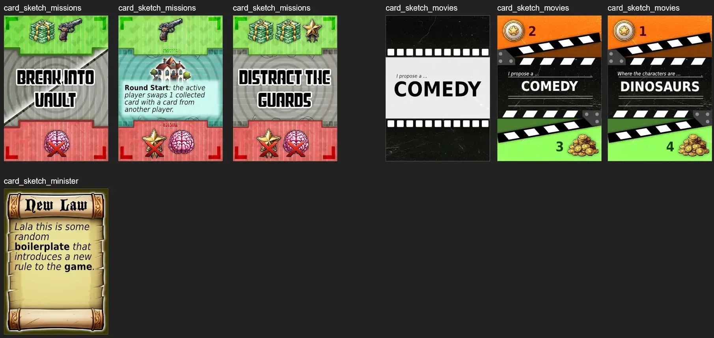
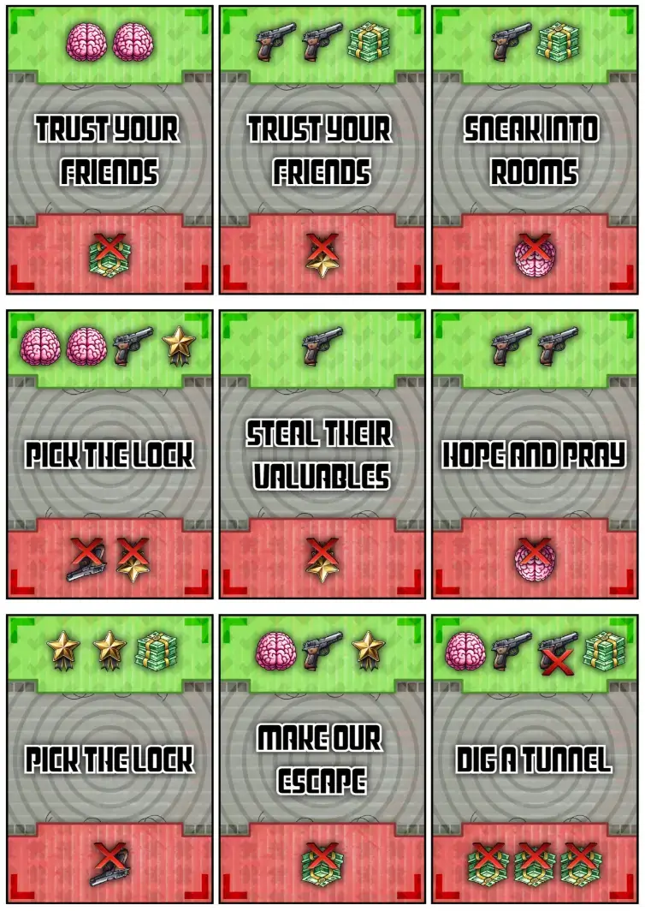
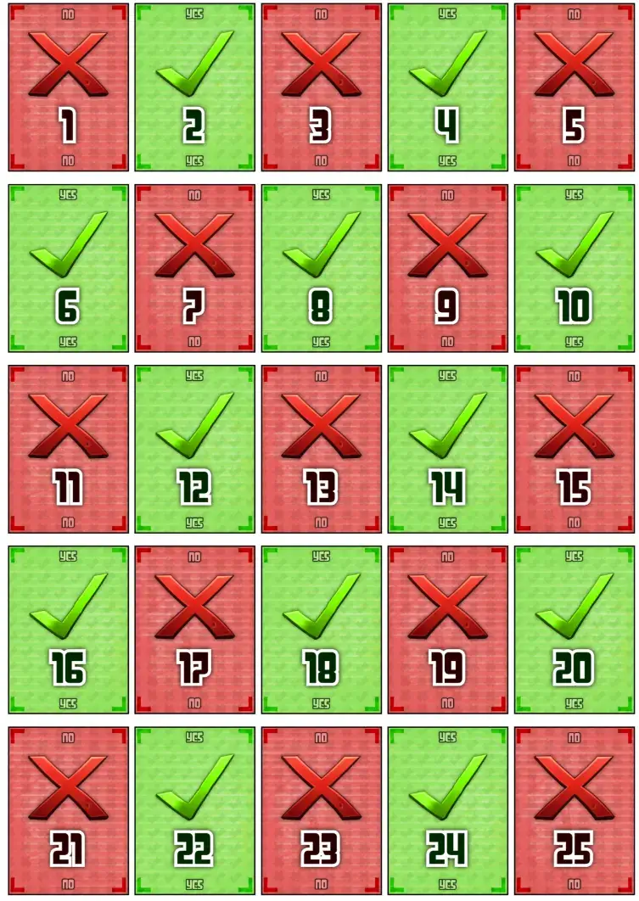
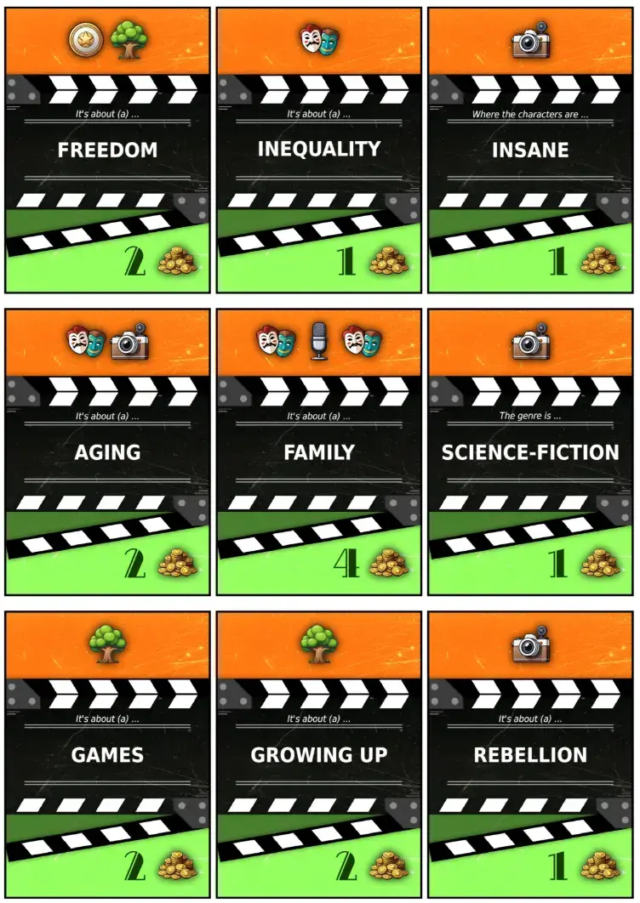
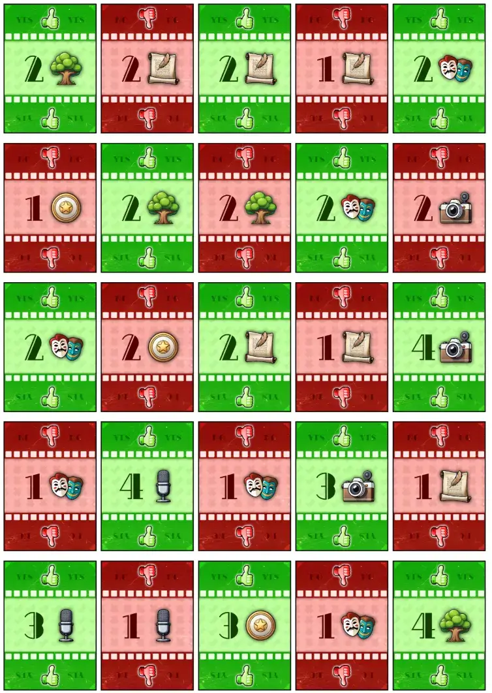
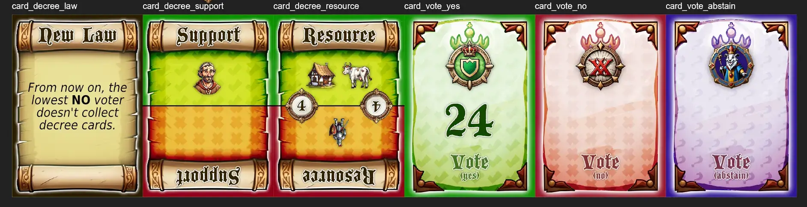
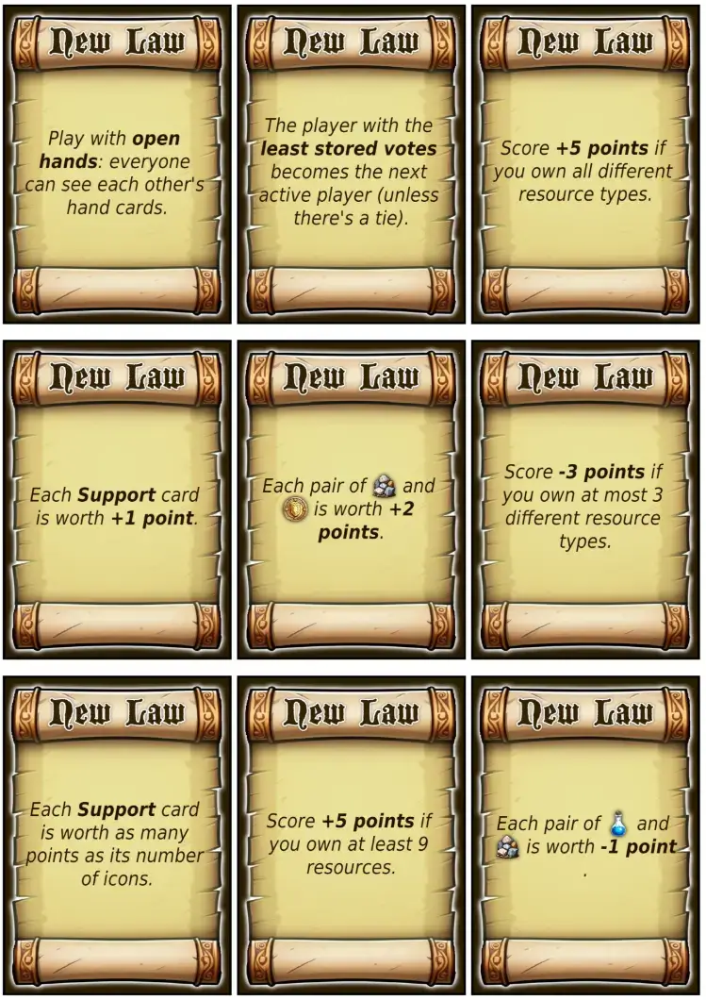
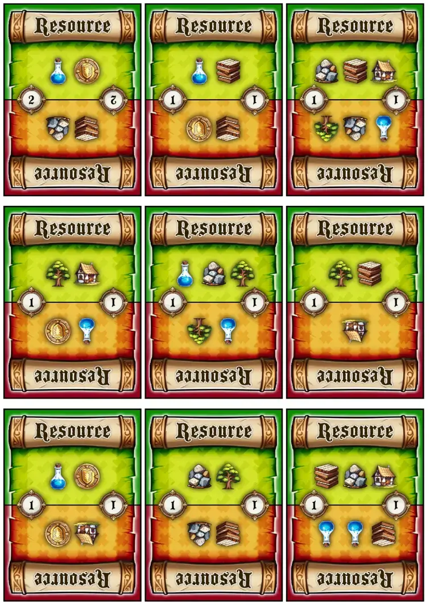
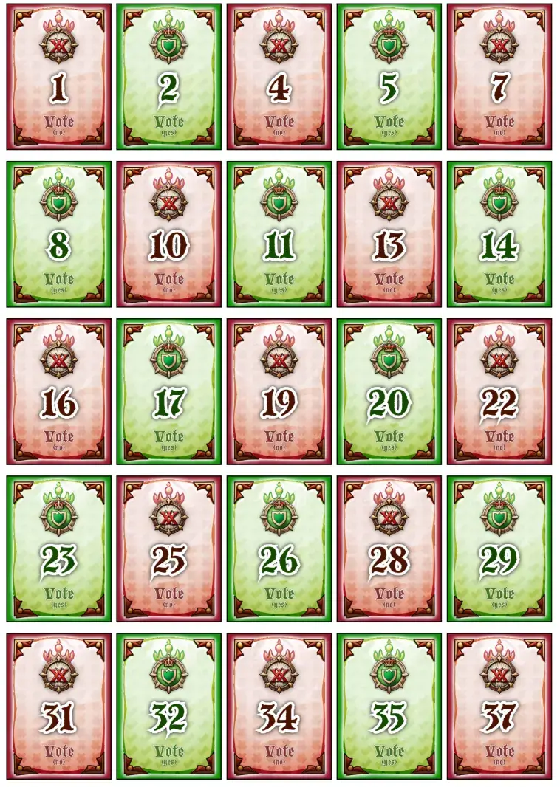

Welcome to this devlog for the [Maybe Games](/maybe-games/) project! In this article, I will track the entire development process, showing problems I encountered, how I solved them, why I made certain decisions, and so forth. Hopefully it is interesting and informative to read.

## What's the idea?

In my neverending quest for "what's the simplest core game mechanic I can imagine?", this was one of the top contenders.

The original idea, which I wrote down very hastily, was the following.

* The game takes X rounds. All players receive X random vote tokens: YES or NO.
* SOMEHOW a mission / project / whatever is proposed every round.
* All players simultaneously vote using one of their tokens.
* If majority says YES, this mission succeeds. All YES-voters are rewarded with whatever the mission offered.
* If majority says NO, this mission fails. All YES-voters are punished with whatever the mission had as punishment.

I saved it under the name "Red Light, Green Light", before realizing why it sounded familiar: I had taken that from Squid Game. It wasn't a great name anyway, but it was memorable enough for now.

I was busy and left it alone for a while, until I returned with the realization that this could be multiple games.

* We could apply this to _spy missions_ (as the original idea said)
* But also to _movie proposals_ (so you are literally "greenlighting" a movie idea someone pitched)
* And to _laws_ or _politics_ (you are voting for a law somebody proposed)

After some brainstorming, I dubbed this project **Maybe Games**. It allowed me to start all the game names with "Maybe" (consistent and recognizable), and it conveyed the literal core mechanic behind the entire game (maybe this thing succeeds, maybe not).

Then, a while later, it was finally time to develop it further.

## The Material Issue

Because I want all my games to be free, print-n-play, accessible, I have strict material requirements. I strive to keep the number of material needed as low as possible. If possible, I want all material to be of the same type and size, so it's easy to cut and store. I heavily dislike forcing people to cut loads of tokens of different sizes and somehow store those.

But this game? In its current form, we'd need ...

* A deck of mission cards (which you can combine for such a "proposal"; yes, at this point, this is all still vague)
* A large pile of vote tokens (yes or no)
* Loads of extra tokens that represent the actual things you can win (probably icons representing "money", "reputation", "knowledge")

I don't like this. Too much, too chaotic, this should be a very simple (party?) game.

So I brainstormed ways to bring down the amount of tokens needed. Until I realized two things:

* We are already _voting_ with a token every round ... so let's just reuse those! When you are rewarded, you get the tokens people used to vote. When you are punished, you have to give back tokens you've win to some shared pool from which players draw. _The vote tokens = the score tokens._
* Similarly, we are already playing cards that display their reward/penalty on them. So ... let's just allow players to win those cards? For example, _if the mission succeeds and you voted YES, grab one of the mission cards and place it before you with the REWARD side pointing up_.

Now we were getting close, but this was still vague. When do you win? How does score work? 

For example, there is no point having multiple unique resources to win if they all just score 1 point. We'd need a rule to differentiate them. Maybe certain resources score more for you than for others, or you only score pairs of resources, or something like that.

I had to specify _exactly_ how the game played.

## The First Rules

Below is the rough first rules sketch for the general mechanic of the game. (Some specific twists and changes would be present in the different versions.)

Afterward, I'll talk about why I made certain decisions.

### Setup

Give each player 10 vote tokens. 

Create a deck of Mission Cards, then
* Give each player 4 to take into their hand.
* Place an open market of 4 faceup cards next to the deck.

### Objective

The game ends after 10 rounds ( = once everyone's vote tokens have run out). The player with the highest score wins.

The resource which you have the most counts _double_. The resource which you have the least does _not count_.

### Gameplay

From start player, take clockwise turns.

On your turn, _prepare a mission_.
* Create a row of 1--4 card in the center of the table.
* You must use at least 1 card from your hand and 1 card from the market.
* (Refill your hand or the market as needed.)

Once done, all players simultaneously _vote_.
* Stick out your hand with a secret vote token inside, then reveal.
* If the majority voted YES, the mission SUCCEEDS.
* Otherwise, the mission FAILS.
* All vote tokens are discarded.

All YES-voters now collect a mission card (in order of vote token, low to high). If the mission SUCCEEDED, place it before you with the green side up. If it FAILED, place it before you with the red side up.

If everyone voted NO, then everyone must collect a mission card and place it with the red side up (also in order of vote token).

### About these rules

For clarity, this is what mission cards would look like now:

* One side is entirely green and shows resources, such as 2 money icons. (Obviously, when you have that, you have that.)
* One side is entirely red and shows resources with a cross through them, which means one of those is _removed_. (So yes, you can have a negative tally on a resource.)
* The middle portion is then reserved for whatever is needed. For example, in the version about pitching movie ideas, this would contain text like "GENRE = ROMANCE". Most of that will not influence gameplay, but will hopefully provide a thematic and humorous cherry on top.

I considered a scoring rule like "you only score the resource which you have the most", but that makes all resources that are clearly not going to be your best _useless_. That's never great. So rewarding the best one, and allowing you to cross out your worst one, seemed much more dynamic.

The open market is a typical way to combat a bad hand and provide information. Because everyone can see and use what's in the market, you can strategize a bit more and look a few turns ahead.

Only once I wrote down these rules, did I realize that I can put _numbers_ on the vote tokens. Unique numbers that dictate the order in which people may claim the cards they want. This is way more interesting than saying "grab cards in clockwise order" or "shuffle and deal out randomly". You actually get a choice and you can influence it.

(Of course you can still get unlucky and only draw YES tokens with bad numbers. This is partially just the randomness of the game and not a big deal, because you can still be the first if everyone else votes NO that round for example. But I can put in extra rules or actions to invert this numerical order, or allow you to swap out some of your vote tokens mid-game.)

Another great reason to differentiate tokens is for variety of gameplay. If you're left with only 4 YES tokens until the end of the game, well, you don't have much choice do you? You'll just be voting yes on everything and that's it. If those tokens have different _numbers_ however, or other differences, then you still have interesting choices.

The final rule about "all NO-s" has two reasons. 

* It makes this situation less ... anti-climactic. Without it, all NO votes just means nothing happens and the next round starts.
* Because voting YES is risky, we want to nudge players a little bit more towards trying it, and we can do so by punishing a round in which everyone votes NO.

In the end, this felt like a very simple ruleset that should work. Each variant would then add their own few twists and (thematic) expansions on top of this. For example, one of them could add a third type of token: orange/yellow which means you abstain (so no positive but also no negative effects).

## The Paper Prototype

Playing a paper prototype against myself isn't great for this particular game, because I will obviously know all the player's cards and votes. With perfect knowledge, the idea falls apart, so the results of such tests aren't conclusive.

Nevertheless, I still tried, and that proved the right decision again. (Regularly prototyping games early on, playing against yourself, is extremely valuable.)

For now, I deem the "spy version" the base version as I thought it was the simplest of them all. I decided to only develop the others once the first version was completely tested and its core as strong as possible.

What did I learn?

### People don't have that many hands

In the current rules, people both have a set of 10 secret Vote Tokens _and_ a set of 4 secret Mission Cards.

Well, after 5 seconds of playing the prototype, I realized you can't hold two different types of material in your hand. Sure, the Votes could be cards too (which I will probably do), but that is still messy. 

Additionally, having 4 cards in each player's hand, and 4 open on the market, and players _win_ cards (so they don't go back into the deck) ... means we need a HUGE deck if we want to support 4+ players. It also presented a slightly overwhelming number of options (= 8 complex cards) to the player on each turn.

So I changed it to only be Vote Tokens. 

Players don't have their own mission cards in their hand anymore. Instead, there's just a row of 6 public mission cards to choose from on your turn.

This simplifies the game, actually makes it practical (because you only keep one type of material in hand), and provides even more information all the players can act on.

### Getting (un)lucky

**Luck of the draw is still too prevalent.** Very first prototype game, one player received 9 YES tokens and only 1 NO token. The YES tokens were also good numbers. Unsurprisingly, this player won with double the score of second place, while not really having much choice during the whole game.

This is rare, yes, but it clearly _can_ and _will_ happen. And so far, there are no ways to change your tokens or combat an unlucky hand, which mostly ruins the game.

How do we fix this?

* Part of the reason why this happened, was because I dealt the tokens completely randomly. In other words, many tokens never even entered the game, creating an imbalance (75% YES, 25% NO) in the first place. So let's specify the setup: "Include 5 YES and 5 NO tokens per player."
* I also realized an easy way to _invert_ the order: when the mission FAILS. So a new rule was added: "If the mission FAILS, the YES-voters grab their cards from high to low (instead of low to high)," 
  * This means that high numbers can come back to bite you if not played well. It's also just an intuitive rule that probably should have been there in the first place.

This helps, but doesn't go far enough.

No matter how much I try to escape it (to keep this base game extremely simple), we need _some_ form of special actions or abilities.

I don't like writing special powers on all cards. Writing them on _some_ cards might work, but feels inconsistent. (The other cards just have a gap there? Or something else for decoration, which will just add to the confusion?)

Similarly, I don't like adding them to the vote tokens. It would just make luck of the draw even _more_ important, and the tokens themselves more messy and complicated.

Instead, I looked at some other leftover ideas/problems and found a way to solve multiple problems at once. Using ...

### The Master Card

Since I imagined the spy theme, it felt a bit too "abstract" to compose a mission from a few cards showing icons. I wanted something a little more tangible and direct.

I also noticed (through playtesting) that the active player doesn't have enough to do and enough of a stake in their mission. I mean, you can just create a rubbish mission on your turn, everyone votes NO, nobody wins anything, and that's it. Not too exciting.

What seemed a good solution?

* We add a second type of card: the Master Card. These are placed in a separate deck besides the market.
* This card shows an actual spy objective, like a building you have to break into. In a sense, the other mission cards you will add are just the specifics of _how_ you intend to do that mission.
* Every mission starts by drawing one Master Card, which are the only cards with special powers or actions.
* No matter what happens, or what the active player votes, they **win the Master Card**.
  * If the mission succeeds, they get its green side.
  * If the mission fails, they get its red side.

These cards will look very similar to regular cards, to keep it all consistent. It just has some clear changes to remind you they need to be a separate deck.

The point is that ...

* Such cards can contain a unique twist for this round. For example: "Votes above 10 don't count" or "This mission needs at least 4 cards." This adds more variation and strategy.
* Or they can contain an action. If won, you can discard the card at any time to trigger that action. For example: "Swap 3 Vote Tokens for ones from the discard" or "Flip one card (green side up<->red side up)"

It's a very controlled, minimalistic way to add special powers to the game. They allow you to balance a bad hand or unlucky situation, and spice up the game in general.

Moreover, each round has at least _one_ card that will be collected for sure. And people will change how they vote, and how they arrange missions, depending on whether they want the active player to win the good side of that Master Card.

This felt like the absolute simplest addition with the most benefit for all parts of the game.

### Anything else?

Besides all the major changes and critiques I just outlined, the game does work. It's fast and easy to play. 10 rounds seems the right amount. There is certainly strategy to how you create missions and when you use certain votes, and regularly winning cards feels good. (It prevents the game from being stagnant.)

The biggest benefit, as I repeatedly learn, is the simultaneous voting. It means you never have "nothing to do" or just "wait for your turn" (for longer than 30 seconds).

Really, if I could, I would make _all_ board games simultaneous :p

Now the paper prototype has really outlived its use. It's faster if I just _make_ this version (writing the code to generate all cards, using some quick graphics to make it look okay, then print and use that).

{}
After these changes, this might not be the simplest idea anymore of the three. We'll see. I will still continue developing this one for now.
{}

## Let's make that

### Trouble with the Master Cards

As I was creating my list of possible rules and actions, I realized I didn't like this distinction. It made the rules and the flow of things messier, and in practice ... these two are almost the same! I found myself writing a rule like "all YES votes count double" ... and then an action saying "your vote counts double". There was a lot of repetition and doing nearly the same thing.

I also realized a gap in the game logic here. If the Master Card contains an action, and it can be discarded at any time to use that ... then the whole card becomes a bit pointless. If it's a bad one, you just discard it at some point and you are rid of it. Because the active player wins the Master Card anyway, others can't stop you from getting lucky and getting a good action.

So, as usual, I decided to simplify it.

There are only **rules** that hold for the current round.

Only in the _expansion_ you are able to "play" the Master Cards. If the card is positive (green side up), you can play it at before the start of a round to _add_ this card's rule as well. This way, a card can say "everybody discards 2 Votes and draws new ones from the deck", which works as a rule, but you can also play it when you really want some different Votes.

Because rules now apply generally, however, I sought a way to make some rules target one specific player. For example, "The active player swaps 2 votes" (instead of everyone doing it). This is fine, but static; we want something that is dynamic, depending on the current situation.

Eventually, I found rules such as "The player with the highest vote does X" to work best. It picks one specific player, but it's a different one each time (based on player's actions). 

HOWEVER, currently the YES and NO votes share numbers. This means there is no unique highest vote in general.

The easy solution, of course, is to simply not do that. YES has only even numbers, NO has only odd numbers. Done.

### A built-in swap rule?

Finally, as I finished creating all the template code and data for this project, I stumbled upon a useful rule that _might_ be simple enough to include in the base game.

> If you didn't collect a card this round, you may discard 2 Votes and draw new ones from the deck.

Most of the time, not collecting a card means you played a NO or a bad number. That happens most often when you have bad Vote cards and want different ones. So using _that_ specific situation to allow you to swap some of them feels incredibly useful. (And not overpowered, because each round, perhaps only 1 player will actually be allowed to do this AND want to do this.)

The only reason I hesitate to include it, is because of simplicity. The current rules are quite streamlined and flow neatly from "propose mission > vote > collect cards". This is more of an exception, a rule that breaks the pattern, and I'm not sure if people will remember this or just find it odd.

Another thing to test once the material is done.

### Writing the generator

This revealed one of the reasons why I deemed this game one of the "simplest" ideas I had. The generator code for this game is very, very simple.

It just creates a bunch of tokens (50% yes, 50% no). Then it creates the mission cards and assigns them random rewards and penalties (out of the resource options). And we are already done!

The expansion needed slightly more work, as the specifics of each power are filled in dynamically. For example, it might say "Resource %resource% scores 2 points for you". Then the `%resource%` part needs to be replaced with a randomly selected icon before the card is done. Some identity cards have 3 or 4 of such replacements.

Oh, I forgot to actually explain this. From the start, I have envisioned a single expansion for this game: secret identities. Players get one secret "role" that tweaks how they score, and one public "role" that gives them some permanent ability in the game. It fit the spy theme well, it adds more variety and differentiates players (now one of them might be fully focused on resource X, while another avoids it on purpose), and it was easy to do.

I had ideas for a second expansion, but I noticed I was moving away from the "voting" almost entirely. (This expansion saw you buying special powers using the resources you had collected. It basically added a shop or black market.) 

So I scrapped that for now, waiting until I have an idea on how to keep _voting_ as the core at all times. That would feel much better and easier to teach too. Perhaps the expansion adds a mechanic to vote on who becomes active player each round, as that feels increasingly important to be able to control.

Anyway, not important now. Expansions for a reason, right?

### Creating the visuals

I decided to sketch the general card layout for all versions, to see if I could create some consistent design elements. 

Why? I don't like it when I make a pretty design, but then the next game surprisingly reveals that it needs more space or that it can't work with this font, and suddenly the games all look completely different. Instead of being a clear _collection_ of games with the same basic look.

The spy one ("missions") is pretty much finished.

* A simple grey background with some subtle wires. Green side at the top, red side at the bottom.
* All of this has a _grainy texture_ over it. (In this case, one of a ribbled metal plate with dirt on it.)
  * Never underestimate the power of textures! Without this, it looks amateurish and bland. With it, it looks good, even if it's quite subtle.
* The master cards show the thing you're breaking into + a simple rectangle with explanation.
  * Honestly, this is just decoration at this point. I made a list of ~15 things you could "spy on" or "break into", and it just picks a random picture from it. I didn't have enough space for more text or details.

The film one ("movies") is close, but not quite there yet.

* I like the "clapper" design more than the film roll (first one).
* The double clapper gives a nice unique design that's dynamic but still balanced. It neatly separates the top and bottom side, while carving out space for the text in the center.
* The more orange-y color was picked on accident---thought it was red on my filtered screen---but I actually like it.
* HOWEVER, I am not sure about the rules of this game yet, which means I'm not sure what should even be _on_ the final cards.

The law one ("minister") is therefore even more vague. I only knew I would like it to be a (medieval/royal) scroll, with a nice font and then a new law. Nothing else about that game has been set in stone yet.

As such, progress now happened in two ways:

* I finalized the design for "missions" and created the drawing code for it. (So I could print material and test the game.)
* I tested and specified how the other two games would work in more detail, so I could finish the card designs.

### Finalizing "missions"

Again, this shows why I considered these games the "simplest" I could make right now. Finishing both generation code and drawing code happened in less than an hour.

* The entire background is just a fixed image, picked from my spritesheet of 6 "card_templates"
* I already have a built-in function for placing icons in a row (equidistant spacing), precisely because I need that so often.
* Drawing some centered text in a big font with a stroke also is well-supported by my PQ-GAMES library by now.
* And then we are ... done?

Sure, some polishing, some slight shadow effects, some number tweaking (for positions, dimensions, font sizes, etcetera). But with that done, we get our final material pretty quickly.

## Working on multiple games in a project

Usually, with projects like these, I try to "tick all the boxes". I find 2 or 3 ways to do something, and I think: "let's try each option individually with one game". 

For example, in these games, people could either collect ("win") the _cards_ or the _votes_. So ...
* Missions = you win cards
* Movies = you win votes
* Minister = you win cards AND votes

This is how I set simple rules for what each idea is and what it isn't. And how I am able to try basically all ideas I have and don't have to throw much away :p Usually works well, sometimes works against me as I put way too much time in a tiny variation that just doesn't work out.

When you read how I further specified the other ideas, keep this in the back of your mind. It explains almost all decisions.

## Maybe Movies

Anyway, it took me an evening of brainstorming and trying variations to figure out **Maybe Movies**.

I already knew it needed to tick the following boxes:

* You only win/score Votes.
* You pitch movies, so each card has a Cost and a Profit.
* Most importantly, these are _aggregated_. So, the total Cost of a movie is the sum of all costs on the cards.
* To "succeed", people need to provide enough money to exceed this cost. If they fall short, the movie pitch obviously fails and isn't made.

More specifically, 
* If the movie succeeds, you grab as many Votes as the total Profit and fairly distribute them among all YES-voters ( = all investors in the movie).
* If it fails, the NO-voters win their own vote, and that's it.

These felt like simple rules that still mimicked the general process of greenlighting/investing in movies quite well. They also kept the same "Maybe Games" core, while adding a clear twist on all other levels.

But this is not enough to make a game. For example,
* Whether you support a movie or not (vote YES or NO) now depends entirely on what you _guess_ other players will vote. There's no information to act on, not much strategy, etcetera.
* Because Votes are dealt at random (from a successful movie), you literally don't know what you get back.

Two breakthroughs were needed to get rules that felt simple yet solid.

### Breakthrough #1

We can keep track of **all previous movies made**. In other words, if a movie is funded (the round "succeeds"), it is added to a history of Movies Made. Which is just a row of cards kept to the side.

This means that, over time, we have a sort of timeline of which elements are a "flop" and which elements are a "hit" with audiences.

Why is this important? Because now we can vary the costs and rewards of each round. For example, if you pitch a movie that includes a symbol also present in previously successful movies, then the reward of that card is doubled! ("This thing clearly works well with audiences, so the profit is larger.")

This, however, only works if we have a variety of symbols that can appear on cards. Not just "money" (that one coin you saw in the sketches), but also icons for "actors", "setting", "script", etcetera.

Finally, this requires the same icons to also appear on Votes! For example, a Vote can have an "actors" icon with a 3 next to it. This means it will cover 3 actors in the budget if used.

### Breakthrough #2

We can now also use these Votes for more **strategic and dynamic scoring.** Previously, each Vote just represented 1 point in the end, which is too linear and allows too little strategy.

Now that Votes always show an _icon_, I could introduce the rule:

> Each vote scores the number of times its icon appears on Movies Made.

Now the _specific_ Votes you've won matter. If you have a lot of Votes showing the Script icon, then you want Movies with a lot of Script icons to succeed ( = be funded). You now have an extra strategic reason to vote for or against movies. All your votes, all Movies Made (and _not_ made) during the game, matter in the end.

To make all of that happen with one simple rule, is nice.

Remember the old rules, though, were Votes were distributed randomly (after a successful movie). This won't work anymore when the _specific_ Vote you get back is so important.

So, finally, I had to add a few extra rules about how this works in detail.

* The pool of Votes is _open_ (faceup).
* When gathering these Votes, first use the Votes from this round (which players played), then fill up as needed from the public pool.

This one took a while to think through and realize it would work. I'll try to explain.

* Let's say a movie needs 3 MONEY and 4 ACTORS.
* Then most players will vote with a card showing one of those icons. (You'll only play something else when you're really not interested in this round or you have no choice.)
* So if the movie _succeeds_, and part of the Votes you can win are from the round itself, you know what you're likely to get (a MONEY or ACTOR vote). It's not random anymore---you can play into it.
* At the same time, the active player has some extra control over which Votes are given out based on what they pick from the pool.

As always, this needs to be tested in practice. But on paper, the rules are now very short but also very tightly balanced. 

The least I can do right now, is write some code to _simulate_ these rounds, then tweak the numbers so that, on average, 50+% of movies in a round _can_ be funded successfully. Because this game will need a tight balance between the Cost and Profit of cards, otherwise the whole economy of it falls apart.

### Finalizing

So, with this in mind, I generated some more icons (mostly AI) and finalized the card templates/sketches. The image below is of the final generated material PDF.

In the end, I had to forego the "double clipper" idea. It just looked wonky to have the icons in a straight line, but the graphic diagonally. Placing the icons diagonally (to match the clipper) wasn't great either. So now it's just flat on the top with a straight line of icons, which is much clearer.

{}
Also, never forget how much a simple drop-shadow applied to most icons/text helps with readability of cards.
{}

I also expanded the space in the center for the random text, because some options were just too long and needed to "wrap" to multiple lines.

Finally, as I continued these sketches, I finally found a font I liked and which matched the theme/design. So I introduced that wherever possible.

## Maybe Minister

So, what "tweaks" should this game apply to the core formula?

* You hold the CARDS in your hand, not the VOTES. 
* You can win both cards and votes in a round. (Instead of only winning the one you're not holding in your hand.)
* You are building power over time, gaining support for your "faction". This is a momentum-based game which ends when somebody has grown large enough and they win. (This means scoring and rewards are not fixed numbers or icons.)
* Someway, somehow, I want the idea of "passing laws" (that actually modify the game's rules) to be a big thing.

The big question then, of course, is _how on earth do we achieve these twists_? While keeping the same core rules, and keeping it simple.

I wrangled with this question for a few hours. Writing down ideas and then scrapping them some time later. Because it's too hard, or it changes the core mechanic too much, or anything that goes against the guiding principles I set for myself.

Until, as it always does, the actual creative ideas come and make the idea work.

### Solving issue #1: Voting

**How can you intelligently vote if you're not holding votes in your hand?** 

By ... _storing_ the Votes on the cards you have won! They're still yours. They are in your control and you're not voting blindly. But they don't need to be in your hand and they can follow different mechanics.

* Every round, based on some metric ( = "Tiamo still needs to figure this out"), you may draw more Votes and store them on your cards.
* When it comes time to vote, you pick one of these "stored" Votes.

I quickly realized this "metric" should be something like _support_ or _popularity_. The more power your faction has, the more control it has over voting. And so I introduced a new card type: SUPPORT. It shows a number (and a clear icon). That's how many extra votes you may draw at the end of each round.

Of course, this could quickly get out of hand. People storing thirty votes on their cards. The deck runs out.

So I applied the usual solution: cards have a "maximum storage". They can only hold 1, 2, or 3 votes. If you can't store more votes, then you don't get them.

### Solving issue #2: Laws

The general idea of laws was pretty clear to me from the start.

* Laws contain a simple rule change for the game.
* When you propose a set of cards on your turn, you'll want to add Laws that benefit _you_, while slipping in some cards other players might want too. So that the majority votes YES.
* If your proposal is accepted, the Laws become _true_ (from now on).
* If not, they are lost.

This, however, made me scared that the game would grow far too complicated. Many rounds would end with 2 or more Laws being passed, which would quickly create a game with _loooads_ of rules tweaks players need to remember---on top of the base rules!

Until I realized that we could heavily simplify the base rules ... and make the Laws do _everything_.

The core rules of the game are maybe the simplest of all Maybe Games. They are very consistent ... and very basic. Because the entire idea of the game is to _shape_ how the game plays out through the Laws you pass.

For example, in this game, all voters (YES or NO) grab a card from the proposal. Very simple---also doesn't work for an entire game. Hence, the _Laws_ contain many ways to change this and make it more nuanced.

Continuing this line of thought, I realized I could also make _scoring_ completely dependent on this. By default, nothing actually scores points. There are numerous _Laws_, however, that assign points to things.

For example, "Gold is worth +2 points", or "Having 5 or more Grain is worth +5 points". If I include enough of them, and assume about half the proposals will pass, then players will always gain points until somebody wins.

This felt like a really solid core, simple yet effective. I did write down some notes, however, on how to make it _more_ thematic and _more_ complex. It felt like there were one or two more steps to take, perhaps related to trading, negotiation, more mechanics for "running a country", etcetera. But these would be expansions, never base game, so I left that for now.

### Coding the generator

The generator randomly decides which cards to create. For this game, the following limitations seemed sensible.

* There must be at least X Law cards scoring points, with a fair distribution across all possible resources. (You don't want to accidentally only create Laws that give points to people with Gold and nobody else :p)
* The others are randomly filled in from a _large_ list of options, preferably without duplicates.
* The Resource and Support cards do a simple "draw balanced" algorithm.
  * As we draw random options, we keep track of the statistics: how often has each option been chosen?
  * We use this to only pick from the _least picked options_.
  * This means that all options are picked roughly equally often. Because as soon as one falls behind, the algorithm will only choose _that_ one until its frequency matches that of others.

The specifics of such algorithms are configuration numbers that I set manually and tweak. For example, what are the bounds of cards? What is the minimum and maximum number on a Support card? What is the min and max Votes storage? How many resources are allowed on a card?

As with Maybe Missions, all cards (except Laws) have two sides: a green side and a red side. These are drawn independently, because there's no reason to connect them. (It doesn't matter if they use the same icons, or unique ones, or whatever.) 

What _does_ matter is that the negative side is smaller than the positive side. If I make them equal, then the game is "0 on average", which means players don't actually get ahead and score more and more points. This is a crucial lesson I've learned from previous games: always make the positive effects/points/actions more prominent and more powerful than the negative ones. So that the game, netto, on average, moves _forward_ at all times.

For this game (and Missions), that means the number of icons for the BAD side is usually 1 or 2 less than the number on the GOOD side. (Though this has random variation, as everything does.)

The biggest time sink here was actually creating the huge list of possible Laws. That's always a few hours of coming up with _every_ possible tweak, ability, rule, exception I can think of, and turning those into snippets of text that are as clear and concise as possible. (And possibly assigning importance or variations to them, because you usually want some elements to appear more often than others.)

### Drawing the cards

I really liked the "scroll" background, so I re-used that for all cards. 

Though I did use a trick: I copied the top and mirrored it at the bottom, so we had more space for a GREEN and RED side.

Each card received a clear space and number for how many votes it could store. 

{}
I considered creating actual rectangles in which you slotted the Votes. Then I realized people might print on slightly different paper sizes, and this would potentially cover up the important bits, and ... I just left it. Players can throw their votes on the cards however suits them.
{}

Besides that, color and other decoration/icons have to differentiate the cards. (Using _different_ kinds of scrolls felt very messy.)

With that done, the rest of the process was very similar to the other games.

* Draw the template background.
* Based on card type, draw text(centered) or icons (neatly lined up) on top.
* Some small finishing touches, shadows, extra elements where needed.

All of that leads us to the final material.

## Playtesting & Polishing

Remarkably, within a week I had fleshed out the ideas and printed finalized PDFs with all material. Now I just hoped I hadn't made huge mistakes and the games were as good as I thought they were.

### Maybe Missions

First, I created the interactive example in the rulebook, because I can easily re-use that as a "simulation". I let the computer play 10,000 random rounds and collect statistics about it, such as "how often does a mission succeed" and "what's the average player score".

In this case, the simulation revealed a few things.

**Realization #1:** I needed to scale back the "negative" icons (on the red side) even more. In most simulations, there were one or two types that ended up being easier to score _negative_ on than _positive_. Now the code never picks as many bad icons as good icons, only strictly _fewer_. This already made the game way more positive.
* On average, most icons end up having a 65%/35% split. This means they are won _positively_ 65% of the time, and only _negatively_ 35%. 
* Which, of course, ends up with people growing in score on average. Which is what we want.

**Realization #2:** Winning the Master Card _always_ also skewed the results a bit, as players who just happened to get more turns just received more cards (good or bad). The rules already have the exceptional round in which everyone votes NO. 
* I decided to tack onto that and say you also _don't_ win the Master Card if this happens.
* The chance of such a round turns out to be 1/14. Remember that these are _random_ simulations; players playing tactically will create such situations more often. So I'm fine with about 1 such round per game in reality.

**Realization #3:** All this time, I'd been doubting whether ties should mean failure. In the original rules, you need a _majority_ of YES votes to succeed, otherwise it's failure. When I tracked the average end score, however, it was ... nearly 0 on average :p Some players would have 5 or 10 points, others -5 or -10. 
* So I decided to flip it: ties make the mission succeed. You need a _majority of NO_ to fail.
* This instantly shot the average score to something way more reasonable: 11 points on average, with barely any players having a negative final score in thousands of simulations.

**Realization #4:** Finally, I tracked the probability of having a wildly unbalanced starting hand. (Way more votes of one type than another.) This actually wasn't as bad as I feared. 
* For example, in thousands of simulations, only once or twice would someone have 10 votes of only one type. 
* The probability of having 8 NO and only 2 YES is about 3%.
* Because the Master Cards (and expansions) already have mechanics to swap or change your votes, I deem this not an issue now.

With that done, I was confident in the current version and playtested it with others, using the final material.

@TODO: write down playtest results

### Maybe Movies

This was a hard one to finetune. Coding the simulation was easier than Missions, because the rules of this game are simpler and more straightforward. 

But ... with the default settings, only ~10% of the rounds actually succeeded. In a game, on average, only a _single_ movie actually gets made and scores players points :p

This is obviously not great. And so I made many tweaks to get it to roughly 50%.

**Failed Attempt: Deal all votes.** Because there are _icons_ on the votes, I thought it might help to deal them all to ensure all icons are equally present in the game. This did not help at all. The number of successes stayed roughly the same.

**Interesting Result: Strategic Voting.** In a real game, of course, people aren't just randomly voting YES or NO. So I wrote a little bit of code to make a "generally smart" decision: if you match icons with the movie, prefer playing a YES-card. Because you want that movie to succeed. It still randomly decides (following some probability I can tweak) to play NO anyway, or play a YES when it doesn't even help the movie, but at least it's a bit more tactical now.

This brought the percentage to about 20%--25%. I was also happy to see that "certain actions" (such as "ALWAYS play YES if you match, or ALWAYS play NO if you don't") don't work best. The numbers were highest when you had more variety in strategy, which is good.

**Successful Tweak: Fewer unique icons.** By default, I usually make more than I need. That's how I ended up with 10 different icons that could appear on the cards. Lowering that to about 4 or 5 brought the number to 30%--35%. I didn't want to go any lower, though, because that makes scoring too easy. (The average score became like 100, because with so few icons, you will match basically any Movie Made.)

By now I was thinking how on earth I would ever get that number to somewhere near 50%. I tried some other quick ideas that did nothing. I read the rules again, but they're so short and streamlined that nothing can go away. 

{}
NO-votes now _remove_ their icons from the total budget. Obviously, turning that rule off makes it more likely you'll succeed. But it means every NO vote is identical(ly useless) and that ruins the entire game.
{}

**Successful Tweak: Wildcards from duplicates.** This is the thing that finally fixed it. Wildcards are one of the first things I try when a game is slightly too hard to win (or "sets are too hard to match"). Because of how scoring works in the game, however, a wildcard icon would not work. It would match anything and therefore be way overpowered in scoring, unless I make exceptions for it, but I don't like adding more rules.

By checking a few simulated games, I noticed we have a lot of "overkill". Perhaps 2 players both decide to play a Tree icon because the movie needs 1, so now we end up with 4 Tree icons instead! Way too many!

Then I realized: _that can be the wildcard_. Any set of X identical icons can be used to represent any other icon. Both sets of 2 and 3 worked, though requiring trios for a wildcard obviously raises the percentage less.

EXAMPLE: The movie needs 2 Script and 1 Actor. Players played 4 Scripts. Then you have 2 Script + Wildcard (Actor) = success.

In the end, though, I _really_ wanted to keep a high diversity of icons. So picking 2 meant I was able to include _6 unique icons_ on the cards without trouble.

All in all, this means:

* The game has 6 unique icons that appear equally often.
* A pair of 2 icons can be used to represent any other icon.
* All original rules still hold and are still simple.
* But the probability of a movie succeeding is now ~45% in mostly random play, which will probably bump to 50+% with intelligent players.

A less visible advantage of these simulations is that I can tweak the **material needs**. I can check how few cards I can get away with before games frequently run into "oh no, the deck is empty!". This allows shrinking the material to print and cut to the absolute minimum of what's needed.

With that done, I could again test the final version with confidence.

@TODO: write down playtest results

### Maybe Minister

Having learned from the previous two simulations, I could mostly copy the code and make some adjustments. I immediately tried the tweaks that worked for the previous games to see what happened, which allowed me to balance the game more quickly. 

So yes, this game also switched to "ties mean success" and reduced its number of unique icons. Then, however, I realized I had to code the actual logic behind a big number of Laws, because scoring 100% depends on enacting Laws that change what things are worth.

That _was_ a lot of work. One done, however, it fortunately showed me that the game was already quite well-balanced.

* Just over 50% of the proposed cards are accepted.
* With my randomly chosen values, games actually reliably finished after a manageable number of rounds.

It still wasn't ideal, though. The decks ran out _almost always_, even if I made them quite large, which revealed it was a flaw in the game and not just a mistake of "too few cards".

* **Proposals should have more cards.** Because there will be a few Laws in each proposal, which are _not_ drawn by players, allowing proposals to be tiny (1 card minimum, at most the number of players) moves the game too slowly. Changing that to "2--5 cards" made more happen, more quickly.
* **The cards allowed storing too many votes** (between 0 and 4, though the extreme numbers far less likely). That's where all the votes went, instead of returning to the deck.
* **The support cards were too powerful.** At first, I had allowed numbers between 1 and 4. But, well, if you may collect 4 new votes _every darn round_, you're swimming in them. Now support cards only have numbers 1 and 2. 
* **Allow losing votes.** This one was obvious, but I just glossed over it. If your number of support icons is negative, well, just _lose those votes_. Give them back to the deck.
  * This can create a situation in which a player has 0 votes left. But I already had a rule anyway that said you must always have at least 1 Vote, so if you run empty you just draw one.
* **Too few cards in general, but especially too few Scoring Laws and Resources.** The original deck only had 45 cards, so that needed to be raised anyway. But I'd given most of them to Laws, and only a few to Support and Resources.
  * Once Laws and Resources were equal, both higher than before, the game suddenly was more consistent and had fewer outliers. 
  * Lowering the number of Support cards by quite a lot also helped.
  * I already made the generator follow percentages when picking Laws, such as "10% Laws that modify Voting", "10% Laws that modify Cards", etcetera. As expected, the game flowed better and ended more quickly when I greatly increased the percentage of Scoring Laws.

With all these tweaks---and I feel I'm still not done, but playtesting will be more helpful now---the final results are ...

* A game that reliably ends in around 20 rounds. (With 4 players, that's 5 turns per player. So 5 chances to design your own proposal. But the whole idea of these games is that _every_ round matters for _everyone_, so the number of turns per individual player isn't that relevant.)
* Looking at the distribution of scores, most players are quite close to each other. (There aren't many games where one player reaches those 25 points, and another has, like, -10 points.)
* The final number of laws enacted hovers around 20, so on average 1 law per round. This feels a tad too high---it means players need to check 20 tiny rules to see what to do. However, this is only true for the _final rounds_ of the game, and many laws are just "Gold is worth +2 points". 
  * All expansions/variants already provide ways to UNDO laws.
  * I don't see a very simple and balanced way to manage this number in the base game. I guess a "strict maximum" of 15 laws might work, but even that feels tacked-on and more limiting than useful.
  * This is also completely _random play_---the computer isn't doing anything intelligent. I suspect the real game to have fewer laws, as players actively avoid those they don't want. We'll see.

As you might have noticed, when doing these simulations I constantly switch between the raw numbers and the interactive example. Some metrics rely on averages (which you get by asking the computer to simulate 100000 turns), but some depend on the details of the round. Looking at the individual steps, the cards played, the cards won, and seeing if that makes sense. For that, I click the "interactive example" button several times.

Now I'm confident in this game's final material, so let's print and playtest.

@TODO: write down playtest results

## Conclusion

@TODO