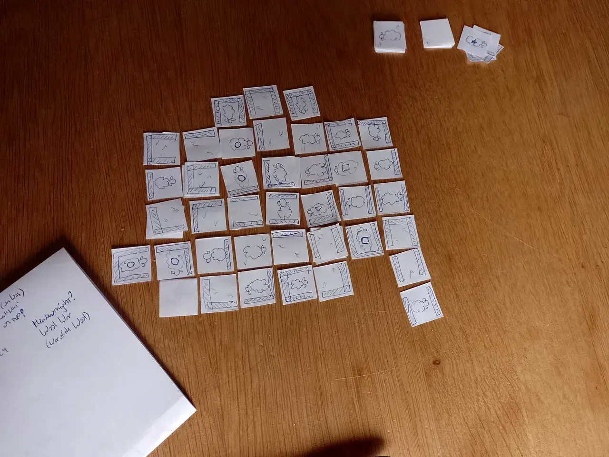
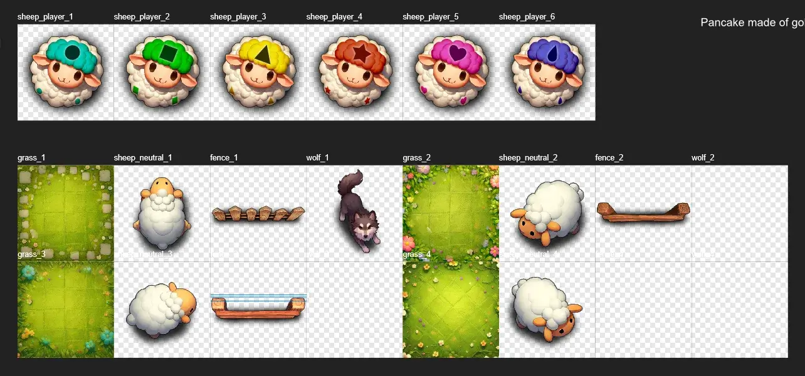
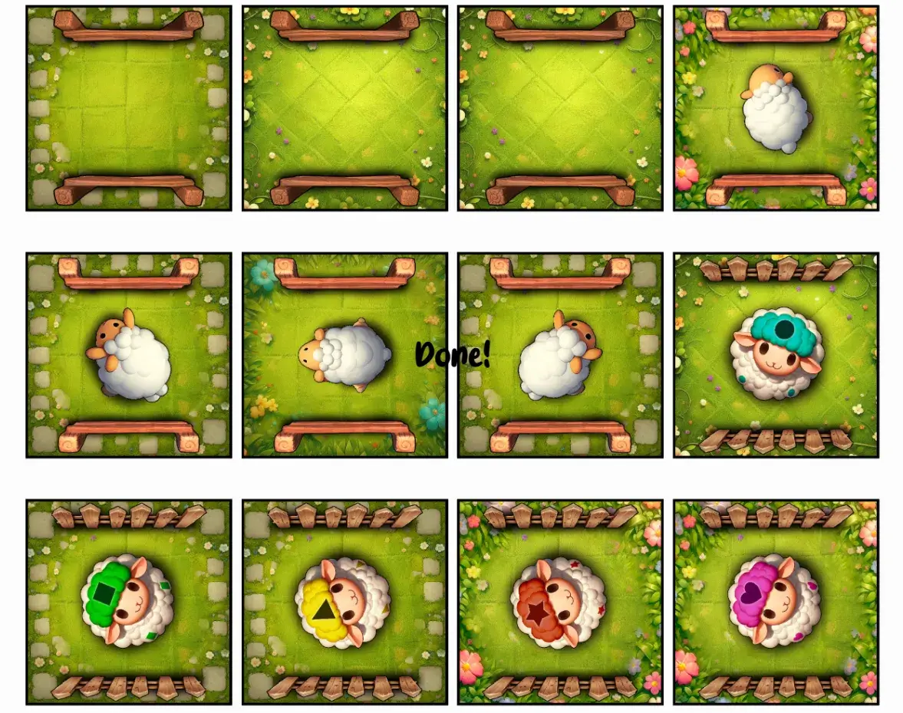

Welcome to the devlog ("developer diary") for my game [Meadowmight](https://pandaqi.com/meadowmight).

I'll explain the process of making the game, the problems and how I solved them, and any other interesting steps in between.

## What's the idea?
I love minimalist games with extremely high player interaction and depth.

That's probably how this idea popped into my mind one day.
* You have a deck of tiles showing fences and possibly sheep.
* A few of those tiles show a "Sheeple" (just a sheep with a specific player color/symbol), which you receive at the start
* On your turn, you place a new tile into the meadow.
* At the end, you score for all enclosed meadows which contain _your_ Sheeple.

It seemed like a really, really simple game that would work and look fun on the table. Just a bunch of cute sheep in an expanding world of fenced-off meadows.

At the time, I was _extremely_ busy, which meant it took a whole week before I could even _write down_ the idea. That turned out to be a good thing, as it allowed my brain to keep thinking about it and basically create the whole game in my head before I did the first prototype.

When I cut out some paper tiles to test the game against myself, I already had the whole ruleset.
* Players get 4 tiles of their unique Sheeple, and 4 random tiles at the start.
* On your turn, you either PLAY or CHANGE.
* PLAY: Add a tile from your hand to the board. 
	* You can't place one in a meadow that already has another player's Sheeple.
* CHANGE: Pay 2 tiles to **rotate** an existing tile.
	* Of course, rotating a tile might connect two meadows that were previously unconnected! (A **conflict**!) In that case, the _bigger_ meadow wins. All Sheeple from the "losing meadow" are removed.
* The game continues until all players have no more tiles. For each Sheeple in an enclosed meadow, you score the _size_ of that meadow as points.

That's it. That's the whole game, and as usual, it _sounded_ like it would work great in my head.

Then I tested it.

## Prototype Lessons
Okay, yes, it _did_ work for the most part. Below is an image (from my phone) of the first test game against myself.

But here's what I learned.

### Rotation
**Rotating was too expensive.** Paying 1 tile was more balanced. Even so, being able to rotate _anything_ at _any time_ was a bit too powerful.

**We need sensible limits on rotation.** In the end, the following two ideas worked the best.
* You can't rotate a tile that has a double fence on any side. (Example: it shows a fence on the right, and the right neighbor shows a fence on the left. Hence, two fences next to each other.)
* You can't do the CHANGE action anymore as soon as a player runs out of tiles. (Because they'd be defenseless and you can take turn after turn ruining all their effort for their whole game.)

The "double fence" idea actually came from a different idea I had. Something about sheep being able to jump over a *single fence* but not over a *double fence*. That idea was a bit vague, but while testing I repurposed it to what you see above, and it was a great way to limit the rotation action.

If you identify a tile as "crucial" to your game, you can try to play something besides it to get that double fence, creating some future safety for yourself. 

### Tile Types
**All tile types seem equally valuable.** When creating the prototype, I simply created equally many tiles of each configuration.
* No fences
* 1 Fence
* 2 Fences: on opposite sides, or creating an "L"
* 3 Fences
* 4 Fences

I was afraid that something like "3 Fences" would be too restrictive and the least useful, but that didn't turn out to be true.

* The 0 fence obviously expands your meadow without adding any restrictions, which is very free but also adds the danger of never fully enclosing (and thus never scoring points).
* The 1 and 2 fence are great for expanding a meadow while closing off some parts ... but _also_ most susceptible to a rotation attack.
* The 3 fences are very restrictive ... but _less susceptible_ to a rotation attack. (Because most rotations will just be the same, as there are 3 fences.)
* The 4 fences are a great way to instantly close off many sides, and otherwise a great tile to "pay" for doing a rotation.

**We need some neutral sheep.** Only once I started making the paper prototype, did I realize that I completely forgot that there should probably be something on the tiles **besides** fences.

In the end, I created a 50/50 split.
* Half the tiles were just empty (= a patch of grass).
* Half had a (neutral) sheep.

When scoring, each sheep in your meadow would score +1 point.

I actually played both with and without this rule, and adding the neutral sheep was clearly more interesting and more balanced. (You could be stuck with a small meadow, but still make it worth more by collecting a lot of sheep inside.)

### How to resolve conflict?
First of all, I quickly realized you can connect two meadows during the PLAY action as well. Of course you can! Don't know how I missed this, but you can obviously play a tile in a gap and therefore connect parts of the board that were previously unconnected.

But now came the biggest question: how to resolve the conflict when connecting two meadows?

My first try said that the Sheeple you removed just returned to the owner's hands. This, however, turned what *should* be a penalty into something that's actually helpful. (You get your Sheeple back! Now you can use them in a better way!)

Additionally, this left **holes** in the meadow. (My second attempt, just _discarding_ the losing Sheeple, didn't solve that one either.)

My third attempt finally worked.
* The losing Sheeple are simply turned **facedown**. They should be considered as "fences on all sides". (In other words, you don't create holes anymore, though your meadow _can_ change in good or bad ways after winning a conflict.)
* But when PLAYING a tile, you may also play **on top of a facedown tile**.

This combination of two simple rules was by far the best.
* Losing a conflict means losing important Sheeple, so you _really_ want to avoid that.
* Winning a conflict isn't overpowered, as you're still left with some gaps or changes to your meadow.
* And players can still strategically plug those gaps in a way that helps them (or severely hinders the player who just scored a big meadow).

In practice,
* Conflicts are easy and quick to resolve.
* The board remains easy to read.
* The balance between risk and reward seems about right. (In all my test games, players on average did 4 rotation actions over the whole game. It's not so overpowered that you do it all the time, nor so difficult that you won't bother with it.)
* And the number of gaps or stacks never grows very large. (In all my test games, it only happened once that a tile had a stack of _three_: lost a conflict twice, played a tile on top twice.)

The number of tiles for my test game (64 = what you can get out of folding a paper several times) also seemed right.

Which means it's time to just **make this version of the game!**

## Let's make that
### Graphics
Such a simple game needs a very small list of graphics.
* A top-down fence
* A top-down sheep. (With colored variations + simple symbols for specific Sheeple.)
* Some green grass / meadow background texture.

I wouldn't even bother researching a _visual style_ for that. I just asked AI to make me a lot of images, I drew them myself, I merged those efforts into something I thought looked decent.

Well, okay, that was the _intention_. The expectation from my end. 

In reality, the forced top-down perspective of the game proved **really difficult**.
* The AI just _would not_ truly understand the perspective, especially not for the fences.
* Most of the time, it "overdid" the image. Adding way too much detail, color, glow, etcetera, which just _does not work_ when the image has to be combined with other elements and tiles in a board game.
* This was especially obvious with the grass texture. I just wanted some green, empty grass with perhaps a few flowers or visible stalks of grass. What does the AI give me, even when I tell it not to? Huge meadows, hundreds of flowers, shiny stones, fantasy landscapes as if seen from satellite view, etcetera.
* With the sheep and the wolf, asking for top-down view (or satellite view, or bird's perspective) made the characters look _up_ (towards the "camera"). Which, again, isn't great for this board game. It was near impossible to get rid of this.

So despite getting really "pretty" images from AI---and only needing 4 good ones---I spent almost a whole day just trying to get where I wanted to go. (I saved some of those lush meadows and funny sheep in another folder, so maybe someday they'll return.)

In the end, I did the following.
* I noticed the AI would follow the perspective when asking for a _herd_ of sheep. So I did that, cut out all the sheep (that looked right), upscaled them again, and used those after some edits/cleanup.
* I drew my _own_ rough version of a top-down fence and used "img2img" to render its shadows and detail. This worked kinda, but not good enough for me.
* Growing increasingly frustrated, I decided to just _model_ a 3D fence, place it in the right position, and see if that gives me something. That's when I realized "surely others have modeled a wooden fence before", found a few free models, and used those.
* In other words, the fences in this game are _screenshots_ of a 3D modeled fence, with edits afterwards to make it fit a bit better.
* (This is such a powerful technique that I'm happy I realized the possibility and will surely use it more often, when I need a very specific object/perspective that is absolutely nowhere to be found in references.)
* I picked _one_ grass texture that wasn't incredibly detailed and could function as a background. Then I pasted that on top of some other textures, and erased/edited/blended the edges. So that, now, all grass tiles share the same center (which looks consistent) but only have different details at the edges.

It was a lot of work. Still less work than if I had to draw it all myself. (The sheep would've been fine, but I've tried painting semi-realistic textures many times before and just don't grasp how it's done.) And it was instructive.

Anyway, here's the end result.

### Generator
Then came the time to write the code to generate this material.

As stated, all possible combinations of tiles seemed equally useful, so I saw no reason to do any more algorithm magic.

I defined all possible fence configurations in a dictionary, including other metadata. (How often the tile should appear, whether it has a sheep variation or not, etcetera.)

Then my code simply loops through all these configurations, and for each ...
* Creates the right fences.
* Creates one tile with a sheep, one without.
* Creates one tile with a Sheeple per player. (I decided to have a max player count of 5, though it could be 6 if we increase the deck size.)

If this game receives expansions or other special tiles, it will only change the middle illustration (sheep or not), so I figured I could fit that new code into this system later if I wanted.

(It seemed logical to add something like a "wolf tile", but I wasn't even sure what it would do, so I ignored any thought of expansions/variants until the base game was done.)

### More polishing
Seeing all tiles generated (and side by side), I saw some more graphical issues to improve.
* Some of the sheep aren't top-down perspective enough => I can remove their paws and change some shadows to make this more so.
* Two of the fence types have strong shadows on them (from the 3D model thingy!). On their own, this looks fine. But when combined on a tile, this obviously creates a situation where light has no clear origin (it seems to come from everywhere). I can either reduce contrast on the images themselves, or arrange fences to make shadows appear on the same side.
* Now I accidentally generated 5 tiles per player (because there are 5 configurations). I can't be sure if the game works best with 4 or 5 of them, so I'll probably leave this in and test both.

All those tiny fixes are usually "annoying" to do (and take more time than you think), but they do lead to a more consistent and polished end result.

That said, this game was supposed to be very quick (as I didn't have more time to work on a bigger game in these weeks). And now it's already taking me way too long! So I probably have to accept some imperfections and just call it done.
## Playtesting
### Results
Alright, we tested the game a few times, and ... **it just works?**

Below is an image of one of the final games. (As always, apologies for the lighting and mediocre camera quality.)

Some rules needed clarification, so I rephrased it in the rules. One image in particular clearly isn't the same style as the others, so I'll have to redo that one.

But besides that? Nobody had any feedback, and I didn't notice any downsides to the game as it is now.

* Explanation and play is extremely simple and fast. (You're playing within one or two minutes, turns are fast, there's never long waits or uncertainty.)
* You always have _something_ to do, be it helping yourself, hindering another, or planning a big rotation in the future.
* Scores are pretty tight. (Though that also happens naturally. Usually, near the end of the game, the player who is clearly ahead will be hindered by everyone else.)
* The rule of "no more rotating once a player is out of tiles" also makes total sense and improves the game.
* The number of fences / open tiles, and the number of sheep, also seem quite balanced. (As I already noted while testing the paper prototype against myself.) With effort, meadows can usually be closed _or_ kept open to make it harder for the other player to close them.

### Improvement: end game
My _only_ issue happened with the very _first_ game(s) you play with a new group of people. They don't really see the extreme value of rotating a tile yet, which causes them to not use it a lot. 

Which, in turn, causes a weird situation near the end of the game.
* The drawing deck is empty.
* So ... whether you place or rotate, you always _lose_ one tile anyway. So the rotation action is basically free now! 
* Which means many players save it for _last_, which is the least interesting / impactful thing to do.

This solves itself once players get a few games under their belt. They'll rotate and annoy each other right from the start :p

Still, it felt like something that a minor rules tweak could improve.

> To rotate, pay _2_ tiles, then draw one from the deck.

People were confused anyway that placing allowed you to draw, but rotating did not. With this change, rotation will automatically be more expensive (it actually costs you 2 tiles) once the deck runs out.

It also allows you to throw out a few tiles that aren't helping you, giving more options and strategy. So that's the one "fix" I made.

### Improvement: deck composition
After even more playtests (and thinking), I decided to make the deck _slightly_ larger. On the highest player counts, you really want a few extra tiles, especially now that rotating is more expensive.

What kind of tiles? 
* Empty on all sides. (Prevents the game from being too closed and safe, with too many fences.)
* Two fences. (Gives the most fun opportunities for rotating and conflict.)

So I sprinkled in a few extra tiles of those types for the final "perfect" deck.

### Improvement: out of your comfort zone
After playtesting so many games, I've noticed a general human truth. When a game is high interaction, most people will still try to stay in their comfort zone and avoid that interaction. Even if it means losing the game!

You can see that in the image I provided of one test game. Yellow (my dad) just built _one_ huge meadow the whole game. He didn't even _consider_ starting a new one somewhere else, as he thought it was too unsafe. (You can see there are no yellow Sheeple anywhere else.)

The result was that we only needed _one_ rotation to break up that meadow, and he couldn't win anymore. So no, not a winning strategy. Not that fun either. But still ... people go for it all the time.

So I changed the **scoring rule**. Because now, I accidentally _reward_ this safe-but-useless behavior!

* Current rule: "You score for _each Sheeple_ in an enclosed meadow." (So 2 Sheeple in a meadow of 5 tiles, scores 10 points. This is what encourages players to just stick all their Sheeple into one big meadow and hope for the best.)
* New rule: "You score the size of each enclosed meadow that contains a Sheeple of yours." (So you only get those points _once_.)

It can still be beneficial to place multiple Sheeple in that one meadow! (As backup, to break ties favorably on conflicts, etcetera.) But now you're rewarded for spreading out and playing a more interesting game.

{}
The old rule remains as part of the "Fuzzy Fences" variant, which I designed to be more _friendly_ and to suit those who want a little less cutthroat interaction.
{}
### Conclusion
Besides that, because the game is such high interaction, how it plays out completely depends on the _players_. Some games are more "solo", with fewer conflicts and people just building their own meadow. But that's fine, because players _choose_ to play that way. If you want, there are always options to be aggressive or block each other.

I'm really happy with this extremely simple yet tactical game! It's one of those rare cases where you envision a simple game, quickly make it, and it actually turns out the way you predicted (for the most part).

Until the next devlog, keep playing,

Pandaqi