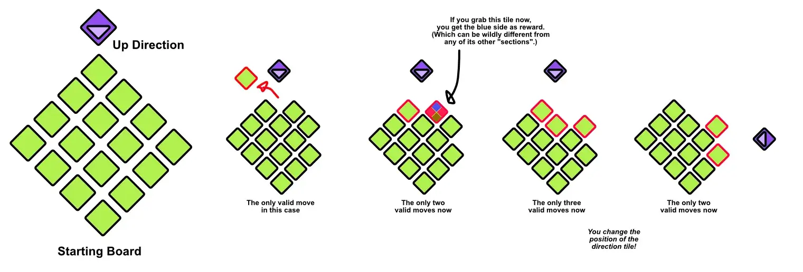
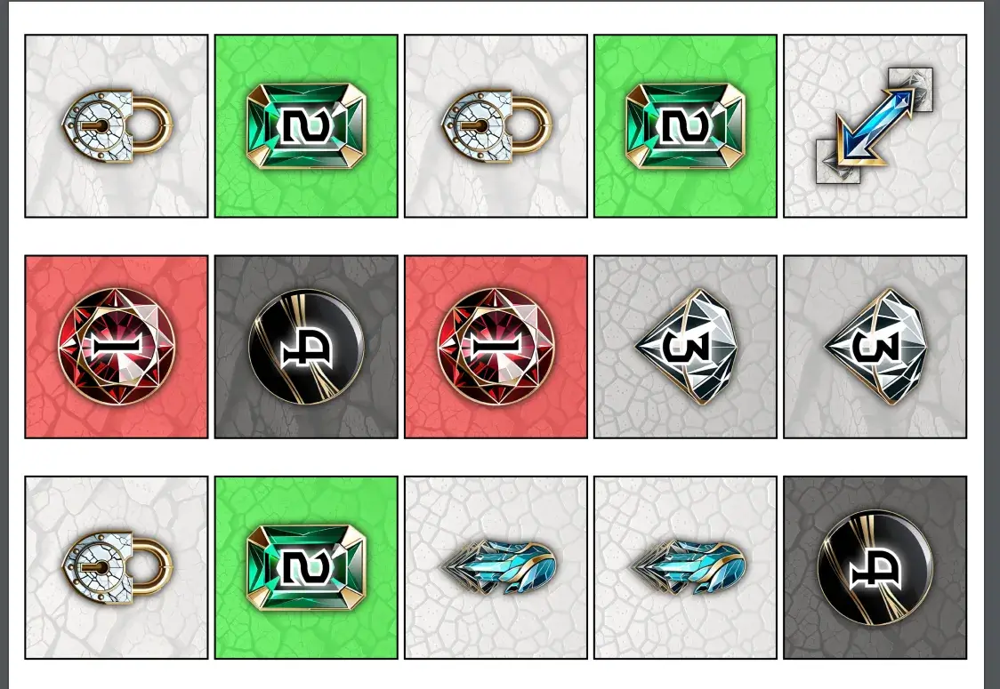
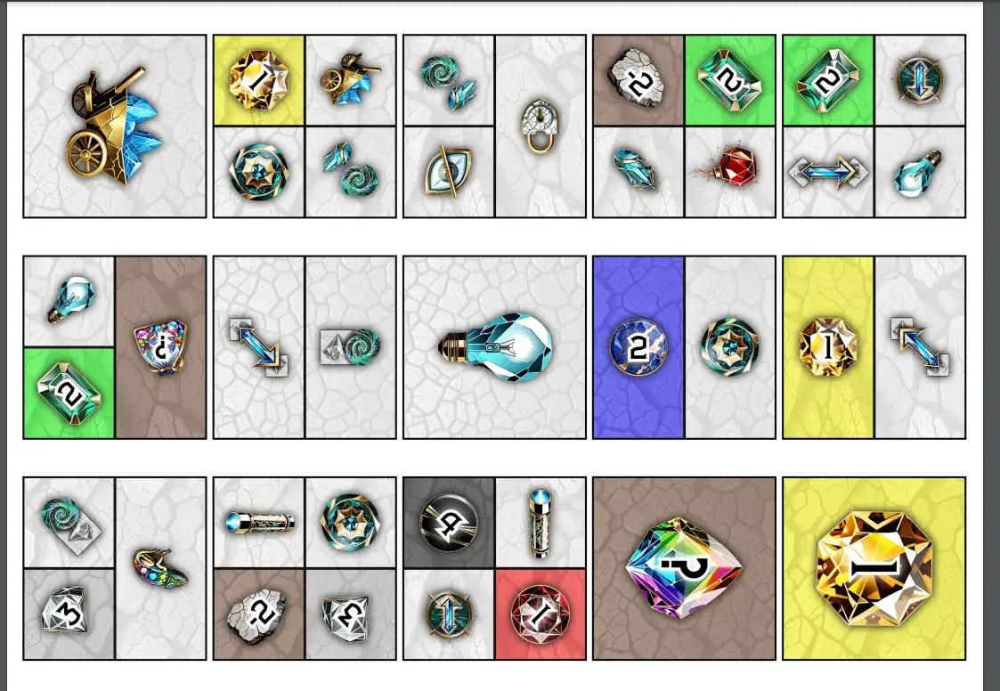

Welcome to the devlog for [Mountain Miners](https://pandaqi.com/mountain-miners/).

In this article, I'll briefly explain the development process behind this game. At least, it's _supposed_ to be a very simple game that is quick to make, but that usually doesn't work out well for me ...

## What's the idea?
You place a grid of square tiles on the table. But they have a _diamond_ shape (so the pointy corners of this rectangle point North, East, South, West). You can view it as two mountains stitched together, the bottom one turned upside-down :p

There's an arrow tile outside the board that points to one of those corners.

Now comes the main rule of the game:

> On your turn, grab 1 tile from the "top". The "top" is the layer of tiles that the arrow tile currently points at.

I'll show the sketch I did; it's much easier to see it that way.

In other words, you are constantly taking a tile from the top of a mountain. But the arrow tile rotates around to constantly change where that top actually is.

This was just a small idea that seemed like it'd take almost no material or rules, yet work really well each time.
* All information is open and predictable. You can plan moves in advance and make sure the perfect tile is "on top" on your turn. (Obviously, _rotating_ that arrow tile is one of the core actions you'll take in the game.)
* It's a unique core mechanic that I've never seen before, while staying simple.
* The map can be entirely randomized each time, leading to easy setup and lots of variety.
* It's intuitive: you chip away at the mountain, shrinking it, until nothing remains and the game is over.

I immediately made a paper prototype and tested it. (With one A4, I can easily get enough tiles + an arrow tile to make this happen.)

## Lessons from the prototype

### Ideal board size
I tried 4x4 first, which instantly revealed itself as too small. Even 5x5 was on the small side. A 6x6 diamond seems ideal.

### Too many actions
There are action tiles and point tiles. I split them roughly 50/50 at first, but this led to way too many action tiles (and too few points to go around). A 20/80 split seems more reasonable.

Even then, it's likely that---near the end of the game---only action tiles are left. It's pointless to play on then, so I had to change the end condition. 

> The game ends as soon as all "point tiles are gone".

### Changing the top is too important
Initially, moving that arrow tile (that determines the "top of the mountain") was an action tile.

As the board is randomized, however, we can't even be sure that this tile _appears_ (often enough) in any given game!

Or maybe all of end up in the center, making them unusable until the end of the game.

This won't work. Changing the top should be a core rule, something you can automatically do each turn. 

Ultimately, the best choice seemed to be.

> After grabbing your tile, move the arrow tile one step clockwise.

I tried "move it anywhere", but that was obviously too free. I tried "move it one step clockwise or counterclockwise", but that is still too free, while slowing the game down with that choice each time.

Another action was "arrow lock": when played, you _can't_ move the arrow tile anymore (it's "locked"). Until somebody plays another "arrow lock" and unlocks it.

This also isn't great, as it can lock the arrow for the entire game. (Especially if the map happens to have only have 1 Arrow Lock tile!) So, I replaced it with two actions.

> Arrow Move (Action) = move the arrow tile anywhere.

> Arrow Lock (Action) = only stops the _automatic_ movement (at the end of your turn).

### When to execute actions?
At first, the rule was "You may discard one action tile to execute its action, before or after grabbing a tile".

Many action tiles, however, are not that interesting on their own or _just_ too weak to do damage. The solution was to allow 2 actions: one before and one after your turn. This leads to more interesting combos and more "usefulness" to actions.

{}
The alternative, of course, is making the actions themselves more powerful. But that means giving them a longer description, with more details or exceptions. I don't like that. Actions should be simple one-liners. Let complexity come from _combining_ simple ideas.
{}

### The crucial one: what is the "top" of the mountain?
I hoped to find a simple rule here that allowed more diversity.

The initial rules said "any tile to which you can draw a straight line from the arrow tile, without hitting anything else"

Five seconds of testing revealed this to be useless. It ignores tiles that are clearly on top. The arrow tile is haphazardly placed by players, so no true location anyway. It's messy and doesn't work.

I tried other simple rules. About edges facing the arrow tile and what not. But _nothing_ reliably (and simply) told you which tiles were currently "on top", especially not once you have bigger maps with holes and tunnels after a few rounds.

So I settled for the simplest, barebones definition.

> The top of the mountain is the straight line of tiles closest to the arrow tile.

So, well, exactly what you'd expect. It reduces the options, but is much easier to visualize and use.

Until I realized it actually gives **new options**! So far, the arrow tile could only point in cardinal directions (North, East, South, West). But with the new rule, it can also do the _diagonal_ directions: North-East, South-East, etcetera.

This solidified the rule for me. 
* During the game, you can use the **Move Arrow** action to move it to a diagonal, suddenly opening a world of opportunities. (Because of the diamond shape, you'll generally be allowed to grab _more_ tiles there.)
* But it's not overpowered, because now the arrow tile stays on diagonals. (Remember: it rotates a quarter turn after each turn.) Once you do this, the next players can reap the same benefits, so time it well.
* Doing a Move Arrow again, though, can move it back, so it's not like it stays there forever.

Finally, the playtest revealed something that should've been obvious: parts of the board can come loose. Creating tunnels and then grabbing the one tile that connects everything ... turns the board into two boards.

There are many ways to solve this in games.
* Simply don't allow the board to ever split.
* Ignore it and play on.
* Make it a bonus: you get the smaller group.

I tried them all, and the third was most interesting. You don't want to accidentally give another player a _huge_ reward (for splitting the board, so you have to be more careful about which tiles you grab.

### Conclusion
That's all of it. With these changes, my paper prototype played well. Not _awesome_, but it worked pretty well, and that's enough.

My ideas that add extra spice are all "expansions" you can easily add after a few games. (An obvious one, for example, is turning the entire mountain _facedown_. Now you don't know what you're getting, though there are obviously actions to help you here.)

## Let's make that
None of this is particularly interesting, I'm afraid.

I found a simple visual style. I generated some images, I designed some myself. This game screams for something like diamonds or gold buried in the mines. (Or it screams for treasure buried inside pyramids, but it's treasure all the same.)

Because all the tiles are on the same map, in any random configuration, it also wants simple and mostly consistent graphics. Otherwise it's just overwhelming and potentially clashing. 

So the general icons are somewhat generic and abstract. I tried to make it a little more unique by having "gold veins" running through them.

I wrote the generator for the material. It's just square tiles with one big icon placed in the center. (And a slight modification for the expansion that adds a different icon to different corners.)

Then I forgot to update this devlog for a while, which means we will now skip to my notes on playtesting with new players and proper material!

## Playtesting & Polishing

The game worked _better_ than I imagined from my own paper prototypes. There's just something about playing against other players---with completely unique ideas, strategies, hidden tactics---that is needed to truly reveal the flaws or strengths of a game.

It's quick to setup and explain. After a few turns, the general idea of "grab from the top layer" and "the arrow rotates clockwise" settles in and players grasp the core ideas of the game. Including explanation or interruptions, games usually took 15--20 minutes. Which is great!

While playtesting, I kept thinking "oh we have slightly too many action tiles" **and** "oh we have slightly too many gemstones". When all was said and done, this just meant the numbers were actually balanced.

Yes, gemstones are what actually score, so maybe we want more. But also action tiles are the only thing that actually make the game work and give you varying strategies, so maybe we want more. That tension lingers in the game from start to finish, and I'm actually happy with that.

My main notes were:

* Maybe a nice variant/expansion would be to have a few secret tiles in your hand. It means some information isn't open and it means you start the game with more actions and thus more (long-term) options.
* That whole "splitting the board" thing? Yeah, barely relevant. So irrelevant in fact that I just removed the rule entirely (i.e. didn't even explain it) after the first two test rounds and the game was fine without it.
* The "double" action said "take another turn", but that's actually not most interesting or balanced. It's easier to execute _and_ less overpowered to just say "grab 1 more tile this turn".
   Move some action tiles to a third expansion. (I kinda just chucked all my final ideas into the Gemshards expansion, but that turned into ~10 new icons to learn, which is just too much. The 5 possible actions from the base game have revealed themselves to be the absolute _maximum_ of new information to learn, if the game wants to stay simple and lean.)
* Action tiles that change the **direction** of arrow rotation (now it's always clockwise!) and the **speed** (now it's always a quarter turn, what if that could be 1/8 or 1/2?)
  * This is such an obvious way to play with the core of the game. Don't know why I didn't see it before :p
  * But I don't want to blow up the number of unique icons to learn, so I _merged_ some similar actions to make room for these. 
  * For example, the action "secretly look at 1 row of tiles" and "publicly reveal 1 row of tiles" were separate icons first. But this can be merged into one _and_ made more interesting by just giving you a choice: "Either secretly study 1 row OR publicly reveal 2 rows."

With all those tweaks, the game is even better and I'm confident calling this project finished. 

(It's never perfect. Because perfect doesn't exist and I can always find flaws and things I wished were more "amazing" about my projects. In this game, as mentioned, I feel there's a weird tension between how little variety in choice/actions you can sometimes have. At the same time, this isn't actually an issue in practice and is also simply part of strategy. What to do? Stop overthinking, test and refine until it plays fine in practice, then call it done.)

That's it for this game!

Until the next devlog, keep playing,

Pandaqi
