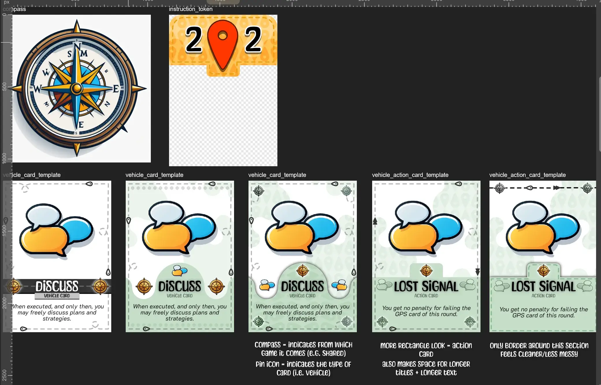
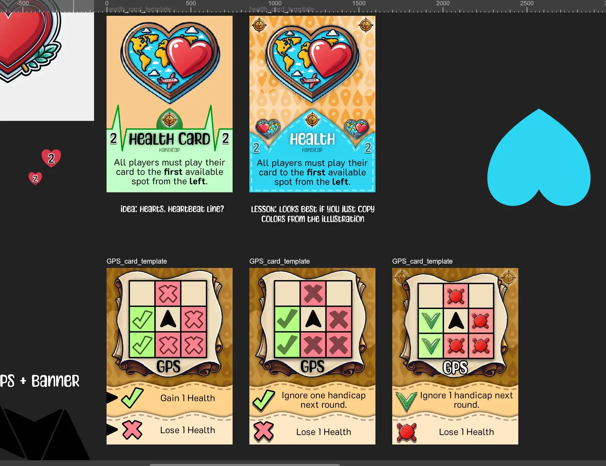
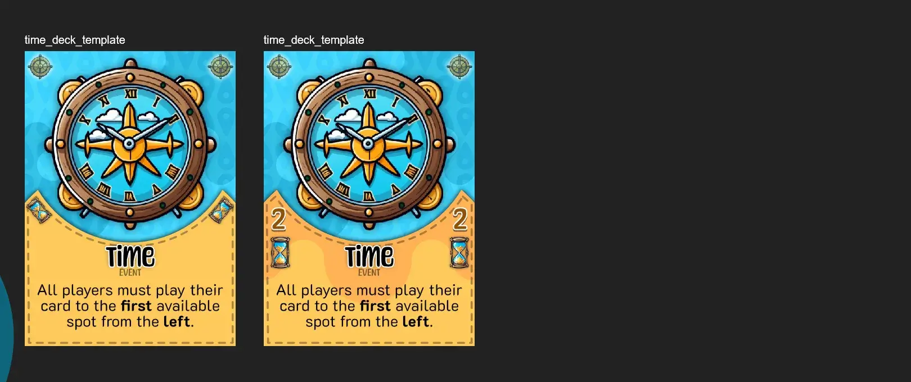
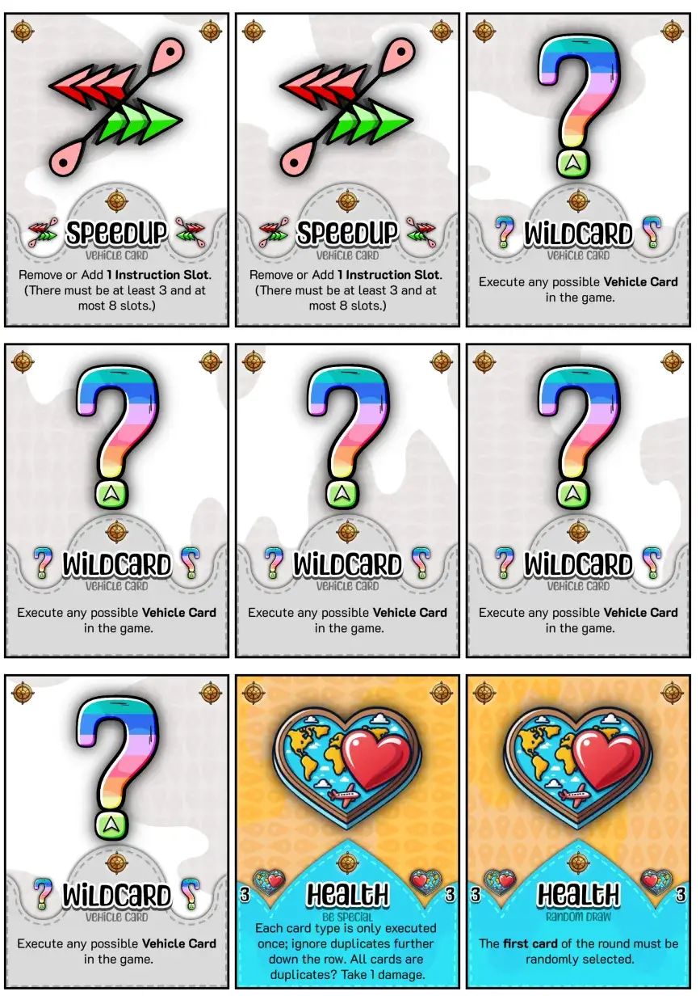
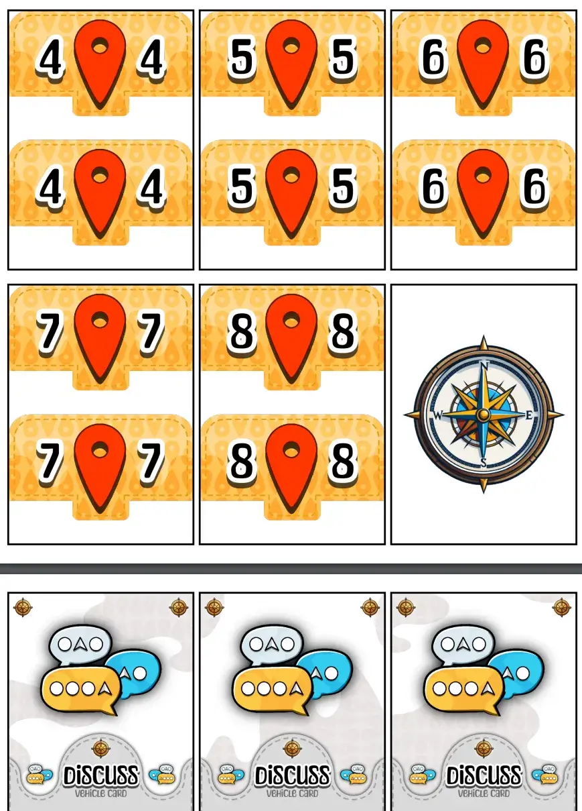

Welcome to this devlog about the [Naivigation](https://pandaqi.com/naivigation/) games. This is a special one. It will be longer, less streamlined, and might not lead to anything in the first place. The folder on my computer is currently called "Naivigation Better" (because "Naivigation v2" didn't really do it justice).

Why? What is Naivigation?

It's a game I made some 6 or 7 years ago in which you **drive one car together**. A cooperative game in which you secretly play cards like "move forward" or "turn left", and try to reach the finish before time runs out or the car is total loss.

The game idea is _solid_. When I tested the game, it worked and was a lot of fun. I also envisioned expansions or spin-offs that would work equally well, such as steering an airplane or ship together. In fact, it's been online and playable (both in Dutch and English) since the inception of Pandaqi.com.

But at that time, I had barely made / finished a board game, and it shows. The rules are far longer and more unwieldy than necessary. There are unnecessarily tight restrictions on player count and material. I _knew_ my **implementation** of the idea was _meh_, but I didn't have the skill to solve it. 

To make matters worse, my spin-off ideas went nowhere. This gap in the idea, these annoyances and complexities of the game, made branching out into streamlined expansions really hard to do. The game lacked replayability, lacked depth, lacked a polished execution of the idea.

Each year I planned to redo this idea, properly this time. Each year there was not enough time or drive to do it.

Now that I have ~50 games under my belt, I decided it was worth taking another look.

This devlog is about how I tried to **learn from past mistakes** and **redo this game idea, but much better this time**. Hopefully it's fun, interesting and educational.

{}
I didn't know this project would become so big, and I'm terrible at planning ahead anyway, so I initially wrote this devlog as one long article. I only split it into separate devlogs---one per game---later. My apologies for any inconsistent references or paragraphs that now seem out of place if you just read this article and don't read the devlogs it links to!
{}

## The Core Problem
I couldn't see this back then. I really couldn't.

When I returned, however, with fresh eyes and more experience, the core issue of the idea instantly jumped out to me. If I don't fix this, none of this will work.

> You are steering the same vehicle over some public map. This means it's always _clear_ where you want to go. You can _discuss_ how to get there, without ever mentioning your specific cards. This means there is no uncertainty, no randomness, nothing that can really go wrong---you execute that strategy during the next round/turns and it probably works.

In the original idea, I (subconsciously?) tried to solve this with a third element: **GPS Instructions**.

Each round, after you've discussed (and must now stay silent), reveal the next GPS instruction. It says something like "Second exit to the left" or "Straight ahead". _If you didn't follow this instruction while driving, you'd incur a way harsher penalty._

The idea was fine, but in practice this was mediocre. Most of them were simply impossible, e.g. there _was_ no second exit to the left. Others were nearly unachievable, which meant players basically ignored the GPS at all times. All of this required loads of extra rules, examples, and exceptions.

{}
I also made the map generate on the fly. The finish was already in place, but you'd only add the next 3 tiles each round, creating a _little bit_ of uncertainty about where to go.
{}

So what **do we need?**

We need to modify this core mechanic to ...
* **Allow some randomness that comes _after_ the start of the round.** (Like the GPS instructions, but way simpler and impossible to be "ignored". For example, after making your plan, the start player of the round is randomly decided.)
* **Allow _choice_ during your turn.** (Even when you make a plan, you might still be forced to do something else, or try to grab a better opportunity on your turn.)
* **Which is related to making _your actions_ influence _other player's actions_.** (For example, maybe the driving cards have a second **fuel number** that can be 1--5. If the other players accidentally play cards that exhaust all your fuel, you suddenly can't do your perfect action anymore!)
* **Use a competitive, traitor or otherwise personalized element.** (Players have secret objectives/powers---not shared by the whole group---which causes them to sometimes steer the car the wrong way. For example, if you manage to visit 5 blue houses along the way, _you_ win on your own.)

There's no need to do all of this. No, no, that'd be overwhelming. That's what the expansions and spin-offs are for. I might lean into one aspect in the _car-based game_, then into another in the _ship-based game_.

But to me, these clearly stood out as the key solutions to the core problem of this idea. It would turn a somewhat bland game into one that has more group strategy, more surprises, more thinking ahead, more funny moments driving your car straight into a wall, etcetera.

## The Core Strength
The _strength_ of this idea comes from its absolute simplicity and constant interaction. 

Rules are explained quickly. Everyone understands the concept of a moving vehicle and reaching some established finish line. On your turn, all you do is **play 1 secret card** to the row of instructions. (When the round is done, these cards are revealed and executed in order to move the car.)

You are never "doing nothing". Because each card you play has to work together with all the other cards. It's cooperative and everyone needs to chime in with what they can and can't do. ("Okay, then we need to drive two steps backward." "Ah, I'm afraid that will be tough." "Unfortunate. But what if we go _that_ way instead?" And so forth.)

I want to keep that. The "game loop" of EVERY version of Naivigation should be as simple as ...

> Play a card facedown to the row of instructions. Once done, reveal and execute. (With instructions being simple "move forward", "turn left", and so forth.)

### Removing complexities of the original
Though the original idea was, as I said, unnecessarily complicated with extra tidbits of rules. They show the right idea, but aren't the solution.

* If the car was ON the road, GPS had to be followed. If it was OFF the road, you could ignore it. (Another reason it didn't really work: "second exit to the left" is meaningless if your car is not actually on the road :p)
* Before playing cards, all players had a choice: 
	* Either keep your current hand, but you must play in **order** (left to right instructions).
	* Or discard your hand and draw 3 new ones.
* The start player had to play _two cards_ to the instruction row.
* And then we had another page of rules about how to increase time, increase car damage, bookkeeping, yada yada.

You can see the attempt, right? Give players interesting choices (keep cards or not?) and make it influence how they place cards (in order or wherever they want). Make the start player play multiple cards, increasing the likelihood that they mess up plans.

But it's all so convoluted and "meh".

### One objective is enough
Perhaps the most egregious issue, as I see it now, was that the game had **two loss conditions**. (Creating 3 end game conditions in total: lose 1, lose 2, and win by finishing.)
* You either run out of time ( = more than 20 cards placed on the time deck).
* Or you totaled your car ( = more than 5 cards placed on the damage deck).

Multiple winning conditions can be _great_, but not this time. They required loads of extra rules, two separate decks, the magic numbers of 20 and 5 that players need to remember, and all that for what should be a simple game!

I can still do them both, but I'd need to simplify and move it out of the base game (to an _expansion_).

I would also make the loss condition _obvious_ or _immediately visible_. Instead of adding cards to a time deck until some magic number is reached, invert it! Start with a time deck during setup, and you lose if _the deck runs out_. Simpler. Needs no more calculation once the game has started.

I'd also make it more _intuitive_ or _thematically linked_. It's a "time deck", right? It's about running out of time? So let's just make a **clock tile** that can tell time, and have one hour pass per round. If the clock strikes 12, game is over.

{}
Fortunately, I could already see these notes in my earlier attempts to revitalize the game idea. I was moving in the right direction, but couldn't figure it out. 

In those early attempts, I also focused way more on _theme_ and _graphics_, when I should've focused on gameplay and made a paper prototype. My notes talked about turning the car version into driving a _carriage_ around Victorian London, it talked about all the decorations we could put on tiles to make them pretty. Yeah, more like pretty _useless_ :p
{}

{}
Also, the old version had action cards that merely stated their **name**. You had to look in the appendix of the rulebook to see their actual action. Yeah, not great. Just put text on the card.
{}

## Where do we start?
Another realization that I had before, was that the car version is not the best version to start with. Yes, the theme is perhaps most obvious or approachable, but driving a car across an actual road network is way more _complicated_ than e.g. flying an airplane in free space. (In a game, that is, not real life.)

So, what possible vehicles do we have?
* Cars (and perhaps busses, or bikes, or something similar)
* Trains
* Airplanes
* Ships
* Spaceships

Cars and trains need road networks. That means more complex tiles and rules for movement.

Ships need some map that combines open water with islands. Otherwise, they should be quite simple.

Airplanes and Spaceships, however, are the simplest. They just need an open space with some "locations" scattered around, either airports or planets. 

And of those two, spaceships seem the best start. They are slightly more "interesting" as a theme---to most players---and movement is just "rotate" and "thrust". (With airplanes I would imagine some "height" mechanic to change it's elevation.)

### A distant dream: unity
It would be _awesome_ if all these games were interoperable. In other words, if you had both the Cars and the Airplanes ... you could _combine_ them into a longer and slightly more complicated game.

Now that I do a complete redesign, I want to use this opportunity to chase that dream. Design all games to use a uniform set of tiles, designs, core rules, etcetera.

I'd already written some rules sketch for it. Basically, 
* You have a different row for _each vehicle_ included.
* You play 1 card per turn to a row, as always.
* Only once a row is _filled_, do you reveal and execute it.
* You are trying to move a package from A to B, which requires multiple connections and transferring the package between vehicles.

This might change. It probably will. But it seems doable at the moment.

### What's the better objective?
I mentioned two loss conditions: running out of time or taking too much damage. 

Initially, I favored running out of time. This, however, is hard to balance and keep simple.
* If you play with more players, you'll move faster, so for balance the time deck should be smaller. Buuuut I don't like a big table in the rules that says "with 3 players, use this, with 4 players, use this, ..."
* I'd need to playtest _a lot_ to find the ideal size of this time deck for any variant, any expansion, any version ... which I can already tell is impossible.
* For some games, this doesn't really make sense. The pirate ship has to reach a random harbor before some arbitrary amount of time has passed? It feels tacked on.

I also mentioned only one win condition: reaching some finish line or target tile.
* This, however, doesn't always make sense. (For example, the spaceship variant with free movement has no use for a "target planet". It's more sensible to have the objective be to visit all planets, or to move packages to the right destination.)
* Picking the start and finish is also an open problem.

As I finished more and more of the rulebooks, I realized a better _default_ win and loss condition.
* LOSS = DAMAGE. No matter the vehicle or gameplay, losing because your vehicle is total loss is _intuitive_ and _relevant_. If you play with more players, you can do more in one round ... and also get more damage in one round. It balances itself. (This was originally an "expansion" that fit every version.)
* WIN = VISIT ALL LOCATIONS. This is a clear goal that counts down all the time. It requires moving around the entire map. It doesn't have the issue of having one clear "correct path"; there are always multiple locations yet to visit. And anyone can _scale_ this by including more or fewer locations (growing/shrinking map size). This felt too easy? Throw two more locations in there and try again!

So far, everything indicates that these should be the core Naivigation objectives.

### What's the better core?
I mentioned that we need some randomness _after_ making your decisions. My example of a random start player actually felt like the best approach! It obviously works for all games (it doesn't need changing per version). 

But it only works well if this start player is somehow limited in their choices. If they can place anywhere, it's a surprise that needs adjustment, yes, but most plans will still succeed as, well, planned.

So I added a second part. The _location_ where they must play their card is also decided.

(I chose to add a compass tile that you randomly spin around and see at which player it points. We can also use a dice or something, though I like my games to stay entirely print and play.)

This felt like a simple but strong _core_. All other great ideas should be specific to a version or an expansion. So, finally, finally ...

## Swerving Spaceships

As stated at the start, I eventually decided to split this devlog into _smaller ones per game_. As such, for our first game, I'll just link to that other article.

I recommend reading this one, though, as I figured out the _shared Naivigation rules/material_ while developing this first game. It was the "guinea pig" for Naivigation, so to speak, so many parts are only explained in that devlog.

Click the link to read the (short) devlog for this game: [Swerving Spaceships](/blog/naivigation/visit/swerving-spaceships).

## After finishing the first Naivigation game

Okay, so, we're basically done with Swerving Spaceships now. In this section, I want to talk about some insights and how that changed the Naivigation project moving forward.

When giving examples or images, I'll be using the Spaceships game most of the time. But the idea is that all of it applies to all games.

### Good Folder Structure
If all goes well, this "project" will have at least 5 games, if not double that. It felt messy to create a top-level folder for every one of them. (For example, `naivigation-swerving-spaceships` and `naivigation-singing-sails` etcetera.)

Instead, I did some work to achieve a much better structure.
* The one "shared" naivigation project is at `https://pandaqi.com/naivigation/`
* Inside it is a subfolder (which I called `visit`, to stay thematic)
* Which contains the entire project folders for all versions, which makes the URL something like: `https://pandaqi.com/naivigation/visit/swerving-spaceships/`

The original website wasn't set up for this. Fortunately, I'd already written some smart code to combine pages with their assets, and I could modify that slightly to use the entire URL. (Not just the final folder, which was fine before because there were no "subgames" within games.) 

This may seem a minor technicality, but this _really_ cleans up the folders and files needed to make this all happen smoothly.

### How to communicate this to new players?
The more I work on these versions, the more clear it becomes that a set of "shared material" is really useful: one PDF you only need to download/print once, and now you have 50% of your material for _whatever version of Naivigation you want to play_.

This does, however, complicate things for new players. I desperately wanted to keep this simple, at most a 2-step process. So I did the following.
* The main page of Naivigation clearly explains this structure in one short paragraph.
* Then it immediately gives a recommendation: download the Core Set and Swerving Spaceships, and you're good to go. 
* Afterwards, it gives a nice list that links to all versions.
* As usual, all the extra "expansions" (optional variants you could add to _any_ version to make it more varied or challenging) can be checked manually if you want them in your shared material.

Now I just needed to write the generator code for all shared material (underneath the `naivigation`) folder, and all generator code for specific material (underneath the specific subfolder for that game).

For now, the shared material is ...
* Vehicle Cards (Core Set) => the "Discuss" card needed in all games.
* Instruction Cards (Core Set) => these create the row underneath which you place your instructions.
* Compass (Core Set) => for randomization
* Health Cards (Core Set) => about 10--15 cards with unique handicaps to get as you lose health. (Specific games might add a few more specific ones, but these will be enough for any game.)
* Time Deck => the objective of the original game ("lose when you run out of time"), but now as a tiny set of extra cards
* Fuel Deck => a mechanism that constantly makes the game harder by simulating the need for fuel to move
* GPS Cards => that extra idea from the original game (draw a GPS card each turn, ignoring it leads to a great penalty) -> these are now _randomly generated_.
* Action Tokens => public, unique tokens that you can use _once_ per game (at any moment) to help yourself with some unique action.
	* These were the result of my original notes stating a clear need for more public information and more control over special, fun, unique actions to shake things up.
	* Large, chunky tokens that are within everyone's reach and single-usage ... seemed to fit the bill.
	* Until it didn't ...

### Action Tokens -> Only Cards
As I wrote the code for this shared material, however, it became increasingly clear how the Action Tokens were the odd one out.

_Everything_ was a card (of the same size and design) ... except those pesky Action Tokens.

_Everything_ had simple text explaining it ... except those pesky Action Tokens. Because they could be used only once, at any time, their wording felt convoluted and out of place.

The original game had such actions as _Vehicle Cards_ instead. It was actually one of the better parts of the game, as they always led to interesting decisions and shake-ups. But for the reasons above (lack of public information or choice when to use it), I didn't want to do that again---until I realized I was being stupid.

I can just give players the choice.
* Want an easier game? Place the vehicle cards with an _action_ open on the table. Anyone can use them, any time, but only once.
* Want a harder game? Just shuffle the vehicle cards with an action into the regular deck.

This way, the _entire_ core material set is just _cards_. Cards of the same size. Cards with simple text that clearly states what it does. And we still get the best of both worlds.

So ... after spending half a day writing separate code for cards and tokens and stuff ... I removed all that and simply folded the action tokens into the existing code as vehicle cards with an action.

Now material is simpler, more minimalistic, and more consistent. And I can support multiple play modes (to vary difficulty or the type of challenge) for free. Things like that always feel like crucial realizations to have early on.

## Finding a common (art) style

### Fonts
To me, Naivigation has always been a little more modern and technical. We're driving cars, steering trains, flying planes. That's why the original version used a single, sans-serif, very neutral/geometric font.

It worked, but was a bit boring. Not enough contrast, not enough personality.

For this new version, I wanted two fonts.
* **Body:** still a sans-serif, but one that has a more soft or distinct look, and more contrast in styles. (One requirement is that the font has an _italic_ variation, as that's just really useful for (de)emphasis and I use it a lot. Another requirement is that it isn't TOO distinct, as then it wouldn't fit with multiple games.)
* **Heading**: a serif, or handwritten, or otherwise special thick font just for headings and the logo. (Something that matches the body font, of course, not too childish or outlandish.)

There are many nice and readable fonts in the world. Unfortunately, especially for sans-serifs, they look mostly the same. They have no identity, nothing to remember them by, which makes them unsuitable for a game's appearance. (Which you want people to recognize and remember.)

That's why I kept searching and searching until I had about 10 body fonts and 10 heading fonts to try. I show them side by side in a file, I try to put them on sketches of cards, and eventually pick the best ones.

{}
Another easy way to quickly compare them is to pull up an actual web page---such as my old page for Naivigation---then _swap_ the fonts for the ones I want to test. Take a screenshot, place the screenshots side by side, and you have a much more realistic "in-action" view of what the design would look like.
{}

As I said, most fonts are _nice_, but we're looking for the best font for _this project_. Some of the really nice fonts just looked too distinct or too "sci-fi", which forced me to discard them in the end.

_Unfortunately,_ I lost the screenshots of those font comparisons :( I'm disappointed in myself too. After all these years, I have really good habits about categorizing and labeling stuff, and I clearly _remember_ having this large list of font comparisons to show to you ... but WHERE ARE THEY!? I don't know. Sorry. 

Just imagine that all my other fonts were _similar_ to my final chosen fonts, but slightly worse for different reasons :p (Lacking numbers, too thin, too playful, too similar to standard system fonts like Arial, etcetera.)

In my code, I automatically share the names and links of these common assets with _all_ Naivigation games. When writing that code, however, I realized this might be a bit too static. Surely a game about steering a _spaceship_ would not use the exact same fonts as one about steering a _train_ or a _bike_.

I invented the following rule: each game has a third "unique" font. That font is extremely thematic and used in several places to make this game really _different_ from the others. (It is just part of that game's assets and only loaded when needed.)

For the spaceships game, we want some futuristic, geometric, abstract special font.

### Picking Colors
The original used 4 recurring colors to indicate _terrain types_. That's not really a thing anymore. (Only a few games, such as the car variant, would even be impacted by a terrain expansion of some sort.) 

In fact, I now remember that the original didn't actually use this as well :p People kept asking what that 4 colors meant, and I said "different terrains", and they were like "what do they do?", and I said "... nothing? Yet?"

Instead, I decided to go with **5 common colors**, one to indicate each **major game**.

* Dark Blue/Purple = Space
* White/Black/Grey = Airplanes
* Light Blue/Turquoise = Ships
* Green/Yellow = Cars
* Red/Pink = Trains

{}
Reminds me of those 5 colors for Magic the Gathering in that circle shape.
{}

Not only will these colors return in the _shared_ Naivigation logo/marketing, but they will also be the core color for the _Vehicle Cards_ of that specific game. (Most versions merely add new Vehicle Cards and Map Tiles. By coloring them like that, you can easily sort them out and know to what game a card belongs.)

### Picking a Card Template
I put this off as long as I could, because I feared it would be hard. 

I had to find a general "template" for all cards, which would look good and consistent ... but also allowed more than enough variation to make each version look distinct. I had to find something that could fit a lot of text ... but look equally balanced without any text at all.

A template general enough that I can slot in different games, colors, everything ... but also specific enough that it _fits_ with the style of graphics I created and included.

Well, in the end I just cleared an entire Sunday and got to work experimenting.

Below are some in-progress screenshots with different versions, trying out different colors and graphics and whatnot.

You can see I started out with a dotted outline around the _whole_ card, until deciding that was too busy (and would likely clash with the black border for cutting). I toned it down. Similarly, I started with only flat stark black-and-white, then grew into slight colors and patterns to shake things up.

I guess the main goal is to be able to ...
* Immediately tell the type of a card
* Then tell what the content is or what it does
* Then, with lower priority, tell to which game it belongs

As such, I was looking for as many _different_ design elements as possible to give this information.

Type of card?
* The shape of the lower block is different. => This turned out to be the biggest and best indicator of a card type. Probably because it encompasses so much area, and you _have_ to look there to see the title or content. This is more effective than using different _icons_ (e.g. along the edge) to differentiate.
* The colors are different.
* It's written in the title or subtitle.

What's the content?
* This is the huge graphic at the top/center
* Which is repeated twice at the sides
* And then we have a big title and text that is clear and as big as I can make it. (You can see I tried adding some pattern or decoration behind the text, but it just removes legibility, so I'll probably end up _not_ doing that.)

To what game does it belong?
* As stated, each game has one _main_ color. Its map tiles and vehicle cards will be entirely that color. (The vehicle cards you see above are the _shared_ cards and therefore mostly white/colorless. For a specific game, these will have the specific _color_ of the game.)
* I also made sure each game has a specific _icon_. (Again, for shared cards this is a general beige compass. For spaceship variant this would be a _spaceship_ and so on.) I try to show this at least 3 times on the card, one obvious and two more to the sides or corners.

The sketches above show the slow progress to finding out these elements and how they combine into a simple but pretty card design.

{}
Though it's nearing the _style_ I want, none of the graphics are permanent now. In these sketches, they're a weird amalgamation of the first thing generative AI gave me and stuff I drew myself.
{}

### Using and improving the card template

Then, of course, the biggest test is to _modify_ this template for our first game (Spaceships). To see if it truly _is_ easy to differentiate and work within the template.

What changes?
* The vehicle cards get a unique color.
* It shows the icon of that specific game (in place of the compass seen above)
* (It obviously fills in the unique text + graphics for vehicle cards in that game, but I'll show or tweak that when I write the _code_ to generate this on my website.)

I still wasn't sure this was enough. It felt like I had to write it out on the card or completely overhaul something. Maybe change that pattern of "map pins" on the background for a _different_ pattern in each game.

{}
I _still_ like that dotted outline a lot, because it also indicated type. So I might bring that back somehow.
{}

Let's keep experimenting and see where we end up.

### Varying the instructions

While making Swerving Spaceships, I realized the second shared Vehicle Card: Speedup. (Read that devlog for more detail on that process.) When played, it allows you to _add_ or _remove_ one instruction token. A great/simple addition that has huge implications for strategy, variation, and customization of your vehicle.

I'm not sure this should be in the base game. The game works _fine_ without the "Speedup" card. Adding that one simply makes it more varied, adding both opportunities for more control as well as more chaos.

And when in doubt, I've learned to always err on the side of _make the game absolutely as simple as possible_. Once people tried their first game, they realize they like it and want more. If you make the base game too complicated to learn in the first place, this will never happen.

At the same time, it's not big enough to be its own expansion or anything.

As such, **I decided to keep it in the main material, but mention in the rules that they _can_ be left out.** 

I had a line anyway that said the Discuss card is pretty much required, because some people wrongly assumed that the shared material was _all_ optional.

### The balance between knowledge and randomnesss

This is my biggest ... dilemma, let's say. This game only works if there's enough _information_ to actually do meaningful moves and strategize, while also having enough _randomness_ or _unknowns_ to make this a challenge and accidentally damage your vehicle.

Right now, we're lacking in the information department. This makes the game more "fun, casual, party, don't think too much about it", which is fine, but I also want to have the option of that other side that has more depth.

At this moment, this is how you can gain information about what's actually played (or what people intend to do):
* The **Discuss** card, where it's up to you to gather this information.
* There are a few **Action Cards** (an optional expansion) that do this.
* (Some other rare expansions or special tiles, either shared or specific to the game.)

That's all! Almost everything leans on those Discuss cards + your ability to think ahead and reason what others probably played.

This is why I imagined rules like "one card per round may be played faceup". But having experienced the game, this is probably _too much_ information! Having that one certain card, visible to all, locks all other decisions into place much more easily.

I'm looking for that _one final rule_, that _one final idea_, that helps the Naivigation core achieve this balance in all games with more fun and variety.

Here's the best idea I had.

* All games are about _collecting_ those 5 important locations. (As far as I can see now, even the weirder ideas/vehicles stick to this.)
* This moment should feel like a huge achievement and a nice way to mark progress, but currently it's just "yay we have a tile!"
* So let's make it a bigger moment!
* **When you collect a tile, all players draw an extra card and reveal their hand to each other!**

This means you get a bigger, secondary reward for collecting something. It also means you _can_ know everyone's cards for the next round or two, allowing better strategies and cooperation. (Of course, this requires nothing else to get in the way and your memory to serve you. This isn't a certainty.)

Quickly testing this against myself is obviously not the best measurement, but it _does_ really seem like that balancing factor we want. Not too overpowered---you still can't communicate, for example---but certainly a large dose of useful information. At a fitting, nice moment.

{}
Maybe we do need a reminder of this rule while playing, like an icon that will be present on ALL collectibles. Just a simple hand + a card. I should've done that from the start anyway. But those are implementation details to iron out later.
{}

### Other Considerations: The Fuel Deck

I was skeptical of this "shared expansion" (so one thing you could add to ANY game) from the start. Now I'm certain it shouldn't be shared.

* It's a great ruleset (running out of fuel and refueling), but also harder to remember/execute. And because it has to be _shared_, I can't put reminders on cards which would help with that.
* Many vehicles obviously don't run on fuel or need refueling :p
* It's near impossible to playtest this expansion and _balance it_ with all possible games. (Because the depletion of fuel and refueling need to be perfectly balanced, otherwise you're either never out of of fuel, or ALWAYS out of fuel. Which is hard to achieve if every game has a different vehicle that moves in different ways.)

So I ripped it out of the shared material, and put it with the AIRPLANE game for now. (That game had no "special gimmick" yet, while being the most obvious choice for something that would be disastrous if it ran out of fuel.)

I can also add it to some other games (such as cars, which obviously need fuel). If I just reuse the same template + icon I already have, this should even look and feel consistent across games.

### Other Considerations: Setup
I talked before about the issues with the setup. We need a map that has the collectible tiles _reasonably spread out_, which you don't know for sure if you place the tiles randomly. Similarly, the vehicle obviously shouldn't start on a collectible tile already.

The best solution, for those who have a phone at hand, is to press the button in the rules and get a random setup to copy. (Because I can simply code that to follow rules.)

After testing the game a lot, however, the "manual solution" I had just seems needlessly complex without actually solving anything.

Instead, I realized we needed **a starting tile**. Yes, it's that simple.
* Create a deck of 25 tiles, of which 5 are the collectibles and 1 is the starting tile.
* Place the vehicle (or both vehicles, if playing in teams) on the starting tile.
* Go.

This is much simpler to explain and execute. 

It means both vehicles start in the same spot (if playing with 6+ players), which is far more interesting than if they happen to start far apart and don't really meet for most of the game.

It also ensures the vehicle never starts on a collectible tile.

And yes, bad luck can cause this map to be unbalanced. All collectibles might end up in a straight line right next to your starting tile. But now I know that ...
* This is just as likely with any more complicated rules I could invent.
* It's not actually very likely, and it doesn't ruin the game that much. (It's still hard enough to steer that vehicle without communication ...)
* And the simplest solution is just to ... redo the map if it looks boring to you. That's something that's always recommended and always possible anyway, so I'm fine with adding a remark about that.

All of these changes did make the project _even longer_ as I had to keep adding more images, modifying code, shifting sprites. Now the code had to support a default starting tile on all games!

But they're all _relatively_ simple changes with great results. The new setup rules make the game even simpler and more straightforward to get into.

Below is an image of the final shared material (at this point in time).

Alright! I've updated the Naivigation core to be as good as it can be, which allows me to start on the next game!

## Frightening Flights

The one where you control an airplane together. (Or ... multiple airplanes flying dangerously close to each other in the same air zone.)

Click the link to read the (short) devlog for this game: [Frightening Flights](/blog/naivigation/visit/frightening-flights).

## Singing Sails

The one where you control a ship together.

Click the link to read the (short) devlog for this game: [Singing Sails](/blog/naivigation/visit/singing-sails).

## The Road Network Problem

At this point, I had to start thinking about the versions of Naivigation that required some "road network" or "rail network" that makes sense.

The more I checked the old game and the old notes, the more I realized I was just thinking too narrowly (and in the wrong direction).

The old rules used the idea to "draw the map as we go".
* You only begin with a start + finish tile, roughly on different corners of a 6x6 grid.
* Each _round_, you drew the next 3 tiles and placed them as you wanted.
* (And if a tile couldn't be placed, you just draw a new one until it works.)

This worked well enough, but isn't great.
* If you play _too well_ you are actually punished, because the road simply stops and you can only move ahead 3 tiles at a time.
* Yes, it encourages players to place the tiles sensibly (creating some sort of logical network), but not as much as you'd hope. There'd always be 1 ideal tile and 2 "what to do with these"-tiles that were stuffed away in a random corner.
* It means the game starts out very empty and lifeless. And people are terrible at predicting how far the start + finish must be apart :p

Especially with the new rules, and my will to be able to _combine_ the different versions, drawing the map on the fly just doesn't work. I had to think outside the box.

Doing so led to an insight.
* The only way to guarantee a road network that makes sense (and connects all locations) is by exclusively using **4-way crossroads tiles**. They connect everything to everything! In other words, during setup you just create a 5x5 grid of those tiles and nothing else.
* As you play, however, certain mechanics cause you to "destroy the road". Perhaps it's an alternative to taking damage: "replace 3 crossroads tiles with random tiles from the deck"
* This means that the road becomes more interesting and harder to navigate over time. But when it does, it's _your fault_ (not just randomized setup). And it's still in your control to some extent.

This works for roads as well as train tracks or any other network that's needed for a vehicle. I can see this as a core system for those versions of Naivigation.

It seems, to me, a beautiful way to ensure you have a connected map from the start, while allowing chaos and randomness as the game goes on.

Of course, the second part in solving this problem is always having an easy way to go _off the network_. Because these systems _will_ create situations where there's just no road leading to your destination, so you have to drive for a little bit through the terrain. For example,
* CAR = "You can always drive off road. But when you do, you take 1 damage at the end of that round."
* TRAIN = Some card or special power that allows trains to reappear in another station at any time.

Staying on the network should be rewarded, but going off of it should not be a huge deal.

Once I'd figured that out, I could go ahead and make the final two "major Naivigation games".

## Crashing Cars

The one where you control a car together.

Click the link to read the (short) devlog for this game: [Crashing Cars](/blog/naivigation/visit/crashing-cars/).

## Troublesome Trains

The one where you control multiple trains together.

Click the link to read the (short) devlog for this game: [Troublesome Trains](/blog/naivigation/visit/troublesome-trains/).

## Intermezzo!

So I wrote all these rules, prepared the projects, 100% made the first one ... and then I had to do other projects. I was basically gone from Naivigation for a year, until it was the most urgent project on my list again. 

With which I mean: I still had one year to finish it, no hurry or stress. But all _other_ projects planned before then were done now, so it was "highest priority" :p

I gained even more experience designing games. My website saw huge upgrades making it easier to generate the material. It also became much faster and user friendly.

Most of all, I created 2 "holiday-themed" games that are standalone spin-offs of Naivigation. These are in Dutch because they're meant to be played at a national Dutch holiday. 

{}
I talk about _Saint Nicholas_, the one Christmas is most likely based on. Which basically comes down to giving free gifts to young kids until they stop "believing" in Saint Nicholas :p
{} 

Because these games were meant to be playable by _young kids_ and potentially _large families_, they had to be dead simple. Low on material requirements, preferably no text, simultaneous turns, etcetera.

Designing these games made me rethink a lot of what I was doing with Naivigation. In a good way---it gave me some better insights and ideas that could make the games _better_ before the first one is even published.

What were my thoughts?

### A general simplification

The "5 major games" will mostly stay as they are. They are tested, they are the core Naivigation formula, and I don't see how to make massive changes without ruining what is there.

When coming back, however, I was able to read the rules with "fresh eyes". And I realized I was still changing "too much" from game to game. I noticed that I would like to have every major game _slightly simpler_. Just _one less rule, maybe two_. Reuse more of the _shared rules_, trust that _expansions_ are enough to keep the game interesting long-term if players so desire.

So, step 1: simplify those major games even further.

For example, the Airplane game had very simple rules, except for two fuzzy lines.

* "You can't steer while changing elevation." In other words, a steering card after an elevation card is always ignored. 
  * **Problem?** Why? What does this add? It basically makes the card after it a garbage card, because in the base game you can't do much more than steer and elevate! It's an _interesting_ and _realistic_ rule, sure, but this isn't the way.
  * **Solution?** Remove the base rule. Instead, make this one special card/effect that you can trigger.
* When you land on an Airport, you collect it. But when you land on a Stopover, you _replace_ it with a new tile from deck.
  * **Problem?** Why? Why the distinction? This is a needless exception.
  * **Solution?** Just say "after landing, replace the tile with a new one, and set your elevation to match the new tile"

These are minor things, perhaps. Remove a line or two. Rewrite for a consistent rule instead of two cases.

But critically streamlining all the games in this way removes needless paragraphs and exceptions everywhere, which is always nice.

### Three (potentially) better base rules

Creating those Saint Nicholas games basically revealed three strong ideas.

* **Simultaneous Turns**: if I add a _number_ to every card, players can just play at the same time, then sort (low to high), and there's your instruction row. 
  * **Advantage**? This creates a faster game that keeps everyone engaged (even more). This also removes the need for the extra material/space for the "row of instructions".
  * **Disadvantage**? This has the _downside_ of not working well with the shared material setup. Because the numbers need to be unique. And if you can mix-and-match multiple sets from different sources, I can't guarantee that in any way. It also makes a game impossible to win _unless_ you have a lot of knowledge about the cards in other players hands.
* **Better draw piles:** in the base game, there is just _one_ draw pile (facedown) with all cards in it. However, we can get more information about each other's hands if we just separate the pile _per card type_, and make it _faceup_.
  * **Advantage**? You can pick the cards you need, and other players---if they play well---can remember what's in your hand.
  * **Disadvantage**? This, perhaps, gives away too much information and certainty.
* **Wildcard Vehicle:** this is an obvious one that I somehow missed. A vehicle that just says "I am any of the other vehicle cards in this game".
  * **Advantage**? Without adding any complexity, you can now "fix/repair" a bad situation as you're revealing cards. You have a slight opportunity, sometimes, to steer back into the right direction, even after playing your cards. The start player has interesting or tense choices to make when they see a wildcard.
  * **Disadvantage**? I'm tempted to add this as shared material, but will this work with all games? And doesn't the shared material get too big/overpowering now?

As the list shows, these are really strong ideas. Very simple, but very effective at solving core balance issues with this idea. The main issue, as I repeatedly stated in this devlog, is the balance of _information_. You need to know a bit of what other players have or want to do, otherwise all strategy goes out the window. These ideas pinpoint that exact problem and solve it.

But only when used in the right place.

As such, I decided to do the following.

* The major changes (such as simultaneous turns) will only appear in the _minor games_, not the 5 major ones.
* Anything that helps make the game easier (and give more information), will only appear in the _hardest_ of the games. (To balance their difficulty. For example, the train game is by far the hardest, as you're confined to that network and it's hard to maneouvre the train wagons. That game would love some more information sharing.)
* The "shared vehicle cards" change as follows.
  * I add the Wildcard as _shared_ material, but optional. It's _allowed_ to be used in each game.
  * But I make the Discuss card _optional_ too.
  * By default, the draw pile is _faceup_ (giving lots of information, but not too many, and no choice what card you get). If you add the Discuss card, however, it turns facedown (because now _that_ is your way to get information).

In other words, there is actually no "required" vehicle card from shared material to add! This is even simpler than before, without that weird exception of "some shared material is required, some is optional".

At the end of this "coming back to the project"-phase,

* Every single game has become simpler.
* Every single game has become better balanced, and otherwise players can modify it easily themselves (by adding/not adding wildcards for example)
* All the minor game ideas became simpler and more interesting, with more unique approaches to the core game loop.

I call that a productive day. Now let's actually continue and _finish_ the darn games.

As expected, the details for _finishing_ each game (including images, other versions, etcetera) are in the individual devlogs per game.

{}
It's interesting to look back sometimes. The original idea that spawned this entire project, was made almost 10 years ago now and had 10 pages of rules. For just the base game of moving a car! And the game was "okay"---the core was great, execution heavily flawed.

Now I've simplified the idea many times over. Even when I thought it couldn't be simpler, it always could. And the base game is just 1 page of rules, and it is SOOOO much better.

I think it's important to actively look back like this sometimes. To remind yourself how much you've grown, how far you've come, how all the hard work and redoing stuff is worth it. Even if it doesn't feel like it in the moment.
{}

## Navigating this experimental project

I didn't intend to write any more into this devlog about the general project ... but here we are. As I returned and actually made and finished the 5 "major games", I encountered obstacle after obstacle. Enough to completely hurt my progress several times and make me take a break for a week or so.

This project is very challenging. It tries to lay a reusable foundation for at least 5 games (but hopefully most of the others can also use this). It has this very efficient but experimental structure of "you need the shared material/rules ONCE and then it's easy to apply that to any game". Every game has _two_ interactive parts in the rulebook: randomized (but fair) starting setups + detailed example of a realistic turn. At the same time, the games themselves can be hard to figure out or to illustrate.

Let's just say I encountered many problems I never even considered before. Lots of code (and rules) was rewritten multiple times.

For example, I initially created one huge "shared spritesheet". It contained everything needed for the shared material, and it would be the thing that's loaded on every other game too. The problem, though, was that this image became far too large. It's not even that it takes a while to load/download, my laptop is so old and bad that it _couldn't_ anymore. 

And so I had to reshuffle things, update all the data ("where can I find icon X in which spritesheet now?"), and split the shared material into multiple smaller images. Which are only loaded when truly needed. That was the only way to even get the generator going (and make it faster) on my broken laptop.

{}
Once you see something like this, you always smack your forehead and ask yourself what you were thinking. Of course it was stupid to load the spritesheet with ALL action icons for EVERY GAME, even though we only need those ~20 illustrations for the "action card" expansion in the shared material. But, well, in trying to get such an experimental project going, you do stuff like that.
{}

### Another Example: the shared mega-game

When I started the project, I still had this ambitious idea that "all games could be combined". If you wanted, you could _mix_ the tiles and cards of any two vehicles (or more!) and create a huge game about navigating a larger map. This led me to write incredibly obtuse and weird code just for the _possibility_ of supporting this one day. (For example, _every_ tile automatically tried to draw terrain and elevation for itself, but would "return out of the code" if the tile had no such data set.)

Now I'm a bit more experienced with this (having made several Naivigation-style games), and literally another year older, and can only conclude that this was incredibly foolish.

At this time, I completely **gave up the idea of allowing "seamless mixing" of multiple Naivigation games**. It's just not happening. I mean, we have a SPACESHIP game and a CAR game ... you just _can't_ allow the cards and tiles to be mixed and expect any sensible map or gameplay from that. It would need loads of modifications or extra rules, ruining the individual games just to support some ambitious mega-game that only few would even try.

Additionally, making some minor/special games showed me that many need one or two "big changes" from the core rules. Nothing too bad, mind you. My core (shared) rules are still really strong and I can twist them into wildly different games/vehicles. But those changes are large enough that _mixing_ the games, or mixing other material, is simply not possible. I mean, one of the planned minor games is a _skateboard_, another is a _zeppelin_, it's just not going to work together.

So no, this isn't happening. I let go of that, which allowed me to simplify the code and make it more specific to the game itself. It's far easier to say "okay, in this game elevation matters, so add those markers to the tiles" than to try and force it into _every game_ and don't forget to turn it off/generate the numbers in a balanced way.

Instead, if I _do_ make a shared game, it would just be standalone. It would be like the _Rails & Sails_ game from Ticket to Ride. It has much of the same material and rules, but it's a _new game_ completely made to _blend different transportation methods_. That game would probably only include those 5 major vehicles (though potentially leave out the spaceship) and a different core ruleset to have it make sense.

But that idea has sunk to the lowest of priorities. It's already hard enough to make one Naivigation game at the moment, so let's focus on small steps :p

### Another Example: The road/train networks

As stated, several games have a "network". The tiles have roads/lines/railroad tracks on them, and these restrict movement in the way you'd expect. (For example: trains can only move forward/backward along their track.)

Well, I obviously wanted to write the code/system for that _once_, then re-use on all such games.

This isn't easy. Different games need different _images_ for this. Both major games that use this also have a very logical expansion with "different path types" (e.g. you drive more slowly over cobblestones than asphalt), so the system also needed to be able to handle _that_. Furthermore, it's crucial that these games have enough crossroads to make the setup work, so I needed to tightly control the percentages/probabilities of every type occurring.

And that's not even everything. Those games also have more difficult requirements for the (interactive) setup, namely, that all those tiles must be crossroads!

What my mind registered as "oh, if I write some simple code for 20 minutes, I can give these two games networks" became "oh I've been working on a clean general system to add networks to any Naivigation game for an entire day now".

Yes, I was trying to do too much. Too ambitious. Support too many variations and custom networks for _any_ Naivigation game I might want to make later.

At the same time, this is all still valuable work. And it's still "relatively easy". Simply picking the right frame for the right road is _not_ rocket science and it's something that can be used for many vehicles.

So I do it anyway. But more slowly, telling myself to just "take the next step", and only checking if it all works many days later :p

In the end, "networks" became a first-class citizen in my code. Just like terrains. I can easily give the generator a dictionary of percentages ("I want terrain X on 50% of tiles, network Y on 25% of tiles, ...") and it assigns all of that automatically. It's saved inside a simple `.network` property on the tile, which is automatically drawn correctly, though I can also modify/read that any other way I like.

### Another Example: Interactive Examples

As I wrote the section above, I also remembered another very nasty change I had to make.

All major games use a _single_ vehicle. That's to be expected: the entire idea of Naivigation is to drive _the same vehicle together_. 

As such, all the code for these examples was based on that.

> During setup, grab the first VehicleToken in the material, and place it at a suitable starting cell ( = as far away as possible from all collectibles).

But ... then we get to the Train game. Where you're not steering the same train, no, all of you are commanding the same _network_ ... but it has multiple trains.

The code wasn't made for this in the slightest, which meant a _complete_ rewrite of this code + all interactive examples of the other major games. 

* I had to add an extra parameter (to the creation of the setup object) that allows me to tell it how many vehicles I want.
* I had to add an extra custom function (which I can insert if I want) to pick the "starting positions" of those vehicles in a different way. (In the train game, trains must start on a station of the WRONG color.)
* And I had to rewrite the whole thing to add a parameter to _all_ functions (that read/modified the vehicle): "which vehicle do you want?"

For most games, it will still just be a single vehicle. That's why this parameter defaults to `0` ("we want to move vehicle 0"), and the rewrite amounted to just adding lots of zeroes in lots of places. But because everything uses this _shared_ system, if only a single game needs multiple vehicles (or "trains" in this case) ... it has to be supported in a clean way.

Now, just like with the Networks, this _is_ valuable work. This issue showed me how bad the previous code was (in this area), and now it's much cleaner and "future-proof". It became faster and less error-prone, too, because by grabbing the vehicle you want first, you can be sure you're working with the right thing.

But it's a day of really tough work. Writing, rewriting, getting overwhelmed, worrying if this approach still isn't future-proof enough. And when you didn't expect _any work at all_ ... that becomes demotivating and ruins all your carefully laid plans :p

{}
I simply started the day with "just add these bits of information to the Train game, and it's done, so I can continue writing that book". Then I realized this obvious issue with my interactive examples, and BOOM---the day is over, I'm still not sure my code is 100% correct again, and I haven't done any writing work!
{}

I give a few examples here, and I'll give some more tiny ("summarized") examples at the next next section. But I hope you realize that this sort of thing happened again, and again, and again. It's just to give a taste of the development process for this entire project. This is true for basically _all_ creative projects, but this one was especially hard.

With each tough step, a few days go wrong and are "wasted", but the code and the rules end up far better when we get out of that hole. While caught in the middle of it all, though, I must admit I often wondered _if_ I would get out of my current hole.

### The general mess of things

And then we get to other factors that slowed down this project.

* The fact that some of my website's systems aren't 100% bullet-proof yet. In general, the code is clean and the website fast (and easy to figure out by reading the code). But there are some really dodgy spots, and I just dislike how easily one misplaced word can make the entire generator for the entire Naivigation project come crashing down. Whenever I'm reminded how fragile computer systems are, I always get a bit demotivated and fear creating something that will be unsalvageable 2 years down the line.
* The fact that I don't have the means (in time, money, skill, working devices) to make the games look _really_ pretty or to make them _really good_. I am doomed to work really hard to settle for "maybe good enough", which isn't very motivating.
* The fact that I've been creating hundreds of board games now without any income or response. Also not very motivating.
* The fact that making a single board game is way more intense than playing it a few times. As such, making 5 "similar" games back to back often feels like repeating myself and creating uninspired stuff. I _know_ this isn't true, I _know_ players are likely to only play one or two of these games and never think it's repetitive, but that's hard to tell yourself after working hundreds of hours on the same ruleset and graphics style.

For example, on the topic of "looks", these games now float in some weird middle ground. I can barely make 50% of the drawings manually. (Any more complex illustration is just not possible with my hardware. And those obviously take more time, which I don't have.) The other 50% is generated by AI and possibly tweaked by me. But that creates a weird mix-and-match of different styles.

{}
Even then, now that the general AI hype is starting to settle down, any "free" services have become paid or severely restricted. I obviously don't have the hardware to self-host AI, or I'd train it on my manual drawings and get something far better locally. 

Honestly, I don't even have the Wi-Fi at the moment to download many images! So I end up really hamstrung and forced to basically accept the first thing some dodgy free AI service spits out, which I know doesn't look the best.
{}

As such, I am working really hard ... to create visuals that I _know_ aren't ideal and I _know_ will definitely be replaced if I ever have money to hire an artist.

All of that combined into a situation where even on my best days, I merely did some minor tasks to keep the project moving and stopped there. I had to basically accept that I currently couldn't do any better. To let go of the idea that these would be my masterpiece games, and just see them as another thing I made.

### Other comments

Below is just a list of notes I gathered on surprises or stuff that changed along the way.

**Pawns!** Some time _after_ writing down the first Naivigation idea, I realized (and experienced in practice) how easily you could create pawns by folding a strip of paper. And how much nicer that is, obviously, than having a flat token for each vehicle. So I changed the code to generate actual _pawns_ (to place on the board) insead of flat tokens for the vehicles.

Also, I made this code "reusable" so I only needed to call one function for every other pawn-like thing. (Many games have some passenger or danger pawns in expansions.) Similarly, I made the spritesheet with "passenger faces" a shared one, because I noticed _many_ games had some expansion where those would be useful. 

{}
Some planned games might use "cargo" to transport instead of living people. But those are rare enough that I'll just make unique drawings for that game, instead of reusing something shared.
{}

**Time Cards!** In my sketches, you can see my time cards have an extra number. The intent here was to be able to sort them by "difficulty", so the easiest events came first and the toughest at the end. (Just like you can do with the Health cards, numbered 1--5). I, however, ended up ditching that idea.

* I had no clue at all _what_ those numbers would even be. With a deck of 20 time cards ... where do we rank the event "take 1 damage" or "each instruction is executed twice this round"?
* _Sorting_ them that way would require extra lines of explanation in the rulebook, and possibly lead to confusion for players (as to what the numbers are about and whether this sorting is optional).
* Most importantly, to sort them this way, you'd have to SEE all events you are going to include beforehand. Which ruins the entire idea of surprise events and random happenings to nudge players a bit.

So, well, yeah, that's why they're gone in the final material.

**Simpler is usually better!** Every time I was done with a game and started making the next one, I created a list of "material to generate" and subsequently "assets/illustrations I need for all that". And every time, I would read back my own rules and think "why don't we just NOT overcomplicate it?" 

Each game idea had 2 or 3 spots where I phrased things weirdly, or added some extra wrinkle that would require 5 extra drawings and 50 lines of code, and for what? Usually for nothing. And so, just by _making_ the actual game, they became a bit better and simpler still.

**Graphics shift!** When I started the project, I'd guess 50% of the graphics was (partially) AI. I found the quality that it returned good and consistent enough to use, and I could emulate it for things that were too specific (such as vehicle cards). Over time, however, this percentage dropped to near 0%. The AI was _not_ very consistent in the end, yes. 

But most of all, I wanted the general map to be a bit cleaner. I didn't want players to have to identify different airports by looking at some _minute details_ in the drawing. It's far better to have every airport be a completely different shape and color ("red circle airport", "green square airport", etcetera). Instantly recognizable. The collectibles---the most important part of each Naivigation game---jump out. But that necessitates drawing it myself, which will lack some detail and polishing.

Additionally, I often needed a top-down perspective and that's very tricky in general, but especially for an AI. I also noticed that I rarely had many ideas for action cards per game, so I shifted to drawing everything manually anyway.

There are way more things like this, but these are the ones I thought were interesting. Hopefully they also show why progress was so hard. Every single time I took a step forward, more problems would appear and I'd need to change original plans/code to make it fit.

I guess what I'm really learning is that I should _not_ try to "be efficient, save myself effort" by reusing code and combining multiple games under a shared banner. Maybe it _did_ save me a lot of work in the end, I can never know, because I can't compare it with the alternative. But as I worked on these games, it clearly _felt_ like I was just overcomplicating things for myself.

FINALLY, let's fast forward to ...

## The "Major Games" are done

This is the perfect moment to explain the structure I settled on, after working on this project for a while and getting close to its (first) release.

Essentially, there are 3 "categories" of Naivigation games.

* **MAJOR**: These are the most common vehicles and are the perfect balance between "not too simplistic/small" but also "not too hard/big". 
* **MINOR**: These are less common vehicles that move with at least one unique/weird mechanic. They can either be much simpler than a major game, or much harder.
* **SPECIAL**: These are standalone (require no shared material) and are mostly for special occassions (such as that Dutch national holiday).

At this point, that first category is done. Next year, I hope to publish all minor games. And then the year after that, I hope to finish all special games and completely cap off the Naivigation project. Like many "ongoing game projects" of mine, I basically work with "batches" or "updates", one per year. 

It's just a system that works incredibly well with my hyperactive brain and body. I am allowed to take a long break once I get "bored" with a project, which is usually after creating several games or "chunks" of it. When I get back, though, I'll have fresh inspiration and creativity to make the next batch even better. And all of this has a clear deadline, written on my yearly planning well in advance, so I have a clear target and don't have to stress. 

{}
My "yearly planning" is just a single A4 page I ripped from a notebook, which is exactly large enough to fit the entire planning---2 projects per month---for one year! So, yes, calling it an actual planning or calendar is a bit much. At the same time, I have never missed a deadline in my life, be it school or work.
{}

This means the devlog will be dormant for a while until I pick up the next update.

### Preparing for my return

For now, I merely created a neat list of all "minor Naivigation games". Some of them already have clear rules and vehicles, some are just "this leftover mechanic is interesting, put it somewhere". Any remaining vehicles, which are often of the "silly variety" (such as a magic carpet), are in the special category.

After making this list, I thought it was too long. Yes, I work hard, and I _could_ probably come up with a unique twist for each. But a single series of games, no matter how fun the core or idea, should _not_ have **36 games**! At that point it's just overwhelming to players (which one to pick!?) and you as the developer feel like you're getting stuck and want to move on.

I also noticed I was moving _all_ "more exotic/silly vehicles" to the special category. This is a nice categorization ... but not great in practice. That category was meant for "the odd game that just doesn't fit with the shared rules", not as an excuse to have 1/3 of Naivigation games be standalone and _not actually use the shared rules_.

As such, I used a few simple guidelines to clean up the list.

* Some vehicles can be **combined**. For example, I surely want a game about _bicycling_. Creating a separate game for the _unicycle_ feels overkill: it could just be a mechanic/expansion for the bicycle game.
* Some vehicles can be **ignored**. As usual with creative processes, you start by _diverging_ ("write down absolutely every possible vehicle"), so you can then _converge_ to the best things. This necessitates adding ridiculous vehicles ("pogo stick?") that you remove later.
* Make sure each vehicle has a clearly different theme or approach. There are _many_ car-like vehicles (bus, taxi, truck, van, ...) Only include those for which I can find a clear new mechanic.

This reduced the list to 28 games. Most of which are "minor games", and some of the more interesting exotic ones have moved to the "minor" category too. 

Which is still a lot of games in a single project, and I'll probably discard a few more later, but it's a good start. Most have a much stronger idea now. Some unique twist that says "_this_ is what this game will do and nothing else". That's good enough.

For example, I combined the _Subway, Tram and Cable Cars/Elevated Monorail_ into one game. All of them are stuck to a rail, all of them are short train cars typically used to move passengers, but they have one unique area of expertise: underground, on the ground, and above the ground. This means I can put them in the same game _while_ keeping them distinct.

Furthermore, these three different levels of elevation inspired the main mechanics of that game: you'll constantly have to "meet" with another car on a different level to transfer your passengers (from underground to above ground, for example) and continue. They all follow the same rail, but at different elevations, which provides a unique puzzle (in the world of Naivigation) while keeping the map small and simple.

In that way, I don't see having to merge ideas and reduce that list as a _bad thing_. It forces me to be more creative and mix different modes of transportation in a new way. If I'd thought "40 Naivigation games? Let's do it! No problem!", I'd probably have made three _extremely similar games_ for these vehicles, which treat them in a very boring and standard way.

For now I am "done" with the project for a year.

## The "Minor Games"

@TODO: Continue once done!