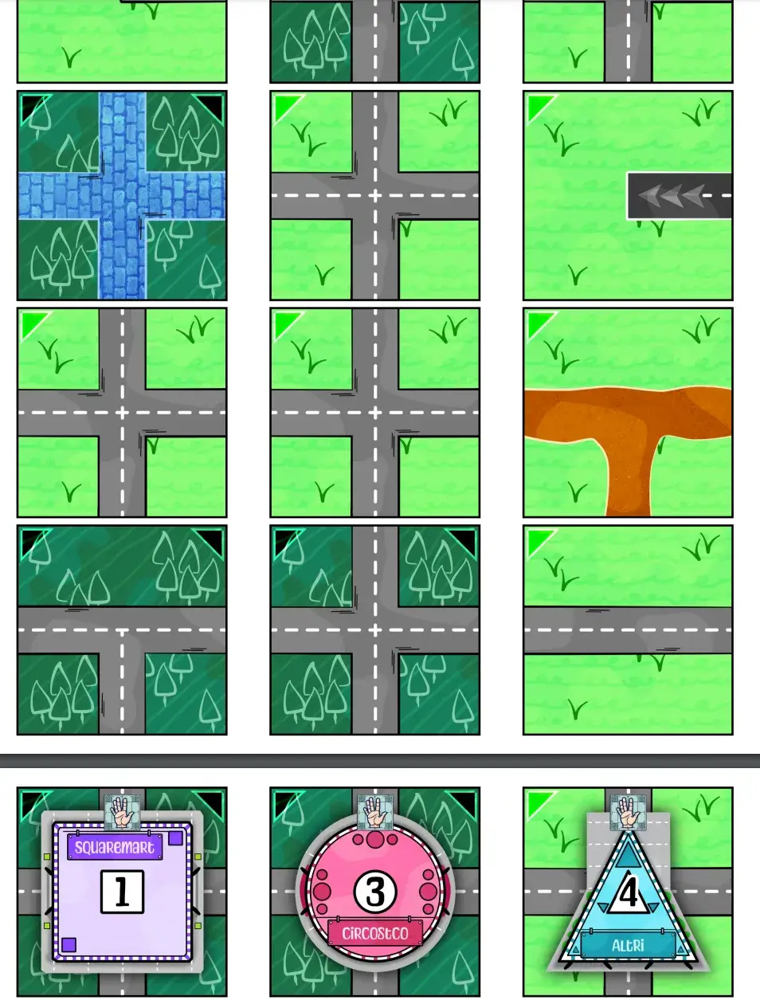
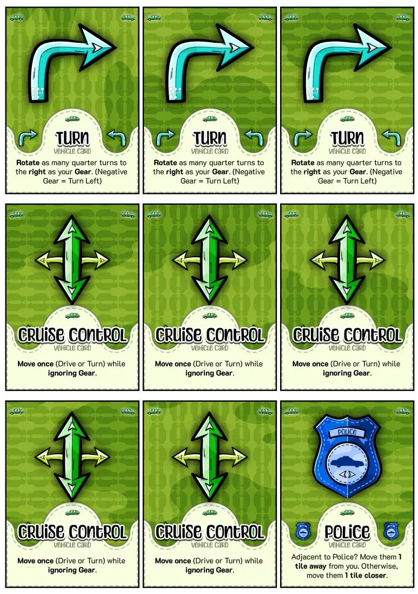

Welcome to the devlog for my Naivigation game [Crashing Cars](https://pandaqi.com/naivigation/visit/crashing-cars/). 

It will be short and only talk about _that specific game_. Read the overall, general devlog about the project here: [Naivigation](/blog/naivigation/project/).

## What's the idea?

This version obviously has you steering a _car_. I briefly looked at my old version of Naivigation (including two mini-expansions) for ideas, but it was all ... meh. I decided to throw that out and start from scratch.

And so we ask: what makes the car unique?

* _Gears_. This is the game where we can move in a more unique way by shifting gears.
* _Traffic signs/rules._ A car has to stop at traffic lights, use roundabouts, etcetera.
* _Easy cargo._ Cars can easily pick up passengers/stuff and drop them off.
* _Fuel._ Not unique to cars, of course, but most relevant here.
* _Roads, but optional._ Though you obviously want to stay on the road, cars _can_ go off-road quite easily. (See my entire section about the Road Networking problem in the general devlog, which is just before the link to this game's devlog.)

## Turning that into rules

Picking up actual individual cargo is not something I want in the base game. It requires more pawns, more explanation, more fiddliness---that's something for an expansion, when the players are familiar with the base game.

As such, I themed the game around **visiting shops**. You want to visit all the shops before the car is total loss. In an expansion, we can add actually buying stuff there or dropping people off.

I used the Road Networking solution: we start with a grid of perfect 4-way crossroads. But any time you take damage, or after special actions, these are replaced by less ideal tiles by the players.

I _allowed_ going off-road. But when you do, you take 1 damage of course.

How do we simulate gears?

* We have a separate Gear Deck with a few possible values: -1 (for backward) to 5 (max speed ahead).
* The **Gear** vehicle card changes this.
* All the **other vehicle cards** (move and rotate) are _multiplied_ by your current gear.
  * So, if you play a simple Move card, while you're in 2nd gear, then you move _two tiles_ at once.

This is the simplest method I could find to simulate gearing up and down. It also nicely plays into the fact that we want to _damage the car more_ in this version of the game. (Because damage can be absorbed by ruining the map, you can take more damage before you die.) If an unlucky gear change suddenly makes you move 3 tiles instead of 1, well, you're likely to damage yourself :p

I had just a little space to add something extra. One of those other ideas that would spice up the base game and balance it. What was the best fit?

* Fuel requires adding a new type of material (_fuel deck_) to constantly manage, which is hard and certainly not base game material.
* I had a Police + Traffic Signs expansion, but that also required adding a new mechanic and material.
* The cargo/move passengers expansion was _also_ too involved to add to the base game.

In the end, I decided to add a few _special tiles_ to the base game. Just the simplest traffic signs, and an "earthquake" that allows shuffling the map if you want.

Why?

Because I also added the _parking lot_. This was a unique idea that came to me late, but solved a lot of issues in a thematic way.

* To visit a shop, there must be a parking lot next to it. And you must "park properly". (Which, if you don't, is obviously breaking the law if you play the police expansion :p)
* This _requires_ players to damage themselves, so they can replace crossroads with strategically placed parking lots. (Or to use that "earthquake" option.)
* Which forces the board to be made by the players, in an intelligent way, over time.
* While being a _new_ way to visit locations that makes sense and isn't too easy or too hard.

As always, I like to add _more_ and do _more cool stuff_. But it needs to be kept simple. The base game of all Naivigation entries must be absolutely dead simple (without being boring or too easy/straightforward, of course). So all the other things go to expansions.

## Does this work?

Despite the short description above, I _really struggled_ to get this one down. Any general ideas that might apply to cars were already used in the other Naivigation versions. Any more complicated ideas were _clearly_ not base game material.

So I iterated, and again, and again, and I shuffled ideas around, and I moved things to the base game and out of it again.

Until, finally, I ended up with the first complete draft of the rules. One that is as simple as I can make it, while ensuring there are hard decisions and it's not always obvious which route to take.

## Let's make that!

Like all the other devlogs, there's a gap here in which I wasn't able (and/or just forgot ...) to update this devlog with my progress and decisions.

As the "general devlog" (for Naivigation) explains, this project was mostly my testing ground for the idea of _networks_. It took a bit to find a clean system that could add roads (corners, straights, crossroads, etcetera) to any Naivigation game now and in the future. But in a balanced and controlled way, of course, using the specific images for _that game_. 

{}
Makes no sense to create _one_ spritesheet with car roads ... and use that in the game with trains, which want railroad tracks. No, the networks/roads have to be unique graphics per game.
{}

Because it's based on a car, the most complexity and variety in this game comes from the _map tiles_. There are simply lots of places a car could visit, and lots of traffic signs that could show up. These are mostly AI generated right now, but I hope to find energy/time in the future to redo all that "art" manually too.

This game also feels most "silly" of them all. Perhaps because this was the vehicle where it all began, and that very first version of the game (in Dutch, many years ago) _was_ an extremely silly, unbalanced, party-esque game.

You have the police that can chase you for silly reasons ... or be sent away by you too. You can only visit shops by ... parking _correctly_? The vehicle cards have to resort to things like "lock the doors" or "turn on the radio", because cars can't do anything fancier :p And the roads are mere ... _suggestions_, as you can go off-road at the cost of 1 damage.

Somehow, I think I brought it all back to a simple and distinct ruleset that works.

Below are images of the final material (for now).

## Conclusion

Hmm. I already wrote the conclusion at the previous section, really. This game feels most "silly" and "loosey-goosey", but that's fine! One of the major games has to be, and a car is the perfect candidate. For example, I didn't want to have this vibe for _planes_ crashing or colliding (in Frightening Flights), as that simply has much more serious connotations for most.

I keep wondering if my extra parking/shop rule isn't a bridge _too far_. But removing it simply makes the game too straightforward _and_ too much like the other games. Again, parking _is_ something unique to cars, so it works here.

Every time I create something, I have to accept that there comes a point you simply _can't_ simplify something further. At some point, rules become so simple and streamlined that you also squeezed out all the challenge and fun :p

That's why I placed this game as one of the "harder" ones. Even though it's still really simple, that extra rule about visiting shops, and the things about following the road and traffic rules, simply mean 1 extra minute of explanation that players must remember.

I hope to test this game much more in the near future (aka my birthday, aka "fine we'll play one of your games tonight, Tiamo---will there be pie?"). For now, I consider it done.

Until the next devlog,

Pandaqi