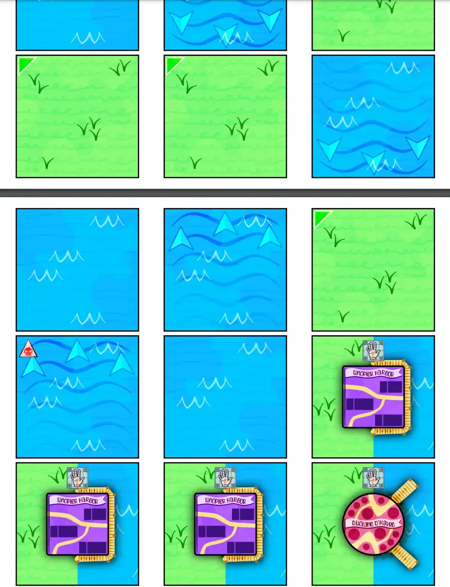
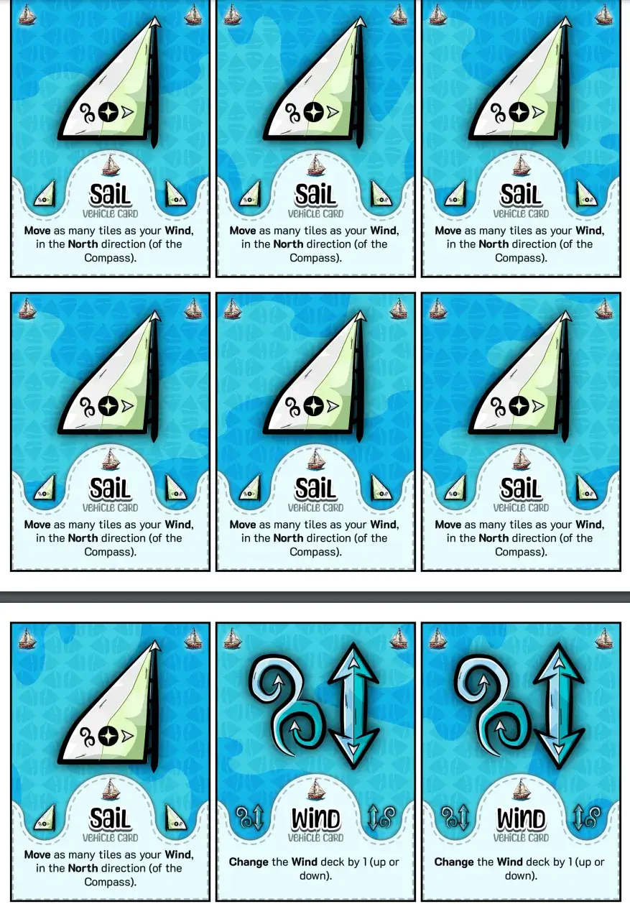

Welcome to the devlog for my Naivigation game [Singing Sails](https://pandaqi.com/naivigation/visit/singing-sails/). 

It will be short and only talk about _that specific game_. Read the overall, general devlog about the project here: [Naivigation](/blog/naivigation/project/).

## What's special?

We're steering a ship this time.

For this version, I wanted to make these two major changes:

* The map is **generated on the spot**. The ship starts on a lone water tile, nothing else. But as you sail---as you _explore_---the rest of the map is built. (This was the vehicle type where this idea seemed to fit the most.)
* You have **two movement methods**. One follows wind direction (less controlled, faster if needed), another is simply done by rowing (slow but predictable).

## Exploring the map

To fit in these systems, I had to make a few concessions and other changes.

* Tiles are either entirely **land** or entirely **water**. 
  * (No cute beaches, or rounded corners, or whatever. It's just too unlikely that this all fits nicely together when randomly drawn.)
* It's completely impossible to travel over land. Sailing into land incurs 1 damage and just bounces you back.
* If you move off the board, draw a single new tile and place it underneath the ship. 
  * (This way, you can still go in unexpected directions or really explore, but at the risk of accidentally running into land.)
* The Vehicle Card **Spyglass** allows exploring: adding 5 map tiles. And it allows this with a lot of freedom: just attach the tiles wherever you want.
  * (Initially, I had extra restrictions, but that just made it impossible to get any sensible map over time.)

The collectible tiles in this game are the **Harbors** to visit. To make them fit in, they are half-land and half-water.

* You can only enter from the water side (as usual, no sailing over water!)
* When you do, you've collected the harbor; replace with a random new tile.

My only problem here is that these harbors might be distributed in a terrible way. Maybe, after shuffling, they all ended up all the way at the bottom of the deck. So you have no harbor to aim for the entire game! And then they all arrive at once!

One solution was to add special tiles that allow you to "scan the deck for the first harbor" (and then return it at any spot you like). But this still isn't great, because what if THOSE tiles don't appear for a while?

I looked through some ideas and notes, then found a variation that felt like the solution.

* Instead of adding all the map tiles into one humongous deck (and the harbors could be anywhere), create 4 piles. Add 2 harbor tiles inside each, then shuffle.
* Place each pile on a different compass direction (North, East, South, West).
* When exploring, _use the pile_ from the direction in which the ship points.

This makes intuitive sense. (You're going North, so, you're finding tiles to the North.)

But most of all, it means ...

* You are certain of 2 Harbors in each direction. Unless you play it really badly, you should stumble upon harbors pretty quickly. 
  * (And in a predictable way. By moving South multiple times in a row, on purpose, you'll empty that deck and find a harbor for sure.)
* It forces you to explore in all directions.
  * (At the same time, once a pile is empty, that direction becomes off-limits. So you are forced to place tiles far away from your ship, potentially.)
* It reinforces the importance of the compass and movement mechanics (which I'll explain below).

## Steering the ship

As stated, I experimented with splitting movement into _two_ distinct methods.

* The **Row** card just moves forward (in the direction the ship faces) one tile.
* The **Sail** card moves in the current _compass direction_ at _wind speed_.
* Which means we also have a **Wind** card (changing wind speed) and a **Steer** card (which can steer either the ship itself or the separate compass).

This allows more freedom in movement, without being overpowered or "super simple to execute".

For example, if a harbor gets placed _behind_ the ship, then you might use the compass to move backwards for a while. Something goes wrong and you get displaced? Alright, switch gears, rotate the ship itself, and _row_ to make an adjustment.

It also means your plans might still work _despite_ others playing the wrong card. Because these are two separate systems. Even if they change the wind and compass ... your row action will do the exact same thing!

It just felt like a nice balance and a nice new thing to try.

## Is this enough?

I don't know. I never know until I try.

I strongly feel there should be some _(unpredictable) dangers_ along the way. You know, something that might throw a wrench in your plans, make players have to guess which of the 3 harbors to go for.

In a way, we already have that. You have to sail _around_ islands, so the fastest route to a harbor might not be obvious.

Other options might be ...

* Currents / natural disasters.
* Pirates or Sea Monsters!
* Goods to pick up and/or deliver.

These are great expansions, but too difficult for the base game. In fact, this game might have to move away from its third spot (in the complexity ranking) because it's a little more complicated than I originally envisioned.

Most of the tiles will have to be some special type or have some special symbol on them. This immediately increases the number of rules to explain (and visual overload when playing).

* As stated, the Discuss symbol will be added to some tiles to allow more discussion moments in this game.
* A Pirate symbol means you immediately place a new Pirate Ship on that tile.
* A Water Current symbol means the ship is moved around (in the way shown) if it enters that tile.
* And so forth.

In all of this, a _Cannon_ vehicle card or something seems useful. But that would make _six_ Vehicle Cards in this base game, which just feels like too much!

## Final version

After taking a break (see "Intermezzo!" part of the general devlog), I came back and was certain that most of these ideas should be expansions.

To keep the base game dead simple, I reduced it to just 3 vehicle cards.

* **Sail**: move in the current _compass direction_, as many tiles as the current _wind speed_.
* **Wind**: change the Wind Deck by 1 (up or down).
* **Rotate**: rotate either the compass or the ship (in the direction indicated)

This is enough to completely control where you go and how fast. All the other vehicle cards are nice additions, but not _crucial_.

I just needed a simple solution for the "map issues" in the base game.

* I decided to place the map tiles (on the compass) _faceup_, so you could see what was coming up. (This gives information and more strategy, while preventing losing the game quickly because you're just unlucky and run into land tiles all the time ...)
* But now you could be certain you'd get a Harbor and easily visit them => I changed it so that you only succesfully visit harbors if you _end_ your turn there.
* I decided we simply _needed_ special map tiles in the base game, otherwise the game could be quite aimless or too straightforward.

In the end, I decided on these three special tiles. They are needed to create a "push-and-pull" between good tiles you want to visit and bad tiles you really want to avoid, which can upset the "ideal route" to a harbor.
 
* **Island** (good; common): add a tile (from any deck) to the map at any position. If it's a land tile, however, you must attach it to other land (if possible).
* **Anchor** (bad): the round ends immediately. If there were instructions left to execute, you take 1 damage.
* **Lighthouse** (good): while the ship is here, the start player may show their hand and play their cards faceup.

The first one is necessary to get out of a situation where all the top tiles (of decks) are bad. But in a way that creates islands instead of a messy map.

The second one is simply something to _avoid_, but with a twist. If you time it well, you can pass an anchor without consequence. This means some players might choose to go for it---it's a "cursed tile", but not 100%, which creates _interesting decisions_.

The third one has a similar idea. It gives a great power (information/communication), but with a simple condition (ship must be on that tile). This means there might be uncertainty about how long you want to stay there to get the most out of it. It prevents it from being overpowered.

And, because this game _weakens_ the Discuss card, this is pretty necessary to keep enough communication channels.

With that, I thought the rules were solid and couldn't be simpler, so I called v1 of the game rules finished.

## Let's make that!

### Time Skip

As mentioned in the other devlogs, development for these major games was messy and I forgot to update this devlog along the way.

Just imagine I wrote a lot of code and drew a lot of things in the meantime, and now the game is basically done.

Some interesting bits I can think of right now:

* The terrain (land/water) uses my shared terrain-drawing code I implemented already for Frightening Flights. The _harbors_, however, use a custom function injected into the code. I don't imagine creating any more games with _multiple_ terrains (half-half) on a single tile, so I didn't add that functionality into the shared system.
* This also meant I had to draw the harbors such that they were perfectly split down the center, with the right half being boardwalks on the water.
* After all this work, I realized I really didn't have much space left for showing _water currents_. A symbol in the corners wasn't enough (and might be obscured too). A big arrow in the center would certainly be obscured (by special icons _or_ simply the pawn standing on the tile). I opted, reluctantly, for some simple wavy pattern I could put on top of the _whole_ tile.
* Because the setup for this game is literally "place a random water tile on the table, put your boat on it, go!" ... I didn't add an interactive setup generator anymore. Felt a bit pointless.

### A Dumb Issue

Also, when I saw this and made the final rulebook images, I realized some really really stupid mistake. I thought I'd "fixed" that, and I did to some extend, but using _expansions/variants_. This issue was very much ruining the _base game_.

* In the base game, the only way to get new tiles is by "exploring". 
* You sail off the map, then add a new tile from the deck (which is pointed the same way as your ship) underneath yourself.

In my mind, I thought I had decoupled "placing harbors" and "where you are". I hadn't. I'd merely decoupled "ship rotation" and "compass rotation". And the vehicle cards and rules that were supposed to prevent this issue, had been swiftly moved to an expansion some time ago. 

In practice, this ruleset obviously leads to the following situation:

* "Hey, there's a Harbor at the top of the South tile."
* "Let's point our Ship south and sail straight off the map."
* "Great! Now we can just place that harbor underneath ourselves, instantly visit it, what an easy game!"

I had accidentally reduced the base game to pretty much randomness without a point to it. Sail anywhere, immediately stand on a harbor, collect it, win :p

I usually have one such major oversight with any project, simply because my brain got distracted during the making of _this specific thing/rule_. And hyperactive brains don't tend to get back on track, like, ever. 

{}
I once _almost_ published a book without realizing I'd left my entire sketchy-vague-plot-outline appended to the end of Chapter 13. I'd just completely accepted I had already deleted it/copied it to a proper outline file, got distracted, never checked it. That's why I purposely have good structures and habits to ensure I catch things like this, usually in time.
{}

The solution, fortunately, presented itself easily now that I saw it with fresh eyes.

* When exploring, simply place 1 tile from _every deck_, at their compass side. (So the North deck, for example, needs a tile placed to the NORTH/TOP of the map.)
* Only the tile at your ship's side is placed _underneath_ it, the others have freeform placement.
* BUT! Land must attach to land, water to water, if possible.

That last rule was a "variant" before, but I was really looking for reasons to make it the default base game. It is natural for players to expect this, I noticed, and it simply leads to a much prettier map + more challenge. This set of three simple rules ensures that harbors are regularly placed quite far away from yourself.

You _can_ still insta-visit harbors. But at that point, this is just a reward for solid strategy, as you must ...

* All realize a harbor is on top of a certain deck.
* Properly cooperate to sail off the map at the right edge for it.
* And do so without crashing into land or ruining it by going off _another_ edge first.

My hyperactive brain also tends to make things too difficult, because it thinks about rules _too much_ (and is easily bored), so I've learned to always give my players "some easy wins". Because things that seem _too easy_ or _straightforward_ to _my_ mind, are usually just perfectly balanced (difficulty-wise) to your average player that's new to the game.

My only gripe was that Ship rotation _doesn't matter in the base game now_. (It does with expansions and other special tiles.) I found some good solutions there too, such as "can only visit harbor if Ship points to it". After a lot of back-and-forth on this, I decided to put this in the base game (instead of keeping it as a variant or expansion). It's a really intuitive rule, just a few extra words, and it achieves _so much_.

* The card that rotates Compass or Ship becomes even more useful, and you have reasons to take that second action in the base game too.
* It means insta-visiting harbors _only works if your Ship is oriented correctly_, which solves that issue even more.
* It prepares you better for the expansions. (Otherwise, the base game would oddly have you play with the ship oriented completely differently from the wind direction and how you move, which is unintuitive, unnatural and against what the kind of play expansions desire.)

All these additions, though, did increase the game's "first teach" complexity juuust a little bit. I ended up placing it _after_ the game about driving a car, because I felt it was more "advanced" than that now. Still, I've planned to use similar "sailing mechanics" but in a much more simplified way for another Minor Naivigation Game about a water vehicle. I'm fine with having this game be of "medium complexity", so other water-based vehicles can go much lower or much higher in complexity.

## Conclusion

This is probably the most "experimental" of all the major games. (Even the Train one, which I thought would be most complicated and "weird", ended up simplifying to something quite streamlined and easy to play.) 

The map is built as you go, on the fly, randomly, not much rules. This already means we lose a lot of balance and finetuning beforehand, which is why I fear this game might be incredibly unbalanced in some areas that I simply never discovered myself.

There are two factors to moving the ship (wind power + compass), which makes the movement far more volatile. If done right, you can zip across the map and achieve a lot. If someone makes a mistake, you can get stuck and go in circles for a while. This is, again, mostly up to the playing group and hard to finetune further myself.

As always, I wish people give the game a try and then give me feedback. That's how I can really balance and improve a game like this further. I simply can't judge the difficulty, strategies, and decisions when playing on my own---as I obviously know all the cards.

For now, though, I made it as good as it can be. The rules stayed very simple, but it really feels like exploring a new ocean each time. Thematically, it really _feels_ like sailing a ship together.

Until the next devlog,

Pandaqi
