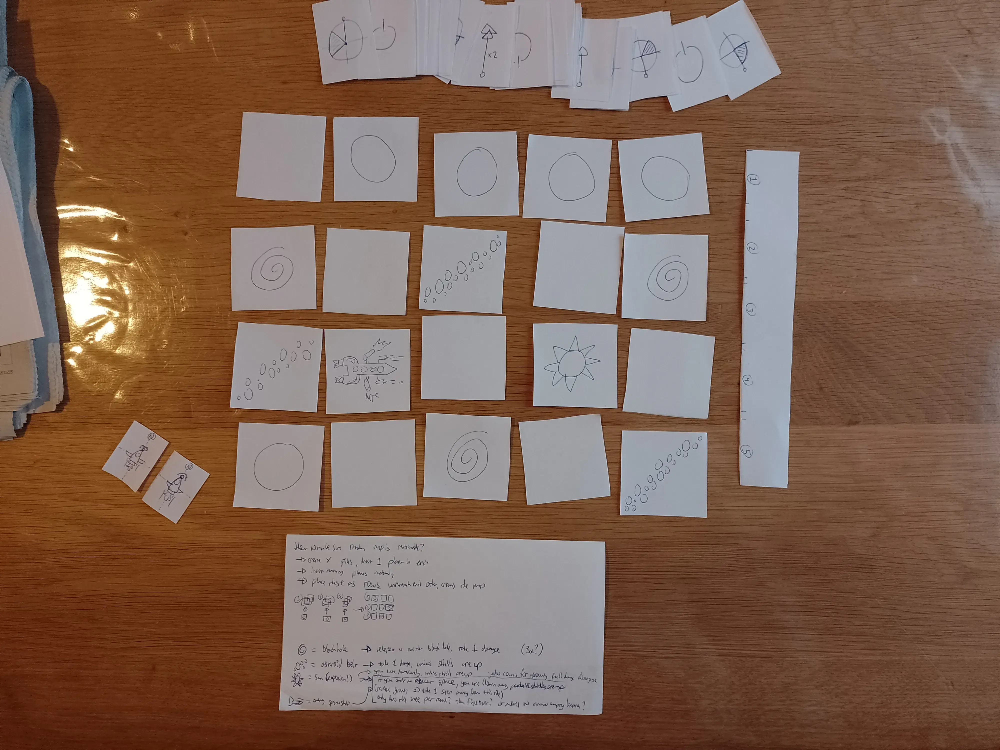
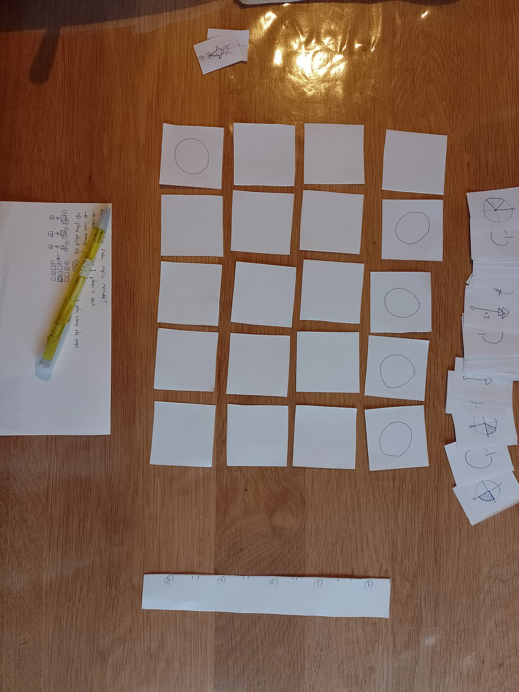
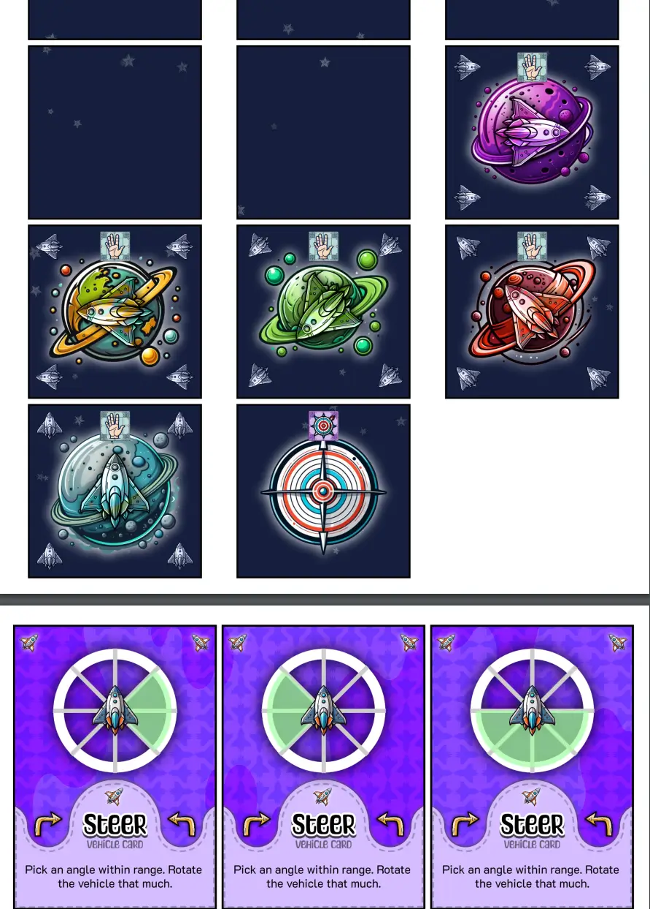

Welcome to the devlog for my Naivigation game [Swerving Spaceships](https://pandaqi.com/naivigation/visit/swerving-spaceships/). 

It will be short and only talk about _that specific game_. However, because it was the _very first Naivigation game_, it also lead to many insights and developments for the Naivigation project as a whole. So it has a few paragraphs on realizations and changes you might recognize as the core Naivigation rules today. 

You can also read the overall, general devlog about the project here: [Naivigation](/blog/naivigation/project/).

## What's the idea?

Hopefully you see why this is the simplest one. We're steering a **spaceship** through empty space.

Your possible vehicle cards?
* **Steer Left**
* **Steer Right**
* **Thrust Forward**

The map tiles?
* Empty tiles ... lots of empty tiles with distant stars
* Tiles with a planet!

Sketching this, I saw a cool idea: **gravitational pull**. The one unique thing we can do here.

> At the end of your turn, find the closest planet. You automatically move one tile closer to it. (Different planets might have different numbers, pulling more or not at all.)

If you land on a planet tile, you visit it. However, if you don't land nicely (with the underside of your spaceship facing the planet), you take 1 damage.

(The idea here is, of course, that you _need_ to use gravitational pull to land properly. Because you can only thrust forward, you cannot visit a planet nicely by just moving into it.)

Another idea that is possible in this freeform space is **diagonal movement**. So the steering cards should have different amounts.

Some final inclusions might be wormholes, black holes, teleporting, meeting alien species, asteroid belts. Perhaps you can engage a shield or weapons against these things. _This is expansion material._

The rules above seem like a strong core game that I can prototype on paper and test right now.

{}
At certain points, I considered adding other objects like wooden cubes to the game. Those would be the "packages" or "resources" you collect in one place and bring to another. In general, however, I want to keep games as minimal and simple as possible, so for now I'm trying ways to play this game with just tiles and cards. 

In this case: when you visit a planet, you collect its card (and replace with a new one from the deck). That's how you track how many you've already collected.
{}

## Let's Prototype!
As usual, good news and bad news. The general idea is solid, but some major tweaks were needed (partially because I simply got _better ideas_ while testing).

### Handicaps for Progress
My final major gripe was that the games now lacked a sense of _progression_. 

If your objective is to move from start to finish, you can slowly see yourself making permanent progress. Closer and closer to the finish, which also changes your movement options.

But if your objective is just to collect the 5 planets? Well, the core game loop is exactly the same when collecting the first one as it is when collecting the final one.

I wanted something that creates _permanent change_ as the game progresses. In fact, this is so important that I wanted it as a _core Naivigation rule_ in every base game. (I already had expansions that would add this, at the cost of more cards and more complexity.)

Then I read my old notes and found an invaluable idea at the bottom: **the damage cards contain a handicap**. It just makes sense! The more damage you take, the harder it is to steer your vehicle!

As such,
* Each health card now has a handicap written on it. (For example: "the start player must play their card at position 1")
* When you take damage, and turn the health card faceup, that handicap is now permanently active.

Over time, you accumulate handicaps forcing you to change how you approach the game. All that without adding extra complexity or exceptions.

Which leads to ...

### Rules to remember < Rules on cards
Several rules are now in the _rulebook_, to always remember yourself, which is always worse than having the rules _in front of you_ as you play the game.

The handicap system I just described is a good example. The handicaps are written on the cards, faceup on the table, so you can always see them as they become relevant. There's nothing to remember or explain beforehand.

I want to do this as often as I can. Which led to the following changes,
* There is no "discuss and strategize before each new round starts". Instead, no communication is the default. We simply add a **Discuss Card** you can play to the instructions (just like "steer left" or "move forward"). When executed, _that's_ your window to discuss and strategize.
* There is no automatic gravitational pull. Instead, there's a **Disengage Card**. When executed, you shut off your motor and are pulled one step closer to the nearest planet.
* There is no prescribed way to land on planets (with bottom aimed at planet). Instead, each planet **shows** the landing orientation (with a faded image of the rocket, rotated some way). Now you need not remember _and_ we get more variety in return.

Such changes improve the game tremendously, while turning the rulebook into almost nothing.

### Small Tweaks
Testing also revealed a lot of small tweaks. 
* 4 hand cards is too easy, let's keep it at 3.
* The map _wraps around_ (moving off the left edge returns you on the right), but wrapping incurs 1 damage.
* Landing on a planet the wrong way incurs 1 damage, and bounces you back. (Previously you were still allowed to land, but that's far too generous.)
* The right map size seems 5x5 tiles, with 5 planets to visit. (This also helps with setup, which I'll explain soon.)
* A threshold of 5 damage seems ideal. (The moment you take your fifth damage, you lose.)

### More Progress
Another thing that is static in this game is the _state of your spaceship_ and the _map itself_.

To keep this the simplest (entry?) Naivigation game, I won't solve this in the base game. But it's the first expansion I'd look for: **shields/weapons** and **obstacles**.

A simple solution was to ...
* Add tiles with "asteroid belts": flying through them incurs 1 damage.
* Add **Shield Cards**: when played, they activate your shields. They _stay active_ until you play a disengage.

This is a permanent status change to your ship, as well as obstacles on the map to swerve around.

We can "solve" this issue more with more complicated expansions. For example,
* Add tiles with "enemy spaceships": flying through their line of sight incurs 1 damage, unless shields are up. (Where "line of sight" just means their weapon at the front points at you in the same row/column.)
* After firing, however, rotate the spaceship to point another way.

Now the map actually _changes_ as you play, creating more permanent _progress_. Approaching your first planet will _not_ be the same as approaching the last one.

That change with the "Discuss Card" (from previous section) mustn't be undervalued. It makes all of the tweaks and improvements possible.

Why? Most obstacles in this game can be (easily?) circumvented if you can _discuss_ at the start of each round.
* "Ah, we're almost going through an asteroid belt, let's agree to go through but put shields up first, okay?"
* "Ah, planet 2 is closer, but going to planet 3 is safer. Let's agree to do that, alright?"

But with the change, you can only discuss a few times per _game_, when somebody actively plays the Discuss card. You can make plans, you can even plan far ahead, but things are sure to go wrong after a while and people might not memorize the details ...

### How to get a balanced map?
When testing, I frequently created a random map---just by chance---where all the planets were bunched up in a corner. This isn't great, to say the least.

So I sought ways to ensure the "random generation" during setup would always spread out the planets a bit. I ended up with:
* Create 5 piles of non-planet tiles.
* Insert 1 planet into each pile + shuffle.
* Now create a 5x5 grid, where each pile is one row.

It's the simplest thing I can come up with that ensures playable boards. (Once you're familiar with the game, you can make the board any shape or size you want, and freely ignore this because you know what you're doing.)

Below are images (from my phone) of playing the paper prototype against myself. (In a dark room with a bright yellow light to my side.) Interestingly, the map is 5x4 here, which is probably how I realized that was too small.

### How many instructions?
The final question I needed to answer was: how many players does this game support? How long should the row of instructions be, at most?

The original made the mistake of ramping it up to 10 players and just putting all that inside one instruction row. Yeah, not great.

In reality, you can coordinate and play quick turns until about 5 or 6 players. Anything above that is just too unwieldy.

I decided to cut it off at 5. Why? Because higher player counts _are_ possible; you just split into two vehicles. At 6 players, you can do nice teams of 3-3.

My notes had lots of ideas for a 2-vehicle game where the other vehicle is "the computer" or "the enemy". Those ideas have a lot of potential, as far as I can tell. Adding a second vehicle + second row of instructions is therefore a good step in any case.

How does it work in practice?
* Everything stays the same.
* When evaluating, though, you alternate between the two vehicles.
* Crashing into each other obviously does damage. (Maybe the spaceships can have _weapons_ in this case, or something to have more interaction between teams.)
* Otherwise it's about collecting more planets than the other team.

Playing against the "computer", how does that work?
* You play 2 cards each turn. One goes to your vehicle, the other to the "computer vehicle".
* This gives the computer vehicle a way to move around at the same speed as you.
* But it also adds more interesting decisions, because now you also need to pick a "good card" that moves the other vehicle _away_ from yours.

This, however, is still very much undecided.

With that, the game works very well and we have a strong Naivigation core. Let's finalize this first version (polished/finished as much as possible), then see if we can reuse it in the other games.

## Polishing & Finishing

I'm racing to get this first version done (and pretty/polished enough) to test around my birthday. So it's not perfect yet, and some expansions or details are missing, but we're mostly there.

For the "main" graphics, I mostly relied on generative AI. I found some prompts and specific models trained for this vector art/digital illustration style---without using copyrighted material, or so they claim---which usually gave me what I wanted. 

{}
It's hard to find one of those. If you take out all artist's works and recognizable styles, the AI is pretty useless in many cases. But I'm trying.
{}

This means that I finalize my list of elements that I want (which map tiles, which icons to use for vehicle cards, which decorative elements) and then run through prompts asking for those. If I'm lucky, I can assemble _all_ main graphics I'll need for a game in about 50 queries and an hour or two. I am usually unlucky though and spend a lot of time editing or doing a few graphics completely manually, because it's just not working out :p

Now I have my template, and I have my spritesheets with graphics, so I write the code to combine all that in the right locations, rotation, color, and so forth.

Because it is a _template_, it will be reused across all the Naivigation games. In fact, 80+% of the code/graphics/styling should be reusable. This forced me to spend a few days trying different structures for easy sharing of resources, without turning this project into a tangled mess of stuff referencing other stuff. 

In the end ...

* I have a very barebones "material class" (for both cards and tiles). Every game _extends_ that class, adding its own specific drawing code. But because it's an extended class, I can now tell the type system (in TypeScript) exactly what it can expect and what functions should be available. For example ...
* I have two large classes for generating random setups and random examples. That is almost identical per game, except for specifics such as how a vehicle moves. As such, I can "plug" a callback function into these classes with the specific rules for each game, but otherwise it's the same.
  * Now, because all material fed into it extends from the same class, I know I can call `isCollectible()` (to know if a tile is one that should be collected to win the game) or `draw()` (to, well, draw the thing) and that it will exist.
* Besides that, I have one (rather small) CONFIG and DICT (for _dictionary_) file that is automatically shared between all games.
  * The Config contains the default configuration for things. For example, the default number of vehicle tokens to include, the default fonts to load, etcetera.
  * The Dict contains hardcoded _data_ to read. For example, it holds all the cards of the shared material. That's not "configurable" on the spot, it's just a list that needs to be saved and read somewhere, hence the distinction between these two files.
  * Each game automatically _merges_ its own Config/Dict with the shared one so it has everything it needs

It's a bit of a mess to figure this out. But the more I see the patterns, the more I can clean up code immensely. I now have two separate pages/generators for SHARED material and SPACESHIP material (the first game), which only require very little and very simple code. Each game only requires little configuration and manual data input by me, because most of its properties are from the shared Naivigation project.

For example, this is all the code for the main SPACESHIP file right now. (Which obviously calls other files and other functions, but I'm just trying to illustrate the general point here.)


const generator = new MaterialGenerator(CONFIG);
generator.addPipeline("tiles", createTilePicker(), CONFIG.tiles.drawerConfig);
generator.addPipeline("cards", createCardPicker(), CONFIG.cards.drawerConfig);
generator.start();


The "pickers" are code to generate all material needed. So you end up with one list of objects that are exactly the cards/tiles you want to draw.

We feed that list into a "drawer", which uses the drawerConfig + that `draw()` function on each object to output a PDF with everything properly drawn and placed on a grid. 

(This was the best compromise I could find. Because most items have WILDLY different code for drawing them---the whole idea of a board game is usually that all cards are NOT the same---it made no sense to create some standardized draw function, but instead put unique ones on objects themselves.)

Everything is so reusable that specific implementations come down to these simple lines calling a few standardized, shared classes or functions. This feels clean and efficient to me, which is why I feel it's worth investing time into building all these abstracted systems.

As I make more of these, I'll probably realize ways to change or improve further.

And after _aaaaaall_ that, we finally have a generator that spits out a PDF of material with which you can play Naivigation: Swerving Spaceships.

These screenshots were taken a long time after actually finishing this game, though. The very first version, for example, didn't have those "hand icons" to signal these tiles are the collectible ones, nor did the vehicle cards look this detailed.

Pfew. Let's hope it's as good as I thought.

### What physical material does to you

Even before doing the playtest, as I was simply _printing_ and _cutting_ the material, I already realized a few things that somehow slipped my mind before.

First of all, the **tiles should be bigger**. I don't know why I thought they could be really small. The entire point of the game is moving the vehicle over a map, so it _should_ be the biggest element on the table. (Besides, maps are only 5x5 in all games, so it's certainly not an issue of space.)

Secondly, somehow there was one part I never considered changing before: **the row of instructions**. It was always the simple "each player plays 1 card to any slot in the row". But ...

* On lower player counts (say 3 players), this means playing only 3 cards, which just isn't enough to make anything happen.
* This is a crucial, core part of the game that follows the same rule whatever happens. That is boring and a missed opportunity. This _should_ receive more variety and possibilities!

So I changed the rules.
* During SETUP, always place 5 instruction tokens (regardless of player count).
* While PLAYING, simply continue placing 1 card until all instruction slots are filled.

This simple change means the game experience is more similar regardless of player count. (You're not moving way more slowly with 3 players, for example.)

It also allows other improvements.

* A VEHICLE CARD (Speedup) that **modifies the number of instruction slots**! This is a great shared card (usable in all games). It simply does +X/-X instruction tokens. (With a minimum of 3 tokens and a maximum of 8 tokens.)
  * It always felt weird to me to only have _one_ shared vehicle card, so this is fine.
* REMOVE the compass card (the simpler our material requirements, the better!). The rule is simply: **whoever played into slot 1 becomes start player next round**
* Some spin-off games could play with this even further. (For example, they might add instruction tokens with special powers attached, like "the card played here activates twice".)

The crucial part of that "Speedup" card is that this simple rule accomplishes many things at once.
* The instruction tokens change is permanent (i.e. it doesn't reset back to 5 after each round), so this is one major way to shape what's possible in future rounds.
* But it also requires more cooperation (and gives more options) in the current round.
  * The _start player_ decides whether to add or remove 1.
  * But if you add an extra slot, the player who _originally played the card_ must fill it with a new hand card.
  * (And if you remove a slot, that card left hanging is just not executed.)
  * Which means that, any time this happens, two players need to guess each other's intentions correctly for it to work out.

I really searched for a way to also get rid of the unique instruction tokens material. If this game could be just a deck of same-sized cards and same-sized tiles, that would be great. 

But I didn't find it. At least not for now. 

## The First Major Playtest

I'm calling it a Major Playtest because it involves mostly finished material and completely new groups of players. That's much more valuable than testing it against yourself or testing it when material is half-baked.

How did it go?

As always, playtesting confirmed some of my ideas, but also showed clear areas of improvement.

Yes, the game works! Both on low player counts (<=5, all same vehicle) and high player counts (6+, two teams against each other)

* It's quick to setup and explain.
* It's (mostly) intuitive to everyone.
* It's different than any other games you might have played, without being too weird or out there.
* It doesn't "get in the way"---you can talk, walk around, have fun while playing the game (and never get bogged down in rules or technicalities)
* And, as stated throughout this devlog, it has countless of easy opportunities for expansions / variants / different vehicles. (Even just adding ~5 action cards to one of the playtests completely changed the dynamic again, because of how big of an effect they can have on a round if used well ... or poorly.)

Still, it wasn't perfect of course!

### What surprised me (in a good way)

How despite allowing completely free discussion (upon playing the Discuss card), this still didn't make the game boring or "too easy". There's more then enough randomness and chaos to offset any carefully laid plans.

How the simple rule "the start player makes any decisions when executing cards" actually makes the game _much better_. (Only if the vehicle cards obviously leave you a **choice**.) It means you might play the perfect Steer card, but the start player makes a mistake and uses it in a way you didn't intend, and now it all goes wrong in a funny way. => This basically created my personal "rule" that Naivigation games should have 1 or 2 Vehicle Cards that still allow choice after playing them.

How the "two teams against each other" was mostly an idea to make high player counts work, but it turned out to be actually the favorite game mode of many. An opponent adds a time constraint (can't do safe rounds as you'll lag behind the others) and evading/bumping into them to cause damage is actually a fun and strategic part. This mode actually works _great_.

How even such a tiny map with only 5 simple planets to collect makes the game precisely the right length and precisely the right complexity. (When looking at my prototype map, also accidentally printed with tiles that were too small, it seemed as if the game would be over in 5 minutes and it was way too small/easy. That's just not true.)

How even if you can look through someone's cards (because printed on paper + bad lighting situation), this doesn't ruin the game. (Though I already added background patterns to cards and darker colors precisely to offset this. The issue of paper seethrough is most prominent when you have _no_ or a _light_ background for cards.)

How only three Vehicle cards (Thrust, Steer, Disable) didn't feel too restricting or too simple.

How easily people picked up the game and just ran with it, even though it _does_ require quite some mental calculations (or rather spatial reasoning?) if you want to go the right way. But then again, the fact that this _is_ hard for some---in some situations---is precisely what makes the game fun and chaotic.

### Minor gripes

Material changes:
* Too many steering cards, _slightly_ too few movement cards (thrust/disable in the case of spaceships) => simply tweaked those numbers
* Add way more (empty) map tiles. Adding tiles with special icons ... that don't do anything (because you're not playing with that expansion) ... just add too much visual noise for some people.

Rules changes:
* The ideal number of action cards for the deck is somewhere between 5 and 10. (It was just a hard 10 before.)
* Saying you can "freely discuss anything" with the **Discuss** card isn't too bad, but it's also a bit too ... free. It means a team can take way too long discussing. It means anybody with good memory will have a relatively easy time executing what needs to happen for the next 2--3 rounds. (At which point you'll probably have another Discuss card anyway.)
    * **Solution?** Simply stick to the original rules, and clearly define that. You may discuss anything, but NEVER the cards in your hand. (In reality, making a general plan + knowing how the current round will play out is what's most useful.)
* I hadn't realised that just "go clockwise around the table from start player" obviously doesn't work when you have 2 teams and thus 2 start players :p I tried and theorized many different approaches, but in the end it's simplest to just do turns per team.
    * **Solution?** When playing with two teams, each team does its own round. (Start player, go clockwise until all slots filled, just ignore other team.) One-liner: "Play separate, Execute alternate"

Clarifications:
* "bouncing off of planets" (when you have the wrong orientation) wasn't great phrasing. It implies you move into the tile, then move out again, which raises a lot of rules questions. Instead, if you can't enter a planet, you just don't move.
* Any card executes when played or turned faceup. (This was already a general rule, but not as clearly stated in the rules) No card executes more than once in a round. (This is the bigger clarification.)

### Diagonal Movement

The biggest issue was **diagonal movement**.

* Allowing gravitational pull to be diagonal is just a bit too fast. Because it attracts you _to planets_---the precise thing you want to collect---it happens too often that you can just play a few disable cards and you diagonally zoom towards your destination. (Additionally, if we allow diagonal pull, it's not clear when you should do a diagonal step and when not.)
* Level wrapping when moving diagonally is _hard_ to properly think through for many people.
    * When playing the first game with new people, I just asked what they thought would happen when diagonally moving off one edge and wrapping to the other side. Not a single one got it right. Only after specifically explaining this did they grasp the consistent logic behind that.

In the end, I had to decide that diagonal movement ... doesn't really exist :/

* When moving diagonally, you _choose_ which of the two sides you want.
* Same when being pulled to a planet.
* Same when level wrapping.

This makes movement slightly slower, but is waaaay easier to explain and think about. (Additionally, adding more movement vehicle cards to the actual deck compensates for this.)

## Conclusion

In the heat of development, I forgot to take screenshots or talk about the expansions I made for this game. That's fine, because they're small and simple expansions without much going on, for (hopefully) the simplest Naivigation game.

By now, however, I had a clearer idea of what types of games I could make and what vehicles I could do. I basically saw three "categories" of games, and Spaceships is merely the first of the 5 "major games" (Spaceship, Airplane, Car, Ship, Train). These are the best "balance". A well-known vehicle that isn't the _simplest_ of all the games, but also never the _hardest_. Hence the best starting point for people new to Naivigation.

As such, I don't think Swerving Spaceships will be the _absolute simplest_ Naivigation game when all is said and done. But it's the simplest of the 5 major games.

It's, in my experience, the most exciting vehicle, executed in a way that instantly teaches you what Naivigation is about without getting in the way with more mechanics or twists.

Let's hope others agree! And if not, let me know, so I can recommend a different "first Naivigation game" to newcomers.

Until the next devlog,

Pandaqi