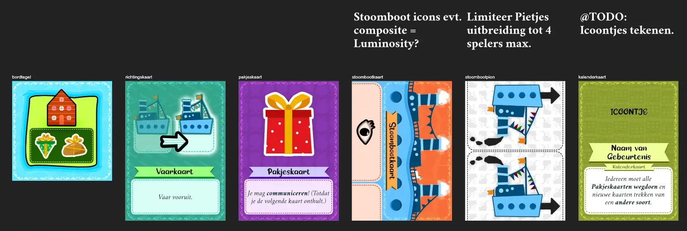
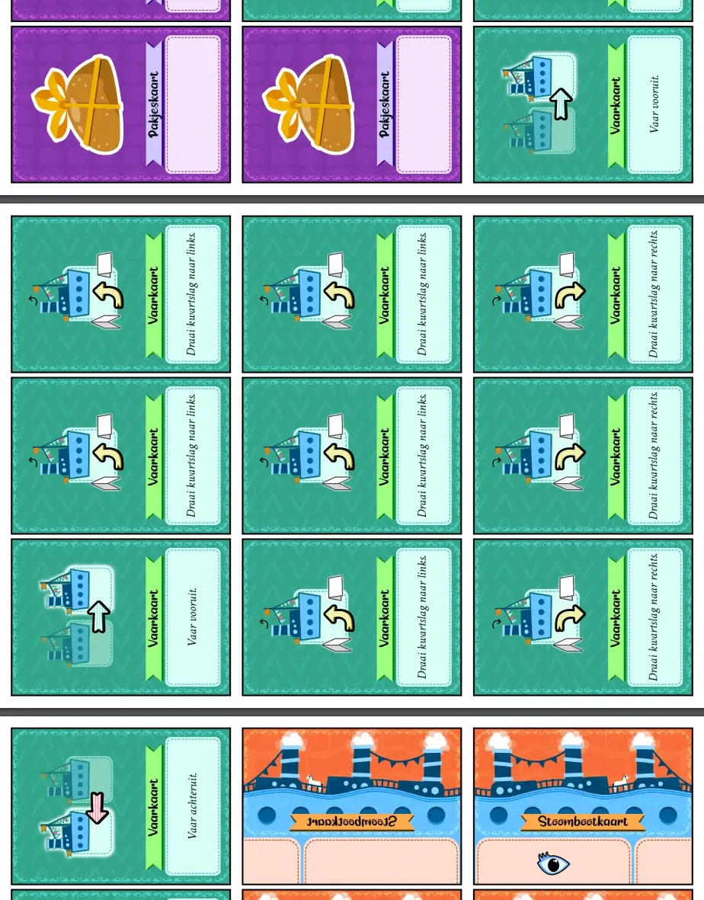
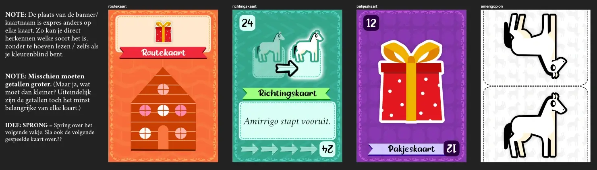
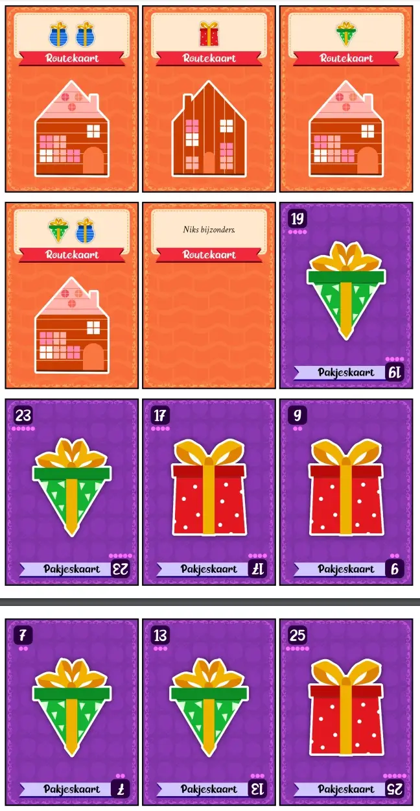

Welkom bij mijn dagboek over de ontwikkeling van mijn twee **"Sint Spellen"**: [Amerigo's Dakenpad](https://pandaqi.com/naivigation/wind-up-at/amerigos-dakenpad/) en [Boot op Stoom](https://pandaqi.com/naivigation/wind-up-at/boot-op-stoom/). 

Normaal gesproken schrijf ik al mijn dagboeken in het Engels, want al mijn spellen zijn ook in het Engels.

Dit project is, natuurlijk, alleen relevant voor Nederland. Want Sinterklaas wordt in andere landen niet gevierd, of niet op dezelfde manier.

Ik vond dit een mooie kans om weer eens een dagboek en spel volledig in het Nederlands te doen. Ook omdat een spel als dit voornamelijk door (jonge) kinderen zal worden gespeeld, en misschien is het leuk voor hen om te lezen hoe zoiets tot stand komt. Misschien inspireer ik wel de volgende generatie spellenmakers!

{}
Voor de langste tijd was dit maar één spel. Daarom zal dit dagboek de eerste 90% alleen maar praten over één idee en dat is dat. Het tweede spel komt past later, zoals je zal zien.
{}

## Wat is het idee?

Onlangs lanceerde ik mijn grootste spellenproject ooit: de [Naïvigatie spellen](https://pandaqi.com/naivigation/). 

De spellen zelf zijn hartstikke simpel. Je bestuurt, samen, tegelijkertijd, hetzelfde voertuig! Dit betekent dat je goed moet samenwerken en moet inschatten of je medespelers naar rechts willen of niet. Dit betekent vooral veel grappige dingen die misgaan en een leuke avond voor elke groep, want de regels zijn niet meer dan een A4'tje.

Waarom is het dan zo'n groot project? Omdat je dit natuurlijk _met heel veel verschillende voertuigen kan doen!_ Ik heb een spel met een auto, een boot, een ruimteschip, enzovoort.

Toen ik dit maakte dacht mijn hoofd meteen: "Ja maar wacht eens even, een Stoomboot is ook een voertuig."

Ik schreef het idee op om een Sinterklaasversie te maken. Eentje in het Nederlands, die helemaal op zichzelf stond en zó simpel was dat families die met pakjesavond konden spelen.

Inmiddels is het zowat twee jaar geleden dat ik dit opschreef. Spellen maken kost tijd. Zeker als je nog duizend andere projecten eromheen doet, zoals kinderboeken schrijven.

Toen dit jaar Sinterklaas weer voor de deur stond, vond ik het tijd om eindelijk dit idee te maken. Wat waren mijn voorwaarden?

* Een Nederlandstalig spel dat het Sinterklaasfeest "naspeelt".
* Speelbaar voor (hele) grote groepen, met absoluut minimale regels en benodigdheden.
* Waarbij het samen besturen van de Stoomboot centraal stond.
* En het liefst zonder enige tekst op de kaarten/tegels, want dat kunnen jonge kinderen nog niet lezen.

Natuurlijk zijn er veel leuke onderdelen van het Sinterklaasfeest. Pieten die daken beklimmen, snoepgoed strooien, enzovoort. Maar dit zou een _Naïvigatie_ spel moeten worden, en dat betekent dat je _een voertuig bestuurt_. Vandaar dat het spel vooral focust op die Stoomboot, ook al is dit niet helemaal realistisch. 

{}
De Stoomboot bezorgt niet de pakjes in het echt, maar dat doet ie voor het gemak wel even in mijn spel. Net zoals een boot natuurlijk voornamelijk door de motor en de golven wordt bewogen, en zeker niet "in de achteruit kan", wat mijn spel voor het gemak ook even achterwege laat.
{}

## Hoe maken we dat?

### Een korte uitleg van Naïvigatie

Voordat we verder gaan zal ik kort samenvatten hoe deze spellen allemaal werken.

* Spelers hebben kaarten in de hand die richtingen aangeven voor het voertuig. (Bijvoorbeeld "ga rechtdoor" of "draai naar links".)
* Elke ronde speelt men die kaarten totdat alle posities daarvoor zijn opgevuld. (Hoeveel je mag plaatsen, of welke posities er zijn, hangt af van hoe het spel dat invult.)
* Dan worden de kaarten onthuld en _moet_ het voortuig al die richtingen opvolgen!

Je kunt wel voorstellen dat je goed moet nadenken wat je doet. Je mag namelijk niet gewoon _zeggen_ wat je oplegt of wat anderen moeten doen---het moet allemaal zonder communicatie. Dus jij moet uitrekenen "ik denk dat zij een rechtdoor kaart heeft gespeeld, dus dan moet ik naar links, als de Stoomboot uiteindelijk op at plekje uit moet komen"

Vanzelfsprekend voegen de spellen kleine extra "twists" toe, of uitbreidingen, die het steeds wilder, strategischer en grappiger maken.

Zo, nu weet je hoe die spellen werken! Laten we doorgaan.

### Een doel

Elk spel begint met een doel. Wat is het doel van Sinterklaas?

> Bezorg alle pakjes op tijd!

Om dit een echt familiespel te maken, is het "coöperatief": je speelt samen in plaats van tegen elkaar. 

{}
Het voelt ook een beetje raar om iets te zeggen als "Jullie zijn héle competitieve Pieten en je wint als je méér pakjes bezorgd dan de anderen! Ha!" En het is al helemaal raar om te zeggen: "Jullie krijgen allemaal een eigen Stoomboot; wie als eerste aankomt is de echte Sint!"
{}

Dus we kunnen dit opschrijven met twee simpele regels.

* Iedereen **wint** als je alle pakjes hebt bezorgd.
* Iedereen **verliest** als pakjesavond voorbij is (voordat je dus hebt gewonnen).

In de ideale wereld heb je maar één regel die zegt wat je doel is. Want ja, één regel is simpeler dan twee! Niemand houdt van lange spelregels lezen, dus hoe minder, hoe beter.

Maar ik kon dit niet versimpelen zonder het hele thema van het Sinterklaasfeest te verliezen.

* Als je alleen kunt "winnen" ... ja, dan kan je eindeloos blijven spelen totdat alle pakjes zijn bezorgd! Zit je dadelijk 10 uur aan tafel met je familie.
* Als het doel is om "pakjesavond te halen", dan heb je nog steeds een tweede regel nodig die zegt wanneer je het niet haalt, zoals dat de Stoomboot kapot kan gaan.
* Enzovoort

### Hoe bereiken we dat doel?

Nu moeten we specifieke acties bedenken, de dingen _die je doet tijdens het spel_, om dit doel te bereiken.

Hoe kan "pakjesavond voorbij zijn"? Dit probleem heb ik gelukkig al opgelost in eerder Naïvigatiespellen. (Dit zal een terugkerend thema worden in dit dagboek.) 

* Na elke ronde, leg je één van de gespeelde kaarten op de "Tijdstapel". (Of de "Adventskalender", als je in het thema wilt blijven.)
* Zodra deze Tijdstapel X kaarten heeft---bijvoorbeeld 10---is pakjesavond voorbij en eindigt het spel.

Ja, in principe zeg je nu gewoon "het spel duurt 10 rondes". Maar je doet het op een manier die helemaal past bij het spel en die mensen onthouden. 

{}
Ze hoeven niet, bijvoorbeeld, in hun hoofd "bij te houden" in welke ronde ze zitten. Wat in de praktijk, zo is mijn ervaring, meestal leidt tot discussie omdat de ene denkt dat we in ronde 7 zitten en de andere ronde 8.
{}

Hoe "bezorg je een pakje"? Dit probleem had ik al deels opgelost in de andere Naïvigatiespellen.

* Tijdens het spel bestuur je dus een Stoomboot. Dit is een pion op een speelbord.
* Dat speelbord heeft "huizen" die pakjes wensen erop staan! Dus een huis heeft een rood icoontje, wat betekent "ik wil een rood pakje".
* Als je dat huis bezoekt, en je _hebt_ het pakje dat ze willen, dan lever je het af!

Nu hebben we de vraag verplaatst: "wanneer _heb_ je een pakje?" De aller simpelste oplossing, die ik toch al wilde gebruiken in een spel een keer, is dat je een pakje hebt als het **eerder in de ronde is gespeeld**.

Bijvoorbeeld,

* De eerste kaart is "Rechtdoor"
* De tweede kaart is "Blauw Pakje"
* De derde kaart is "Rechtdoor"---ah, de Stoomboot staat nu bij een huis! 
  * Het huis wil een blauw pakje.
  * Dat is hiervoor gespeeld.
  * Dus we mogen hem afleveren!

Een afgeleverd pakje is voorgoed uit het spel. Als dat niet lukt, gaat hij terug in de stapel en zal later een keer wél moeten worden afgeleverd.

Dit is allemaal nog enorm simpel qua regels. Maar er zit meer gedachte achter dan alleen "we kiezen het simpelste".

* Omdat pakjes _eerder_ moeten worden gespeeld (dan dat je het huis bezoekt), is extra strategie nodig om de juiste volgorde van dingen te vinden.
* Pakjes bewegen de boot dus niet. Dit kan andere mensen dus in de war schoppen als ze niet opletten; zij denken dat jij met jouw kaart de boot laat bewegen, maar het is gewoon een pakje en de boot blijft staan!
* Dit systeem met dingen "afleveren" heb ik nog niet gebruikt in één van de andere spellen.
* Terwijl het de deur openzet voor uitbreidingen of speciale acties. Bijvoorbeeld, misschien zouden pakjes een speciale kracht kunnen hebben die je alleen krijgt _wanneer je hem aflevert_!

## Het spel eromheen

We hebben nu de kern van het spel te pakken. Bestuur de Stoomboot, zorg dat je pakjes op het juiste moment worden gespeeld, en speel de Pakjesstapel leeg voordat je Kalender vol is.

Is dit een volledig spel? Jammer genoeg niet! Er zijn nog een paar vragen over.

### Opzet

Elk spel heeft een opzet nodig. Computerspellen doen het vaak _voor jou_, maar bij bordspellen moet je het toch echt zelf doen.

Dit onderdeel vindt niemand leuk. Zelfs in groepen vol spelfanaten is er meestal één iemand die met enige tegenzin maar gaat lezen welke fiches, in welke hoeveelheid, precies op welke plek moeten. Niemand onthoudt dat; maar zonder de opzet, kan je het spel per definitie niet spelen.

{}
Ik heb wel eens meegemaakt dat mensen een beetje "losjes" erover zijn. In plaats van de opzet volgen, geven ze spelers een willekeurig aantal kaarten, en slaan wat stappen over die ze zijn vergeten. Het gevolg? Het spel werkt niet en is niet meer leuk om te spelen. Misschien eindigt het nu véél te snel, of het is volledig uit balans, of bepaalde acties zijn zinloos geworden. 

De opzet _goed doen_ is belangrijk, anders kom je in de rest van het spel in grote problemen!
{}

Daarom is het mijn persoonlijke regel om dit altijd absoluut zo kort en simpel mogelijk te maken. Koste wat kost! (Dat wil zeggen: ik ben bereid de rest van het spel aan te passen om de simpelste opzet mogelijk te maken.)

Wat hebben we nodig?

* Je moet het Speelbord maken. Dat betekent 5 bij 5 tegels neerleggen (in een vierkant). De snelste regel? Er zijn maar 25 tegels in het hele spel, dus je kan gewoon de hele stapel willekeurig neerleggen.
* Je zet de Stoomboot erop. De snelste regel? "Zet hem op een willekeurige plek."
* Je moet de kaarten voorbereiden. De snelste regel? "Gooi alle kaarten in één stapel, geef elke speler er 3." 
* Je moet die rij van instructies voorbereiden (waar spelers hun kaarten onder leggen op vaste posities). De snelste regel? "Leg de Instructiekaarten op een rij langs het bord."
* En dan kies je de startspeler (de "Sint"; degene met de langste baard) en kan beginnen.

Dit is behoorlijk snel en simpel. Vijf korte stappen zonder twijfel of beslissingen om te maken.

Toch wilde ik hier wat aan sleutelen.

Eén van de grootste restricties die de andere Naïvigatiespellen wat meer "hetzelfde" maken, is dat spelers maar 3 kaarten in de hand hebben, én je hebt géén idee welke dat zijn. Je mag niet communiceren---tenzij een Communicatiekaart wordt gespeeld---dus je moet aan het begin van het spel compleet gokken wat men heeft.

Om dit spel makkelijker te maken,

* Krijgen alle spelers 5 kaarten. (Dit getal past ook mooi bij 5 December.)
* Worden aan het begin de kaarten opgedeeld op basis van hun soort. Oftewel, 2 stapels: Varen of Pakje.
* Zodat tijdens het spel, als spelers hun hand aanvullen, iedereen kan zien welke _soort_ kaart ze pakken. Dit is nuttige informatie waarmee je slimmer kan varen!

Daarnaast vind ik het niet fijn om veel verschillende soorten materiaal te hebben. Dat is toch vervelender knippen en opbergen, en vraagt extra zinnen in de regels om het uit te leggen.

Ook is die "instructie rij" een beetje abstract in de andere spellen. Dit spel heeft een _Stoomboot_ als voertuig---en dat is ideaal om weer te geven met een rij kaarten!

Dus ik voegde een derde soort kaart toe: De Stoomboot.

* Deze kaart bevat een stuk stoomboot. (Zodat, als je ze aan elkaar legt, je een hele lange stoomboot krijgt.)
* Maar het bevat ook een inkeping aan de onderkant die aangeeft dat je daar je kaarten neer moet leggen.
* Als je deze kaart speelt, mag je dus de rij van instructies langer of korter maken! Dit zorgt voor veel extra strategie.
  * Een langere rij betekent dat je sneller vaart/meer kunt in één ronde. Maar ... als er al 8 geheime kaarten voor jou liggen, ga je echt goed kunnen inschatten waar de Stoomboot op dat moment staat? :p
  * Een kortere rij betekent veel minder vaart, maar meer zekerheid over wat anderen hebben gespeeld en dat je de juiste kant op gaat.

Op deze manier is het spel niets meer dan een deck kaarten (3 soorten; allemaal geen tekst) en een stapeltje van 25 vierkante tegels (met voornamelijk water en huisjes die dingen wensen).

### De randzaken

Nu hoeven we alleen nog een paar kleine dingetjes vast te leggen.

**Dingetje #1:** Het is natuurlijk het leukst als iedereen ongeveer evenveel aan de beurt komt. Daarvoor moet de Sint steeds veranderen. 

Wat is de regel daarvoor? "Aan het einde van de ronde wordt de speler die de laatste kaart speelde de nieuwe Sint." (Simpel, logisch, en dit garandeert dat volgende ronde sowieso nieuwe spelers een kans krijgen om een kaart te spelen.)

**Dingetje #2:** Aan het einde van de ronde moet je dus één gespeelde kaart wegleggen in je Kalender. Maar wat als er geen kaarten over zijn? Zoals ik net uitlegde, worden de Stoomboot en Pakje kaarten dus "verbruikt".

Ik besloot dit weer te zien als een manier om extra strategie toe te voegen. Als je géén kaarten hebt om op de Kalender te leggen, dan hoef je de Kalender simpelweg niet vooruit te laten gaan! Dan heb je dus een ronde extra voordat je verliest.

Zo kan je proberen om expres een hele ronde alleen maar pakjes te spelen, bijvoorbeeld, om dit uit te stellen.

**Dingetje #3:** Wat zijn precies de Pakjes? Ik besloot om dit unieke kleuren en vormen te geven, voor directe herkenning.

Op dit moment denk ik aan het standaard: Driehoek, Cirkel, Vierkant in Rood, Groen, Blauw.

**Dingetje #4:** Wat zijn precies de aanwijzingen voor Varen? Om het spel tekstloos te houden, besloot ik te blijven bij dingen die met een simpele pijl meteen te begrijpen zijn.

Dit zijn: Vooruit, Draai Rechts, Draai Links. En heel misschien: Dubbel Vooruit, Halve Draai.

**Dingetje #5:** Wat als je met heel veel mensen speelt? Als de Stoomrij---zo noem ik de posities waar je kaarten neer moet leggen---begint met maar een paar plekken, dan zullen de meeste mensen de eerste paar rondes nauwelijks aan de beurt komen! Dus we moeten dit op een of andere manier _schalen_ met het aantal spelers.

Het makkelijkste is om één regel hiervoor te doen met getallen die heel makkelijk te onthouden zijn.

> Als je speelt met méér dan 4 spelers, geef dan iedereen 4 kaarten en maak de Stoomrij ook 4 kaarten.

Als we dan het maximale aantal spelers op 8 zetten, komen die getallen mooi uit. Dit lijkt misschien onnodig. Misschien denk je nu: "Ja maar Tiamo is een wiskundige en dus een beetje gek met getallen".

Maar dat is het niet. Mensen _onthouden regels véél beter_ als de getallen consistent zijn of meervouden van elkaar zijn. Als het ene onderdeel van je spel 6 kaarten heeft, en het andere heeft 5 acties, en weer iets anders heeft 4 stappen, dan wordt iedereen gillend gek. Maak _alles_ in je spel het getal 5, en niemand vergeet het.

**Dingetje #6:** Hoe zorgen we ervoor dat je altijd het spel _kunt_ winnen? Als ik willekeurige Pakjeskaarten maak en de huizen willekeurige dingen laat wensen, dan kan het zomaar zijn dat je 10 Rode Pakjes nodig hebt, maar het spel geeft je er maar 5!

Dit is gelukkig simpel op te lossen met mijn website. Ik gebruik code om het materiaal voor mijn spellen te "genereren", dus ik kan een slimme code hiervoor schrijven.

Bijvoorbeeld, ik bepaal eerst de Pakjeskaarten. De code zorgt dat elk pakje minstens één keer voor komt en maximaal, zeg, vijf keer. En dan geef ik precies _die lijst_ aan de code die het Speelbord maakt, en die plaatst dan die wensen bij de huizen. Zo kan je _precies_ je pakjes opmaken door alle huizen te bezoeken.

In de praktijk, echter, wil je iets meer speelruimte dan dat. Wat als de huizen per ongeluk super ver uit elkaar liggen vanaf het begin? Dan is het misschien letterlijk _onmogelijk_ om het spel te winnen binnen 10 rondes. Wat als ik een uitbreiding bedenk die speciale acties of obstakels meebrengt, waardoor het spel wederom _onmogelijk_ te winnen valt in sommige gevallen?

Dus ik laat de huizen net wat _minder_ wensen dan wat de spelers zouden kunnen leveren. Dat maakt het spel makkelijker te winnen en minder frustrerend als het misgaat.

**In conclusie:** Spellen maken bestaat voor een groot deel uit kijken naar je regels ... en beseffen dat er allemaal situaties zijn waarin ze _mislukken_. Elk spel heeft wel een paar uitzonderingen, een paar gekke situaties, waar je eerst niet over na had gedacht en die een uitzondering nodig hebben.

Het liefst wil je dit natuurlijk voorkomen. Nogmaals: minder regels is beter. Maar in de praktijk is dat bijna onhaalbaar.

### Wat hebben we NIET gedaan?

Hieronder is een lijstje van dingen die (bijna) alle andere Naïvigatiespellen hebben, maar die ik nu achterwege heb gelaten.

* **Schade**: iedereen begint met 5 levens, en elke keer als je voertuig schade oploopt, raak je één kwijt. Op die levens staan _handicaps_, dus hoe kapotter je voertuig is ... hoe meer speciale vloeken en onhandig regeltjes je moet volgen. _Weggelaten ter versimpeling + de handicaps zouden tekst op kaarten nodig hebben._
* **Communicatiekaart**: Zoals de naam zegt: als je deze speelt, mag je eventjes wél communiceren. _Weggelaten ter versimpeling + het spel is al makkelijker en zorgt al dat je meer van elkaar weet._
* **Meer ingewikkelde instructies**: sommige spellen hebben bijvoorbeeld een instructie waarbij het voertuig "springt" over de eerste tegel, of waarbij je het mag draaien onder elke hoek dat je wilt, of iets anders geks zoals aantrekking door zwaartekracht (in het ruimtespel). Dat vergt allemaal extra uitleg---een symbool of een pijl volstaat niet. _Weggelaten ter versimpeling en om het spel tekstloos te houden._

Al deze dingen zijn "gedeeld materiaal". Dat betekent dat je het dus maar één keer hoeft te printen en dan in alle Naïvigatiespellen kan hergebruiken. (Scheelt knipwerk en papier/inkt! En maakt alle spellen nog meer samenhangend!)

Maar dit spel moest echt op zichzelf staan. Dus het was vanaf het begin duidelijk dat dit "gedeelde materiaal" er nooit in moest komen.

Verder hebben die andere spellen vele uitbreidingen. Dit spel heeft er wat minder. De enige uitbreidingen die ik wil toevoegen zijn dingen die eigenlijk alleen uit het basisspel zijn gehaald om _je eerste potje echt zo simpel mogelijk te maken_. 

Bijvoorbeeld, jokerpakjes. Een pakje dat je aan _elk_ huis mag afleveren! Dit is een vrij standaard toevoeging in dit soort spellen waarbij je dingen moet "matchen". Maar als ik dat in het basisspel stop ... is dat weer een extra regel om uit te leggen; en minder is beter!

## Oké, werkt dit spel?

Dit is allemaal leuk en aardig, maar nu moeten we het spel daadwerkelijk maken (of een eerste ruwe versie in ieder geval) en kijken of het goed speelt.

Na al die jaren kan ik dit _beter_ inschatten, maar nog steeds _verre van perfect_. Ons hoofd kan gewoon niet alle mogelijke gevolgen van regels inschatten of alle mogelijke manieren waarop spelers kunnen gaan spelen. Je weet pas of je spel werkt als je het _ziet werken in de praktijk_.

{}
Elke keer als ik een spel van mezelf test, met andere mensen, is er wel één iemand die zo'n ongelofelijk rare strategie hanteert dat het spel volledig uit balans wordt gegooid. Ik was er zelf nooit opgekomen. Vaak is het ook niet eens een _goede_ strategie, verre van zelfs, maar dat maakt niet uit. Je spel moet niet afhangen van dat de spelers super intelligente dingen doen, en anders is het stom. Het moet ALTIJD leuk zijn, hoe men ook speelt, wie er ook aan tafel zit.
{}

Na het testen van dit spel had ik eigenlijk maar één probleem: **nee, je weet niet genoeg van de rest om slimme zetten te doen**.

Ik had onderschat hoe moeilijk het was om de juiste pakjes op de juiste plek te krijgen. Want ja, hoe weet je nou of iemand precies _dat rode pakje heeft_ dat diegene moet opleggen _voordat je naar dat huis vaart_? Zonder communicatiekaart, of speciale actiekaarten uit het gedeelde Naïvigatiemateriaal, kan je daar weinig mee.

Ik zag twee simpele manieren om dit te verhelpen.

* De trekstapels zijn _open_. Jij ziet dus precies of iemand een ronde geleden een rood pakje heeft gepakt of niet. (Als je goed oplet en een redelijk geheugen hebt ...)
* Ik realiseerde dat ik posities (in de Stoomrij) "speciaal" kon maken. Omdat het zo zichtbaar is, kan dat heel makkelijk door een icoontje te laten zien. 
  * Welk icoontje leek mij het duidelijkst en meest zinvol? Een **oog**.
  * Als je jouw kaart op een oog-plek legt, mag je hem _open_ leggen!

Met deze veranderingen is het spel nog steeds tekstloos en erg simpel. Maar je kan véél beter op elkaar inspelen en samenwerken.

Dit voelde als de definitieve versie, dus ik ging de code schrijven en de plaatjes maken, zodat we vrij snel een PDF met het uiteindelijke materiaal kregen!

### Over de code

Ik kan hier weinig over zeggen zonder het héél ingewikkeld te maken. Ik kan alleen een algemene samenvatting geven van hoe het werkt.

* Ik vertel de computer wat een `Kaart` of een `Tegel` _is_. Bijvoorbeeld, een Kaart heeft altijd een type (Varen, Stoomboot, Pakje) en een subtype (Rood Pakje? Groen Pakje?)
* Vervolgens zeg ik dat hij alle `Kaart` en `Tegel` voorwerpen moet maken. Hij maakt een nieuwe, vult die eigenschappen in zoals ik wil, en slaat het allemaal op in een lange lijst.

Het meeste werk zit in die eigenschappen kiezen. Ik moet ergens aangeven dat ik wil dat deze ene kaart 5 keer voor komt, die andere 10 keer, enzovoort. 

Het fijne van code, echter, is dat ik dus het hele materiaal van het spel kan aanpassen door een paar getalletjes te veranderen. Sterker nog: ik hoef niet vaste getallen in te vullen!

Ik kan ook zeggen "ik wil dat elke kaart _ongeveer_ even vaak voorkomt, en dat het spel 30 kaarten in totaal heeft".

Dan vult de code de lijst willekeurig op. En iedereen die het spel download heeft dus een nét iets ander spel dan anderen. Elke keer spelen is oprecht uniek! Maar omdat ik het wel balanceer---"elke kaart komt ongeveer X keer voor"---weet ik zeker dat het spel werkt.

Nou, dat schrijf ik dus allemaal op in website code (`JavaScript` in dit geval), en dan druk ik op de knop.

Vervolgens stop ik die lijst in mijn "teken"-functie. Het pakt elke `Kaart` (of `Tegel`), leest de eigenschappen, en tekent de kaart zoals ik aangeef. 

* "Oh? Dit is een Stoomboot kaart? Interessant, dan ...
* Teken ik dit plaatje hier ...
* En dat plaatje daar ...
* En een logo van een bootje in de hoek ...
* En klaar is kees!

Alle plaatjes die daar uitkomen---en het zijn letterlijk plaatjes, zoals je die ook met een camera zou maken---plaats ik netjes in een PDF en we zijn klaar.

Dus laten we nu praten hoe ik die plaatjes heb _ontworpen_.

### Over de illustraties

Origineel was dit spel bedoeld om te lanceren samen met een Sinterklaasbundel die ik schreef. Nou ja, je kunt zien dat dat niet is gelukt.

Die bundel kwam eerder uit; Naïvigatie werd een jaar vertraagd; leven gaat soms niet zoals je wilt.

Maar daarom zijn de illustraties dus in dezelfde stijl als de voorkant van dat boek. Veel van dezelfde patroontjes / illustraties / kleuren heb ik vrij direct gekopieerd tussen de projecten.

Ik wilde consistent blijven met de stijl van de andere Naïvigatiespellen. Dat betekent kleurrijke, cartoony plaatjes, maar met genoeg detail dat het niet té "simpel" of "kinderachtig" lijkt. Maar bij die andere spellen had ik hier en daar hulp van AI. (Dan kan ik zeggen "geef mij een geest in een auto", en na enkele pogingen krijg ik iets dat daarop lijkt. Met wat aanpassingen van mij krijgen we iets goeds en passends.)

Weet je wat een Engelse AI nauwelijks kent? Sinterklaas. Pieten. (En als het al Pieten kent, zijn het vooral Zwarte Pieten.)

Dus voor dit spel tekende ik alles vooral zelf. Dit deed ik met iets genaamd _vector art_: dit is absoluut de simpelste manier om te beginnen met digitaal illustreren en ontwerpen, zeker als je niet bepaald geweldig om kunt gaan met een echt potlood. (Ik heb het echt geprobeerd, maar ik kan nog steeds maar matig tekenen met de hand.)

En waar nodig stopte ik dan mijn tekening in de AI en vroeg om wat meer detail toe te voegen. Een beetje alsof je een laatste effect of "filter" over iets heen gooit om het nét wat sprankelender te krijgen. Is dit nodig? Is dit een goed idee? Geen idee, maar dat is tenminste consistent met de rest van Naïvigatie. Ik probeer keuzes te maken en er dan later niet meer over te twijfelen, want anders zou ik nooit meer mijn bed uit komen!

Verder kan ik nooit zoveel zeggen over ontwerpen. Het is een gevoelsding; het is _visueel_, niet _taal_. Dus ik begin gewoon, ik laat me leiden door wat mijn oog op de kaart wil zetten, en ergens een keer zeg ik "zo, tijd is op, dit ziet er prima uit".

Ik kan alleen schetsen (en het eindproduct) van dat proces laten zien.

## Kan het nog simpeler?

Dit is het moment, bij elk project eigenlijk, dat ik zoveel bezig ben geweest met dit idee ... dat ik eindelijk zie hoe het nog simpeler kan.

Dat heeft nou eenmaal tijd nodig. Je moet nou eenmaal een eerste versie doen voordat je de tweede versie überhaupt kan _zien_.

### De inzichten

Ik realiseerde de volgende dingen.

* Het Speelbord is nu "2D": het heeft twee richtingen. Links/rechts en boven/onder. Weet je hoe dat simpeler kan? Door het 1D te maken: niets meer dan een rij kaarten die de Stoomboot afvaart, van links naar rechts.
* Weet je hoe het spel nog fijner werkt voor grote groepen? Als ze allemaal _tegelijkertijd_ hun beurt zouden kunnen doen.
* Weet je hoe we nog meer materiaal kunnen besparen? Als we die Stoomrij helemaal wegdoen. In plaats daarvan heeft elke kaart een **uniek getal**: zodra ze allemaal gespeeld zijn (tegelijkertijd!), leg je ze op volgorde, en je hebt je instructies.
* Dit versimpelt de Vaarkaarten, want je kan dus alleen vooruit, achteruit, of precies omdraaien (een halve draai).
* Dit haalt dus ook het derde soort kaart (Stoomboot) weg, en verandert het materiaal voor het spel in niets anders dan een kleine stapel kaarten.

Met deze versimpelingen is het spel niets meer dan een paar pagina's aan kaarten printen en knippen. En een halve pagina aan uitleg.

### Foutjes oplossen

Maar ... we moeten het spel natuurlijk nog wel werkend krijgen. De typische "dingetjes" die we weer even moeten oplossen.

* Startspeler? Niet meer nodig! Beurten zijn tegelijkertijd.
* Het is _prima_ om een huis te passeren en niks te bezorgen. Sterker nog, je zal het waarschijnlijk nodig hebben, terwijl je heen en weer gaat als een yoyo door nét de verkeerde instructies. Oftewel, alle gespeelde kaarten gaan altijd gewoon terug in de stapels.
* Hoe laten we de tijd verlopen? "Aan het einde van elke ronde gaat de eerste kaart (de meest linkse kaart van de route) _weg_. Als hierdoor een huis verdwijnt, zonder dat het pakjes heeft gekregen, verlies je het spel."
* Oké, maar als die route willekeurig wordt aangelegd, dan kan het zijn dat je pech hebt en alle huizen aan het begin zitten (bijvoorbeeld). Hoe lossen we dat op? "Aan het einde van elke ronde moet je _een uiterste kaart_ (dus meest links OF meest rechts) weghalen"
  * Nu kun je dus zelf kiezen wat je doet op basis van de willekeurige route die je hebt gekregen. De spelers balanceren zelf het spel---altijd de beste oplossing.
* Oké, maar wat nou als mensen de kaart weghalen waarop de Stoomboot nu staat? Tja, dat moeten we gewoon verbieden. Als je de kaart onder de Stoomboot weghaalt, verlies je het spel.
  * Dit is niet zo erg, want het brengt wéér meer strategie. Nu kan je ervoor kiezen om de Stoomboot veilig rond het midden van de route te houden om dát te voorkomen ... maar dat heeft weer andere nadelen die je moet afwegen.
* Oké, maar wat als je echt héél veel pech hebt? Je route begint én eindigt met een lastig huis, die je dan in de eerste ronde al moet volbrengen? 

Dit was best wel een probleempje. Zoals je merkt bedenk ik steeds oplossingen, maar het zijn niet echt oplossingen, en het gaat maar door. Ik zal je de hele lijst met tussenversies besparen. _Uiteindelijk_ kwam ik uit op ...

* Start de Stoomboot in het _midden_ van de route.
* Aan het einde van de ronde verwijder je een _uiterste kaart_. Als dit een onvoltooid huis is, leg hem terug aan de andere kant, en verwijder nóg een kaart.
* Als je de kaart onder de Stoomboot moet weghalen, of de Stoomboot vaart zelf van de route af, dan **verlies je het spel**.

Dit was de simpelste oplossing die alles dekte. Zelfs de meest ongelukkige route zal je niet na één ronde laten sterven. Maar een huis "overslaan" heeft wel degelijk een straf. En hoe langer je speelt, hoe kleiner die route wordt, hoe groter de kans dat je er vanaf gaat.

Zolang het aantal huizen gering is, loopt elk spel binnen bepaalde tijd af. (Als je 10 huizen op de route hebt, ja, dan blijft die route dus altijd super lang, zelfs als je helemaal niks succesvols doet.)

### Wat nu?

Dit is eigenlijk een zwaar versimpelde versie van het andere idee, dat _ook werkt_. Het voelt stom om er maar eentje te kiezen. Het voelt ook een beetje raar om ze allebei zo te laten bestaan.

Dus ik besloot dit simpelere idee een eigen naam en pagina te geven, en om te schrijven naar het verplaatsen van _Amerigo_. (Of hoe het huidige paard van Sinterklaas dan ook heet.)

Deze versie is zo simpel als een spel kan zijn voordat het stopt een spel te zijn. Het is voor de allerjongsten of zij die echt bang zijn dat hun familie een spelletje niet begrijpt.

De andere versie is voor alles daarboven. Althans, dat was het plan. Wat mensen doen met mijn spellen in de praktijk moeten ze natuurlijk helemaal zelf weten!

Ik houd ze allebei Nederlands en presenteer ze allebei als Sintspelletjes. (Meer dan dat ik ze presenteer als "Naïvigatiespelletjes".)

En ze gebruiken ongeveer dezelfde stijl, want het voelt net zo zinloos om opnieuw dezelfde pijl te tekenen maar dan net iets anders, of opnieuw een Sint-icoontje maar dan net iets anders.

Zo komen we dus op het volgende eindmateriaal.

## Conclusie 

De grootste test was natuurlijk dat we dit spel speelden _met Pakjesavond_. Met het hele gezin. In mijn geval is dat een behoorlijke groep mensen. 

En dan vooral niet vragen "en was het leuk?", want dan liegt iedereen "jahoor" en ben je nog nergens. Nee, dan ga je _kijken_ of ze hun interesse bij het spel houden, je gaat _luisteren_ of ze lachen en plezier hebben, je gaat _voelen_ of het spel de sfeer verhoogde of juist doodsloeg.

In dit geval?

@TODO: Afschrijven als test/Sinterklaas geweest

