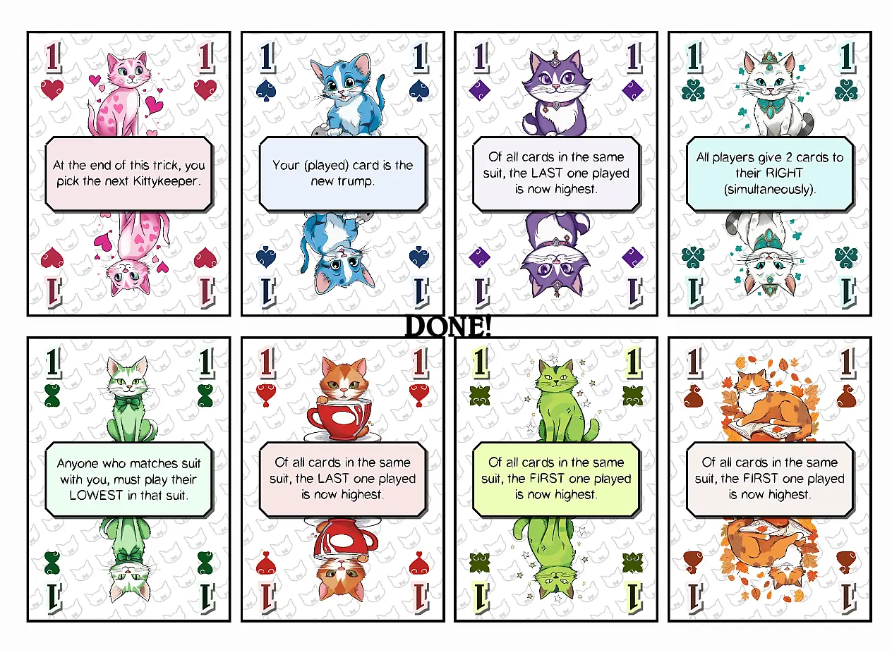

Welcome to the devlog for [Nine Lives: Tricksy Kittens](https://pandaqi.com/nine-lives-tricksy-kittens). As expected, it's a spinoff for [Nine Lives](https://pandaqi.com/nine-lives).

Interestingly, though, this was actually the first seed of the idea. A trick-taking game where everyone would lose a life except the winner of the trick.

I didn't immediately see how to turn it into a game with more variety/depth, while I _did_ see two other implementations that immediately felt fun to play. That's why I made the "base game" and the first spinoff first.

In fact, a large part of the development process for these games can be found in the corresponding devlogs: [Nine Lives (Dev Diary)](https://pandaqi.com/blog/boardgames/nine-lives) and [Nine Lives: Math Meows (Dev Diary)](https://pandaqi.com/blog/boardgames/nine-lives-math-meows).

This article picks up where we left off. I'll briefly re-explain the core mechanic of the Nine Lives series, and then continue talking about how this specific version came to be. Hopefully it's interesting or educational to read!

## What's the idea?
The core idea of each Nine Lives game is that every player is a cat with 9 lives. As you play, you lose those lives (either by losing rounds or by betting on them). The game ends when one player is out of lives; the player with the most lives left wins!

Initially, I was scared that losing your lives went too slowly. That's why the first seed of this idea was a _trick-taking game_, because each trick only has one WINNER and everybody else are automatically losers. (Which means many lives are lost each round.)

Besides this idea, however, I didn't know how to continue. 

The more I worked on this game, and prototyped it, the more Nine Lives "core mechanics" popped up.
* In a round, you're building towards the number **9** in some way.
* Being able to play a card is important, which means hand management is important. That's how I added the ability to **wager** a life to get more cards or a special power to survive one more turn.
* By keeping the deck size really small (and distributing cards in a smart way), I can make it far more likely that you're unable to play a card on your turn. (And that you'll be able to guess what others are holding, if you made the effort to track the cards.)

All of that made it possible to create two Nine Lives games in which each round only has ONE LOSER, but the game never takes too long. (Wagering lives means multiple lives are often lost in a round. Running out of hand cards means a very short round that you instantly lose. Etcetera.)

I also didn't see how to get the number "9" into the trick-taking version. The whole idea of trick-taking is that everybody plays _one card_ and in the end the highest card in the leading suit _wins_. You're not adding numbers, not building towards something, none of that.

Hence this "trick-taking version" was pushed back more and more, until I only picked it up again once the other two games were completely finished.

## Creating a functional game
So, let's recap my two goals with this game.
* Provide the core game engine of Nine Lives (which is tested and works) in a trick-taking format.
* Add variation to the series: this game should do things that the other two couldn't.

### Life Cards
Let's start with the Life Cards. 
* **Nine Lives**: lives represent a power that activates when you wager that life. (They are interchangeable: you get a random set of 9 lives at the start.)
* **Math Meows**: lives are a _permanent_ power (when it's your current life). They are a fixed deck, in numerical order, meaning you literally play one specific "cat".

Hmm. I already did permanent power _and_ triggerable power. I already did a fixed set and a completely random set. I already did one version with _text_ and one with _icons_. 

What to try now?

In both cases, lives are a _separate_ type of card. The one thing I didn't like about it, was that it bloated the amount of material for the game. (Nine lives, six players max, means 45 cards just for that part of the game.)

So ... let's **combine Life Cards and Hand Cards into one!** 

The rules would be as follows.
* On your turn, play a card.
* You can play it from your _hand_, which does nothing special.
* Or you can play your top _life card_, which also activates its power.
* You only get your card back (at the end of a trick) if you've WON.

Now the game only needs _one_ type of card, which are both your hand cards and your lives. This also allows a new type of power or ability on the cards, as they are literally _played_ into the trick. (And they'll have their own _suit_ and _number_.)

Similarly, _playing your life_ is very much like _wagering your life_ in the other games. You're putting an extra life at risk because you're betting on winning the round with it.

{}
At first I thought this had the potential issue of the last player abusing it endlessly. If you have a good power on your current life, you can endlessly play it, win the round, get it back. 

But then I realized I was being stupid: if you win the round, you become the next start player! You don't stay "last player", of course. Thus, this is no issue.
{}
### Keeping the core
By default, trick-taking games don't "build" towards something.

But we can just ... change that?

Let's say we add the following rule.

> You can never play a number that would bring the _total_ for its suit above 9.

This is a simple and fun rule, except for the fact that it creates a gap in the rules of trick-taking.

Namely, situations in which you _can't_ play a card. (Where, normally, if you can't follow suit you just play any other card. In trick-taking games, there should never be a situation in which somebody just plays ... nothing.)

So we need to loosen our definition of "not being able to play a card".

> You must follow suit, **if possible**. (If you don't have the suit, or playing it would raise the total above 9, you can't follow and just play something else.)

This is a step in the right direction, but has some big issues. Namely, all the cards above 5 will win a trick **for sure** if you start with them :p

Higher cards can't be played, as it raises the total above 9. Lower cards _can_ be played, but, well, they're _lower_ and won't win!

(Though this is obviously a prime candidate for modification by those _powers_ on the cards. A simple power that says "this card may exceed 9" would do wonders.)

Let's add a twist that I wanted to include anyway, because I think it's interesting.

> Following suit only applies to the _previous card_.

In other words, you must play the same suit as the PREVIOUS card if possible. This way, the "suit" of the round dynamically changes as the round goes on.

Which brings us to one _final_ rule to implement. Because now we have to ask ourselves: "who wins the round? If there are multiple suits, which one determines the winner?"

> The suit played the _most_ is used for determining the winner. If tied, the first suit played (by the start player) is used.

### Also keeping it simple
The rules and mechanics are stacking up now, so I want to stop here. 

(It's still a very simple game with one page of rules, but I know from experience that tiny exceptions and rules will be added one polishing a game, so at this stage I _really_ want it as short as possible.)

Any other ideas (such as the **trump** you usually see in trick-taking) will have to be _on the cards_ (powers that you can read when you get the card) or an _expansion_.

At this point, I grabbed some pen, paper and scissors and created a quick prototype. 

(Though it's too much work to write all the powers on the cards, so I just kept a list to the side of three powers and pretended each suit had one of those. It's not the best simulation of how the real game would play, but it's good enough.)

This game idea did throw another curveball, though. A _huge_ part of the deck will be tucked away inside those Life Decks. (For each player, 9 cards are just gone at the start of the game.)

The other Nine Lives games had 3 and 4 "suits" respectively. That's just not enough now! With each suit numbered 1 to 9, we only get enough cards for a 3-player game with 4 suits.

If we want to support 6 players, we'd need **8 suits!** (6 * 9 cards are hidden inside Life decks, so we need another 18 cards to make sure all players start with a hand size of 3.)

That's just too much. It reduces the chance of following suit---or suit mattering at all---to near zero. Sure, I could say "with 3 players, only use 4 suits", but that doesn't solve anything for the higher player counts.

How do we really solve this? Each suit needs **more than 9 cards**.
* We can add negative numbers. (-1 to -9)
* Or we can duplicate numbers. (We need a rule anyway for when multiple numbers are the highest, as many special powers can make that happen.)

The negative numbers would be interesting, as they work well with the rule of "can't exceed 9 for a suit". It would also probably scare some people away and make the game very mathematical.

As much as _I_ would like do that, the duplicate numbers seem the better option. We can weight them so that lower numbers appear most often.

This is one way to get 18 cards per suit. (Which would bring the number of suits to just 4.)
* 1 = 3
* 2 = 3
* 3 = 2
* 4 = 2
* 5 = 2
* 6 = 2
* 7 = 2
* 8 = 1
* 9 = 1

{}
A fifth "trump" suit would be an optional expansion and probably only have 9 cards, otherwise it's too overpowered.
{}

To balance the numbers, we'd need a few more lines during setup. But if that allows the rest of the game to stay the same regardless of player count, that's fine.
* With 3 players, remove all duplicate numbers from every suit. (So just 9 cards per suit; 36 total; each player starts with 3 hand cards)
* With 4 players, remove one entire suit. (Which means 54 cards; each player starts with 4 hand cards)
* With 5-6 players, do nothing.

{}
A 2-player variant needs more rules anyway, so I'm just treating that as a special case at the end of the rulebook. There aren't enough 2-player trick-taking games, so I really want to do my best to add that mode to this game.
{}

As I said, this is another one of those weird, experimental ideas of mine with challenges I haven't seen before. The ideas above could work great, or I could discover why no other game has done it this way :p

Let's just make that prototype (using the deck layout above) and see what happens.

## Lessons from the prototype
### It mostly didn't work
As always, stuff didn't really work.

When I say "you can't play a card that would bring a suit above 9", it's too free. This happens so frequently that players can often just "play whatever".

So I say: "any suit whose total is greater than 9 has _exploded_. Exploded suits cannot win a round." Which is a somewhat fine rule, except ...
* This makes resolving who wins the round really tricky with at least three exceptions.
* This _also_ happens quite often, and without players having any say in it. (As they must follow suit if they can.)

The rules just seem messy and full of exceptions/tiebreakers, which do not really translate in a lot of fun or interesting decisions.

So I'm tempted to try all sorts of crazy rules.
* The suit with the highest **total** is used to consider the winner.
* The player who played the _last_ card in that suit wins.

Or maybe ...
* You keep playing a trick until there's one clear winner. 
* (So as long as there's a tie or all suits have exploded, you just keep playing another round of that trick.)

Or maybe even ...
* If you manage to play a perfect 9 ( = your card brings the total from a suit to exactly 9) ...
* ... the round instantly ends and you win. (Players after you take no more turn.)

But all those changes don't really solve our issues, while they _do_ push us further and further from what a trick-taking game actually is. (And closer and closer to the versions of Nine Lives that we already have.)

### The new way forward
As such, I established some ground rules for this game. (The "basics" of trick-taking, the things that actually make it so good and versatile. There's a reason for that, right?)
* **A trick is one round, in which every player plays one card.** => it's just the simplest structure and the one used in all trick-taking games. No multiple rounds. No exceptions in which you suddenly _can't_ play any card at all.
* **You must follow a suit already played (if possible).** => this gives more freedom than "follow leading suit" or "follow the previous suit", without being too free. (I tested a game without having to follow any suits, but that's just boring and meaningless.)
* **There's always exactly one winner.** => this simplifies who starts tricks, how lives are lost, etcetera. (Otherwise we need even _more_ rules for how to pick the next start player in case of ties!)
* **You should always have a good number of cards in your hand.** => otherwise you just can't make meaningful decisions, as you can't look further ahead than 1 or 2 tricks. And you're probably forced to play 1 specific card each trick.

I did find a solution to the last issue rather quickly while prototyping!
* If you played a Life Card, you always get it back. 
* However, if you _won_, it returns to the bottom of your Life Deck.
* If you _lost_, you take it into your hand. (You've permanently lost a life _but_ have an extra option in your hand.)

This immediately felt balanced, usable, strategic. Losing a life is still bad, but it can even be done on purpose now to get a good card in your hand. At the same time, lives are _public_, so now everybody knows you have that specific card.

That rule just works and will probably stay.

As for the other issues ...

In the end, the only real solution I saw was to move the "nine lives"-core stuff ("can't go above 9") **away from the trick-taking**. To decouple the two things, so that the trick-taking can stay simple and use the well-known formula, but everything around it is twisted.

Instead of having these rules mess with the meat of each trick, only apply them _before_ or _after_ each trick.
* If a suit's total _exceeds_ 9 (it's exploded!), anybody who played that suit **loses a life**.
* Otherwise, nothing happens (for anybody who played that suit).

This works _better_, yes. Much simpler rounds and simpler rules. The game _works_, yes.

But it wasn't that much of an improvement. It's just ... mediocre? No truly interesting decisions, not enough control, lives just fly away and you can't really stop it. The idea of "exploding" if cards played are too high is fun ... but I guess I'll keep that for a _different_ game where it fits better.

I am _still_ trying to make a trick-taking game that is working against itself. Because I forgot the last major draw of trick-taking games: **it usually matters (a lot) what is actually _inside_ the tricks.**

In Hearts, you don't want the minus points. 

In a more modern game like The Crew, you fulfill challenges by winning a _specific_ card with your trick.

The only exception I can see is _Spades_. In that game, you must _bid_ how many tricks you expect to win. Which is another great mechanic, but I see no way to implement it for _my_ game. (I wrote some rules drafts, but none seemed promising.)

So ..

## The new, new path forward
Here's the idea.

We do the reverse. We don't start with 9 lives and go to 0 ... we start with 0 and go to 9! 

In other words, the game ends as soon as one player reaches 9 lives. They win.

Not only is this _different_ from the other two versions, it also allows a smaller deck (which you know I like) and the following rules.

Trick-taking works as usual.
* Follow leading suit, if possible.
* If trump played, highest trump wins.
* Otherwise, highest card in leading suit wins.

So far, so good. Now we need a way to get those lives and make tricks a little more interesting. Something related to what's _inside_ the trick that you win.

Here's the idea: **all cards that match suit with your _current life_ go into your life deck.**

This means that it's worthless to win tricks full of cards you can't score. You want to time your best cards (your "I'll surely win that trick") with getting cards that actually add to your lives.

On its own, that's not enough though. If you're lucky with your cards, you just play the highest ones, win all tricks, and nobody can stop you. That's why trick-taking games have a **trump**.

How do we decide the trump? **The suit that occurs most often on player's lives, is trump.**

The more I tested this idea, the more I realized that the truly unique (and valuable) idea is that _current life card_. That public card that every player has. The card that executes some powerful ability when played. That's why I sought ways to make them important everywhere.

These rules are much simpler, yet lead to a better game. Because now you ...
* Start with your whole hand. You can plan ahead, strategize, know when a card is definitely out of the game or in another player's hands.
* Even if you're unlucky with cards (lots of low ones), you can still win by _timing_ the tricks you win, or using something as a trump at the right time.
* But we still have Nine Lives written all over it.

When I tested this, I immediately noticed one major oversight though. (Before I even finished the first round :p) 

* At the start of the game, players pick _one_ hand card as their first life. 
* But ... you only win new lives if they _match_ suit with your current life. Which means the suit of your life deck never changes!
* This basically renders the whole mechanic void! As such, we need a way to constantly change what's on top of your Life Deck.

We could do that through the life powers, and we surely will. But it's better to have it built-in.

The best rule I had was: **if you win a trick, and no card scores as a life, pick any single card to add to your lives deck**.

You're rewarded for actively winning tricks. But when nothing inside scores for you, you'll get a _different_ suit on top of your life pile for sure.

**Does this work?** Again, it _does_ work, but it's just nothing special. It's pretty mediocre.

Variations on the idea (such as "you only score cards that match suit with a _neighbors_ life" or "if you score no cards, distribute them across all players") also "kinda work" but not in a way that made the game click.

Many years ago I would perhaps have been happy with just a simple, functional game that could even be played with a standard deck of cards. But now I just feel like the choices are minimal and not interesting, and that luck of the draw is way too important, and that the game could be _better_.

At this point, I simply dropped the idea for a while. Clearly, I was trying to make something fit a mold in which it didn't belong, and pushing harder wasn't working.

I'll pick up this developer diary when (if) I get back.

## Let's do bidding anyway
Coming back to the idea with some fresh eyes, I found the obvious solutions to my earlier issues with a "Spades"-like trick-taking game. This made the bidding variant the most promising, so I decided to pursue that now.

### The new, new, new idea
What's the idea?
* At the start of each round, you play a card from your hand. (You do this simultaneously, in secret.)
* This is your **bid**. The number on that card represents how many tricks you expect to win.
* But it's also your **poison**: any card you play in the same suit as your bid is _ignored_. (When checking which card won the trick, that one is just not considered.)
* Now you play a regular trick-taking game until player's hands are empty.
* If you won _exactly_ the number of tricks you bid, you score that card. Otherwise, you get nothing.
* First player to score 9 lives (or more) wins!

In the first version, I had slightly more complicated rules, such as ...
* If you play the same **number** as your bid, it's **also ignored**.
* You're allowed to win _more_ tricks than you bid, but for each one that's "too much", you lose a life.
* Bidding happens publicly, in turn. (I thought this would be more fair and allow players to react, but in reality it's more boring and gives later players a huge advantage. So secret bids it is.)

But when testing the game, these immediately revealed themselves as convoluted and not adding to the fun. 

{}
By the way, we now just use a deck of cards from 1 to 9 in 4 suits, which means I can prototype this game using a standard deck of cards. Always a good day when that happens. Less cutting, less fiddling with tiny paper cards.
{}

### Iterating & Improving
Testing also revealed the need for a **trump**. I copied the rule from the older version: the bidding suit of the leading player is always **trump**. 

In other words,
* If you bid a 4 of Hearts
* You must win exactly 4 tricks.
* But Hearts mean nothing to you.
* And if you started a round, Hearts is trump.

This works _great_!

It has everything that makes regular trick-taking great, but with a clear twist that makes sense and adds strategy. It does all that _without_ requiring a HUGE deck of cards: we just need 1 suit (cards 1-9) per player.

With that as the core, I sought to add that little "Nine Lives" spice. (Besides having 9 cards per suit, winning when getting 9 lives, all that stuff. I still wanted something more that ties the game to the others.)

**The cards have powers on them.** Yes, the same idea with which we started. And just as before, the powers don't activate all the time. (That would be way too overwhelming and confusing.) 

No, I decided on something more controlled like:
* Each time you win a trick, place one card faceup in front of you. (In a row next to your bidding card, that's probably the easiest.)
* First of all, this publicly tracks how many tricks you've won. 
* Second of all, before each turn you may activate a **power** on one of those cards!
* To do so, however, you must _pay_ that card (losing the trick again).
* And only **one power** can be used **per round**.

In other words,
* Powers can help you make the best out of your specific hand/situation, with varied and surprising effects.
* But they have a simple payment, so they won't be abused.
* You can even use them to _lose_ tricks if you've won too many.
* But only one can be used each round, so that is _another_ thing that should weigh into your strategy.

We can make this even more streamlined by including the bid card's power as well. We can generalize the rule to something like:
* As you win tricks, place one card for each trick to the right of the row in front of you.
* Your _left-most_ card (in front of you) is your current bid card.
* You can use the power on any of them.

This means you can strategically _switch_ your bid mid-game, if you play it well and use a power at the right time.

Finally, a fun side-effect revealed itself during testing. Because cards scored (if you meet your bid exactly) are _out of the game_, this increases tension and difficulty as the game goes on.

Over time, a handful of cards will simply be out of the game, which changes the highest card in each suit (or how many there even are!).

This could be a bad thing if it happened too much. But reaching 9 lives by summing the _number_ on each card you win is relatively easy and doable with only a few good rounds. 

For example: you bid 2, then 4, then 3. All very low bids, but if you consistently meet them, you've won the game after 3 rounds.

{}
Initially, I had a card deck that was missing its aces, so I tested the game with numbers 2 to 10. That, however, proved to me why the numbers should be 1 to 9 :p Those bids are doable and balanced, while higher cards makes it near impossible to win a round OR you win a round and are basically already the winner of the game.
{}

### The final spice
One part I _really_ like about Spades is the fact that you cooperate. You have to reach your bids _together_, allowing all sorts of fun strategy or trying-to-communicate-with-your-cards.

So, as a final wrinkle, let's add that to this game.

> All players who bid the same _suit_, also win the round if their _total_ is correct. (Regardless of whether they individually met their bid.)

For example, you bid Hearts 2 and another player bids Hearts 4. Then you can still both score if you collectively score 6 tricks, no matter how they're distributed.

Because the teams are always shifting, though, and you must meet this number exactly, this adds even _more_ strategy! (Maybe you accidentally entered into a team with somebody who's already winning. So you try to actually _sabotage_ your total to make sure they don't score, while still trying to reach your _own_ bid exactly, playing a sort of double-double-bluff.)

This is a version of the game which I can get behind.

Though I'll probably have to move some of those rules to an expansion / variant, to make your first game simpler. (As I probably stated before, trick-taking games are second nature to most games, but need quite a lot of extra explanation for the uninitiated.)

## Let's make that
As usual, this is the part of the process that's just about execution and implementation. I write a lot of code, I collect my images and put them in the right place, I tidy up the rules and create example images, etcetera.

There's not much interesting to say about that. So let me talk about a few things that _might_ be interesting (even though they didn't take much time at all or are only tangentially related).

### Powers
I've made a _lot_ of games the past few months that include special powers or abilities. As such, I was initially a bit "burned out" on coming up with another list of 10-20 creative (yet simple) power ideas.

So I did something new. I researched other trick-taking games with special powers and picked two of them with clear rules and good reviews: **Fox in the Forest** and **Rebel Princess**.

When reading those rules, the inspiration immediately returned and I could "convert" about 75% of their ideas into a power that would fit my particular game.

Once that stream of ideas started flowing, my mind also handed me 10 more unique ideas, after which I was satisfied. I ended up with 35 simple and fitting powers, which is ironically way more than I set out to find :p

### Improving my systems
With every game, I find new flaws in my current system (for randomly generating cards), or new requirements (which the current structure can't easily meet).

For example, this game was the first time I ...
* Had text
* With a thick stroke
* And a clear shadow

(I'd done all these things on earlier projects, of course. But never all three combined in this way.)

When I set up the system a few years ago, though, I just did my "best first attempt" and therefore made a grave mistake. Any effects were applied to _both_ the "fill" (in this case the text) and the "stroke", which meant that shadow was automatically duplicated. 

Which looked incredibly messy. And, also, isn't how that's supposed to work.

So I had to take a day to rewrite the core structure of my library and do this properly. In this case ...
* Create a temporary canvas.
* Draw fill (the "content") and stroke to _that_
* Then paint this temporary canvas onto the real one, _while using the effects_.

Similarly, I added an Outline effect so that I could also stroke _images_. (As in, add a stroke that snugly runs around the non-transparent part of an image. This is crucial for making icons stand out and have strong contrast, especially as my card designs get more complex/busy.)

It worked ... but in the current system, this effect was added onto _the original image_. In other words, 
* Say I scaled the icon down by 10% (from its original size) ...
* Then the outline would _also_ be scaled down 10% (as it's just part of the image) ...
* Which means I need to manually compensate for that if I want any consistency ...
* ARGH it's just a mess.

So I had to improve my Effects pipeline as well. They should be able to apply effects _independently_ from the actual image.

All of these things are relatively minor tweaks that lead to a huge improvement to my systems. Still, they take a day or two to sort out and work through, and I'm always frustrated when a project is delayed due to issues like these.

### But does it work now?
Yeah, yeah, it does. The final code is actually _really_ short and simple for these cards, as they're all the same type and very consistent in look. (The benefit of working from an established genre, namely trick-taking, instead of inventing your own completely unique game.)

On the website, you can completely remove those "powers". I moved those (and a few rules to balance them) to an expansion or variant for after your first game. The game works fine without them, especially if this is your first shot at trick-taking.

I prefer lowering the hurdle between players and their first game _as much as possible_, over presenting a slightly better but more complicated game to newcomers.

Also, the powers are completely **written**. No icons or specific illustrations. That was just too much work for too little gain, considering I have 35 unique powers, and not that much space left on the card. 

Icons work great when you need only a handful, but fail to have any practical use if powers are so diverse anyway.

Most powers can appear on any number, as much as they like. But some powers are clearly overpowered (or useless) on certain numbers, or if they appear too often, and my generator takes that into account.

Finally, I noticed that all that text can be a little overwhelming at the start of the game. (With 4 players, you have 36 cards, _all with a different power_.) I wanted to make some cards "no power" to make it a little easier and eventually settled on giving the highest cards (the 9) that treatment. They're already the best cards in the game (in most cases), so removing their power seems good for balancing.

## Playtesting & Polishing
I generated the materials, printed it, tested it. What's the result?

First of all, I created all the marketing materials a few days before the playtest. That's when I realized I had been truly stupid: this game has _eight_ possible suits. Eight! In a franchise (or, well, series of games, let's not get ahead of ourselves) where the number **nine** is everywhere and determines everything!

This was obviously annoying me (once I saw it), and would annoy the hell out of other people, so I hastily added a ninth suit the next day :p (The black cat, which honestly fits perfectly and doesn't look out of place at all. In fact, I saw a chance to test a "wildcard" variant that I was toying with, and pin it on that suit.)

As I expected, those who've played any sort of trick-taking game barely need to listen to the rules. They just get the game and like it. 

Those who _haven't_ played much trick-taking before, seem to benefit from the fact that I moved any special rules (such as player powers) to "after your first game". This allows the first round to focus entirely on understanding tricks (and trumps), and getting a feel for what to bid. The explanation for the game is reduced to under a few minutes.

All in all, the game works!

It's simple. It's a unique twist on trick-taking I've personally never seen anywhere before. It still retains some of that Nine Lives-feel, while being clearly different from the other two games.

I guess that's the benefit of taking a proven mechanic and building on top of it. Trick taking works so well because it's balanced by itself. Bidding works so well for similar reasons: it moves the goal post from "just win as much as you can" to "win exactly as much as you predicted", which is more interesting and resistant to luck-of-the-draw.

Really, the game works fine without any of the powers or "Nine Lives" stuff. It's just a bonus!

I merely tweaked a few powers, polished the graphics slightly more, and rephrases a few things in the rulebook. 

Then the game was done!

And with that, the Nine Lives games are probably done. I hope these three games give many groups of people simple and immediate fun, all around the world. It's probably the simplest set of games I've ever made, while having a lot of (hidden) depth and tension. 

Until the next devlog, keep playing,

Pandaqi

