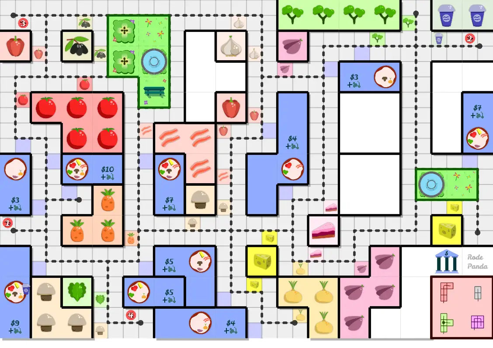
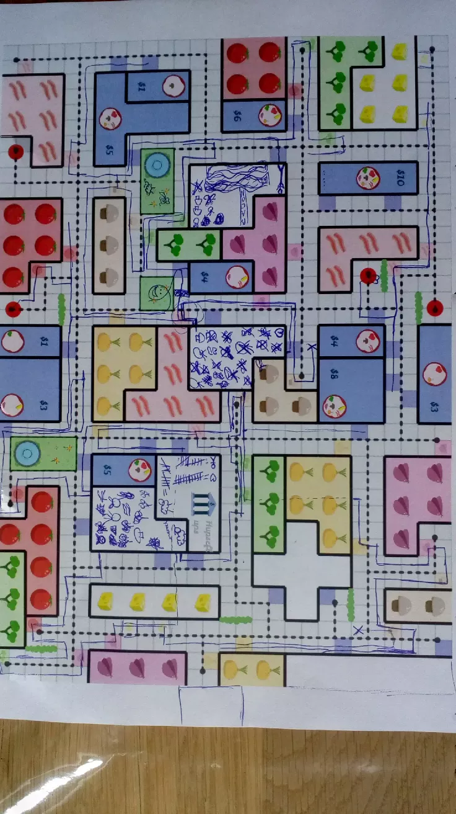
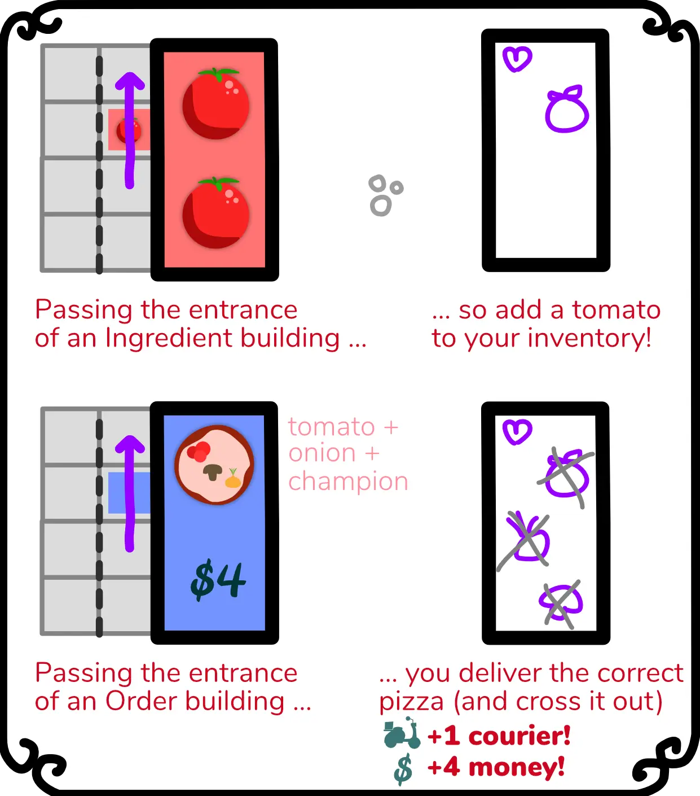
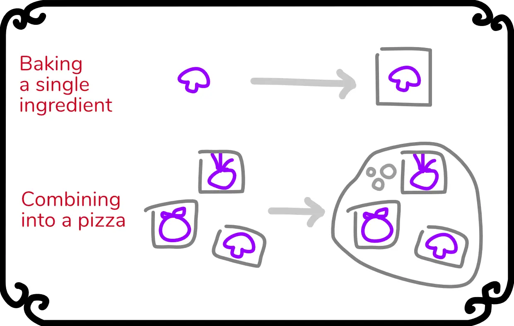
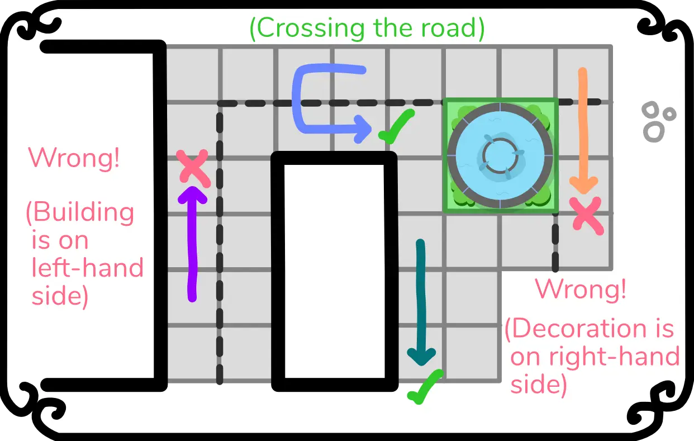

It's time for another boardgame devlog!

This time, I will explain the process behind my game [**One Pizza The Puzzle**](https://pandaqi.com/one-pizza-the-puzzle)

The game has perhaps the simplest set of rules and mechanics of all my
games (even including the expansions), which is why this devlog will be
rather short.

Generating the random game board, however, required a large set of
complex algorithms, which is why my "technical devlog" will contain most of the development details. (That one hasn't been published at the time of writing.)

Here's what the final game boards look like:

You can go to the website and try it out yourself to generate infinite
random boards on which you can play this game!

Anyway, let's get started.

What's the game all about?
--------------------------

In this game, everyone tries to deliver pizzas. To perform this task,
each player receives one *pizza courier*, which is represented by a
*line on the board*.

Here's an image of a finished, live played game to get an idea:

{.float-right}

Each line starts at your restaurant, and on your turn, you may move the
line (up to) 3 spaces. In a sense, the current position of your courier
is always the *endpoint* of the line.

Here's the kicker: **you may never cross another line, not even your
own**.

This means that you need to be smart about where you move and when,
because you want to cut off other players from valuable ingredients, but
prevent yourself from being cut off.

That was the idea that started this whole game: draw lines to do stuff,
but you may never cross the lines.

It was a natural evolution in my series of *One Paper Games*, because
this is something that you can *only* do by drawing on a paper, and not
in a regular boardgame. (Well, you *could*, but it would take a hundred
tokens or items to be able to track routes like that, and then even more
for the ingredients and special actions/buildings in the city!)

So, how did I approach this mechanic?

Theme first
-----------

When I invented the mechanic for this game, I was working on another
game about delivering pizzas. ([*Pizza Peers*](https://pandaqi.com/pizza-peers)) At the
moment, I thought: "hey, maybe I can do a combo, where I make both a
computer and a boardgame about pizzas!"

Ever since that moment, the theme of delivering pizzas was glued to this
game idea, and I couldn't get rid of it. Even though I only made the
boardgame variant more than 6 months after the computer game.

As such, before I even wrote a single line of the rulebook, the theme
was set in stone: the game board showed a city (or at least one section
of it) and you were trying to deliver pizzas.

This raised a few default questions:

-   "How will you get ingredients?"

-   "How will you prepare the pizza?"

-   "How will you deliver the pizza?"

At first, I took the most logical route: when you get an ingredient, you
need to move your courier back to your restaurant to deliver it to your
storage. Then, within your restaurant, you must take actions to prepare
the ingredients and bake the pizza.

{.float-right}

Hopefully you already see the problem: this was too *complicated*.

Additionally, it just wasn't fun. If you've already traveled *to* an
ingredient building, where's the fun in traveling the exact same route
*back to where you came from*?

And thirdly, there wasn't any room on the board for this. After making
some quick sketches and trying these game ideas, I soon realized how
*easy* it was to lock yourself in or get stuck because of your own
lines. Once you'd traveled through some part of the board, it was hard
getting back there afterwards, even without other players annoying you.

Simplicity is Key
-----------------

I decided to get rid of all the "logical" aspects of delivering
something, and instead just made ingredients teleport back to your
restaurant. As soon as you reach an ingredient building, you may
immediately write that specific ingredient inside your restaurant. Much
easier, much quicker, and more satisfying (because there are immediate
results to your actions).

Similarly, I ditched the idea of including all sorts of actions and
rules for *preparing* the ingredients. Instead, I realized that it's
quite easy to *draw* a pizza (it's just a wobbly circle), which created
the following action:

**\> Prepare:** draw a circle around ingredients in your inventory to
combine them. They now form a pizza and can be delivered.

That was the whole prepare action! And it was even intuitive, because
you literally turned the ingredients into a pizza.

Something is Missing
--------------------

At this point, the game was really simple:

-   Each turn, either Move or Prepare.

-   When moving, extend your line three steps. You may *never* cross.

-   When you pass an ingredient building, immediately retrieve it.

-   When you pass a building that wants a pizza, and you have it,
    immediately deliver it for money.

This worked ... but was also simultaneously too hard and too boring. It
was easy to get stuck with your line, with absolutely no way out. It was
also hard to annoy your opponent without hurting your own chances as
well.

The second sentence in the paragraph above sums it up nicely: "there was
no way out" Because you could only do ONE simple thing, you didn't have
many interesting choices or creative solutions to problems.

When something like that happens, I usually apply the following rule:
*make ONE thing in the game able to do TWO things -- but not both at the
same time.*

What if, instead of putting ingredients on pizzas ... you could eat them
yourself for extra powers?

As such, a third action was born:

**\> Eat:** eat one of your ingredients to immediately get its power (+
a reference to the page with all the special actions)

Do note that, at this time, I had *no* idea what those special powers
would be specifically. I only knew that this would be a good idea for
the game and that they should be able to block opponents or help
yourself (out of sticky situations).

An Element of Timing
--------------------

One thing I desperately try to avoid, is *analysis paralysis*. In my
experience, about 25% of players are susceptible for this, which means
they take *forever* on their turns because they are literally
*calculating* all possibilities and trying to find the optimal move that
way. It's not fun for them, it's not fun for anyone around the table.

A related problem happens at the other extreme, when a game has no
unpredictability and you know in advance exactly what's going to happen.

Those two issues were still present in this game, which means I needed
to solve them.

One thing that often works, is introducing an element of *timing*. Yes,
you know for certain that you can get to that building in 3 turns ...
but *when* will you take those turns? There must be some incentive for
players to switch it up, to hold out on certain actions, to add some
turns that could not be predicted.

For that reason, I expanded the **Prepare** and **Eat** action.

\> **Prepare:** besides creating the pizza, you must also *bake each
element individually* (by drawing a rectangle around it).

\> **Eat:** you can only eat ingredients that have *not been baked yet*
and are *not on a pizza*.

(The previous image about these actions was actually already the updated version.)

This means that it actually takes some time to prepare a pizza (and it
takes more time on *bigger pizzas*), but you can't just take turn after
turn baking everything, because you don't know if you'd want to *eat*
those ingredients later.

(Additionally, I wanted to add special spots on the map where you may
take two or three Prepare turns in a row, if you're standing there. This
also means you need to *time* your preparations properly. But this will
probably go to an expansion, as I want to keep the base game extremely
simple.)

But ... *how* do you move?
--------------------------

During the first drafts of the rules, I just wrote "move three steps"
(or "three cells") and though that was clear enough, especially with an
image.

Once I had my first few boards to try out, I quickly realized how bad
this was as a rule or explanation.

If you could move literally anywhere, the game became messy and its core
mechanic (drawing lines that you cannot cross) fell flat.

Instead, I wrote a paragraph in the rules explaining that you need to
**follow regular traffic laws**. So, stay on the right side of the
street. (You could change that to left side if you're British, if you
want.)

This rule improved the game *a lot*. In fact, one of the first games I
played I accidentally got *myself stuck* because I wasn't paying
attention and didn't realize I was not allowed to go a certain way.

It's also a very intuitive rule, because, well, you're moving through
the city and everyone is used to traffic having these rules.