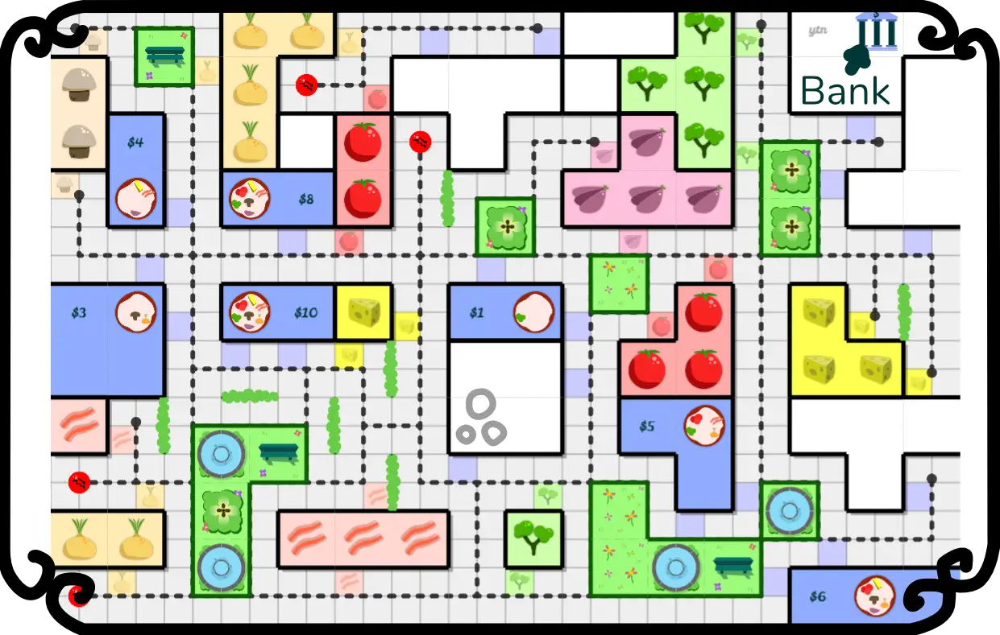
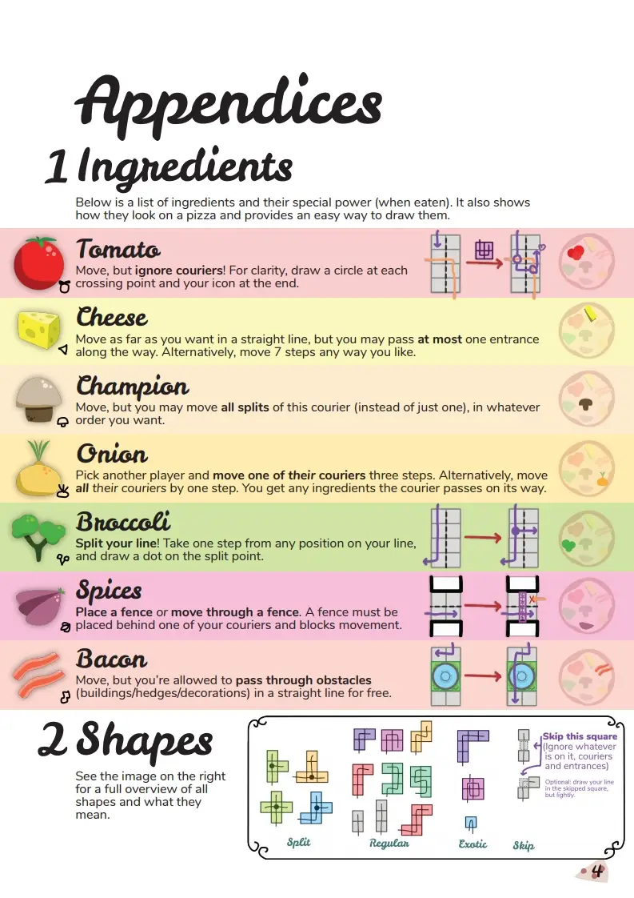
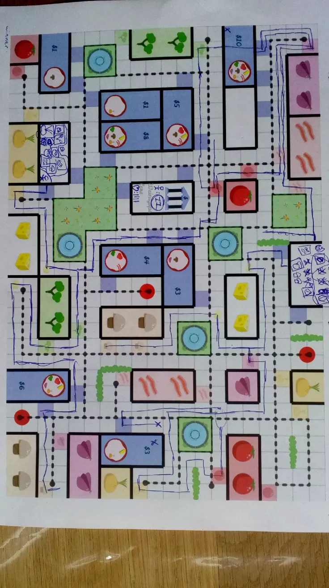

Welcome to part 2 of my devlog for the game One Pizza the Puzzle.

{}

The Name
--------

Until now, the game had temporary project titles like "that pizza game"
and "pizza place".

I decided to give it a proper title, mainly because I wanted to start
building the website and rulebook, and it helps to know what you should
call everything.

Something related to "Pizza Game" was out of the question. There are
*many* other games that center around pizzas, even many with that exact
name.

Something like "The Pizza Place" also didn't work, because, again, that
was a real-life thing.

I didn't want to use the same name as my computer game, because the
projects turned out wildly different and it would just confuse people
(and Google's algorithm).

This is where it gets interesting.

I stumbled upon a "Pizza Puzzle" (you guessed it -- because I wanted to
call the game something like that). My brain was still in *Italian
accent mode*, which means I read it as "piece-a puzzle" Not long after I
had created the best pun in the history of puns ...

\> "One Piece of the Puzzle" ... became ... "One Pizza the Puzzle!"

It was risky, because certainly many people won't understand the pun.
They might just think I don't know how to write proper English
sentences.

To reduce that risk, I thought: why not incorporate the name into the
game? And so it happened that this game became known to friends and
family as "One Pizza" and I finally found an objective for the game:
**be the first to deliver ONE PIZZA!**

*Remark:* this also shows why you shouldn't develop different parts of a
project in isolation. Theme should influence mechanics, and vice versa.
The name, marketing, color scheme, fonts of the game should influence
the content. That way you get a much more coherent and streamlined
experience. And you get fresh ideas whenever you're stuck :p

But that was a bad objective
----------------------------

Unfortunately, it was too hard to balance the game when you won by
delivering a single pizza. If the game board was only slightly unfair,
or you started out near an easier pizza to make, the whole game was
unbalanced and frustrating.

To soften this issue, I decided to give each pizza a **monetary value**
between 1 and 10, and the new objective became: **be the first to earn
10 (or more) money!**

But of course, a pizza with *all ingredients*, the *hardest pizza to
make* ... is worth exactly 10 dollars. So yes, you can still win the
game by delivering only a single pizza, but it highly depends on your
strategy and skill if you can make that happen. Not on random chance.

Special Actions I
-----------------

So, we have the base rules covered. Three actions: **Move, Prepare and
Eat**. You earn money for delivering a pizza, the first player to 10
bucks wins.

Which special actions do we need? While thinking about this, however, I
uncovered some more problems that needed addressing first.

First of all, I needed a **reset button**. At first, this action was
placed on one of the ingredients, as an "Eat" action. But that was too
hard. What if you didn't have that ingredient? You'd just be frozen in
place, unable to do anything, for the rest of the game?

I decided that you could always do a reset, in which case your courier
returned to the start of its line at your restaurant, but with a
penalty. You couldn't move that turn and had to skip the next one.

Secondly, having only **one courier** for the whole game limits your
options severely. (Remember my whole bit about having too many or too
few options? Well, if you can only move one line the whole game, that
becomes stale after a while. Surprising, I know.)

I invented the "reputation system": different actions would give you
more reputation. For each new star you earned, you got an extra courier.
(Delivering a pizza, for example, gave you a half star.)

I'm glossing over this because, although a nice idea, this game didn't
*need* a reputation system. When writing the rules, I noticed I could
just *leave out this whole mechanic*, and the game would only become
better.

(For example: earning "half stars" is already a bit funky, because it's
hard for players to draw and discern between half and full stars. We
also didn't have the space on the board for everyone to draw loads of
stars.)

So that whole system was gone a few days after it was designed. Now you
simply get **one extra courier** for delivering a pizza.

Special Actions II
------------------

Finally, we get to the special actions! I created seven ingredients for
this game. Why?

-   After years of creating projects, I have this magical rule of thumb
    in my head that tells me *more than seven of anything is too much!*

-   I couldn't fit more on a single pizza without overlapping or
    creating a mess. (See the image for what I mean.)

-   I had already designated a *whole page* in the rules to the
    ingredients, so I felt compelled to fill it.

-   At the beginning of a project, I always create as many things as I
    can think of, so I can later remove the worst ideas and move the
    most complex ones to expansions.

This meant I now had to invent seven meaningful actions. Fortunately,
whilst developing them, I realized there were *many* cool and
interesting things that you could do in this game.

Here's an image of the final rulebook (so you get the gist of what
everything does and looks like, but some actions are different now):

These were the first ideas:

-   **Cross another line.** Obviously, having an ingredient that is the
    *only* exception to the core rule, is a great "special power".

-   **Receive one extra courier.** Although this might be *too
    powerful*, it's a logical and useful action to have. (I mean, if
    someone happens to start near lots of these ingredients, they can
    just create five couriers right at the start and absolutely swarm
    the board. Will need some balancing.)

-   ***Split your line*.** During my first few games, I soon noticed how
    *powerful* and *interesting* this action is. By planning ahead and
    splitting lines intelligently, you can cover a large part of the
    board without getting stuck.

-   **Use a subway.** When generating random boards for this game,
    there's a good chance you get multiple *sections* that are not
    connected. To solve this, I added at least one "subway" in each
    section, which you can use to travel around. Thus I needed a special
    power that lets you use them.

All the other ideas were mostly designed from the mindset "what would
players *want* to be able to do?"

-   **Go straight as far as you can.** It's boring to just travel on a
    straight road for 3+ turns. With this ingredient you can go faster,
    and maybe even cut ahead of someone else. (This was, however, too
    powerful. I added an extra twist: you may not pass more than ONE
    entrance along the way.)

-   **Do all three actions.** On many turns, it would be ideal if you
    could *Move* **and** *Prepare* **and** *Eat*. So why not give
    players the ability to do so? (You can do these in whatever order
    you want. Also, to make this ingredient more versatile, it allows
    you to do the Prepare action three times in a row.

-   **Go *through* an object**. Again, it feels like wasting time if you
    need to go *around* a building or decoration to get where you are.
    With this ingredient, you can cut through objects (in a straight
    line) and emerge on the other side. Faster, funner (that's not a
    word, I know), and leads to interesting options that would otherwise
    be impossible.

That's it! You've basically seen the whole rules for the game, and the
whole process of creating them, so let's perform the first real playtest
session (with beautiful boards, finished rules and everything).

*Remark*: see, I told you this one was shorter. That's also because this
game just ... worked from the start. There weren't many bad ideas or
problems I needed to work through on this one. Perhaps because I had
those 6 months to think about it :p

Playtest Session \#1
--------------------

The very first playtest of this game went surprisingly well! The game
was balanced and exciting until the end. (The first game we played; I
would've won for sure if I'd just had two more turns!)

It was easy to explain and understand, the boards were clear and varied,
and people had fun.

However, nothing is perfect, surely not the first time around. These
were my observations:

**Problem \#1:** The rule "just follow regular traffic laws" was still
too vague. I changed it to the following:

**"Always keep *buildings* on your right-hand side, and *decorations* on
your left-hand side"**

Because decorations are placed *halfway* roads, and narrow them down to
a single-lane, there was lots of confusion at first. The rule above
clarified everything. (But it will surely also get some example images
in the rulebook.)

**Problem \#2:** the board was perhaps slightly too large. I was afraid
the opposite was true, but luckily, the games I played proved me wrong.
I can actually make my website add *fewer* roads and buildings to the
maps and it would lead to tighter games.

(Here's an image of a 2-player game. Look at all the space we didn't
use! Too be honest, though, I also made some very dumb moves and
could've blocked the opponent more. Speaking of that ...)

{.float-right}

**Problem \#3:** there could be more opportunities for blocking and
interaction. The game is already highly interactive -- because you
simply can't cross the lines that opponents leave on the board -- but
that only comes into play if you're very close to other players. Which
isn't always the case.

So I'm thinking about changing one of the ingredient actions, or adding
some special locations on the board, that would *force* interaction.

-   Maybe you can randomly start a "construction site" that would block
    players.

-   Or you can change the weather, making another players pizza suddenly
    ice cold!

-   Or some ingredients might just become more powerful. For example,
    *Broccoli* is currently clearly the best ingredient (as it allows
    you to split your line), which makes other ingredients sometimes
    feel a bit ... weak.

Maybe the game could also use some more sprinkles of *randomness*.
Because at the moment, you can see *everything* that everyone is doing
and thinking. This makes the game prone to *analysis paralysi*s, aka
people taking an extremely long time on their turn, while removing any
surprises.

**Problem \#4:** the rules can be simplified. Currently, players keep
track of three things: ingredients, money and reputation. However,
reputation is *directly* linked with how many couriers you have. So, why
bother keeping track of that?

I just removed that whole aspect from the game, and nothing changes (for
the worse).

(Similarly, you now get a *tip* when you're the first to deliver a
specific order. Although a nice idea, it just confuses people when they
first learn the game, without adding much. So I moved it to an
expansion, where it can hopefully play a more important role.)

*Remark:* yeah, these paragraphs above were written out of sync with the
rest of the devlog, as I already explained that the reputation system
was bad and was removed. Sorry about that. The gist is: the rules were
more complex before, now they are simpler. Yay!

**Problem \#5:** if you gather a lot of ingredients (and try to deliver
a lot of pizzas), you quickly run out of space on your original
restaurant. I thought this was a big problem beforehand ... until I
actually printed a board and played the game.

I forgot that printers *cannot print near the edges*, which means we
have *loads of space* at the boundary of the paper! You can simply write
everything down there. Problem solved.

That's it, as far as I can tell right now. The game just ... works? It's
fun, easy to explain, has the innovative mechanic of drawing lines
(inherent to One Paper Games), has a theme that speaks to people, and
has randomly generated boards that look nice.

I'm surprised, but also happy, as this means I can continue with the
expansions and polishing! This might become the most popular game I've
made so far!

*Remark*: also, the game takes about 30-45 minutes to play, including
the full explanation and (very short) setup. Which is the ideal length,
although I'm always looking for ways to make the experience a bit
tighter. I'll be thinking about that as well when considering the
expansions.
