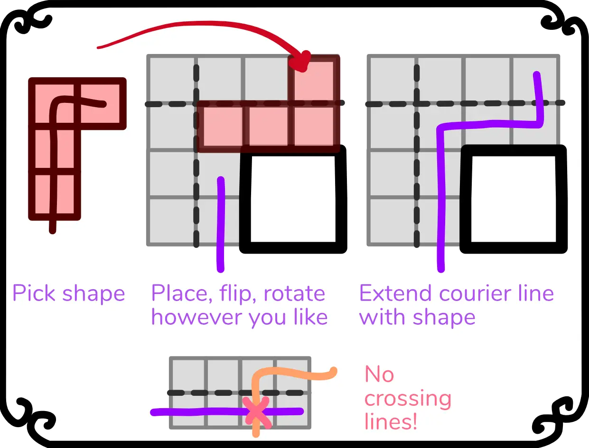
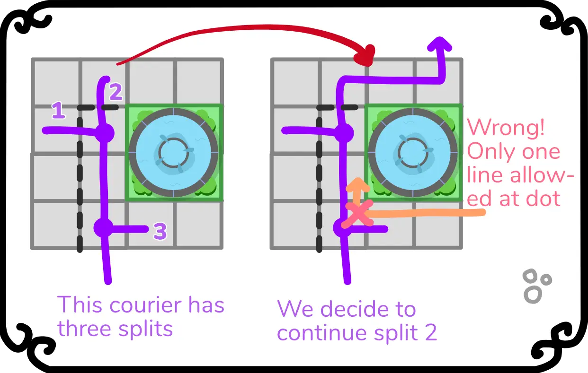

This is part 4 of the devlog for my game "One Pizza the Puzzle".

{}

What did I end up changing?
---------------------------

I rewrote the rules to focus on the concept of having pizza couriers,
because that simplified explanation a lot. It was also suggested by
several players, because they kept being confused by the fact that
"moving" applied to all your couriers, but "eating" was only a single
action, always.

The first sentence of the rules explanation is now:

\> "You start with one courier. Each turn, you execute one action for
each of your couriers."

This action can be either *moving* or *eating*. This is intuitive,
simple to explain, *and* it makes the "Eat" action as valuable as
moving. (Because, if you have 2 couriers, you can now also eat twice
that turn if you want.)

In the end, I didn't like adding an "exception" that says: "only two
players may run their couriers parallel". It feels ... clunky and an
unnecessary addition to the game.

Instead, I tried to rewrite the special actions of all ingredients to
*automatically* stop players running parallel each other.

For example, I toyed with the idea of "gates" or "fences". You place a
fence *behind* your current courier, and from that moment on, *nobody*
can go through it anymore. This clearly blocks opponents.

Gates are more nuanced versions of that. At the moment of writing, I've
invented two:

-   A "line gate". They only allow *one line* to go through. (So once a
    single player has crossed it, nobody else may cross it, not even on
    the other side of the road.)

-   An "ingredient gate". You can only pass through this gate if you
    have the corresponding ingredient, or pay 1 money. This means you're
    not 100% blocked, but there's still a price to pay and you must have
    a good strategy to get where you want.

I'm still not sure if these are already on the randomly generated board,
or if they are drawn by players as a special action.

That's the direction I've taken the game. It should be a short,
fast-paced, very interactive/competitive game, that's also really easy
to teach and play. Bringing everything down to two possible actions per
courier, and no exceptions/special rules/whatever, feels like the way to
go.

(Besides, the "Eat" action is extremely simple. The rulebook has only
two lines for that: "Eat an ingredient you own. Cross it out and execute
its special action -- see appendix A. Ingredients")

This game should not be a highly strategical game that takes more than
an hour to play and is mostly about following your own pizza courier
without outside influence. (Which is what some of my test games turned
out to be, and although it was fine, everyone felt the game should be
shorter and could be better.)

Playtest Session \#3
--------------------

To my pleasant surprise, I was able to get in more playtests just after
completely updating the rules!

This was another **major update** to the rules I made: you can't move 3
steps any way you like anymore. Instead, a set of shapes appear on the
board, and you must **move according to one of those shapes**. See the
image:

Why did I do this? As I said before, moving 3 steps each turn is quite
repetitive. Perhaps ironically, because there are so many options (you
can take three steps *any way you like*), players get overwhelmed and
take the same option each time.

This problem is made worse by the fact that you need to follow the
traffic rules. Whilst playing the game, you're constantly thinking
"wait, is this the correct direction?" and it feels more like a chore to
follow those rules.

So, I scrapped all of that. No need to follow traffic, just pick *one
shape* from the list and add it to your line. These shapes are randomly
picked from a long list (about 20 shapes) and printed on the board. This
makes each game different, but also means you don't have to look up the
shapes in the rulebook -- they're right there on the board!

**So, how did it go?** It went well! Rules were much simpler to explain,
we got to play quite quickly, and the game was shorter than previous
test games. (One player remarked: "huh, feels like this game was
slightly easier to understand/play than your previous game(s)")

Players were also quite enthusiastic: they really tried to get certain
ingredients and think about where their courier should go. (Some even
started to roleplay actually running a pizza restaurant, which I always
encourage! More engagement and story is always better in a game.)

Still, some issues remained.

**Issue \#1:** Now it's a little *too* easy to get more couriers. Just
get a champion, eat it (and take the penalty), and repeat. At one point,
I had 5 couriers, and I completely overpowered my opponents. At the same
time, it became harder and harder to keep track of *where* all my
couriers were.

**Solution?** There are several options:

-   Just *remove* the champion action -- you only get more couriers by
    delivering pizzas.

-   Make the penalty much harsher. But in that case, the champion
    ingredient becomes a bit weak.

-   Create some *other* simple mechanic that regulates how many couriers
    you have. Maybe there's a fixed maximum that you need to increase,
    or you need to pay "upkeep" for each courier, just *something
    simple* that automatically limits it.

I'm actually leaning towards the first option, as it's the simplest, and
it frees up that ingredient to use for a *different* interesting action.

Additionally, as I'll explain in a moment, *splitting* your line has
become a quite important element of the game. That's basically a more
interesting version of having many different pizza couriers, so I want
to focus on *that* mechanic instead.

**Issue \#2:** there are two elements in this game that are necessary
(for balance and general gameplay), but also make the board more
cluttered and chaotic. These are:

-   Players running their couriers parallel to each other.

-   Players splitting their courier line in two.

Because of the "shapes" movement, it's already much more likely that you
*block* other players and prevent this situation. Still, it can and will
happen.

**Solution?** Well, let's try to solve two birds with one stone! If we
could somehow *prevent players from running parallel* near places where
*a courier has been split*, it would solve both problems in one go.

I need to explain the idea of "splitting" anyway in the rules, so it
wouldn't be too bad to introduce an extra minor rule there: when you
split a line, write a dot on the square/split point. *There may only be
ONE LINE in a square with a dot*.

This means that a square with a split can *never* become messy (because
nothing else is allowed in the square). It also means you can
strategically split your line to block other players, and splits are
more visible (because there is a big fat dot indicating them)

**Issue \#3:** I need to be careful with *which* shapes I choose to
include. For the test games, I quickly drew a random set of 5 shapes on
the paper. After a while, only 2 or 3 of them were actually being used,
because there wasn't a clear use for the others.

**Solution?** Well, maybe I should categorize the shapes ("straight",
"box", "corner", "exotic") and include one from each category. Should
solve it.

Let's implement all of that and see where we stand!

*Until I can test again, let's already polish the game and work on
expansions!*

This devlog continues at part 5, which explains the expansions.