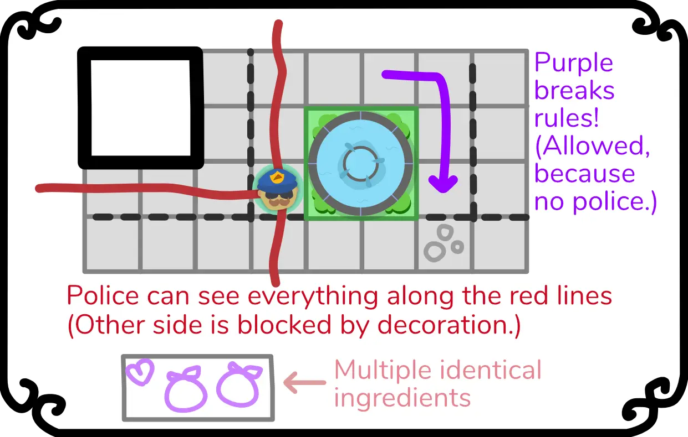
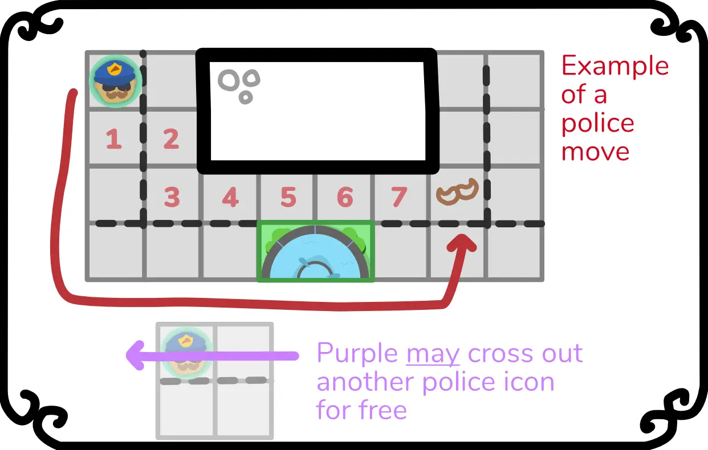
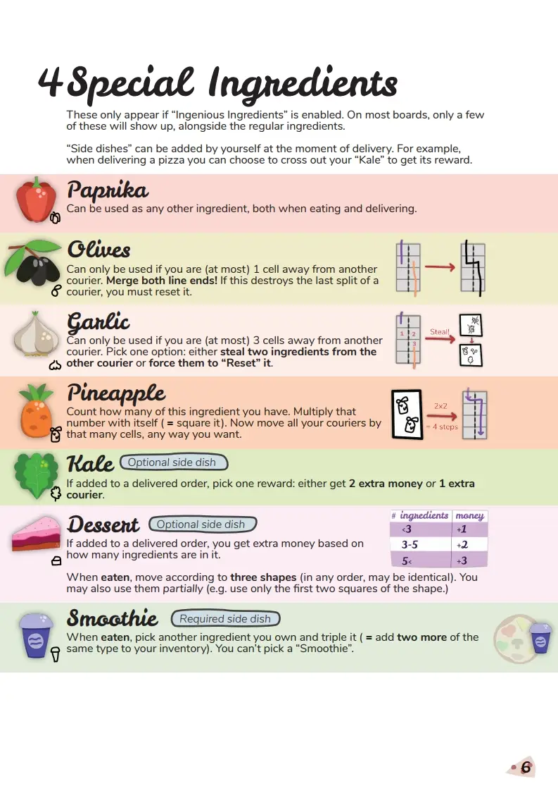

Welcome to part 5 of the devlog for my game "One Pizza the Puzzle".

{}

Expansions
----------

As usual, when I wrote the base rules for the game, I kept inventing new
mechanics and ideas that I wanted in the game. Unless they are *clearly*
much better than the rules for the base game, I move them to a section
"Ideas for Expansions" by default.

These ideas mainly fell into four categories:

-   **Ingredients:** more ingredients that do cool stuff. (Although I
    don't have room for them on a pizza, so these would act more like a
    "chameleon" and could be stand-ins for any other ingredients.)

-   **Special Buildings:** more buildings and locations on the map that
    do something special when you're *on* or *around* them. For example,
    maybe there is a small market where you can *trade* any ingredient
    for another one.

-   **Pizza Police:** add traffic signs into the game (like one-way
    routes), but compensate this by allowing players to *break* traffic
    rules. However, if you break the law with the **pizza** **police
    watching**, you are in trouble! (I don't know yet how that works, or
    how the police moves/operates, but this is the main idea.)

-   **Extensions to the core gameplay:** simple rules or mechanics that
    *change* or *expand* one of the core mechanics. For example, here I
    could re-introduce the fact that the *first* player to deliver a
    pizza gets a *tip*.

It felt like the Pizza Police was the most impactful expansion, which is
why I wanted to start there. There wasn't a concept of "breaking traffic
laws" anymore at this point, though, so I had to bring that back for
this expansion.

(As I create more of these games, I keep wondering whether the word
*expansion* is even a good fit. These are more like add-ons, or
upgrades, or higher difficulty levels which you often see in video
games. An "expansion" feels more suitable for something that adds like
twenty new components and a whole extra game board. Something bigger.)

Pizza Police
------------

Breaking traffic laws has many consequences. Both in real life, and in
my pizza game.

Why? For example, without those laws you can just turn around 180
degrees on the same road. This means you can *zigzag* back-and-forth
around an ingredient building to just get *infinite ingredients!*
(Within a few turns, you can have like 10 tomatoes.)

It also means you can go *against* the usual direction, or become much
more *aggressive* when cutting off other players.

Therefore, whatever rule I invent for the pizza police, needs to make
sure the board stays *readable*, there are *no exploits*, and there is a
way to (strategically) *counter the aggressiveness.*

Here are the images from the final rulebook for extra clarity, below
I'll explain everything in detail.

**Readability**: at first, I wanted to make police identical to
couriers, in the sense that they also move along a line that you cannot
cross. This didn't work. There are already many lines on the board and
it would be hard to retrace whether a line came from the police or
another player.

The most logical solution, of course, was to make police lines
*different* (dotted, curvy, zigzag, whatever). In practice, however,
this was hard to discern as well. (Most players have trouble drawing
straight lines as it is, so they might accidentally draw a police line.)

All of these solutions were just ... messy and convoluted, which is why
I eventually decided to pick the simplest option: police are represented
by **icons** at a specific location. To move them, simply write their
icon at a location **at most X steps away**. No line needed, just
teleport the thing. (As of right now, 8 steps of movement seems like a
good amount, but that will need playtesting.)

**No exploits**: I added an extra rule to this expansion. "You may only
possess one ingredient of each type." I like these kinds of rules. They
solve the issue of "collecting infinite ingredients", whilst adding an
extra layer of strategy, because you need to plan *when* you collect
specific ingredients. That's a win-win! (I still need to see if it
actually works and is fun to play, though.)

**Counter the aggressiveness**: if I allow players to *move* the police,
they can *protect themselves*. ("Oh no, that player might cut me off and
ruin my plans, let's move the police here so they can't do that
anymore!)

Whilst writing the rules, I also realized that it would be useful if
players could *remove* the police. I don't like creating an extra action
or ingredient for this. Why? Because the action isn't *that* powerful
(so eating one of your ingredients feels like a waste) and because I
don't want players to be able to remove police *whenever they want*.

If somebody places police to foil your plans, and you can just be like
"oh well, guess I'll immediately remove the police", then the whole
mechanic doesn't work.

Eventually, I came up with the following: "whenever you pass over a
police icon with your courier, you *may* remove a *different* police
icon for free"

This is easy to learn and use, but also creates strategy: if you want to
break traffic rules, you need to stay away from police ... but also
close enough that you can *remove* other police icons if needed.

Special Ingredients I
---------------------

I decided to work on the "ingredients" expansion next, because it felt
the simplest. Just draw some more ingredients, invent cool actions for
them, and make them appear on the board.

Unfortunately, it wasn't that simple.

My brain is really good at coming up with ideas, which is both a
blessing and a curse, because it also means that even the simplest ideas
can blow up into something much bigger and harder to figure out.

Eventually, I saw three types of ingredients:

-   **Chameleons**: can be a substitute for regular ingredients, or
    somehow make it easier to get them.

-   **Superheroes**: are useless when it comes to baking a pizza, but
    have a really powerful action associated with them

-   **Side dishes**: can be served *on top of* a regular pizza for a
    certain bonus. These can be optional or required (in which case they
    appear next to the pizza icon on the board).

Because I wanted at least two of each type, this expansion ultimately
received 7 more ingredients.

The chameleons are the easiest: just make them appear on the board, and
players can figure out themselves (during the game) how they want to use
them.

After that, the side dishes were also relatively easy to implement. It's
quite intuitive that adding extra sauce (or a nice dessert) to a pizza
order will earn you more money. (The most difficult part was adding
these icons to the game board, because it was already quite full.)

The superheroes, however, took some time to figure out. In my notes, I
wrote the following ideas:

-   "I want something that allows you to *save* or *delay* turns."
    (Because of all the same reasons I mentioned in the paragraphs about
    Timing before.)

-   "I want something that can *definitely* cut off another player."
    (Because you have to extend your current line, you can never 100%
    cut off a part of the board. Other players can simply take a detour
    and then *follow your line* until they get where they want.)

Special Ingredients II
----------------------

After sleeping on it, I woke up the next day with the ultimate solution
to the second problem: **line merging**. If you stand in the same cell
as someone else, or an adjacent cell, you may *merge the lines into one*
(by connecting the endpoints).

Both players must reset their courier to the start, because, well, they
can't extend their line anymore. (Although they suffer no extra penalty
for this.)

This allows you to immediately *end* another player's courier, whilst
also creating a line that you can't move along, because it's connected
all the way through.

The first problem is still a work in progress. I'm thinking about an
ingredient that *multiplies with itself*. Let's say the ingredient is
... lettuce. If you have 1 Lettuce, you may eat it to take 1 action
(which is useless). But if you have 2 lettuces, you may take 2x2 = 4
actions in a row (really powerful!) If you have 3, you may take 3x3 = 9
actions, and so on.

It has a nice risk/reward balance, because you need to collect multiple
lettuces over time to get a huge benefit. The problem is that this
quickly becomes *too* powerful, so I'm still thinking about this.

**I'm done with thinking!** (About this expansion, not in general.)

In the last few playtests, I said that it was too easy (and too
powerful) to get new couriers. As I was solving some other problems, I
saw the focus of the game shift more towards "line splitting". That's
when you send a courier in two different directions. This can happen by
eating the Broccoli ingredient, but there are also movement shapes that
have a split directly inside of them.

As such, the "Superhero" ingredients ended up as a way to *punish*
players if they split their line too often. For example, this is the
"Garlic" action:

**\> If another courier is (at most) 3 cells away, you may steal 2
ingredients from them.**

If you split your line a lot, you have many open-ended paths all over
the board. This increases the probability that someone is 3 cells away
from an endpoint on your line, allowing them to use this Garlic action!

The "Side dish" ingredients also became slightly more complex. It was
boring to have an ingredient that "always adds X money when delivered
with an order", because there was no strategy there. It was *always*
better to have it, and you were *sure* about the reward.

Instead, the three side dishes now do slightly different things:

-   **Kale:** when delivered with an order, pick one reward: either get
    2 money or an extra courier. (The simplest one, but at least you get
    some strategy here.)

-   **Dessert:** when delivered with an order, the *reward* depends on
    how many ingredients are in your pizza! So, preferably, you'd add a
    dessert to a *large* pizza ... but that also brings a great risk
    with it, as it's much harder to deliver those.

-   **Smoothie:** these are required, which means they automatically
    show up on the board and you *must* add them to a specific pizza.
    However, they also have a very strong "Eat" action (duplicate one of
    your ingredients for free), giving players a hard decision: use it
    for that pizza, or use it for its action?

Below is the final list of ingredients in this expansion.

This devlog continues at part 6, with even _more_ talk about expansions!