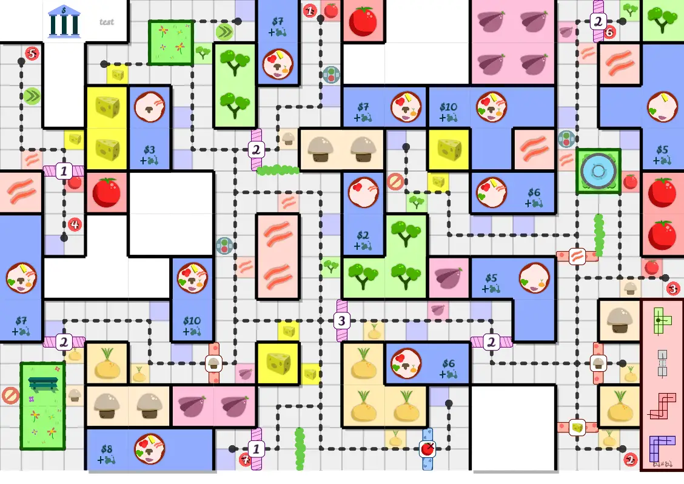
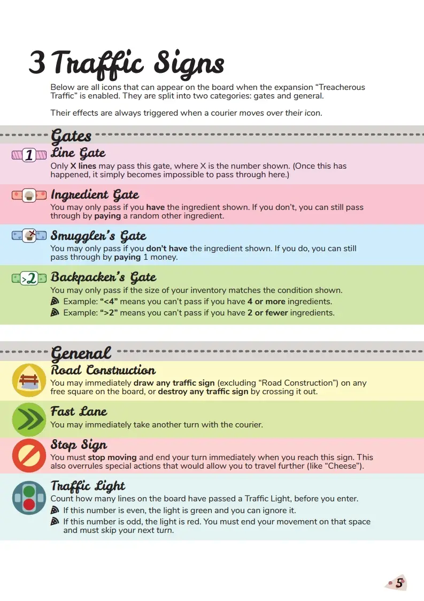
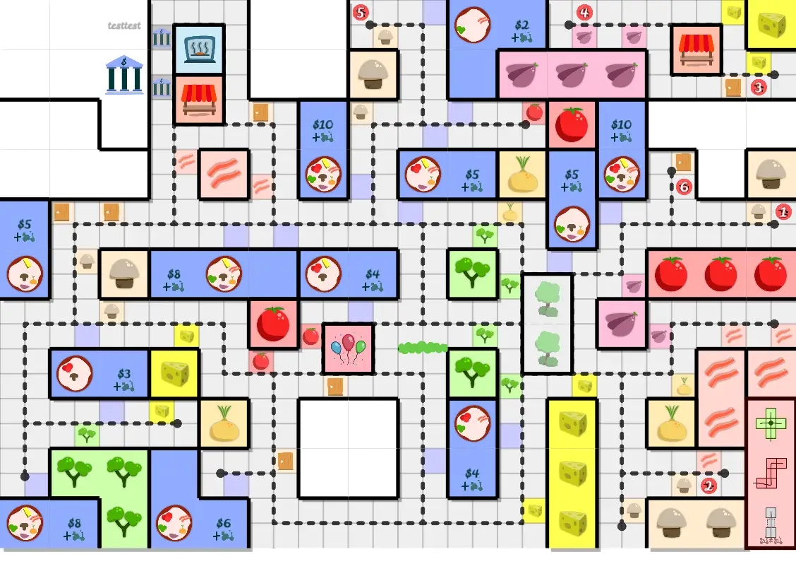
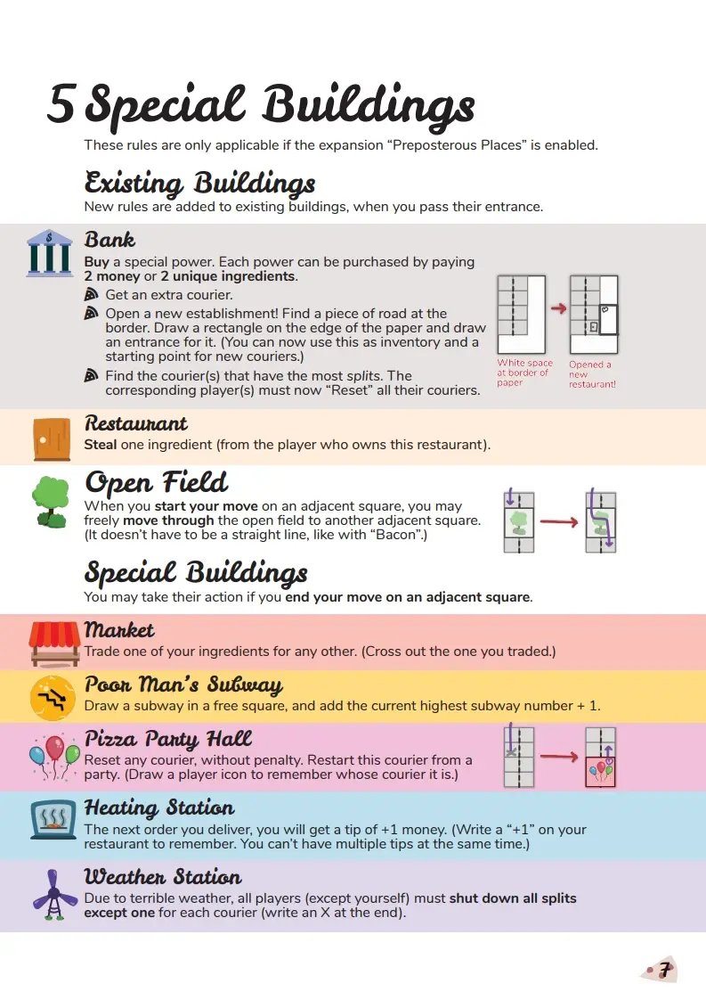

Welcome to part 6 of the devlog for my game "One Pizza the Puzzle".

{}

Traffic Signs
-------------

At first, I wanted to include these elements in the Pizza Police
expansion. However, there was no *need* to do this. It would just make
that expansion more complicated. So I split it into two.

Additionally, the category of mechanics that "change something about the
core rules of the game" couldn't stand on its own as an expansion. It
would just be a strange mix of rule changes.

As such, I threw all those ideas into this expansion and the last one
("Special Buildings"), as a sort of cherry on top.

**This expansion, my idea for "gates" or "fences" is fully
implemented!** 

There are four types on the board:

-   **Line Gate:** has a number on it. At most that many lines ( =
    couriers) may cross it.

-   **Ingredient Gate:** has an ingredient on it. You may only cross if
    you *have* it.

-   **Smuggler's Gate:** has an ingredient on it and an X-mark. You may
    only cross if you *don't have* it.

-   **Backpacker's Gate:** has a condition on it, like "\<4" or "\>2".
    You may only cross if the size of your inventory matches the
    condition. (For example, "\<4" means you can only have at most 3
    ingredients on your restaurant.)

These make the game a lot harder, but also more interesting. You can't
just move anywhere anymore. Routes need to be planned, and you can block
other players in the future if you're smart.

(For example, a Line Gate has the number 2. You can go through it, and
then (on purpose) go through it again, to make sure nobody else can ever
pass it anymore. Takes you perhaps one or two more turns, but can cut
off other players from a whole section of the board.)

On top of that, I added regular **traffic signs** on the squares
themselves. They are relatively mild: stop your turn immediately, take
another turn, etc.

I thought about how to make them more wild and powerful, but ultimately
decided against it. When moving, you were highly likely to cross a
traffic sign. If their action was too complicated, or there were too
many on the field, the game would just become a convoluted mess.

At the time of writing, this is the overview of traffic signs:

*Remark*: this is the only expansion that doesn't really punish you for
having many splits or couriers. I was fine with that, as the whole
purpose of the *gates* was to limit unthoughtful movement.

Special Buildings
-----------------

The last expansion! (Which was in fact the first ever expansion I made
up when I developed the game, so I don't know how it became the last
one.)

When creating One Paper Games, you're running low on *space* ... all the
time. (You only have a single A4 paper to accommodate the whole game!)

Instead of adding *extra* buildings, I decided to **repurpose** existing
buildings and decorations.

For example, each board (no matter what player count or expansion) has a
**bank** and **player restaurants**. This expansion adds *entrances* to
both of them and gives them a special action.

-   At the bank, you can *buy* powers for money or ingredients. (For
    example, you can buy a new courier here for quite some money.)

-   At restaurants, you can *steal* an ingredient from the player who
    owns that restaurant.

Additionally, most boards have bits of **decoration** strewn between the
buildings. A fountain here, a park there, a hedge there.

In this expansion, I raise the probability of these decorations
appearing ... and then *replace* each of them with special buildings.

From the start of the game I wanted to include a sort of "plaza" or
"open field", so that's the first thing I made! When you start your turn
adjacent to one of these, you may move *across* the open field any way
you like. Extremely useful for getting out of tight situations, or
simply getting somewhere that would otherwise be unreachable.

After that, I saw I had room for 5 more building types (both in the
rulebook and on the board).

**Important remark:** yes, I always develop the rulebook side-by-side
with the board and the actual game. Because, if I invent a cool mechanic
but it takes *a lot of space* (or images) to explain ... it's probably
too difficult. I try to keep expansion rules on *a single page*, and
base game rules on *at most three pages*.

Using this method has really helped me simplify and streamline my games.
Before, I just wrote down all the rules and ideas in a Word document,
not caring about lay-out, page count or examples. That's how you invent
games that, as it turns out, need 10+ pages to be explained, and most
people aren't up for that.

Anyway, for these buildings I just looked at my notes of "possible
issues" and tried to give simple actions to combat them:

-   The market allows you to **trade** ingredients. (So you can get
    something in your inventory that is otherwise way out of reach.)

-   The **poor man's subway** allows you to add an extra subway to the
    board.

-   The **pizza party hall** allows you to (re)start a courier *from a
    party hall*. (This is more useful than you think. It's basically a
    subway, but you can go to a greater variety of places, and you have
    more certainty because your line is *connected* to the hall.)

-   The **heating station** gives you a +1 tip bonus on your next
    delivery. (Because you managed to keep the pizza warm!)

-   The **weather station** forces all players to **shut down all splits
    except one**, due to bad weather. You guessed it: this is the action
    from this expansion that discourages splitting your courier way too
    often.

This is the current version of the rulebook for this expansion:

This devlog continues at the (final) part 7, with the last rounds of playtesting, issue fixing, and closing comments. See you there!