Welcome to my devlog for the game [Photomone: Antsassins](/photomone-games/draw/photomone-antsassins). As expected, it's part of the [Photomone Games](/photomone-games/) project.

While developing that game, I invented some "expansions", that quickly turned into completely separate ideas that should just be separate games. This was the first of them.

## What's the idea?

The original Photomone gives you a random map of _points_. During the game, you have to communicate secret words by drawing. The twist? You can only draw using straight lines between the points. (And more: different words give you a different number of lines, some points do special stuff when you use them, etcetera.)

When I tested the (very) first version of this game myself, I looked at the final paper and thought: "huh, now I have a paper filled with random shapes that look _kinda_ like something"

What if we turn the game around?

* You start with random shapes (drawn with straight lines between points)
* You have to say a _word_ and your team members must guess which shape it refers to

It becomes very similar to the popular "Codenames". 

* Create two teams at the start. One player of each team is the "coder", the others are "guessers"
* The coders get a card/image that shows which shapes belong to team 1 and which to team 2
* The coder must say a word, and then the guessers must pick out the shape they mean.

I, also, knew quite quickly that it should work ... if I could solve a few issues.

## Issues

### Issue 1: the random shapes

How do we get random shapes? Ones that look like _something_, but aren't clearly a certain object. (Also, I don't want to draw hundreds of shapes myself, so I really want this to be 100% computer-generated.)

The only solution would be a **simple algorithm** to draw random shapes between the points. Something that draws random lines, but has a slight preference for "going back home".

Even if we have that, how do we refer to them? Do we give a _number_ to each shape? Can they _overlap_, making this even harder? 

Labeling them with _names_ is clearer (and less abstract). But those names can be abused to make the guessing easier, so I'm afraid they _have_ to be numbered.

### Issue 2: the "code card"

The code card should say to which team a shape belongs.

However, if we just write a bunch of numbers, that is _very_ unfriendly to the players. They have to read their numbers, then look at the map, _find the shape with that number_, and repeat that process the whole game.

No, the code card has to be a mirror of the board itself.

* It shows the same shapes in the exact same layout
* Those that belong to team 1 are clearly one color (say blue)
* Those that belong to team 2 are clearly another color (say red)

But, if that's the case, then both the **board** and its **code card(s)** must be generated at the same time.

As such, we'd need a system to generate one PDF with ...

* Multiple boards (the full page)
* And one page with a lot of code cards (which belong to those boards)

### Issue 3: marking shapes as yours

When a team guesses a shape, its true color must be revealed. Was it indeed from your team, or from the opponent's team? 

Well ... _how_ do we reveal that? How do we mark them? Writing on the board isn't great, because I want the game to be replayable. Download + print it once, play as much as you want.

But ... dang it, then we need **tokens**. Another page for the material PDF, with ants in different colors to mark the shapes. (Once guessed, place the right color somewhere on the shape.)

## When issues pile up ...

When an idea develops like this, I know from experience that I'm trying to fit a square peg into a round hole. I tried to simulate Codenames, but stuck too much to the original game of Photomone. (A paper with random dots and lines between them that create shapes.)

Once I let go of that, I could see what we really needed. A completely new approach. More deviation from the original Photomone.

The game Codenames uses a grid of _cards_. You place 5x5 cards with one word, randomly, at the start of a game. This is _great_. It means you only need a relatively small deck of word cards to make the game endlessly replayable. Because every time, you have a new arrangement of words and a new code card.

That's what we need. So here's the new idea:

* The material consists of _tiles_.
* A tile has dots and lines between them, like before.
* But those dots follow a regular pattern, which allows the tiles to be connected to each other in any way. A shape might start on tile A, then seamlessly cross over into a new set of lines in tile B.
* You're not guessing shapes, you're guessing **tiles**

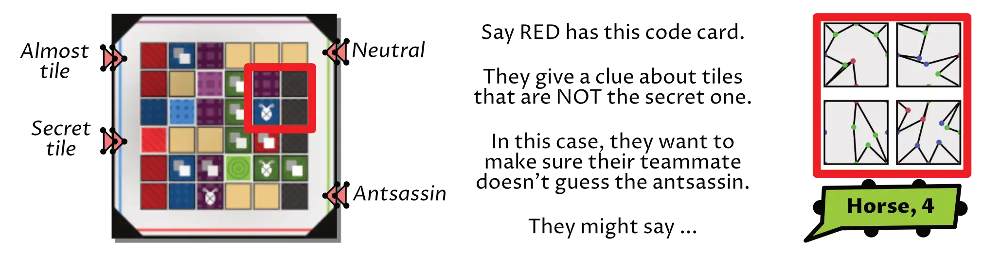

That last idea is crucial. At first, I thought the "tile system" was hopeless, because I had no control over whether shapes stayed within their own tile or not. Until I realized that rule: we don't have to guess shapes, we can guess _parts of shapes_.

So, the coder often has to say a word that relates to part of a shape, or only the left side of a shape.

This idea is _much_ better, or at least more "workable". You only need to download one PDF with a few pages of material.

* The tiles (two pages)
* Several random code cards (which simply assign the tiles to teams randomly) (one page)

Every time you play, the random order _and_ rotation of the tiles will create new shapes and a new game.

### Improving the idea further

You might notice that I didn't include those "tokens" in the material. Because we _can_ do without them now!

> When you guessed a tile, flip it face-down

This is fun for another reason: it _changes_ shapes as you play. That's a really unique aspect that clearly differentiates this game from Codenames. Over time, you might be able to use new descriptions to communicate your shapes---or old descriptions become _worse_, but the guessers don't know.

However, this doesn't mark to which _team_ the tile belongs. Is that important? I'm not sure. Let's think about a solution anyway.

I thought about _rotating_ tiles instead. 

* Each tile has two colored sides (blue for team 1, red for team 2)
* Once guessed, rotate the tile so the _correct_ team points towards the guessers

This would work fine. But it does limit us a lot: it means that, during setup, the tiles cannot be rotated like that, constraining the randomness.

Sigh ... let's bring back the tokens again.

### Using the tokens 

If we're going to include one page with tokens/chips, let's make sure we _really use them_. I wrote down several new ideas or expansions that would use those tokens.

The most important idea is that players can **change** the board! Because our grid is _regular_, I can create tokens that fit _exactly_ between two dots. Now players can place those tokens on the board to change shapes on the fly.

The other ideas are mostly about **protection**. For example, a token you can use once per game when you are _really_ unsure about a shape.

Why? What could happen? Well, this game is called **Antsassins** for a reason.

### The Antsassin

Another idea lifted from Codenames. Each code card has one "black" square: the Assassin. If guessed by accident, that team _instantly_ loses the game.

A great, great idea. Such a simple and intuitive rule, but it adds tension and strategy to the _whole_ game.

Obviously, I used it in my game as well. One of the tiles is the Antsassin. As such, some tokens _protect_ you against it, if used well.

## Let's make that

Now we have a solid idea! What do we need?

* A script that randomly generates the tiles.
* A script that randomly generates code cards
* A script that randomly generates tokens
* Finally, a script that combines the output of all that, and puts it in one nice PDF

## Creating tiles

Each tile has the same, consistent grid of points. The edges are always the same (so tiles fit together nicely, whatever their rotation). Inside, however, I want to allow removing some points. This will add variety and uniqueness to the shapes generated.

This got me thinking, though. The problem with a square grid, is that the _diagonal_ distance between points is different from the _straight_ (horizontal / vertical) distance. And I don't like that. 

For example, it'd mean I need to create two sets of tokens to "add a line" to the board. One for the short distance, one for the long one. It's just ... messy.

But I know a grid that doesn't have this issue. It's a **triangular** grid! A equilateral triangle has three sides of equal length. Build a grid from those, and the distance between all points is identical.

However, that would give us way too many tiles, so let's consolidate multiple triangles into an **hexagonal grid**.

The code, then, is straightforward.

* Place the points at equal distances.
* Perform some number of "random walks": you start at one point and keep walking to random neighbor points until you randomly decide you're done.

This, however, is too random. Let's "massage" this into something more controlled.

* Don't create a line that already exists.
* Don't create lines along the border of the tile. (Is harder to see and looks ugly.)
* Force the generation to at least create X lines that stay entirely within their tile. (They close themselves and don't visit an edge point.)
* Prefer going in the same direction over taking sudden sharp turns. (For all neighbors, calculate the angle. Compare it to our previous angle. The greater the difference, the less likely we are to pick that neighbor next.)

That last rule is just a general heuristic that creates nicer shapes. Without it, most shapes would look like the same random zigzags or scribbles from a toddler. With it, it prefers longer lines and curves.

### "Massaging" tiles much further

I underestimated how ugly random tiles would look this way. Or, rather, how unpredictable this system was, which means 50% of the tiles looked fine, and the other 50% looked completely unusable.

That's why I spent a lot of time adding more heuristics, checks and safeguards to help the generation.

First, it's about **forcing diversity**.

* I divided the tiles into sections. Each line starts in a different section.
* I alternate between "this line cannot use edge points" and "this line must start at the edge"
* If we just placed a very short line, place a long one. (And vice versa.)

Then I remove **ugly clashes**.

* Don't allow doubled lines or lines entirely across the edge (already mentioned)
* Don't allow more than 2 points of the walk to be on the edge. (Prevents ugly zigzags pushed against the edge.)
* Allow at most 3 connections on a point, and 1 intersection (with itself or another line).
* Even so, allowing intersections/reusing a point has a _low_ probability.

Yes, this forces the lines to stay nicely separated (mostly). But ... I realized I actually didn't like that.

You see, the best thing is for these tiles to contain _closed shapes_. Those are more recognizable than a few separated scribbles.

If one line encounters another line ... well, that's a great (organic) opportunity to _stop_ this random walk immediately. Because now the two lines are connected and form a bigger, more closed shape.

{}
Similarly, I actually _prefer_ STARTING a shape on a dot that's already used. Because it means multiple lines are connected, for sure, and can randomly turn into a bigger and more meaningful shape together.
{}

With that, we finally start getting tiles with shapes you _could_ describe. But it's still only a fraction of all the tiles.

{}
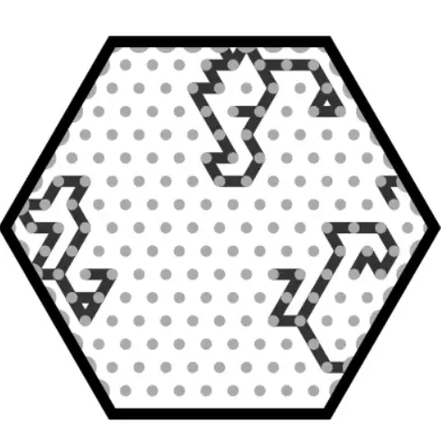
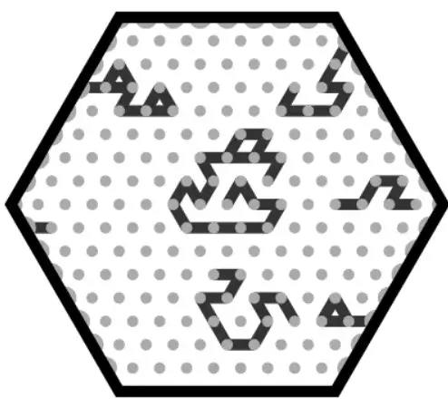
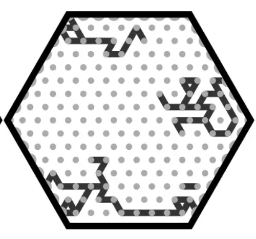
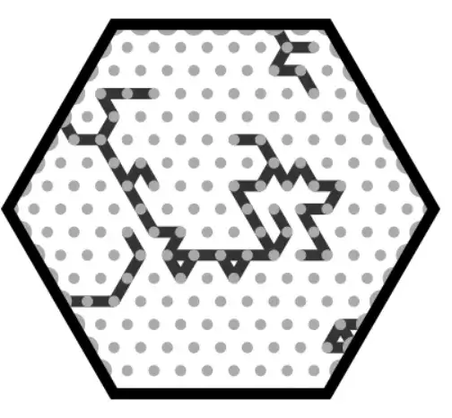
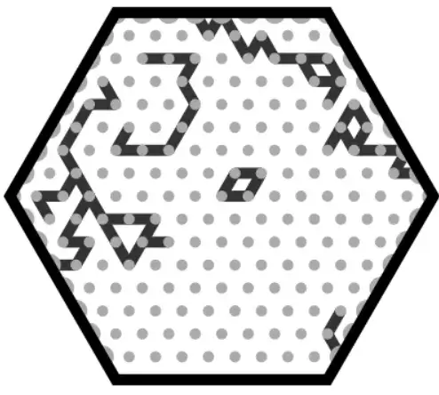
{}

### "Massaging" tiles much, much further

I also wrote code to _purposely_ close a shape. It picks such a random walk ~20% of the time. It calculates the angle back to its start (or earlier points) and _heavily favors_ points going in that direction, which means it ultimately rotates back. (Unless we're unlucky and it never reaches itself again.)

Finally, I added the step that most "procedural generation" needs: some **manual input and hand-picked results**.

* I told the system how to create a few basic shapes (triangle, trapezoid, pentagon, open circle, etcetera). Regularly, I just place such a basic shape, instead of doing a random walk.
* Once in a while, I only do one random walk. Then I simply _copy_ it to another part of the tile. (Perhaps rotated/mirrored/whatever.) => This repetition/symmetry is usually pleasing to the eye.
* I forced "inside" shapes (that can't use the edge anyway) more towards the center, away from the edge.
* I experimented with placing other elements. (Dots, things _between_ the lines, etcetera.)

{}
I also tried different resolutions. Both 4 and 8 work. (The sides of the hexagon are divided into 4 or 8 points, respectively.) The first one looks a bit cleaner, but obviously has very little space for actual shapes to develop. The second can make every tile look distinct, but also look more messy.
{}

### Is this enough to make it work?

Eh, it doesn't really change much. Disappointing. Let's quickly continue. (There's a loooot of devlog to go, with many different versions, scrapping old ideas and trying new ones.)

{}

{}

## Code cards

The hardest part was making these _look good_ :p

Because the code just does this:

* Create a list of all tiles
* Turn one into the assassin
* Assign X random tiles to team 1 (taking them out of that list)
* The remaining list belongs to team 2

And then we visualize that by coloring a set of hexagons on the card.

To make it look good, I ...

* Picked nice colors and margins, obviously
* Added a shadow/glow effect to the tiles
* Showed the starting team around the edges. (This is more for decoration than functionality. Just showing the starting team _once_ would be enough. But showing it 4 times, and with both triangles and a line, just makes the card look more polished.)
* Used a _pattern_ to fill the tiles. (This also helps read them more easily, especially for colorblind players.)

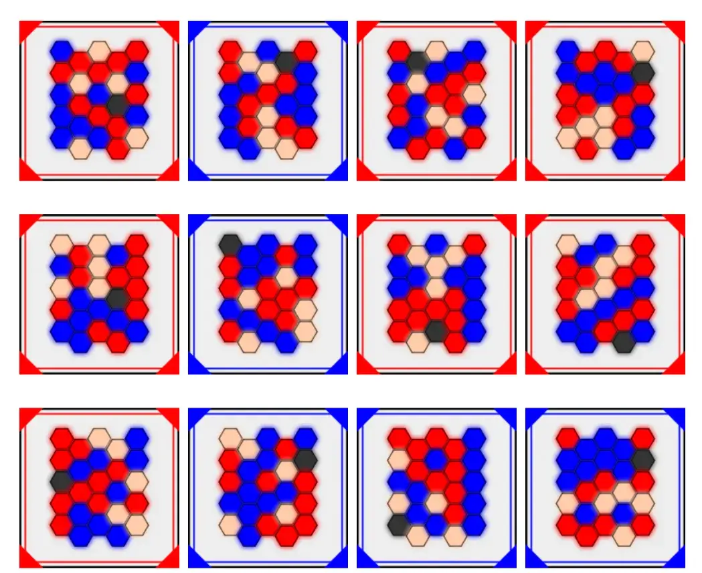

## Tokens

These don't have any "generation" or "randomness". I simply use the computer to generate them, because it's far easier and more flexible. (Especially combined with the other systems.)

I've drawn the token backgrounds in vector software. The code places the backgrounds in a grid, puts any other elements on top, and ta da---we have one page of tokens to cut and use.

### The "add" (and "erase")

The biggest obstacle was my "erase" (and "add") token. My plan was to make it the exact same size as the distance between points (on tiles). This way, you can literally place it on the board to change the lines.

But ... that just wasn't great. It would mean that ... 

* The token shape was odd (all tokens are round, but these are rectangular??)
* I had to do loads of magic ( = complex calculations) to _ensure_ these tokens were the exact same length as the tiles you printed. Even then, if you wanted to play with a different shape/new material, the tokens might be wrong.
* The tokens would be very tiny and their impact minimal.

Instead, I realized the big circular shape was actually an _asset_. Instead of adding/removing one line, the token now simply _covers a whole area_ on the board. The "add" powerup adds _multiple lines in that area_. 

This makes the tokens consistent (in look and size), and the impact much more meaningful (and fun). In fact, with that change I can get many different "add" tokens! Because I can randomize the lines inside them during generation!

### Struggling to find good ideas

Besides that, I ...

* Struggled to invent really good tokens or special powers.
* Struggled to make these look any special. (I had no inspiration and no time to procrastinate, so the designs are pretty simple and standard. Good enough, but certainly nothing special.)

For example, a good token _seems_ to be: "rotate a tile". It allows you to change the board to look like something you can describe (more easily). This, however, contains an obvious cheat: when you take this action, simply always rotate _a tile from your team_. Easy! You've just communicated a tile for certain!

Actions like that only work if there's no way to pick your own tiles all the time. If I could fine some simple rule to prevent this, I'd have another ~5 tokens that should work.

A rule that accomplishes this, is ...

> Those tokens can only be used by _guessers_. (They don't know which tile is theirs, so they can just rotate a tile they think is unclear, or one that they _think_ their coder struggles with.)

Do I really want to limit half the tokens to guessers only? Then I realized that all my previous tokens were basically only for coders, so yes, this actually seems like a good balance :p (The "add" token is very useful to coders, as they can make tiles easier to describe. But it's almost useless to guessers, because what's the point of adding a line when you have no clue what tiles are yours?)

### Final look

And that's how the tokens ended up split into two categories: for use by coder or guesser only. I needed some way to show this _on the token_ (instead of only mentioning it in the rules, which nobody reads and everyone forgets). I opted for a simple **lock** (for the coder) and **question mark** (for the guessers), placed on the left and right edge.

The "add" token reuses the "random walk" code for creating the tiles. But because they are circles, they use a circular grid. (Which is actually easier than the others, because circles are simple and consistent :p)

Bringing it all together, the tokens looked like this.

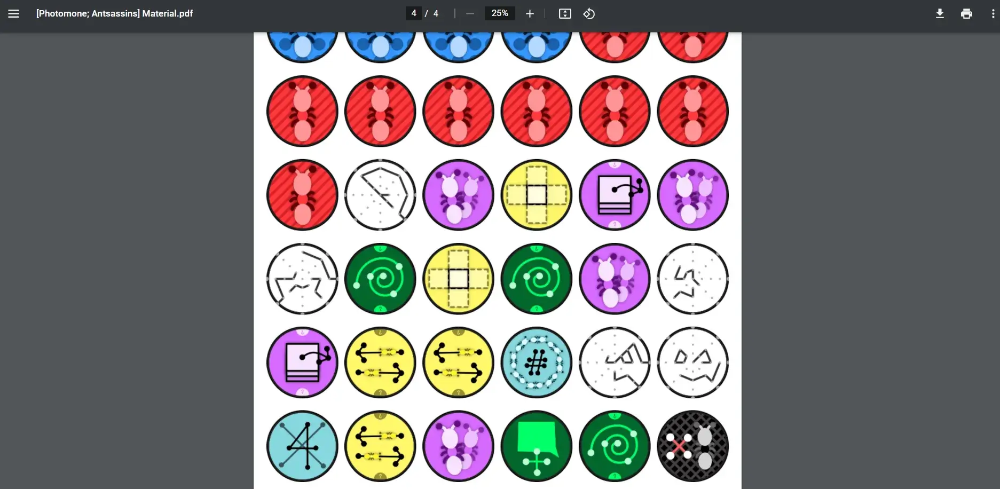

## Towards a finished game

By now, you might have the impression that I'd been working on this game for days or weeks. In reality, I rushed through the programming in a few short bursts here and there. (This wasn't my main project. Also, it's demotivating to get stuck on really hard problems, like the random tile generation.)

I knew I had to get a prototype as quickly as possible. I just couldn't figure out, purely in my head or by looking at a screen, if this game would even _work_ at all. I had to create the physical tiles, place them on a table, and see if I could connect words to the shapes.

As such, I think this is the quickest I've ever gone from "start of an idea" to "completely printed prototype". When I printed the game, I had _just_ finished the tiles, cards and tokens working the night before. (In fact, around 11 PM, I considered printing an unfinished version and just _drawing_ the missing pieces myself the next morning. That's how quickly I wanted a physical version.)

(The "massaging" of the tiles I explained in detail above, was far from done at this point, so I just printed the older, rough version of the tiles.)

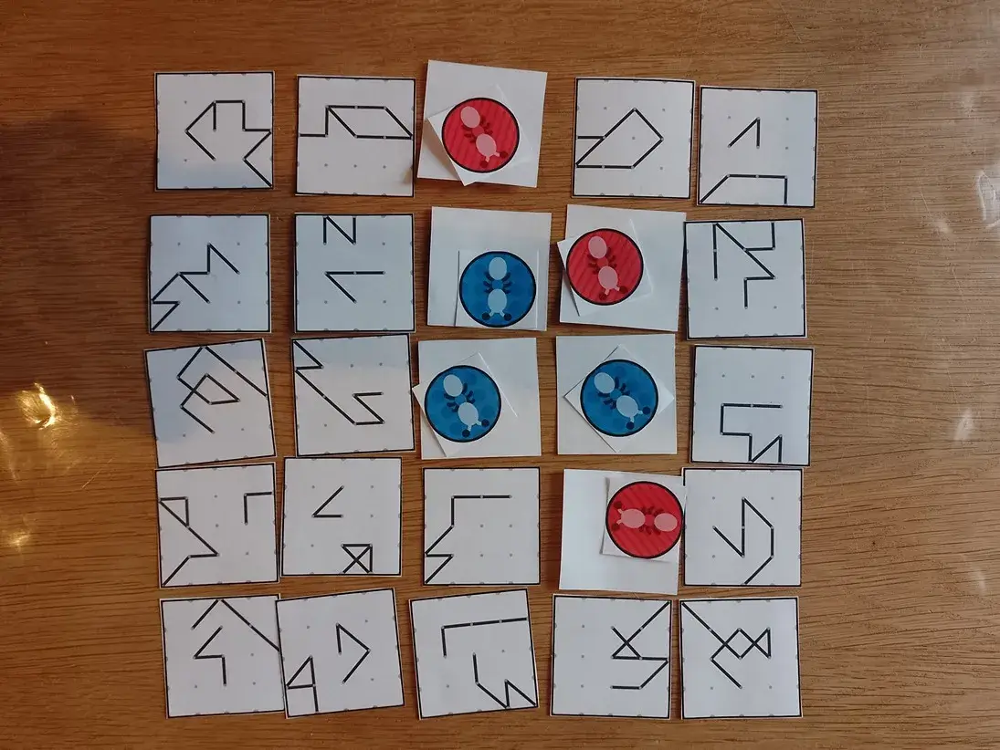
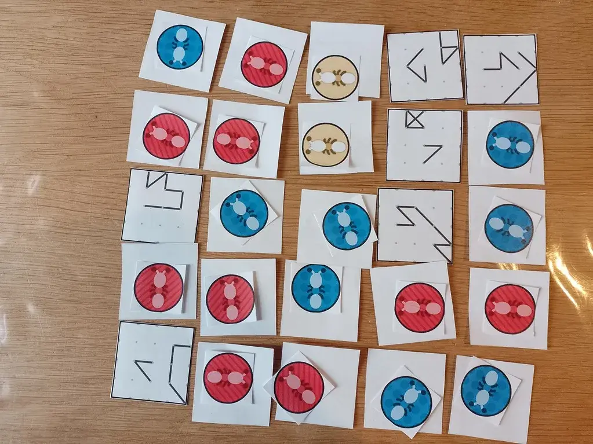

### The first tests

**How did this playtest go?** Bad, but very instructive :p

Yes, it's way too hard to see clear shapes---let alone combine them for your clue---with the current tiles and rules.

While testing, I often throw new rules in there (as I come up with solutions to problems) to immediately see if they work. This led to a long list of "let's try this to get more meaningful shapes" with issues.

* Each round, the coder picks one row/column and rotates tiles as they please. => Issue: just rotate your tiles only, and you've just communicated your tiles very easily!
* Okay, let's _force_ players to rotate _all_ of them. => Issue: the board changes way too much (leading to hints becoming useless the next round).
* During setup, try to make the tiles connect as much as possible => Issue: very vague, makes setup unnecessarily long/involved, and doesn't _really_ solve anything. (Yes, tiles are connected more, but if those tiles aren't yours ... who cares?)
* Okay, let's move it to the _guessers_ then. Each turn, _they_ point at two tiles, and the coder rotates those as they see fit. => Issue: high likelihood that guessers pick tiles that coder can't do anything with anyway. If they _do_ pick two good tiles, then it's obvious from the coder's eagerness to rotate them that they are from their team.

Near the end, we finally had some idea about what the game really needed.

* Tiles shouldn't clearly contain something _by themselves_. Because then tiles just become known as "the one that looks like a dog" or "the one that's a house", which is reused every game for easy (and boring) hints.
* The game is simply more aggressive/dynamic than Codenames. Yes, the board will change a lot, let's make that a clear _feature_ of the game.
* As such, changes should be drastic. Not "rotate these two tiles if you want", but "you must swap all tiles in a row or column of choice with new ones from the deck".

Often, one team would just have a few very hard tiles (with meaningless shapes on them), and soon they were behind so many points that they were never going to win. It felt like the power to make the board look "prettier" (or "more meaningful") should be in the hands of those _losing_.

Additionally, a bad turn feels ... bad in Codenames (and this game). The coder went through all this effort to create a great clue, and you guess _nothing correctly_? I wanted to turn this bad feeling into a more fun and interesting part of the game.

### The changes

This led to the biggest rule change.

> If a team scores nothing ( = no correct guess), they must change the board. The guessers pick a row or column. The coder either rotates all tiles in it, or swaps all tiles for new ones from the deck. (Tiles already revealed are ignored.)

It also made me look differently at the tiles.

* Maybe I stop focusing on making them look like _something_ by themselves.
* Instead, they have very simple straight lines. (Or lines with just 1 or 2 turns).
* One set of lines uses only the middle edge points. (To ensure they almost always connect with each other. It's annoying how often the current tiles don't precisely line up, even though there aren't that many options :p)
* Another set of lines (displayed differently, maybe gray or a dashed line) uses the other edge points. 
* The board has many of these small tiles, which _together_ will form different shapes, depending on what line you're following.

I think adding multiple sets of lines will allow tiles to mean _multiple things_, helping the game a lot. But by restricting each line to a fixed set of (edge) points, you're certain that they will (often) line up.

To finish it off, the code cards will be programmed to (heavily) favor connecting your squares into groups. Because the playtesting revealed that as (by far) the most fun and effective part of this game: communicating a group of 2-3 tiles because _together_ they looked like a dog, or a house, or whatever. And they were all yours!

## Version 2

### Smoothing & Polishing

Okay, I have good news and bad news.

I implemented the ideas above and realized I could get _four_ sets of lines out of it. (One uses only the middle edge points, one only the corners, and the other two use the points in between.)

That all worked nicely.

Then I realized that there was a much _easier_ way to make lines go from one edge to another, without the nasty zigzagging or uncertainty from random walks: **pathfinding**. I grabbed an old implementation of the A* algorithm (which I used for an older game), rewrote it into modern JavaScript so I could put it into my general Pandaqi Toolset, and used that. Now the paths are simply generated by ...

* Picking a start point on the edge
* Pick another end point on the edge
* Asking the pathfinder tool to generate the shortest path between them.
* But we lie about the shortest path: the "distance" between points is set to some random value (between 0 and 1), which means the path will curve and take detours going to its destination!

Then I thought: "this game looks very blocky and abstract, can't I _smooth_ the lines? Make them a bit more curvy?" I spend an hour researching and then implemented something called **Catmull-Rom Interpolation**. Which, surprisingly, worked first try and did make the game look much more inviting.

{}
I also wanted this because the straight lines created the same shapes over and over: triangles, beaks of birds, lightning bolts, fishes. By smoothing the lines, you get way more variety, and not everything looks like a bird anymore. 
{}

Then I made the different lines different colors and widths, and gave them a shadow, to make them really stand out from each other.

All of these things were _improvements_. But were they enough? No, I don't think so.

### Quicker testing

I didn't want to _print_ each new version to test it physically. (It's more work and feels like a waste of paper/ink.) But I needed a way to quickly see if you _could_ identify shapes or meaning behind the tiles.

So I spend a day developing a simple interactive interface.

It loads the randomly generated tiles into a grid. I can drag-and-drop tiles to swap places. I can rotate individual tiles, or the whole board. I can remove a tile (and replace it with a completely new tile from "the deck").

In other words, it allows me to modify the game at will, as if I were moving around physical tiles.

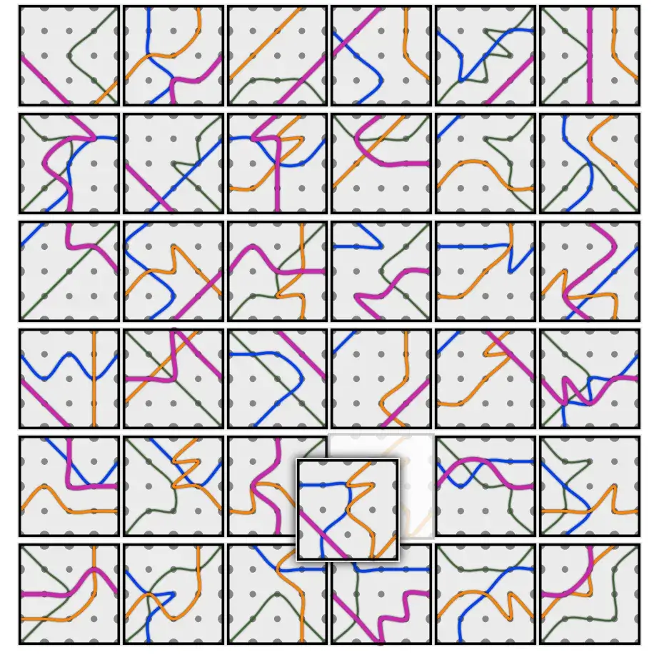

And in doing so ... I realized it was still too hard. Even when I had _total control_ over the board (modifying it as I pleased, as often as I wanted), it was near impossible to identify shapes and find words to "connect" multiple tiles. You _can_ do it. It sometimes _does_ produce fun and creative results. But not consistently enough---far from it---to make this a solid game.

### Last fixes

I did want to try some small ideas to improve it. Maybe I was _just_ short of greatness :p

* Shapes (like dots/circles) _between_ the lines.
* Something I called "hairs": one-off lines splitting off another line, to add more texture and variation.
* Lines running along the edge. (To immediately close off a shape on the same tile.)
* Lines stopping within the tile (instead of running edge to edge).
* Filled-in shapes (rectangles, semicircles, etcetera) attached to the side of lines.

Here's a summary of how I implemented each.

**Between the lines**: we know the distance between the points in the grid. (From, well, making that grid in the first place.) So place a dot at _half_ that distance, at fixed angles. (6 angles if hexagon/triangle, 4 if rectangle.)

**Hairs**: pick random points on the path and a random neighbor of theirs. If no line exists yet, save one going from point1 to point2.

**Edge Lines**: run the Pathfinder again, on the same start/end point, but now we pretend only the _edge_ points exist in this world.

**Half Lines**: I literally added a function `cutInHalf()` to the `RandomWalk` class, which just throws away the first or last half of the path.

**Filled-in Shapes**: by far the hardest to implement. Starting from any point, we need to find exactly the two (or three) other points needed to close the shape (triangle or rectangle). If I just say "move to a random neighbour", anything could happen.

To pick the right points, we check the grid position of the neighbors.

* For a triangle, each point needs distance 1 to the original point. (So |x-x1|+|y-y1| = 1)
* For a rectangle, the furthest point (the third one) has distance 2 to the original point.

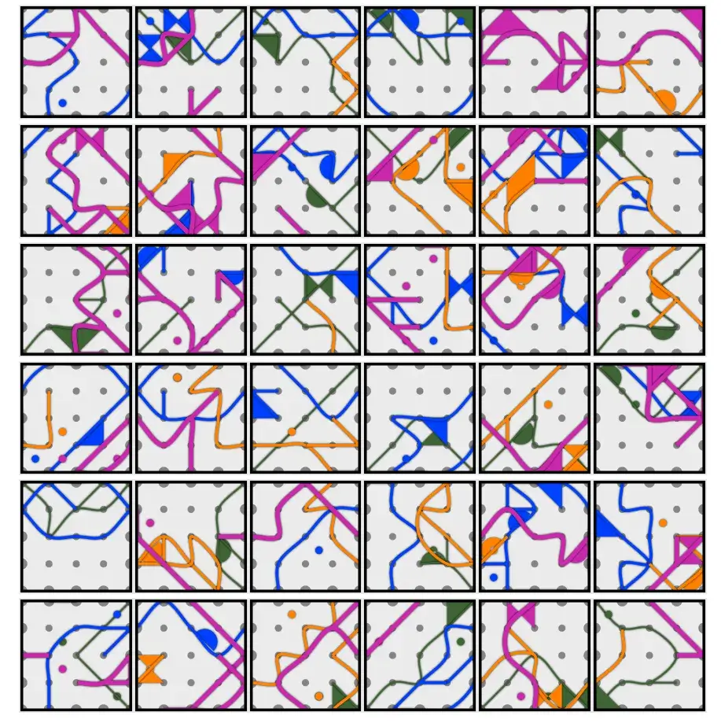

Yeah ... that's not much better. Sure, there are more unique shapes and you can see more varied objects into it. But it's _really_ messy, overwhelming, and just not good enough.

Let's try one last thing.

## Version 3

Making this game brought some philosophical discussions into my life about how people actually _see_ and _identify_ shapes. 

I reached the following conclusions.

* We're _really_ hardwired to see faces or living beings. No matter the tile design I used, all I (and others) would see were animals, faces, eyes, etcetera. (Especially once I added those _dots_.)
* How shapes are _filled in_ is more important (and easy to identify) than their outline. An outline---especially one that's mixed with other outlines---is just not enough. A circle-like shape will always just be a circle, but add something inside (a few extra lines, a filled in dot), and it suddenly becomes a sheep, a balloon, a face.
* As such, overlapping shapes doesn't work as well as I hoped. Because the inside of one shape, is part of another shape, and it all becomes a mess in front of our eyes. In the real world, barely anything is seethrough. (And we all know examples of people who missed that glass door and walked nose-first into it thinking it was open space :p)

After more research, more thinking, more testing, I was at the end of my wits and saw only one avenue left to try: turning the tiles into something more akin a **mosaic** or **stained glass**.

In other words,

* The whole tile is subdivided into simple shapes. 
* These shapes could be triangles, rectangles or circles. (Or all of these mixed.)
* Nothing "overlaps". It all follows the grid. (Although I can obviously make shapes occupy 2 or 3 spaces in the grid, instead of just 1.)
* In code, I divide these shapes into "groups". (Just like the code cards.)
* Then each "group" all receives the same color. (I'll probably reduce the number of colors from the previous version.)

I think this will at least be easier on the eye and prettier on the table. If it leads to identifiable shapes remains to be seen. I'll probably need finetuning and perhaps adding details _inside_ mosaic parts (at random), like dots for eyes or lines for hair.

Let's try it.

### The result

It is ... better? It looks less chaotic, and I can actually assemble some meaningful shapes. The hexagons look a little more organic and less "blocky" than rectangles.

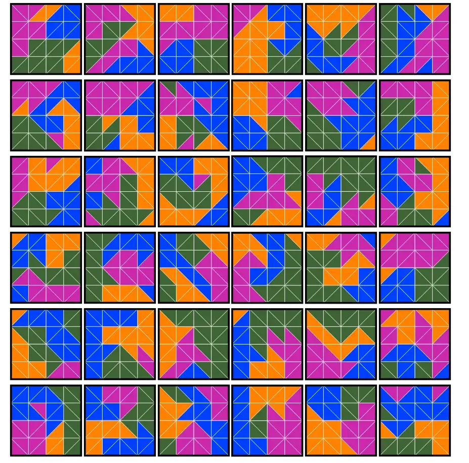

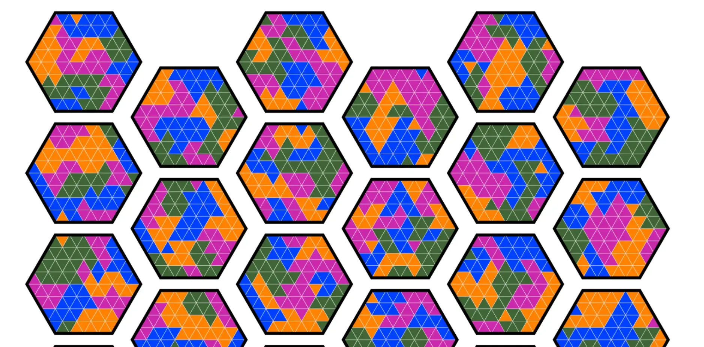

The colors are awful though: a mosaic like this would be better with a unified color scheme with only 2 or 3 soft colors. Slight variations, as if the mosaic is "weathered", would help too. (I left in the same colors as before, and now I've (re)learned that good colors for _lines_ isn't the same as good colors for _filled shapes_.)

Or two highly contrasting colors, so you get one clear foreground, and the rest is background. (And it's up to you whether you look for shapes in the "negative space" or not.)

Additionally, let's merge some triangles into bigger rectangles, or replace them with a circle.

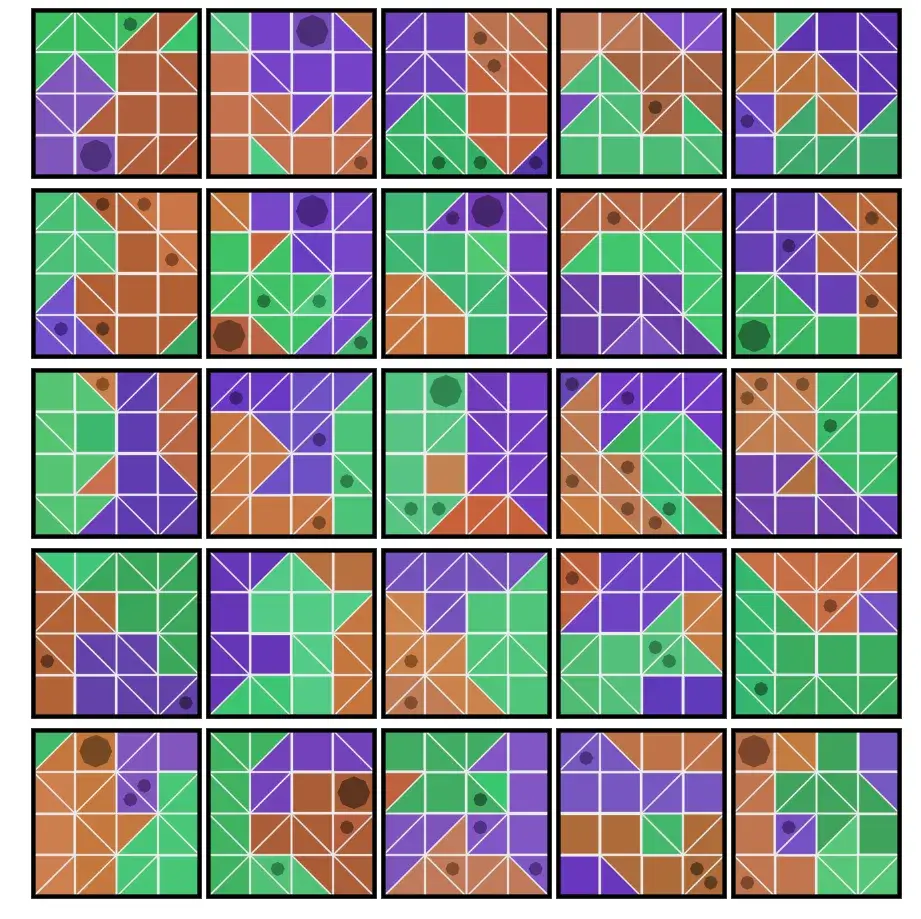

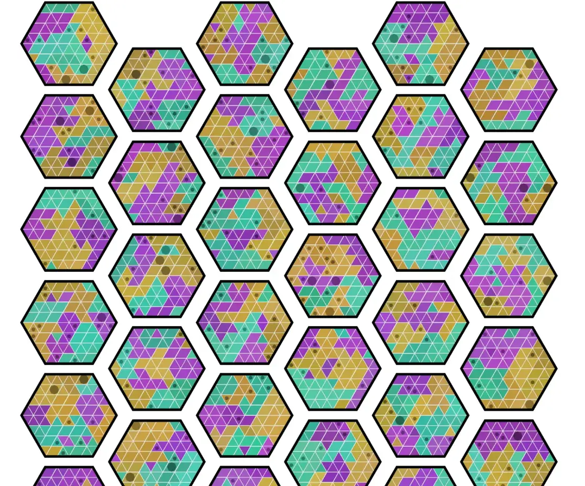

It's still not ideal. I'm not sure if this game idea is even feasible anymore :(

I have a few things left to try, otherwise I might have to settle for radically changing the idea. Probably removing the computer generation, hand crafting the tiles, and rewriting the rules to something else entirely. Let's hope it doesn't come to that.

### Voronoi Diagrams

I knew these existed and wanted to try them from the start of this project. The idea is as follows.

* So far, we've adhered to a grid. This added structure to the chaos, and made many coding steps easier.
* But there is a way to _randomly place points_ ( = create a random grid), and still be able to turn them into polygons you can work with. That algorithm is called Voronoi (which uses a Delauney triangulation)

I didn't write this myself: I used a library for it. I hoped this would remove the patterns and "blockiness" of earlier tiles, allowing more varied interpretations of what you see.

To make the change, I had to ...

* Mess up the grid after creating it :p After creating that perfect subgrid, all (non-edge) points are jerked around in random directions.
* I convert this into a simple array I can feed into that library
* What I get back uses the same algorithms to grow itself into groups
* And then we color the polygons that remain.

By controlling how much we "mess up" the grid, we control how chaotic or different the mosaic shapes become. (I noticed that a tiny value makes the tiles almost ... cute. The cells are a bit wonky, but mostly identical. Higher values create huge differences, which you'll see in the image below.)

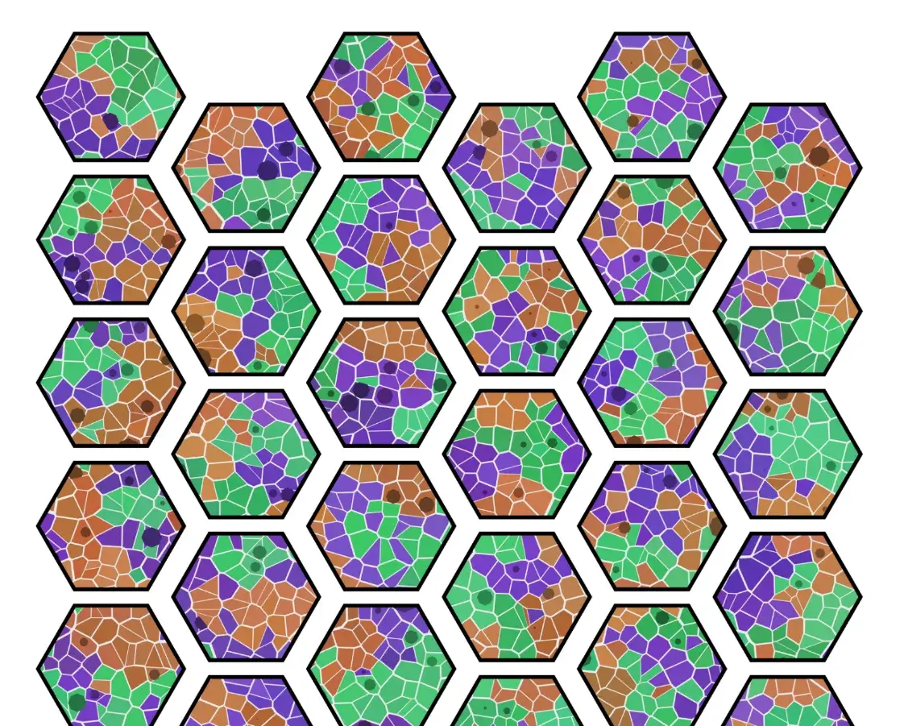

This might just work! The varying shapes make this _much_ prettier, more organic, and most of all: varied. In the screenshot above (the first one after I had this working), I can easily give names to certain shapes. 

I can see something like a foot (or kicking leg). I can see a hand, and a hand as a fist. I can see a chicken and a flower.

With finetuning and extra details, I think this could become the game. (Obviously, the circles aren't placed correctly yet, that code hadn't changed from the previous version.)

## Version 4

NOPE. I was wrong, again. This is much better than the previous versions, and it's _kinda_ playable, but that's not good enough. 

Whatever I try, I _cannot_ make a computer draw random shapes that look like something by just the right amount. I searched for the golden balance: you _can_ see a "bear" in this collection of shapes, but it's not obvious. I don't think it exists.

Which means we must pivot :p

I've basically programmed a generator that can create random semi-pretty shapes (in many different ways). It is _hard_ to describe the shapes---let's make that a necessary part for the game.

So far, the idea tried to mimic Codenames. You have to guess 8-10 tiles across the board to win. There are two teams (with one coder per team) and the fastest one wins.

If we _lower_ the number of tiles to guess, we can _allow_ it to be much harder. If you only have to guess 1 or 2 tiles, it's okay if it's really hard to describe that tile. The game transforms into a treasure hunt of sorts. You spend 30 minutes trying to find that _one_ tile that belongs to you.

Let's turn that into a new set of rules.

### The new rules

**Setup**: grab as many code cards as players. Pick exactly two code cards for each team color. Now give _everyone_ a code card.

Your codecard shows the "secret tiles" of your teammate ( = the other player with your color). It also adds grey tiles around it that mean "almost correct", and of course a few assassin squares (which are further away).

**Gameplay**:  On your turn, 

* Give your teammate a one-word clue about those secret squares. 
* (Optional) _Guess_ your own secret tile.

**Clues**: you can't say letters, numbers, shapes or colors. Besides that, you have complete freedom.

**Guessing**: you tap the tile you want to guess.

* Correct? Great! Place your token on it. If your team has now guessed all its tiles, you win.
* Almost? Your teammate says "almost", and sometimes these tiles have a special action that helps you in the future.
* Assassin? Your team is out of the game. (Might be too harsh, we'll see.)
* Otherwise? Do nothing.

Those are the full (new) rules. As always, I _think_ this works. The shapes created by the random tiles are just abstract enough that you won't get it right with 1 hint, but you probably will with 3+ hints. It combats the biggest issues, but also some minor gripes I have with codenames. (Such as the fact that the guessers are just ... a big group of players doing nothing while waiting on the coder to finally give their next clue.)

One last thing that bothered me, is the fact that walking around the table ( = looking at the board from different angles) helps a lot with finding meaning. But ... with a code card, that becomes confusing. Because you have to _rotate_ that card whenever you see the board differently, otherwise the secret tile suddenly ends up somewhere else!

With only _one_ secret tile though---or at most two---this isn't that big a deal. After one round, you _know_ where the tile is, and won't make mistakes when changing position.

### New visualization: Photomone

An additional benefit is that all my (previous) experiments with the tile visuals might still be valuable. The mosaic will probably be the "base game", but on the website you can pick the other styles. 

Which allows tiles to look more like the Photomone game that this project is actually based on :p Those games work by connecting random dots on the paper with straight lines. As such, I wanted to program that visualization as well.

It's a small change on the technical level

* Randomly mess up that perfect grid again. (But not the edge points)
* Draw lines like before (with random walks / pathfinding).
* Only use the middle or corner edge points as connections (so that most tiles will connect)
* Ramp up the resolution: with the messed-up grid and Photomone style, we can handle way more points and lines

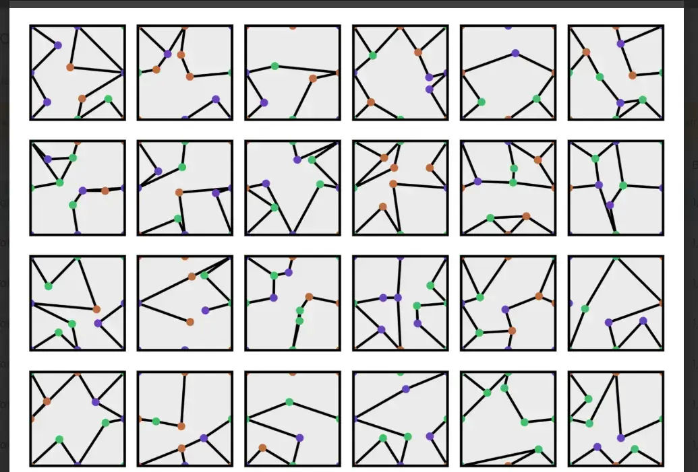

{}
With the growing number of ways to draw the tiles, I knew I needed some better code. So, I broke the huge `Tile` class into a smaller one that accepts a `TileVisualizer`. That one actually calculates and draws the unique bits, which means I merely have to write a new Visualizer for each style and plug that in when selected by the user.
{}

### New visualization: Clouds

Finally, I wanted to add a "cloud animals" style. It's exactly what you'd expect: the tiles are filled with random clouds that might connect to look like an animal.

Technically, this means

* I create a big table for each cell holding all its pixels. (Formally: a 2D array of around 200x200 size.)
* I go around adding random circles.
  * Half the time, I _add_ to all pixels within the circle
  * Otherwise, I _erase_ all pixels within the circle
* When done, I have a big table with values between 0 and 1, indicating how much of a cloud each pixel is. (Some parts will be fully empty, others fully white, and most some transparent area in-between.)
* I visualize this by simply drawing rectangles for each pixel at that intensity.

### New code cards

To create the new code cards, I ...

* Had to invent a few more player colors. (In case you play with more than 4 players.)
* On each card, I place 1 or 2 tiles for the team color. (This will probably be a difficulty setting.)
* All _neighbor_ tiles get the "almost" color and some special action. (Reminder: this triggers when that tile is guessed and probably helps your team.)
* Of all remaining tiles, a few are randomly selected as assassins.

The basic grid and lay-out all stay the same. It's just how things are colored. The worst part, to be honest, was having to invent new _patterns_ for the new team colors. (Because it looks better and to support colorblind players.) It's a struggle to find something that looks distinct, without being too busy.

### Further rules improvements

While figuring out the "special actions" that trigger when you guess an "almost" tile, I realized it's probably most interesting and balanced if these actions sometimes help the _other_ team(s). 

* You get a great hint about the secret tile that might put you in the lead by a lot. Giving a special action to another team helps close that gap a little.
* It adds more strategy to picking clues. Because you don't want to pick clues that might trigger _great_ actions for another team.

Thinking some more about this, I realized an even simpler rule that works better.

> The team _to which the Almost tile belongs_ executes the action.

This means you are rewarded for getting your teammate to guess an Almost tile that belongs to _you_. But if they guess a different Almost tile, it helps another team. (Similar to how Codenames punishes you for guessing a card that belongs to another team.)

It also means that Almost tiles can be colored (and different per team). Which is nice, because it's highly unlikely (on a randomly generated code card) that I can find multiple spots that could be an Almost tile for _all_ teams at once. That was the original plan, and it was a bad plan.

Lastly, I wanted to bring back the idea of providing clues for multiple tiles. My current random generation algorithms support that the best: single tiles look like nothing, but groups of tiles might look like something.

But how do you support that? When you have only **one** secret tile to guess? Well, you **invert it**.

Instead of providing a clue about the secret tile, you must provide a clue about the tiles it is **not**.

This way, we take more advantage of our random tiles, become more like Codenames again, and allow more creativity. (It also reduces the chance of somebody insta-guessing the right tile on turn 1, because they happen to have a tile that really clearly looks like a _dog_.)

So, on your turn, you say a clue and a number. Over time, you communicate all the places on the map that are NOT the secret tile.

With these changes, the rules seem short and watertight. It also feels like a really unique game with its own strengths, instead of a modified version of Codenames.

### About interactivity

At this point, I realized the game had lost a lot of its interactivity. Everyone has a different code card, so you're just giving clues for _your_ square, and what other players do on their turn doesn't matter.

Or does it?

The rule I added in the section above, adds back some interactivity. If you guess wrong, it might give a powerful action to _another team_.

Additionally, the game is over once somebody has guessed all their tiles. This means that, if other players are doing well, you will feel the need to give more dangerous hints (or ones that encompass more tiles). 

So there's still interactivity there. Is it enough, though?

Right now, if you guess the secret tile from another team, nothing happens. In Codenames, this obviously reveals this team for the opponent, which is interactive (and bad for you). But in this game, that doesn't work. Everybody has a unique code card, so this information means absolutely nothing.

Instead, the Almost tiles should probably carry this game. I should add actions that are _really helpful_ when you accidentally trigger them for the other team.

## Testing this version

As you might understand, I grew increasingly tired and frustrated with this project. As such, I stopped working full-time on it long ago, and only did the next step each weekend. This means it's now been a few months since the last version. (Because the steps were: rewrite rules, new visualization 1, new visualization 2, new code cards.)

{}
It's astonishing how short and simple the rules become with this rewrite. It's barely half a page. Let's hope it stays that way and playtesting doesn't reveal the need for extra rules or mechanics.
{}

When I came back to the project a final time, a few weeks before it was scheduled to release, all I could think was: "meh".

Yes, the rules are clean and well-done. All the code works. The game _works_.

It's just that the tiles aren't great. Sometimes ugly, sometimes nearly impossible to recognize shapes in them. And no matter what I do, I can't fix that. There are only certain combinations (usually _rectangular_ tiles and the _mosaic_ setting) that somewhat consistently lead to playable games.

So. Yeah. A big "meh". This game is maybe the worst one (in terms of consistently fun gameplay) I've ever made. I still want to publish and finish it---these games are free and I clearly state that people can leave feedback and I can improve things over time. (In fact, because material is generated with a computer, I can literally change the game's material at any point.)

Looking at it with fresh eyes (and a looming self-imposed deadline), I was able to improve _some_ minor things and squash some bugs.

I also came up with even more ways to create the tiles. But they all suffered from the same problems at the others, so it'd just be different ways for tiles to look "meh".

Instead, I considered one final possibility. A tile so small (2x2 or 3x3) I can just go through _all possibilities_ (or almost all of them) of filling the squares inside it. Then, I'd increase the size of the grid (from 6x6 to 8x8) to allow bigger connections to form shapes.

Did this work? You guessed it: it kinda did, it kinda didn't. I added it as another option, but at the end of the list.

I am DONE with this game.

It also doesn't help that I'm working with an old, broken laptop. (Unable to buy a proper functional computer due to lack of funds and health issues depleting the funds I do have.) Even starting a code editor takes a century. Waiting for changes to compile or show just drains the life from me.

I am calling this project DONE and I DON'T CARE if it's terrible.

## Lessons learned?

Know when to give up. 

Know when an idea just isn't going to work out, no matter how hard you push it, no matter how much time you give it.

I could've probably made another game---heck, two or three games---in the time I spent on this idea. Games that work first time, games with a much stronger foundation. 

Instead, I have this one monstrosity to show for my efforts. Yes, you can play the game. It doesn't look pretty though (except for the mosaics) and it only works if all players are very imaginative and willing to take creative leaps.

I tried, I tried, I failed.

I had an idea, it worked _kinda_ in version 1, 2, 3, and 4, until I had to realize that "working kinda" from the start is just not enough. Your idea needs to "work great" from the start, and just "get better / more polished" as you add images and work it out.

Let's hope I learn from it and prevent this mistake in upcoming games.

Should you play this game? Probably not. You can try. You can give me feedback.

Did I learn a lot from the process? Yes. And I will keep it online to show everyone that some ideas don't work out and that artists don't do everything perfectly the first time. (Also because I have the _tiniest_ sliver of hope that time, feedback or a better computer might get the game to a more playable state in the future.)

Until the next (hopefully much shorter and more positive) devlog,

Pandaqi