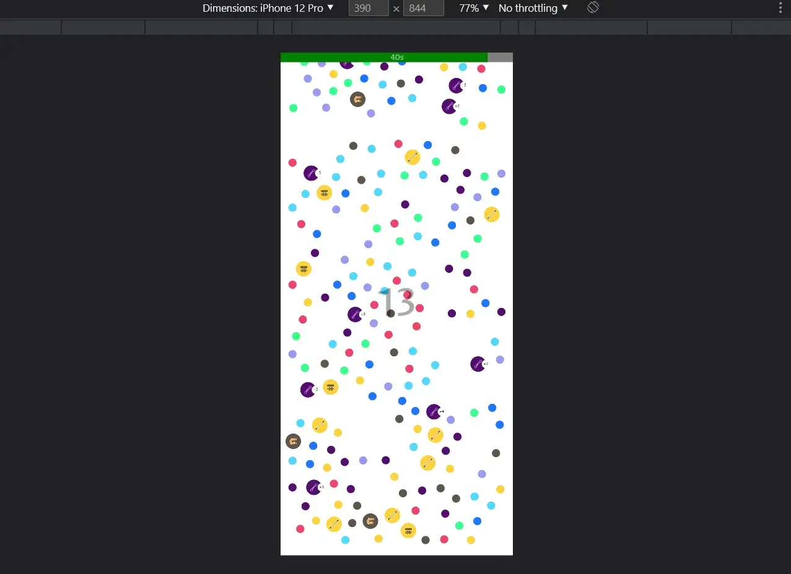
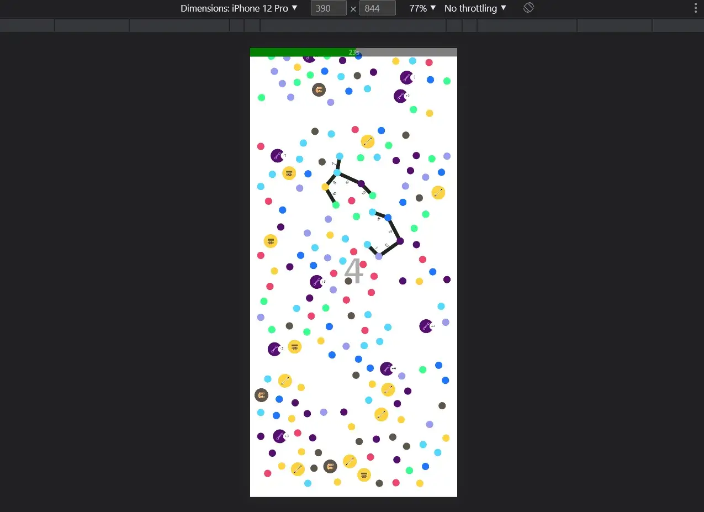
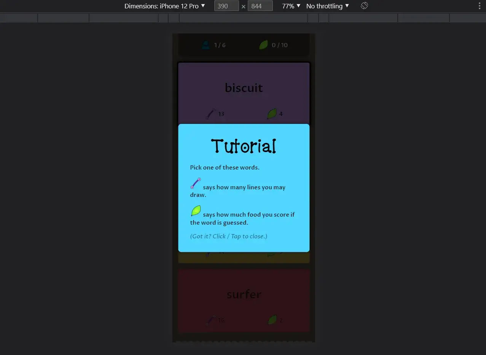
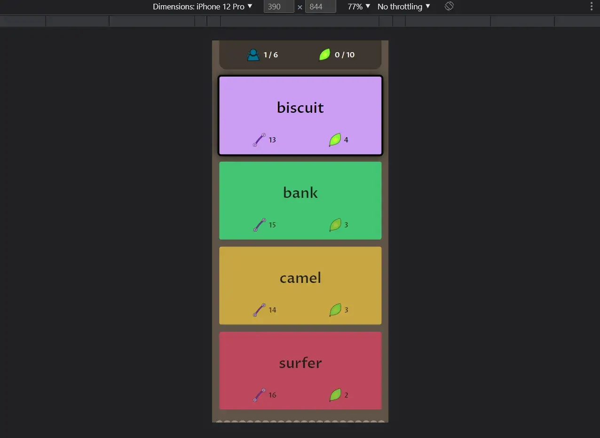
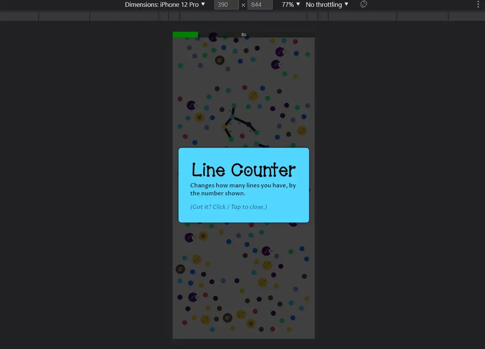

Welcome to my devlog for the game [Photomone: Digital Antists](https://pandaqi.com/photomone-digital-antists). As expected, it's a spin-off for my game [Photomone](https://pandaqi.com/photomone).

While developing that game, I invented some "expansions", that quickly turned into completely separate ideas that should just be separate games. This was the second of those.

It's ... not really a board game anymore. Because there is no board, no physical material. But it's based on a board game (_Photomone_, remember?) and was meant as a "simplified" version of it, playable with just one tablet or smartphone.

## What's the idea?

For Photomone, I made an interactive tool. When you load the website, you instantly get a word and a canvas (with points), so you can immediately learn/try the game. Try to draw the word on that canvas!

It works great. It's a cool (interactive) marketing _and_ teaching tool.

So I thought: why not turn that into a full game? I already have most of the code and setup. What if you play Photomone on just one device (both drawing and receiving your words)?

There is, however, one clear issue: **a phone is much smaller than a printed paper** (and, of course, everyone has different screen sizes)

Oh, and another clear issue: **nobody reads rules for a digital game**

The game had to be simplified. 

* With less space, words need to be simpler _and_ the game needs to be over quicker. 
* Any extra rules (such as special locations or expansions) had to be discarded completely. (The only special things I can add, are those that can be completely _automated_ by the system itself. So players don't need to read or learn any rules.)

Let's also look on the bright side, at some advantages!

* Because it's digital, I can erase/clear the canvas easily! So we can make a game longer (or just more unique) by allowing this to happen.
* The interface can track everything: score, turns, and a _timer_ to ensure turns don't take too long.

But that's really all there is. _Photomone: Digital Antists_ should just be a game you can ...

* Rapidly fire up on any phone
* Play in 15-30 minutes
* As you take turns picking a secret word (on the phone), then drawing and guessing it (with a timer running)

That's it. Let's make that.

## Lifting my previous work

As mentioned, I already created the drawable canvas _and_ the random words interface (for the original Photomone).

I just had to generalize those systems and "extract" that code from the original game. So I could re-use it here just by calling it.

Both these systems are wrapped inside a bigger piece of code that manages the flow of the game. (Tracking turns, making sure the right screens/buttons appear at the right time, and so forth.)

This is ... honestly just busywork. There's not much challenge or difficulty to the code, I just have to "do it". Create all the HTML, the buttons, attach the JavaScript, make sure all systems are connected (and fail properly if something fails).

I usually procrastinate on these things until one evening I'm like: "dang it, let's focus for 3 hours and pump out this system"

There was one requirement on which I wouldn't budge: the canvas had to be entirely full screen. We really need that space on (small) smartphones. It looks and plays much better.

So, the interface should _overlay_ the canvas, instead of taking up empty space. And it should only show what's _absolutely necessary_ while drawing. That is ...

* How many lines you have (left)
* The timer

Even then, I wanted to conserve space. How could I do that?

* Count lines as you draw. Whenever you add a new line, it adds a number to the line (line 1, line 2, line 3, ...) + repeats how many you have _left_. This could be a quick pop-up effect, or the number could be big and in the whole _background_.
* The same for the timer. Don't use precious space to display numbers or text. Instead, I'll simply add a bar at the top that slowly shrinks and changes color. You can _tap_ that bar to stop the timer, which means the word has been guessed correctly and the turn is over.

Any other information is only shown _between turns_. (Such as your total score or how many turns are left.)

 

 

## Creating the tutorial

It's a digital game, so there is no rulebook. Instead, the game has to teach itself. Fortunately, this game is very simple. I can do this via prompts _as you play_ (the first few rounds).

* When you boot the game, it says: "Your goal is to score X points (or more) in Y turns. Give the phone to the first player. Make sure nobody else can see the screen!"
* When you start the first turn, it says: "Pick one of these words. ICON1 says how many lines you may draw. ICON2 says how much food you score if the word is guessed."
* When you start drawing, it says: "Draw lines between points to communicate your word. The others guess it! If correct, tap the timer bar. If the timer runs out, you've lost this round and score no points."

On the main page, there's a (small) settings box for starting the game. You can disable this tutorial there, if you already know the game. Similarly, that's where you choose the difficulty of words, the length of the game, any expansions, etcetera.

 

 

## Adding depth

This is a fine game. That's why I chose this idea: the core concept is simple and solid, which means it should even be very replayable on its own.

You know me, however, and I want to put a bit more work into it. I want to add special locations again. But not just the exact same list as the original Photomone.

* Some of them don't make sense for this game.
* Some need too much explanation
* Some can't be executed by a _computer_, or not as easily.

Instead, I want a small list of cool powerups that can be ...

* Immediately understood
* Completely executed by the website (no effort for players)

After some thought, I realized that the special locations from the base game of Photomone (no expansions) fit perfectly _for the most part_. So I copied those and taught the computer how they work. Besides that, I added some powerups for very intuitive and easy functionality.

* "Num Lines": changes your number of lines.
* "Food": changes how much food you score.
* "Timer": changes the length of your timer.
* "Distance": once triggered, you can't use dots too far away from the others
* "Repel": once triggered, you can't use dots that have already been used
* "Fixed": once triggered, you can't lift your finger anymore
* "Poison Trail": once triggered, you can't cross through other lines anymore.
* "Eraser": clears the whole board!
* "Magiciant": regenerates the board (so the locations and types of cells change)
* "Wolverine": all points you used are _removed_ from the map (once your turn is over)
* "Wordeater": next turn, the player has only two words to choose from
* "Foodloose": changes your target score (for the whole game) by the number shown.

{}
The Poison Trail effect was _surprisingly tough_ to implement. I had to research the calculations for checking if two line segments intersect, incorporate that with the current system, and make it both _fast_ and _precise_. For example, two lines technically also intersect if they use the same point, because they both start at the exact center of that point. So I had to introduce a smart "offset" / "margin of error" to prevent the algorithm detecting EVERYTHING as lines intersecting.
{}

This is a lot to teach. I've had this problem in digital games before and found a most elegant solution long ago.

* You don't allow all types. You pick a small set (say, 3 or 5) at the start. You explain only _those_ at the start.
* You place those icons in some easy to reach location, so players can always tap them to remember what they meant.
* (In this game, I can even check for taps on the actual location, and explain it again with a pop-up.)

Because you've reduced the set, you _can_ explain them all (without overwhelming people), and as they play more rounds, they quickly get very familiar with those 3 powerups.

Unless your game is very deep and takes 2 hours to play, this reduction of possibilities is no issue. After 20 minutes, the game is over, and players can restart to get other powerups. Statistically speaking, it's highly unlikely you encounter _all_ possible powerups in a game anyway.

In the end, I decided to remove any UI for this, and make it entirely interactive. While playing, you can always tap a special point to get its explanation. 

* First of all, because that is just the most efficient and useful way to do it. People want to know what a point does _when they encounter it on their turn_, not before or after.
* Secondly, because I didn't have space for more UI elements. The game now fits neatly on a mobile screen (with no or minimal scrolling ever needed) and looks clean---I didn't want to introduce even more icons/buttons.

 

{}
Also, this means that the main page for this game is very short and simple. It doesn't explain anything. There is no rulebook, no overview of all powerups, nothing. Because it's not needed.
{}

## Playtest

Pfew, I forgot how little you have to do for a web video game, especially when compared to a _board_ game. No rulebook to create, no material, and I already _had_ most of the code.

So it's already time to playtest. 

Here you see the reason why I really wanted to make this variation on the game: it's just so _easy_ to play. I can ask anyone "hey, do you have 15 minutes?", pull out my phone, and we're playing this game. The controls are literally _drawing with your finger_ (or, even better, it's basically "connect the dots"). Anything else is handled by the website, and nothing needs explaining beforehand.

What did we learn from the playtest?

Yeah, it's just Photomone ... now using a phone xD It is _very_ quick to play. (And lose---once you carelessly start playing with harder words.)

Only some minor notes:

* Timer bar at the top can be slightly thicker, otherwise easy to misclick (especially when running out and in a panic)
* It didn't register the "Sneaky Spots" expansion correctly. (It _always_ enabled it.) => Additionally, yes, I actually do want to explain the powerups included on the welcome screen.
* The number of points could be slightly lower. Maybe I can detect screen size and lower it dynamically, if needed.
* New players are sometimes confused when something doesn't work (because a powerup/special dot they used forbids it). Add feedback for that. (Just simple pop-ups at the bottom stating why you can't do what you tried to do.)

The biggest issue is with the final round. If you performed terribly during the game, you have _no shot_ at winning at the end. You need 10+ points and only have one turn left. Literally impossible! So why play? What's the point?

That's not a minor issue---that's something that _must_ be fixed. A common way to do so, is by making that final round "special" in obvious ways: bigger scores, a change to the rules, whatever is needed to make the game _winnable_. That's usually a lot of fun and make a game _better_, instead of feeling like cheating.

For this game, that means ...

* Scores are multiplied as often as needed to make the game "winnable". (You need 10 more points? This word used to score only 4 points, but multiply it by 3 and you get 12 points. Enough to win!)
* The timer is also increased by that amount. (Default is 45 seconds, so it'd become 135 seconds = just over two minutes.)
* However, the number of lines is _divided_ by that same amount! (The word had 20 lines before? Now it has 20 / 3 = 7 (rounded).)

This leads to frantic last rounds as you try to draw a princess with only 5 lines, and the other players yell hundreds of suggestions for two minutes :p

The perfect fix, in my eyes.

## Conclusion

The lack of physical material _does_ mean I can't show you photos of the game being played on a table. (Which I usually do, especially for One Paper Games, where I can photograph the final papers.) Oh well.

This game turned out exactly like I wanted. It _is_ Photomone, but completely digital, even simpler and even faster. The interface works well. It all came together rather quickly, and with the small rule tweaks I explained above, the game became solid and balanced.

That's it for this devlog.

Until the next one,

Pandaqi