Welcome to my devlog for the game [Photomone](https://pandaqi.com/photomone). It's a simple (party?) game I wanted to make for a while, but I could never quite figure out the details. That is, until I made some more games, updated my gaming website to be way more interactive, and realized what needed to happen.

Let me take you on that journey!

## What's the idea?

One day, I saw the game "Starlink". It's a simple game:

* There's a galaxy sheet: empty blue space filled with dots that represent stars. 
* You can _draw_ on that with whiteboard pen. (And, thus, erase it when done playing.)
* On your turn, you get a word and must draw it. However, you must do so using the stars! You can only draw straight lines between stars.
* There's a sort of add-on that places a small circle on the galaxy and forces you to draw _within those confines_ for bonus points.

The idea is solid, simple, new. But the execution left a lot to be desired (in my eyes). It also seemed like a very expensive game for so few and simple components. 

{}
There's no limit on how many stars you may use. All the stars are identical, so no powerups or strategical placement. The one interesting thing---the circle that limits your scope---is completely optional and feels tacked-on at the last second.
{}

So I wrote down some ideas on how to improve that. How to take this inspiration and turn it into a _One Paper Game_, or something with a bit more substance and variation.

Then I got stuck. I loved the space theme and wanted to expand on that, which means I wrote all my ideas from that perspective. 

I invented rules like: "I want to give each player their own spaceship! And they can only draw within a certain radius of that ship!"

But then I hit obvious roadblocks:

* You need some chip/token to mark where spaceships are => making the game less accessible or cheap to print
* You need extra rules for _moving_ that ship, and what if there are no empty stars left within your radius, and what if you meet someone else, and aaaaaah

I left the idea for a while.

## What's the idea, second try?

Coming back, I immediately ditched the space theme. I mean, there's a line between "taking inspiration" and straight up "copying" a game. I wanted to stay comfortably on the _good_ side of that line.

The original concept of Starlink is the mechanic that jumpstarted this idea. In all other ways, I tried to forget that Starlink existed and didn't even read the rulebook. 

With "space" and "stars" out of the question, what could be the theme? What could be the new direction for this game?

I saw three strong ideas:

* Islands => the dots on the paper are islands you must connect, empty space is the ocean (duh)
* Atoms => the dots on paper are atoms/molecules, you draw by connecting those
* Ants => the dots on paper are tiny ants, connecting them means leaving a pheromone trail as they walk around

The first one is fine, but a bit cliché. It's very similar to the space theme, just, you know, on the ground. I already have enough game/story ideas that _must_ be an island. This one doesn't have to be, so let's continue.

Atoms is equally fine, but I was worried about the first impression. Will it seem like a mathematical logical game? Will people see it and immediately be turned off by it? Will people _assume_ things, like that drawings have to be as tiny as possible, or that atoms need to connect in some meaningful way?

In the end, I judged that ants walking around and gathering food was just a theme with less risk attached than atoms. It gives a clear goal and a clear intuitive relation to a real life activity.

But both would've worked.

After writing down some 30 name possibilities (combining words like ants, pheromone, food, insect, photo, pictures, etcetera) I settled on **Photomone**. Short and sweet. Unique. Clearly communicates what it means: a game about drawing and something with pheromone trails. (Although a logo/icon filled with ants will have to communicate that second part more clearly.)

This became the final idea:

> On your turn, you communicate a word to your fellow players. However, you are an ant. You can only do so by leaving a (pheromone) trail: connect locations on the paper in straight lines.

## Fleshing it out

### Better marketing / rules

The first---and probably biggest---hurdle is actually getting new players invested in the game and explaining it to them. So it's the first thing I consider these days, before even writing the rules.

Lately, I invented "interactive rules" and have a great time developing the idea. It means the rules are a website where you can, you guessed it, _interact_ with the rules of a game. Press a button to generate an example turn. Fold/unfold sections. Hopefully _animations_ in the future.

This game can go _even further_!

It's a drawing game. A simple one, at that. This is something a website can easily handle. 

* When you visit this webpage, you immediately get a blank drawable canvas.
* It says "Draw this word: X" and "you can only draw straight lines between two points"
* Now you can immediately _play_ the game. Within seconds, somebody is interacting with it, and already understands how to play.

That's the first thing I want to make. A small library that can turn any element in such a canvas. (Which allows drawing and getting a random word from my dictionary.)

Below is the first barebones version of this.

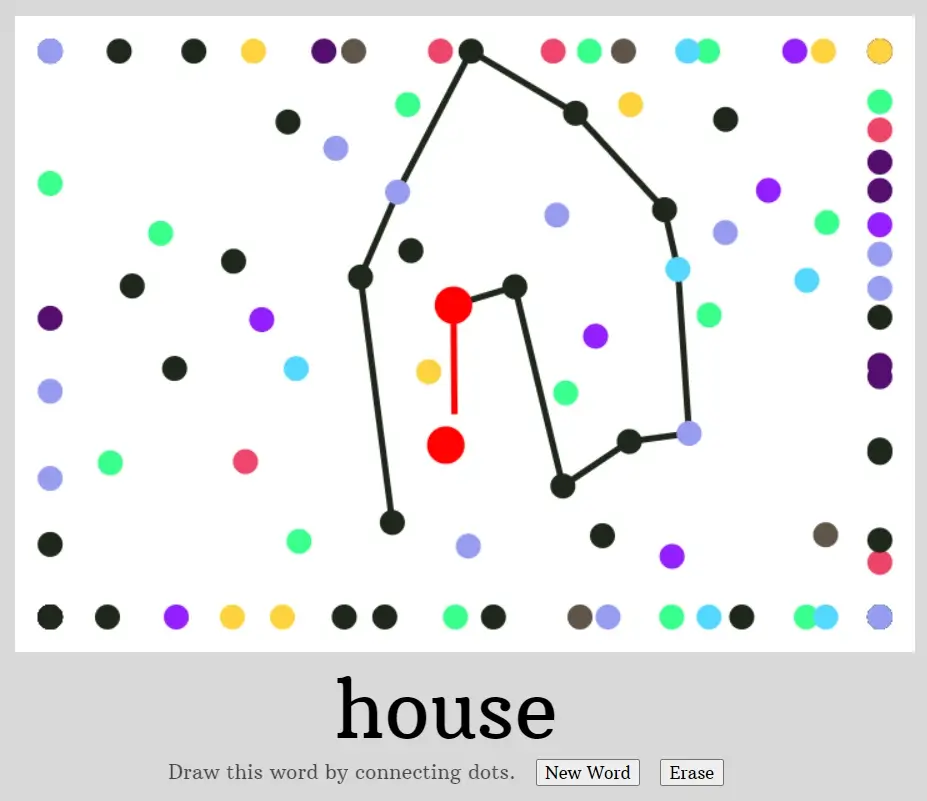

### Random maps

But where do the points come from? How do we generate a random set of points? 

That's the second thing to make: a random map generator. (This should be a separate library. So I can easily create a PDF that players can download, without playing the game mentioned above.)

The "easy" solution is obviously to just _place random points_. But that has too many issues to count. (Overlapping points, one part of the paper might be empty while another is too full, no control over how often a certain special point type is placed, etcetera.)

I've created graph-like maps before (such as with [Unstable Universe](https://pandaqi.com/unstable-universe)). This uses **point relaxation**:

* Place random points, as a _start_
* Now check if any point is too close to others. If so, apply a "force" to push them in opposite directions.
* Applying this force on all points simultaneously, 50 steps in a row, eventually smooths out the points until they're at nice distances from each other.

To control the types of points, I use the same methods as always.

* I have a dictionary ( = just a bunch of data) about all types, which states things like "probability of picking this thing" or "how often this thing is allowed to appear (at most)"
* I decide all special points _in advance_, taking those properties into account.
* When done, I simply loop through that list and attach those types to random existing points. (Which don't have a type yet.)

I've needed this so often, that the function "getRandomWeighted" is part of my general "tools" library accessible throughout the whole website. It draws a random element from a dictionary, with the correct probabilities and such for each.

Below is the barebones implementation of this algorithm.

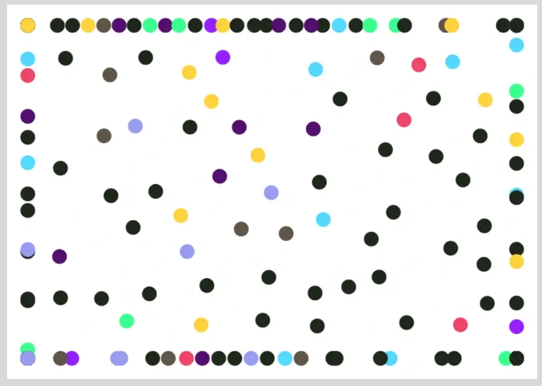

As you see, there are issues here. The edges are ugly and get "bunched up". I also immediately realized I need a _lot_ of points for this game to work. It's actually really tough to draw something this way! (Which is another reason why I want to create more interactive tools for my games, so it's easier to test gameplay _by myself_.) But those are problems for later.

### Where do words come from?

The hard part is already over: I created my own dictionary tool ([PQ WORDS](https://github.com/pandaqi/pq-words)) with simple English words, categorized and all.

I simply load it and draw from it. (I do provide a backup: a list of 50 very simple words that will be used if, somehow, my library can't be reached or used.)

The real question: how do we _present_ this?

As usual, there are three ways to play ...

* Completely offline: I provide a PDF with "word cards" that you can print and cut into cards, then reuse for all your games.
* Completely online: on my website, you can press a button and it will grab a random word. (So you can play the game on paper, as long as one person has a smartphone with internet.)
* A mix: you use a randomly generated board, but I print all possible words _on the board_. So you can still play completely offline using only that paper.

That last one seems like the ideal solution (fewest steps, least material) ... but I'll have to figure out how to implement it. Because how does the active player pick a _random_ word from that list? And how can you keep them accountable and prove that they chose that word (once you guessed it)?

I see two solutions.

* Either _write_ the number of the word (or the word itself) at the _back_ of the paper, before you start drawing.
* Or all players decide a secret number for themselves at the start of the game. Using that, and some simple calculation involving the board, you get your random word to draw for your turn. (Example: you have 4, your last drawing ended at location 28, so you must now draw word 28 + 4 = 32.)

But these worries are for later. For now, I just need to support all three methods.

* A piece of code that generates a PDF with word cards. (Already did that for games like [That's Amorphe](https://pandaqi.com/thats-amorphe). So I know it's possible and the steps to take.)
* A piece of code that draws a random word from my dictionary. (I don't want to clutter the official webpage. So I'll make this a separate page, with a link on the home page to go there. Like I did for most games.)
* An option---in the map generation code---to reserve some white space and fill it with words at the end.

Below are the first versions of the printable word cards (for which I really need to find some decoration that makes it look less bland) and the simple game interface (to get words on your smartphone).

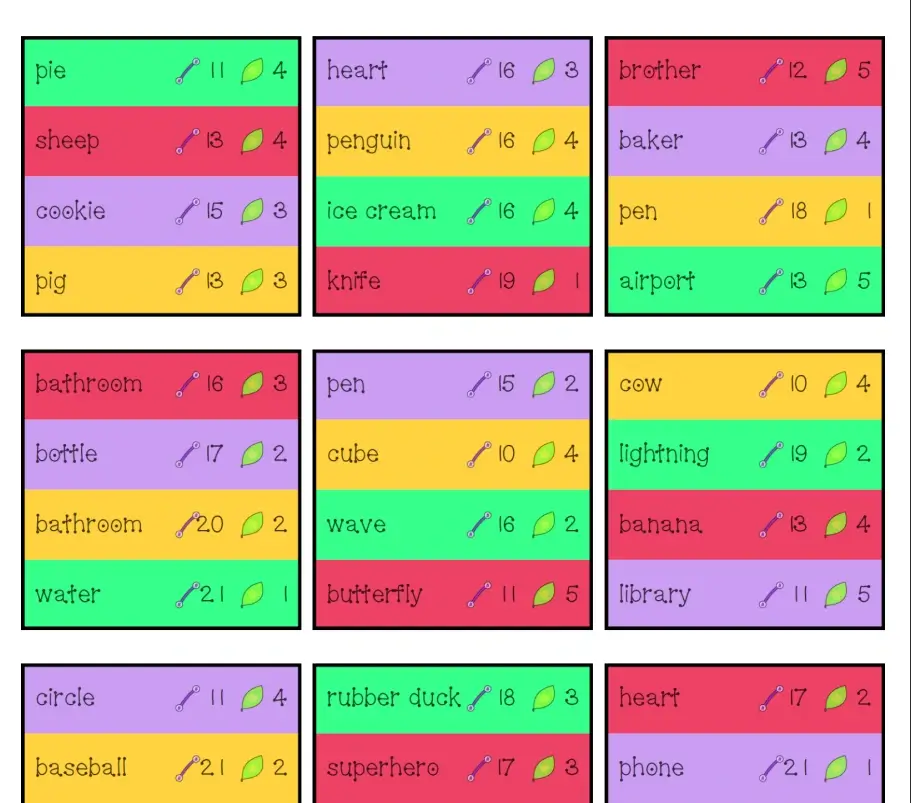

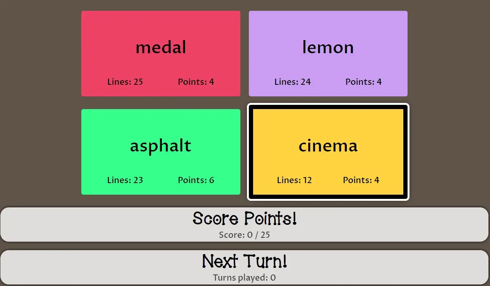

## Now the actual rules

I focused a lot on the technical/material side of things. As mentioned, I did that because it's better for marketing and ensuring the game is simple and accessible to anyone who finds it. It's also because I've been writing a lot lately and didn't want to _write even more rules_. So I postponed that by programming and drawing a bit instead.

But now it's time. What are the rules for this game? What do I _want_ out of this game?

* That "draw in a tiny space"-rule should be a core component of the game.
* The locations should be different, with special rules or actions attached to them.
* The number of lines you may draw should be limited. (The alternative is to set a timer on rounds. But that's one extra component and doesn't even solve everything. What if somebody just draws _really fast_, making all sorts of mistakes or screwing up the paper for everyone else?)
* Is this a cooperative or competitive game? (Cooperative allows lower player counts. Competitive allows teamwork or more special locations that give points or advantages.) => Consider both, at least for now.

With that in mind, let's go through the four steps of every game: Setup, Objective, Gameplay and Expansions.

### Setup

You use a printed paper, or you grab the website. Then you grab a few pens. 

_That's it! That's why I invented these One Paper Games!_

### Objective

In cooperative mode, you usually want to score the most points. That, however, always feels vague and meh to me. ("You scored 48 points! ... now what? Is that good? Is the game just ... over now? Huh?")

Instead, let's assign a target. You are trying to locate the exit of your ant colony (or some big food source). The paper tells you how many points you need for that. You win the game by exceeding that number.

In competitive mode, it's "highest score wins". You work in teams. One player draws, the other guesses.

### Gameplay

Take clockwise turns. On your turn, you draw, everyone else guesses.

* Get new random words. Pick one. (Either through a word card, a word printed on the paper, or that website component.) 
* Pick a location to start drawing. Mark it with a star.
* You may draw as many lines as the word indicates. (Yes, this means words need to come with a number attached.)
* Any time you include a new point, execute its action (if it has one).

Then we have the crucial "rules of drawing".

* Lines must be straight and between two points
* Lines may not cross each other
* You can't draw further than X points away from where you started. (Where X is probably something like 4 or 5.)

I limit both the _maximum distance_ and the _number of lines_. This ensures turns will be over quickly. This ensures players don't abuse the system and make drawings that are way too large or ruin the whole board. This adds strategy and challenge.

Also notice that these are the only rules. Anything else is allowed: lifting your pen, connecting to existing drawings, etcetera. I see no reason to forbid this. And in that case, simply allowing it is always the best option. (Simpler rules + no need to mention it + more freedom and strategy + I can add some of these restrictions through the _expansions_.)

## Expansions

This game, maybe more so than any other game of mine, is all about the expansions. The base game is basically a "first game" that introduces you to the idea. The expansions below are what will make the game shine and very good. I think, I hope.

{}
That's also why I started a new big heading in this article for the expansions. I learned long ago that you should refuse to go any deeper than 3 nested headings :p
{}

### Different locations

The base game will probably only have "standard" points. Or maybe one or two simple ones. 

The expansions are all about adding special point types. Which, as you recall, execute whenever somebody uses that point while drawing. That is probably the "meat" of this game. The thing that should make it varied, strategic, replayable for a while.

_What are those special points?_ I have ideas like this ...

* #Lines => your maximum number of lines changes (bigger, smaller, ignore it, whatever)
* Distance => your maximum drawing distance changes
* Points => you get more or fewer points for this drawing
* Stuck => stop drawing immediately
* Fixed => your drawing must be one continuous line (no lifting the pen)
* Repel => your drawing may **not** use points that have already been used

### Moving ants

I still liked the idea of an actual moving "spaceship". I wanted to at least _try_ and add it, as an expansion. In this case, of course, it becomes an ant that walks around.

But what would be the rules?

* You _draw_ your ant next to points. (Also something I used many times before, but hadn't when I wrote the original idea. So I didn't think about it then.)
* After each round, you may move your ant ... but only _along the drawn lines_. (By, like, 2 or 3 lines.)
* You must always _start_ your drawing from where your ant currently is.

This also allows more special points, like:

* Trap => immediately stop moving your ant
* Wings => changes how far you may move at the end of your round
* Teleport => teleport your ant to anywhere you like

Why do I like this so much?

* It adds customization: you have your _own_ ant, drawn in your _own_ way. (I can already imagine people giving their ants names and personalities :p)
* It adds strategy: you have to plan ahead where you want to move, or where you are now, to make sure you're at a good spot for your drawings.
* It prevents making the board messy (quickly): you can only draw along the path your ant is walking, so drawings will be grouped together automatically.

### Reverse Photomone

This was part of the original idea document, actually. I realized I could reverse the process for a different type of (party) game! Similar to "Codenames".

* You play in two teams, against each other.
* The website generates a board **including randomly drawn shapes**! These are numbered and don't necessarily represent anything (though they could, by pure chance).
* It can also generate cards with numbers. These say which shapes belong to team 1, and which to team 2.
* (Also, like Codenames, there's the "assassin". That one shape that, if guessed, immediately kills you and means the other team wins.)

On your turn, you may say one word to describe one or more shapes. Your team members have to guess which one you meant!

That's it. In reverse, this game works immediately.

Drawing the random shapes can use a simple algorithm like ...

* Start at an unused point
* Draw a line in a random direction; repeat.
* Forbid nasty situations, like lines that cross each other, or attaching to a point already used (numerous times) by other shapes.
* Prefer points that bring us _back_ to where we started. More and more over time.
* If we came home, great! Save the shape, continue.
* If something interrupted us, throw away the attempt and try again.

It's imprecise and takes longer than something smarter. But it gets the job done.

**However** this is such a big reversal, that I probably want to make this a separate game. A spin-off or sequel or whatever. Implementing this inside the same webpage, or the same rulebook, is asking for complexity and trouble.

So, for now, let's make Photomone first. Once finished and successful, I'll create a separate page and codebase for this game (_Photomone: Antsassins_ :p)

{}
That's another thing I would've never done at the time I wrote this original idea. I was too inexperienced to know that cramming a whole variant like this at the end of an already-full rulebook is _bad_. Pull it into its own game. So it can stand powerful on its own, with easy rules and code, _and_ you suddenly have two new games for the price of one!
{}

### Coop Colony

Instead of one player drawing at once, _multiple_ players draw at once. In other words, you draw **one line**, then the player next to you draws **the next line**, and so forth until the drawing is done.

The players who didn't participate in the drawing (and thus do not know the word) actually guess it.

A neat idea that wouldn't require too many changes. 

Also allows new special points like:

* Leader => The person who activated this point, finishes the shape on their own
* Dreamdrawing => Even the players who _do not know the word_, get a turn drawing a line. (Let's hope they guess where it's going and draw a meaningful line ...)

## Doubts & Leftovers

I considered allowing multiple turns to draw something. But I didn't know _how_. Is this a free decision? "Nah, you won't guess this in one turn, I'll use two for it"? Is it a special point or rule? Don't know.

I also wasn't sure about guessing. Can people guess as much as they like? Do people get a maximum number of guesses? Or is there no other option than adding that timer (of 30 seconds or so) anyway?

Yeah, I don't have much to add to this section. It basically represents a few days of thinking, listing all solutions to all the problems I saw, and making little progress on the _rules_.

## Finishing all the systems

While polishing and finishing the systems, you usually discover the real problems and struggles. This time was no different.

### Issue 1: space

As mentioned, we need a lot more points and lines than I expected to draw most things. As such, I'll have to see how much we can fit into on A4 board without compromising legibility.

But I think the special locations (and some rules) are the best solution here.

* "Multi turn" drawing should be an easy choice. So you can decide to continue drawing the same thing next turn,e effectively giving yourself more time and space. (At the cost of not scoring any points _this_ turn.)
* The basic locations should give more lines or more _freedom_ when drawing in general. (Like, you may do one _curved_ line, or _add a point yourself_. Cool, useful powerups I only invented while coding the systems!)

### Issue 2: rating words

How do we score words? How do I calculate how many lines you may use, and how many points you get? It's impossible to manually assign a value to all words. (There are already over 7,000 in my whole dictionary. Besides, it's not like _I_ know any better, having never playtested the game yet.)

After some trial and error, I settled on this.

* 10 lines seems the bare minimum.
* When a word is at a higher difficulty (e.g. "hard" instead of "easy"), it gets more lines and more points
* When a word is simply _longer_, it gets more lines and more points.
* (There's a clear cutoff in word length, though. Mostly to make the words fit more nicely on the page :p It's very short, 8 characters only.)

Around this, there is _randomness_. It can randomly decide to give you a lot more lines to draw, or a lot more points. However, these two balance each other. If you happen to get _tons of lines_, the point value goes down a bit. Because it's now much easier to draw and communicate this thing. Conversely, if you can score a lot of points for "cat" ... you only get very few lines to draw it.

This might lead to "bad combos" once in a while. A word that my algorithm thought was easy, but is actually _very_ hard to draw (with only 7 lines). That's fine. That's the unpredictability of a party game and probably adds to the fun.

But the most common (and useful) way to combat this is, obviously, by adding **choice**. Instead of giving one word, players always get 3-4 words and pick one from those. This way, _they_ filter out the bad apples that my system might produce.

**Okay, so how do we assign a "target score" that players must reach to win?** Now that we have this system, we can just calculate a sensible average.

* Grab 100 random words (taking into account the settings, of course)
* Average their points
* Ask ourselves "how many words should players guess correctly before winning?" (which, to me, is in the range of 5--10)
* Multiply those two numbers, and there's your objective score.

This score is simply printed on the board. Or displayed in the interface, if you get words that way. (And in that case, this estimate is sharper, because the interface actually knows _the exact words_ you will be presented during the game.)

### Issue 3: point placement

When I showed you a screenshot earlier from the map generation, you saw that points were nicely spaced on the map---but the edges were ugly and had "clumps" of points.

Why? Remember how point relaxation works. If two points are too close, it pushes them both a bit away from each other.

But if you're at the edge? There's nowhere to go! Over time, more and more points drift towards that edge, making any relaxation there impossible.

How do we fix this?

**Approach #1:** In an older game, I set the number of edge points to a fixed number. I said "start each edge with 10 points". Those could not move, and other points could not "join" them at the edge. They were automatically repelled from it, like a magnet.

**Approach #2:** We can change the boundaries. Instead of a square, we can draw a "ragged circle". (A circle with points randomly moved slightly further or closer to its center.) This will have a similar problem, but look more organic and be able to resolve the issue better. Because a circle is round, which means there aren't 4 "corners" where things get stuck.

I combined these.

* At the start, points are placed along this ragged circle. These points are fixed: they do not move.
* All other points are placed inside and do the regular relaxation.
* But when they get close to an edge point, there's a bias towards pulling the points toward the center.

I hoped that this would still allow enough freedom. (It even allows going beyond that circular border, if a point is pushed and pulled strong enough.)

I implemented this ... **and it revealed a stupid, major bug in my code** :p 

That was _actually_ 80% of the reason why the original, square boards looked bad. Fixing that bug allowed my original boards (with square outline) to look great.

I'd already implemented the elliptical/oval outline, so here's a comparison. Also, you can see I've added the target score (top left) and the option to print words on paper (and it doesn't look ugly).

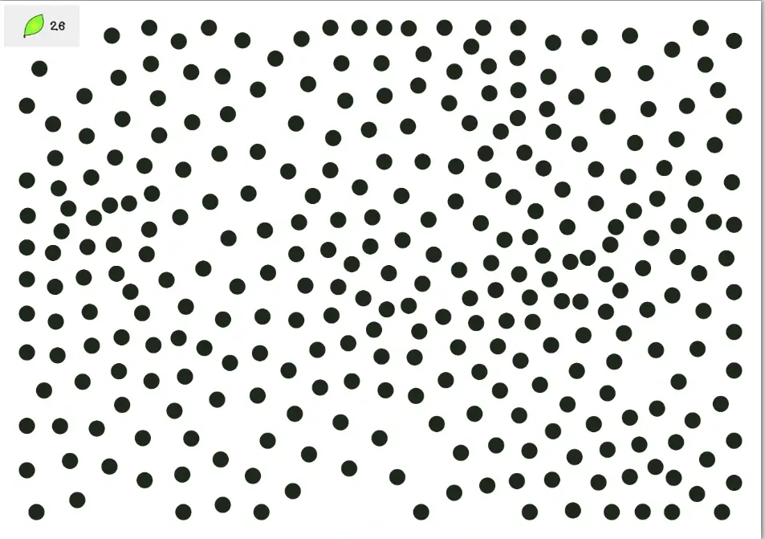

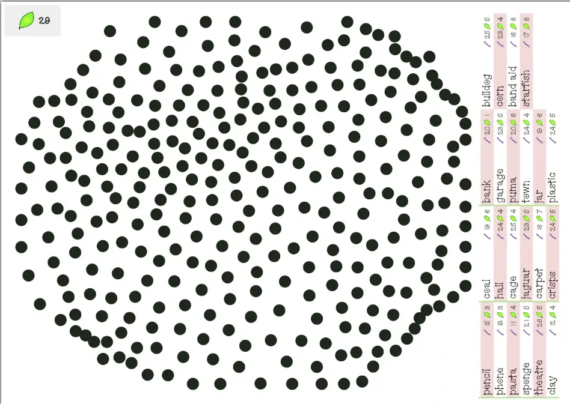

{}
I didn't completely "randomly" change the ellipse edge points. I used a simple noise function to make sure the ellipse outline was pulled apart in a somewhat regular way. So, if one point was pulled 50px more to the left, the point next to it wouldn't completely go 100px _the other way_, creating an ugly saw-like pattern across the border. Their randomness transitions smoothly.
{}

In the end, I think I'll stick to the square one. We need the space in the corners, and the elliptical one sometimes looks more organic ("better"), but sometimes much worse ("messy").

### Issue 4: Can't this be an entirely digital game?

I've built this interactive tool. You go to the website and immediately get a word you can draw using a random map. While playing around with it ... I noticed I was _playing around with it_ :p It was basically already halfway a functional little game.

I added a button to "hide" the word. Voila, now you can play this: you check the word, hide it, then draw it. Otherwise need to guess.

It wouldn't be that hard to allow a fully digital version of this game. Just load this canvas on a separate page. Add easy buttons to track score. Add logic to automatically handle some of the rules (for special locations or invalid lines).

The only issues are

* Very small screen space on mobile.
* Explaining this as well (and/or adding another button for it) on the same webpage probably becomes a mess.

I reached the same conclusion as my other Photomone variant (that was like Codenames): it should be a separate game. One that's completely digital, with simplified/drastically changed rules, which are completely explained or handled within the interface itself.

I dedicated an evening to simply writing out the idea/concept for those two spin-offs.

## Moving toward version 1.0

All the systems are working, and some are already polished or finished. Now I have to figure out the last few issues, and mostly create _a lot of images, drawings, icons, etcetera_.

### General style

I really want to experiment and challenge myself when it comes to drawing/visual design ... but I also can't afford to spend weeks on icons, headers, etcetera. (These are, after all, completely free games.)

I picked one unique, recurring element and that's it.

> All drawings are made from _points_ connected with _lines_.

I try to keep those lines straight. But to make some icons easier, I'll have to add curves and bend the rules here a little bit :p

This should make the theme very consistent and recognizable. It also challenges me to create iconography (and other imagery) following this rules. But it's not too hard, especially not if you use vector graphics.

Let me show you what I mean with this "style".

### Special Locations

I drew the icons for special locations.

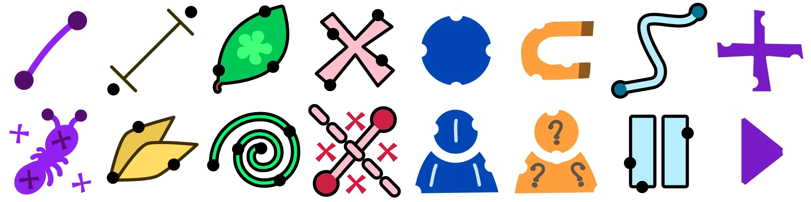

By now, we know that we need _a lot of points_, which means they _can't be very large_. So the icons had to be extremely simple. Easy to see and identify on small sizes.

I also realized another improvement that way: I could make dots different sizes.

* Regular dots can be tiny
* Special dots are larger (about 2x-3x the size) to make the icon fit.

I _also_ wanted this size difference to make special dots stand out. To make them feel really special and provide more visual variety with the boards.

Similarly, I've decided to include **no** special dots in the base game. In my experience, it just adds a few paragraphs too many to the rules for your first game. They aren't crucial, so they move to an expansion. Keep the base game clean and short.

This does make the maps even more boring. (All dots are the same tiny, black one.) So, I decided to just assign random colors to points in the base game :p

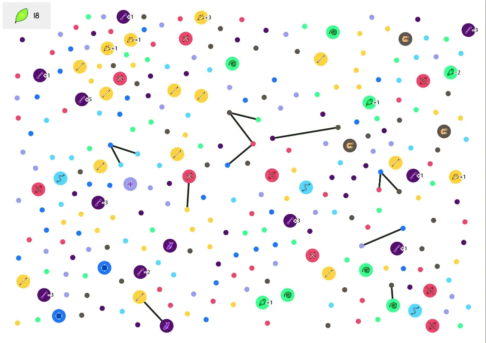

### "Pausing" a drawing

I wasn't sure what to do with this rule/idea. I didn't want to make this a core part of the game. It requires too many rules and exceptions.

* When can you pause a drawing? Always? When done, and nobody guesses it? Is it a special action?
* Is there a penalty?
* When you resume the drawing next turn, do you get another set of lines? How many?
* For someone new to the game, this would be a hard concept to grasp, or combine in their head with the rest of the rules.
* More and more questions and issues ...

After trying lots of solutions, I decided to make this an expansion/variant of its own.

* If a drawing isn't guessed, you must resume it next turn.
* Write the number of lines + points for this word next to your current shape.
* Next turn, don't draw a new word, but continue drawing your old one. (You get the same number of lines as before.)
* Continue until somebody guesses it correctly. (Or a special location bails you out.)

This also allows adding special locations.

* Break: "You must pause the drawing immediately"
* Pants on fire: "You cannot pause this drawing. If not guessed, you get -5 points."

I'm very much _not sure_ about this one and need to test it. But at least it's a simple, solid set of rules that has now received its own place.

### Preparing for the future

While working through my last list of tiny fixes, I also sharpened the idea for those two spin-offs. I recognized I could re-use many systems ... if I coded it a little differently.

I spent a few hours "decoupling" systems into smaller systems. This will allow me to just "plug in" some of those components for the spin-offs, saving me 50% of the work.

{}
The drawable canvas used to be one chunk of code. Now it's split between `CanvasDrawable` and `CanvasUI`. The first one is _only_ the canvas, which I'll reuse for my digital variant. The other one is the specific UI (buttons, random word, instructions) used on the front page of this game. Which I do _not_ want for that digital variant.
{}

As it stands, the digital variant will be very similar to Photomone, just much simpler and, well, completely digital. The other variant will be more different than I thought and probably _more_ work to make than the base game.

## This is why you prepare for the future

While decoupling the code, I decided to immediately add other improvements. 

* Make special locations actually work _in code_. (Example: if your line ended on a dot that does "points + 1", that would actually happen)
* Make some parts of the code more robust, flexible, general, etcetera

This revealed some major issues. (This always happens. When an idea is only in your head, you can't see all the consequences of rules or ideas.)

### Issue 1: maximum distance rule

The **maximum distance** rule wouldn't work. Right now, it said ...

> Mark the first dot you used when drawing. You cannot go further than 3 spaces ( = lines) from that location

You see the obvious problem? You're not required to connect all your lines: you're allowed to lift your pen and continue somewhere else. So what _is_ 3 spaces? All the dots are at different, random distances from each other! There's no way to define this!

Additionally, this node was one of _three nodes_ that needed a **number** on them. (By how much the max distance changes, a number between -2 and 2 at the moment.) 

Looking at the map, I thought it was _just_ too full and too busy. If I could remove one node with a number, that would help a lot.

How do we fix this? Remember the start of the devlog: the "max distance" rule is quite useful, as it prevents players from taking up way too much space and messing up the board. I had to keep it in the game, but _better_.

I thought, and thought, and got an idea. What can we use as a a measurement tool? Without requiring more paper/material/setup? What is the one thing players are _sure_ to have? **A pen(cil)!**

I removed the default rule. (Which also allowed removing the rule about "mark your starting point blabla".) Instead, there's a node (that appears frequently) with this property.

> When used, no points used in your drawing may be further apart than the length of your pen(cil).

This includes a remark about using any other measurement tool, if your pencil is too long/short. It doesn't have to be precise: it just needs to _limit_ the drawing area in some meaningful way.

This change simplified the rulebook even further---always nice---and actually made this rule possible :p

### Issue 2: the digital interface

Right now, the digital interface can give you words _and_ track your points/turns. But while making it, I completely forgot about the special locations. There's no way, for example, to _change_ the points you get for a word.

Which would mean you can only use this digital component with the base game, and nothing else. That's not great.

{}
Of course, I do realize that only a tiny fraction of players will even try this combination: the last expansion _and_ digital words. It's not a big deal, but I like finishing projects completely, instead of leaving things on the table because "I don't think many players will care".
{}

In the end, I did the following.

* When you select a word, buttons pop up behind the lines/points. Press these to change the value ("+1" or "-1").
* When "pausing" is enabled, you get a button to "pause" your current word. The interface remembers it and displays all currently paused words inside their own little area. On a later turn, you can pick the word again and finish it.

I made this---and then realized I was being stupid again. The whole point of the game is to guess other player's words (which they're trying to communicate through drawing). If you pause a word ... and it just stays in the interface ... then everybody sees what your secret word was!

So I conceded and marked this expansion as "not usable with the digital word interface".

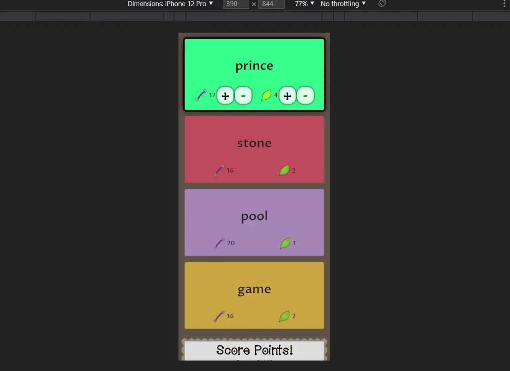

### Issue 3: word difficulty

I copied the settings block from my "That's Amorphe" games to this one. It allows you to customize _anything_ about the words (categories, difficulty level, include geography or not, etcetera).

But after creating and testing the systems with these words, I became certain that most of them were just _way too hard_.

Like, how on earth are you supposed to draw "Charlie and the Chocolate Factory" with 13 straight lines between fixed points on a paper?

I removed some categories. I removed some more. I ended up removing the option to add geography / proper names entirely.

In the end, I created a very _narrow_ selection of words for this game.

* Levels: core, easy, medium (default = core)
* Categories: only the 10 categories that are easiest to draw this way, such as _animals_ or _items_
* Word length: at most 8 characters
* Geography / (Brand) Names are completely excluded. Yes, _some_ of them can be drawn easily, but that's like 5% of the total set of words.

I see this as a good thing. It simplified that settings block (which can be overwhelming), while ensuring that the game isn't so hard it stops being fun.

## Playtesting!

Anyway, this game is now completely usable and playable. Let's exhaustively test it!

And I have good news: **the game works (almost) flawlessly!**

There were some oversights by me, some balance issues, some minor tweaks or extra ideas. But even without those tweaks, I would confidently publish this game, that's how solid it already was.

Why am I so positive? What am I looking for? 

* We could start playing within 1 minute (even with the expansions)---both teaching and setup done
* There were never any questions/doubts/unclear parts
* The challenge and difficulty is consistent. 
* Perhaps most importantly: you _can_ get better at this game, and you _can_ be as skillful/strategic as you like. (After playing many games, it was much easier for me to see where a shape would fit, or which powerups I could use to make my life easier.)

### General

I feared that boards would be too full/small/unreadable. But I always misjudge how large (and high-resolution) printed A4 papers are. (I actually misjudge how bad and broken my laptop screen is :p)

The boards were near perfect. Enough points to draw something, but also enough space. Nice colors and crisp icons. I want to try slightly larger text, but that's the only thing.

Below are images of some test games (using different expansions/ways to play).

{}
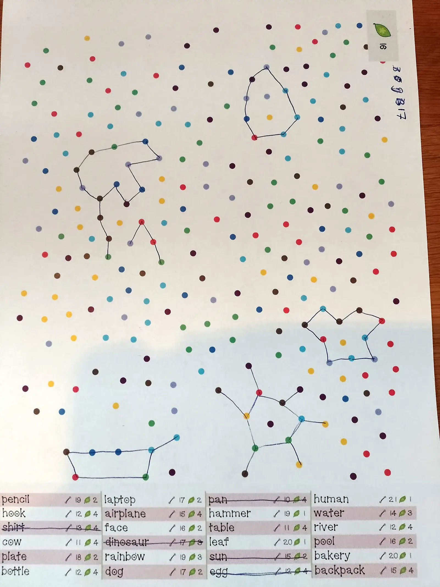
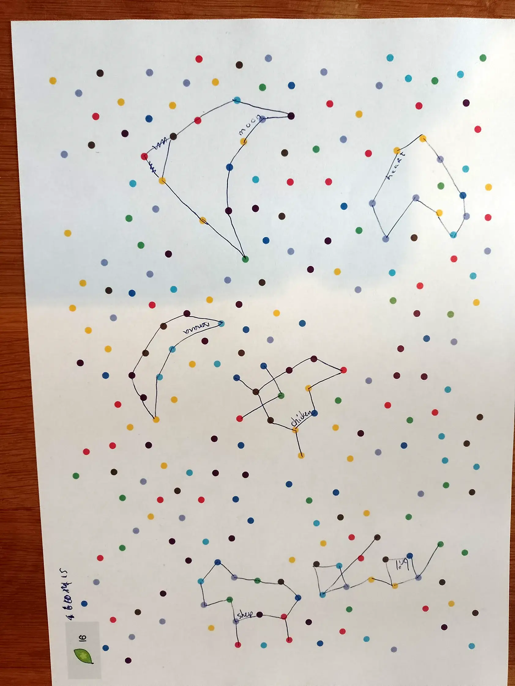
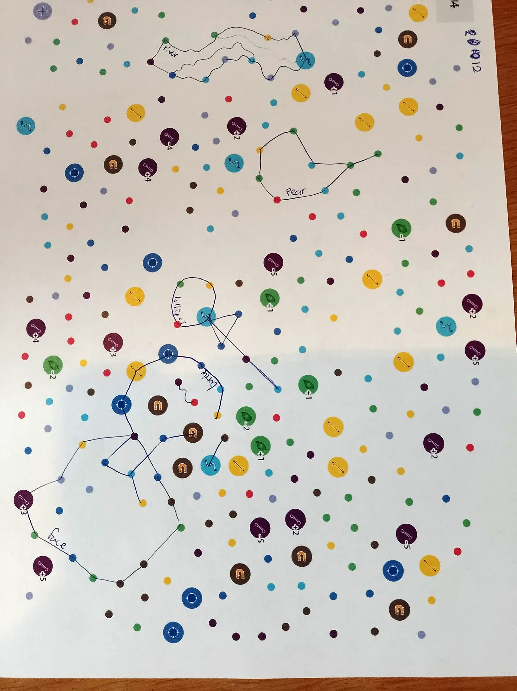
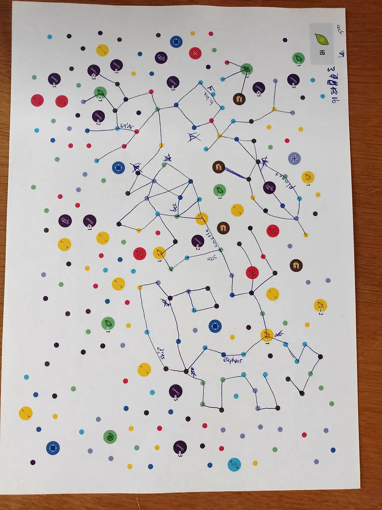
{}

Games took 20-30 minutes, as expected. Because you can freely rotate the paper (while drawing or guessing), orientation is also never an issue.

The only thing I don't like, is the noise that different numbers create. A single map might have _lots_ of unique numbers (added to powerups, added to words). This can get overwhelming. I've noticed this issue before in games, and the solution is always to just pick a smaller set of "easy numbers".

Instead of allowing _all_ numbers beween 0 and 20, you only do multiples of 5 (5,10,15,20), or multiples of 4 (4,8,12,16,20), or _both_, but not more. This means that the numbers in the game will mostly be the same _and_ they're easier to remember and use.

This applies to the lines/points you get per word (especially the lines), but also the powerups that have a number. 

{}
If you have 17 lines for your drawing, and then pickup a -3 lines powerup, then a +2 lines powerup, and a +1 points at the end ... yeah, you're losing track of that. If, instead, you have 16 lines, and each powerup does +2 or -2, those numbers are much easier and more consistent.
{}

Finally, some categories are clearly harder than others. (Looking at you, "occupations". How on earth do you draw a "farmer" with 12 lines?) I wanted to keep them, for variety and challenge, because drawing a farmer is way more interesting than drawing another fruit that is easier to guess. Thus, I added "bonus lines" to these categories (balanced by hand), which means you can now draw a farmer with 30 lines if you want.

### Words-on-board

This variant was too easy. With the words printed on the board, you only get _one_ guess. Even so, because you know the ~25 possibilities, it almost never happened that somebody guessed wrong.

Additionally, I realized one major oversight. The number of lines are also public information, which means you can just count how many lines a player used ... and find the one (or two) words in the list with the same number.

{}
This issue wasn't as big as I thought, because often you won't use _all_ your lines for a drawing. And adding more lines, randomly, for the sake of it usually adds confusion above all else.
{}

The first step towards a solution was to tweak the word data:

* The points per word are _lowered_ (by some fraction) and _normalized_. So you need to guess more right, and there aren't clear "big scoring words" players will choose.
* The lines per word can only be one of two values: 10 or 20.

But that wasn't a full solution. Real solutions would be ...

* To add way more words, so there are 50-100 possibilities => infeasible, though, due to lack of space on paper. (Although I _can_ fit perhaps 20 more words in there.)
* To fold away this part of the paper, so players can't look at it => imperfect, as players will still memorize many words as you play the game
* To put _really hard words_ on the paper => this would actually solve it!

If somebody just tried to draw a doctor with 25 lines, and other options are farmer, accountant and president ... good luck guessing the right one! The drawing actually needs to be good and specific.

But what about people without a good (enough) command of English? What about children playing the game? I don't like such a disconnect in difficulty: words are usually _very easy_, unless they are _printed on the paper_.

The best I can do is _recommend_ more difficult words. Clearly state, in the rules and website, that this variant is much _easier_ and therefore likes it if you increase word difficulty.

Then I got **another idea**. There are two things that determine the difficulty of this game: difficulty of words, but also difficulty of _drawing_. Maybe I can add a rule that makes drawing much tougher, when the words are on the board? To make this easy to learn (and remember), such a rule/mechanic could be printed with the words.

* Each word has a colored dot => your drawing must start with this color
* Each word has multiple colored dots => your drawing may only use these dots (probably too hard)
* A wager => you can "bet" on your word being guessed right. You get only _half_ the lines, but score _three times as many points_ (if guessed).

I feel such a simple idea would solve the whole issue, but I'm not quite there yet. Let's move on.

### Maximum guesses

The rules suggest using a timer, if you want, to limit turn length. But I know many people who don't like timers with games. (Makes them nervous, they don't like adding technology, whatever.)

However, without a timer, a game like this will drag and become less fun. The playtesting revealed this to be true once more: you _really_ want a limit on the guesses. I didn't want to add another number, or mechanic, or whatever.

As such, the rule simply became:

> You get as many guesses as the number of lines (that you were allowed to draw)

A simple rule, using information we already have, which should work. The number of lines is usually between 10-20. Even with some wild or accidental guesses, this leaves plenty of room to guess it right.

It's not perfect---I'd still recommend a timer any day---but it's much better than nothing.

### Target Food

When we played the first _competitive_ game, I immediately saw my next oversight: there's no space on the board for _both_ teams to race towards the same target food. (Also, the game then takes twice as long to play.)

A simple rule change:

> In competitive mode, the first team to reach _half_ the target food (rounded up), wins

In general, I raised the target _slightly_. Only a few points in most cases. But I felt like our practice games _could_ be over too quickly or decided by two huge words. (Like, somebody got "banana" for 6 points somehow: 4 points normal, +2 bonus from powerup. Everybody can draw and guess banana :p Two of those words, and you already won with the current target score.)

### Another rule change

Right now, the rules said that "a powerup grabbed is true for the whole turn" ... including the points before it. So, you weren't even allowed to pass a "repel" point, if you already violated its rules with earlier lines.

This is unnecessarily difficult to track and think through. I also don't see what it accomplishes, or why I did it this way.

It changed to the more intuitive rule (that all my testers assumed by default):

> Once activated, a point's power is true _from now on_ ( = for the remainder of your turn)

### Action ants

This is more of an interesting remark. This expansion gives each player an _ant_ that walks around, and each drawing must _start_ with the dot where this ant currently is.

This turned out to be a _great_ way to speed up turns and decision making. To actually simplify the game. Because now you _knew_ exactly where to start. All other locations, all words that are simply impossible there, fall away. 

It helped reduce "analysis paralysis" so much, that I even considered moving it to the base game. But I didn't, because it just meant too many rules and complexity for a first game.

### Sneaky Spots

In general, I lowered the _number_ of powerups (in total) a tiny bit. It was _just_ too crowded and too hard to 

Most of the special locations worked wonderfully and appeared in the right quantities, but not all. 

* The **"distance"** appears way too often for how "restricting" it is. Also, the measurement of using your pencil is too vague (the lengths of our pencils were often too long, and varied a lot). A better measurement, in practice, is to use the _word card_ or your _thumb_. I also lowered its probability significantly.
* The **"repel"** powerup had its probability slightly lowered.
* The **"add"** powerup had its probability raised.
* The **"stuck"** powerup made me doubt its existence :p It says: "immediately stop drawing". Yes, it's simple, intuitive, and blocks how you can draw. But is it fun? Is it interesting? People just draw ... around it, as if it wasn't there. A more interesting action, I think, is to "erase an existing line/point". Or combine both: stop drawing and erase one line and one point.
  * After further consideration, this is never a good idea. Let's split it into multiple powerups. The one in the first expansion is simply the opposite of "add": remove a point.
  * And if we're doing that, let's give numbers to these. So you can add/remove multiple points, which is actually more useful. 
* The **trap** powerup (for ants) felt similarly "semi-useful". Yes, it forces you to go around it. But most shapes are close together or closed anyway, which means there's often an alternative path (for your ant to use) anyway. It's also the only one that activates differently than _all_ other powerups. A better rule is: "if used, you may not move your ant (at the end of your turn". Consistent and more powerful.
* The **"teleport"** powerup (for ants) had its probability raised _significantly_. While playing, we realized that you can easily get your ant stuck in some corner. Which means the next two drawings you do are (basically) impossible, because you have to 100% draw through all your previous drawings.

The two more creative expansions (*Coop Colony* and *Antertainment Break*) had their probabilities lowered slightly across the board. When you play these, it's more for fun and wacky situations, and having these powerups occur too frequently destroys that and just makes the game more thinky/strategical than it should be.

As mentioned, the _numbers_ for these powerups were simplified (only multiples of 2). But I also made them more extreme. A powerup that gives "+4 points" is enticing and might lead players to draw in weird or creative ways. A powerup that merely gives "+1 point" is barely registered by players (in practice).

Besides that, more ideas for powerups appeared while playing. 

* **Eraser**: erase X existing lines. (The "stuck"-alternative, part two.)
* **Solid**: color in a closed shape on the board. (Simply add scribbles, making the area within completely solid and unusable.)
* **Eyes**: draw one circle in _empty space_ (between the lines). It can be any size, but cannot include an existing point or line.

{}
This caused me to add an extra expansion, and move some of the earlier powerups to this one. Otherwise you have one expansion adding _eight_ powerups, and the other only _three_.
{}

### A finished game!

With all these tweaks, some rule changes or extra rules (mostly for the words-on-board variant), the game is solid and done.

I was able to test it a few more times, and everything seems to work out. The solid core hasn't changed, and any (potential) issues have been addressed. 

Photomone turned out to be a fun party game, for any group size (small or large), which you can explain in less than a minute and play in half an hour. All the different ways to play also function like I wanted: all of them are easy to use and understand, while allowing you to play the game any way (or anywhere) you like.

A quick game you can always play. Or keep in your bag to whip out when you're somewhere else, perhaps traveling or waiting. A game that's more challenging than you think ("why are all those dots in the wrong locations for me!?!?"), but never impossible or frustrating.

I'm very happy with it!

## Conclusion

As mentioned, I wanted to make this game look more special. Go outside of my comfort zone **visually**, really polish it more, learn new styles or techniques. But in the end, the space just wasn't there. I had to keep icons _very_ simple (and cartoony, with a thick outline) to make them easy to read on the board. And besides that, there are no major visual elements to this game.

But I know I'm a perfectionist. I'm happy with the game. It works, it's easy to learn and play, it's fun. What more can you ask? 

I actually learned a lot about _programming_ these kinds of (interactive) tools through this project. Expertise that will certainly help me with even more innovative (board game) ideas going forward.

Soon, a few Photomone spin-offs will launch. As always, they have their own page, devlog, everything. So that's it for now!

Until the next devlog,

Pandaqi