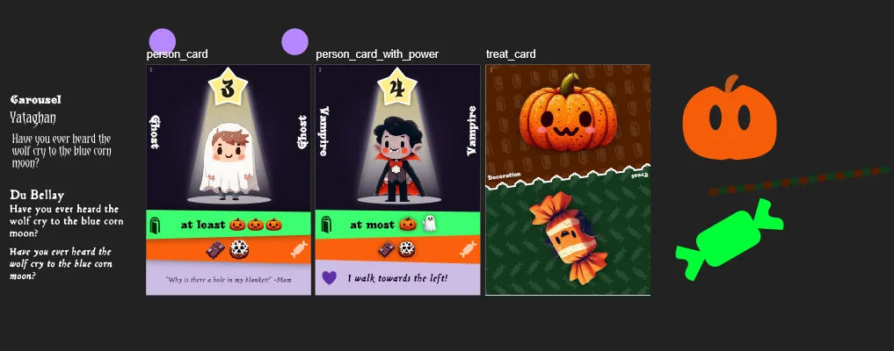
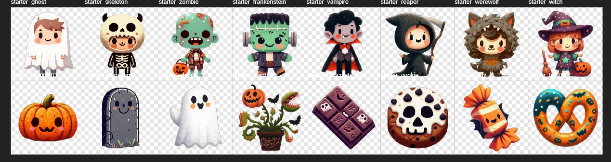

Welcome to the devlog for [Pumpkin Patrol](https://pandaqi.com/pumpkin-patrol).

This one will be MUCH shorter (and a bit different) than the usual devlogs. Let me explain why.

## Why?

It's 6 days until Halloween. I wake up in the morning, go outside to exercise, lay my eyes on a _huge_ pumpkin that the neighbors dropped besides their front door, and my brain is like ...

> "Voila, here are two ideas for Halloween-themed games, and I'm pretty sure they will both work!"

I was close to burn out on my current project, so I was pretty eager to do something else for a few days. 

(_What's that current project?_ Easily the most complicated random board generator I've coded to date. Learned a lot from it, especially going forwards, but it was _really hard_. I am not sure when it will release.)

So now I have a choice. Do I drop everything and race to make that game before Halloween? Or do I write it down and just continue with my planned day?

Well, you know me. I dropped everything and went to work.

And that's why I write this devlog _after_ Halloween. I simply didn't have time to track the process, to think longer than two seconds before making a decision, etcetera.

It's more of a summary of what I can remember from the past week of work :p

## What's the idea?

As always, the core idea is simple.

* Players have cards in their hand that show both a _decoration_ and a _treat_.
* On your turn, you can play X cards in front of you to "decorate your home".
* After every round, people ("Person Cards") will walk around.
* If your home is pretty enough, they stop at your place.
* If you can pay them the treats they want, you score their points!

This continues until all Persons are scored.

I thought this was _very_ thematic and also had some unique elements.

* The constant tug-of-war between using cards for decoration or treats (which are both permanent once used)
* Predicting where people will walk (this turn or the next) and making sure the right ones stop at _your_ front door.
* Which provides extremely high interaction between players, without being complicated.

As always, again, very simple core ideas quickly reveal issues once you start to work on them.

## Issue 1: you can't play cards 100% of the time

For a card game to be balanced, you also need to be able to _change_ or _remove_ cards. (From your hand, from your decoration, from the deck, whatever.)

So the action on your turn changed to.

* Either ADD a card to your decoration.
* Or REMOVE a card and draw a new one.

This still wasn't perfect. It's too slow. Let's say ...

* You can do **two actions**.
* And when discarding a card (from your home or your hand), you draw _two_ cards from the deck.

Some quick testing showed this to be a nice balance between losing cards (by decorating or paying treats) and getting new ones.

## Issue 2: how do people walk?

At first, I considered the following.

* All Person cards have a different _score_.
* They walk in order of score, from low to high.
* They'll keep walking to the player on your right until they find a home that meets their requirements.

As I wrote my generator, however---which also aims to _balance_ the cards---I realized requiring unique scores was unattainable.

What if I wanted to add an expansion? What if you wanted to mix different sets? What if two cards are simply both worth 4 points, and making one 3 or 5 points would be unbalanced?

A host of issues. I sought something better.

* The player with the **most decoration** decides the order. 
* In case of a tie, the player closest to the current start player wins.
* (Start player moves to the left after every round, as in basically all games.)

I like flexibility in terms of assembling your deck or what cards you use. I also like _encouraging_ players to be proactive, in this case by rewarding them for playing more cards in front of them than other players.

## Issue 3: how to balance the cards?

A this point, it was clear we needed two card types.

PERSON: Shows ...
* A cute image of somebody in Halloween costume
* A score
* Requirements for decoration ( = they only stop at you if you have at least those types)
* Requirements for treats ( = pay that to score them)
* Optionally a special power or flavor text

HAND: Shows _two_ parts. (One at the top, one flipped at the bottom)
* This is either a decoration.
* Or a treat.
* And this can be _doubled_ or converted to a _wildcard_ (which is "anything you want")

I went to work sketching a possible look, finding a style, telling the computer how to generate these cards.

Below is an image of the first sketches, which, due to the time constraint, basically became the final layout.

While going full steam ahead, however, I _still_ wasn't sure what to actually put onto the cards.

* How many decorations do we need?
* How many treats?
* Shouldn't they have a different value or probability? Otherwise they're just interchangeable.
* But wait, if a pumpkin is twice as likely to appear, shouldn't it also appear twice as much in the requirements of people?
* HOW DO WE DO THIS?!?

## Coding a "Balancer"

After a few false starts, I finally coded a system that worked and gave good results. Below I'll summarize my approach.

First of all, each set only has 8 Person types, but they each appear twice. It's pretty hard to score some people, so I imagine 16 of them is enough for a ~30 minute game.

The number of decorations and treats is 4. I considered picking 3, but that felt like it lacked variety and most cards you received were basically the same. No, 4 was perfect. (It's also nice that 4 + 4 = 8, which feels consistent.)

Now comes the crucial part.

* Decorations/Treats have a **value**. Low values appear a lot, high values appear rarely.
* Persons calculate their **score** by _adding_ the value of all their icons.

Everything is _weighted_ by these values. 

### Hand cards

For example, the number of Hand cards is currently set at 40 (I believe). 

* Each Hand card shows 2 things, so I know that I have 80 spots to give away.
* For each type, I calculate how many spots they should get, based on their value. 
* Once I have this list, I can just randomize it and create all the cards by popping off the last element each time.

This balances the Hand cards. You'll notice that in the starter set, a pumpkin appears _way more often_ than a carnivorous plant.

### Person cards

How to balance the People with it?

* I step through the numbers 2 to 8. This counter tells me the **number of icons** this person should show.
* I randomly divide these icons into two: how many _decoration_ requirements and how many _treat_ requirements.
* Like before, I have a list with spots, weighted by value. I draw however many icons I need from that list and permanently assign those to the person.
* Then I sum their value to get their score.

So, as before, you'll notice many more people want a _pumpkin_ (low value, frequent) than a _plant_ decoration (high value, rare). But if they do want a plant, their score is much higher.

### Going one step further

This is nice, but card games like these usually benefit from two additions: doubles and wildcards.

Doubles are, again, assigned through a weighted list. 

* I say "I want X% of all icons to be doubled"
* Then it creates a list with all icons to double, where low value icons take way more spots than high value ones.
* I randomly step through all hand cards, and if a type is still in that list, then I double it!

I do exactly the same for wildcards. However, I make sure that no wildcard is ever doubled and that a "double double" card is rare, as that felt too powerful.

The reasoning for the weighted list is the same. Pumpkins should occur more, so they should be doubled more. But because they are "low value", it also isn't a "huge advantage" to get lucky and draw a card with doubled pumpkins. (Otherwise the game just becomes about "who can get the luckiest and draw the most doubled high-value icons?")

Initially, I added a check to make sure the top and bottom sides were different. (One a decoration, one a treat.) But then I realized ... we don't even need that! 

* If a card shows two of the same type, it's still a (tough) choice which one you want to use.
* If a card shows two identical icons (extremely rare), that's also a nice variety to your hand and strategy.

The more I develop games, the more I realize that we have all these assumptions in our head (like "I must code this check and that check and balance that other thing!") ... while reality usually benefits from just keeping things simple and seeing what happens.

That's it for the Hand cards.

For the Person cards, I had to try another strategy. Because there were so few people (with so few icons in total), I couldn't randomly replace some of them with wildcards. It might mean that you end up with NO person requiring a certain treat/decoration, or a person being only wildcards, and the more I thought about it, the messier it became to balance/check for all that.

Keep it simple, Pandaqi. Keep it simple!

We also had another issue: duplicate scores. It could happen that the generation yielded, say, 4 People who _all_ scored 6 points.

I tried to kill both issues with one stone :p

* When scoring the people, it checks if its score is duplicate.
* If so, it finds the closest score that's _not_ already used. (Actually, it calculates the _distance_ to this ideal score.)
* If that's below us, we replace "# distance" icons by wildcards. (Because that makes the person _easier_ to score, thus allowing a lower score.)
* If that's above us, we add "# distance" wildcards. (The person becomes harder, but not overly complicated due to all additions being wildcards.)

In practice, this results in most randomly generated sets having 1 or 2 people ... with 1 or 2 wildcards ... when they make sense. (And they all have neat unique scores!) 

And if they don't appear? That's fine. Wildcards should be on the Hand cards---they should be part of a player's actions, strategy, unique considerations---not on the people. 

* If people have too many wildcards, then what's the point of having different people at all? Players could use almost any set of cards they like to attract/score them. 
* Because people are shared and unchangeable, these wildcards would be equally true and consistent for all players, which just means a boring flat playing field.

So I'm fine with people rarely having a wildcard in their requirements.

That's good enough for me.

{}
By the way, there's some scaling going on. Otherwise the scores could be slightly too far apart, with one Person perhaps scoring "1" and another scoring "18". All scores are multiplied by a value below 1.0, and kept within reasonable bounds.
{}

## Visual Style

I think of Halloween, I think of ...

* Black, (dark) purple, and orange tints
* Playing with dark and light
* Wickedness, wacky designs, slanted edges, unpredictability

I found fonts to match. (The goal here is always: "find a font that looks clearly unique and thematic, but ALSO very thick and legible")

I sketched those card designs with some slanted edges and a nice beam of light. Initially, I wanted to add some background in that darkness, and maybe attach the beam of light to a lantern. (To have it "make sense" why these people are illuminated by a spotlight :p) But alas, I ran out of time.

I added a pattern of icons to the Hand cards, otherwise they felt empty. (While any other background would be the other extreme: unnecessarily busy and distracting.)

Then I asked generative AI to get me some kids, that looked cute and colorful, in a Halloween costume. It _somewhat_ knew what to do.

I finetuned the prompt perhaps 10 or 20 times, slowly leading towards the current look.

* A grainy texture over the whole thing.
* No outlines and soft edges.
* Somewhat realistic and detailed, but not overly so.
* Clearly kids, clearly in costumes (if possible)
* In a front-view-like pose. (I tried more dynamic poses but it just became messy, even without everything else on the cards.)

Below is an image from the first set, from within my graphics software. (Contains both characters, decorations and treats.)

As always, I had to edit or draw parts myself here and there. I obviously tried to match style and make it all look seamless, but that's really hard when everything has this grainy texture over it. 

Again, as long as the art was consistent and clear, I was happy with it, because I had no time for more. (Also, I still use a free online AI because my own computer can't handle it AT ALL, and I have a low limit on how much I can generate each month.)

## Finishing Touches

I finished the whole generator. That was hours of somewhat tedious work, but hey, the end result is that you can now just press a button and it generates pretty cards on the fly (in ~15 seconds).

### Special Powers

In doing so, I filled out the next few sets, and added **powers** to the cards. Just something simple the person could do.

Not all people have powers. In the starter set, half the people are just "regular". (They do show a funny tagline, which is styled clearly differently from being a power.) 

It's a mistake I---and many newer designers---made many times: giving _everything_ in the game a special action or some unique ability. It's unnecessary, overwhelming and unbalanced.

The game should work without the powers. They're just extra spice on top. (Spice that is added more and more as you get into more advanced sets.)

{}
Also, I made the interesting decision to change the tense. Powers are written in active first person: "I walk in the reverse direction". Taglines are written in third person: "Has many skeletons in their closet".

Not sure if it's a great idea. But it was something to try and so far I think it's fitting and makes the distinction more clear.
{}

### Scratch that: let's improve

Everything before now was done in a single day. I finally went to bed, and as always, I woke up with a brain filled with potential issues and better ideas. (This is why it's better to plan projects in a way that you can regularly take a break for a few days. When inside a project, working non-stop for 8 hours, you miss a lot of obvious errors.)

**First of all**: I moved special powers to the _second_ set. Whenever I create a game, my brain automatically tries to "explain" it to other people in my head. In doing so, I noticed that these powers made the explanation _just_ a little too long and convoluted for my taste. For a first game, let's just leave them out entirely.

**Secondly**, I realized a silly card that could occur at the moment.

* One side shows a specific treat/decoration
* While the other side shows a WILDCARD for treat/decoration

This is useless. The wildcard means "anything", so it's a superset of the other side and _always_ more valuable.

Looking at the final generated PDFs, I found the number of "silly cards" to be too high.

So I did end up creating a proper function to combine two sides in a "smart" way. I was happy with the cards when I did the following:

* Don't allow two sides that are identical.
* Don't allow a wildcard of a type when the other side has the same type. (Unless the other side is a double, because then it becomes a meaningful choice again: "do I want this card for 1 _any_, or 2 _chocolate_?")
* With 25% probability, nudge the generator towards picking two different global types (so treat/decoration, instead of treat/treat or decoration/decoration). This means it's not forced and there's still a nice randomness, but the deck does _lean_ toward cards with this split.

I was afraid this would be hard, but it was done in two minutes, because for once I'd already coded the whole thing in a smart way! (Who would've thought that creating 20+ game material generators actually teaches you something about how to do it well!)

**Thirdly,** as shown/explained earlier, I had thrown everything into _sets_. One set contains 8 people, 4 decorations and 4 treats.

As the size of the game ballooned to 4 sets, however, it felt pretty pointless to keep creating new images for decoration and candy. In the end, the only difference is their _value_ behind the scenes, nothing else. (And I didn't want to complicate the game by adding some special powers or other rules to these types.)

Yes, 4 sets of different _people_ made sense, as they have different powers/scores/requirements. But the number of treats/decorations could probably just stay low.

* One set of decorations with consistent, balanced values. (Example: 1, 1.5, 2, 2.5---the base game.)
* One set of decorations with in-between values. (Example: 0.75, 1.25, 1.75, 2.75)
* If you pick the "random" option, it will randomly pick 4, so you might end up with any mix of this that is closer or further apart. (Example: 0.5, 1.75, 2, 2.5)

There's nothing else to do here. Beyond this, it would all just be visual variety with no purpose. 

Adding types with a super high value (3+) leads to numerous issues, as I already tested.

* If a person wants a few of these, their score quickly balloons to 15+. (And in board games, you ALWAYS want to keep numbers low and preferably within the 0--10 range.)
* They are so rare compared to the other types, that only 1 or 2 might be in the _entire deck_. 
  * (Example: with 46 cards, if one extreme is 0.75 and the other is 3, then the other one will only get 5 icons. If any of them are doubled/replaced by a wildcard/don't fit anywhere, you might be left with only 2 cards that have it in the entire deck.)

So ... I need to decouple the different types. Keep separate spritesheets/sets for each type, and people can select the ones they want on the website.

This has the added benefit of allowing easier deck matching. Because icons are re-used, you can generate expansion cards later and can just play them with the cards you already have!

### Special requirements

All requirements so far are the same. 

* I will visit if you have _at least_ these specific decorations.
* You can score my by paying _these specific treats_.

This is begging for some more specialized requirements.

* "At most": somebody who will only visit if you have _at most_ a certain set of decorations.
* "Sets": somebody who wants a set (like "three of the same type") that can be fulfilled in different ways.
* "Cards": somebody who just wants a number of cards, no matter what's on them.

I ran out of time, though. 

And that's perhaps a good thing. Otherwise I might've fallen into that old trap again: adding these "special requirements" to the base game, making the first games needlessly complicated.

Right now, without these "specialties", the rules are extremely simple and tight. I want to keep that for your first game.

I will surely add these, but only on later sets / more advanced cards.

UPDATE: I have added these! It was relatively easy to plug this into the existing systems, with matching graphics. 

Though I kept it simple and restrained: I don't "combine" different types with one another. It would be a mess to balance (or even explain) a person who wants "type A, a card, and a set of 3".

### Possible rules improvements

I ignored other rule ideas for similar reasons.

For example, an open _market_ would probably be nice.

* There are X open Hand cards and Y open Person cards.
* So whenever you draw cards/add a new Person, you can _choose_.
* (And you can predict a few rounds into the future based on what's there.)

I wrote all of these down, but testing and polishing will show whether they have a place. So let's jump to ...

## Playtesting

### Sneak pre-test

I was able to do a rapid "sneak test" a few days before Halloween, with just three players.

I also realized _order_ wasn't important anymore when walking! People don't influence each other (especially now that they have no powers), so all people can just walk at the same time / in any order.

This removed three rules (and, in my eyes, a nasty exception) from the explanation, which is nice. In fact, by rewriting 2 of the other powers I had planned, I was able to remove "walking order" from the _whole game_!

I realized this just before testing the game, which allowed me to make the explanation and gameplay even smoother.

First, the good parts.

* It took 3 minutes to setup + explain the whole game.
* It **works**. You are never stuck, there is no gap in the rules, there is no clear best strategy or unfair part.
* The players had fun and were already able to strategize better halfway the game.
* It looks simple and approachable on the table.

Now the "bad" parts.

* With three players, starting with one person in front of you is too barebones. Not enough options for attracting, not enough movement.
* A starting hand of 4 is _just_ too small to do anything meaningful on the first round.
* If a person can't go anywhere, it just stays in front of you. This is ... boring? Most people can only walk ~50% of the time, which means many people get a visit (from some high-scoring expensive person) for free!
* There's just too little interaction. Too few ways you might hinder an opponent or do something more special.
* At the end of the game, when there's just one (or two) Persons left, many players have nothing left to do. (They can't obstruct the other players, while they're too late in the cycle to attract anything anymore.)

How do we solve this?

With three players, simply start with 2 people in front of you. (Also, the pile of people is _faceup_, so you know what's coming up.)

Also, default hand size becomes 5.

To get more movement, I can say: "if a person can't go anywhere, they simply move one step". But that doesn't solve the other issue: now players still get a person "for free". (Which is especially bad if that person had a super high decoration cost, which means you might get a 10-point card for just 2 pieces of candy.)

No, it feels like Persons shouldn't be at a door by default. Like they should be able to be "nowhere (yet)".

After some brainstorming, I ended on the following.

* If a person can't move anywhere, it just stops between two players. (It's at nobody's door.) => This also means that, when you draw a new Person after scoring, you place it between you and the next player.
* Persons that are currently nowhere, can be attracted for one _fewer_ icon. (Example: somebody wants 2 Pumpkins, you only have 1, they still come to you.)
* If you attract a person from another player's door, steal one of their hand cards.
* When drawing a card, you may draw from the facedown deck _or_ the discard pile.

Here's my reasoning.

* We don't want a "pool of Persons" in the center of the table that you can attract. Because then we'd need an _order_. (What if two people both have the requirements for that one Person in the center?) And I just worked so hard to simplify the game and remove the need for any order (and extra rules around it). It would also be overwhelming, probably.
* So the most logical thing is to always move the Person, but if there's no destination, to simply keep it in limbo ("walking from house to house") between the two players. It still has a clear location in the cycle. You just can't "get it for free".
* Attracting people is quite hard, but not impossible. The number of icons feels almost balanced. As such, we only give a discount if the Person comes from "nowhere".
* But if it comes from another player, I want to reward people for actively attracting (desired) people (and paying full price). I see that as an opportunity to add that interaction: steal a card.
* (Drawing from the open discard pile is just a simple and common way to add interaction and less luck. People might not want to throw something away, because they know the next player could use it. At the same time, if you _really_ need something, you can get it for sure when it's at the top of the discard pile.)

But then I realized order became important again. Because if you steal a card from somebody's decorations ... that changes whether people visit or not ... which means people must walk in turn order!

{}
You might start wondering why I dislike adding some order to this part of the game. I already listed some reasons above---adds complexity, adds little extra rules or numbers on cards---but another reason is _time_. If all Persons can move simultaneously, the walking phase is done in 15 seconds (and everyone has something to do). That makes the game way quicker. It stays active and moving at all times.
{}

So, we're forced to go back to the one part of the game that already happens in order: the turns adding/removing cards. I see no other option than to add interaction to _that_ part of the game.

I changed the "add" action to allow adding a card to _any_ home, not just your own. If you add it to another player's home, you may steal one decoration from them _if_ it matches an icon with your card.

This is the simplest tweak I can find that allows ...

* Interaction. (Mostly preventing others from attracting specific people.)
* But also a way to get a specific card you need (and lose one you don't).
* Without being overpowered, because you do a 1-for-1 trade (at best), which is worse than 2-for-1 when discarding.

I really don't want to add any more rules or exceptions to this rulebook. And at some point I just need to play it again, because I can't predict how rules will work out in practice.

So let's skip forward a few days.

### Actual test

With these tweaks, the real test came on Halloween.

So how did it go?

The same as any other messy game night with the whole family. (All 8 of us usually come together for holiday events.) The first 15 minutes it's a **mess** and everybody is struggling a bit to get used to the new game. (And I'm struggling to get heard over the noise .) 

After that, they all have fun and gameplay continues smoothly.

I could call it a day with that result. In the end, a table with 8 people (divided into 5 teams) managed to learn and play this game within 45 minutes.

But I'm always trying to shorten that gap of "struggling" or "messy first minutes", and I have some tweaks to make.

* That rule of "if the person comes from nowhere, you can get it for 1 fewer decoration" is the greatest source of confusion. I had to explain it 4 times, during round 1 and 2, before all players remembered and understood how to use it.
  * Additionally, now that I raised the number of cards _and_ allowed grabbing from the discard pile, it's too easy to get whatever person you want. 
* When only 1 (maybe 2) people are left, there's not much to do. The game should really be over. Players don't _want_ to continue playing.
* In all my test games, somebody won because they got _both_ of the high-scoring people. (Two 9s, 10s or 11s is a score that quickly becomes impossible to beat.)
  * And, in hindsight, that's obvious. _They already have the necessary decorations, of course they can score that person twice!_

So I made my final tweaks to the rules.

* That confusing rule just ... goes away. (I kept it as a variant, because it _does_ make the game easier to win and faster to play, also for kids.) => It's now more viable to score people for their full decorations anyway.
* The game ends as soon as 2 or fewer people are left. => Easy change, fixes that boring last round.
* You can only score each Person once. => This requires you to mix up your decorations, but also makes you _skip_ certain people, allowing them to pass through to other players.
  * _On top of that,_ you now have more guidance when placing a new Person in the field. You are sure to pick somebody you haven't scored yet. 
  * This was another slight source of confusion / being overwhelmed: which Person to add to the field, out of _all_ those options (near the beginning of the game)?

With these changes, the rules are extremely simple and clear, just as I like it. Any issues have been mitigated and gameplay streamlined. I played some more games against myself (later that evening) to confirm this.

{}
I'm at that age now where festivities continue until 9 PM and then everyone wants to go to bed. It's not like we celebrated Halloween until 12PM and _then_ I continued playing a game against myself for hours ;)
{}

The next few days, I spent some time tweaking really tiny things (phrasing in the rules, examples given, probabilities during generation), just to make sure it's as good as can be.

And then it was done.

## Conclusion

Yes, I finished this game a few days after Halloween. I already knew that the proper release would have to be _next year_. Probably about a month _before_ Halloween, so people have time to discover it and/or learn and/or print it before Halloween.

I left myself some work to do (writing marketing text, drawing the header, etcetera), but not much. 

I mostly wanted that gap so I could look at the project with fresh eyes. If you hyperfocus on a game, creating the whole thing _in a few days_, you're sure to miss some obvious errors or room for improvement.

So ... let's make a time jump to _one year from now_!

@TODO: Finish this, writing my final thoughts as I come back and completely finish this.

* I only made one "major" change to the gameplay. The old rule: place all Person cards faceup in the center of the table, pick any one you like. The new rule: they are placed in a _row_ and you must grab the first one.
* Why? Because it gives foresight (you can look ahead to see what's coming and prepare for that), while eliminating a choice that many first-time players get stuck on for a long time ("what Person do I add!? I don't know! So many options!"). It also simplifies the rules one more (tiny) step.

I had already predicted I'd be very busy this year with publishing a great many books, which is why I thank myself for already creating most of the rulebook and marketing assets (such as that big header you see on each game) way earlier.

Because with that, the game is now _done_! Hopefully at the perfect time for people to find it and consider it for their own Halloween festivities. And hopefully it gives them a fun evening, because it's always hard to know how a game will translate to strangers who must learn it from your rulebook. 

Until the next devlog, keep playing,

Pandaqi

