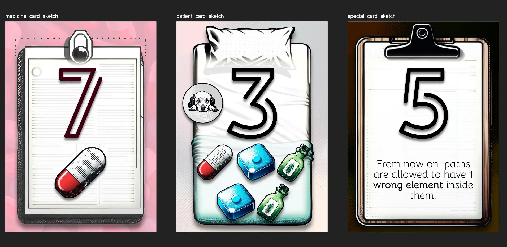

Welcome to the devlog for my game [Pyrrameds](https://pandaqi.com/pyrrameds/). In this article, I keep track of the entire process, discuss any problems I found and how I solved them, and why I did certain things. Hopefully it's interesting or instructive to read!

## What's the idea?

I just went to bed one day and suddenly had this idea.

* What if you had cards showing either _medicine_ or a _patient_ ...
* And you had to place them in a pyramid shape (following certain rules with numbers/neighbors) ...
* But you could only place a patient if there was a _path_ towards it with _all the medicine they need_?

The goal would be to get rid of all your cards first. If you do, you win.

The indirect gameplay is obviously to strategically _place_ the medicine in the pyramid, so you can then play a _patient_ attached to it later.

Would this work? I surely hoped so, because a few weeks later I found a small gap and just made it into a game.

## How to turn it into a full game?

We need some specific rules about placement. Rules that restrict you, such that you need to plan ahead and think strategically. But also rules that don't restrict you _too much_, making it impossible to place patients and win. 

I guess this was my biggest fear going in. What if the game just never ends because it's too hard to place patients in certain setups?

My first version of the rules said the following.

MEDICINE cards have a type ( = the specific medicine/color) and a number. You may only place a medicine card if there's a card below it (in the pyramid).

* If it's 1 card, the number must be _higher_ than that.
* If it has 2 cards below it, the number must be _higher_ or _lower_ than both. (Example: There's a 4 and 7 below the card. Then any number _below 4_ or _above 7_ may be played, but nothing between those numbers.)

PATIENT cards show a list of MEDICINE (types) they need. You may only place them if they are part of a _path_ through medicine cards which contains exactly what they need.

* Order doesn't matter. (Example: if the patient needs GREEN GREEN YELLOW, it's fine if the path is GREEN YELLOW GREEN.)
* You can't backtrack. That is, If you've gone left once, you can never go right again. (This prevents "looping" paths and cycling them endlessly to get any medicine you want!)
* The path must be exactly as long as the number of requirements. (This means it can't include anything the patient does _not_ need, or other patient cards, or any "noise".)

This felt like a solid start. 

Also, the pyramid became a double-sided pyramid. Having only one side made the game too short and too restricting.

## Doing a simulation

Most of my games have _interactive examples_ in the rulebook. (You click a button, it gives you a random round and how it's resolved. Which is a way better and more fun way to learn rules and see them in action.) 

If I have that, it's a small step to turn it into a _simulation_: just play 10,000 random games and track some statistics about them.

This is incredibly useful! I can track how long games take, how likely you are to be able to play a patient (of a specific size), how often games get stuck and can't be finished, etcetera.

Doing so revealed the following.

* The ideal number of **unique medicine** seems to be 4. (Anything higher and it becomes too hard to create the exact right paths. Anything lower and it's too easy.)
* The **number of requirements** for patients can range from 2 to 5. 
  * One or zero requirements is pretty useless, of course. One card =/= a path.
  * For numbers 2, 3 and 4, the probability of being _able_ to play one is pretty consistent. (Surprisingly, the patients who require 3 types are the easiest to get played by a slim margin.)
  * For a 5-medicine patient, the probability drops, but not too much.
  * Anything higher than that, though, and it's way too hard to play it.
* The average **possible moves** per turn is ~8. That's nice. Not too overwhelming, also not too restricting.
* The probability of **not being able to do a move** is ~30%. (More on that soon.)
* The **average number of turns** is ~38. This means ~9 turns per player, which is a fine balance.
* The probability of a game **never finishing** (probably) is ~3%.
  * I simply decided that any game that takes more than 100 turns is stuck and will probably not finish.
  * Keep in mind that that is _completely random play_. Any player with a brain will do better moves, which is why I don't mind this tiny percentage of getting stuck.
* Players that started with **more medicine cards** (as opposed to more patients) won the game about 2x as often.

My worry about it being "way too hard" to create paths was unfounded! It turns out, with the settings above, it's not easy but perfectly possible. Which is the balance you want in games.

As you see, however, the simulation left a few doubts.

* What if players _can't do anything_? Doing nothing on your turn is always boring AND increases the risk of a game getting stuck. (And 30% of no-valid-move turns is a percentage that's too high to ignore.)
* How to combat _very unlucky hands_? If you start with only patients, however rare, the game stops being a game for you. Similarly, if you only have 5-requirement patients, you have a much harder game without any tangible reward for it.

I solved the first issue with an alternative action (if you can't do anything): **swap 2 cards**. Not only can you actually _do something_, it's something that will likely _directly help you_ for next turn.

I solved the second issue in two ways.

* During setup, keep patients and medicine separate. Deal each player 2 of each. _Then_ shuffle the cards and deal until done.
* Playing a patient has _some reward_. At this point, I wasn't sure yet, but _more difficult patients_ should give _bigger rewards_.

## Final rules tweaks

### How to make swaps un-undoable?

The issue with a "swap"-like action, is that you can undo it exactly. The next player, if they don't like your swap, can just ... swap them back. This is never fun in a game and literally leads to a stalemate.

So, we need some extra tweak on when or how you're able to swap. One that guarantees most swaps can _not_ be done in reverse by the next player(s).

When perusing my notes, I found a small question to myself that felt like the solution: "How do we give more INFORMATION about what other players have in hands?? Otherwise it's hard to make sensible moves."

So let's change the rule to ...

> Reveal a hand card. If it's a patient, you can only swap cards of types they want. If it's medicine, one of the cards must be of that type.

Now other players know you have that card. But unless they _also_ have a similar card, and are willing to show it, they can't undo your swap.

### What's your Patient reward?

Now we can continue on our search for _more information_ (which basically means _more control/agency_).

One of the simplest rewards I can think of is:

> For each requirement on your patient, pick a player who must show you a Hand card. (If possible, this must match colors with the medicine.)

This _naturally_ makes harder patients give greater rewards, without needing to invent more complicated rules or add specific text to their cards.

### Numbers & Placement

Finally, a third doubt creeped in. That usually happens when doing a simulation, because it's just so easy to _tweak_ tiny rules and turn them on/off to see what happens.

* Medicine cards have numbers, patients do not. The placement rules would feel more consistent if _all_ cards simply had numbers. (Instead of saying "only check medicine cards, pretend the others aren't there.")
* Does it make sense that you must be _higher_ if you only have a single neighbor, but _higher OR lower_ with two? Is this too unintuitive?

Tweaking these settings showed me that it does not really matter for game balance. Strictly looking at the numbers, any variations on these rules had roughly the same probabilities for playing cards and patients. 

The biggest difference, actually, was game length. Making it much harder to place the right numbers made the game much longer too.

So, if that's the case, I opt to go for simplicity and consistency. The entire placement rules become this:

* All cards have a number.
* When placing a card, it has to be _higher than all cards below_ or _lower than all cards below_.

{}
I briefly played with the idea of "the NUMBER for patients is equal to their NUMBER of medicine requirements". Again, this is _fine_ when you look at the numbers. But why overcomplicate this? Just print that number on it then, like on all other cards, and it's much easier.
{}

## Let's make that!

As usual, I use a two-step process: 

* The first part of the code _generates_ all cards (with the right numbers, settings, texts, medicine requirements, etcetera).
* The second part of the code just _takes that list of cards_ and _draws them all_.

### Generating the cards

This is relatively straightforward.

* For each set (base game, expansion A, expansion B, etcetera) ...
* Check the medicine types included. For each type, create X cards. (These numbers are all read from a config, so I can tweak them at any time.)
* Check the number of patients it should have. Create those cards, while picking from the possible medicine options.
* For special cards, it just runs through that list of options and creates a card for each.
* Finally, assign all the cards we just created a _number_.

Of course, this is a bit too random. We want more control and a more balanced output. I've been doing this for a while, so my website has some built-in functions for this (or I quickly write a loose approach that works).

* For the **numbers**, it just includes the range 1--10 as many times as needed to cover all cards. Then it randomizes that list and picks the first element each time.
  * This just ensures that each number appears equally often, while allowing some slight randomization (because we will have a longer list than needed and a handful of numbers won't be picked).
* For the **patient requirements**, it uses a "balanced picker with margin". 
  * In summary, it keeps track of how often it has chosen each type. Whenever I request new ones, it will only pick from those that have been chosen _the least_ so far. 
  * Doing this consistently will mean all types are picked _roughly equally often_ when all is said and done.

A bigger challenge was the requirements for the _expansion patients_. 

The expansion also adds 2 new types of medicine ( + wildcard medicine). But if I only let the patients draw from _that_, all their requirements will be very ... similar. Almost identical. 

It works much better if they _also_ request some medicine from the base game, but not too many. They shouldn't overcrowd the _new expansion medicine_. How do we code this? How do we do it in a _clean, customizable_ way?

I ended up writing a custom setting in my "balanced picker" that can _penalize_ certain options, making them lag behind others on purpose. This way, the base types are still mixed with the expansion types, but they appear way less frequently in the end.

The _biggest_ challenge were _wildcard numbers_. Because the code assigns numbers to all cards at the end, there was no distinction between "base" and "expansion cards". But wildcard numbers should only appear in the expansion! (And I liked how clean and short the current code was!)

Then I realized this was only an issue because I tried to do both with _one_ variable. The `num` property on cards is considered a "wildcard" (which displays as a "?") if it's `-1`.

I could just _split that_ into two variables, `num` and `numWildcard`. If `numWildcard` is true, it simply overrides whatever the number is. This way, I can simply "mark" a few random expansion cards with `numWildcard = true`, and it all works out.

### Drawing the Cards

Honestly, after making so many games, I've become pretty "functional" or "practical" in my designs. I just want text to be big, numbers to be big and obvious, cards to be simple and effective. After playing the game once, people look past all your pretty designs anyway, because it's _about the gameplay_.

So I threw away my initial plans for elaborate cards that looked as if animals were inside a hospital bed, leaving only a tiny space ( = on the blanket at the bottom) for writing their requirements and such.

Instead, the number came roughly centered (nice and big), with the important icons (medicine / requirements) below it. Only the background and borders have some decoration and theming.

## Playtesting & Polishing

@TODO: write down playtesting results + conclusion