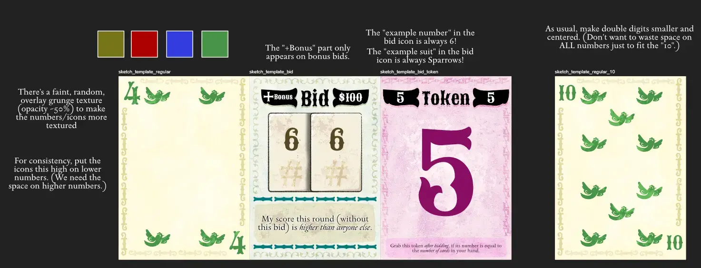
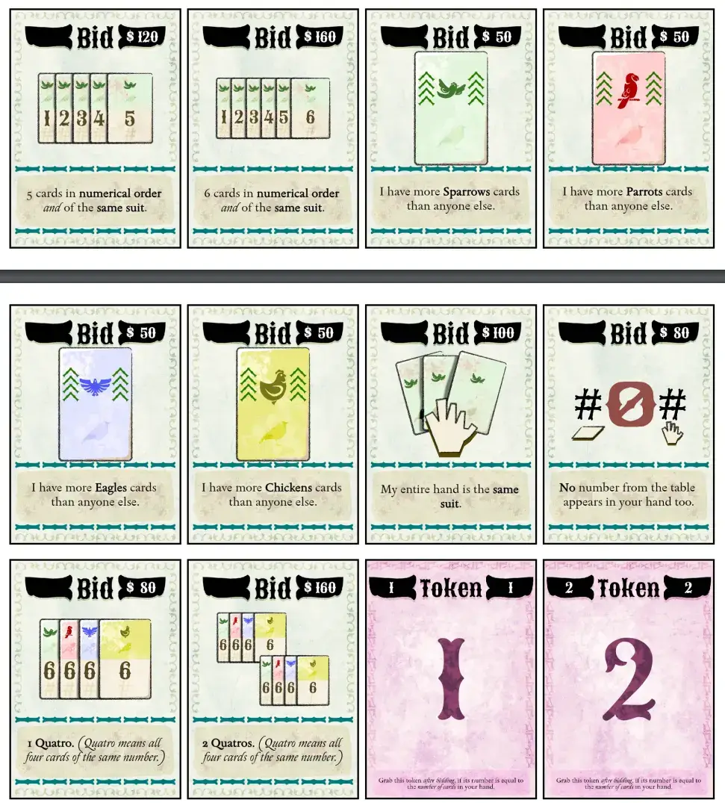

Welcome to the devlog for my game called [Six of Sparrows](https://pandaqi.com/six-of-sparrows/). 

It will be a short one, as the game was developed rather quickly and considered more of a "mini game" in-between bigger game projects. Nevertheless, the game turned out more than good enough, otherwise you would've never even known of its existence ;)

You can also check out the (very brief) devlog for [Bidding Blocks](/blog/boardgames/bidding-blocks/) that talks more about the original idea that spawned this game as a sort of "spin-off" or "twin game".

## What's the idea?

### Simplifying Poker

People like poker. Nobody remembers (or wants to remember) all the possible combinations and how they score, nor do they actually like the bluffing aspect. 

Of course, this depends on your group of people. But almost everyone with whom I've ever played poker did _basically no bluffing at all_.

* They looked up what they had in the instruction manual.
* If they bid nothing/small, they had nothing.
* If they bid big, they had something.
* If they went all-in, they had the best thing possible xD
* (They didn't care a single bit about what I did. I could bluff all I want, bid a LOT without having any good cards, and they'd just stick to their original plans. At most, I get a few pennies because everyone pulled out immediately.)

Sure, it's a way to play the game. But you really remove any strategy or gameplay poker had left, and turn it into nothing more than "get lucky with the cards".

It's also boring to have to wait until people have checked the manual again, and/or have discussions after revealing every time.

Again, depends on your players. But I've always been surrounded by players who need absolute extreme hand-holding to get through even the simplest of games, so that's why I usually design incredibly simple games with that target audience in mind!

And so this idea started.

* A set of "Bid Cards" is on the table: these cards _show_ specific poker combinations (and a few I made up for this game) and how much they score.
* One by one, players receive 1 card (to take into their hand) and the table receives 1 faceup card.
* After receiving a new card, anyone can decide to BID: they grab one of the Bid Cards available. (In other words, you've seen your cards and now hope to complete that pattern by the end.)
  * When you do, however, you also grab the Bid Token with a number equal to how many cards you have in your hand.
  * Your score at the end of this round is _divided_ by the Bid Token.
  * In other words, the _earlier you bid_, the _bigger your score_ (if you manage to complete it). A nice tug-of-war between risk and reward.
* This continues until everyone has all their cards (and bids), at which point we reveal and score.

A very simple game loop. All the things you can score, and which ones are better, are literally displayed on the table for anyone to see and read.

At the same time, bad hands don't really exist. If you feel your hand won't amount to a high-scoring bid, then you can take the risk and claim an easy-to-complete bid _very early_. (If you have 6 cards in your hand, and 6 cards on the table, then something like "1 Pair" is almost guaranteed. Depending on how many cards I end up including, of course.)

### Making it better

I briefly considered doing the same as I did for Bidding Blocks: just have people write down their bid + how many cards they held at the time on a piece of paper.

For this game, however, I wanted everything to be visible and tangible. Grabbing the Bid Card + the Bid Token is, for most people, a more clear and intuitive move in a game. It's more final, it's easier to understand.

It also cleans up that pen and paper for tracking only _how many points you got_ (each round), instead of muddling it with extra calculations or numbers.

Finally, this is what actually gave me the idea to make Bid Tokens limited. If someone already bid with 4 cards in their hand, then you simply _can't_. There's only one token with that number.

This encourages players _even more_ to do risky bids early on. Because if you don't grab that risky bid card _now_ ... you might not be able to next round. (In case multiple players want to bid now, the one closest to dealer gets it.)

Now the entire game could be played with just a few cards (Playing cards + Bid Cards), all information was public and out in the open, but we already have many elements of interesting risk/reward decisions.

Having these fixed bid cards, however, limits the likelihood of having _something_. We don't have access to all possible combinations from poker, no, only the ones on display this round. As such, we need to compensate and bring the probabilities up again by giving players more cards. That's why everyone gets 6 in the hand + 6 open on the table.

This might be lowered to 5, but then the name "Six of Sparrows" doesn't fit anymore, so meh :p

Finally, I added a few more bids that only work in my type of game. For example: "I will have more cards of suit X than anyone else". This adds a bit more spice and a bit more interaction.

### Expansions

I really want to keep the base game as simple as possible. Ideally, all my games should be setup and played within 5 minutes, even with complete newcomers.

That's why I moved the following rules to tiny expansions, even though I consider them very useful.

* There are two bonus bids: "WIN ALL" and "WIN NONE". You can grab these _on top of_ your actual bid.
  * The first one scores massive points if you end up being the BEST out of all players this round. But it's risky, because failing to have the highest-scoring pattern will give you massive penalty points.
  * The second one is for anybody who believes their cards are absolute rubbish. You score massive points if you end up _not_ having _any of the patterns_ available in this round. (Again, a slight balancing factor for bad luck.)
* In the base game, failing to grab a bid simply means ... nothing. You can't score points this round, nor can you lose points. It's a fine compromise if you think your cards fit that strategy, but obviously a bit stale.
  * Instead, the expansion adds _multiple_ Bid Tokens with number 10.
  * If you have no bid at the end of the game, you can still grab one (of the ones available).
  * But you must also grab Bid Token 10, which means any score you'll get will be diminished.
  * This felt like a great compromise between giving players "second chances" or "a nice backup", without ever being too friendly.

That last sentence says a lot, I think. Games are about fun and feeling good. Instead of being harsh on players or just saying "well you're just unlucky / well you just played terribly", make them _feel good_. Give them a nice backup plan or second chance, help the player in last place a little bit.

But do it in a subtle, simple way that's not "too friendly". Because then the other players will stop playing, because it's worthless---you'll receive massive bonuses when in last place anyway!

Anyway, this simple rule---you may still grab something, but its score is pretty much halved---accomplishes this nicely.

## Let's make that!

### Generation

Nothing special here. Loop through suits, loop through numbers, create one card for each.

I have a massive list of all possible _bids_ (including where to find their _icon_ in my big image of illustrations + their textual explanation). It just loops through those and creats a Bid Card for each too.

I briefly considered having different bids be added in different numbers. For example, very easy bids like 1 Pair or 2 Pairs might be added _more often_ to ensure players have something to go for. In practice, however, this made the deck of Bid Cards too _large_ overall, and it's really not needed when players can make their pattern out of 6 + 6 = 12 cards.

### Drawing

The title of this game was inspired by the book _Six of Crows_. (Just the title; the content of that fantasy book has nothing to do with anything in this game.)

The cover has this vintage, grungy, font and art style. That's why I chose to do the same thing for this game.

The cards look a bit worn, vintage, outdated, as if they were used to play this game a 1000 years ago too. The icons for suits and numbers had to look like they were always there, people just _found_ them. The bidding patterns had to look like ancient, wise messages scribbled into a wall to be deciphered by players.

At least, that was the vision. I didn't want to overcomplicate it, and could only spend little time on it anyway, so these were the sketches I did.

Close enough.

### Simulation

As usual, I created an interactive example for the rulebook, which also allowed me to simulate the game. The computer plays 10,000 random turns/rounds and gives me the results. I mostly check for averages and probabilities of stuff (not) happening, just as a sort of "sanity check".

In this case, I decided to forego the actual bid scoring in the example. It didn't add anything to add a mess of words just to reiterate what the clear _icon + text_ on the bid card already explains. 

No, the most important part of this game---pretty much the _only_ part---is the dealing+bidding phase. So that's the thing the interactive example actually says.

That doesn't mean the bids aren't scored. They are properly calculated by the code! It's just behind the scenes, and I only track that for the simulation. This was more work than I liked, but I had to be sure that the bids were actually _achievable_.

What were the results?

@TODO: CONTINUE WRITING AND FINISH

### Final Material

I made two screenshots of the final material to showcase the 3 different card types.

It's clear that, if I actually take the time (even just a few extra hours) to put into the visual side of my games, they can look really great.

It's also clear that my broken old laptop does not like this :p I could only generate this game in the smallest, most minimal mode, otherwise the visual processing was too heavy and it lagged and then crashed. I had to create the downloadable premade PDFs (at full size/strength) using some other shared device.

What I've been doing so far is still, I think, the best option. Most of my projects are considered "tiny" and I won't spend too much time on art or details, but once in a while I pick _one_ project where I purposely spend much more time making it really big and pretty and detailed. That's the only way to keep up with my pace of ideas, without burning out.

Anyway, happy with how it all looks, pretty close to the original vision of some classic or antique game. (Also love me a good font with cool _italics_, which is why I use that font style a lot on the bid cards.)

## Conclusion

Another tiny but really fun card game done! It's a bit bigger than its twin game _Bidding Blocks_, but that's because I purposely wanted everything tangible and on the table. You can play this game with a standard deck of cards; you'd only need to print the Bidding Cards + Tokens separately.

I feel this game accomplished what it set out to do. Poker, but simplified and more geared towards a casual audience, with the bluffing aspect _traded_ for strategic bidding. 

The theme/aesthetic I chose might work against that actually, by giving people the impression it's this really serious grungy game. That's why I tried to keep it simplistic, colorful, and clearly light-hearted.

But oh well, I try not to overthink these smaller projects. Just create the idea I have as best as I can, in a short time frame, then publish it to the world once polished and finalized. With this game, that happened quite easily, perhaps because of the solid backbone that poker combinations provided.

Until the next devlog,

Pandaqi