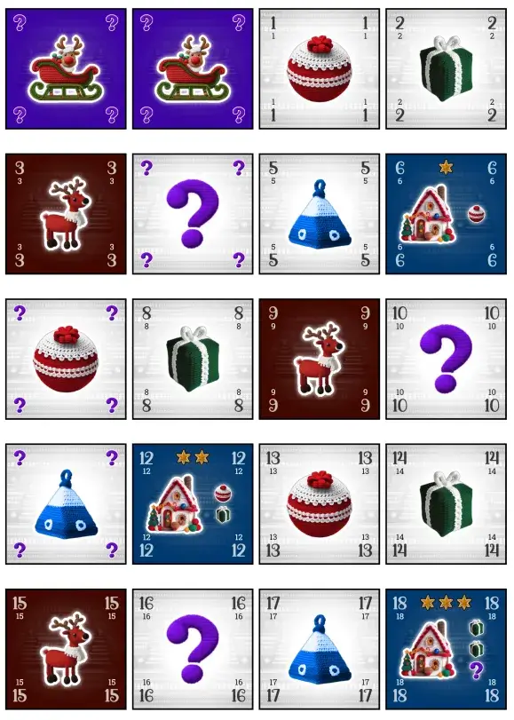
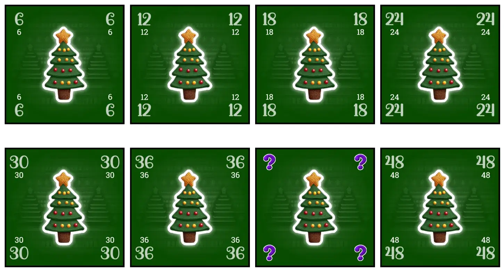

Welcome to another devlog, for another holiday-themed game, and this time it's [Sleighwell](https://pandaqi.com/sleighwell/). (The initial name was **Reindeer Road** and then **Reindeer River**, but those names were already claimed by pretty big things!)

I'll explain the process for creating the game, any mistakes or interesting insights along the way, and whatever else seems interesting.

## What's the idea?
Christmas was coming up. My brain immediately started thinking about Christmas-themed games. (That's just how my brain works. After all those years, I've decided to just go with the flow.)

And then, one day, I woke up with this:
* A cooperative game
* Where you play cards to the same grid.
* Which show _presents_ and _houses that want presents_.
* And there's a sleigh, which is the crucial part of the idea: "If the sleigh can move in a straight line towards a house, and collect all required presents along the way, you score that house!"

In other words, you'd have to place presents in such a way that they're in a straight line towards a house that wants them. As soon as the sleigh is in the right position, you can take that action. ("Deliver presents to that house and score points!")

## Refining the idea
Of course, delivering presents means that the presents should be **gone**. So if you do a sleigh action, all the tiles you passed along the way (in that straight line towards a house) are gone.

**First problem:** this might split the board into two or three parts. What to do? For now, I used a rule from a game I recently played: "If the board is split, players must first play tiles to _remove_ this split (if they can), before doing any other actions."

**Second problem:** placing a card anywhere you like obviously isn't that challenging. I've always wanted to make a simple card game with _numbered sequences_, so let's do that now!

I decided to put (unique) numbers on the cards, and add the rule:

> All rows/columns must be either ascending or descending.

In other words, if you place a tile in a row that's ascending (it already has a "3" and an "8"), then it must continue that trend. You can't place a "6" behind that 8 anymore. Same for the column in which you place the tile.

At this moment, I was afraid this might be too restrictive, but I'll soon talk about my first paper prototype (which I played against myself) and the practical reality of the idea.

**Third problem:** well, not really a problem, but an opportunity. I felt the game needed one extra tile type. One extra little mechanism to help with placement and moving the sleigh.

So I invented the "reindeer road". The third action you can take on your turn (besides placing a new tile and moving the sleigh).

> Pick a tile adjacent to a group of at least 2 reindeers. Move it to any other space adjacent to this group.

In other words, as you play the game, you want to create long rivers/roads of connected reindeers. Because they'll help you move tiles out of the way when needed.

That finished the idea---at least enough to do a quick prototype/test---so let's jump ahead a few days.

## The first prototype
I grabbed an A4 paper. I cut 64 (tiny) square tiles out of it and scribbled numbers and types on there. (In a way that I thought would be balanced.)

And I played these rules. (Three players, all played by me.)

The good news is that the general idea **worked** and was **pretty simple to execute**.

The bad news is that it had a _lot_ of rough edges.

### Too long
The game took 90+ minutes. That's just too long for a simple, family, party/holiday card game. 

_Solution?_ Shrink the deck. Make the maximum number 50 (instead of 64). I could shrink it to something lower, but I need some breathing room to make "sequence-rule" playable _and_ perhaps add expansions later.

### Too hard
It was often _really_ tough to find a meaningful move, when all the types and numbers in your hand just didn't work out. Not tough in a "fun challenge"-way, but tough in a "I don't think you can win this game".

_Solution?_ I had already added a few wildcards. (Tiles with a unique number, but a question mark "?" for the type.)

As I played, it became clear that we needed ...
* More wildcards
* Also wildcards with a question mark for its **number**. (In practice, that was often more useful than a wildcard for type.)
* And realize that "wildcard" means that the tile can _also_ be a reindeer, not just a present.

### Trouble with the sleigh
I noticed I often wanted to _remove_ one particular troublesome tile. But the _only_ way to remove tiles, was by moving the sleigh over them! 

Which just didn't happen often enough. And in the current rules, you _can't_ move the sleigh unless you score points by visiting a house.

_Solution?_ Simply make the rule more general.

> Move the sleigh in a straight line. Discard everything you pass. If you end on a house, and passed its requirements, you score it.

Now you can move the sleigh a bit more freely, at the cost (or benefit, depending on the situation) of discarding all tiles passed along the way.
### Cheat codes
The _reindeer_ mechanic was great ... and also broken.

Even when all players have no tiles left, you can keep moving stuff along your reindeer road infinitely, trying to find _some_ combination that still wins you the game.

Moving stuff this way often leads to _splitting_ the board, which actually makes your life a lot easier, because there are fewer numbers you have to work around when placing a tile. 

(In my first test game, I basically settled on moving the sleigh back and forth between two positions using my reindeer road, until the end of the game. Not interesting, overpowered, and _almost_ allowed me to win.)

Additionally, I hadn't realized an obvious consequence of this rule: it's unlikely that moving/swapping a tile maintains that sequence rule. It was so hard to move tiles and still follow the numbers (ascending/descending), that I quickly removed it and just said "when using reindeers, you don't need to follow those rules".

But that gives _other_ problems. Now that some sequences have _no_ clear order anymore ... what are the rules for placing now!?

_Solution?_ 
* You must **pay** a tile for using the reindeer action. (So no infinite usage, no easy swapping just because you can.)
* It has to be a group. A lonesome reindeer can't be used.
* Yes, you don't have to follow the numbers. But any sequence that has no order anymore **can't be added to anymore**. (So you can do some powerful stuff, but have to live with the consequences later.)

Most importantly, I decided to **forbid splitting the board**.

It's just not nice. You need rules and exceptions for how to handle it. It makes the table look messier. It's often beneficial, which means that strategical players will purposely keep splitting their tiles into smaller groups.

At the same time, in _practice_, this wasn't a real issue. Once I changed the rule to "splitting just isn't allowed", I was almost always able to keep the board connected by simply thinking a bit further ahead. 

(In general, a good strategy seems to line up a few houses, but don't score them yet. Wait with pulling the trigger until you can keep the board connected and the sleigh ends up somewhere useful. I like that. It's a fun strategy for players to discover and work for.)

### Expansions & Variants
After all these changes, I also wrote down some more ideas. (Many good ideas come from asking the question: what would I _want_ to be able to do now?)

These might be expansions, or variants, or something I only enable in a first game.

* At the start, place the lowest scoring house next to the sleigh. This immediately gives you something to aim for. (Because the game starts a bit weird if _nobody_ has a house to add to the board.)
* A **Christmas tree** tile: it's never removed (by the sleigh) or moved! But placing it allows you to draw more tiles. (Increasing your hand limit and/or grabbing useful tiles currently on the board.) So it's a balance: trees are an unmoving obstacle, but they can be exactly what you needed.
* Tiles that show _two_ presents.
* Tiles with a special action => this would most likely be placed on _houses_ from the expansion that are hard to score. I want to keep the base game **textless** (and as simple as possible).
* A second sleigh would make the game a bit easier, or allow building a bigger map.
* A **solo mode**. This being a cooperative game, solo modes come naturally. With a few tweaks (bigger hand, some "AI" to play against), this game is a fun solo puzzle as well.

I write all of these down. But they're never certain and have no priority until I finish the base game.

So let's do that now. As always, I'm going to 
* Design the general style (card layout, illustrations, fonts)
* Write some code to automatically generate this game's material into a printable PDF. 
* When done, try that version with other people.

## The Graphics Design
There's not much to say here. It's a Christmas game. I only need a few illustrations actually, that's how streamlined the game is.

So the general colors, iconography, illustrations are pretty much set in stone. All I can do is tweak the _style_ and overall _layout_ a bit.

This is quite a thinky and abstract game. But I'm pretty sure it will appeal to families and "light gamers" because of the simple and intuitive rules. As such, my aim is to _balance_ that depth/complexity with a design that's very colorful and playful. 

Something that doesn't scream "this is a card game with lots of numbers and thinking 4 moves ahead!"

I decided to go with the "bad Christmas sweater" theme :p Because it fits, but also because it makes all the icons look cuddly and fuzzy and warm.

After finding the magic words to make generative AI understand me, it created them pretty effortlessly: a sleigh, three gifts (cube, sphere, pyramid), question mark, house, Christmas tree and reindeer. 

They all look like knitted objects and are quite easy to see, especially once they receive their unique colors. Nice! (The gifts---by far the most frequent type---have a white background to keep things balanced and reduce ink usage.)

I probably wanted to say more about this, but I only discovered I'd forgotten to write this section _two months later_ when the game was tested and mostly done. So, erm, let's continue to something I do remember (because it happened yesterday).

## Playtesting
We tested the game at Christmas. As usual, there are 
* Too many people; some will play, others will just turn away and converse.
* Who are impatient and/or focused on tasty food scattered around.

That's why I decided to move the Reindeers out of the base game as well. This made the teach of the game barely a minute.

And it showed. The game was picked up extremely quickly. This was by far my most "painless" teach and play in such harsh conditions until now. (The cooperative nature might have helped too.)

I've talked about before: as a game designer, you can just _tell_. Tell if people are reluctantly playing to "help their little brother test a game", or tell if they're actually leaning forward and _playing_. This game made them do the second one. (To the surprise of themselves, they remarked later.)

First round, you're like "okay, so where are we going with this?"

Second round, you have some houses and presents and are like "okay let's get our first house this and that way, start scoring stuff"

And from that moment, people are constantly thinking ahead, strategizing where the sleigh should go, telling someone they _really_ shouldn't use a particular space, etcetera. The game gets itself started very quickly and only gets more interesting as you go. It takes about 30 minutes. The number of houses, deck size and difficulty seems about right.

So yes, I really like it and didn't see any major flaws. (We played the game a bit more during the holidays, including expansions.) 

These were the only tweaks:
* What if you **can't do anything?** The sleigh can't move (as it'll split the board), but you have no (valid) tiles? 
	* Solution = "Draw 1 tile; your turn is over."
	* Others suggested things like "it's game over" (rejected because it's too harsh and unpredictable) or "just do nothing" (if you can't act now, there's a high chance you can't act next round, and a static game is never fun)
* **Can the sleigh land on empty spaces?** Never considered it. The original rules just said that you remove everything you _pass along the way_, but you land _on top of your final tile_. 
	* Solution = The answer is _yes_. It simplifies rules and allows much more strategy and freedom of movement.  
	* It's not "fun" to waste 2 turns placing random tiles somewhere just so the sleigh can move over them. It's more fun---and faster---to allow the sleigh to just move to that empty space immediately.
	* _On top of that,_ it introduces an interesting mechanic purely by consequence: if the sleigh can land in empty spaces, it often becomes the lynchpin on which the map rests. If you don't plan ahead well, the sleigh _can't move_ because it would break the board into two parts.
* As stated, **reindeers** become an expansion.
* The hand size is now **4 tiles**, instead of **5 tiles**. I did this by accident (as I misremembered my own rules) and it turned out to be just the right hand size. 
	* I generally try to get the hand size absolutely as low as possible in games. It reduces the need for loads of material / a gigantic deck, it prevents analysis paralysis, and it forces you to "do the best with what you have".
	* In general, providing a player more than 4 (truly unique) choices will not work. It's too much. The best games, to me, ask the players (each turn) the simple question: "do you want option A, B, or C?"

### Expansions?

I keep forgetting to talk about the expansions as well in this section of the devlog! But perhaps that's good, because there usually isn't much interesting to say.

As stated, reindeers moved to an expansion. But they were already completely done---a core part of the game---so I just moved the explanation / code for it.

I obviously wanted Christmas Trees in there too. With trees or plants I always have the intuition to make them "rooted to the spot". (That's, well, were the word "plant" comes from---they're planted.) As such, the tree
* Does not go away and cannot move with reindeers. (Unless a house wants it.)
* As such, it _can_ be good, but is usually an obstacle.
* The reward for placing one, therefore, is permanently raising your hand limit by 1. (Giving way more options, which is always good.)

I also had a third expansion planned ("Special Sleighs"), but looking at my playtest results and the current game ... it just felt too much. I wanted to add _actions_ onto houses (that trigger when you place or complete them) and regular tiles (on top of number + type). Yeah, there's just no room for it. And that's usually a sign you're trying to do too much.

Instead, I realized that by adding more tiles (such as Christmas Trees), I was diluting the pool of houses. To keep each expansion balanced _with itself_, I needed to ...
* Add a few houses (of varying difficulty) too.
* Add a few presents too. (otherwise it's literally impossible to complete all the houses!)

I wanted to make sure you could easily identify which tiles belonged to what expansion. (So you can add/remove expansions on the fly. Nothing worse than having to sift through a huge deck of material to get only the _base game_.)

How do we do this? Without adding some tiny ID or number onto tiles, which is probably nigh unreadable?
* The _houses_ from an expansion always want the _new tile from the expansion_. (So houses from the trees expansion want, at least, one tree.)
* Each expansion adds presents, but in a unique format that the base game does not.
  * The Tough Trees expansion adds _double numbers_. (Which makes them harder to place in numeric order.)
  * The Reindeer expansion adds _double types_. (Which makes it easier, as you can pick the one you want when you need it.)

Eventually, I _did_ like the idea of tiles with a special action (which _replaces_ the type). I could easily see ~10 actions that were nice to have and that would shake up the game even more, so I wrote some simple code to generate tiles for each by simply drawing the action text on the tile (and nothing else). 

I shoved these under Tough Trees, as it's the hardest expansion (with trees getting in the way and double numbers making placement hard). Most actions _help_, so they make it slightly less hard. 

I could've turned it into its own standalone expansion. I might still do that. But then I'd need to add some houses and presents too, to regain balance, and it just feels like too many tiles at that point. We'll see if I change my mind on this with more time and more testing.

## Conclusion
A pretty smooth development, if I say so myself! The game works really well, doesn't require a lot of material/ink, and is clearly thematic and fit for a Christmas evening.

This was one of the first games that I _really_ prototyped on paper before starting on it. It shows. It proved to me that my laziness wasn't worth it, because simply spending a little more time up front makes the rest of the project _so much smoother_. (Yes ... I will admit to creating full-blown games after only doing one test round against myself ... because I convinced myself I didn't have time for more prototyping.)

I like the game. Others liked the game. It doesn't overstay its welcome, but is much more thinky than it appears at first. 

It does lean more towards _easy_ than _hard_. Then again, my perception is skewed because I made the game and I tested it with people who _regularly test my games_. Compensating for that, I think the balance of difficulty might actually be perfect.

The expansions surely shake things up and raise the stakes in that regard.

I hope many people around the world can enjoy this little game with their families.

Until the next devlog,

Pandaqi