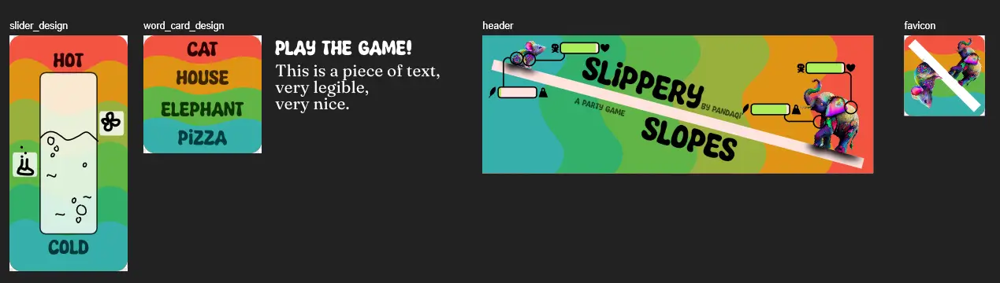
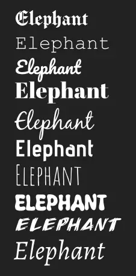
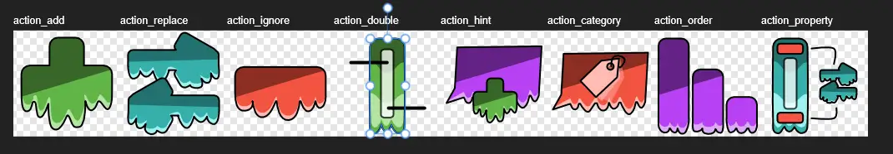
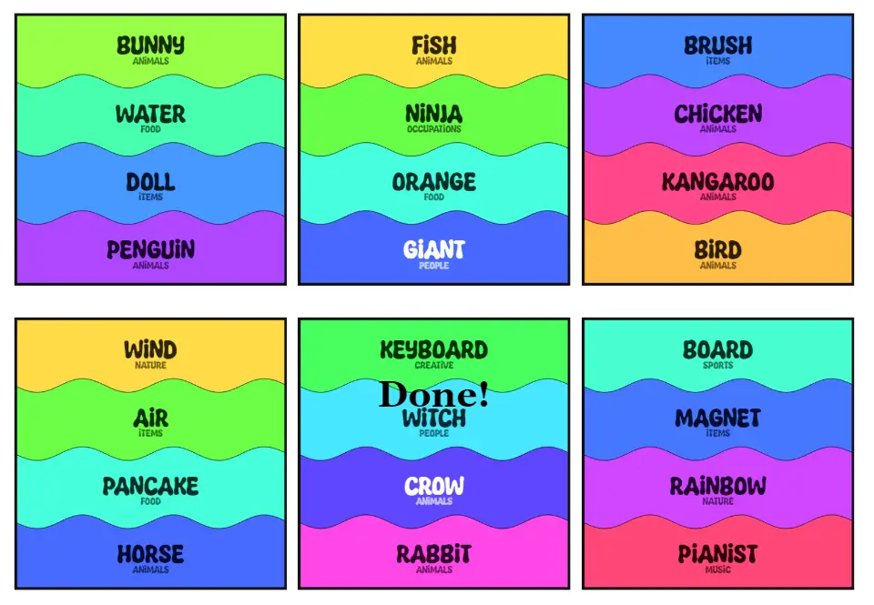
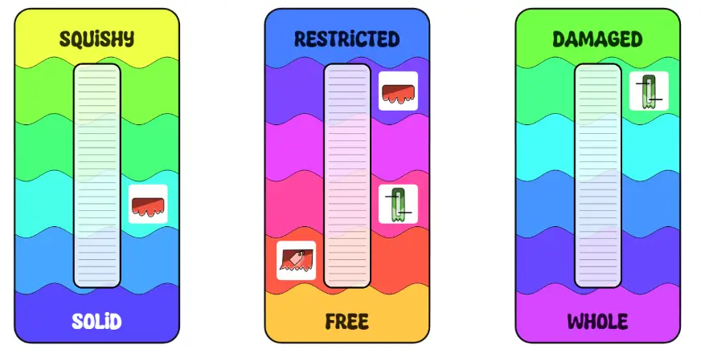
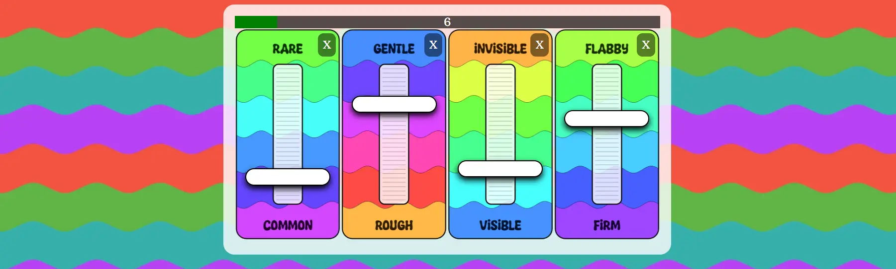

Welcome to the devlog for my game [Slippery Slopes](https://pandaqi.com/slippery-slopes). In this article, I'll briefly discuss how I made the game, the challenges along the way, how I solved those, and hopefully some interesting lessons or stories from development.

## What's the idea?

About a year ago, I made the games [That's Amorphe](https://pandaqi.com/thats-amorphe) and its spinoff [That's Amorphe Pictures](https://pandaqi.com/thats-amorphe-pictures).

They were simple party games about "morphing". You received two words and a secret "mix percentage". Then you had to mash the two concepts together according to that percentage. Then other people had to guess your secret percentage.

For example, you get "cat", "house" and "30%". Now you must give a word that is 30% cat and 70% house!

The _pictures_ variant was the same idea, but with mixing _drawings_ instead of words.

As I finalized those games, I realized there was another (perhaps better) idea along the same vein. Instead of morphing two given words, what if you had to communicate one word by **setting properties on sliders**?

In other words, say you receive the word "cat".

Then you also receive a few cards with a certain "spectrum" or "slider". For example, "hot<->cold" or "light<->heavy".

Now you must communicate "cat" by marking where your secret word lies along those sliders!

This seemed like a great party game and a great continuation of the idea! Unfortunately, there were some issues I had to figure out first. (And I had already started some other projects, so I couldn't immediately work on this one.)

## What are those issues?

Well ... what's the rest of the game? :p

* Where do those sliders come from?
* Do they rotate? Can you choose them? Are they in your hand?
* Where do words come from?
* How do you "mark" your word on a slider?
* This seems extremely hard (if you have bad luck), is there some way to mitigate that or gamify it a bit further?

At the time, I wrote down a few possible solutions to these problems, then left the idea alone.

When I returned, I had apparently continued thinking about this and had already subconsciously figured it out! I read the document, made a few crucial changes, and suddenly the game clicked.

### The general idea

* Words are simply a deck of cards. (Or, if you want, an app on my website that can provide random words.)
* The sliders are just a deck of cards. At any time, there are _three sliders_ on the table.
* At the start of your turn, however, you remove one and draw a new one. (This allows you to "design" your sliders a bit better, to fit your word. It also means the sliders constantly change, but not too much.)
* The slider you remove is not actually removed. It's just moved to the center of the table to become ... the **action slider**

### The action slider

The idea of one "action slider" is what made this game click. What is it? Well, each slider card _also_ has a few action icons on them. 

Other players can _use_ these actions as hints or helpful powerups to guess your word. At any time during your turn, they can pick an available action (from the current action slider), which does things like ...

* Add another slider and mark your word on that
* Tell them the general _category_ of your word
* Etcetera

### Marking the right place on those sliders

Finally, I had an eureka moment about how to **mark** those sliders. At first, I wrote the default approach: include a set of "tokens" you can place on the card. This is, however, messy. If you've printed the material yourself, moving tiny paper tokens is ... not a great experience. Easy to lose, misplace, get frustrated about. It's also more material to print and store, which is never nice. 

Then I realized **we don't need them!** 

We already have a way to mark a position on a slider: using _another card_! Simply use another card (facedown, perhaps sideways) and place it on the slider. Its edge indicates the place you want to mark.

### That's it!

This is the whole game!

* Throw away one slider, draw a new one.
* Communicate your words by marking it on the three sliders.
* Others can use actions for help. (Though this reduces your score for this round.)
* If the word is guessed, you get 5 points. Otherwise 0 points.

Just two sets of material (word cards and slider cards), simple rules, yet endless possibilities. Because how _do_ you communicate the word "cat" using sliders such as as "hot<->cold" and "funny<->serious"? :p

## Keep it simple, stupid

I intentionally planned this game in a very tight window. I only had a very small gap of "free time" in this month, but I still wanted to do something with it.

This game was supposed to be an extremely simple party game. Not something with expansions, or amazing artwork, or intricate marketing. Just a basic and fun party game to make in-between big projects.

So let's keep it that way. Let's not give myself time to blow up the project scope :p

In a flash, I decided ...

* To grab a funky, thick font
* To give this game a sort of flower power, psychedelic, colorful drippy theme. (Also fits the idea of slippery slope and everything on a scale.)
  * This is mostly expressed in lots of colors
  * Things looking like a liquid with bubbles or dripping
  * Things being slanted or sloped 
* To probably use the idea of properties on a scale in the header or marketing. (Like an RPG character: show something then display its "stats" as a few bars or meters below it.) 
* And just make this tiny idea as it stands now.

As such, I quickly cobbled together the following one evening and decided it was enough to start with.

{}
I always have a blue-light filter on, which means it's now midnight and I can't judge colors to save my life (because they're so heavily filtered and changed). So I really hope the image above makes sense.
{}

Word cards are simple squares with 4 words. This gives enough options that you have no "impossible turns" and players feel a sense of control, without overwhelming them. (It also fits nicely on a square card.)

Sliders are elongated (twice as long as they're wide). They simply have opposite _colors_ for the different ends of the scale, with a wavy/bubbly transition between them. (Looks much better and more stylized than an actual smooth _gradient_.)

The ends are also clearly _labeled_, of course. At this point, however, I realized: **hey, I'm just drawing sine waves, a computer can do that too!**

As such, I decided to switch to the card generation algorithm almost immediately. Why? Because with some simple code, I can let the computer generate ...

* Those wavy paths. (While controlling size, amplitude, etcetera much better. It's just a `Math.sin()` sampled regularly to get its points in a long array.)
* Two random opposite colors, and blend between them. (I always work with colors in HSL format, because it's just superior :p I pick a random hue. The opposite hue is simply `hue + 180`, and the ones in between are just `hue + 20`, `hue + 40`, etcetera. Saturation and Lightness stay constant, and that's how you get such a gradient.)
* And therefore the whole card.

## Generating cards

This wasn't that special, and I already explained the gist of it in the previous paragraph.

It did make me realize a few things.

* The "special slider" types I had in mind (ones that displayed _words_ for example or _shapes_) should be an expansion. Each of them required an entirely new block of code, which signals to me that they're too _different_ to explain at once in the base game.
* The "word/font" slider also requires loading a bunch of unique fonts, which is heavy and takes a long time. So if it's just an expansion, people trying the base game won't have to download that and aren't delayed.
* The actions should also be optional. (Highly recommended, but still a separate module.) The reasoning is similar: it takes _just_ too much time (and visual differences) to explain for a party game, as people will have to learn what the ~8 different icons mean.

### Picking the possible sliders

Then I created my dictionary of all the "opposites" (hot<->cold, light<->heavy, etcetera). I ended up with ... 80 of them.

That's what always happens. I brainstorm and make a list of absolutely _everything_ I can come up with, then end up with _too much_ and whittle it down.

At least 25 of those have a question mark behind them. I'll probably remove them, as they're too specific or hard to use. 

{}
I just added the entry "float<->sink".

Sure, you can classify many things by whether they float or sink, but it's also really unhelpful for most words you're trying to communicate :p
{}

I initially considered creating _icons_ as well for the sliders, but that idea is out of the window now. I'm not creating 80*2 = 160 icons, of which many will be very hard to depict ("lenient-strict"? "arrogant-humble"?).

Lastly, some are just more generally applicable than others, such as the slider for _size_ and _temperature_. They should have a much higher probability and perhaps occur multiple times in a deck.

### Picking fonts

For the word cards I just picked one font per general "category".

* One monospaced
* One blackletter (medieval/fantasy)
* One cursive
* Etcetera

At first, I played it too safe and picked highly readable fonts I'd used many times before. This obviously defeated the purpose.

Then I jumped into the other extreme, picking fonts that were completely wild and unreadable. 

Until I settled on this list of fonts. There are clear differences, but they're all pretty readable and stay in their lane, which allows placement on cards _without_ overlapping each other or being overwhelming.

### Picking shapes

For this I used the generally successful approach of "50% random, 50% manual".

I created a predefined set of (regular shapes): circle, rectangle, triangle, etcetera. These are normalized by default (centered on the origin, scaled to be `1 unit` wide), so I can scale them to the _actual_ size of the card when drawn.

But with a certain probability---currently at 30%, though that's just a guess---it creates a completely random shape. I used some simple algorithms I found online that generate random polygons that aren't too wacky or unpredictable.

In the end, this leads to such cards having a few solid and simple shapes (always somewhat useful), and a few random ones that might be exactly what you're looking for.

### Creating action icons

I decided to just create these manually. There are only 8 of them, I don't want to rely on AI too much, and such specific icons (that have to illustrate a specific special rule) are near impossible to get through AI or references anyway.

I try to stay within our style (slippery, dripping, slanted, flower power, colorful) and draw icons that (hopefully) immediately explain what they do.

These aren't exactly the style I wanted and pretty "basic", but at least they're very clear and not ugly. I wanted to add more details and colors and "dripping"/"bubbles", but that takes at least a few hours of fiddling and drawing, and I can't spend that time on a few expansion-action-icons right now.

So moving on! 

### Bringing it all together

Once all this setup is done, we can finally run the generator---fix the gazillion bugs that obviously slipped in---and then see the end result.

I think they turned out quite well. It generates really quickly and the waves + coloring is all automatic, so it takes almost no manual work from me.

They're not insanely beautiful, but for a party game like this it's more important that they _look_ fun and _clear_. I think. I hope I succeeded with that.

## Slippery Slopes ... Digital?

As I finished this code, I realized I was only one or two steps away from simply having a _digital_ version of this game. 

{}
I realize that more and more, as my material becomes entirely generated, and my code better structured. In the future, many games might release both an offline and online version at the same time. This shift already happens in general with boardgames, as more and more of them _also_ release as an app or a website on which you can play it.
{}

I already had the thing that draws random words. I already had the thing that creates the sliders. I already had tools for building an actual game on my gaming website (from previous projects).

Additionally, I'd wanted to add an option to get your words from the website (instead of printing word cards). However, this created a nasty extra setting on the page + line in the rules (to explain this and make sure people didn't pick the wrong thing) ... which I just don't like.

It's much cleaner to completely separate the offline and online version into their own projects. It makes each page cleaner, it makes the code behind the scenes cleaner (no big IF-statement at the start based on what you want to do), it's easier to understand for newcomers.

So I decided to spend a few more hours on creating that digital version: **Slippery Slopes: Trippy Touches**.

I'm not sure about these names, but as I said, I'm flying through these projects in my spare hours here and there and can't waste time doubting myself! I guess it's a good enough name.

In the end, this simply means ...

* An interactive widget right on the page. (When you visit this project, you can immediately "test" the game and learn how it works.)
* An official game interface that presents words, presents sliders, tracks score and time, and explains the game rules. (I really don't want an actual rulebook for a digital game, especially not one as simple as this.)
* You can mark the sliders by touching/swiping/clicking. 
* You can also _replace_ them by tapping the X icon in the corner.
* All of which directly uses the code written for the original material generator, which makes the _extra_ code needed for this entire game quite short and sweet.

There is a limit on how often you can replace sliders, but it's a rather high one. As I played with my own interactive example, I learned more and more that this game can be _really_ difficult. If the word is hard or the sliders just don't work out. That's why I decided to ...

* Increase the number of sliders from 3 to 4
* Allow replacing more than just one. (Currently, you can replace 10 times in the digital version, and 3 times in the physical version.)
* Enable the _actions_ in the base game by default. You can turn it off, but they will really help with the tougher or "bad luck" turns.

So, yes, you can also play _that_ game at [Slippery Slopes: Trippy Touches](https://pandaqi.com/slippery-slopes-trippy-touches).

## Conclusion

As I said, this was meant as a very quick game in the small time window I had between projects. All in all, I worked on it for 4 days. The perfectionist in me obviously wants to make it much prettier, polish it more, test it more. But, well, that's the beauty of time constraints: I can't! 

The game is done. It works, it's fun, it's also nothing special. I mean, can you really expect that as the result of 4 days of semi-panicked work?

I'll need a lot more games to tweak the difficulty, as some words are just impossible to convey with sliders, while others are very easy with just the right sliders. So I might come back to this game for a quick update round in the future. 

{}
That's not uncommon, I do it regularly for other older games of mine. I've only given up on the oldest ones---which are honestly terrible quality compared to what I do now---and will probably remove those entirely in the near future.
{}

For now, though, back to other projects!

Until the next devlog,

Pandaqi