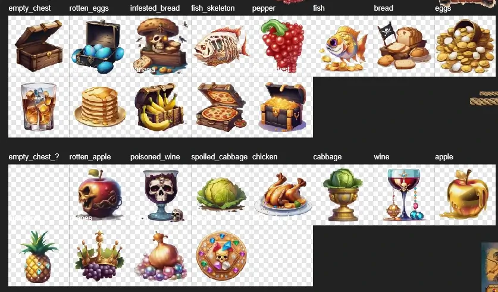
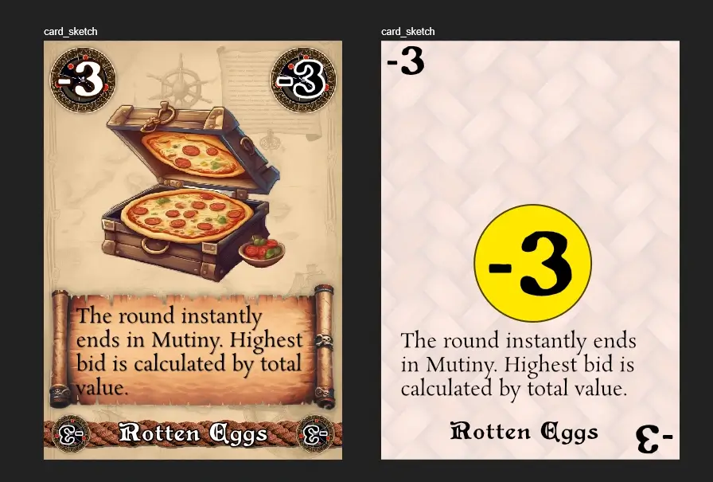
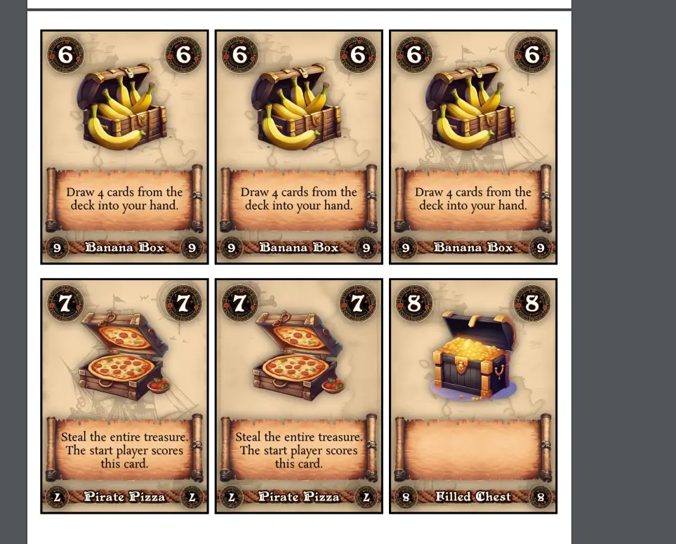

Welcome to the devlog ("developer diary") for my game [Split the Foody](https://pandaqi.com/split-the-foody/)

I will explain my thought process, problems and how I solved them, and any other interesting bits along the path to creating this game!

## What's the idea?
I had an idea that felt simple and thematic.
* You're all pirates who just completed a successful mission.
* Each round, a new treasure ("booty") is revealed.
* Everybody bids or takes actions.
* Until finally this treasure is _distributed_ across the players (based on how well they played)

Repeat until all booty ( = "the whole deck") is scored. Count your points, highest wins!

It sounded simple enough. But when I tried to write down the full rules, at the time, I got stuck.

Because the big question---the "core" of the game---is of course ...

> How do you bid and distribute the treasure?

What's the simple rule, system, game loop that makes this possible? It took me a while to come back to this idea with a first attempt.

## Very mathematical pirates
Here's the idea.
* The size of the treasure is equal to your hand size. (If the active player currently holds 4 cards, then they draw 4 cards from the deck.)
* On your turn, you can either **pass** (do nothing for the remainder of the round) or **bid** (place more cards in front of you)
* This continues until all players have passed.

Now comes the "core" of the game. It's slightly mathematical, but not so much that I'm afraid people won't understand.

* Count the total number of cards bid.
* If it's **higher** than the size of the treasure, the highest bid gets the treasure.
* Otherwise, everybody gets as many cards from the treasure as they bid.
* (If nobody bid, the active player just gets the whole treasure for free)

EXAMPLE: The players bid 1, 2, and 2 cards. The total bid is hence 5. The _treasure_ also has 5 cards. As such, the players simply receive 1, 2 and 2 cards from the treasure respectively.

What's the idea here?
* If everybody provides reasonable bids, you get back what you put in.
* You use cards you _don't want_ for bidding, and hope to get cards you _do want_ out of the treasure.
* But if you REALLY want something, you can try to push the total above the treasure size and get the whole thing.

I hope this provides a nice tension. Will others push the number too high? How many cards do I need to bid? Is the chance of getting something good back high enough?

It feels like a simple, unique core around which I can structure a whole game.

## Issues & Loose Ends
### Hand Management
**ISSUE 1: How do you get more hand cards?** In my experience, automatic drawing ("draw back to the hand limit" or "all players draw 1 card") is usually not great. It's either too consistent or too inconsistent, never a nice balance.

Especially in this game, where hand size determines your bidding capabilities and the size of the treasure (on your turn)

So let's do the following:
* Whenever you score cards in a round, either put them all in your hand, or score them all.
* The active player receives the highest bid.

{}
The very first rule allowed you to decide this for each individual card: want to score or not? But this made rounds take way longer. It's a bunch of decisions that all players need to take at the end of each round. This also made it way too easy to only keep the cards you want.
{}

### Handling Ties
**ISSUE 2: What if it's a tie?** What if the bid exceeds treasure size, and multiple players have the highest bid?

I initially wrote a pretty standard way to resolve it. The summary is:
* Reveal the tied highest bids and "score" the cards. (Sum their point values.)
* Highest score wins.
* If still tied (extremely unlikely), player closest to the active player wins.

This is, however, a bit too much explanation for such a minor aspect of the game. I decided to simplify it to: "active player decides". Yes, it's not the same, but it's much simpler and fits the theme of the game.

### Scoring
**ISSUE 3: Scoring is too uniform**.

Right now, cards just show a score from 1 to 9. Getting more cards is therefore always _better_. Getting a higher card is always _better_. Somebody with a few 9s can barely be beat.

All those scored cards just go into one huge facedown pile, which you score at the end.

This has three issues.
* It's boring. 
* It's too swingy and luck-based. Somebody scores a single 9? Great, your next three rounds of scoring 1s, 2s and 3s feel like treading water.
* Others have no idea of the scores of other players. (And no, tracking that in your head while playing is _not_ fun, so I'm not going to subtly encourage that.)

I decided to implement another common scoring strategy for card games.
* Keep scored cards in **faceup piles** sorted by type (in front of you).
* You only score cards of which **you have the most**.

In other words, if you have 2 7s, but another player has 3 7s, then you get 0 points and they get 3 * 7 = 21. As expected, high numbers are exceedingly rare, while low numbers are plentiful.

This means you have specific treasures you want (to grow your set), or that you want to keep _out of the hands_ of others who are collecting that type. And all that information is now open on the table.

Additionally, it felt fitting to add **cursed items** (or "rotten food", I guess, if we're keeping with the food theme). These are minus points or some other negative scoring power (e.g. "eliminate your highest scoring card type"). 

A few cards that are simply "0" points also feel like a way to cause some chaos. (You might get a treasure that's only 0s and pretend it's the best thing ever so others bid high ;) )

### Some action spice
**ISSUE 4:** Right now, the control over treasure size and how a round plays out is too minimal.

For example, if the treasure is small (only 2 or 3 cards), then you're almost certainly going to exceed it with higher and higher bids. There's no way to increase the _treasure_ in hopes of triggering the other rule (everybody gets what they put in).

Similarly, the treasure is secret. (The active player who draws the treasure looks at it, but nobody else.) That's fine. It adds tension and mystery. The problem is that there's literally _no way_ to get _any information about it_.

How do we fix this? Let's try to kill two birds with one stone.
* Besides _pass_ and _bid_, you can also _play_.
* Play a card from your hand and take its action.
* This card is then added to the treasure.

These _actions_ would be useful things to modify the current round (and hopefully learn something you can use to play better). Such as "look at the treasure" or "force the next player to pass".

Initially, I also wanted to add cards that score in a special way. ("Scores +2 points for every 3 Pizzas you've scored") However, I decided to push all those to an _expansion_.

Why? The answer, as always, is "keep it simple".
* We already have a scoring system and I don't want to overcomplicate it for the base game.
* For simplicity, I'd want to use the same space (on the card) to write the action and the special score rule. If I include both _actions_ and _special scoring_ in the base game, you also need to explain the _difference_ to new players (and probably constantly remind them of it).
* Actions feel more crucial to making the game work.

## Where are now?
We have our list of material.
* Cards numbered 1 (occurs often) to 9 (only occurs once).
* Each has an action that befits its score. (Higher value cards have a stronger action.)
* And we have quite a few cards with score 0, -1 and -2. (But with no action.)

We have our rules, as simple and consistent as I can make them.

Now it's time to quickly create a paper prototype and play some rounds against myself.

What are the results?

In general, **the game works**, but there are necessary improvements to be made. (I feel like I always say that.)

### Final round
**Problem:** the final round is slightly useless. Because hand cards are worth nothing, you can just bet them all and be done with it. And/or if you know they'll be bad cards, you _don't_ score them and it's all useless to you.

_Solution?_ In the final round, you _must_ score all cards received. This way, you can still give each other some bad points or decide to hold back. It's at least more strategical than it is now.

### Negative Points
**Problem:** the obvious strategy is to bet on treasure using the lowest cards in your hand. Why do anything else? Because betting is about the number of _cards_, not the value _on them_. So the obvious strategy is just to bet your negative point cards every time, probably getting rid of them.

This makes the game too simplistic and monotone.

I didn't have a solution for this right now, so I just continued solving other problems. In a few paragraphs, though, I'll talk about "version 2" which indirectly solved a large part of this issue.

### Leftover treasure
**Problem:** currently, any leftover treasure (when divided) is simply given to the active player. This didn't feel fun or balanced any time it happened. It basically encourages players to perfectly reach the treasure size (in bets) _every time_, while the active player actually wants people to _be boring and not do anything_. Again, simplistic and monotone.

_Solution?_ Leftover treasure is simply thrown away. Sometimes solutions are that simple :p

### Actions
**Problem:** some actions weren't powerful enough or on the wrong number.

I had separated one idea into three actions:
* 1-card: "force the next player to BID"
* 3-card: "force the next player to PASS"
* 5-card: "force the next player to PLAY"

_Solution?_ The BID and PLAY feel equal in power, so let's combine them. Forcing another to PASS is way more powerful/useful than I expected, so it should be put on a higher number.
* 1-card: "force the next player to BID or PLAY"
* 5-card: "force the next player to PASS"

Similarly, "reveal the treasure" feels too useful to stick on a high number.

I modified the numbers to range from -3 to 7 (putting more prominence on negative numbers and moved around some actions based on how useful they were.

Then I went to bed and planned to play another game first thing the next morning.
## Paper prototype v2
Even after all those years, I keep being amazed by what a good night's sleep does to our brain.

I woke up ... and within 2 minutes of testing the new version I suddenly saw the obvious solutions/improvements for this game.

### Making all cards equally useful
Here are some obvious ways to prevent people from using negative/their lowest numbers for bidding by default.

* Negative numbers _also_ get an action. So you often want to save that card to use the action later.
* One of the most common actions is "all negative numbers in bids are immediately scored". This is both a fun and simple action, and directly punishes anybody who did this.
* Another common action instantly ends the round and scores based on highest **value** played. (Which you'll probably lose if you played low numbers.)
* If somebody wins the whole treasure, your bids just return to your hand. (So bidding negative just means it bounces back at you.)

Balancing this game is 50% "creating different but better rules" and 50% "creating better card actions" 
### Simpler core
That final rule was part of multiple changes I made to the core of the game. Initially, the rules for "splitting the treasure" were quite long and had a few exceptions. They also had the side-effect that you burned through all the cards _really quickly_, because _all cards played_ were discarded (besides the treasure and the highest bid). 

I wanted to simplify and improve that. I ended up with:
* **Total higher than treasure size? (a "Mutiny")** Highest bid gets the entire treasure. Their cards go to the start player. Everybody else receives their own bid.
* **Otherwise?** Everybody gets what they put in. Start player receives all bids. Leftover cards are discarded.

Cards still leave the game and it will surely end within ~45 minutes. But these rules are much simpler, keep more interaction, and keep cards in the game for a little longer.

Crucially, this opens up a whole other jar of strategies. You could bid very _high_ cards, banking on the fact that a Mutiny will take place, so you just receive your own bid and can score it. Conversely, you can try and steer the round towards a fair split, then bid all your negative numbers to make them end up at the start player.

I also completely forgot about my own rule of "you can only play a card (for its action) if you already bid". If _I_ forget this, and I only realize halfway through my first test game, then others will surely forget it entirely---and it's not that useful. 

I was afraid it could be abused to just "mess with a round" without having any stake in it yourself. (You bid nothing, but play one or two annoying actions.)

In practice, however, playing an action is already balanced. 
* It adds a potentially valuable card to the treasure (for others to win) => because higher numbers are better actions!
* It reduces your hand size by 1 => often without increasing your chance of getting something back.
* It might backfire in certain situations. 

Those are a lot of downsides to "doing an action just to mess things up".

Forcing people to bid first just makes taking an action a hill that's often too high to climb. While adding a forgettable exception.

I simply removed it.
### The thing that makes this game work
A major thing that bugged me when testing v1 of the game, was that it all felt kinda random. 

When distributing the treasure, you shuffled the cards and dealt them facedown.

This meant you had absolutely no certainty about whether you received one of those great cards, or that -1. No matter how well you played.

Sure, the start player could _look_ at their treasure, but that mostly didn't _matter_ in practice.

So I was happy when my brain decided to wake up the next morning and said ...
* Wait a minute, what if the start player can _arrange_ the cards (of the treasure) however they want?
* And when splitting the treasure, you did **not** shuffle, but instead gave out the cards in order?

While testing, this quickly expanded to ...
* When grabbing your slice of the treasure, you may pick whether to take from the _top_ or the _bottom_.
* Whenever an action allows adding/removing cards from the treasure, similarly, you may do so from the _top_ or the _bottom_.

**This is what actually makes the game shine.**

You have enough control (through bidding, turn order, player powers, picking top/bottom when receiving, pokerface of the start player, ...) to strategize. To circumvent a bad part of a treasure and/or make sure you attract the best part.

The action "reveal the treasure" gets an extra layer. Because once flipped faceup, each player can see the exact cards they'll be receiving.

People won't play actions haphazardly, because if it's a somewhat high number, players now _know_ they'll be able to get that (if they play it well).

## Designing the cards
### Main Illustrations
It seemed fun to create cards that combined a food and a typical treasure/pirate thing. So, for example, not just a pineapple, but one inlaid with diamonds. Not just a banana, but bananas in a treasure chest.

With some encouragement, the generative AI mostly seemed to understand this. 

I also guided its style by naming painters from the golden age of piracy, or those who drew a lot of scenes with ships or maps in them. This only really came through 1/3 of the time, the other 2/3 it seemed to ignore that and just want to draw the food in a cartoon _or_ realistic style.

After lots of different creative combinations of food + treasure, and some heavy editing on certain types, I ended up with a nice set of illustrations.

{}
For example, it just would not understand the idea of a rotten egg. I had to guide it to blue, cracked, ugly, dirty eggs, then edit to get a variety of them, then place them into a dark pirate chest myself.
{}

### Card Design
This game has rather simple cards:
* Main Illustration
* A number
* A power

However, both numbers and powers are absolutely crucial to the whole game, so they should be _big_ and _obvious_.

Additionally, because scoring means placing the cards in piles before you, the numbers should ideally be on _all sides_ and also _flipped upside down_ (so players on the other side of the table can easily read it).

I researched some other piracy-related (board) games, and found there was a huge disparity in quality.

Some games looked absolutely stunning. (Though sadly those specific games had no _cards with numbers_, so I couldn't use them for inspiration much.)

Other games just looked horrible and illegible.
* All cards were the same dirty dark brown.
* With heavily decorative text (with too little contrast), making it unreadable.
* And usually the same attempts at decoration (pirate maps, pirate scrolls, pirate hooks) that made everything look crowded and even less legible.

Let's just say it was a good example of what I wanted to _avoid_ ;)

Eventually, I settled on a few major elements.
* A _light_ background with a very _light_ pirate map texture. If I feel it's overcrowded or muddy at any point, I remove it or dial it down.
* A "pirate coin": I only found one game with this element, so it's not overdone. But it looks good, I can draw it myself, and it'd be a nice backdrop for the _numbers_ on the card.
* A "pirate scroll": a scroll (rolled open) that can provide a big rectangular background for the _text_ on the card.
* A "pirate rope": many, many of these games use rope imagery. (Either realistic or abstracted into a pattern.) Some used them as outlines for the card (or boxes on a card), some used them as separators. I decided to use it in a unique way: as the _background_ for the _title_ of the card.

The origins of these elements are interesting.
* I drew the coin myself, as I have a lot of experience drawing random decorative patterns.
* The scroll comes from AI, though I had to make it about 3x as wide as the original image, which meant editing to fill in the gap in the center.
	* I also edited the center to make it more _consistent_ in color (and lighter), otherwise the text at the edges would fall away in the dark shadows.
* The rope is an actual rope from a nautical webshop :p They had images of their offerings, top-down, without much coloring. So I could cut out one of them, edit to match the rest of the card, and that was that.

In the end, we get something like this.

{}
Yes, I should really keep "in-progress screenshots", but I forgot to do so for this project.
{}

### Fonts
I wrote a pirate (children's fantasy) novel a while back. I already researched pirate fonts for that, so I could pick a few of those I hadn't used yet. 

As always, 
* I try to pick a body font that is highly legible but still has _some_ character. That usually means a _book_ font. As expected, those fonts are used in novels and are therefore legible serif fonts. (I hate those bland sans-serif fonts most projects and websites use these days.)
* And then a heading font that's quite _thick_ and clearly _contrasts_ with the body font. (Legibility is still important, but less so, as the heading font will only be used for short and big pieces of text.)
	* I had several other pirate fonts as options, which looked great ... but too similar to my body font. And one of the sins of graphic design is picking two different things that don't actually look all that different, because then most people will just think it's a mistake.

With all that figured out, I wrote the code to generate the material, and before you know it we can test the game!

## Playtesting

Below is a screenshot of the final PDF I generated and used for the "official playtests".

How did playtesting go? Pretty much how you'd expect it to.

At first, it was a bit slow going, as new people figure out the game. It _does_ take two rounds to get to grips with how treasure is split and how treasure is scored, but it's really not as hard to grasp/remember for people as I feared.

Then, once people remembered there was a third thing you could do (play a card for its action), the game clicked and it went much more smoothly. Those actions, especially the common ones (numbers -3 to 3), do exactly what I intended them to do. They help combat luck, gather information, prevent bad splits at terrible times, etcetera. 

It takes half a game for people to realize just how incredibly useful they are. But when they do, the game _works_.

The only "downside" I see is just something baked into the genre and not "solvable". In some of my test games, a specific card just happened slip through the cracks. It means it was never played for its action or part of a bid, slightly putting the game off-balance.

{}
The "3" card allows you to reveal the treasure. (So everybody knows exactly what's inside and which cards they are getting.) In one game, those 3 cards always appeared INSIDE treasures and never in player's hands, which means the whole game flew by without anybody having any certainty about what was inside treasures. But, yeah, that's just random chance from a card deck.
{}

The game also gets better as people are more social and talkative. Bluffing, negotiating, tempting people to do something you want (such as continue bidding or stop), etcetera. That all depends on the group you're playing with, of course. 

(And familiarity with the game. You can't really bluff and talk strategically if you don't completely understand the game yet. With every playtest, the amount of negotiation and bluffing increased over time.)

Having only 1 or 2 cards---or even 0 cards---happened more often than I'd experienced when testing against myself. But it was never really an issue. And, once you've experienced it, you can plan ahead and prevent it from happening again. (It becomes part of the reason why you wouldn't just bid on everything with all you have.)

The specific actions from the expansions surely mitigate some of that randomness and make the game more interesting. 

In the future, I might come back and tweak some actions or rules. (It takes time and more games to realize a few solid improvements. It's one of the reasons I digitally generate my rules and games: I can always improve them as I grow as a designer.) But for now, the game is surely done, playable and fun.

Until the next devlog,

Pandaqi