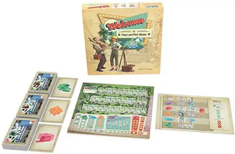
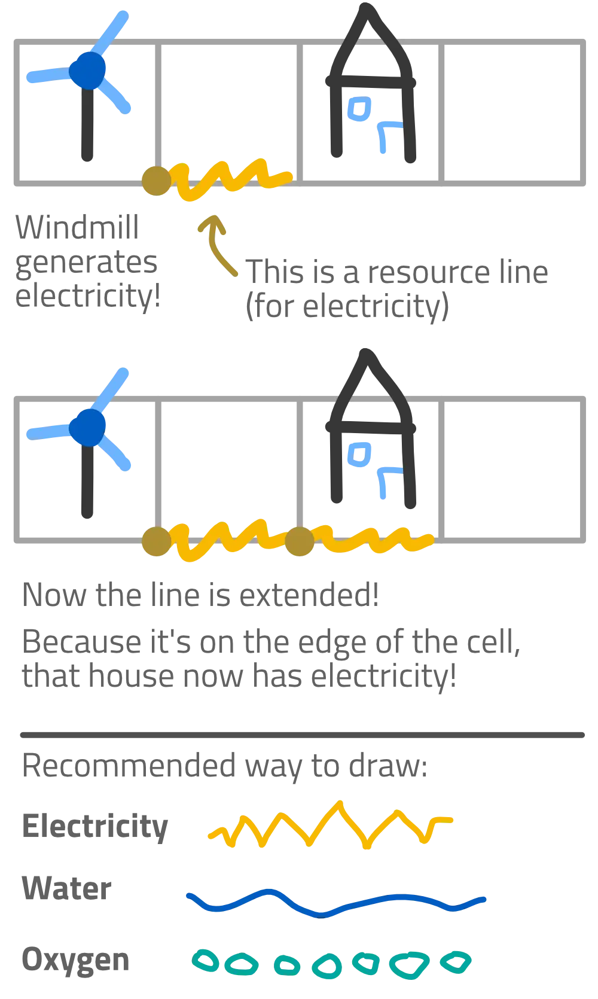

Welcome back to another devlog for one of my [**One Paper Games**](https://pandaqi.com/boardgames#one_paper_games)!

*What are One Paper Games?* It's a type of game I invented, for which
you literally only need one blank piece of paper (and a pen), and you
can already play! I invented these for many reasons (simplicity, ease of
use, free to play, possibility of innovative mechanics), and so far
these games have been a great success, so check them out!

This time, I'm talking about the development process behind [**Starry
Skylines**](https://pandaqi.com/starry-skylines)!

Where did the idea come from?
-----------------------------

I like the boardgame "Welcome To ..." (Also known as "Welcome To ...
Your New Dream Home!")

{.float-right}

It's extremely simple to explain, players take turns simultaneously, it
supports "1-100 players", yet it's very engaging and doesn't feel like a
"dumbed-down" game or anything.

In that game, each player gets their own sheet of paper with a bunch of
streets and houses. Every round, three cards are revealed, showing a
**number** and a **special effect**. All players must choose one of
these three options and draw it on their own sheet.

For example, you might have the number "2" and a special effect that
allows you to build a pool for a house (which are obviously worth way
more points than houses without a pool).

But here's the tricky part: you must form valid streets. So, numbers
must go up (from left to right), and you may not have duplicates. Only
certain houses allow a pool, for example, so the decision suddenly
becomes very difficult: should I write a "2" here because it fits nicely
between my 1 and 3? Or should I write it in a worse location, but which
would allow me to build that nice pool?

They often say that games should be all about **forcing players to take
interesting decisions**. This game is the simplest example of that,
distilled to its essence.

> Each round is *one* decision between *three* options, all equally
> interesting.

So, obviously, my brain thought: "what if I copy that game ... but
*bigger* and *different*?!"

Well ... allow me to introduce my latest One Paper Game: [**Starry Skylines**](https://pandaqi.com/starry-skylines)!

What did I want to improve?
---------------------------

When taking inspiration from another game, I usually think: "Which parts
do I like and want to keep, and which parts do I hate and want to
change?"

I'll try to explain my original idea using these thoughts.

**Like: ownership and customization.** Because each player has their own
paper, it gives a great sense of ownership, which is way more important
in games than people think. (Why do you think people spend *ages*
designing their character in video games? Even if it doesn't matter for
the gameplay at all?)

It's *your* neighborhood, with *your* buildings and pools.

So I wanted to keep that in the game. Everything you place, you must
*draw* yourself (allowing some creative expression), and then *claim*.
There are no restrictions on customization, and you cannot lose
something of yours. (Well, there are a handful of events or buildings
that allow this, but that's only a tiny speck in the full list of
possibilities.)

**Dislike: lack of interaction.** Instead of players working completely
independent of each other, I wanted them to interact. I exclusively make
multiplayer games for a reason: that juicy interaction between players!

So instead of each player receiving their own small piece of paper,
everyone is simply playing on the same single sheet of paper.

**Like: interesting choices.** The core mechanic of the game is just so
strong, I don't want to meddle with it in any way. In my game as well,
you are presented three options each round, both a number and an effect.

**Dislike: limited number of choices.** That being said, there are only
five different things to look for. I wanted there to be way more
possibilities, more buildings and effects that could be part of the
game. So I made the following choice:

> Instead of building a *neighborhood*, we are building a complete
> *city*.
>
> Instead of using a *deck of cards*, I'll let my *website* randomly
> chose options. It's quite easy to provide the computer with tens or
> even hundreds of options, and then ask it to randomly select a few.
> It's even easier to make it follow certain requirements: if I want
> some type of building to occur way more often, I just increase its
> probability.
>
> Lastly, I allowed the number of effects to vary between 0 and 2. This
> allowed for even more strategic variance: perhaps an option has both a
> negative and positive effect. Will you choose the penalty to get the
> reward? Or will you play it safe and just choose a number without any
> effect?

**Like: theme.** For a "neighborhood-building" game, Welcome To has
quite a strong and appealing theme. It's not just building houses, it's
building houses in the 1950's, and the visuals and mechanics match that.
I think this plays a more important role than one might first assume, so
I spent a great deal of time coming up with a theme (before I even made
anything else for my game).

Eventually, I chose *space travel* (or *space colonization* if you
will). Why?

My first thought was to build medieval towns and castles, but that theme
is *waaaaay* overdone.

My second thought was to go even further back, building caves and
campfire for prehistoric tribes, but that limited my options too
severely. (Might still be very interesting, but not for this particular
One Paper Game.)

My third thought was to go contemporary and just make something like
SimCity, but then I was like: "but ... SimCity already exists, why copy
it?" Additionally, just using a "modern setting" doesn't really feel
like choosing a theme, it feels more like a lack of theme.

So finally, I arrived at *space*. It gave me a nice name for the game
(Starry Skylines) and would allow me to create stupid "science-fiction"
buildings and events. Spoiler alert: it gave me many other unforeseen
advantages as well, which was nice!

(Yes, name is important. All other names I came up with were either
*too silly* or *too serious*, and I always strive to strike a
balance. For example, an early name idea was *Cityward* ... which sounds
more like an extremely serious 3-hour base building boardgame. Another
idea was *Shady Skylines* ... but that's just illogical, what's shady
about these skylines?!)

The First Idea
--------------

Knowing what I liked and disliked, I set down to write the first idea,
which was:

> You all arrived on a new planet simultaneously. Oh no, now you must
> share it!
>
> Each round the computer will give you three options: a number and 0-2
> effects. You must choose one and execute it immediately.
>
> Numbers must always form valid streets: a sequence of numbers
> (horizontal or vertical) may not contain duplicates and must be
> ordered (either ascending or descending).
>
> Effects usually mean drawing a new building in an empty square (and
> claiming it).
>
> If two (or more) players want to use the same square, they must
> *challenge* each other. The person who has the *longest street* wins,
> otherwise the person with the most *government buildings* wins,
> otherwise use rock-paper-scissors.
>
> The game ends when the board is full or someone hasn't been able to do
> anything for three turns.
>
> The player with the most *points* wins! You get points for all
> buildings (following their rules) and certain achievements (such as
> having the longest street out of all players)

I liked this a lot, because it was really simple, clean and
straightforward. There are basically only a handful of rules to explain
-- all other complexity is hidden within the computer.

In fact, I created a short and simple GIF that explains 90% of the game, which I also use on the homepage/website for this game:

{.force-white-background}

That's also the reason why I find this combination of a *board game* and
a *website component* to be **extremely useful**. Whenever an effect
shows up, players can just *click* it to get an explanation about what
it does. This way, I don't need to explain anything before the game
starts, even if we have 30 unique buildings in the game! It's all in the
computer.

Which in turn convinces people to try the game: I can literally get the
game going after only 1-2 minutes of setup and explanation. If I had to
explain all the different buildings and how you score points, that would
be 15 minutes at least. Many people would not even *try* to sit through
that explanation.

Of course, as the saying goes, **with simplicity comes
oversimplifying.**

The First Big Problem
---------------------

Because all players act simultaneously, and they all act on the same
board, an obvious problem with **turn order** occurred. The concept of
"challenging" seemed nice but didn't really cover the issue.

For example: I challenge you for the right to place a new street ( = a
number) at some square. I win, so I place the number. But ... that means
I now have the longest street, because I placed one number extra, so I
also win subsequent challenges!

It's almost impossible to break out of that loop. At the time, I didn't
have a clear solution, so my first few playtests still used these
original rules. (I'll talk about the solution later, after the second
series of playtests.)

Another consequence of this was **unavoidable symmetry**. Why wouldn't
players just copy each other's moves? What prevents the game from having
a *tie* in almost all challenges?

This one was easier to solve: **unique player powers!** At the start of
the game, all players must already decide a *number* for their starting
square, and choose a *player power* from a table in the rulebook.

Such powers make the setup asymmetric and drive players towards
different goals. For example, a player might get one point more for each
house. This player will surely build stuff that allows them to create
loads of houses, instead of choosing an option that would, for example,
lead to more entertainment buildings.

This also prevents ties during challenges. One player power, for
example, allows you to build 2 streets for free before the game starts.
Obviously, that player will have the longest street, at least during the
first few rounds.

The First Playtest
------------------

I playtested the game several times, mostly on low player counts. These
were the issues I found:

**Issue 1:** On low player counts, people often chose the same option
out of the three, because it was simply the best.

-   *How to solve?* Disallow this. With 2-3 players, each player must
    choose a unique option. Of course, this needed some extra
    "challenging" rule in case multiple players wanted the same option.

**Issue 2:** Buildings were too ... boring? Most of the buildings were
very straightforward, like "a garden adds +1 point to all adjacent
houses", which is nice and simple, but also makes the choice less
interesting. You can *optimize* this way too easily.

-   *How to solve?* More interesting buildings, of course! Over the
    weekend, I played *Tiny Towns* with some friends of mine, which gave
    me a first clue about how to do this. In that game, an *Inn* was
    only worth 4 points if there was *no* other Inn in the same row or
    column. Well, I copied that, and it was easy to add variations. For
    example, the *Cinema* is worth 4 points *divided* by the total
    number of cinemas in the same row and column. This is still a simple
    rule, but it adds way more strategy.

**Issue 3:** it was too easy to get stuck when building streets.
Currently, you were *required* to build a new street adjacent to an
existing street *you owned*. Not surprisingly, many games ended early
because someone was stuck and just couldn't do anything.

In hindsight, this was a stupid rule. The whole *point* of placing these
numbers, is that you must *plan ahead to make sure you get a nice
sequence of numbers in the end, which fit precisely on top of one
another. If you must always place a number adjacent to an existing one,
the probability of creating nice streets is very low.*

**Issue 4:** The board filled too quickly. With two players, an average
round will already fill 4 squares (two options, each with 1 number and 1
effects). Higher player counts only make this worse.

-   *How to solve?* Multiple steps, each of them softening the problem
    only slightly.

-   *Step 1:* use multiple papers. This goes against the "One Paper
    Game" concept, of course, but I needed to do that anyway (which I'll
    explain later). At most four players can start on the same sheet of
    paper. Have more players than that? Grab an extra blank sheet of
    paper!

-   *Step 2:* make less buildings that span multiple squares. (I had a
    *Skyscraper* in there that required three cells. Filled up the board
    way too quickly.)

-   *Step 3:* allow re-using squares. Some events can *destroy*
    property, some buildings *must* be placed on top of water, stuff
    like that.

-   *Step 4:* make it more likely that you can *not* do an action. For
    example, add more strict requirements to buildings, so you can't
    just place them anywhere

**Continuing on issue 4:**

{.float-right .force-white-background}

After implementing all this, it still wasn't enough, so I came up with
another big idea:

> Instead of just using the space *inside* cells, we can also use the
> *edges* of cells!

The first idea was quite obvious: use the edges as an *electricity
grid*. Some buildings need to be connected to electricity, so there
needs to be *a* path to an energy plant (or something)

Soon I realized I could add more varied uses. I could also add *water*
or *oxygen* pipelines to this grid. (And maybe I'll later add even more
possibilities.)

However, this was quite a complex mechanic. I didn't want to introduce
this immediately, as it would raise that barrier towards entry, and I
intend to keep that as low as possible.

So I thought: "I'll just add some concept of *difficulty levels* later,
and introduce the resource grid later"

This train of thought eventually became the **planet campaign**.

Continue reading this devlog at part 2!