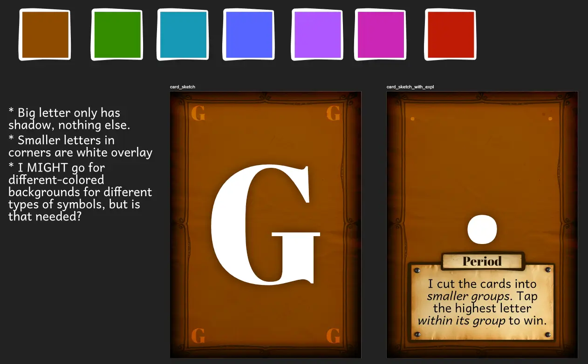
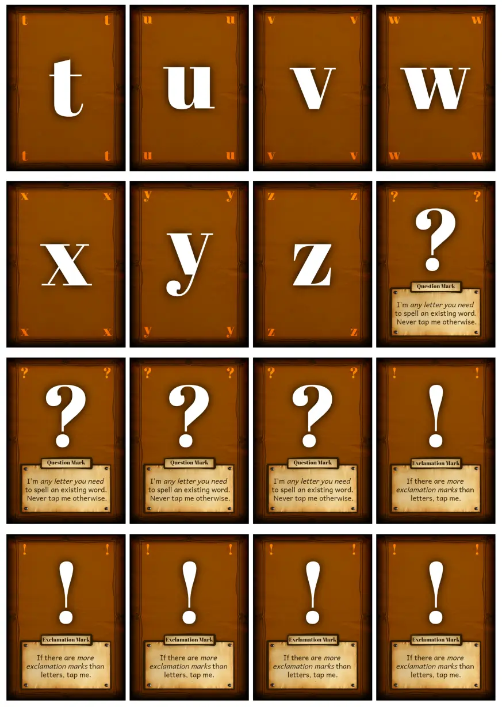

Welcome to the devlog for my game [Booksmack](https://pandaqi.com/swiftsmash-saga/tap/booksmack/). The game is part of the _SwiftSmash Saga_ collection, which is all about games where you simultaneously reveal cards and must then be the first to _smash_ (or just tap/pick) the "right card".

This devlog will be very short! I know, that's a rarity for me. I often promise that and always fail to keep it brief.

But this time I am certain, because the game is already done. In this devlog, I'll quickly guide you through the process of making the game, why I made certain (interesting) decisions, and then give my thoughts about the final result.

## What's the idea?

I loved the general idea of _Cookie Smasher_---the first game---and the mechanic behind this collection of games. Buuut my first attempts, as usual, became slightly more complicated (either to play, or to develop) than I wanted. 

In my search for _simpler_ versions, I mostly searched for ways to solve the "Simultaneous Problem".

* When you have a game without turns, where everyone plays or reveals something at the same time ...
* ... how do you ever create a clear _order_ for the cards, such that there is a clear "right card" to smash?

In a way, _all_ the games from this series were born out of that question. Out of different solutions to that problem; different ways to sort cards and find the right one to smash.

This game arose from the realization that there's **one specific order that everyone knows already**. Yes, you guessed it, that's the **alphabet**!

The alphabet is _ideal_ for a game like this.

* There are enough letters to not have to repeat anything. (26 letters, and we can go lowercase/UPPERCASE if we want too.)
* But most people know the "order" of the letters well enough to rank cards that way.

And so _Booksmack_ was born. And, really, it was just a few sentences that I wrote down in a few minutes.

* Everyone plays a card at the same time. (Cards show a _letter_, lowercase or uppercase.)
* Tap the card with the **latest letter** (in the alphabet).
* If a letter appears twice, tap the **uppercase**.

That's it! I wrote it down and thought "that might be my simplest game ever, but it absolutely _works_"

* There is always a single winning card.
* It's not easy to find it, however, as most people can't _instantly_ know which letter (out of set) comes latest in the alphabet.
* But it's also not hard, as people can quite _quickly_ figure it out.
* Even if you have a "x" or "z", you still can't blindly tap your own card immediately, because someone might have the "Z" uppercase.

A few months later, I finally had the time to actually make this. Upon reading it back, I had a few more ideas.

* We don't need 26x2 = 52 cards. We really only need 30 or so. As such, I decided to have only **a few uppercase letters** (namely, the letters that appear the most in the English alphabet). Not only does this reduce material, it also makes it even harder to know if you'll be the highest card. Because UPPERCASE beats lowercase ... but not all uppercase letters are actually present.
* To _really_ solve the issue of "instantly tapping your own card", I found a really nice final rule: **"If the cards happen to spell a word, you must tap nothing instead and yell the word"**

That final rule really sealed the deal for me. Even with randomly played cards, you are bound to create a simple word from time to time. (And players, once more experienced with the game, might purposely go for this or withold vowels to prevent it.) Even if you had the highest letter currently in the game, you _still_ can't be 100% sure you must tap it when played. And that slight delay might be enough for others to beat you to tapping your own card.

Now the game had 4 rules and it felt perfectly balanced to me.

## Expansions?

These also presented themselves with ease. Of course there are _more_ symbols than just your standard alphabet characters.

* Numbers
* Punctuation (`!`, `?`, ...)
* Letters with diacritics (or "accents")
* Even more uncommon glyphs (such as the `@`)

As I wrote down that list, the rules for them immediately followed.

* Numbers can just fit in the alphabetic order we already have. The letter `E`, for example, is at position "5" in the alphabet. Well, then any number higher than 5 will beat it!
* Punctuation is often used for special effects in games anyway, so I could just extend that. For example, the question mark is a _wildcard_ (any letter you need to spell a word), because almost all games represent wildcards with a question mark already.
* Diacritics simply "beat" their letter without them. I considered disallowing spelling words with the wrong diacritic, but that just became a mess. (Most people can debate endlessly about whether some word has an `é` or `è`. Additionally, most words _do not have accents_, so this reduced the possibility of spelling a valid word way too much.)
* The uncommon glyphs have ... uncommon, unique, special powers. I threw any other ideas I had for the game, or things players might want to do, into this category.

The nice thing here is that each expansion is very small on its own. Just a single rule or a single mechanic addition. 

{}
I kept a strict count on how many "expansion cards" there were to make sure they'd never overcrowd the actual letters, which should still be the backbone of the game.
{}

But you can add as many or as few as you like, because they all mix with ease. This gives players an easy way to make the game more challenging (if bored of the base game), or to dial it back (when playing with new players, for example).

Just collect the handful of cards with an accent, for example, and keep them out the deck for this game.

## Let's make that

This series of games started with a challenge---to myself---to be more minimalist in my designs. I am a very hyperactive person, which means I have the tendency to _add too much_ and _mix too many colors_ in a card design. Sometimes it creates a wonderful effect, sometimes it's just busy and ugly.

That's why Cookie Smasher has cards that are mostly white/empty, with only a few colored blocks. (The only complexity on those cards comes from the beautiful stainded glass illustrations that AI provided me.)

I wanted to continue that challenge/style for this series. It's teaching me a lot about keeping it simple, and subduing my perfectionism.

As such, the design for this game became as simple as can be.

* A simple brown background with a slight crumpled paper texture (the "worn-down book/paper" look)
* The symbol on top in white (with a strong drop shadow to make it pop)
* And on glyph cards---which have text to explain that action---just add another crumpled paper as a "box" to contain that text (and keep it nicely legible)

That's it. It took me a few minutes to sketch, then a few minutes to code, and it all looks nice and consistent.

Below are the sketches and my notes.

This transferred quite easily to my website, wich draws all cards on the fly and generates the final PDF. A few sizes and positions changed slightly, but that's all.

Below is the final material. I purposely exported a PDF with _all_ expansions (small size), so I could get a screenshot with multiple types of cards.

{}
Because this game is all about LETTERS and GLYPHS, the graphics needed for all the material ... are just two simple images. Background + Box for action text. Nothing else. This is extremely minimal compared to all other games I've made, and a reason why this development felt effortless and quick. In fact, I am tempted to use this more often from now on---just use more text or the pretty font I've chosen for an interesting card, instead of drawing all these graphics and icons :p
{}

### Simulation

Here are the quick results from the _simulation_ of this game. (When I create an interactive example for a game, which you can access in the rules, I can easily flip a switch and have it simulate 100,000 games and give me some statistics.)

* **Game Length** (average): 9--10 rounds
* **Tie Probability** (average): once every 3 games. (This is the chance that both the lowercase and uppercase version of a letter is played.)

The game length is perhaps a bit high, and the tie probability a bit low. But these are averages for all player counts, where there are obviously huge differences. (With more players, the tie probability shoots up, and games are much shorter.)

Also, rounds are _extremely fast_, so games are _extremely fast_, which means I don't mind. When adding expansions, you certainly don't have to add them all at once, and you might even leave out random cards if you think the game takes too long. In that sense, this game is extremely flexible and resistant to any customization you might want to do.

## Conclusion

Okay, so, there's this person inside of me---inside of every creative, I imagine---who wants every project to be a _masterpiece_. So when I looked at this game in its final form, I was like ...

* "Well it's _too_ unlikely you'll form a word now ..."
* "And the base game has no special actions whatsoever, isn't that a bit boring or repetitive ..."
* "And, well, having only "high letters" in your hand still is a slight advantage every round ..."
* "Shouldn't I have some stronger way to check who was _first_, to prevent disputes about this ..."

But really, these are not worth pursuing. This is a very simple, silly, little _party game_. It's a bit messy, there's some luck, there will be situations where two people slam the same card absolutely at the same time, there will be people who blindly slam without looking and that can't be prevented no matter how many rules I come up with.

For what the game is supposed to do, it does it _really well_. Absolute simplest rules possible, easy-to-read cards at a glance, while the alphabetic order + spelling words gives it more depth and strategy than you think.

I was right when I wrote down this idea. It's one of those rare "lightning in a bottle" situations where you suddenly realize how stupid you were before, and _this small tweak_ ("use alphabet order to fix the Simultaneous Turn Issue") suddenly creates _ a really good game with just 4 rules_.

I am obviously glad I made the game and I think others will enjoy it too.

Until the next devlog,

Pandaqi
