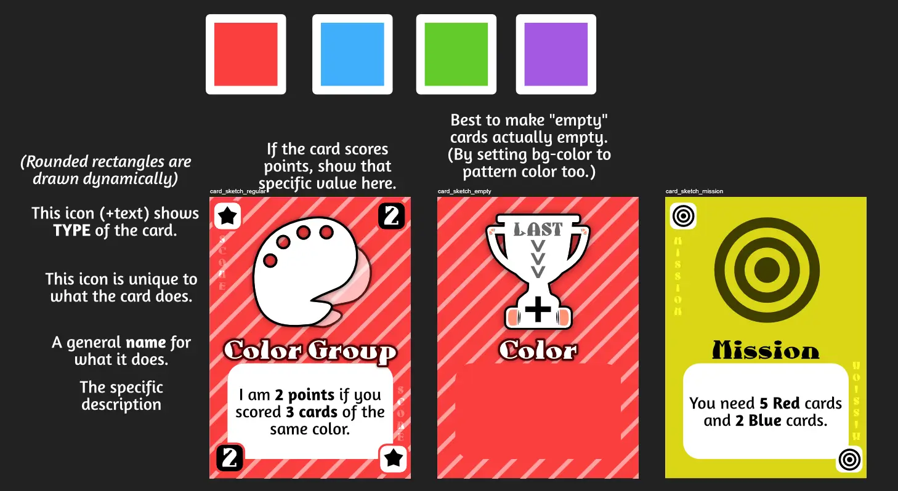
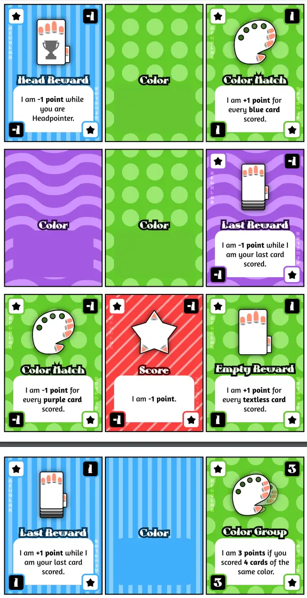

Welcome to the devlog for my game [Point-a-Pile](https://pandaqi.com/swiftsmash-saga/tap/point-a-pile/). The game is part of the _SwiftSmash Saga_ collection, which is all about games where you simultaneously reveal cards and must then be the first to _smash_ (or just tap/pick) the "right card".

Of all my ideas, this one is the furthest removed from that core mechanic. It's still _clearly_ a SwiftSmash game, with a lot of the same DNA and gameplay, but, well, the title betrays its uniqueness. It's not about smashing or tapping the right card first. It's not about speed at all. 

It's about (simultaneously) _pointing_ at the pile of cards you want ... and hoping nobody else pointed at it too.

## What's the idea?

I write on the game page that this game was quite directly inspired by _Let's Hit Each Other With Fake Swords_ (by the developers of _Exploding Kittens_).

The first two lines of the rules are basically the same.

* The current (active) player draws some cards and splits them into piles.
* They count down and everyone simultaneously points at the pile they want.

From that moment on, however, our rules diverge quite heavily :p

In that game, if two people want the same pile, they must fight it out with swords. (And text on the cards gives a unique twist to _how_ they must do so.)

In my game, I use the "divide and conquer" approach.

* You're the only one who wants a pile? You get it.
* Multiple people want one?
  * Split the pile again.
  * Point again.
  * Repeat until everyone gets something _or_ the pile can't be split further.

When I wrote that down, I was like "Yeah, that's it, should work"

## Refining the idea

A few months later, I could actually _make this_. And as so often happens, while specifying/executing the idea I stumbled upon a few more questions to answer.

**How do you win?** I considered doing the same as _Fake Swords_ and say you need X cards of the same color. This, however, falls apart with my "divide and conquer"-approach.

* If the pile can't be split further (it's 1 card), then _nobody gets it_.
* This means that if there's a card some player wants/needs to win, you can always _keep them from winning_ by pointing at that card.
* (On the other hand, if there are multiple such cards, then you _can't do anything to stop them_, which is just as bad for gameplay.)

This is a problem we can solve in two ways.

* Make the winning condition more variable or dynamic.
* Add an extra wrinkle to gameplay about _what happens to discarded cards_.

You know me. I did _both things_.

**Change #1:** You win by **scoring 10 points**. Some cards have a fixed score, but that's the least interesting. Of course everyone will go for the highest score. As such, cards still have a _color_ and many other cards score by saying something like "I'm worth your number of BLUE cards".

This means that someone's proximity to winning is a bit more obscure (unless you work really hard to track/calculate that), but it also means there are multiple avenues to getting ahead. To getting zero points now, but _lots_ of points later. Or a few points each turn, which will _eventually_ get you to 10.

**Change #2:** Instead of pointing at a pile, you may also clearly point at _nothing_. (Just the table in front of you, I guess.) If only one player did so, they get _all cards_ that would otherwise be discarded. Otherwise, such players get nothing at all.

This is a gamble, yes. But it's a simple rule and a high risk/high reward thing that anyone can go for. It means the game doesn't just _stagnate_ with players pointing at the same piles over and over until nobody gets anything.

With that in place, I found the core rules solid and balanced.

## Expansions?

As usual, I had way more ideas than this, but they were all moved to expansions. 

* Cards that forbid some players from pointing at that pile.
* Personalized missions that create even more "score obscurity" and more ways to win.
* Cards with actions to execute; you lose that scored card, but get a powerful action to cause chaos, which is an interesting decision
* Cards that, if on top of the active player's score pile, change some rule about how pointing and resolution works.

These one-liners basically explain the whole expansion, which is always nice. Writing those rules and ideas was almost no work, but _drawing all the darn icons for all the different texts_ was a lot of work.

## Let's make that

### Code

As stated, the rules for the game and the code to generate the cards wasn't noteworthy.

* It simply distributes the 4 colors fairly over all cards.
* It draws from all possible actions/rules/missions, taking their custom probabilities into account. (For the base game, for example, the most interesting and simplest cards have a much higher probability, so they appear more often in the deck.)
* Many texts are a _template_ where things are replaced afterward. For example, "You win if you have `%num%` `%color` cards", where `%num%` is then replaced by a specific number and `%color%` by a specific color.

This ends up generating a nice list of cards with simple ways in which they score, distributed over 4 colors.

### Visuals

As stated in all the other devlogs for _SwiftSmash Saga_, the theme here is really _simplicity_. I didn't want to add any more texture or detail to these cards. I really wanted them to just be a solid color with simple flat icons.

That's what I started with. A solid block, with a color (and pattern, to help colorblind players), and a part cut out for the text.

Then I experimented a bit with where to show the _type_ of the card, which ended up in a pretty common place: the corners.

Then I decided that any cards that score a specific number of points should show that too. In that case, their score value is clearly visible in the _other_ two corners.

{}
This is just a very simple thing that helps players immediately know what a card did again, instead of having to (re)read the text. Of course, I can't prevent having to read the text on cards at least once. But I _can_ prevent making it a slog to remember or read again and again.
{}

My biggest issue was with the illustration. By instinct, I left a large gap for _some illustration_ above the text.

But it felt weird to just use the _type_ illustration for that. It's not important enough. It also makes all cards look repetitive and same-y.

No, in a game with so many different actions or scoring methods, I really want **unique icons per unique card**. I want players to immediately recognize what a card (generally) does, just from glancing at its icon.

This meant ... manually drawing nearly 50 icons. Yeah, that was a long morning that tested my discipline, but we got through it.

It just didn't look great to have black-and-white icons. It was a bit _too_ simplistic. A bit _too_ generic. These are silly little party games, yes, but that doesn't mean they should look like they were made in 30 seconds.

As such, I decided to add "nails" or "parts of fingers" to the icons. (In a stylized way, of course, otherwise it'd be horrific.) Whenever an action is about cards or the deck, I added a small thumb to the side to make the card look like a hand.

Just some tiny things to make it _distinct_ and to reiterate that theme of _pointing fingers_.

I also did this because I couldn't use _colors_ (or anything with lots of contrast) for this. It would mess with your perception of the "color of the card", if the icon had three different colors. So yes, all icons _are_ still mostly black and white, but that's fine.

All in all, this brought us to the following sketches.

And here's a screenshot of the first two pages of the final material.

I'm still not entirely sure. It's just ... a type of look I never really did before, partially because the heading font I chose is so odd and distinctive. But that's why I did it! Extra challenging, more diversity in my card designs, and at the very least it looks _clear_ and _good enough_.

Now that we're on the subject, let's talk more about my visual designs ...

## General thoughts on game design in 2024

Okay, so, I've made nearly 100 board games the past 2 or 3 years. Especially this year, with my Pandaqi system very efficient and well-developed, things happened very quickly and mostly smoothly.

This means that, as of this writing, I am already done with _all_ board games slated to be published in 2025. And it's currently October 2024.

{}
The only exception are my Naivigation games that will come out in a few months. But those are special, because that's a huge ambitious project, and I'm sure it'll lead to my best games ever. Even those, however, are already at, like, 50% completion? Certainly not enough work to fill an entire year anymore :p
{}

My hyperactive brain (and body) might have moved a little too fast. I still have lots of ideas for new games and mechanics, all of them promising and probably good enough to turn into great games. 

But the other parts became very repetitive. The rules, code and devlog writing are all a pile of work---but not the problem. I am a writer first and foremost, and I write thse devlogs naturally to _sort my thoughts_, so that's not too bad.

It's mostly the _graphics design_. I just feel like I'm stuck in the same habits, patterns and workflow now. And it's hard to break out, because it _is_ very effective. I've learned so much and grown so much as a designer, that creating an entirely new aesthetic became very fast and smooth.

At the same time, it means I'm not really taking risks here, and most of my visual designs are just "fine". I am too tired from making games (fast) to really spend a lot of time and energy into growing my drawing skills and creating truly beautiful cards. At the same time, I'm too much of an artist and perfectionist to let myself create mediocre or uninspired designs for a year.

As such, this felt like the best time to take a step back. Let new designs and visual ideas inspire me. Take the time to try new habits or workflows. I've basically pushed everything I can about _what I can currently do_ and _how I currently approach each game_. Doing that any longer feels like getting stuck and making the same thing over and over.

Sure, I might still do the other prep work for games---finalize rules, keep my thoughts in a devlog, etcetera. But the visual side, and thus the actual finishing and publishing, will be delayed. Just to make sure I can really take the time for some _fresh_ and _completely new_ types of graphical designs. Just to make sure my next batch of game ideas won't all look and feel identical to the ones before.

Also, it's just good to take a break. Actually play games instead of make them all the time :p

Perhaps this feeling is stupid and unfounded, but I sense that some big break is coming next year. I've been making _great quality games_ (and stories, in fact) for years now. My portfolio has grown immensely. I'm slowly getting noticed at writing competitions or gaming websites. At some point, I think, there has to be some snowball effect and the weight of my work will hopefully pull a lot of people along with it.

Maybe I feel that way because I hope for it. Making all these games that I know are pretty, and good, and fun, without _any_ sort of response is a bit disheartening sometimes. Writing the Saga of Life, which is over 400,000 words now and has many quality stories, can be a bit lonely when you don't hear anything from readers.

So I guess I just want to take a step back for half a year or so, let my board game work _breathe_, and see what fresh wind starts blowing.

## Conclusion 

Perhaps it's a bit weird to include that stuff inside a devlog about a tiny, unrelated party game. But it was the only place, really, as this is the final devlog for the final game I developed in 2024 (for 2025). 

{}
Again, excluding Naivigation, but that's a different beast and you'll understand when it releases.
{}

As for this game itself, I am on the fence about it. The rules and gameplay are solid. What you've come to expect of me: really simple rules, really minimal and accessible, yet lots of depth and expansions if you seek more.

The core idea of "have people point to what they want at the same time" also revealed itself to be _much stronger than I thought_ when I tested the game. There's this whole psychological warfare, bluffing, double bluffing thing attached to it! "Oh but you want that card, but you know I want it too, so will you change your pointing finger for that, or will you actually think I am bluffing, ..."

Weird negotiations start happening. People play egoistically and therefore lose out on the one card that would make them win; some people cooperate until they realize the same pile would let them both win. People are so stressed about pointing at the same pile as another, that they literally have a trembling finger and try to sneakily change its destination as they point.

Honestly, I could've removed all the special cards and it would've been a game too xD I wrote this down as the "kids version" or the "simplified version". A version of this game without text on the cards, it's just a few colors and simple icons, because the "simultaneous-pile-pointing" mechanic is so juicy and strong just on its own.

But that's for the next batch of SwiftSmash games.

_Why are you on the fence about this one, then?_ Well, this is the reason for my entire section about how I feel the visual design of my games is stuck in a loop. I think the game looks _just good enough_, but also a bit wonky. Is that fine? Is that distinct and fun? Maybe. I don't know. It doesn't feel like that at the moment, but I'm also not motivated to change it or completely redo the game.

I chose a bit of an odd font, a bit of an odd general design, and even a bit of an odd name. I guess I should just accept that this inevitably results in a bit of an odd _game_ :p There's still some part in me that wants to "appeal to everyone", even though I know that _nothing_ is for everyone. You should just make something for its target audience. And this game, well, I think it will do great with certain wacky playing groups, and be "too weird" for many others.

Perhaps the biggest lesson here is that I should just _really accept_ that I can't always make games that appeal to "everyone". And that's fine. Good, even. Most things made for "everyone" end up being for "no one". Who knows. Maybe after all this rambling, Point-a-Pile ends up being _the breakout hit_ of my 2025 games, because it's so odd and distinctive.

Until the next devlog,

Pandaqi