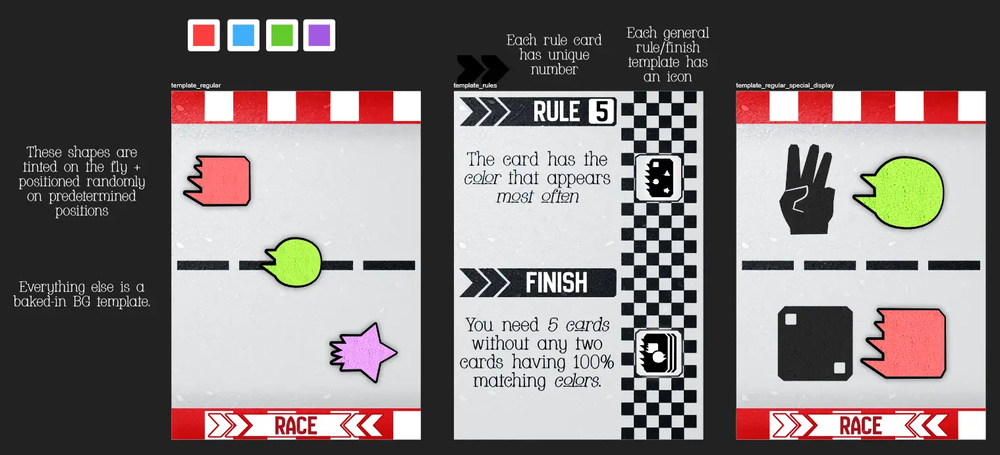
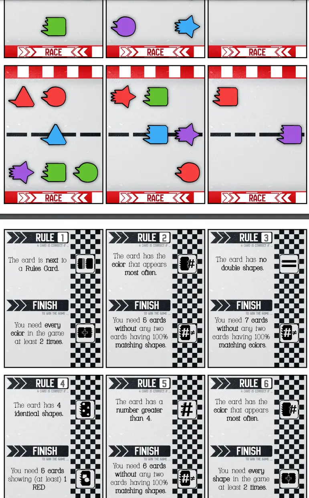

Welcome to the devlog for my game [Racesmack](https://pandaqi.com/swiftsmash-saga/tap/racesmack/). The game is part of the _SwiftSmash Saga_ collection, which is all about games where you simultaneously reveal cards and must then be the first to _smash_ (or just tap/pick) the "right card".

It's one of the more experimental games, where I used some ideas that just didn't seem to fit anywhere else. Initially, this made it a bit of a struggle to get a playable game out of it. I was about to say this devlog would be very _short_ because I just had no clue what I was doing and might abandon the idea.

Then, however, as I wrapped up the other SwiftSmash games, I seemed to have grown a bit in skill and insight. I realized how to make the game work, and it actually became quite good and one of the "simpler ones".

How did that happen? Let me take you on a short journey.

## What's the idea?

Other SwiftSmash games explored some basic ideas.

* (Point-a-Pile) What if you received the pile of cards at which you point, and player's have an individual goal to win (such as "Get 5 Blue Cards")?
* (Smackshapes) What if the correct card could change because people played an "action card" that changed the rules a bit?
* (Cookie Smasher) What if the value of a card (or whether it's the one you should tap) changed depending on its neighbors/surroundings?

This game idea was left with the leftovers. Some slight variations on the ideas above, mixed together into ... something I didn't dare call a game yet.

I wanted a SwiftSmash game where ...

* Multiple cards could be correct each round, so multiple players could win a card. => This feels more motivating and gives players more moments of "success" as they play. As opposed to just _one_ person winning _everything_ each round.
* There are two types of cards: Regular and Rule. The _Rule_ card would have a completely different rule that states which cards are correct. If they are played, you must follow those instead. => Because I hadn't done it before, but also because it is an easy way to make games like this harder and more varied.
* The cards you collected are placed in front of you in a row, so the _order_ in which you collect cards matters. (Because a card might say "I am worth 2 points if next to a Blue card.") => Again, this means you build up your own custom thing over time, and the _exact_ cards you win matter.

Okay. Clear requirements. There should be something here. But _how_? How to turn it into a game?

## Refining the idea

At some point, I don't know how or why, the theme of _racing_ came to me.

* That personal "objective" could be rebranded as your own "finish line". ("You win the game if you get over the finish, which takes X Blue and Y Red.")
* The cards you win could literally look like parts of a racetrack, so you build that track before you during the game. (With your personal finish at the end.)
* It allows a name with a pun: _Racetrack => Racesmack_. Incredibly important, of course.
  * This was inspired by my earlier game _Booksmack_, which is a pun on _Bookrack_. Perhaps that's how I arrived at the racing theme.
* This is a theme I never used before, and it should certainly make the game more thematic and colorful than the more "abstract" entries so far in the SwiftSmash Saga.

Now things were coming together. I could see the general outline of a ruleset.

* The _default rule_ of the game is simple: "A card is **correct** if it has has the most-occurring shape." (In other words, this likely creates a few cards that are correct and can be smashed. But this is simple to remember and to calculate.)
* But there are special _Rule_ cards that have text saying something else.
  * At first, I gave the Rule cards unique _numbers_ and said "if multiple are played, the one with the highest number is the one to follow".
  * This is good, but not the simplest version. It requires chasing small numbers on the cards and it leads to a game where the default rule almost _never_ actually matters. It also gives too much certainty to someone playing a high Rule card: they are the only ones that know, before the round starts, that their rule will most likely be true, which is a head start others can't really combat.
  * As such, for the base game, I changed it to something simpler. **If exactly 1 Rule card is played, follow it.** Otherwise, they cancel each other and don't work.
  * (The approach with numbers is still used in a variant/expansion, just not base game.)
* Once everyone has tapped _something_, check the results.
  * You tapped a correct card? You win your own card.
  * You didn't? You lose 1 of your won cards.
  * (Any leftover cards go to the FIRST player to tap the correct card.)

Those cards you've won go into that row before you, which I called your "Race". You'll need to win some cards to win the game, but you also need to be smart about _what_ you win. If you don't need your own card for your Race, then you can take it slow and make sure you don't tap a _wrong_ card in haste, for example.

Then I realized I can simplify this further by **merging** the Rule and Finish cards. It's simply a card that has _both_ on it.

* The Rule obviously matters when it's played during a round.
* The Finish rule matters if you _win_ the card and place it at the end of your race.

Of course, multiple finishes don't make sense, so there's an extra rule about always having only 1 personal Finish. 

{}
Which you can replace at any time, or not. I don't feel it would add anything to the game if you were _forced_ to replace the Finish every time you won a new one, for example. That would just be annoying and needlessly constricting.
{}

This means we're down to just two types of cards, with a clear purpose and iconography. Simple core rules for the game, but the varying Rules can really change things up.

When I tested this and worked on the final material, I made one final change.

* The rule "the round ends once everyone has tapped something" isn't great. That final player has all the time in the world. Technically, they could stall the game forever, or draw out every round to make sure they tap a right card, and that's just not great.
* Instead, what almost always works well, is changing it to **"the rounds ence once _all players except one_ have tapped something"**

This has the following consequences.
* You're still rewarded for being the first: you get all leftover cards. And there is guaranteed to be one leftover card now!
* But you can be a bit slower and tap something correct, and still win your own card.
* But if you're _too slow_, you don't get the chance anymore! Which incentivizes players to be a bit more hasty than they'd like, because the chance of winning more cards is always better than getting absolutely nothing for sure.
* But to make it even _more_ interesting, that last player also doesn't _lose_ a card if they're wrong, of course. Because that last player didn't tap anything!

In other words, this simple change nudges all players to be hasty and really figure out a correct card fast. But you _can_ still do well if you're just slower or use a different strategy.

With all that figured out, the rules were short and simple again, but the game distinctly different from all the other SwiftSmash Saga entries. This one is really about being consistently _not-wrong_ or _not-last_, instead of an all-or-nothing _be first all the time_. In other words, it's a longer race, and all that matters is who gets over their finish first at the end.

## Let's make that!

### Code Generation

Generating the cards for this game wasn't anything special.

* I made a list of possible Rule changes.
* I made a list of possible Finish requirements.
* These are "templates" that have some dynamic values that are filled in randomly. (For example, "You need `%num%` cards to finish", where `%num%` is then replaced with a number between X and Y.)
* I randomly match these into pairs and put them on cards.

The regular cards are similar. I have a list of shapes and colors, and then I _fairly_ distribute those over the number of cards that I set. This will never be perfect, of course, but it means that all shapes/colors appear _roughly_ equally often.

### Graphics

Then, for the visual side, I had no plan and followed my intuition.

* I added a simple gravel/asphalt texture as background. (Or, well, it's more of an "overlay" as it is also on top of a lot of elements. To give them just a little extra detail and polish.)
* I added simple arrows/spikes coming out of things at the back, a very common signal for "speed" or "racing".
* I added an actual Finish line for the finish cards.
* I added some road markers and those red-and-white edge barriers to the regular cards.
* Through the entirety of this design, I tried to make all corners "beveled". They're not spiky, but also not a smooth curve. This just felt like the most fitting aesthetic, and I feel I was right.

I looked at what I'd done, and realized it was good and didn't need any changing. Below are my sketches.

## A simulation

I did simulations/interactive examples (in the rulebook) for all SwiftSmash games. But because this one was the most uncertain and "experimental", I wanted to talk about it more.

I needed to know ...

* How many cards were likely to be "correct" (on average) per round => if this is very high or very low, we have an issue.
* How many cards it took (on average) to achieve finish requirements => again, we want the game to last a consistent 20 minutes or so, not too short or too long
* How minimal I can make the deck before we run into trouble => I don't want to make people print/cut/store more cards than absolutely needed, so I'll check the likeliness of the deck running out

To know that, I let the computer play hundreds of thousands of random games of Racesmack. It's not very intelligent, but it follows the rules, and I can turn some "heuristics" on or off to see what happens when players use a certain strategy.

It's a good way to know probabilities, averages, game duration, etcetera. It doesn't say anything about the game being fun, of course, and average human players will do more _intelligent_ moves and thus have a slightly different experience.

Anyway, what were the results?

* With my current distribution of cards (percentage regular, percentage rule), it rarely happens that a round only has 1 or even 0 regular cards. Which is good. **The rule cards shouldn't overcrowd the others.**
* I realized that it _can_ happen that a round has _only rule cards_. **Which means there's nothing to smack!** I needed a simple and clever rule to handle that situation. 
  * Solution? This was really a different problem: the lack of a rule for when NOTHING is correct.
  * After throwing out several ideas, the simplest solution was to say "tap your own card".
  * It's an extremely simple rule, easy to remember, but also applicable _whatever_ the cards in the round are. 
* It showed that the **likelihood of most/all cards being "correct" is a bit too high**. In hindsight, this is obvious. If you must smack the card with the shape that appears _most often_ ... well, that shape is likely to be on most cards, is it not?
  * Solution? This didn't actually need a solution. There's still a good percentage of rounds where not _all_ cards are correct, and some where _none_ are correct (as discussed above). Additionally, the flipside of this rule ("smack the thing that occurs least often") is already a Rule Card that appears a lot.
  * And even so, I want the game to lean a bit more towards being friendly to the players. It's more fun if you score 1 card _most of the time_, than if it's _really hard_ to score anything at all and you keep losing Race cards.
* **The finish requirements were mostly fine.** There was quite some variation here, but on average the game was decided by someone finishing 75% of the time. Remember that these computer players play randomly, which means they don't make any smart progress towards their finish. If a random stumbling player can end up reaching their specific finish 75% of the time, I think smart humans will be able to do it near 100% of the time.
  * Solution? I _might_ consider a "default finish". If you have no finish card, then you win by having 15 cards of any kind. But I didn't feel this extra rule was truly needed, and it complicated the "objective".
  * Solution Really? I decided to do something different that kills two birds with one stone. **"If the deck runs out, whoever has the most cards wins."**
  * This covers the rare case where nobody finishes before the deck runs out. It also emulates the same idea as above: if you have no Finish Card, you can win the game by just having the most cards in your Race.
* **It revealed that winning a Rule/Finish card is a bit _meh_.** Because you can only have one in your race anyway, and once you've picked one you'll likely want to stick with it, so that just devalued playing/winning such a card a lot.
  * Solution? I simply removed that rule. Simpler is better! You are allowed as many Finish Cards as you want, but only the _one with the highest number_ actually applies.
  * This combines with the change above to place some value on just "having a lot of cards" (by winning a lot), while keeping a slight tension/decision because you might not want a higher-numbered finish to replace the one you're currently going for.
  * Well, at first I wanted to make this a _decision_. Any cards scored were optional and could be discarded. But ... it's actually more interesting if we _don't_ do that. You might get a situation where you don't _want_ to be the first player, because it'd win you a card that ruins your Race.

The biggest change, however, was realizing that I needed _fewer shapes on the cards_.

* When I created the material, I made an educated guess (based on previous games). There could be 1--6 shapes on a card, where the middle one (3) was most likely, and the other numbers became less likely as you moved further away.
* But ... this is overwhelming, makes certain finishes _very easy to get_, and _worsens the problem_ of almost any card being correct. (When there are so many shapes on a card, it's very likely to contain the "most common one" too.)
* It's also one reason for the wildly different results sometimes. If you're very unlucky with your cards/finish/rule, having that many shapes on cards can ruin you for an entire game. (Maybe your finish says "you need 8 cards and none match a shape with a neighbor"---that becomes incredibly hard if you win cards with 4+ shapes.)
* Instead, I changed that to be 1--4 (and lowered a few finish requirements to balance/match). Moreover, the lower numbers are slightly more likely.
  * This makes it quite 50/50 that neighboring cards (don't) match.
  * While increasing the probability of a card _not_ having the most common shape (usually because it only has 1 shape).
  * While making the game less overwhelming if you're with a lot of players.

{}
Also spotted a slight bug in my simulation thanks to these changes. But fixing it had surprisingly almost zero impact. And yes, I checked that it truly was a bug and it truly was fixed now.
{}

As usual, I made all these changes, tweaked some numbers, and watched the simulation stabilize around the values you typically want. Also as usual, this is no guarantee of anything, it's just random computer players doing random moves, and a "perfectly balanced game" isn't necessarily fun.

But as the list above demonstrates, these simulations simply catch errors and potential issues that might never crop up in my own playtesting. (Because I can't playtest my game 10,000 times with different players and stuff :p)

Now some final, hard statistics / numbers!

* **Average # correct cards per round**: 1.6. (Likely more than one, but rarely "all cards correct".)
* **% Games won by finishing**: 96% (With actual intelligent players, likely 100%.)
* **% Rounds with NO correct cards**: 15%. (Again, it will happen once or twice, but not all the time.)
* **Average # rounds per game**: 10 (Bit short for some player counts, a bit long for others, but that's why it's a nice average.)
* **% of rounds where special rules matter**: 75% (A _bit_ high, but is it an issue?)

The changes I made (mostly to keeping Finish Cards instead of replacing them) really stabilized the game. More likely to finish, less likely to have rounds with too few/too many cards correct, and the game doesn't take ages because people acquire cards too slowly.

The percentage of rounds decided by special rules (instead of the default) is still quite high. But, as usual, that is fine because the _expansions_ add more regular cards (no rule cards). This dilutes the number of Rule Cards further, so if this percentage was too low now, it would cause issues with the expansion.

Also, I added a simple variant/remark to turn this off---perhaps for your very first game---which doesn't break the game in any way.

I briefly considered making _that_ the default. Extremely simple; Rule Cards just do nothing special. Only their _Finish_ part (bottom text) matters.

But leaving Rule Cards out of the base game _entirely_ would just feel like the base game was only ... half of the game. As if the other half got lost in the mail. And I saw no clear way to explain it later. Because, well, the Rule Cards should _not_ be "just one optional expansion"---they are the core of the game idea and a big part of the deck.

Now I just need to stop tweaking numbers and rerunning simulations, or I'll be doing it all night without actual improvement!

## Conclusion

Below is a screenshot of the final material. I also made one when I finished the original code+graphics, but later realizations and the simulation results tweaked a few things again. So the image below is _likely the final version_, but I can never be sure.

This was the moment I noticed my tinting effect didn't actually do the same as the tinting effect in my graphic design software. We lose that texture on the shapes, which is a shame. I'll need to fix that bug someday.

Looking at the final material in its entirety, everything added and filled in correctly, I also felt like the Rules cards were slightly too busy. Merging Rule and Finish was great for simplifying material, but it _does_ make it a bit harder to read that Rule card. I updated the rules to add the common rule of "reveal the card _away_ from you" (so that other players can read the text + see the card earlier than you), but that doesn't solve it completely. 

In another game, I'd have made the rules text bigger + copied it to the other side so it was readable in two directions. But that just doesn't work here, unless I destroy the simple material and rules. Is that worth it? I didn't think so. Reading a single short sentence, perhaps a bit from the side, is the least of your troubles in a chaotic fast-reaction game like this. 

{}
This is also why I'm glad I changed the rules to "if multiple Rules Cards are played, pick the highest". This requires you to focus on the actual _content_ of all Rule Cards anyway, at least for a brief second, to find the highest one. Which isn't much different from reading that one sentence on it. And in any case, only ONE of them is true, so it doesn't overwhelm.
{}

As so often happens, a game that was vague and a struggle at first, became one of my favorites. A nice theme, simple rules and cards but slightly deeper gameplay, and all around a solid product. I was probably able to find slightly better solutions (and visual designs) _because_ I took a bit longer on this one and discarded my initial vague ideas.

Sometimes it's worth pushing through an idea that doesn't seem to work at first. Sometimes it's not. It's hard to judge which one it is every time. You just gotta try your best, make the thing, and let others judge its worth.

This game was never intended to be released with this "first batch" of SwiftSmash games. I wrote it down as "very optional" and listed it for the second batch. But, well, things happen, I thought I had something good enough to make now, and here we are. 

It did make it hard to "place" this game in the ranking for SwiftSmash Games. (I usually present these in order of complexity, so new people can try the simplest one first.) It's simple, but also very text-reliant. It's simple, but also longer than the other games. So I ended up placing it middle of the pack anyway. We'll see if that changes _next year_, when I'll probably close off the series with 4 more games.

Until the next devlog,

Pandaqi