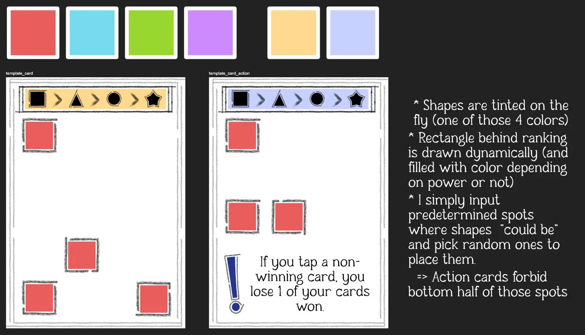
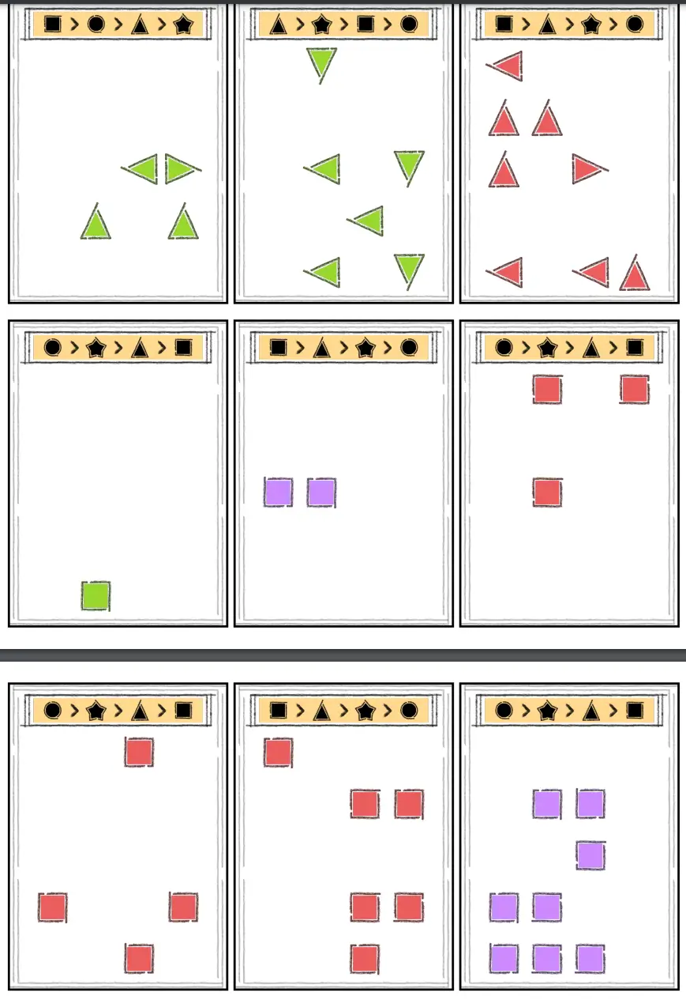

Welcome to the devlog for my game [Smackshapes](https://pandaqi.com/swiftsmash-saga/tap/smackshapes/). The game is part of the _SwiftSmash Saga_ collection, which is all about games where you simultaneously reveal cards and must then be the first to _smash_ (or just tap/pick) the "right card".

This devlog will be very short! I know, that's a rarity for me. I often promise that and always fail to keep it brief.

But this time I am certain, because the game is already done. In this devlog, I'll quickly guide you through the process of making the game, why I made certain (interesting) decisions, and then give my thoughts about the final result.

## What's the idea?

Some time ago, I made _Cookie Smasher_. At the time, it was just an experiment and not planned to be a series. 

When I finished that game, I had the usual thought: "The game is fine, but now I know how to do it _better_ and _simpler_."

I wrote down the general idea for _Smackshapes_ (dubbed the "Kids Version" of Cookie Smasher back then). I saw that it would indeed be far simpler, and knew it would probably work. I was busy with other projects, however, so I dropped it for a year or so.

That version of the game was as follows.

* Cards show colored shapes. (These don't have to be the same: a card might show a red square and a green circle.)
* Everyone plays a card at the same time. When revealed, you have to find the **shape that appears the most** (and smash a card with that shape)
* If there's a tie for that, you must pick the **color that appears the most** (and smash a card with that color)
* If still a tie, smash any of the winning cards.
* (And PERHAPS the game would add _rules cards_: these would have a different rule for finding the "winning card" than the usual one I described above. If anyone played one of these, their rule would take precedence.)

A fine idea, but not as streamlined as I'd like. This didn't guarantee a _single_ winning card. It did lead to _many ties_, which are hard to calculate for players (and not that interesting/fun). And the Rules cards would stop this from being a "Kids Version", because it would require complicated text on the cards to explain each rule.

When I came back, the idea had simplified _even further_ in my subconscious brain. It had come to this:

* Cards only have **one color** and **one shape**. (For example, "2 red squares" or "3 green triangles")
* Moreover, the number of them is **unique**. (There is only one card with 3 green triangles, never more.)
* Moreover, each card shows a **ranking** of all shapes. (This can be done with icons and without text.)
* This allows simplifying the core rules.
  * The card from the start player shows the ranking. (Example: Square > Triangle > Circle.)
  * **Tap the card with the highest-ranking shape.**
  * If tied, tap the card with the **most** of them. 

This _always_ leads to a single winning card, without any bias. (Cards with a _high number_---a lot of shapes---don't necessarily win more often, because their shape might be on the low end of the random ranking.)

This also allows the game to function with only ~25 simple cards. They show no text, just basic shapes in basic colors.

In fact, you might notice that _colors_ don't matter now. I briefly considered removing colors entirely and just making this the final game, but I decided against it.

* Those colored shapes are necessary to make the game look more vivid and, well, colorful.
* These core rules are _so simple_ that I really want to add an expansion that uses those colors and adds some spice.

This expansion, as expected, uses the colors. 

* My first thought was to bring back the old rule: "In case of a tie, tap the color that appears the most." But, well, our game _has no ties_ right now and I don't see why I would mess with that.
* After some brainstorming, I found the simplest rule that does have massive consequences to gameplay: "If _all colors are the same_ (in a round), it **inverts**. You want to tap the lowest ranking shape and the lowest number."

With that, the rules were a single page and the game worked well. Whatever people played, you will never immediately know the winning card, nor will it take you a minute to calculate.

## Let's make that

The code that generates the cards is nothing special.

* It simply loops through all shapes + all numbers allowed, then creates _one card_ for each combo. (The numbers are between 1--9. Some of them, however, are reserved for the expansion. Because those cards should be unique too!)
* It assigns colors randomly, but fairly. (Some colors might appear more often than others, but the difference is never larger than 1 or 2.)
* The expansion also adds an action to the cards. This is randomly picked from a list of templates (like "Ignore the color `%color%`"), where the thing between percentage signs is _replaced_ by a randomly picked color when drawing the card.

Similarly, the visual design is nothing special. With Cookie Smasher, I entered a visual style for this series that is all about minimalism and giving cards a mostly solid (white) background. I won't do this for all games, but for the _absolute simplest of them all_, it felt fitting to use _the absolute simplest card design_. 

{}
I've spoken about this before. It sounds reasonable to think "well the game is so simple, let's compensate/balance that with an intricate graphical design", but I've experienced the opposite. This just sends the wrong message and the wrong expectations. Because of the design, people think it's a long and complicated game! 

Additionally, it's hard to motivate myself when it takes 10x as long to draw the card design than it took to design _the entirety of the game_.
{}

Below are my quick sketches and notes on the design.

I used simple pencil brush strokes to mark some boxes. I used basic shapes, but with that pencil _outline_ again to set them apart.

Then, in code,

* I _tint_ the shapes to represent the color of the card. (The original shapes are just white with a black outline, but with a simple effect I can make that any color. Because tinting always makes things _darker_, a black outline is preferred here---it will just stay black and keep the look consistent.)
* I manually picked the positions of the cards where shapes can appear. For each card, it just randomly picks from that list and draws the shapes at those locations.
* (When an action is present, it's forbidden from picking positions low on the card, which are all past the halfway point of that list.)

I drew this one night, I implemented it two days later (when I finally could go back to using my laptop), and ... well, nothing special to say.

My only "doubt" was the size of the ranking at the top. Shouldn't it be larger? It's such a crucial element to each round!

Then I tried it and realized that, no, this design is fine. That ranking only matters on the _card played by the start player_. While the shapes + colors of a card _always matter_. So those should still be most prominent and easy to read.

Moreover, different people might have different strategies---some check the ranking first, others count shapes/colors first and _then_ look at the ranking, etcetera. For some the ranking has "highest priority", for some "lowest", and that's great! Diversity in strategy is always good. I don't want to ruin that by making the ranking so large you can't help but start by seeing it.

This means the final material looks as follows.

## Conclusion

That's it!

The idea was basically a "fifth iteration" of Cookie Smasher, simplifying it every time, which gave it a solid base already. With some slight tweaking, and a simple and clear (textless) design, the game just works. And I stop there to prevent myself from overthinking or overcomplicating it.

The rules should be teachable to _anyone_ and _any group_. It's fast to play and anyone can win, but being the first to smash the right card is still hard to do every time. I think it nicely finds the balance between making players think _oh that's easy_, but then turning out _a little more challenging_ as they play.

As such, right now, this game is firmly in the spot of "simplest SwiftSmash game", and I don't see anything dislodging it.

Until the next devlog,

Pandaqi