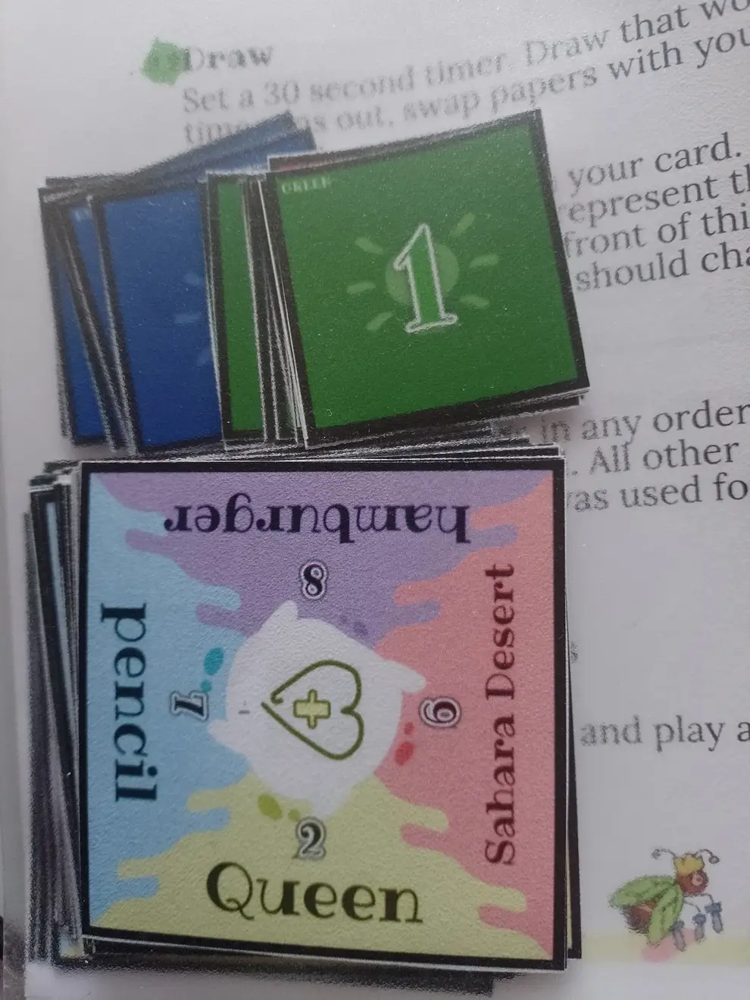
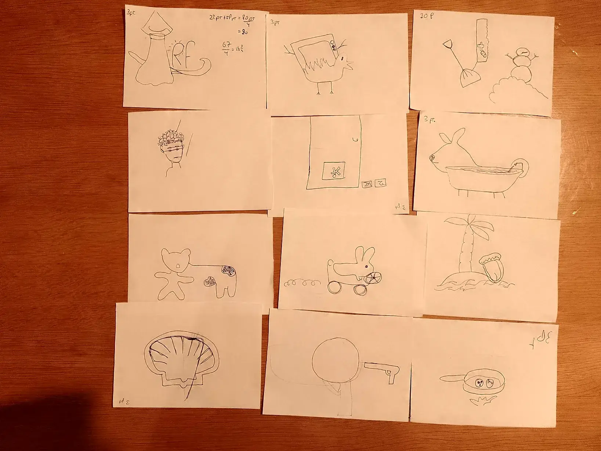
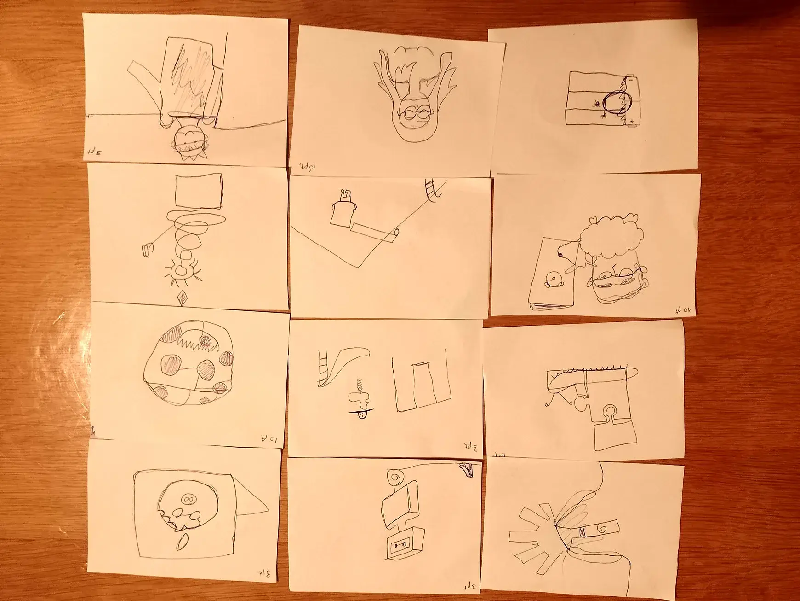

Welcome to my devlog for the game [That's Amorphe: Pictures](https://pandaqi.com/thats-amorphe-pictures).

As expected, it's a variant (or spin-off, or expansion, or sequel) for [That's Amorphe](https://pandaqi.com/thats-amorphe).

While finishing the design and drawings for that original game, I suddenly realized: "hey, this game might work even _better_ if we **draw** the morphs!" I wrote down the quick idea. Once the base game was done completely, my head was sure that this was a good idea.

So I pretty much immediately started development on it. This will be a short devlog explaining interesting problems, decisions I made, and the general journey making this game.

## What's the idea?

In the original, you must "morph" two things by saying a new word.

For example, your words are "cat" and "bike". Your secret number is 3 (scale 1 to 10). Then you must say _one word_ that's 30% cat and 70% bike.

The other player must guess that secret number.

Pretty easy, pretty fun, worked well. This uses _words_. It's a language party game (it even says so in the header image).

Now let's do that visually, by **drawing**. Let's also use this opportunity to improve some things from the base game.

## Improvement: simultaneous play

The base game is cooperative by default. It means that every turn ...

* One person does the morphing
* While the others wait and then guess

This is _fine_. It's a quick, interactive game. Still, I wanted to ensure that _everybody_ is doing something all the time.

The rules became ...

* Form teams of two
* First one person draws their word
* Then they give the drawing to the second person. They draw their own word on top of the existing drawing.
* Once all drawings are done, everybody guesses.

This means the second person is the one doing the actual morphing. They get a secret number (... somehow ...) and "amend" the original drawing to show this.

We can improve this! By simply doing two drawings.

* Everybody picks a word and draws it on their own paper.
* Then they swap papers with their teammate and morph the drawing. (With a secret number and a new word.)

## Issues

The main issues were:

* How to form teams?
* How to get secret numbers?
* Are the original _words_ known to players or not?
* What rules exist for drawing? (To balance difficulty)
* How to add a competitive mode? (If pairs are needed, you'd need 5+ players for competitive mode without changing the rules)

I like listing them all at once, because the best solutions---in (game) design, at least---come from solving multiple issues at once.

### One card type

We can put both **words** and **numbers** on cards. (And in the expansion, action icons on those same cards. Like the base game.) 

This means we only have one card type, in one nice deck, which is _simple_ and _good_.

It also means we can put all rules on the card itself.

* At the start of each round, all players draw a card.
* When they pick a word for morphing, the number in front of it _is your secret morph number_
* The numbers can also help form random teams

### Forming teams

That last part was more difficult than I thought. I want to say: "say any number on your card---if two players match, they are a pair"

But ...

* This adds choice to the game that is not needed and not fun. (Players would just slow down the game, picking which number from their card they want to say.)
* There's absolutely no guarantee any numbers will match, or match in pairs.
* You'd need to say the numbers in some order, which needs extra rules, which is annoying
* What to do when you have an **odd** number of players?

I wrote that paragraph at least a dozen times. Trying different approaches that are easy to understand/read, but lead to somewhat random teams.

In the end, this felt doable and easy to explain

* Pick a word and say the number before it
* If anybody else has that number as well, team up
* If not, pick freely

It doesn't matter where people start or what order they use. Explaining some rule about it wouldn't do any good, in my eyes.

Because it says "if anybody _has that number_", there's a large chance for teams to form. Because you're not matching 1-on-1, you're matching 1-on-"all the numbers on the card".

Let's math this :p Let's say we have 4 players. Each word card has 4 options. There are 9 morph numbers (1-9). 

How likely is any number to appear on another player's card? (1/9) + (1/9) + (1/9) + (1/9) = 44.4%.

There are 3 players. So the probability of _nobody_ having that number is 0.556 * 0.556 * 0.556 = 0.1718. Which means the probability of _somebody_ having that number is 1.0 - 0.1718 = 0.82 = 82%. Quite high.

You know what? Let's simulate this to be sure. I wrote a quick JavaScript function to do this. (For 4 players, 10000 runs.) And it says

* First player? 75% probability of matching based on number
* All players (average)? 57% probability of matching based on number. (It's expected to be lower, because the more people are already teamed up, the lower your chance of finding someone.)

I'm not sure where my calculations are wrong. But these numbers are high enough to satisfy me. (And they get higher with more players.)

### Why care about random teams?

This should be a lighthearted social party game. You **don't** want ...

* To waste time on making (not-so-meaningful) decisions
* Subtle social dynamics to be exaggerated

For example: favoritism. You might like one person in the group a bit more than another (consciously or not). So you keep teaming with them, maybe the whole game. Or you refuse to team up with one person in the group. This is likely to annoy or upset people over time, ruining the game.

Randomization in setup is basically always good, even if those decisions _could_ be made by players.

The system above integrates nicely with the rest of the rules. (You have to pick a word anyway. Now that single action does two things at once: pick the word _and_ your number for teaming.)

Additionally, different drawing styles (or ways of thinking) will lead to way funnier or more varied results.

### Timing & Drawing Rules

Yeah, we're going to put a timer on this. I've played enough drawing/party games in my life to know that allowing "as long as you want" on your turn will ruin it in the end.

People just ... overthink things. They suck the fun out of a game by analyzing too much or playing too "perfectly". So don't allow it.

A 30 second timer per person, so 1 minute in total, was my answer. That may seem way too short. But it's not:

* You're only drawing one simple thing
* And you're not even fully drawing it, as you want to leave space for the second drawing
* And ... let's talk some more about _drawing rules_

The issue is that people can easily cheat. If you say "only one line", they'll just never lift their pen, drawing what they wanted to draw anyway. (But now more messy. And wasting more ink. Looking at you, A Fake Artist Goes to New York.)

Additionally, I was tempted to say "no words, except for sounds or words embedded into objects". But then I remembered how people abused that as well---all the time. And it's a rather vague definition.

So in the end, the rules are quite strict (and short).

* You have at most **three lines**. (Combined with 30 seconds, this is more of a guideline on how the game should be played than anything.)
* No letters or numbers
* You obviously cannot pick the number you said out loud (while forming teams) as your secret morph number
* You must **connect** to the existing drawing (when morphing)

In my experience, these will lead to good gameplay in a drawing game like this.

## Other modes

### Secret words?

I decided to make the original words (used for morphing) known. Hiding the original concepts is a variant to make it harder. If, however, the playtesting reveals that it's too easy, this will be the first rule to enter the base game.

### Team sharing

This is the other rule that might be added to the base game if playtesting shows difficulty issues.

Before you start your drawing (the first one, not the morph), your teammate reveals the secret number they chose (to you).

You can compensate for that in your drawing. If you know the other has an "8", you need to leave a _lot_ of open space for them to draw their morph. Because the final drawing should _mostly_ be their word and only a little bit your word.

### Reuse material?

Additionally, I wanted to allow playing the game using the material from the original game. Fortunately, it only took a few sentences to explain how to do that (with my current rules).

Because, well, the original is mostly the same game, just ...

* With word cards and morph cards separated
* Which means no numbers on the words itself

So you have to draw both card types. Because the base game only has 10 morph cards, you have to remember it and then put it back in the deck. (Otherwise, if one person drew a 4 already, nobody else can have morph number 4. With 4+ players, this information makes the game way too easy.)

### Competitive?

As I said, just creating teams isn't ideal. You need 6 or more players. (In each team, 2 will draw, and the third will guess.)

Instead, I wanted to change the rules so that ...

* _Everybody_ was drawing again
* The competition isn't between teams, but between all players

I was reminded of Dixit. That game plays as follows:

* You secretly play a card and say a "clue" or "hint"
* Everybody else also plays a card from their hand that matches it
* These cards are shuffled and then revealed.
* Everybody guesses what they think was **the original card** (from the active player, who obviously doesn't vote themselves)

Here's the important part:

* If nobody guesses correctly, you get no points
* But if *everybody* guesses correctly, you also get no points
* Which means it's your job to convince a few players, but not all

It felt like I could repurpose that for this game. But I also prioritized keeping the rules at least 90% the same as the cooperative mode. (Otherwise it feels like two entirely different games mashed together, and it's a bigger hurdle to learn other modes.)

* Teaming up works the same as before
* Drawing works the same as before
* Only _guessing_ and _scoring_ are changed.

When guessing, all other players must write down their (final) guess on the drawing paper.

* Each guess that's correct scores team members 10 points, and the player that guessed it 5 points
* Each guess that's one off scores team members 3 points, and the player that guessed it 1 point
* But if all guesses are correct, the team members score nothing.

The _player_ with the highest score at the end wins.

_Why the big discrepancy? 10 vs 3? 5 vs 1?_ This is a common method to encourage players to be bold. Go for what you think is _exactly_ the right answer. Even if it's risky, even if no other player chose it. Because the reward for getting it right is far greater.

{}
For that same reason, winning a soccer match gives you 3 points, while a tie only gives 1 point. And losing gives 0 points, of course.
{}

_Won't writing down the guess influence players a lot?_ Yes, it probably will. Is that a problem, though?

At first, I didn't think so. Then I worked on the game more, thought about it, tested it, and realized the old rule again: "players will optimize the fun out of a game"

For _guessers_, it's always wise to guess the same number. Either they all get a load of points (and the team members nothing), or everybody is equally screwed. Nobody gets ahead, nobody is left behind.

So yes, you're right, we do need to vote secretly. Write it on the back of the paper? Nah, messy, people might peek at other player's answers.

Dang it. We need one more sheet of material for **voting chips**. 

But it's not as bad as I feared. Another lesson I learned is that it's good to "group" things in games and "keep numbers small".

We already have teams. So let's do **voting per team**. Even with 8 players, we only need 3 sets of voting chips, 1-9. (3 teams voting; 1 team did the actual drawings.) That's 27 small square chips, which should _just_ fit one page.

{}
On lower player counts, voting still happens per player. Not only because we _can_ do it---in terms of material and time---but also because there's otherwise not enough possibility for players to create a meaningful difference in points.
{}

## The issues of extremes (again)

The original game had "the big issue with games of scale/association". You have to morph between word A and B. But what if you draw the lowest number? You can just say "A" (or a synonym for it, or something very close to it). People will realize you have the lowest number pretty quickly.

This game looked like it had the same issue, but less severe. Drawings are more fuzzy. Because the morph happens across _two players_ (with imperfect information), you already get some discrepancy.

But still. If you draw the lowest morph number, and there's a beautifully drawn giraffe in front of you ... you just **don't draw anything**, right? Well done, all points---not fun.

I decided a minor change to one of the drawing rules would solve 90% of the issue.

> You **must** draw three lines

It's not an upper bound. It's a must. Combine this with the fact that it must be _connected_ to the original drawing.

Even if you aim to change as little as possible, you _will_ change something, and it's up to the other players how they interpret it.

This might not be enough. I need to test this. Other options are

* If you have the number 1, you don't say your word. Instead of guessing the number, the others must guess your word. => This really only works if words are hidden/secret by default
* If you have the number 1, you must morph towards _two_ words on your card. Don't reveal this: you only say one word to the others and pretend everything is normal. => I like this more, as it's generally applicable

## Expansion

This works the same as before. Now people can ask for help / more info while guessing, by using the action on their card.

This is simply an icon in a reserved space. (Which is left empty if you only download material for the base game.)

However, I did have trouble coming up with simple actions for this game. The things I invented often took too many sentences to explain, or were just very ... contrived. Yes, that's the word.

For example:

> Ask the drawer to morph the existing drawing again. But they must use a new (unknown) word and number from their card. Now you need to guess the new secret number.

Not too bad, but also not simple enough for a party game.

As always, I just wrote down all my ideas, but was very much prepared to scrap 80% of it for the final game.

## A week later

I took some time off, to replenish my pool of ideas, and because I had to finish other (paid) projects.

Coming back, I immediately removed some "actions" and added better ones. 

The example I gave above was removed. It was fine, but "fine" isn't enough. Now, all the actions are at most two short sentences. None of them require any extra setup (like getting _another_ paper or drawing _another_ card). And I clearly see enough moments when you'd want to use all actions.

Only one action is more complex, because it's special (and just too _fun_ not to include): **blind morphing**. You must play it before doing your morph. Then, as you'd expect, you have to draw with your eyes closed. But any points scored will be doubled!

Then I started generating the material. I realized I was being stupid and could re-use the design of the original cards. (I thought I needed new cards and a more "list"-like layout: word + number in front. But that's not necessary. And in that case, I'd rather stay consistent and make all word cards look the same.)

So word cards are: four words, one on each side, with their secret number above them. As with the original game, the middle spot is reserved for an optional action icon. I had to remove the faded text that shows the subcategory of the word---there just wasn't space for it anymore.

Otherwise, I turned the original code (for That's Amorphe) into a separate script that I could re-use. So generating material for this game mostly meant calling code I already wrote, with some slight changes.

When writing the code to get a "random secret number", I added a sneaky, sneaky trick: 

> The extreme numbers (1 and 9) are _less likely_ to be picked. 

Players still need to take them into account. They _can_ still appear. But it's far less likely, which solves even more of that issue. (Remember: the number 1 is inherently boring, because you can just not change the drawing at all.) But only as long as players _don't know_ the code uses this trick, so ssssh, don't tell anyone.

## About the random generation

I'm still learning how to randomly generate _good looking_ material for board games. I tried a few new tricks this time, such as stroking (or double-stroking) the letters. Some of them worked, but sometimes the browser would mess up the stroke. This was unacceptable as it made the number almost unreadable (and just ugly).

So I had to settle for a simpler design on the word cards. One that most likely looked consistent and good everywhere, instead of one that looked _great_ ... except that 1% of the time that browsers decided to do something entirely different.

(The old word cards had much thicker numbers with a stroke to make them "pop out". The final version just has a circle behind the number for contrast.)

Additionally, the first version of the vote cards was very barebones: a color and a number. After printing, and creating the example images for the rulebook, this was just too barebones and unreadable at small sizes. I made the number much larger, gave it a stroke and a shadow. I added a light bulb icon behind it. (Simply because I already _had_ that image and thought it would look fine :p) 

In the corners, I added symbols (circle, square, triangle). For colorblind people, but also just to decorate the cards a bit more. Simple things like that made the vote cards look like actual, finished cards to use in a game.

I wanted to show images for these changes. But I'm an idiot and threw away the old PDFs/screenshots when replacing them with the new version! Instead, I photographed my physical first proof copy, which used the older design. Also a nice chance to show things like this in the real world, instead of just digital images and websites.

Besides that, I'm building my library of tools for this and getting faster at using it. Not much else to say about the material generation for this game! It's rather simple and literally re-uses the script from the That's Amorphe generator, just with some parameters added or changed.

## Playtesting!

That's a full game! Of course, it helps that we're re-using 90% of a game that I already made and tested. Additionally, this concept just clicked from the moment I came up with it.

Let's see if my feelings---this is going to be an easy fun game---are correct.

**They are!** 

Below are all the images from one game. (We played 1 extra round, because people liked it so much, and because the first round felt like a "test round".) As you see, I quickly cut three A4 papers into four, to allow six rounds. Drawing games like this usually work well at that size _and_ it saves a lot of paper and room on the table.

{}
Apologies for the weird lighting. The game ended near midnight and the lamps in that room are old and very ... yellow.
{}

The random team-making still feels like it should be simpler. Somehow, it's the most complicated rule in the game. (Which still means it's just two simple sentences, but hey, simpler is always better!) But as you've read in the devlog, I already though about it a lot and tried many different things, and I just don't see how to make it even faster or simpler. The random teams are important. Odd number of players must be handled. The rule doubles as picking your first word.

So really, it's not bad.

As I expected, sometimes it's a struggle to see _what_ somebody even morphed. But at other times, this is obvious. So changing the game objective to "guessing what the other drew" seems like a terrible idea. I leave those rules as they are---guessing the words is an easy variant you _can_ play if you want or it works better with your group.

Of course, with (group) party games like this, it always depends on your group. For some, the timer might be too short. For some, just coming up with how to draw something might be hard. But from my testing and experience now, I think the current ruleset is actually the perfect balance for most.

In the end, I only tweaked these tiny things:

* Less probability of the number 5 appearing (as it's also a relatively easy morph)
* A clarification in the rules: when creating teams, you have to use the word that belongs to the number used. (This allows removing a rule elsewhere and was the intuitive interpretation by most.)
* (I considered an extra challenge for drawing, such as "one line has to NOT touch anything else". Yes, all of that makes drawing harder. It also adds more rules that players forget, in practice, and removes the thing that turns out to be the core of this game: complete freedom with how you approach your drawings. So I didn't do it.)

After more thought and discussion, I wasn't able to find any part I could improve. Yes, nothing is perfect, and I have my doubts (as written in the previous few paragraphs). But I deem these minor issues without a solution (that wouldn't add more problems than it solves), which means I discard them.

That's it for this game! 

Until the next devlog,

Pandaqi