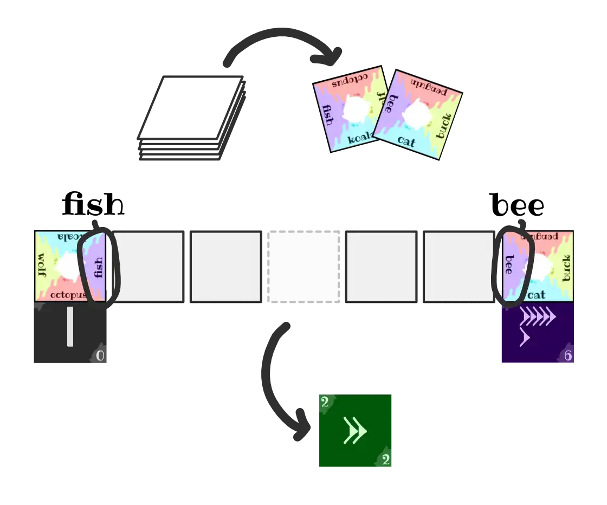
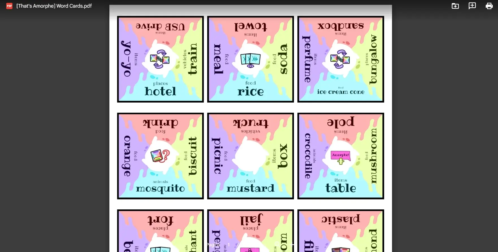

Welcome to the devlog for my party game [That's Amorphe!](https://pandaqi.com/thats-amorphe). In this article, I'll explain where the idea came from, how I developed it, and anything else that might be funny or educational.

As always, the game is available for _free_. Just download and enjoy. If you have feedback, always let me know. (The benefit of free downloadable board games is that I can always keep _improving_ them.)

## What's the idea?

It's a cooperative party game. On your turn, you draw two **word cards**. These will be the start and end of your "scale".

Then you draw a secret **morph card** marking a location on the scale (e.g. 50%, 25%, ...) 

Imagine the word on the left morphs into the one on the right _by that amount_. Name something that matches that! (In your view, at least.)

Now all the other players need to guess what your secret morph card was. If you're correct, or close, you score points.

{}
You draw "bike" and "car". You get a 50% morph card. Now you must invent _some concept_ that is halfway between a bike and a car, and say that.
{}

After a few games, you can add the expansions. They allow others to interact with you in specific ways, like asking more questions or changing the scale, to get _more_ information. Or ... they add unique morph cards that make your job even _harder_!

Lastly, on the website you can create your own set of word cards. In case the standard one has become too easy, or has word categories you don't like.

## Where did it come from?

I was busy _simulating_ a few games. I like doing that, once in a while, to find the "optimal" strategy for a popular game. This time, I was doing "Liar's dice" and "Exploding Kittens".

At the same time, I saw a video about the game Wavelength.

My head put 2 and 2 together, and the next day I woke up with 4 :p

I thought ...

> What if we create a game like Wavelength, where you work with a (vague) scale? But instead of a fixed and expected scale, it could be between _any_ two extremes? And it can be played with a small deck of cards?

That's what I set out to do. At first, the game was just called "Party game with a scale" and had only the few sentences above.

## First iteration

I realized that **morphing** was the verb/action I was looking for. We're not really working with a _scale_. (Because what _is_ the scale from "bike" to "house"?)

We're working with two different _objects_ or _concepts_. And you, the player, has to find some middle ground between them.

The game retitled to "Made-up Morphs". At this point, the rules were ...

* Draw two word cards, decide which one is the start and which one is the end
* Draw a morph card with a percentage
* Give your "morphed" concept
* The others guess. By default, you get 5 points. For every 10% they're off, you lose 1 point.

This was okay, but far from great.

* Nobody likes percentages on cards, especially not in a simple party game.
* The idea of a "scale" or a "morph" was abstract. It needed to be communicated with what's on the table.
* The scoring was too "smooth". You want high risk/high reward in (party) games.

## Second iteration

I realized I needed to actually _create_ the scale on the table. Make it visible, physical.

The game retitled to "Morphling Masters". The rules were ...

* Draw two word cards
* Place them far apart on the table; left = start, right = end
* Shuffle the morph cards and place them face-down _between the two words_ => Now you actually see the scale on the table!
* Draw one of the morph cards
* ... guessing is the same ...

Scoring was made more discrete:

* Dead on? 5 points
* One off? 2 points
* Otherwise? 0 points

This was a huge improvement. You actually saw the idea of the game on the table. Scoring was simpler _and_ more effective. (You're rewarded more for trying to get it _dead on_, rather than guessing a vague area and usually scoring 1 or 2 points.)

I turned my attention to what the other players were doing. Guessing, yes. But was it all going to be talk and discussion? Could we help that in some way?

## Third iteration

The solution was already on the table.

* Guessers can move around the morph cards (which still represent the scale, between the word cards)
* Their guess is communicated by the _gap_ they leave.

This way, as you discuss, you can already move these cards around to show what _you_ think is the correct position. You have something to do. You have something to look at.

The percentages remained an issue. Especially because I wanted to do a "first game variant": making the first game faster and easier. To make it easier to teach / introduce the game to a group. An ideal way to do that, was by simply _reducing_ the number of morph cards.

But it's a bit strange if only 10%, 20%, 30%, 40%, 50% are in the game :p

I wanted to display the scale on the cards. (Like, show a row of rectangles, and highlight the one you're holding right now.) But this _also_ stops working immediately if you play with any other number of morph cards!

I ended up with this solution: each morph card simply has one **huge number** on it. These are whole numbers: 1, 2, 3, 4, ... (Optionally, I'd add the number *before* and *after* it on the sides of the card.)

It allows any number of morph cards. It's clean and easy to read. The numbers stay low. 

And I _think_ this will be fine for everyone. It's not hard to reason like this:

* I have a 3
* We play with 6 morph cards
* That means I am morphing roughly 50% or halfway

Below are the images in the rulebook that explain/show all this. (I added these images at the end, so they show a few things that I will talk about _later_ in the devlog. I don't create rulebook images while the game is still being prototyped and changing completely every day.)

## Fourth iteration

The game retitled to "It's Amorphe!". (When I came up with that pun on the song "It's Amore", the discussion about the name was settled :p)

By now, I had three different types of cards:

* Single word
* Two words => you may pick which one to use
* Action => can be played by somebody else, on your turn, to _ask for more information_ (in a specific or funny way)

I like simplicity. I also saw you were too likely to draw two words ... that were just nearly impossible to work with. The player needed more agency. And the game needed a safeguard against "being too impossible to play well".

I decided to bring everything back to ...

* **One** card type
* Which is **rectangular**
* And contains **four words**

In the base game---especially your first game!---you may rotate the card to use any word you want. This actually made the game possible. 

This meant the game just needed _one deck_ of rectangular cards. Perhaps, at most, 5 regular pages to print.

## Implementation

I was confident _enough_ about the idea to move it from "something interesting" to "let's make this". (I recently restructured my projects into folders like this: from "sketch idea" to "work in progress" to "done and published". It helps a lot to organize it this way.)

First, I wrote the rulebook. As expected, the rules were just 1.5 page, and very clean. I happened to find the font "Ribeye" a few days earlier (while researching another idea). I had already decided to use it for this game. Same happened for the body font "Lora". Both are freely available from Google Fonts.

I knew I needed to make some good _images_ to explain the morphing concept. But besides that, I considered the rules done.

Second, I needed cards. It took me ten seconds to decide I was not going to _manually_ create all those word cards :p

Some of my previous games are already able to generate game materials and put them to PDF. In fact, they are much more _complicated_ than what I want to do with this game.

This made me confident that I could ...

* Find some word lists (with simple English nouns)
* Create a webpage that could randomly select words and place them on cards
* Convert that to PDF and use _that_ as the material

Was I right? Sort of.

### Generating PDFs on the fly

Yes, I already had 80% of the technology / knowledge to do this. But my previous implementations were inefficient and messy. (Because I was still figuring it out.)

I didn't want to continue that path. This time, I wanted to take time to do a more performant and solid implementation.

* Don't use the Phaser library. Draw on the canvas directly, all with my own code.
* Create _one_ "Generated Image to PDF" function, and use it for _all_ games that need it (so far).

And that's what I did. This isn't a "technical devlog", so I won't go into detail. If you want, you can always read the source code from my games and web pages.

It's also nothing special. 

* I created an image for the "card background". 
* I place those in a grid.
* I select four random words from my huge list and place them over the card
* Continue until you have enough

See why I wanted to simplify and remove any big outside libraries? :)

### Word lists

This was actually the trickiest part. By far the most time-consuming one.

Yes, there are online dictionaries. But they don't provide easy ways to _get_ the word list in a nice file format. Even if they do, it's too much and most words are unknown to 99% of the population.

The same was true for other word lists I found online. They had a similar mission to mine, but not exactly, and that made the list unusable. Their lists were _large_ and usually not restricted to _nouns_ (which is what I need) or _simple words_.

This is a party game. I need it to be playable for kids _and_ those who don't speak English as their native tongue. 

Therefore, I needed a word list with only **simple, well-known nouns**. Turns out there wasn't any readily available.

What to do?

* I did find a few resources with "word lists" for "games with kids". (Usually such games like "guess the word" or "charades".) They were, again, provided in a format that made it impossible to just copy-paste them. But at least it was something.
* I simply wrote down whatever I could think of; and asked some others to do the same.

Pretty quickly, I received a few word lists left and right ... and it was _completely overwhelming_. Hundreds of words, across many different categories or word types, some simple and some pretty rare.

I decided to **categorize** immediately.

* I created two folders: "nouns_simple" and "nouns_advanced"
* I went through the word lists. Creating new categories as I saw fit, putting words in simple or advanced as I saw fit. (I tried to err on the safe side. Most people will know what a seashell is, but is it a _really common English word_? Don't think so.)
* I wrote those words in simple `.txt` files. (I already wrote some code that could load and combine the content of those files in JavaScript. To make sure that was possible.)

Every day, I went through a bulk of the data. This went on for a good 3--4 days :p But it was worth it. Now I have tiny text files with very useful word lists, separated by category and complexity.

On the website, you can decide exactly what you want. By checking a category, my code just loads that `.txt` file and adds the words inside to the big list. This way, you can customize your game. It's also much faster: you don't need to download one _huge_ dictionary file (of several megabytes). 

I also did this because I am pretty sure I'll need this for some other upcoming games. And I'll share these online, because I'm also pretty sure others are looking for stuff like this.

Now we have our _rules_ and our _word cards_.

## Towards a prototype

I'm terrible at allowing things to look ugly or barebones. I know you _should_ do it---test your game early, do the art later---but I just can't. I just need _some_ color, and design, and nice fonts. Not finished or polished, no, but _good enough_ that others will actually _want_ to playtest the game.

So I went ahead and searched for a visual style. 

* I needed to make the _morph cards_ anyway. Those had to be made by hand.
* Same for the action icons that could be on the cards
* And a logo or decorated rulebook is also nice to have early on

It was quite easy to know the direction: we need shapes and images about _morphing_. I imagined the "cover" of the game showing a drawing of, like, a bike and a cow morphed together.

To actually _execute_ that vision, is harder. I felt strongly that _hand-drawn art_ was in order. But that's my weakest skill!

I doubted, and waited, and searched for references. But in the end, I just had to bite the bullet. I had to fire up my old drawing tablet again and see what I could do.

Once I had assets for everything, I could print them and test the game!

### About the rules

I said the rulebook was as good as finished, but that's not really true. There are always _tiny_ things you realize. And more _ideas_ that appear at a later stage, as your mind keeps thinking about the project.

At first, I only had one expansion, with only four card ideas. In the end, I had three expansions, each with a solid set of ideas and unique cards. But there was a gap of (roughly) two weeks between that, because at first I _really_ struggled to come up with better ideas for the game.

### Even better ideas!

Often, when I make a project, I imagine myself explaining it to somebody who doesn't know it at all. This is especially useful for simple party (board) games, as the simplicity (and ease of explanation) is key.

This made me realize improvements.

Firstly, my morph cards could be way better. I decided ...

* To place _arrows_ on the cards instead.
* Morph card 1 has 1 arrow, 2 has 2 arrows, and so forth
* Additionally, the cards are color graded (so they morph one color into another) and have small numbers on the side

Why?

* An arrow immediately communicates the game. We morph _this thing_ into _that thing_.
* **More arrows = more morphing** is also really easy to understand at a glance.

It's just a much smarter visual design, explaining the game.

Secondly, I decided to focus your first game completely on understanding this idea of "morphing". As it is a cooperative game and very quick to play, I recommend just playing one round where everybody has to morph exactly halfway. Just for practice.

This is a fine line. You never want to give players the impression that the game is hard or complicated, and that's why they need to do an "easy first round". At the same time, if I jump into the game _assuming_ everybody understands the concept of morphing, many players will feel left behind.

As such, this is a clear remark, without interrupting the rules. Or saying "players might have trouble understanding the morph rule, bla bla ...". Just a tip that will ease you into that first game.

{}
Also, minor changes to the rules. I realized it'd be very easy to play the game if you could just _say the original words_. Like, what's halfway between a cat and a cow? A catcow. So that's disallowed. 

Additionally, by removing numbers, I hope it's less likely that players will cheat around these rules, agreeing on things like "if I just say a synonym for the original word on the left, that means I have the lowest morph card". I _discouraged_ that, because there's no clear way for me to forbid that.
{}

### A huge general update

While making this game, I generated even more ideas I think will work _great_. But every time I considered making them ... I'd hit the mess of code that my games website (Pandaqi) had become.

Which is why I decided to sit down and finally take time to sort this out. I wrote a bunch of solid libraries that allow me to do what I need for each game. No code repetition, no messy code, everything is clean and fast now.

In fact, these tools were so strong that it allowed me to go even further.

* Yes, the word cards can be randomly generated. (Within 5-10 seconds, it can grab a few hundred random words, place them on card designs, and present that as a PDF.)
* But why stop there? All other material is also converted to a printable PDF through this same interface. This allows me to change properties like card size, design, colors, etcetera on the fly.

I can't stress enough how powerful this is. I don't need to manually arrange cards in a grid for printing. When I decide I want to change something (visually), I don't need to go back and _change that thing on all the cards_ (or check if it needs changing). I merely update a few lines of code, regenerate, and boom.

{}
In this case, I had drawn the morph cards ... and then realized I really wanted a thick border around the card. It looks nicer, it provides contrast, and the word cards already used it. All I had to do, was tell the generator to shrink the cards slightly and draw the border around it. 
{}

While doing so, I also expanded that words library. I thought: while I'm at it, why not make it as best as it can be? So the amount of content went up, nouns are now divided into three levels (easy, medium and hard) and categories, I wrote another tool to easily access or generate these word lists.

This game is very simple. Yet it prompted me to improve everything else about my toolchain, which made the creation of this game (and hopefully future ones) a breeze.

## First playtest!

I did a playtest session (so multiple games and variants). What did we learn?

First of all, the game works. That's always nice. There are no errors, it's quick to explain and play, everyone grasped it almost instantly and had fun.

But as always, there were some areas of improvement.

Surprisingly, the game was _way too easy_.

### Morphing

Now, the rules allow saying any collection of nouns and adjectives. Like "a weird green laptop" or "a black upside-down table". This leads to some funny combinations ... but mostly makes the game too easy and straightforward.

Also, you were allowed to choose which word you wanted (from both your word cards).

All of this led to ...

* Time wasted (making decisions, decisions, decisions ...)
* Morphs that were very specific and thus easy to guess right

Let's change that.

* You pick a color. Then you have to use the words _of that color_ from both cards.
* Your morph must be **one word**
* You can't say any numbers, words on the cards, synonyms or their categories.

### Extremes

If you draw a morph card at the extreme (first of scale, last of scale), your job is very easy. Because you don't actually need to morph: just say something similar to the card at that end of the scale.

I already thought this would be a problem. But before playing the game, I saw no solution at all.

(The scale will _always_ need a start and end. It will always have extremes---no way around it.)

During play, though, the answer came to me.

> If you draw an extreme of the scale, you must say a word from the cards in your hand.

This solves most of it.

* It means you don't get the freedom to pick an obvious hint
* It also means the guessers constantly need to think: "is this a bad hint, or is it because they had to say a word from their hand?"

The only downside is that players must now hold cards in their hand in the base game.

### Competitive mode

Many players requested a competitive or team-based mode. And yes, I knew it would fit well, I just had no idea _how_ to do it. After some discussion, I saw a possible way forward.

In this version, you form teams. One player from each team will draw a morph card (at the same time). They both provide morphs and their teams guess, like usual.

Who gets the points?

* The team that got the _closest_.
* Tie? The team that used the fewest actions.
* Tie? The team that locked in their guess first. (Needs a _clear_ indication that a team has "locked in" their guess. Maybe they flip one word card upside-down, or something.)

### Minor things

I wrote these quick notes during testing.

* Not sure if 1 point penalty (for using actions) is worth it? If it is, I must add a _reminder_ of that on the cards.
* Maybe give 1 point (instead of 2) for being one off the perfect answer. Gives more incentive to _really_ get it right. => Then again, this would completely destroy the 1 point penalty rule above :p
* Maybe _just_ too long? On the other hand, 30-45 minutes isn't bad.
* Minor probability changes on how often effects occur. (Some are clearly more fun/useful than others.) Also, the number of different effects might be slightly too high.
* Perhaps place a dot/line to clearly differentiate the `6` and `9`
* Maybe some way to trade/swap cards? (Now you might end up with a hand that does nothing for you.)
* Add a _timer_ to the website. It would really help keep this game tight and fast. (People have the tendency to get into "oh no I need to give the perfect hint and not let the rest down"-mode, which is never good.)

## Conclusion

As always, I changed all these things and tested it again. This time, I saw no major issues anymore :)

I'm a perfectionist, so it's not like I think the game is _perfect_. I never do. But it's more than good enough to publish. Everyone with whom I played _understood_ and _enjoyed_ the game almost immediately. 

Honestly, I've learnt never to listen to what people _say_ to me. They always say "oh it's great" or "really well done"---which is nice, but useless feedback :p

But I've learnt to watch people. To see how they react, how they play, how their mood or expression changes as the game goes on. And as soon as this game clicks, they light up and you'll have a blast the rest of the evening.

That's all I aim for with my games. So I call this one done. Onto the next party game that uses the whole dictionary system I built!
