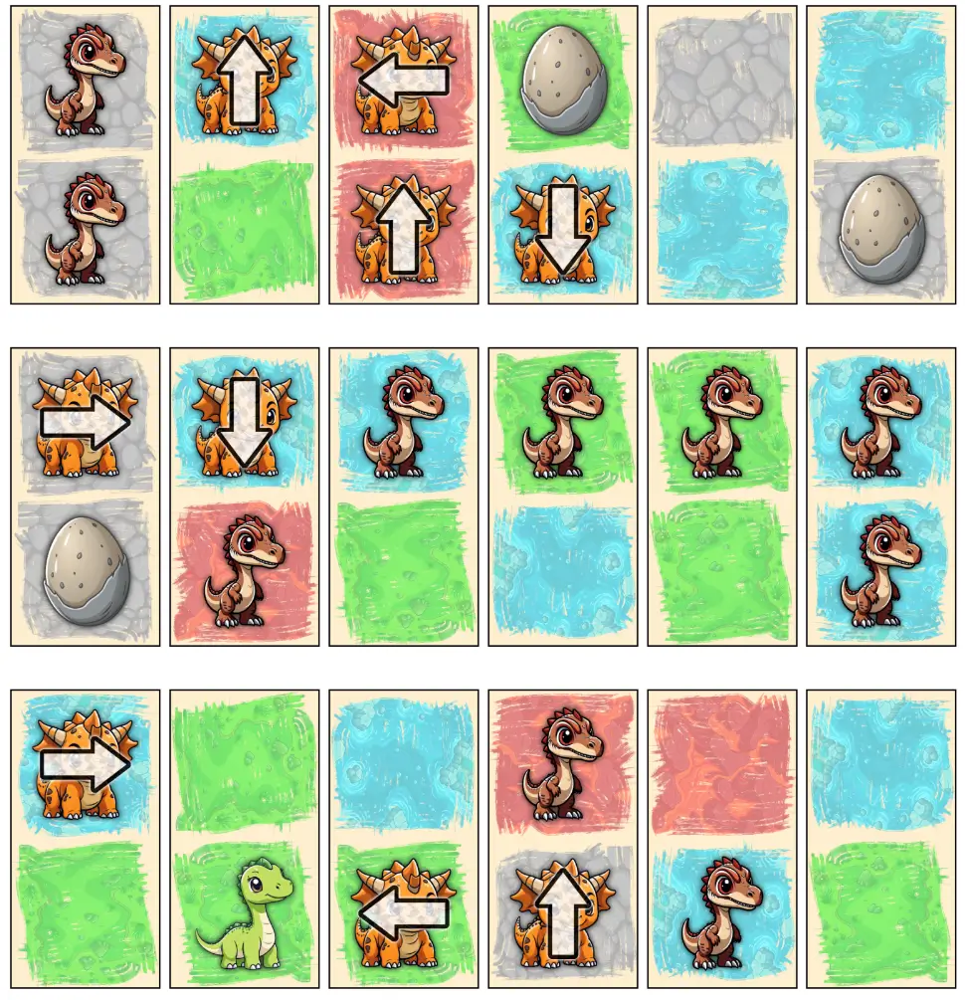
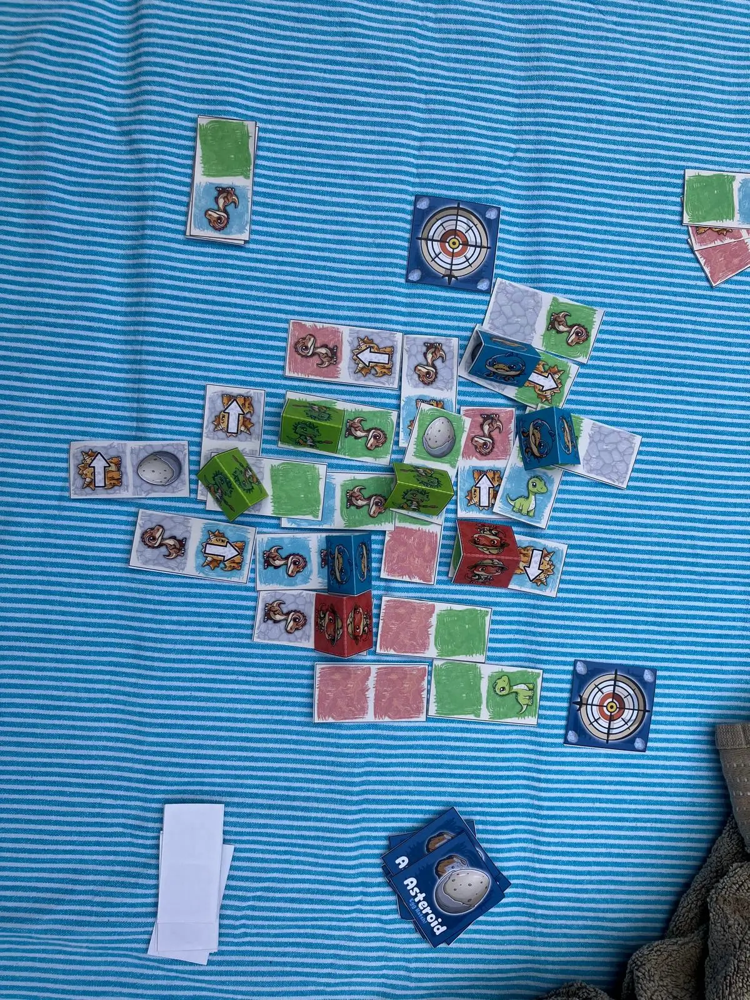

Welcome to the devlog ("developer diary") for my game [Dinoland](https://pandaqi.com/the-domino-diaries/place/dinoland/).

This article describes the whole process of creating this game, moving through the different versions, what problems I faced and why I made certain decisions. Hopefully it's interesting and fun to read!

## What's the idea?

I was already playing around with several ideas for domino-based games, and I'd roughly planned to work on them this time of year (summer holiday).

Then my sister's birthday was coming up, and she (half-jokingly) planned to go to something called Dinoland (in the Netherlands), until realizing that there was a maximum age restriction. So my brain obviously thought: let's bring Dinoland to her!

How about I make a game where ...

* You're placing dinosaurs in some dino exhibits, or just a habitat
* While, during the whole game, the threat of the asteroid gets closer and closer.
* Until the asteroid finally hits and destroys the area in which it landed. 
* You score whatever remains, highest score wins.

I was under quite a strict time limit here (as the birthday was in a few weeks), so I decided to just roll with that and immediately try to make it happen.

## Fleshing out the idea

### Placement

Normally, domino placement games are all about "placement rules". A is not allowed next to B. C scores more points when next to D. You know the drill.

However, because this game added a completely separate system (the asteroid), I wanted to keep the core placement rules _extremely simple_.

As such, the idea of "dino exhibits" or "enclosures" (a more zoo-oriented approach) was thrown away. That would require extra explanation and extra rules about how they had to connect and what was considered an enclosure blabla.

Instead, 

* Tiles simply have a _terrain_ (always)
* And a _dinosaur_ on top (optional)

You're allowed to place tiles however you want. Usually, such freedom leads to a boring or unchallenging game. You can do anything! The one who is most lucky with their tiles wins!

I thought this freedom wouldn't be a problem in this case, however, because:

* It's still _recommended_ to match terrains, because a larger group (of the same terrain) scores more points. It's simply not enforced and has no other rules about it.
* But you also don't want groups that are _too big_, because **when the asteroid hits, it destroys the entire group of the same terrain**.

When I invented that rule---the asteroid destroys not just the tile it hits, but all connected tiles of the same terrain---things started falling into place.

### The Asteroid

What do we need to simulate this?

* Some _timer_ or track which, when it runs out, means the asteroid hits.
* Some way to control the _location_ at which it hits.

Because the map is ever-growing, and can be any shape thanks to the free domino placement, this had me stuck for a bit. Until I remembered a trick I invented for one of my earlier Easter games.

* We place one "asteroid crosshairs" above the map (this indicates a "column")
* And we place one "asteroid crosshairs" to the side of the map (this indicates a "row")
* The tile where these two **intersect**, is where the asteroid hits!

This is very easy to see at a glance. It's also very easy to control: just add special icons/actions that **move the crosshairs** in a certain way.

As for the timed element, I find it best to just use a pile/deck of cards. 

* Start the game with X "Asteroid Tiles"
* Whenever a certain icon appears/action happens, discard the top Asteroid Tile.
* When the deck runs out, the asteroid hits.

Easy to see, easy to modify, and leads to very simple gameplay where you can speed up or slow down how quickly the catastrophe will happen.

### Cooperative or Competitive?

Well, I chose _both_.

In cooperative play, you'll just try to get the highest score. The entire map yields one score at the end for the entire group.

In competitive play, you're still building to the same shared map, but players also have "Pawns" (or claim tokens or whatever). After placing a domino, you _may_ claim a domino by placing your pawn. As expected, each player has an individual score now, and you only score for claimed areas at the end.

This only requires a few more sentences in the rules, and a few pawns to print and cut, while allowing _both game modes_. I think they'll be equally fun and playable, but we'll see about that in practice.

### Streamlining it all

Okay, so we have a few ideas, a few elements, a few icons/actions ... now let's bring it all together into something that's as simple and streamlined as possible.

Instead of separate **icons** on the dominoes ("if the domino has an asteroid icon, remove the top card of the asteroid deck"), let's just give the actions to the **dinosaurs** ("if you play the red dinosaur, remove the top card of the asteroid deck").

We only need ~3 different dinosaur types anyway. So we can do:

* DINO1 = remove asteroid tile
* DINO2 = move crosshairs
* DINO3 = no action, or something useful like "completely replace your hand of tiles"

Instead of text or a fixed rule about _how_ crosshairs move, let's just add an _arrow_ on top of the dinosaur. This also has a very funny side-effect where the _orientation_ you use for your domino affects _how the asteroid moves_. (Because the arrow will point a different way once placement is finalized.) This felt like another nice push-and-pull gameplay loop: you want to place the domino _this way_ ... but then the crosshairs move in a very unfortunate way, so maybe you should compromise and rotate it _that way_?

Finally, let's 100% specify **scoring** and the **asteroid impact**.

* I defined an "Area" as a group of connected parts of the same terrain. (So you'd have a "grass area" here, a "desert area" there, etcetera)
* Then I used the time-tested method of: each Area scores **its size** multiplied by the **number of dinosaurs** inside.

When the asteroid hits, it was too weak to merely hit _one_ tile. This might make the impact worthless if players play reasonably well and isolate this square entirely from anything else. You're building up to this big moment all game, and then it just ... ruins 1 square, which removes 1 point, and that's it :p

Instead,

* It _destroys_ the tile it hits **and** any neighbors. (In other words, it destroys the 3x3 radius of tiles.)
* Any destroyed tile means that its _entire area_ is ignored when scoring. (As mentioned before. This means there's a clear downside to trying to make areas too large.)

The exact details (percentage of tiles with/without dinosaur, number of cards in asteroid deck, etcetera) are obviously just a guess right now. I'm more focused on providing a very simple core gameplay loop that makes sense and always leads you to that big ending.

That's basically the whole game. I had no time to test this, so I just made this version as quickly as possible.

### The Egg Idea

At the same time, I was working on my _other_ domino-related ideas. And I felt like I was repeating myself. Creating too many similar mechanics in those games.

I wanted to find _one_ more special thing, one more intuitive rule or idea, that made this game truly unique and stand out.

This idea turned out to be **egg hatching**.

* Some dominoes show an egg (instead of a dinosaur or emptiness).
* Some cards in the asteroid deck show the "EGG HATCH" event. When those are revealed, you guessed it, all owned eggs hatch. (That is, eggs that have a Pawn on them.)
* The owner of the egg now replaces that tile with one from their hand, which must contain the dinosaur that "hatched from the egg".

In other words, this mechanic is like a strategic time bomb.

* You can place eggs at an earlier point in time.
* Then replace them with the exact dinosaur/terrain you wanted at some later point in time.
* At the cost of having to claim it (of course) and uncertainty about when eggs will hatch.

I felt this was simple and intuitive enough to include with the base game, instead of making it an expansion. If it's not simple enough, I'd even prefer _simplifying_ it further as opposed to moving it to an expansion. Because, as I stated, this has to be the secret sauce that really makes Dinoland its own game instead of a slight variation on domino placement games.

## Let's make that!

Honestly, there isn't much to say here.

The generation code is very basic.

* Each dinosaur + terrain has a fixed percentage (that I set by hand), such as "Triceratops appears 30% of the time"
* When generating, it follows those percentages, with slight randomness. It assigns _every_ square a terrain background, and only _some_ a dinosaur.
* The dinosaurs that modify the asteroid (move it or discard the top card, bringing it closer) occur far more often than any other.
* The terrains are also slightly "unbalanced", because that's far more interesting than having them all appear equally often.
* And then it simply draws those illustrations centered on the tile, with random rotation and a shadow effect.

The dinosaurs were generated with AI, giving them the exact name, color scheme and style I needed.

The terrains were just a hasty sketch by me, because that "loose, grungy" style looked fitting and far better than a solid rectangle or something. Similarly, I feel like the warm, damp period in which the dinosaurs left always benefits from tinting everything a bit more beige/orange, hence the non-white domino backgrounds. (Though if you enable "ink friendly", of course, it removes all that and gives you a basic black and white tile.)

The eggs were a bit more dull/gray/neutral on purpose. Otherwise they attract too much attention (while, in their egg form, they do nothing) and don't feel like a "pre-stage" to the actual full-color dinosaur.

It was done before I could blink, which is also nice for a change. I think it looks exactly like it should: a colorful, simple, kid-friendly game without text or complicated icons on it.

## Playtesting & Polishing

As stated, the first playtest session was actually just "play this game for my sister's birthday". 

I asked my dad to take some pictures of a final game, which I'll try to get on the game page. I _really_ want to get more images of the real, physical games on my website, but I always forget to take my phone and take the picture. It's such an easy way to immediately illustrate how the game looks on the table, how it plays, and to help people take a chance on it.

Anyway, here's an image of the game on the table. (On a sunny day, outside, with stuff placed around it to prevent wind blowing the paper cards away :p)

**It just ... worked?** Color me surprised. The game was absolutely fine on the first try.

Explained and set up in a few minutes. It provided interesting choices and challenges throughout. All mechanics did exactly what I meant for them to do, and it's a short fun game. In fact, after playing it once, people voluntarily asked for "revanche" and we played again. 

The egg hatching mechanic, which gave me the most doubts, actually worked great. They were frequent enough to matter, but not too overwhelming. It's a really powerful move if you're able to claim an egg and then place an _overlapping_ domino when it hatches, perhaps decimating some other territory that way. At the same time, you might not have the right dominoes in your hand, or it might take to long for the Hatch event to take place, so it's not "overpowered".

Of course, there are still _improvements_ to be made!

**Improvement #1:** The game can be over too quickly now. The percentage of Velociraptors (which discard the top Asteroid card) should go down.

Our second game lasted longer, because players had learned to withhold those dinosaurs if they wanted to tactically prolong the game. So it's also a strategic thing, not just a game balance thing. Still, even the longer games were a little too short for my taste.

You can also make the Asteroid Deck longer. But "10 cards" is a really nice, memorable size that doesn't overwhelm players. (If you make it 15 or 20 cards, it quickly becomes hard to track and people look at it and think "man we still have SO FAR to go".) I also want to have some extra room at the top for people who want a _really_ long game. 

Thus I decided to keep the Asteroid Deck as it is, and simply shrink the number of times that Velociraptor dinosaur appears.

**Improvement #2:** The entire game should just be dominoes. (The asteroid deck and crosshairs should also be dominoes, instead of square tiles.) I'd already written this on my to-do for finishing the game, but testing it just reaffirmed this. With square tiles, you can't instantly see (at a glance) what the crosshairs point at, and it's impractical to store the game now that it has two types of material with different sizes.

**Improvement #3:** The first game, people kept forgetting that a dinosaur action of course _also_ triggers when played after hatching an egg. The rule is quite simple, and after the first game everyone could remember. Still, I saw an opportunity to solve two birds with one stone :p 

_If a dinosaur was placed to hatch an egg, its action is optional._ This gives another strategical choice. It gives more ways to slow the game down _if you want_, by simply not triggering the velociraptor action. If you "forget" to do this, you're not breaking any rules either.

**Improvement #4:** The "blast radius" of the asteroid is a great rule to modify with an expansion. Currently, the default is "the square it hits and all adjacent squares". And if it hits one part of an area, it destroys the entire area ( = group of connected tiles with the same color).

This is fine! On most maps, this destroys a significant portion, but certainly not everything / too much.

However, because the rule is always the same, there is a bit of a pattern to how it destroys the board. And, especially if playing cooperative, the best move is to nudge the crosshairs to some faraway corner to hit as little as possible.

As such, I want to include a special deck of "Impact Cards" that show different images/rules for _how_ the Asteroid impact works. You simply draw one at the start of the game and use that.

Examples: "it destroys the whole row/column", "it has a radius of 2, but not diagonally", "it only destroys an entire area if it hits multiple tiles from it", "it only hits diagonal neighbors, but wraps around the board", etcetera.

**Improvement #5:** The other part that's ripe for expansion is the Asteroid Deck. While playing later test games, players were already asking like "why aren't there MORE different Asteroid Cards? Like with special actions or events that trigger?"

As usual, my response is: "Yes! I wanted to do that for an expansion!"

{}
For a moment, I considered moving the Egg Hatch cards to an expansion _too_. So that the base game is absolutely as simple as possible, and even egg hatching only needs to be explained later. These playtests, however, confirmed that egg hatching isn't that hard to explain and also crucial to the game. If you leave it out of the base game, Dinoland becomes TOO barebones in my eyes.
{}

The rules here would be simple.

* When you discard a card, check if it has a special action/event.
* If it must be executed, the player who discarded this card must do so. (If the card says "move a Pawn", then only the one that revealed that Asteroid Card does so, not everyone.)

During setup, you grab a random selection of these cards, shuffle, pick 10.

By using a _random selection_, we make the Brachiosaurus action stronger in general ( = it allows you to look at the next 5 Asteroid Tiles), and obviously make games more diverse.

For example, one Asteroid Tile I envisioned is "Switch the Impact Card to another". If everyone already _knows_ for sure this is in the deck, then the current Impact Card is useless and tells you nothing. Which ruins the game a little. But if there's only an X% chance the Impact Card might be switched, you still have to play as if the current one will stay the same all game.

{}
The alternative is to make actions a CHOICE. "Switch the Impact Card OR do this other thing." This needs too much text, however, and possibly a really complicated icon/illustration. I just don't like that for what should be the simplest of all my Domino Diaries games.
{}

## Conclusion

With all these minor tweaks and additions, I call the game done! I was pleasantly surprised by how well it worked on the first try, and it only became more stable and interesting with the final polishing.

It's not an amazing game that will blow you away, and it wasn't meant to ever be that. But it _is_ a very simple and interesting game that gave my playtesters a lot of fun, and is easy to pick up for kids or families. (With no text or icons until you get to the expansions.)

The egg hatching mechanic ended up being a wonderful way to lift a "mediocre game" into something "quite unique and interesting". The target an asteroid impact gives a great goal to work towards (at all times), and the fact it hits a larger radius incentivizes players to not just create one HUGE Area / diversify what they do.

{}
Though, in the end, I decided to move egg hatching to an optional variant/expansion too. Just to keep the base game absolutely dead simple. The game works fine while ignoring eggs, it's just less interesting/strategic then.s
{}

I guess, by accident, that I made all the right choices at the start, which led to an easy path to a good game.

I'm proud of it and can confidently call it the simplest game in the Domino Diaries and a perfect starting point.

That's it for this devlog.

Keep playing,

Pandaqi