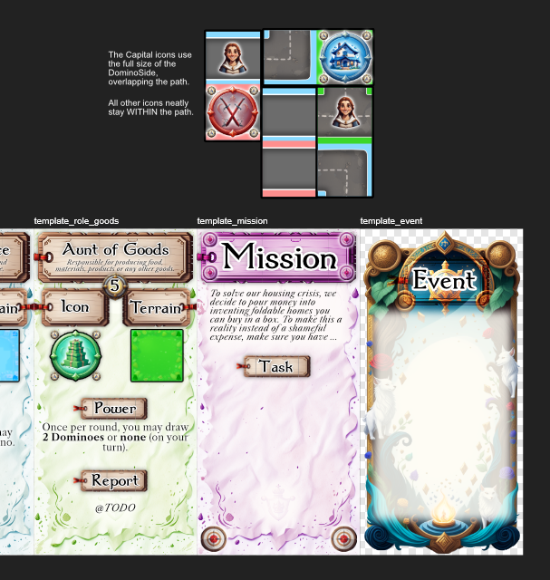
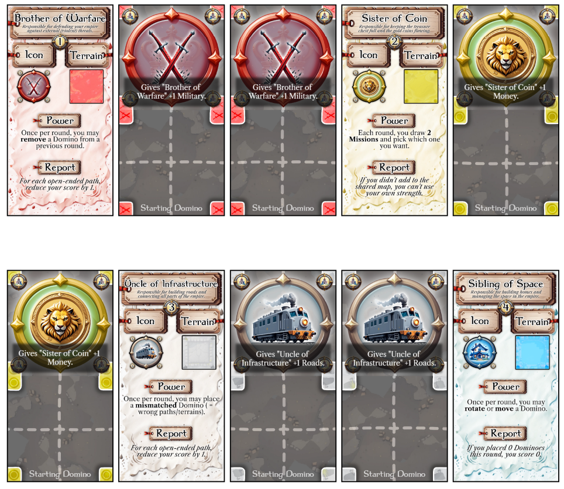
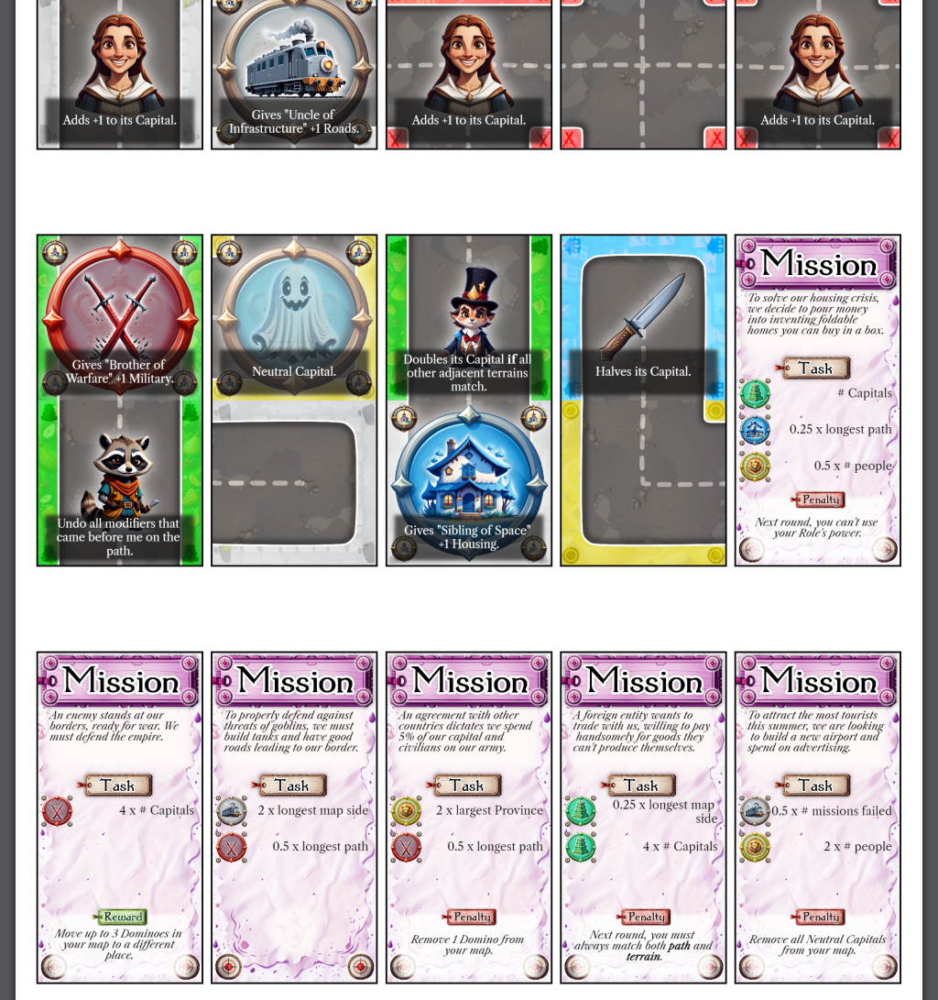

Welcome to the devlog ("developer diary") for my game [Domino Dynasty](https://pandaqi.com/the-domino-diaries/place/domino-dynasty/)

This article describes the whole process of creating this game, moving through the different versions, what problems I faced and why I made certain decisions. Hopefully it's interesting and fun to read!

## What's the idea?

Sometimes you have ideas that are more like a vague vision. Those are the hardest to develop, but you really _want_ to make that vision specific and tangible, so you push through. 

This was one of those games.

My other domino games started with a clear _mechanic_, which is always the best way to start. "You'll do X, win using Y, and the special sauce is the Z mechanic. Now let's make the graphics/details _around_ that strong core."

For example, the Dinosaur game was always centered around the _asteroid_ getting closer. The game ends when the asteroid hits (intuitive, consistent, clear goal) and the way it destroys/changes score basically makes the rest of the game fall into place.

I didn't have that for this particular game. All I had was a vision for a "cooperative-competitive" game.

* You are running some family empire together.
* But every player has unique _roles_ within the family/system/company.
* So you really depend on each other, because everyone can do crucial stuff that nobody else can do.

By making the other games, I could eliminate some mechanics that I had "already used", and settled on the following vague criteria.

* There are both individual maps (only modifiable by you) and a shared map (modifiable by all).
* I had created multiple domino games with fences/walls on the edges (which used "enclosure" for scoring/placement), so let's not do that again.
* I had created multiple domino games with terrains/backgrounds that are grouped/matched, so let's not do that again.
* Instead, let's use **paths** in a new way (so you connect elements by matching paths) and **proximity scoring** (what or how things score depends on what's adjacent/nearby). To streamline this, it would be a rule like "an element is connected to everything else that can be reached following paths, which automatically connects it to any adjacent tiles too."

I feared making this game far too big, creating way too much material and different systems mashed together. So I was hesitant to start until I'd found that really simple _core_ on which I could hang my other ideas.

That core needed to have something to do with the relationship between those _individual_ and _shared_ maps. How do they influence each other? What is their purpose exactly?

I just couldn't figure this out. And when that happens, I've learned that you usually need to define the _objective_ first. Determine the exact moment the game ends and how you score, and it should tell you a lot about the actual game.

I saw two possibilities here.

* Either your "family empire" is an actual empire, like a kingdom to protect against invaders and make prosper. In this case, the game would **end** when the kingdom falls OR all threats have been dealt with. Your **score** would be the current state of your kingdom and what you managed to achieve.
* Or it's a "business empire", which means it's about producing goods and making money. In this case, the game would **end** when you run out of money OR have achieved the growth needed. Your **score** would be the sum of what you produced (some sense of money?) or the current "value" of your business.

Both felt a bit weak and ... cliché on their own.

And then I thought: _why not combine these?_ (The default thought of every creative person when they just can't _choose_ :p)

Your "family" is both the government _and_ the economy in this fantasy world. You are selling food and housing to your people, but also need to protect your factories against military threats. It's like running a business while also being required to ensure your employees have a home, and aren't raided by goblins :p

This, at least, got my creative juices flowing _a little bit_ and slowly brought us to a working version of the rules.

## Getting more specific

### Simplifying, simplifying, simplifying

And so I went to town writing down all possible Roles, ideas, icons, etcetera.

At first, this created a bunch of unconnected ideas that were convoluted. Or, at least, they'd be a mess if I combined them all in this _single game_.

* Maybe Money is a thing. Money are dominoes too, placed in your map too, so when you need to _pay_ money ... you have to destroy your map a little bit.
* Maybe the main resource are your People. You need them to get anything (for example, the Military is only as strong as its number of soldiers), but you also need to take care of them.
* That idea of drawing Goal/Threat cards, which I tried for the first time in Highrise Homino, seems very useful. It gives short-term, immediate goals, which is very nice in a longer and bigger game. It also means your goal is _written on the card itself_, so no need to remember any rules about that.

My first gameplay loop was as follows.

* The game ends when someone is forced to leave the empire. (They go bankrupt, they fail to defend themselves, whatever the reason.)
* When that happens, everyone (including the one who left) scores their individual map---highest score wins.
* The game happens in rounds. Each round has three phases.
  * DRAW: draw X new dominoes as a "Market". Also give each player a new Goal tile.
  * PLAY: in clockwise turns, players pick 1 domino from the Market and play it.
  * REPORT: all players check the Report phase of their personal Role card. _That_ determines what you must pay, what you get, and when you have to leave the empire.

This was a fine start, but not great yet.

* When I thought about possible WIN/LOSE conditions for each player's Role, it quickly turned into a mess. I just couldn't think of interesting ways to make each Role completely different, while also keeping the game balanced. And playable, even if you _don't have all Roles included_ (because you're not at the maximum player count).
* The Money idea was _great_, just not for this game. Because if there's only one Role who can handle money, then this makes the domino distribution extremely lopsided.
* The core of the game is now so streamlined, actually, that there isn't enough to modify and truly make Roles "asymmetric".
* I still have no clue about the fine _details_ of scoring and progressing.

It felt simpler to only make the Roles asymmetric in the fact that there's one icon only _you_ can modify or score. That single element is already a HUGE change and makes every Role truly different, so I don't feel much more is needed.

Instead, let's just use those Goal cards to actually close the game loop.

* Any icons that no Role manages can simply be used by _all_ players. Now you can play the game with 2--5 players, with excessive setup ("remove all dominoes with icons you won't use"), or clunky solutions (like "some players will play 2 roles at once").
* At the end of each round, all players check if they fulfilled their Goal. If so, great. If not, you lose one life. Once you've lost X lives ( = there is a pile of failed goals before you), you're disowned and must leave the empire :p That's when the game ends.
  * Some goals might have extra rewards or penalties.
* When fulfilling your Goal, you can use the _entire strength of your empire_. In other words, if your Goal requires 10 Military, then you simply ask the Brother of Warfare how much they have. And if they have enough, use that.
  * This is by far the simplest way to do this. Other ideas, such as that you need to "connect" to them first using a path, are just too convoluted and risky. What if you're unlucky with dominoes and nobody can connect to each other the first 5 rounds? Then you've just lost.
  * When there's not enough to satisfy all, the Role that owns that icon determines who gets what.
* When placing dominoes, you simply have the choice to place them in your _individual map_ OR the _shared map_ each time.

Finally, I found a simple way to connect the individual and shared map and get your final score. (Which _is_ your Role's strength at any point in time.)

* Only Role icons score, +1 point by default.
* Paths leading into them, however, can modify this score. (They might contain an icon that says "double the icon at the end", for example.)
* Then _multiply_ this final score by your presence in the shared map. (That is, multiply the score of your individual map by the size of your territory in the shared map. That is your "final score" or your "Role's strength".)

### Solving big issues

Now, there are a few immediate issues here that need to be resolved in a clean way.

**Issue #1:** Multiplication can get out of hand quickly. As such, there must be a limiting factor on the shared map. 

I decided to go with the idea of "Provinces". Each player has a Starting Domino anyway in the shared map (because, well, everyone must start with some presence there). Let's give that a terrain/color/border, and you may only place dominoes of the same type adjacent to it. As such, over time, each player's starting position grows into a larger area.

**Issue #2:** Paths can get out of hand quickly too. Players could build one _huge_ path that doubles everything and win easily (if they cooperated, if course).

I decided that many of the icons would be **bad**, such as "adds -5 to this icon". In other words, you can't just create an infinitely long path with bonuses, because you'll need to place bad stuff too and reroute paths.

Another solution would be **arrows**. Only the part of the path pointing at/leading into the icon counts, which makes placement far harder.

**Issue #3:** Goal cards need to _scale_. As the game progresses, everyone gets larger maps, more strength, etcetera. It doesn't work to just have the card say "You need 5 Military", because that's way too hard in the first round, and way too easy in the final round.

This is why I kept the idea of managing the "People" inside your empire.
* The People icon is the main modifier giving you strength.
* It's also the main way in which Goals are scaled. "You need 2 x #P Food" means you need twice as much food as you have people.

And finally, I kept the idea of external threats and many icons being "bad" (but you must place them anyway!)
* So, over time, the outside threat will grow.
* Many goals use the number of external threats, and their position relative to your province/paths, as a sort of simulation of "another empire/competitor attacking".
* (In a way, you're constantly trying to run an economy, while protecting your workers in that economy from goblins or something. I don't know. I've been stuck on this idea too long and I just want to move forward with it now.)

**Issue #4:** As stated, your Province starts from your Starting Domino, and includes the entire group of tiles around it with the same terrain. However, if you're unlucky or the opponents mean, they can very quickly shut down your entire province before it has ever grown. This just feels too restricting and too risky, so I thought about it some more, and came up with a really fun rule.

* On your individual map, **paths must match**, but terrains do not.
* On your shared map, **terrains must match**, but paths do not.

This creates an even more interesting variety/dynamic between individual and shared maps. It also makes it harder to grow your province _or_ shut down someone else. And finally, it allows adding a second rule that brings it together: you can have multiple Provinces (or just "patches with your unique terrain"), as long as they're connected by paths.

With these core rules streamlined and balanced (it seems), that unique Report action per role can simply be used to diversify the Roles and customize them. To give each player one tiny power (or responsibility) that should make them feel more like they have a unique job within this empire. For example, one player who can _rotate_ or _move_ one domino per round, or one player who is allowed to place a _mismatched_ domino (wrong paths/wrong terrains) once per round.

_Now_ I feel like stuff is coming together and I can start finishing the first draft of the rulebook, then prototyping and developing the full material.

## Let's make that!

### Generation

Because I thought about this game so much, and streamlined it so much, most of the generation and drawing code is incredibly straightforward.

* All the tiles have terrains and paths, and they must match, so that's short and consistent.
* Some domino sides have icons, others do not, there are no exceptions. So it's just "need an image? draw this image"
* The Role and Mission dominoes are a simple template with the necessary text dynamically put on top.
  * Each role has a unique number, icon, terrain, and power.
  * Missions need the actual challenge/task, of course, and then an optional reward/penalty.

The real issue, and I knew this from the start, were the Mission Dominoes.

The more I fleshed out the game, the more I realized that any semblance of "fixed" missions (always the same values/rewards) just wouldn't work. The maps only get bigger, player scores/strengths only higher over time. At the same time, this means you _start_ the game with absolutely nothing, which makes you highly likely to fail any missions with fixed numbers (in the first few rounds).

And so I decided to use a different approach. Every mission is _randomly generated_, and it does so with the following steps.

* Select a set of Role Icons (Military, Money, etcetera)
* For each, select a "scaling factor" from a list of them. (This is a list I wrote down of things that will naturally grow larger as the game progresses, such as number of People or Longest Path.) Optionally scale that as well, such as "2 x #People".
* Then display that as the list of requirements.

This is a bit more abstract/number-crunchy than I'd like, so I also decided to add some flavor text. Depending on the requirements, it selects the flavor text from a list that fits best. (For example: a mission that requires a lot of military will pick the text that talks about some invading enemy.)

* Each flavor text has a list of "matching Role Icons".
* It loops through them all and selects those options that match _the most icons_ with what's actually on the mission.
* Then it selects a random one from those "suitable options"

By doing this, I ensure that every mission will be balanced whenever you draw it (achievable, but not too easy). I don't need to manually invent a lot of missions and finetune them---the algorithm does it for me.

Similarly, rewards/penalties are drawn randomly from a list of options. This did give me a new idea, though.

I wanted to add at least 1 icon that _every player can use_. Otherwise, especially on highest player counts, you might be _very_ restricted in how you can build your map. But what would this icon do? If it has no function, it's a bit meh.

Then I realized that I can use that to scale the _reward_ as well! Just as requirements are naturally scaled as the game progresses, this one would naturally scale how much you get in return for completing a mission. (Giving you an incentive to place it nicely, with long paths, even though it is not "your icon" and doesn't contribute to score.) For example: "REWARD = Count #ICON. Draw that many dominoes from deck and place them on your map (if allowed)."

### Inventing rewards, penalties and actions

Normally, this happens quite easily for me. This time it was more of a struggle, which is why I write about it in the devlog.

It was hard to find clear penalties or rewards for finishing a mission.

* Because these are received at the _end_ of the round. So I can't give you powers or benefits _for this round_, as that's quite useless. But starting every power with "next round, blabla" is meh and easily forgotten by the players who now need to remember.
* Because Roles already have powers and the game is otherwise quite streamlined, there aren't many "directions" in which I can tweak the concept.

In the end, after some brainstorming though, I managed to get a nice list.

So I moved to the flavor text, which became the next issue. Anything I came up with just sounded very cliché, as if it was event text/flavor text used in a gazillion others games roughly related to managing an empire/kingdom.

At the same time, it's overwhelming. Knowing you need at least 10--20 different texts, nicely spread across all possibly situations. Sometimes I wonder why I take on all these huge tasks :p

Once I started to simply tick off boxes ("this text is for MILITARY", this text is for "MILITARY + HOUSING", going through all combinations), inspiration returned and I was able to get a nice list to cover most requirement lists.

Finally, this brings us to the special actions on the (non-Role) icons.

* This game is mostly about _pathing_, so I wanted the base game to only have (meaningful, useful) modifiers for things within the same path as them.
* But there should also be a little more than that. When checking what I'd already done (in other Domino games), and what this game might need, I wrote down _proximity rewards_. In other words, placing things adjacent to or nearby/in-range of other things.

I wasn't sure if this would overcomplicate the game and if I wouldn't be better off reserving that proximity idea for another Domino game. (Which I'll certainly make in a year or two; I have another "batch" of strong Domino game ideas.) But, well, you never know if you never try. So I gave it my best shot with a few very _simple_ and _straightforward_ proximity actions, such as "Adds +1 to an Adjacent capital" or "Turns any People in the same row/column into 2 People."

I already have too many different icons and powers. Why do I keep overcomplicating simple ideas? I decided to just stop here, be entirely prepared to throw out a handful of the things I came up with, but at least we have completely finished the code and necessary "data" now.

### Drawing

As stated, drawing was very straightforward for the most part. I'd already written code to draw paths and match them on the domino in previous domino games. Anything else was just a simple "add this image here, that image there, that line of text at the bottom, done".

The Mission and Role cards needed a _little_ more work, simply because they have more dynamic parts (the details of that role or randomly generated mission), but also nothing too bad. Or, at least, nothing I hadn't already done several times before, such as listing the requirements in a nice way.

No, most time/energy here was spent on finding a consistent visual style again and creating the illustrations/designs for it. I had wanted to use a specific style that generative AI is good at for a while now---a more stylized, painterly one, which was still simple and clear---so I used it for this game. As usual, I had to give a lot of _specific_ direction myself to get anything usable, and then do slight edits/merges/improvements later. For the most part, though, using the AI _really_ speeds up the workflow and makes me able to create things I wouldn't have created otherwise.

Below are some of the first sketches for the general style and templates.

Once done, I put them all on my website and let the code randomly generate the material + draw + put into a PDF. In this process, some new tiny problems always crop up, as well as ways to be more efficient (... or things I just don't feel like coding). So the final look is always slightly different, hopefully better.

The final generated PDF looks like this. (Not "final final" of course. In fact, you can still see a mistake in this screenshot if you look closely at the Roles.)

From the start, I've added balancing factors and ways to _remove_ dominoes into the game, to prevent needing too much material. For example, a majority of the penalties (for failing a mission) make you remove 1 or more dominoes.

Still, I think I might currently have _too little_ by default, especially for higher player counts. We'll see how it holds up in practice.

Also, as usual, finalizing the graphics/rules/code revealed some more flaws or improvements.

* I finally found some simple actions to give the roles during the Report phase, to encourage building a good map and cooperating (or rather punish doing otherwise), but not too severely. 
* I ended up making the role cards "fixed". (I completely made them myself, no generation/dynamic drawing going on anymore.) It just made it easier to place elements exactly as needed, add some costly effects (such as lots of subtle glow around the text) that I don't want to have to draw dynamically, and it was only 5 cards that were very much set in stone anyway.
  * I've learned to strike a balance between things that are randomly generated and drawn on the spot (in an entire game), and things I'll just "fix" or "bake in" manually. Doing too much random generation leads to way more work coding (than I want) and a way longer time generating and drawing (which nobody wants). 
  * In fact, I learned this the first time a really big game tried to generate EVERYTHING on the fly, and it just made my browser hang for 5 minutes to eventually crash. Granted, my laptop is old and broken and barely works as it is. 
  * Anyway, that's why some quite large chunks of the design or generation are often simply fixed, even though I _could_ make the system draw or determine those things on the fly.
* To make the rules far simpler and clearer, I started calling the icons that actually score (your role icons + that Neutral one and such) "Capitals". And their icon has a clear border + capital icons around it to really set it apart. Hopefully, this visually communicates, at all times, that everything else should _feed into the capitals_ using the paths.
* I ended up dialing back the stylized look because it just wasn't working and it made the game ugly/inconsistent. This is something I'm still practicing: both how to get AI to _really_ execute your vision, and how to do manual edits myself to achieve it (after using an AI generated image as a rough starting point).
* Looking at the final Mission cards, I realized it would be hard to complete missions that only have Role icons that aren't played by a player (in the current game). Because, well, if nobody actually tries to grow the strength of Military, then how will you ever have a enough Military for a mission that wants a lot?
  * Partially, this is not as big an issue as I first thought. Dominoes _must_ be placed, so those other Capitals will be used anyway. Mission are also _scaled_, which means you can complete those missions by simply keeping the scaling factor low (as opposed to growing that icon's strength).
  * Still, I wanted some tiny (rules) tweak to soften this issue. I ended up saying that, during setup, the shared map starts with _all_ Starting Dominoes---even roles not in the game. This means you already start with all icons and terrains at least _once_, making it far more intuitive to also keep up the strength of the other icons.
* I ended up forbidding 2 Capital icons on the same Domino. I had already written a convoluted check to allow 2 non-clashing Capitals---that is, they're the same Role or Neutral---which worked, but was ugly. Two big capitals on the same domino both looks bad (it's hard to see the road/terrain underneath now) and is way too overpowered in the game. So, now it's just 1 Capital per tile and that's that.
* Just like with Highrise Domino, drawing random requirements/tasks for Missions has the probability of creating a silly task list :p For example, one that says "we want #people Military" ... and also "we want 0.5 x #people Military" ... and also "we want #neutral Military". This is contradictory, a waste, and feels wrong to players. Because, well, it _is_ wrong! 
  * The requirements now have a simple function that convert its contents to a unique string ID. (For example, if the `military` icon and the `num_people` scalar are combined, then the ID is `military_num_people`.)
  * Then I loop through the list and check if any two elements have the same ID. If so, the latter one is merged with the earlier one into a _single_ requirement, with its number averaged.
  * This obviously reduces the number of Missions with multiple tasks, going off-distribution a bit, but that's fine. I imagine it's hard enough to fulfill them as it is, so let's be a little friendlier to the players.

## Playtesting & Polishing

### Coming back after a while

If you've read the other devlogs (for the other games in this "first batch" of Domino Diaries, such as _Zoo Parque_), you probably know what's coming.

I made these games during tumultous times. Tough environment, constantly changing, little energy. And so I blazed through these ideas with the mind-set of "just make that shit, maybe something good comes out of it"

Those other games _did_ end up simple, fun, solid. (After coming back and fixing some major issues, in some cases.)

This game? It's just ... what was I thinking? Now that I return to it, and I am working on the rulebook images to explain the mechanics, I keep writing down notes to simplify. I keep writing down "why the fuck did I make this so convoluted?"

That's what happens, I guess, when you're _really_ not in the right headspace. You don't see the easy solutions. Through doubt or uncertainty (about the idea and if it's any fun), you start adding more stuff or adding more complexity, hoping it would work some magic.

So, on the one hand, I improved the idea further when I came back.

* I changed some terms to be more consistent and shorter.
* Some tiny rules were made optional / moved to variants or expansions.
* By creating some clear visualizations/example images, I basically explained the game to myself and realized it wasn't _that_ complicated. 
  * There were just some nasty snags and additions ("the game works like this ... and OH YEAH, you need to remember that rule ... and OH YEAH, don't forget this"). By making those images, those tiny tidbits jumped out as there is just no space for them in a single image. 
  * And so I sought ways to just remove them or simplify further. And because I've been away for a while, and can see "what was I thinkin?" now, I often found them.

On the other hand, I can't make big changes now, of course. I wrote down the lessons learned and a simpler approach (to a "personal map/shared map"-domino game) for a _future_ game of the Domino Diaries.

### Playtesting?

I had to accept this.

Because, if you've read other devlogs or articles of mine, you also know that I lack motivation to even playtest my own games. I lack motivation for _anything_ and I've been working really hard for 10 years to get any sense of passing or wanting to live back. With great discipline and habits, I can at least _make_ many ideas of mine. But testing them? That's a 50/50, and if it happens, _others_ basically have to work hard and convince me to do so.

This is by far the longest and most complex of the Domino Diaries games. Perhaps the most complex board game on all of Pandaqi.

I can't find it in myself to test it. So, at least it's _done_ now. It's as good as I can make it. As simple as possible, with all assets done, with nice rulebook images, you know the drill.

Does it work? Is it fun? I have no clue. You tell me!

My experience and intuition made this game and finetuned it, and I can estimate that it's at least playable and has somewhat interesting decisions and moments. Yes, that's the best I can do for now. Hopefully, when I do the next batch, I am in a better situation and I can also slightly improve these first games.

## Conclusion

As was probably clear from reading this devlog, this one was _hard_ to figure out and finish. (The previous one, Highrise, already proved a bit of a struggle. After finishing that one, continuing with this felt like an impossible hurdle.) Perhaps I was just tired, a bit sick, feeling a bit _meh_ in general. But I really had to tell myself, as I often do, "if I do just _one_ thing every day, then eventually everything gets done"

Simply making it a habit to do _one_ task, usually makes you do _multiple tasks_ that day, which eventually completed this game in the timespan I set out for it. Even though I never actually felt like working on it and just wanted to sleep :p

I think the core idea and mechanic twist is sound, I'm just not sure if this was the _best_ execution. But that's okay. I can make that judgment now _because I made it_, and I can always improve on it in the _later domino games I have planned_. 

I also think the label of "most complex/deep domino game of the series" fits, but only barely. The core rules might even be _simpler_ than some of the other games, but it's the sheer variety of everything else (powers, penalties, individual + shared maps, player roles, etcetera) that makes it a much longer game that requires much more thought at all points.

Anyway, I call the game done. I hope it brings others joy, and I will be stepping away from the Domino Diaries for a year or two, then make the other ~6 ideas I have for it.

Until the next devlog, keep playing,

Pandaqi